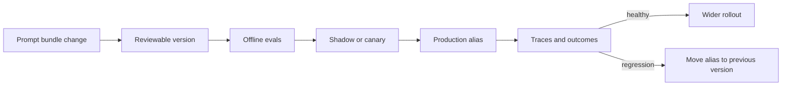
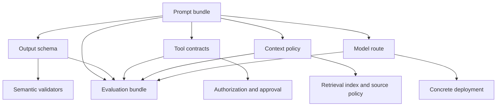
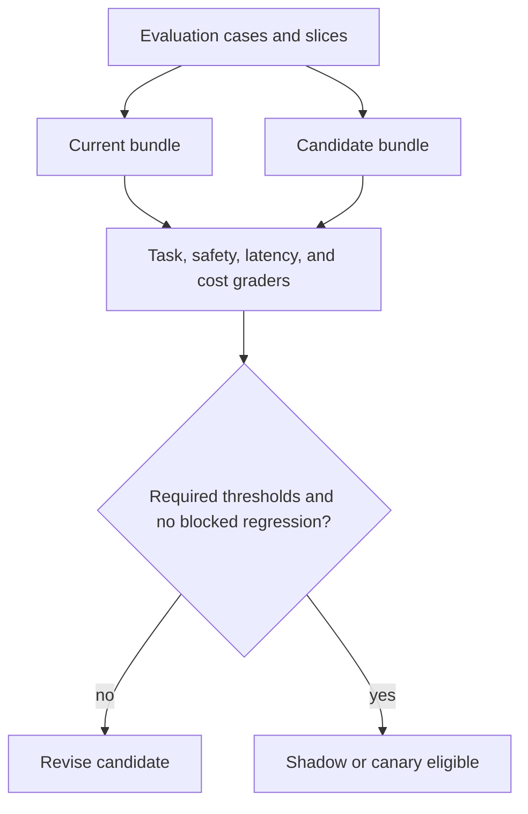
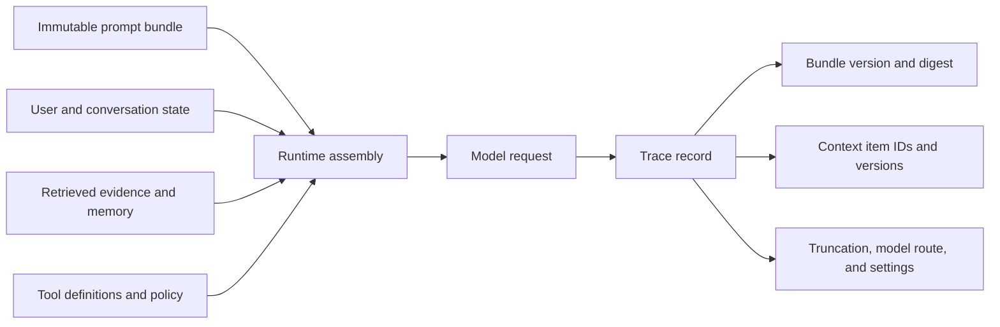

## A Prompt Change Is a Behaviour Change

<!-- section-summary: Prompt releases need software-style control because small instruction changes can alter quality, tools, cost, latency, and safety. -->

Changing a sentence in a prompt can alter which tool a model chooses, how long it answers, whether it cites evidence, or when it escalates to a person. The text may not compile, yet it still changes production behaviour. Treating prompts as anonymous strings embedded in application code makes those changes difficult to review, evaluate, trace, and reverse.

**Prompt versioning** gives each approved behaviour definition an immutable identity. **Prompt release** is the process that moves that identity through evaluation, environments, and production traffic. The release unit is wider than one text file: it includes every instruction and setting needed to reconstruct what the model received.



The goal is not to slow every edit. It is to make behaviour changes proportional to risk and reproducible when something goes wrong.

## Define the Complete Prompt Bundle

<!-- section-summary: Reproducibility requires the whole assembled behaviour contract, not only the visible system message. -->

An LLM request may combine developer instructions, a task template, few-shot examples, tool descriptions, structured-output schemas, retrieved context, tenant policy, and runtime parameters. Saving only `system_prompt.txt` does not identify the actual behaviour.

A prompt bundle should record:

- stable name, immutable version, owner, and change reason;
- developer and task instructions;
- variable names, types, and escaping rules;
- few-shot examples and their provenance;
- tool definitions or references to their versions;
- response schema and validator version;
- context assembly and truncation policy;
- model route and relevant generation or reasoning settings;
- safety, guardrail, and fallback configuration;
- evaluation dataset and release thresholds.

A manifest can bind these pieces:

```yaml
name: grounded-support-answer
version: 2026-07-16.1
owner: support-ai
instructions:
  developer: prompts/developer.md
  task: prompts/answer.md
examples: prompts/examples.jsonl
context_policy: support-context-v5
tools: [search-policy-v3, read-case-v2]
output_schema: grounded-answer-v4
model_route: standard-assistant-v7
eval_gate: support-answer-release-v12
```

The files can live in source control, a provider prompt service, or an internal registry. The important property is immutability: once `2026-07-16.1` has served traffic, changing its content in place would make old traces lie. A new content digest requires a new version.

## Map the Dependencies That Shape Behaviour

<!-- section-summary: A prompt release depends on schemas, tools, retrieval, policy, model routes, and runtime assembly, so compatibility must be checked across the whole bundle. -->

Prompt text rarely runs alone. A sentence such as “cite every policy claim” depends on retrieval returning source identifiers and the output schema having a place for citations. An instruction to “ask before issuing a refund” depends on the tool runtime exposing a proposal state and a durable approval transition. The prompt can describe the expected behaviour, while the surrounding components make that behaviour possible.

Treat these relationships as a dependency graph:



A **compatibility rule** states which versions may run together. If `grounded-answer-v4` requires citation objects, it should reject an output schema that only accepts plain strings. If a tool renamed `customer_id` to `account_ref`, the prompt and tool schema must move together or the registry must keep the older contract available. If the retrieval system no longer returns paragraph IDs, the citation instruction needs a compatible evidence format.

Store dependency constraints in the release record and resolve them before traffic reaches the candidate. Runtime resolution should return one immutable bundle identity. Silently selecting “latest” for each component creates combinations that nobody evaluated. A model alias can change underneath the prompt, a policy service can publish a new revision, and a tool can change result semantics even while the prompt file stays identical.

This also clarifies ownership. Prompt authors own the intended instruction behaviour. Tool owners own effect and result semantics. Retrieval owners own evidence availability. Domain reviewers own policy meaning. The release owner checks that one evaluated combination satisfies the product contract. A regression investigation can then start from a concrete dependency change instead of blaming whichever prompt sentence looks suspicious.

## Match the Release Path to the Risk

<!-- section-summary: Low-risk wording changes and high-impact authority changes can share infrastructure while using different review, evidence, and rollout requirements. -->

Prompt releases need proportional lanes. A copy edit that preserves meaning can use automated contract tests and a small regression suite. A change to tool selection, refusal behaviour, financial limits, personal-data handling, or human approval needs domain or security review, high-risk eval slices, and a smaller canary. The versioning system should carry a risk class and enforce the corresponding evidence rather than making every change wait for the same ceremony.

A useful release record includes the intended change, affected capabilities, risk class, owner approvals, candidate and baseline eval reports, traffic plan, alert thresholds, rollback target, and expiry for temporary exceptions. The record links evidence; it should not duplicate sensitive evaluation content into a broadly visible deployment log.

Emergency changes still need identity and evidence. If an active prompt causes harmful tool use, operators may move production to a previous bundle immediately. If a new instruction is the only safe mitigation, publish it as an immutable emergency version, require the minimum available review, restrict traffic or tools, and schedule the full evaluation afterward. Editing the live prompt in place would remove the evidence needed to understand both the incident and the mitigation.

Prompt caching affects rollout as well. Providers may reuse stable prompt prefixes according to their current caching behaviour, but a new bundle version must still resolve to the intended content and trace identity. Keep stable shared instructions early when that layout fits the task, and keep dynamic user or retrieved data later. Cache efficiency can reduce latency and cost; it should never cause two semantically different bundles to share one internal application identity.

Test the operational path before a risky release: resolve the candidate alias, reconstruct the bundle in a clean environment, run the required evals, shift a test cohort, move the alias back, and verify that new workers and conversations use the rollback version. This rehearsal checks the control plane that teams need during a real behaviour incident.

## Separate Authoring, Release, and Runtime Identity

<!-- section-summary: Draft names, immutable versions, and movable environment aliases solve different operational needs. -->

Authors need a place to iterate. Production needs immutable evidence. Operators need a stable name that can move during rollout. Use three identities:

- a **draft** is editable and not a production record;
- a **version** is an immutable bundle approved for evaluation or release;
- an **alias** such as `staging`, `canary`, or `production` points to one version.

Applications request the alias, while the resolver records the concrete version. Rollback moves the alias to a known-good version; it does not rebuild old text from memory. Environment promotion moves the same artifact from test to staging to production rather than creating a slightly different copy in each environment.

Provider-managed prompts can implement part of this model, but the application may still assemble tools, schemas, retrieved context, and policy at runtime. Keep one internal release identity that links the provider prompt version to the other bundle components.

## Make Changes Reviewable by Meaning

<!-- section-summary: A useful prompt review explains the intended behaviour change, affected slices, risks, and evidence—not only the text diff. -->

A text diff shows wording changes but not their expected consequence. Every material release should state:

- the failure or product need motivating the change;
- which behaviours should improve and which should stay invariant;
- affected task, language, risk, and customer slices;
- possible tool, latency, token, or refusal changes;
- the evals that demonstrate the intended effect;
- rollout and rollback thresholds.

Review ownership should match the change. Domain experts review policy meaning, security reviews new tool or data access, and LLMOps reviews evaluation and observability. A formatting-only change may use a lighter path than a change that alters approval or safety instructions.

Examples inside a prompt need the same scrutiny as rules. Models can follow the pattern of an example even when prose says otherwise. Verify that examples do not contain stale policy, private data, contradictory output fields, or one narrow scenario that distorts the general task.

## Evaluate the Bundle as a System

<!-- section-summary: Prompt evaluation must hold other components steady, cover important slices, and measure end-to-end behaviour. -->

Offline evaluation compares the candidate and current version on a representative dataset. Include ordinary requests, known failures, edge cases, adversarial content, missing context, tool errors, and high-risk cases. Measure the product contract: factual support, task completion, tool selection, structured-output validity, escalation, safety, latency, and total token or tool cost.

Changing the model, tools, retrieval index, and prompt simultaneously makes the result hard to attribute. Prefer controlled comparisons when possible. When the components must change together, treat them as one release bundle and evaluate the combination explicitly.



Aggregate scores can hide damage. A candidate may improve average helpfulness while reducing safety recall for one language. Define non-negotiable slice gates and review disagreements manually. Re-run evaluation when the model route, context policy, tool contracts, or important source data changes, even if the prompt text does not.

## Use Staged Traffic to Measure Real Behaviour

<!-- section-summary: Shadow and canary releases expose live input patterns while keeping blast radius and rollback time small. -->

In **shadow mode**, the candidate processes a copy of representative traffic but does not serve its result. This reveals unseen input shapes, latency, tool behaviour, and cost. Shadowing must respect privacy and avoid duplicated side effects; use read-only tools, stubs, or recorded results where needed.

In a **canary**, a small production cohort receives the candidate. Assign cohorts deterministically so a conversation does not switch versions midstream unless that transition is explicitly supported. Monitor outcome quality, escalation, refusal, tool errors, latency, cost, and support reports against the current version.

Define rollback triggers before rollout. A blocked safety failure, schema incompatibility, sharp tool-error increase, or meaningful outcome regression may stop the release immediately. Other signals may require a sustained threshold. Automatic rollback can move the production alias, but operators still need to inspect downstream effects already created.

## Reconstruct the Actual Runtime Prompt

<!-- section-summary: Traces must identify both the immutable bundle and the dynamic context that produced one request. -->

Even with an immutable bundle, each run contains dynamic values: user input, conversation state, retrieved documents, memory, tool results, time, and tenant policy. Debugging requires both the bundle version and the assembly evidence.



Record prompt name and version, content digest, model request and response identifiers, tool and schema versions, context-policy version, retrieved document or chunk IDs, memory/checkpoint identity, truncation or compaction decisions, token usage, and final outcome. Raw content capture should follow privacy, access, and retention policy; identifiers and hashes often provide enough reconstruction without copying every secret into telemetry.

Prompt reconstruction is also a testable capability. Given an approved trace fixture, the runtime should resolve the same immutable bundle and context versions. If an external source has changed, the system should clearly report that exact replay is unavailable rather than silently using current data.

## Rollback the Behaviour, Then Investigate

<!-- section-summary: Fast rollback restores a known-good bundle while trace comparison identifies which component caused the regression. -->

Rollback should be one controlled alias change with an audit record. Confirm that caches, long-running conversations, and workers do not continue using the candidate unintentionally. Decide whether active runs finish on their pinned version or restart under the previous one.

Then compare failed candidate traces with matched current traces. Check output and evaluator differences, assembled context, tool choices, truncation, refusals, token use, and latency. A "prompt incident" may actually be a changed retrieval corpus, tool schema, model alias, or tenant variable. The complete bundle and trace prevent premature blame.

Turn confirmed production failures into evaluation cases. That closes the release loop: real incidents expand the dataset that protects later versions.

## What a Production Prompt Release Provides

<!-- section-summary: Mature prompt operations make behaviour immutable, evaluated, observable, staged, and reversible. -->

A production prompt release has a complete immutable bundle, clear owner, reviewable intent, slice-aware eval gates, staged rollout, trace reconstruction, and a tested rollback path. Runtime aliases resolve to concrete versions, and every run records the bundle and dynamic context that shaped it.

The core idea is simple: prompts are part of the deployed behaviour of an LLM system. Managing only their text misses tools, schemas, context assembly, and runtime settings. Releasing the complete bundle makes improvements measurable and incidents explainable without turning prompt authoring into guesswork.

## References

- [OpenAI prompting guide](https://developers.openai.com/api/docs/guides/prompting)
- [OpenAI prompt engineering](https://developers.openai.com/api/docs/guides/prompt-engineering)
- [OpenAI evaluation best practices](https://developers.openai.com/api/docs/guides/evaluation-best-practices)
- [OpenAI agent evaluations](https://developers.openai.com/api/docs/guides/agent-evals)
- [OpenAI prompt caching](https://developers.openai.com/api/docs/guides/prompt-caching)
- [OpenTelemetry GenAI semantic conventions repository](https://github.com/open-telemetry/semantic-conventions-genai)
