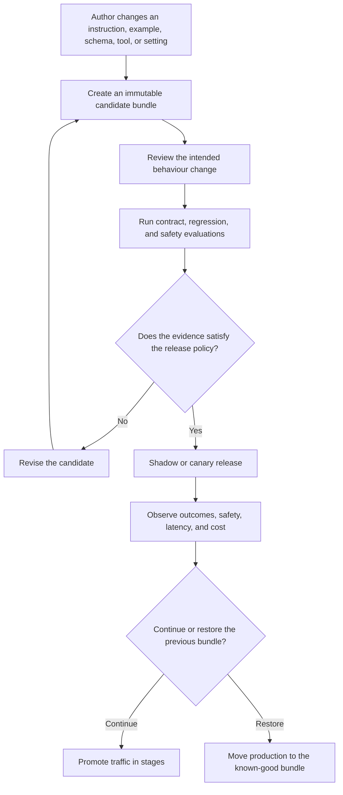
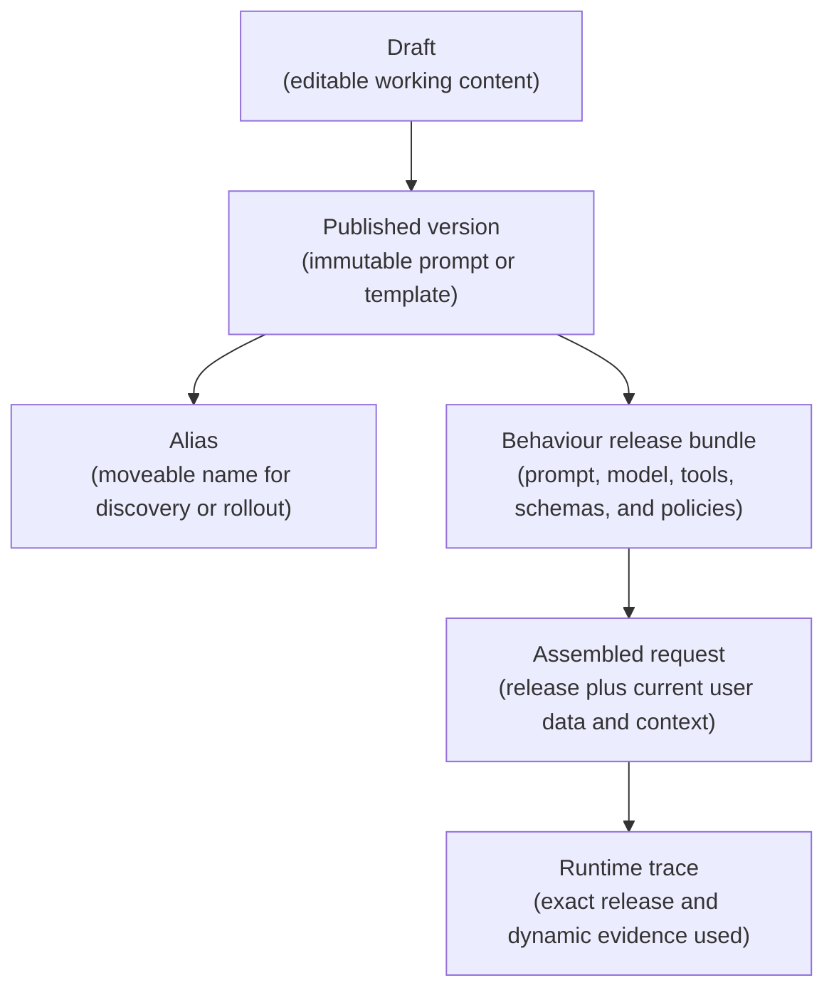
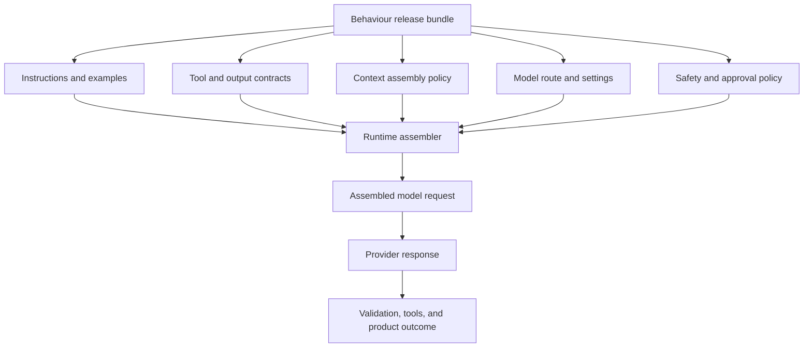
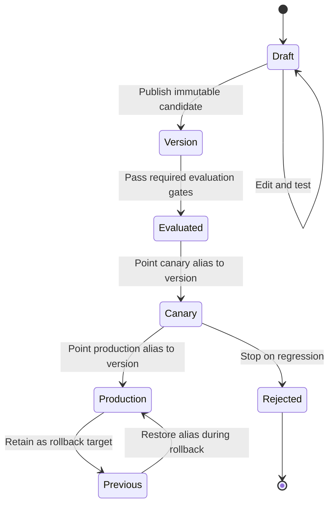
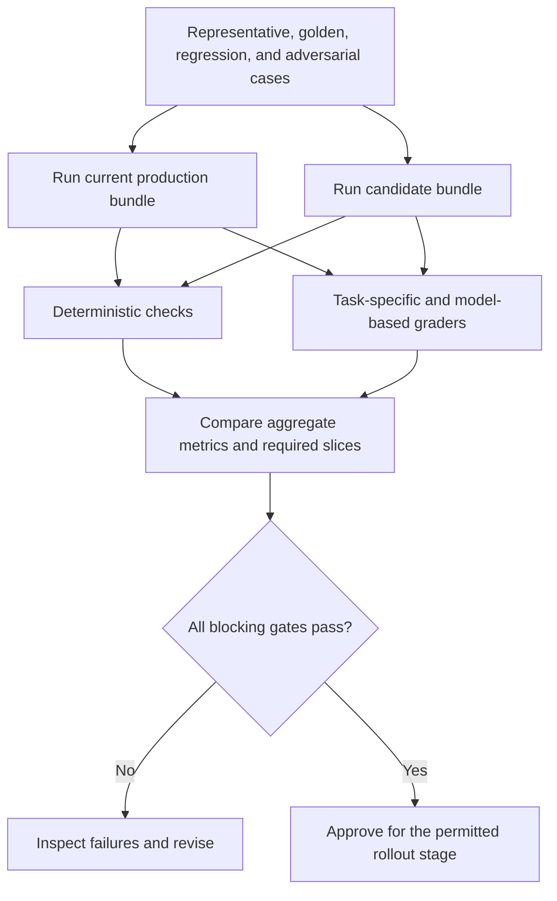
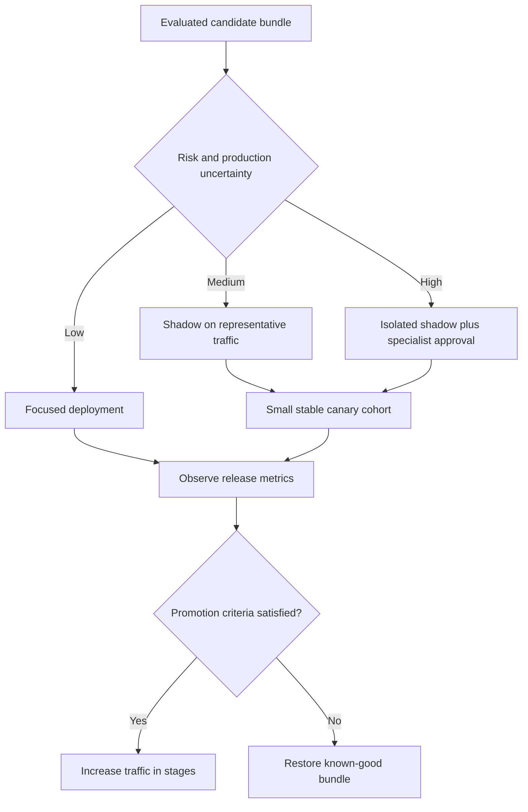
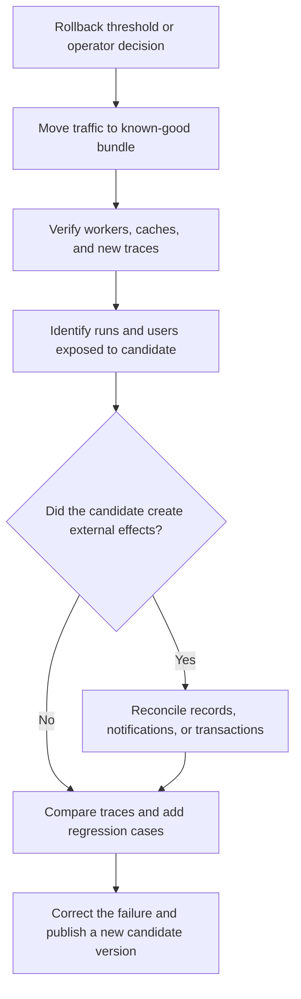
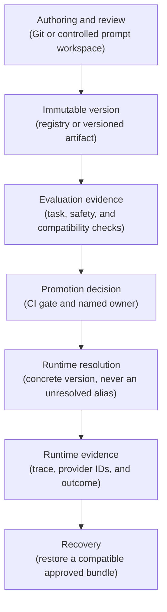

## Table of Contents

1. [Prompt Changes Alter Production Behaviour](#prompt-changes-alter-production-behaviour)
2. [Distinguish Drafts, Versions, Aliases, And Releases](#distinguish-drafts-versions-aliases-and-releases)
3. [Version Every Component That Can Change Behaviour](#version-every-component-that-can-change-behaviour)
4. [Keep Released Versions Immutable](#keep-released-versions-immutable)
5. [Drafts, Versions, Aliases, and Runtime Identity Serve Different Jobs](#drafts-versions-aliases-and-runtime-identity-serve-different-jobs)
6. [Check Compatibility Across Prompts, Schemas, Tools, And Models](#check-compatibility-across-prompts-schemas-tools-and-models)
7. [Review What A Prompt Change Does](#review-what-a-prompt-change-does)
8. [Test Expected Behaviour Before Release](#test-expected-behaviour-before-release)
9. [Use CI/CD To Block An Unsafe Release](#use-cicd-to-block-an-unsafe-release)
10. [Shadow and Canary Releases Limit Risk](#shadow-and-canary-releases-limit-risk)
11. [Traces Reconstruct the Request Without Copying Every Secret](#traces-reconstruct-the-request-without-copying-every-secret)
12. [Roll Back Compatible Components And Check Completed Actions](#roll-back-compatible-components-and-check-completed-actions)
13. [Choose Where Prompt Versions And Releases Are Stored](#choose-where-prompt-versions-and-releases-are-stored)
14. [Make Every Release Explainable And Reversible](#make-every-release-explainable-and-reversible)
15. [References](#references)

Changing an instruction can alter routing, tool use, tone, and safety behaviour even if the application code stays the same. **Prompt versioning and release** applies production discipline to those instructions so teams can review, test, deploy, and restore them deliberately.

A conventional software change may fail by refusing to compile, crashing a process, or returning an error. A prompt change can keep every endpoint healthy while changing the answers users receive. Replacing “include relevant limitations” with “keep the answer brief” may remove an important warning. Reordering tool instructions may make a model call a tool more often. Adding one example may improve one language and quietly distort another.

This is why prompt work belongs in the release process. Teams need to know which behaviour definition was tested and which one served a request. They also need a clear diff and a safe route back to the earlier behaviour.

The word *prompt* is often used for several different objects. Clear release engineering starts by separating those objects.

## Prompt Changes Alter Production Behaviour

<!-- section-summary: Prompt edits can change quality, tool use, safety, latency, and cost while the surrounding service continues to look healthy. -->

An LLM generates an output from the request it receives and the model that processes that request. Instructions influence how the model interprets the task. Examples demonstrate preferred patterns. Tool descriptions tell it which actions exist. An output schema limits the shape of its answer. Model settings influence how much work it performs and how much it costs.

Changing any of these inputs can alter production behaviour. The application may still return `200 OK`, the JSON may still parse, and the dashboards may show normal CPU and memory. The failure appears in the product experience. A required fact may be missing, an escalation may happen too late, or a tool may receive the wrong kind of request.

Consider a service that turns a long document into a short summary. A developer adds “use at most five bullets” to reduce the visual length. The change sounds cosmetic. It can still alter the service in several ways:

- long documents may lose required caveats;
- the output may become cheaper and faster because fewer tokens are generated;
- the model may merge unrelated points to stay within the limit;
- an existing evaluator may reject the new format;
- a downstream parser may expect paragraphs instead of a list.

One sentence touched quality, cost, format, and compatibility. The change deserves the same basic questions as an application release: What behaviour should improve? What behaviour must remain stable? Which tests prove that? How much live traffic should see it first? Which known-good version can replace it?


```mermaid
flowchart TD
    A["Author changes an instruction, example, schema, tool, or setting"] --> B["Create an immutable candidate bundle"]
    B --> C["Review the intended behaviour change"]
    C --> D["Run contract, regression, and safety evaluations"]
    D --> E{"Does the evidence satisfy the release policy?"}
    E -->|"No"| F["Revise the candidate"]
    F --> B
    E -->|"Yes"| G["Shadow or canary release"]
    G --> H["Observe outcomes, safety, latency, and cost"]
    H --> I{"Continue or restore the previous bundle?"}
    I -->|"Continue"| J["Promote traffic in stages"]
    I -->|"Restore"| K["Move production to the known-good bundle"]

    class A,B,F author
    class C,D evidence
    class G,H,J release
    class E,I decision
    class K restore
```

The amount of control should match the consequence of the change. A punctuation fix and a new instruction that authorizes account changes should travel through different release lanes. Both still need an identity.

## Distinguish Drafts, Versions, Aliases, And Releases

<!-- section-summary: A prompt, template, assembled request, and behaviour release bundle describe different parts of the runtime request. -->

Teams often say “prompt version” while referring to a text file, a provider object, or the complete request sent to a model. That ambiguity causes weak incident reports. “Prompt version 12 was running” provides little help if the tool schema, model route, or context policy changed independently.

A **prompt** is the general input that guides a model. Depending on the API, it may include system or developer instructions, user messages, examples, images, tool results, and other content. It is a useful everyday term, though it is too broad to identify a production release by itself.

A **prompt template** is stored text or a stored message structure with named placeholders. For example, a summarisation template may contain `{{document}}`, `{{audience}}`, and `{{maximum_words}}`. The template defines how values are placed; it does not contain the actual document for one request.

An **assembled request** is the concrete request created at runtime. It contains the rendered instructions, current user input, selected context, tool definitions, response schema, and model settings sent to the provider. Two requests may use the same template version and still contain different documents, retrieved evidence, or conversation history.

A **behaviour release bundle** is an engineering term for the immutable set of versions and policies approved to run together. It identifies the prompt template, examples, assembly code, tool and output contracts, context policy, model route, safety policy, and evaluation evidence. Vendors use different names for this idea, so teams often define their own bundle manifest.

You can think of a template as an empty form. The assembled request is one completed form with its attachments. The release bundle contains the approved form design and the rules for completing and processing it. The bundle does not freeze every user's data. It freezes the behaviour definition and records how dynamic data was selected.

For a document-summary request, the identities might look like this:

- template version `summary/18` defines the messages and placeholders;
- context policy `document-context/6` decides which pages fit into the request;
- output schema `summary-result/3` requires `summary`, `warnings`, and `source_pages`;
- model route `balanced-text/4` selects an approved model deployment and settings;
- safety policy `document-handling/5` controls sensitive-content handling;
- bundle `summary-release/27` binds those versions together;
- the runtime trace records bundle `27`, the document revision, selected page IDs, and the actual model response ID.

This vocabulary makes two questions answerable. The release record explains **what the team approved**. The trace explains **what one request actually used**.


```mermaid
flowchart TD
    Draft["Draft<br/>(editable working content)"] --> Version["Published version<br/>(immutable prompt or template)"]
    Version --> Alias["Alias<br/>(moveable name for discovery or rollout)"]
    Version --> Bundle["Behaviour release bundle<br/>(prompt, model, tools, schemas, and policies)"]
    Bundle --> Request["Assembled request<br/>(release plus current user data and context)"]
    Request --> Trace["Runtime trace<br/>(exact release and dynamic evidence used)"]
```


*The template describes the reusable form, while the release bundle binds every approved behaviour component. Runtime adds current documents and selected sources, then the trace records the concrete bundle and dynamic evidence that served the request.*

## Version Every Component That Can Change Behaviour

<!-- section-summary: Production behaviour depends on instructions, examples, schemas, tools, context assembly, model identity, settings, and safety policy. -->

The visible instruction text is only one input to an LLM system. A reliable release bundle records the other inputs that can change the result.

### Instructions and examples teach the task

**Instructions** define the task, boundaries, priorities, and response style. Their order and role matter because model APIs distinguish developer, system, user, and tool messages.

**Examples** demonstrate the pattern the model should imitate. An example can carry more practical influence than a general rule. It needs provenance, review, and a version just like the instructions.

### Contracts define what the model can exchange

**Tool schemas** describe the operations available to the model. A renamed argument, broader description, or new tool changes the choices the model can make. The actual authorization policy remains outside the prompt, yet its version still belongs in the bundle.

**Output schemas** define the machine-readable response contract. They affect prompting, validation, downstream code, and evaluation. A prompt that requests citations must be paired with a schema and validator that can represent and check citations.

### Apply Runtime Policies To The Final Request

**Context policy** decides which conversation turns, retrieved documents, memory items, and metadata enter the request. It also defines ordering, filtering, truncation, and compaction. The template may stay unchanged while a new context policy produces very different requests.

**Model identity and settings** include the provider, model snapshot or deployment, reasoning level, output limit, and other supported parameters. A movable provider alias may later resolve to a different model. Traces should record the requested route and the model identity returned by the provider.

**Safety policy** covers input filtering, output checks, data-handling rules, tool permissions, approval requirements, and fallback behaviour. Prompts can communicate safety expectations to a model; trusted code still enforces permissions and irreversible effects.


```mermaid
flowchart TD
    A["Behaviour release bundle"] --> B["Instructions and examples"]
    A --> C["Tool and output contracts"]
    A --> D["Context assembly policy"]
    A --> E["Model route and settings"]
    A --> F["Safety and approval policy"]
    B --> G["Runtime assembler"]
    C --> G
    D --> G
    E --> G
    F --> G
    G --> H["Assembled model request"]
    H --> I["Provider response"]
    I --> J["Validation, tools, and product outcome"]

    class A bundle
    class B,C,D,E,F component
    class G,H,I runtime
    class J outcome
```

A compact manifest binds these identities without copying every artifact into one file:

```yaml
bundle:
  name: document-summary
  version: 27
  digest: sha256:78f4...
prompt:
  template: summary/18
  examples: summary-examples/9
assembly_code: git:4d91c2f
contracts:
  tools: document-tools/4
  output_schema: summary-result/3
context_policy: document-context/6
model_route: balanced-text/4
safety_policy: document-handling/5
evaluation_report: evals/summary-candidate-27
```

The manifest uses references so each component can have a clear owner and lifecycle. The release pipeline resolves every reference, verifies compatibility, packages the resolved files, and computes the bundle digest. Production receives that resolved artifact. It should not assemble a fresh mixture of whatever each registry currently calls `latest`.

## Keep Released Versions Immutable

<!-- section-summary: An immutable version keeps its content fixed, while a digest proves which resolved artifact the system loaded. -->

**Immutable** means that a published version keeps the same content for its entire life. Fixing a typo in version `18` produces version `19`; it does not rewrite version `18`. This rule protects evaluation reports, traces, and incident timelines. A trace that names version `18` must continue to refer to the same bytes that were evaluated.

Human-readable versions and cryptographic digests solve related problems. A registry number such as `summary/18` is convenient for people. A digest such as SHA-256 is calculated from the resolved artifact and detects any content change. Store both in the release record.

Git supplies history, review, authorship, and commit identities for code-managed prompts. A Git commit alone may not capture remote tool schemas, provider prompt objects, model aliases, or a policy fetched during deployment. The build step should resolve those dependencies into a manifest or archive and store it in an immutable artifact location.

Common storage choices include:

- a prompt registry for prompt templates and version metadata;
- Git for templates, assembly code, schemas, tests, and review;
- an object store with versioning or retention controls for resolved bundle archives;
- an OCI registry if the organisation already treats configuration bundles as signed OCI artifacts;
- a small release database for aliases, approvals, rollout state, and audit history.

The exact combination matters less than three guarantees:

1. the released content cannot change in place;
2. the runtime can report the concrete version and digest it loaded;
3. the previous compatible artifact remains available during rollback.

Immutability supports reconstruction, though it does not promise an identical model answer. Generative models may produce different valid outputs from the same request. External documents can also disappear, tools can return new data, and providers can route an alias differently. Reproducibility here means recovering the input, dependencies, and execution identity well enough to explain and compare behaviour.

Build the bundle once and promote that same digest through test, staging, and production. Rebuilding in every environment risks picking up a new dependency between stages. If an environment needs different endpoints or credentials, inject those operational values separately and keep their policy identity in the release record.

## Drafts, Versions, Aliases, and Runtime Identity Serve Different Jobs

<!-- section-summary: Editable drafts support authoring, immutable versions preserve evidence, movable aliases control rollout, and runtime records reveal the concrete artifact used. -->

Prompt development and prompt operation need different kinds of identity. Authors need freedom to revise unfinished work. Evaluators need a fixed candidate. Operators need a stable deployment name that can move during promotion or rollback. Investigators need the concrete artifact that served one request. Drafts, versions, aliases, and runtime identities meet those separate needs.

A **draft** is editable working material. Authors may try new wording, examples, or model settings without creating permanent production evidence for every keystroke.

A **version** is a published snapshot. It has an owner, change reason, resolved content, and immutable identity. Evaluation jobs should run against a version or bundle digest.

An **alias** is a movable name such as `staging`, `canary`, or `production`. It allows an application or deployment controller to refer to an environment role instead of hard-coding a version. Moving `production` from bundle `26` to bundle `27` promotes the candidate. Moving it back performs the control-plane part of a rollback.

A **runtime identity** records what the application actually resolved. This is essential because an alias can move. A trace that records only `production` loses the evidence needed to distinguish requests served before and after promotion.


```mermaid
stateDiagram-v2
    [*] --> Draft
    Draft --> Draft: Edit and test
    Draft --> Version: Publish immutable candidate
    Version --> Evaluated: Pass required evaluation gates
    Evaluated --> Canary: Point canary alias to version
    Canary --> Production: Point production alias to version
    Canary --> Rejected: Stop on regression
    Production --> Previous: Retain as rollback target
    Rejected --> [*]
    Previous --> Production: Restore alias during rollback
```

Resolve an alias at a controlled boundary and pin the concrete version for the relevant unit of work. A stateless one-shot request can resolve it at request start. A conversation should usually retain one bundle version for the session so its instructions and schemas do not change halfway through. A long-running agent run should store the resolved bundle in durable state.

Alias caching requires an explicit policy. MLflow, for example, caches immutable version lookups differently from mutable alias lookups. An application that caches `production` forever will miss a release. One that resolves the alias before every step may switch a run unexpectedly. Choose a refresh interval, publish an invalidation event, or let the deployment system restart workers with a pinned version.

Provider capabilities also change. Current OpenAI guidance recommends code-managed prompts with typed parameters for new work. Git history, tests, evaluation checks, and feature flags provide the release controls; reusable prompt objects are being retired. Amazon Bedrock Prompt Management supports saved versions and variants that can include model and inference configuration. These are different operating models. An internal runtime identity keeps the rest of the release process consistent across them.

## Check Compatibility Across Prompts, Schemas, Tools, And Models

<!-- section-summary: Prompt, model, tool, schema, context, and safety versions must agree on the contracts they exchange. -->

Versioning each component identifies the available pieces. Compatibility determines whether those pieces can safely run together. A prompt may assume a field, tool, or model capability that another component does not provide. The release process therefore checks the relationships between versions before it evaluates or deploys the bundle.

Suppose a candidate prompt tells the model to return citation objects containing `source_id` and `claim`. The output schema must contain those fields. The retrieval policy must supply stable source IDs, and the downstream renderer must understand the list. Promoting only the prompt would create a partial release.

Rollback exposes the same issue. Imagine that the current application understands output schema `v3`, while the previous prompt produces a `v2` string field. Moving only the prompt alias may restore the old language behaviour and break the parser. The rollback target should be a previously evaluated bundle, or the application should keep a tested compatibility adapter.

Compatibility decisions usually cover four relationships:

- **prompt to model:** the model supports the required modalities, tools, structured-output features, and context size;
- **prompt to tools:** names, arguments, result shapes, meanings, permissions, and approval states agree;
- **prompt to output schema:** instructions and examples produce fields the validator and consumers understand;
- **prompt to context and policy:** required evidence exists, untrusted content is delimited, and safety rules are enforced by the runtime.

Teams can encode these requirements as a small compatibility manifest:

```yaml
compatibility:
  model_capabilities: [text, tool_calling, structured_output]
  tool_contracts:
    document_search: ">=4,<5"
  output_schema: "summary-result/3"
  context_policy: "document-context/6"
  minimum_runtime: "summary-service/11"
rollback_bundle: "summary-release/26"
```

The pipeline should verify exact versions or supported ranges before evaluation and again before promotion. Version ranges are suitable only where owners promise backward compatibility. A breaking tool or schema change needs a new major contract and an explicit bundle update.

| Dependency change | Main compatibility question | Typical protection |
|---|---|---|
| Model or deployment | Does it support the required tools, schema, modality, and settings? | Capability check plus full candidate evaluation |
| Tool schema | Do prompt names, arguments, permissions, and results still agree? | Contract tests and versioned tool adapter |
| Output schema | Can validators and downstream consumers read the result? | Schema validation and consumer tests |
| Context policy | Does the request still contain the evidence the instructions assume? | Retrieval fixtures and assembly tests |
| Safety policy | Are permissions, approvals, and blocked content enforced consistently? | Policy tests, adversarial cases, and security review |

The table summarises the boundaries. The release bundle remains the unit that proves one specific combination has been exercised together.

## Review What A Prompt Change Does

<!-- section-summary: A semantic review explains the expected behavioural effect, affected users and capabilities, evidence, risk, and rollback plan. -->

A normal text diff remains useful. It shows exactly which words, examples, or schemas changed. It cannot explain the intended effect by itself.

Consider this small edit:

```diff
- If the document contains uncertainty, mention it in the summary.
+ List each material uncertainty under `warnings`.
+ If no material uncertainty is present, return an empty `warnings` list.
```

The new instruction is more precise. It also introduces a required output field, changes the expected length, and may increase false warnings. A meaningful review checks whether the output schema contains `warnings` and defines how “material” is evaluated. It also names the behaviour that should stay constant and the dataset slices that contain uncertain documents.


*A text edit can change the data contract and every consumer around it. The release stays blocked until the schema can represent the field, context supplies its evidence, evaluation can judge it, and downstream systems can read it.*

Every material change proposal should explain:

- the observed failure or product need;
- the behaviour expected to improve;
- the behaviour expected to remain stable;
- affected languages, tasks, tools, data classes, and user groups;
- expected changes to latency, tokens, refusals, or tool calls;
- evaluation evidence and unresolved disagreements;
- risk tier, rollout plan, stop conditions, and rollback bundle.

Examples deserve close review. Models learn patterns from them, including accidental ones. First check the policy and privacy of the content. Then compare its output shape and tone with the general rule. A shortcut demonstrated by one example can undermine the written instruction.

Review ownership follows the affected boundary. A domain specialist reviews policy meaning. A tool owner reviews argument and effect semantics. Security or privacy reviewers assess new data access and authority. The LLMOps owner checks evaluation design, trace identity, and release controls.

Automated semantic checks can highlight changed tool names, placeholders, output fields, token budgets, model settings, and safety clauses. They support human review; they cannot determine the business meaning of a sentence. The pull request should place the semantic change summary beside the raw diff so reviewers can compare intent with implementation.

## Test Expected Behaviour Before Release

<!-- section-summary: Release evaluation compares a candidate with the current bundle across representative, golden, regression, and adversarial cases. -->

An **evaluation gate** is a release rule backed by measured results. The candidate can progress only after required metrics and slices meet their thresholds.

### Build cases from several sources

A strong evaluation collection contains several kinds of cases:

**Representative cases** reflect ordinary production inputs across important languages, lengths, customer segments, and task types. They estimate common behaviour.

**Golden cases** have carefully reviewed expected answers, facts, actions, or scoring criteria. They protect core requirements. “Golden” describes the quality of the reference, not a promise that only one wording is valid.

**Regression cases** come from failures the team has already found in testing or production. Each confirmed incident should leave behind a case that detects the same failure pattern.

**Adversarial cases** deliberately test prompt injection, unsafe requests, missing evidence, malformed tool results, conflicting instructions, sensitive data, and attempts to bypass approval.

Run the current production bundle and candidate against the same cases. Keep other dependencies fixed for a prompt-only comparison. If the model, tools, or context policy must move with the prompt, evaluate the complete candidate bundle and describe the comparison accordingly.


```mermaid
flowchart TD
    A["Representative, golden, regression, and adversarial cases"] --> B["Run current production bundle"]
    A --> C["Run candidate bundle"]
    B --> D["Deterministic checks"]
    C --> D
    B --> E["Task-specific and model-based graders"]
    C --> E
    D --> F["Compare aggregate metrics and required slices"]
    E --> F
    F --> G{"All blocking gates pass?"}
    G -->|"No"| H["Inspect failures and revise"]
    G -->|"Yes"| I["Approve for the permitted rollout stage"]

    class A cases
    class B,C run
    class D,E,F score
    class G,I decision
    class H fail
```

### Match each requirement to an appropriate grader

Use deterministic graders for facts that software can check directly. These include JSON validity, required fields, citation IDs, forbidden tool calls, numeric bounds, latency, and token usage.

Use task-specific scoring or calibrated model graders for qualities such as groundedness, completeness, and tone. Human review remains important for ambiguous or high-impact disagreements.

Aggregate scores can hide a blocked regression. A candidate may improve average completeness while failing on short requests in one language. Release policy should name the slices that cannot regress and the safety conditions that require a perfect pass.

A gate definition might look like this:

```yaml
candidate: summary-release/27
baseline: production
blocking_gates:
  schema_validity: 1.0
  unauthorized_tool_calls: 0
  unsupported_citations: 0
slice_gates:
  - slice: long_documents
    metric: required_fact_recall
    minimum: 0.95
  - slice: sensitive_documents
    metric: policy_compliance
    minimum: 1.0
review_sample:
  disagreements: 30
```

Thresholds should come from the product's risk tolerance and a measured baseline. Copying a number from another application gives it the appearance of precision without the supporting evidence.

## Use CI/CD To Block An Unsafe Release

<!-- section-summary: A release pipeline resolves dependencies, builds one immutable bundle, runs evaluations, records evidence, and promotes the same artifact. -->

CI/CD connects prompt review to a repeatable deployment. The pipeline does more than upload text. It produces the evidence that the candidate is complete and eligible for a specific environment.

### Build The Release Once And Test That Exact Version

A practical pipeline performs these steps:

1. validate template placeholders, message roles, schemas, and manifests;
2. resolve tool, context, model, and safety dependencies;
3. package one immutable bundle and calculate its digest;
4. run contract tests and offline evaluations against that digest;
5. publish the artifact and evaluation report;
6. request the approvals required by the risk tier;
7. move a shadow or canary alias to the candidate;
8. promote traffic gradually or restore the rollback alias.

GitHub Actions environments can require a reviewer before a deployment job starts. They can also restrict deployment branches and protect environment secrets. Each environment deployment appears in the repository's deployment history. GitLab CI, Jenkins, and cloud-native pipelines can implement the same control pattern.

The deployment job should receive the artifact digest that passed evaluation. Rebuilding the candidate inside that job could resolve a different dependency.

```yaml
name: release-prompt-bundle
on:
  pull_request:
    paths: ["prompts/**", "schemas/**", "evals/**", "ops/**", "pyproject.toml", "uv.lock", ".github/workflows/release-prompt-bundle.yml"]
  push:
    branches: [main]
    paths: ["prompts/**", "schemas/**", "evals/**", "ops/**", "pyproject.toml", "uv.lock", ".github/workflows/release-prompt-bundle.yml"]

permissions:
  contents: read

jobs:
  evaluate:
    runs-on: ubuntu-latest
    steps:
      - uses: actions/checkout@v6
      - uses: astral-sh/setup-uv@v8
      - run: uv run --frozen pytest tests/prompt_contracts
      - run: uv run --frozen python ops/build_bundle.py --out dist/bundle.tar.gz
      - run: uv run --frozen python evals/compare.py --candidate dist/bundle.tar.gz --baseline production
      - uses: actions/upload-artifact@v7
        with: { name: evaluated-bundle, path: dist/ }

  release-canary:
    needs: evaluate
    if: github.event_name == 'push' && github.ref == 'refs/heads/main'
    environment: prompt-canary
    runs-on: ubuntu-latest
    steps:
      - uses: actions/checkout@v6
      - uses: astral-sh/setup-uv@v8
      - uses: actions/download-artifact@v8
        with: { name: evaluated-bundle, path: dist/ }
      - run: uv run --frozen python ops/promote.py --artifact dist/bundle.tar.gz --alias canary
```

The pull-request run produces review evidence without deploying. After the same change reaches `main`, the pipeline repeats the evaluation and allows the canary job to run. That job checks out the exact workflow commit and installs uv. Each `uv run --frozen` command creates or uses the project environment from the committed lockfile without changing it. The job also downloads the artifact created by its `evaluate` dependency. The promotion script and its locked environment are therefore present, while the tested bundle is downloaded and promoted without another build.

The Python commands represent application-specific release logic; GitHub Actions supplies the standard source, artifact, approval, and environment controls around it. The major tags keep the tutorial readable. A production supply-chain policy may pin every third-party action to a reviewed full commit SHA. The promotion job should also receive only the deployment credentials and permissions it needs.

Store the candidate digest, baseline digest, source commit, evaluation report, reviewer decisions, risk tier, canary plan, thresholds, and rollback target in the release record. This record lets an incident reviewer connect a production trace to the exact evidence that allowed the version to ship.

## Shadow and Canary Releases Limit Risk

<!-- section-summary: Risk-tiered shadowing and canaries expose candidates to realistic inputs while limiting who can see their outputs and what effects they may create. -->

Offline evaluations are built from known data. Production traffic contains new phrasing, document lengths, languages, and interaction patterns. Staged rollout tests the candidate against that reality without sending it to everyone at once.

### Shadow traffic reveals unseen inputs

In **shadow mode**, the candidate receives a copy of selected live inputs while the current version continues to serve users. The candidate output is stored for comparison and never drives the product response. Shadowing can reveal latency, token cost, schema failures, and unexpected input patterns.

Shadow mode needs effect isolation. A copied agent request must never send a second email, create a duplicate ticket, or charge an account. Read-only adapters can replace effectful tools. Recorded results and validation-only stubs are also useful.

Sensitive inputs require the same privacy policy as the serving path. Apply its consent and access rules, keep data in the approved region, and enforce the same retention period.

### Canary traffic measures user-facing behaviour

In a **canary release**, a small production cohort receives the candidate. Cohort assignment should be stable for a user, conversation, tenant, or workflow. Stable assignment prevents a multi-turn interaction from switching instructions halfway through and supports a clean comparison with the current bundle.

The release plan defines success metrics, blocking failures, observation time, minimum sample, traffic stages, and rollback owner before the canary starts. Monitor product outcomes alongside service signals: task completion, supported facts, escalation, refusal, tool errors, latency, token use, and user feedback.

| Risk tier | Example change | Typical evidence and rollout |
|---|---|---|
| Low | Spelling or presentation change with no contract impact | Contract tests, focused regression set, normal deployment |
| Medium | New examples, context ordering, output behaviour, or tool-selection guidance | Full offline suite, shadow comparison, small canary, staged promotion |
| High | Safety policy, sensitive data handling, approval logic, or effectful tool authority | Domain and security review, adversarial gates, isolated shadow, tightly bounded canary, explicit human approval |

These lanes share one release system. The risk tier changes the required evidence and blast radius.


```mermaid
flowchart TD
    A["Evaluated candidate bundle"] --> B{"Risk and production uncertainty"}
    B -->|"Low"| C["Focused deployment"]
    B -->|"Medium"| D["Shadow on representative traffic"]
    B -->|"High"| E["Isolated shadow plus specialist approval"]
    D --> F["Small stable canary cohort"]
    E --> F
    C --> G["Observe release metrics"]
    F --> G
    G --> H{"Promotion criteria satisfied?"}
    H -->|"Yes"| I["Increase traffic in stages"]
    H -->|"No"| J["Restore known-good bundle"]

    class A start
    class B,H choice
    class C,D,E,F,G,I stage
    class J stop
```

Some failures justify immediate automatic rollback, such as a blocked safety violation, an incompatible output schema, or a sharp increase in unauthorized tool attempts. More ambiguous quality signals may need a sustained threshold and human review. Automated promotion should wait for enough evidence; an empty error dashboard after a few requests says little about answer quality.

## Traces Reconstruct the Request Without Copying Every Secret

<!-- section-summary: Runtime traces join the resolved behaviour bundle with dynamic context, provider identity, validation, tools, and outcomes under a deliberate privacy policy. -->

A release record describes the approved bundle. A **trace** describes one execution. The trace follows the request across the application. Its spans record individual operations such as context retrieval, model inference, validation, and tool execution.

### Record identities before content

For prompt release work, the trace should connect four kinds of evidence:

1. the resolved bundle version, digest, source commit, and deployment environment;
2. the context policy, selected source IDs, memory or conversation checkpoint, and truncation decisions;
3. the requested model route, actual provider model identity, request and response IDs, settings, tokens, and latency;
4. the output schema, validation result, tool contract versions, tool calls, policy decisions, and product outcome.

OpenTelemetry supplies the trace model and common semantic names for services and model operations. Its generative-AI semantic conventions continue to evolve, so instrumentation libraries may support different convention versions. Record standard attributes exposed by the chosen instrumentation and place application-owned release fields in an application namespace instead of inventing new `gen_ai.*` names.

```python
with tracer.start_as_current_span("summary.generate") as span:
    span.set_attribute("app.llm.bundle.name", bundle.name)
    span.set_attribute("app.llm.bundle.version", bundle.version)
    span.set_attribute("app.llm.bundle.digest", bundle.digest)
    span.set_attribute("app.llm.context_policy.version", bundle.context_policy)
    span.set_attribute("app.llm.output_schema.version", bundle.output_schema)

    response = model_client.generate(assembled_request)
    span.set_attribute("gen_ai.response.model", response.model)
    span.set_attribute("app.llm.provider_response.id", response.id)
```

The application fields complement standard service and generative-AI attributes. The exact provider response shape varies, so production instrumentation should use the SDK's supported response ID and model fields.

Raw prompts, user messages, retrieved text, tool arguments, and model outputs can contain personal data, credentials, confidential documents, or attacker-controlled content. Capturing all of it in a broadly accessible tracing system creates a second sensitive data store.

A safer default records immutable identities and digests. Lengths, policy decisions, source IDs, and validation outcomes add useful operational detail.

If a team needs content for debugging or quality review, it can capture a sampled and redacted copy in a restricted store. That store needs explicit access, retention, encryption, and deletion controls. Hashes can confirm that two artifacts match; they cannot recover content that was never retained.

Reconstruction should be tested. Given a trace fixture, the runtime should resolve the same bundle digest and explain which dynamic sources were used. Exact replay may be impossible after an external document changes or a provider model is retired. The trace should report that limitation instead of silently substituting current data.

## Roll Back Compatible Components And Check Completed Actions

<!-- section-summary: Rollback restores a known-good compatible bundle, while reconciliation handles requests and external effects already produced by the candidate. -->

A prompt rollback starts by moving traffic to a known-good bundle. That action may be an atomic alias update, a feature-flag change, a deployment rollback, or a worker restart with the earlier digest. The mechanism should be rehearsed before an incident.

The rollback target must still be compatible with the running application. Keep the earlier output validator, tool adapter, and model route available for the rollback window, or package them inside the bundle. If a database or external API no longer accepts the old contract, prepare a compatibility adapter during the forward release.

Active work needs a clear rule. One-shot requests can use the restored version on their next invocation. Conversations and long-running agent runs may finish on their pinned bundle, pause for review, or restart under a migration path. Quietly changing instructions inside an active run makes its later trace difficult to interpret and can invalidate previously generated state.

Also account for caches. Invalidate alias caches, confirm that each worker resolves the expected version, and query traces for the candidate digest after rollback. A control-plane update is incomplete while part of the fleet still serves the candidate.


```mermaid
flowchart TD
    A["Rollback threshold or operator decision"] --> B["Move traffic to known-good bundle"]
    B --> C["Verify workers, caches, and new traces"]
    C --> D["Identify runs and users exposed to candidate"]
    D --> E{"Did the candidate create external effects?"}
    E -->|"No"| F["Compare traces and add regression cases"]
    E -->|"Yes"| G["Reconcile records, notifications, or transactions"]
    G --> F
    F --> H["Correct the failure and publish a new candidate version"]

    class A trigger
    class B,E control
    class C,D,F inspect
    class G,H recover
```

Restoring a prompt does not undo an email, ticket, account update, or payment already created by the candidate. Reconciliation finds those effects through trace IDs and idempotency keys. Audit logs and domain records show what reached the external system. Operators can then cancel, correct, notify, or send the case for human review.

After containment, compare candidate and known-good traces. Inspect assembled context, model identity, output validation, tool choices, policy decisions, latency, and outcomes. The apparent prompt regression may originate from retrieval, a model alias, or a tool change. Add confirmed failure patterns to the regression set before publishing the corrected bundle.

## Choose Where Prompt Versions And Releases Are Stored

<!-- section-summary: Git, prompt registries, provider services, object stores, and deployment controls cover different parts of the release lifecycle. -->

There is no requirement to buy a dedicated prompt platform before versioning prompts well. A small team can keep typed prompt helpers in Git and review them through pull requests. An evaluation job creates evidence, an immutable object store holds bundles, and a database or feature flag controls promotion. This approach keeps prompts close to the application code that assembles them.

### Code-managed prompts fit application-owned behaviour

Git works well where prompts change with assembly code, schemas, or tests. Pull requests keep the behaviour change beside the application change. An evaluation job creates the release evidence, and a feature flag or alias controls rollout.

### Prompt registries support shared operations

A prompt registry is a good fit for prompts shared across several applications. It can also provide controlled authoring for colleagues who do not work in the application repository. Central discovery, aliases, comparisons, lineage, and permissions reduce duplicated operational work.

MLflow Prompt Registry supports immutable prompt-template versions, comparisons, aliases, and integration with MLflow tracing and evaluation. Its prompt object can also carry response formats and model configuration. Current MLflow documentation allows model configuration to be updated on an existing prompt version. A fully immutable release should therefore freeze the resolved model settings in a separate bundle manifest and digest.

Amazon Bedrock Prompt Management supports reusable prompts with variables and saved versions. Its variants can include a model and inference configuration. It fits teams already operating their application through Bedrock. Tool contracts, application assembly code, context policy, and external safety controls still need identities outside the provider prompt object.

OpenAI's current direction for new applications is code-managed prompt helpers with typed inputs and direct API requests. Git review, tests, evaluations, and feature flags provide the release path. Teams using reusable OpenAI prompt objects should migrate their content into that path because the object lifecycle is being retired.

| Release concern | Common industrial choice |
|---|---|
| Authoring and code review | GitHub or GitLab pull requests with code owners |
| Shared prompt versions and aliases | MLflow Prompt Registry or a provider prompt service |
| Resolved immutable bundle | Versioned object storage, artifact registry, or signed release archive |
| Evaluation | Task-specific Python test suite, MLflow evaluation, or provider evaluation service |
| Promotion and approval | GitHub Actions, GitLab CI, Jenkins, or a cloud deployment pipeline |
| Traffic control | Feature flags, gateway routing, service configuration, or registry aliases |
| Runtime evidence | OpenTelemetry traces plus provider request and response identities |

The tools can vary across organisations. The operating model should still answer the same questions: Who can edit a draft? What makes a version immutable? Which evidence permits promotion? How does runtime resolve and record the concrete version? How quickly can operators restore a compatible bundle?


```mermaid
flowchart TD
    Author["Authoring and review<br/>(Git or controlled prompt workspace)"] --> Version["Immutable version<br/>(registry or versioned artifact)"]
    Version --> Evaluate["Evaluation evidence<br/>(task, safety, and compatibility checks)"]
    Evaluate --> Approve["Promotion decision<br/>(CI gate and named owner)"]
    Approve --> Resolve["Runtime resolution<br/>(concrete version, never an unresolved alias)"]
    Resolve --> Observe["Runtime evidence<br/>(trace, provider IDs, and outcome)"]
    Observe --> Recover["Recovery<br/>(restore a compatible approved bundle)"]
```

## Make Every Release Explainable And Reversible

<!-- section-summary: Mature prompt release engineering connects one reviewed change to one evaluated artifact, one controlled rollout, and one reconstructable runtime identity. -->

Prompt versioning is useful because LLM behaviour depends on more than a visible block of prose. Templates, examples, tools, schemas, context assembly, model settings, and safety policy work together to shape the result.

A production release gives that complete combination an immutable bundle identity. Reviewers examine the intended behavioural change. Evaluation gates protect core, regression, and adversarial cases. CI/CD packages and promotes the same tested digest. Shadow and canary stages limit exposure. Traces connect real requests to the bundle and dynamic context. Rollback restores a compatible known-good artifact and reconciliation handles effects that already occurred.

With those controls in place, the team can answer the questions that matter during normal improvement and during an incident: What changed? Why was it approved? Which users saw it? Did it improve the intended behaviour? Which artifact can safely replace it?


*Build and evaluate one resolved artifact, then limit its live exposure according to risk. Promotion increases traffic only after live criteria pass; restoration returns future requests to the compatible known-good bundle, while verification finds exposed requests and reconciles effects already created.*

## References

- [OpenAI prompting guide](https://developers.openai.com/api/docs/guides/prompting)
- [OpenAI evaluation best practices](https://developers.openai.com/api/docs/guides/evaluation-best-practices)
- [OpenAI agent evaluations](https://developers.openai.com/api/docs/guides/agent-evals)
- [MLflow Prompt Registry](https://mlflow.org/docs/latest/genai/prompt-registry/)
- [Amazon Bedrock Prompt Management](https://docs.aws.amazon.com/bedrock/latest/userguide/prompt-management.html)
- [GitHub Actions deployment environments](https://docs.github.com/en/actions/concepts/workflows-and-actions/deployment-environments)
- [GitHub checkout action](https://github.com/actions/checkout)
- [GitHub artifact actions](https://github.com/actions/upload-artifact)
- [Astral setup-uv action](https://github.com/astral-sh/setup-uv)
- [OpenTelemetry semantic conventions](https://opentelemetry.io/docs/specs/semconv/)
- [OpenTelemetry generative AI semantic conventions repository](https://github.com/open-telemetry/semantic-conventions-genai)
