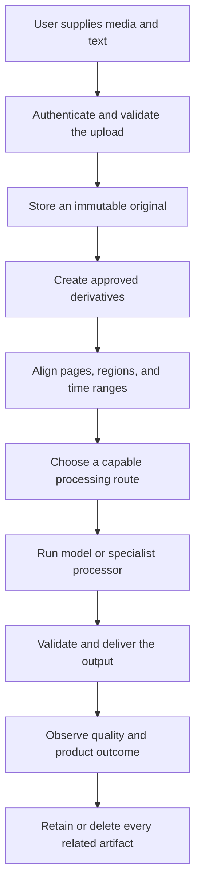
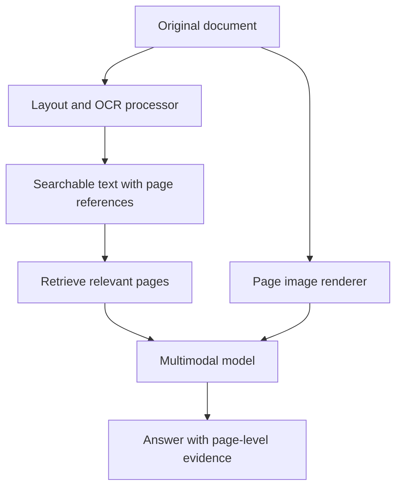
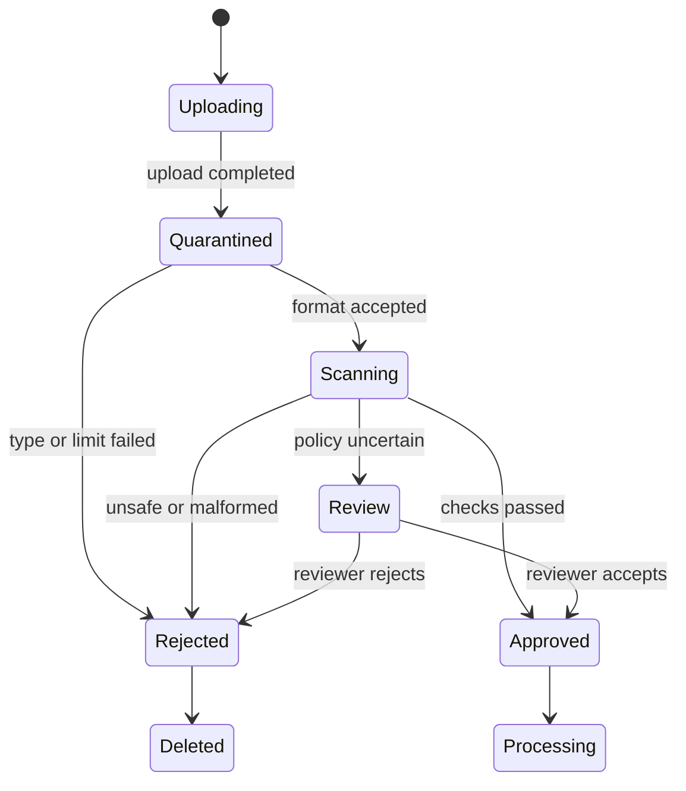
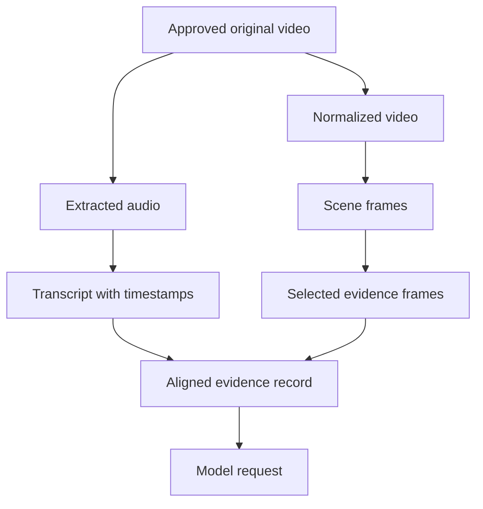
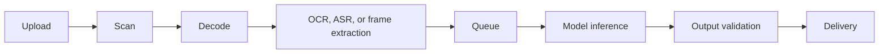
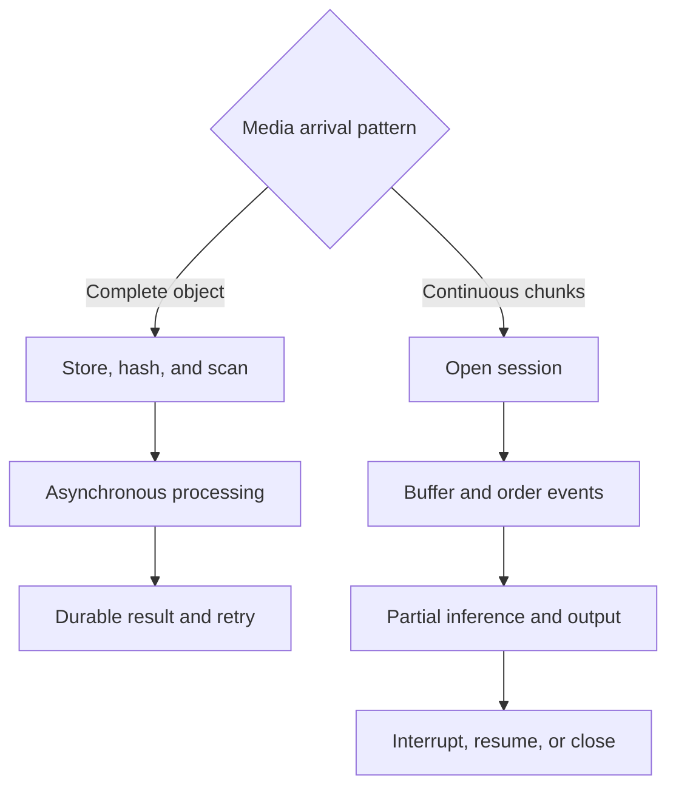
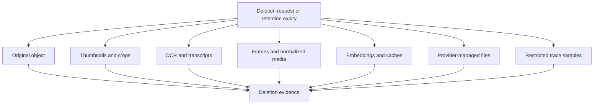
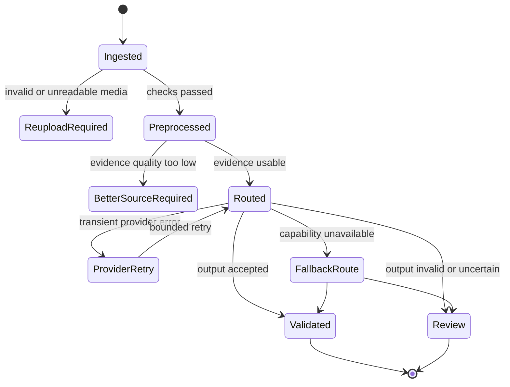
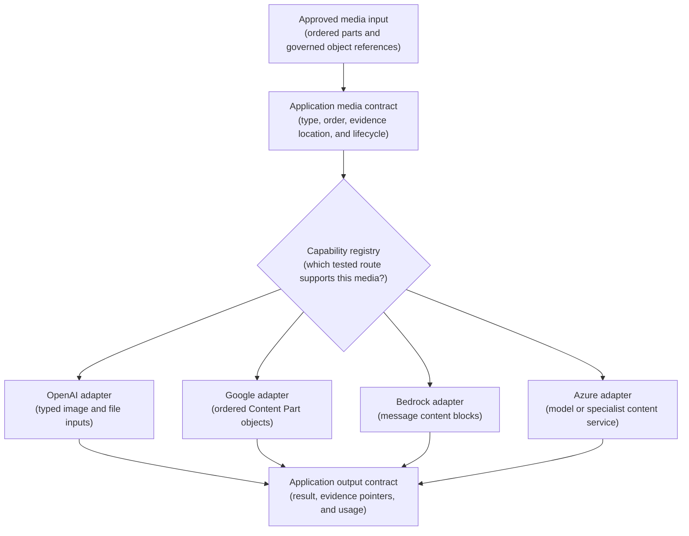

## Table of Contents

1. [What Changes When An Application Adds Images, Audio, Or Video](#what-changes-when-an-application-adds-images-audio-or-video)
2. [Choose How The System Processes Media](#choose-how-the-system-processes-media)
3. [Represent Inputs As Ordered Content Parts](#represent-inputs-as-ordered-content-parts)
4. [Validate And Store Uploaded Media Safely](#validate-and-store-uploaded-media-safely)
5. [Link Original Media To Derived Artifacts](#link-original-media-to-derived-artifacts)
6. [Preserve Order And Timing Across Modalities](#preserve-order-and-timing-across-modalities)
7. [Route Media To Capable Models And Tools](#route-media-to-capable-models-and-tools)
8. [Plan Media Cost And Latency](#plan-media-cost-and-latency)
9. [Validate And Govern Generated Media](#validate-and-govern-generated-media)
10. [Handle Uploaded Media And Live Streams Differently](#handle-uploaded-media-and-live-streams-differently)
11. [Design Accessibility and Fallbacks](#design-accessibility-and-fallbacks)
12. [Delete Sensitive Media From Every Storage Layer](#delete-sensitive-media-from-every-storage-layer)
13. [Monitor And Evaluate The Complete Media Pipeline](#monitor-and-evaluate-the-complete-media-pipeline)
14. [Recover At The First Failed Stage](#recover-at-the-first-failed-stage)
15. [Use A Common Contract Across Provider APIs](#use-a-common-contract-across-provider-apis)
16. [How A Production Multimodal System Fits Together](#how-a-production-multimodal-system-fits-together)
17. [References](#references)

**Multimodal** means working with information in more than one form. Text is one modality. Images, audio, and video are other modalities. A document is usually a container that combines several of them: written text, page layout, tables, diagrams, and scanned images.

An uploaded scan or recording passes through storage, preprocessing, a model, and the product interface before the user receives an answer. A multimodal application must preserve the media's meaning across that path. The surrounding system still has to verify the file type, identify the supporting page or time range, choose a capable model, control access and cost, and handle silent recordings or unreadable scans.

These questions explain why adding an image field to a text API changes much more than the request body. The application gains a media pipeline with new security, storage, processing, routing, evaluation, accessibility, and deletion responsibilities.

## What Changes When An Application Adds Images, Audio, Or Video

<!-- section-summary: Images, audio, video, and documents add media-specific responsibilities across ingestion, storage, processing, model routing, output delivery, and lifecycle management. -->

A **system contract** defines a service's promises. It describes accepted inputs, expected outputs, and behavior around failure. A text-only contract can often describe inputs with a character limit and an encoding.

Media needs more information. An image has dimensions and orientation. Audio has duration, channels, and a sample rate. Video has a frame rate, an audio track, and a timeline. A document has pages and layout. It may also contain embedded objects or active content.

You can think of each modality as adding a new set of questions to every stage of the application:

- **Transport:** will clients upload bytes directly, send an object reference, or use a provider-managed file?
- **Validation:** which formats, decoded dimensions, durations, page counts, and codecs are accepted?
- **Processing:** should the system resize an image, transcribe audio, extract document layout, or sample video frames?
- **Inference:** which model accepts the required input and produces the required output?
- **Evidence:** how does an answer point back to a page, region, timestamp, or frame?
- **Operations:** which dimensions predict cost, latency, and failure?
- **Governance:** how long may originals, transcripts, thumbnails, and model traces remain?

The model call sits near the middle of this larger contract:


```mermaid
flowchart TD
    A["User supplies media and text"] --> B["Authenticate and validate the upload"]
    B --> C["Store an immutable original"]
    C --> D["Create approved derivatives"]
    D --> E["Align pages, regions, and time ranges"]
    E --> F["Choose a capable processing route"]
    F --> G["Run model or specialist processor"]
    G --> H["Validate and deliver the output"]
    H --> I["Observe quality and product outcome"]
    I --> J["Retain or delete every related artifact"]
```

For example, a support form may accept a screenshot beside a written question. The screenshot adds type detection, pixel limits, privacy checks, image-capable routing, visual-quality evaluation, and an accessible text alternative. The same product promise now depends on all of those parts.

## Choose How The System Processes Media

<!-- section-summary: Production systems use native multimodal models, specialist preprocessing, tool-mediated analysis, or a deliberate combination of all three. -->

There are three common ways to turn media into useful evidence. Teams often combine them because each method preserves different information.

### Native multimodal processing

A **native multimodal model** receives an image, audio clip, video, or document as a typed input part. The model can reason across the media and accompanying text in one request. This route helps with visual arrangement, tone of voice, and relationships between objects. It can also preserve the meaning of a diagram that plain OCR would struggle to capture.

Suppose a user asks why a warning dialog appeared. A vision-capable model can inspect the dialog, the disabled button, and the surrounding interface together. OCR alone may recover every visible word while losing the layout that explains which message belongs to which control.

Native processing also has limits. Media tokenization and resizing are provider-specific. Exact coordinates or word timestamps may be weak or unavailable. A confident description can still be wrong. Production systems keep model observations tied to the source and use task-specific evaluation.

### Specialist preprocessing

**Preprocessing** converts media into a more explicit representation before the main model sees it. Optical character recognition (OCR) extracts text and layout from images or documents. Automatic speech recognition (ASR) creates a transcript from audio. Video processing can separate the audio track, identify scene changes, and select representative frames.

This route is valuable for search, audit, and exact references. An invoice workflow may need stable field coordinates, page numbers, and confidence scores. A specialized document processor can produce those details more predictably than a general conversation model. The resulting text is also cheaper to search repeatedly than the full document.

Preprocessing can remove useful context. A transcript may omit pauses and tone. OCR can flatten a table or confuse reading order. Frame sampling can miss a brief event between selected frames. The derivative therefore stays linked to the original.

### Tool-mediated analysis

In a **tool-mediated** design, the main model asks a specialist service to perform a bounded job. One tool may crop a region, another may transcribe ten seconds of audio, and another may retrieve a document page. This keeps expensive media operations behind clear permissions, timeouts, and schemas.

A practical hybrid combines both paths:


```mermaid
flowchart TD
    A["Original document"] --> B["Layout and OCR processor"]
    A --> C["Page image renderer"]
    B --> D["Searchable text with page references"]
    D --> E["Retrieve relevant pages"]
    E --> F["Multimodal model"]
    C --> F
    F --> G["Answer with page-level evidence"]
```

For a long report, the system can index extracted text and retrieve three relevant pages. It sends those page images and the question to a multimodal model. The OCR route supplies searchable evidence; the page images preserve charts and layout; the model reasons over a bounded set of material.

The choice follows the task. Use native processing for meaning that depends on the original media. Use specialist processing for deterministic extraction and search. Tools support selective work inside a larger workflow.


*The route follows the evidence the task needs: native processing preserves original-media meaning, specialist derivatives support search and precise references, and bounded tools perform selective work.*

## Represent Inputs As Ordered Content Parts

<!-- section-summary: A normalized content-part envelope gives every provider adapter the same information about media type, location, provenance, alignment, and access policy. -->

Provider APIs use different names for the same core structure. Most multimodal messages contain an ordered list of **content parts**. One part may contain instructions, another an image, and another a short question about that image.

A content part is the application's provider-neutral description of one piece of evidence. It answers five questions:

1. What kind of content is this?
2. Where are its approved bytes?
3. Which original and transformation produced it?
4. Where does it belong in the page or timeline?
5. Which people and processors may access it?

A compact manifest can carry those answers:

```yaml
request_id: mmreq_01J...
parts:
  - part_id: instructions
    position: 1
    kind: text
    trust: application_instruction
    text: "Compare the label with the written product description."

  - part_id: label_crop
    position: 2
    kind: image
    trust: user_content
    object_ref: "media://tenant-42/object-781/derivatives/label-v2"
    detected_mime_type: image/webp
    byte_size: 284193
    sha256: "..."
    dimensions: {width: 1600, height: 900}
    provenance:
      parent_part_id: original_photo
      transform: "autorotate-and-crop@2"
    access:
      classification: confidential
      allowed_processors: [vision-route]
      expires_at: "short-lived-policy-value"

  - part_id: question
    position: 3
    kind: text
    trust: user_content
    text: "Do the quantity and unit match?"
```

The manifest stores an internal object reference rather than a durable signed URL. The service resolves that reference immediately before processing and issues short-lived access. Signed URLs act like bearer credentials: anyone who possesses one can use its permissions until it expires.

`detected_mime_type` records the type established from the bytes and a trusted parser. The type declared by a browser is useful as a hint, though it cannot prove what the file contains. The hash identifies the exact bytes. Provenance identifies how a derivative was made. Two transformations can produce different results from the same original. Byte-identical files can also belong to different users or retention policies. These cases require both fields.

The `trust` field prevents another common mistake. Words found in a document, image, filename, or transcript are untrusted content. They stay separate from application instructions even if they look like commands. For example, a document named “ignore previous rules” receives a neutral internal name at the provider boundary.

## Validate And Store Uploaded Media Safely

<!-- section-summary: The ingestion boundary authenticates uploads, verifies their real format, limits decoded work, scans risky content, and promotes only approved objects into production storage. -->

Media parsers process complex binary formats. An upload therefore remains untrusted until it passes the ingestion boundary. The boundary protects the application from malformed files, parser exploits, oversized decoded content, and accidental policy violations.

A robust flow uses a staging or **quarantine** area. Quarantine means that the bytes exist in restricted storage but no model worker or ordinary application service may read them yet.


```mermaid
stateDiagram-v2
    [*] --> Uploading
    Uploading --> Quarantined: upload completed
    Quarantined --> Rejected: type or limit failed
    Quarantined --> Scanning: format accepted
    Scanning --> Rejected: unsafe or malformed
    Scanning --> Approved: checks passed
    Scanning --> Review: policy uncertain
    Review --> Approved: reviewer accepts
    Review --> Rejected: reviewer rejects
    Approved --> Processing
    Rejected --> Deleted
```

The checks occur in a deliberate order:

1. Authenticate the uploader and apply tenant quotas.
2. Stream bytes into restricted storage while calculating size and a cryptographic hash.
3. Compare the filename extension, declared MIME type, file signature, and trusted parser result.
4. Decode through a sandboxed, resource-limited worker.
5. Enforce limits on decoded pixels, pages, duration, frame count, nesting depth, and compression ratio.
6. Run malware scanning. For supported formats, **content disarm and reconstruction** rebuilds a safe copy after removing active or suspicious elements. Add content-safety review according to the file type and business risk.
7. Remove unnecessary metadata, then promote the approved original to its governed location.

Byte size alone offers weak protection. A small compressed image can expand into an enormous pixel buffer. Image libraries such as Pillow expose decompression-bomb protection because decoded pixels consume memory even if the uploaded file looks small. Archives, XML-based office files, PDFs, audio codecs, and video containers have their own expansion and parser risks.

Consider a photo upload that is only a few megabytes on disk but declares dimensions large enough to require several gigabytes after decoding. The ingestion worker should reject it before generating thumbnails or calling a model. Retrying the model would waste time because the failure belongs to file validation.

The accepted-format list should be narrow and based on a real product need. A service that needs JPEG, PNG, and PDF gains little from accepting every image, archive, and office format. Each additional parser increases the security and operational surface.


*A governed media request separates trusted instructions from untrusted user content while preserving the original bytes, derivative provenance, part order, access rules, route capability, and source evidence.*

## Link Original Media To Derived Artifacts

<!-- section-summary: Immutable originals, versioned derivatives, and explicit provenance make media processing reproducible, cacheable, reviewable, and deletable. -->

A **derived artifact** is any object created from an original: a thumbnail, normalized audio track, transcript, OCR result, page image, redacted copy, video frame, embedding, or model-ready crop. Derivatives make processing faster and safer, but they can carry the same sensitive information as the original.

Store the approved original as an immutable object. A preprocessing worker writes each derivative to a new location and records the source hash, transform name, transform version, and output hash. It never silently replaces the original. This creates a provenance graph:


```mermaid
flowchart TD
    A["Approved original video"] --> B["Normalized video"]
    A --> C["Extracted audio"]
    B --> D["Scene frames"]
    C --> E["Transcript with timestamps"]
    D --> F["Selected evidence frames"]
    E --> G["Aligned evidence record"]
    F --> G
    G --> H["Model request"]
```

For example, a later decoder upgrade might change frame selection. The team can compare `scene-sampler@3` against `scene-sampler@4` because both outputs point to the same original. Existing answers remain reproducible through the recorded version.

Object storage such as Amazon S3, Google Cloud Storage, or Azure Blob Storage is the common foundation. An object-created event can place work on SQS, Pub/Sub, Service Bus, Kafka, or another durable queue. Workers claim **idempotent jobs**, write derivatives, and record completion. An idempotent job uses the same job key during a retry, so the worker reuses the recorded result instead of creating a duplicate derivative. The useful abstraction is “object store plus durable event processing”; the exact cloud service follows the platform already operated by the team.

Content-addressed caching can reuse a derivative for the same source hash, transform version, and policy. Tenant and authorization checks still apply. Identical bytes do not imply shared ownership or permission.

## Preserve Order And Timing Across Modalities

<!-- section-summary: Ordered content parts and page, region, frame, and timestamp references keep evidence connected to the question it is meant to answer. -->

Multimodal meaning often depends on order. “Compare this image with the next image” has a different result if the images are reversed. A voice recording that says “this value is wrong” needs a timestamp that connects the phrase to the screen or slide visible at that moment.

**Alignment** is the mapping between related pieces of content. Common alignment units include:

- page number and bounding box for documents;
- pixel coordinates for images;
- start and end timestamps for audio;
- frame number or **presentation timestamp** for video; a presentation timestamp marks the frame's intended position on the media timeline;
- content-part position for a mixed conversation.

The system keeps these coordinates alongside extracted evidence:

```yaml
evidence:
  evidence_id: ev_204
  claim: "The total shown in the table is 418."
  source_part_id: report_page_7
  page: 7
  region: {x: 0.62, y: 0.71, width: 0.21, height: 0.08}
  derived_from:
    artifact_id: ocr-layout-9f2
    transform_version: "document-layout@6"
  review_state: unreviewed
```

Coordinates are evidence pointers. They help a person inspect the source, though they do not prove that the extracted value is correct.

Transformations must preserve or remap alignment. If an image is rotated and cropped, coordinates from the derivative cannot be drawn directly on the original. If audio is trimmed, derivative time zero may correspond to minute twelve in the source. The transform record carries the mapping.

Two small scenarios show why this matters. A form with “front” and “back” photos needs stable positions and labels, or the model may treat the back as the front. A meeting recording needs transcript timestamps and slide-change times, or a summary may attach a spoken comment to the wrong chart.

## Route Media To Capable Models And Tools

<!-- section-summary: A capability registry matches the requested media, output, region, latency, and safety requirements to a tested route before provider calls begin. -->

The word “multimodal” does not guarantee support for every combination of image, audio, video, document, text, tools, structured output, and streaming. Capabilities differ by model, endpoint, region, account, and release stage.

A **capability registry** is a small source of truth that describes tested routes. The request states what it needs, and the router selects a route that satisfies those requirements:

```yaml
routes:
  visual-question-answering:
    accepts: [text, image]
    produces: [structured_text]
    supports_tools: true
    max_internal_image_pixels: 24000000
    regions: [approved-region]
    fallback: image-ocr-plus-text

  image-ocr-plus-text:
    accepts: [text, ocr_layout]
    produces: [structured_text]
    preserves: [page, region]
    information_loss: visual_context

  recorded-audio-summary:
    accepts: [audio]
    preprocessing: [asr-with-timestamps]
    produces: [text]
    fallback: request-transcript
```

The registry should come from deployed configuration and contract tests, rather than assumptions embedded in prompts. A startup check or scheduled probe can verify that the configured model and endpoint still accept a representative request.

Evidence need matters as much as modality. A product that only needs a rough image description can use a lower-detail route. A safety review that reads tiny labels may require a high-resolution crop and human confirmation. A 200-page PDF question usually benefits from retrieval and selected page images; sending the whole file repeatedly wastes context and money.

Fallbacks need honest names because they can lose information. `audio -> transcript -> text model` removes tone and non-speech sounds. `video -> sampled frames` may miss short events. The response record includes the selected route, preprocessing versions, and any information-loss flag so downstream policy can require review.

## Plan Media Cost And Latency

<!-- section-summary: Media cost and delay depend on decoded size, duration, selected detail, preprocessing, queue time, and provider-specific tokenization. -->

Text cost is often estimated from tokens. Media adds other useful workload units: image pixels or tiles, document pages, audio seconds, video seconds and frames, plus bytes moved through storage. Providers may convert those units into tokens internally, and the conversion can vary by model and detail setting.

The end-to-end delay also includes more than inference:


```mermaid
flowchart LR
    A["Upload"] --> B["Scan"]
    B --> C["Decode"]
    C --> D["OCR, ASR, or frame extraction"]
    D --> E["Queue"]
    E --> F["Model inference"]
    F --> G["Output validation"]
    G --> H["Delivery"]
```

Record both estimated and actual usage. Before a provider call, the service can estimate pages, duration, pixels, and selected detail. After the call, it records provider usage and billing dimensions where available. Large media jobs often fit an asynchronous API better than an interactive request because upload, scanning, preprocessing, and inference may take seconds or minutes.

For example, an application that answers one question about a long PDF should avoid reprocessing every page on every turn. It can extract and index the document once, retrieve relevant passages, render the matching pages, and send a small evidence set to the model. A short diagram-heavy PDF may justify direct multimodal input because layout carries much of the meaning.

Useful controls begin with per-tenant byte, duration, and page quotas. Model-detail policy and bounded concurrent decoders limit expensive processing. **Queue backpressure** slows or temporarily refuses new work before downstream workers become overloaded. Reusable derivatives avoid repeated processing, and the product timeout can hand long work to a clear asynchronous path.

## Validate And Govern Generated Media

<!-- section-summary: Generated images, audio, video, and structured observations need explicit schemas, safety checks, provenance, storage, accessibility, and delivery rules. -->

Multimodal systems can also produce media. Each generated image, spoken answer, edited document, or video clip creates a new product artifact with its own contract.

The output contract gives downstream code explicit guarantees:

```yaml
output:
  output_id: out_781
  kind: audio
  detected_mime_type: audio/mpeg
  duration_ms: 18420
  byte_size: 291003
  transcript_ref: "artifact://out-781/transcript"
  generated_from_request: mmreq_01J...
  model_route: speech-route-v3
  safety_review: passed
  accessibility:
    captions_available: true
    text_alternative_available: true
  retention_class: customer-answer-30d
```

Generated bytes pass through the same decoded-size and format checks used for uploads. The application also validates task-specific requirements. A generated chart may need readable labels and a data-source reference. Speech may need an exact text transcript, pronunciation tests for important terms, and a duration limit. An edited document may need schema validation and a visual diff.

Safety policy belongs after generation as well as before it. Media generation can introduce disallowed or misleading content even if the input was acceptable. The product may require moderation, rights checks, disclosure, or human review according to its use case.

Downstream validation should inspect the real decoded artifact. A successful HTTP response does not prove that the media is usable. An image decoder may still reject the file, and an audio file may contain no usable track.

## Handle Uploaded Media And Live Streams Differently

<!-- section-summary: Uploaded media is a finite object suited to durable asynchronous processing, while live media is an ordered session of partial events with timing and interruption concerns. -->

An uploaded recording and a live microphone both contain audio. Their arrival patterns create different operational contracts. A complete upload can move through durable object processing, while a microphone session must react to partial events as they arrive.

An **uploaded object** is finite. The service can calculate a hash, scan the complete file, retry processing from the same bytes, and create immutable derivatives. This suits asynchronous transcription, document analysis, and batch video processing.

A **live stream** is a sequence of partial events. The system must handle connection state, jitter, packet or chunk order, partial transcripts, turn detection, interruption, and a session that may end unexpectedly. It usually cannot wait for the entire media object before responding.


```mermaid
flowchart TD
    A{"Media arrival pattern"} -->|Complete object| B["Store, hash, and scan"]
    B --> C["Asynchronous processing"]
    C --> D["Durable result and retry"]
    A -->|Continuous chunks| E["Open session"]
    E --> F["Buffer and order events"]
    F --> G["Partial inference and output"]
    G --> H["Interrupt, resume, or close"]
```

The two designs can meet. A live session may produce a governed recording and final transcript after it closes. The durable artifacts use the upload-style lifecycle, while the interactive path continues to use session timing and partial state.

## Design Accessibility and Fallbacks

<!-- section-summary: Captions, transcripts, text alternatives, correction paths, and alternate input methods make multimodal features usable beyond one sense or device. -->

Accessibility is part of the interface contract. Audio output should have a text equivalent. Video should provide captions or a transcript. Meaningful images need an appropriate text alternative. Instructions should avoid relying only on color, sound, or spatial location.

Generated accessibility content needs evaluation. An automatically generated image description can omit the exact detail that matters to the task. Captions can misrecognize names or domain terms. The interface should let a user inspect and correct important transcripts, labels, or descriptions.

Fallbacks also help with ordinary failure. A user can type a description if camera access is denied or upload a file if live capture is unstable. Text can replace failed audio playback. Low OCR confidence can open a manual-review path.

Consider a voice form used in a noisy environment. The product can show the live transcript before submission and highlight uncertain words. The user corrects a part number in text rather than recording the entire message again. The same design improves accessibility and data quality.

## Delete Sensitive Media From Every Storage Layer

<!-- section-summary: Retention and deletion must cover originals, derivatives, provider files, caches, embeddings, traces, review records, and backups according to their policies. -->

Images can reveal faces, locations, screens, and surroundings. Audio can reveal identity, health, emotion, and background conversation. Documents may contain sensitive text in layers or metadata that the visible page does not show. Data classification and consent therefore happen before the pipeline decides where media may travel.

Minimization reduces risk. **EXIF metadata** stores details such as camera model, capture time, and sometimes location inside many image files. Strip unnecessary EXIF fields, crop to the relevant region, trim unused audio, and select only required document pages. Raw media should stay out of ordinary logs. Internal processors use workload identity and least privilege. Short-lived signed access is suitable at a controlled boundary; durable manifests keep internal object references.

Deletion is a graph operation. One original can produce many artifacts:


```mermaid
flowchart TD
    A["Deletion request or retention expiry"] --> B["Original object"]
    A --> C["Thumbnails and crops"]
    A --> D["OCR and transcripts"]
    A --> E["Frames and normalized media"]
    A --> F["Embeddings and caches"]
    A --> G["Provider-managed files"]
    A --> H["Restricted trace samples"]
    B --> I["Deletion evidence"]
    C --> I
    D --> I
    E --> I
    F --> I
    G --> I
    H --> I
```

A media catalog makes this possible by recording parent-child relationships and external provider object IDs. The deletion worker fans out tasks, retries transient failures, and records completion for every target. Legal holds or regulatory retention are explicit policy states; they should not appear as unexplained deletion failures.

Backups follow a documented expiry process. Immediate removal from every immutable backup may be impossible. A deletion marker must therefore prevent restored data from silently returning to active service.

## Monitor And Evaluate The Complete Media Pipeline

<!-- section-summary: Traces explain stage-level performance, metrics show population trends, and sliced evaluations measure whether the complete media workflow remains useful and safe. -->

Multimodal observability starts at ingestion and ends at the product outcome. A model latency chart cannot explain slow malware scans, a failing video decoder, poor OCR, or a queue full of large files.

An OpenTelemetry trace can represent every pipeline stage as a span. Typical spans cover upload finalization, type detection, scanning, decoding, derivative creation, routing, provider inference, output validation, and delivery. A **span** is one timed operation inside a larger trace. The trace carries safe identifiers and measurements instead of raw media.

```yaml
span: multimodal.preprocess
attributes:
  app.media.kind: document
  app.media.detected_mime_type: application/pdf
  app.media.page_count: 18
  app.media.route: document-layout-v4
  app.media.source_quality: degraded
  app.media.fallback_used: false
  app.media.artifact_id: art_204
```

Use an application namespace for media-specific fields. OpenTelemetry's GenAI semantic conventions continue to evolve, so adoption should be versioned and tested. Prompt, transcript, and media capture in telemetry remains opt-in and tightly restricted.

Operational metrics should be sliced by modality, route, format, and relevant size bucket:

- upload rejection and MIME-mismatch rates;
- scan and preprocessing queue delay;
- decoder failure and decompression-limit rates;
- OCR, ASR, or frame-extraction latency;
- provider latency, token use, and fallback rate;
- output-schema and media-decode failures;
- human-review and user-correction rates;
- end-to-end task completion and abandonment.

Quality evaluation follows the real variation in the media. For images, vary resolution, lighting, rotation, text size, and occlusion. These slices reveal whether the route only works on clean photographs.

For audio, cover noise, accents, overlapping speech, silence, and domain terms. Each slice tests a different source of recognition error.

Start document evaluation with clean digital pages, then add scans and handwriting. Tables, multi-column pages, and diagrams test whether the processor preserves layout and reading order.

Video evaluation should include brief events that could disappear between sampled frames. Scene changes test frame selection. Other examples should require the audio track and picture to agree at a precise time.

A useful evaluation checks both the answer and its evidence. For a document question, measure whether the value is correct and whether the cited page or region supports it. For transcription, measure recognition quality plus the accuracy of timestamps or speaker labels needed by the product. For image understanding, test the exact visual distinctions that drive the decision.

## Recover At The First Failed Stage

<!-- section-summary: Recovery uses stage-specific actions, preserving successful work and avoiding repeated calls with media that cannot satisfy the task. -->

Media pipelines have several independent failure boundaries. Recovery should restart the smallest safe unit of work and preserve completed artifacts.

The first question is “which stage failed?” Source failures need a new or safer input. Processing failures need another decoder or specialist. Provider failures may allow a bounded retry or compatible route. Output failures need validation recovery or human review. The state model keeps those responses separate:


```mermaid
stateDiagram-v2
    [*] --> Ingested
    Ingested --> ReuploadRequired: invalid or unreadable media
    Ingested --> Preprocessed: checks passed
    Preprocessed --> BetterSourceRequired: evidence quality too low
    Preprocessed --> Routed: evidence usable
    Routed --> ProviderRetry: transient provider error
    ProviderRetry --> Routed: bounded retry
    Routed --> FallbackRoute: capability unavailable
    Routed --> Validated: output accepted
    Routed --> Review: output invalid or uncertain
    FallbackRoute --> Validated
    FallbackRoute --> Review
    Validated --> [*]
    Review --> [*]
```

An invalid upload leads to rejection or a new upload. A scan timeout leaves the object quarantined and retries the scan. Low-quality OCR may trigger another processor, a better scan request, or human review. A transient provider timeout can use a bounded retry with the same artifact and idempotency key. An unsupported modality can select a recorded fallback route. Malformed output goes to validation recovery instead of media ingestion.

The distinction saves real work. If page rendering succeeded and model inference timed out, the service can reuse the page artifacts. If the source image is too blurred to read, repeating the same inference call will not create new evidence. The user needs a closer image or a manual path.

Every job record should identify the exact source and derivative bytes. It also records the processing version and route. Attempt count, terminal reason, and review state explain how the run ended. Together, these fields make a retry reproducible and prevent two workers from creating competing results.

## Use A Common Contract Across Provider APIs

<!-- section-summary: OpenAI, Google Cloud, Amazon Bedrock, and Azure expose different media interfaces, while the application's envelope, capability registry, and lifecycle remain stable. -->

The neutral content-part envelope gives the application one stable design. A provider adapter translates approved parts into the current API shape and translates the result back into the application output contract.

That adapter is more than a field-name converter. It preserves the order of evidence, resolves governed media references, checks the chosen model's capabilities, and carries page, region, or time pointers back to the application. The portable contract gives downstream code one meaning for those fields even though providers represent images, documents, audio, and video differently. Unsupported combinations fail at the adapter boundary before the request reaches a model.


```mermaid
flowchart TD
    Input["Approved media input<br/>(ordered parts and governed object references)"] --> Contract["Application media contract<br/>(type, order, evidence location, and lifecycle)"]
    Contract --> Route{"Capability registry<br/>(which tested route supports this media?)"}
    Route --> OpenAI["OpenAI adapter<br/>(typed image and file inputs)"]
    Route --> Google["Google adapter<br/>(ordered Content Part objects)"]
    Route --> AWS["Bedrock adapter<br/>(message content blocks)"]
    Route --> Azure["Azure adapter<br/>(model or specialist content service)"]
    OpenAI --> Output["Application output contract<br/>(result, evidence pointers, and usage)"]
    Google --> Output
    AWS --> Output
    Azure --> Output
```

### OpenAI

The OpenAI Responses API accepts typed image and file inputs. Current image processing exposes model-dependent detail choices and converts image work into token usage. File behavior varies by format. Current vision-capable PDF processing includes extracted text and page images. Non-PDF document processing extracts text without embedded charts or images. That distinction matters for slides and reports whose meaning lives in layout.

Use the application's route registry to choose a tested model and detail policy. Treat supported formats, payload limits, default detail behavior, and token calculation as changeable provider settings.

### Google Cloud Gemini Enterprise Agent Platform

Gemini on Agent Platform uses ordered content `Part` objects. Readers may still see `Vertex AI` and `aiplatform` in API paths and client types because Google retained those compatibility names. Media can be supplied through a URI with an **IANA MIME type**, a standard media label such as `image/jpeg`. Inline data is another option, subject to the selected model and API contract. This maps naturally from the provider-neutral ordered-part envelope.

For specialist stages, Google Cloud services can create explicit derivatives before the model request. Document AI can support document OCR, while Speech-to-Text can support speech recognition. Cloud Storage plus Pub/Sub or Eventarc can support the asynchronous object-processing path.

### Amazon Bedrock

Amazon Bedrock Converse represents a message as an array of content blocks. Depending on the selected model, blocks can include text, images, documents, audio, or video and can reference bytes or Amazon S3 locations. Bedrock also exposes model capability metadata, including input and output modalities and streaming support, which can feed a capability registry.

Bedrock's document guidance is a useful trust example: document names can influence a model, so the adapter should use neutral names. Specialist processing such as Textract or Transcribe can supply structured document or audio derivatives for routes that need them.

### Microsoft Azure

Azure offers both model endpoints and specialist content services. Content Understanding processes documents, images, audio, and video into structured output. Document Intelligence remains useful for structured document parsing and extraction. Azure AI Speech supports dedicated speech processing. Blob Storage and durable event or queue services provide the surrounding media pipeline.

The architecture chooses between native model processing, specialist extraction, and a hybrid according to the task. Provider product names and maturity can change without changing the internal content envelope.

| Application need | Adapter responsibility |
| --- | --- |
| Ordered evidence | Preserve the application part order in provider content blocks |
| Safe media access | Resolve an approved object reference just in time |
| Capability match | Reject or reroute unsupported modality and output combinations |
| Reproducibility | Record provider, model route, detail, and preprocessing versions |
| Evidence | Map provider citations or locations into application page, region, or time references |
| Usage | Normalize provider usage into tokens, pages, pixels, or duration where possible |
| Lifecycle | Track provider-managed file IDs for retention and deletion |

These are current examples of provider contracts. Supported formats, quotas, model IDs, regional availability, and preview status change. The deployed capability registry, contract probes, official documentation, and task evaluations should remain the operational source of truth.

## How A Production Multimodal System Fits Together

<!-- section-summary: A reliable multimodal system preserves trusted instructions, untrusted media, evidence, access policy, and lifecycle state across every processing stage. -->

A production multimodal system follows one consistent idea. Media remains a governed object with meaning and history throughout the workflow.

It accepts a narrow set of formats through a quarantine boundary. It stores immutable originals and versioned derivatives. Ordered content parts keep instructions and user media separate. Page, region, frame, and time references preserve alignment. A capability registry selects a tested native, specialist, tool-mediated, or hybrid route. Cost controls reflect pages, pixels, duration, preprocessing, and provider usage. Output validation treats generated media as a new governed artifact. Accessibility, retention, deletion, observability, evaluation, and stage-specific recovery complete the contract.

This design assigns each failure to an explicit stage. An unreadable scan belongs to ingestion or preprocessing. An unsupported audio route belongs to capability selection. An invented value belongs to model quality and output validation. A missing transcript deletion belongs to lifecycle control. The model contributes an important inference step, while the system makes that step safe and useful.


*The complete media lifecycle carries trust, provenance, alignment, access, accessibility, evaluation, and deletion state from the first untrusted bytes through the final product outcome.*

## References

- [OpenAI: Images and vision](https://developers.openai.com/api/docs/guides/images-vision)
- [OpenAI: File inputs](https://developers.openai.com/api/docs/guides/file-inputs)
- [OpenAI: Audio and speech](https://developers.openai.com/api/docs/guides/audio)
- [Google Cloud: Generate content with the Gemini API](https://docs.cloud.google.com/gemini-enterprise-agent-platform/reference/models/inference)
- [Google Cloud: Agent Platform Content and Part reference](https://docs.cloud.google.com/gemini-enterprise-agent-platform/reference/rest/v1/Content)
- [Google Cloud: Cloud Storage signed URLs](https://docs.cloud.google.com/storage/docs/access-control/signed-urls)
- [AWS: Using the Amazon Bedrock Converse API](https://docs.aws.amazon.com/bedrock/latest/userguide/conversation-inference.html)
- [AWS: Run model inference](https://docs.aws.amazon.com/bedrock/latest/userguide/inference-api.html)
- [Microsoft: Azure Content Understanding](https://learn.microsoft.com/en-us/azure/ai-services/content-understanding/)
- [Microsoft: Choose the right Azure AI tool for document processing](https://learn.microsoft.com/en-us/azure/ai-services/content-understanding/choosing-right-ai-tool)
- [OWASP: File Upload Cheat Sheet](https://cheatsheetseries.owasp.org/cheatsheets/File_Upload_Cheat_Sheet.html)
- [Pillow: Image module and decompression-bomb protection](https://pillow.readthedocs.io/en/stable/reference/Image.html)
- [OpenTelemetry: Semantic conventions](https://opentelemetry.io/docs/specs/semconv/)
- [OpenTelemetry: Generative AI semantic conventions](https://github.com/open-telemetry/semantic-conventions-genai)
