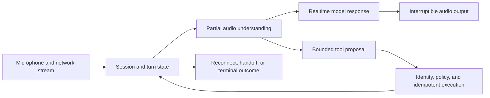

## Realtime Is a Different Runtime

<!-- section-summary: A realtime voice system is a stateful streaming session with tight latency, interruption, audio, network, and tool-safety requirements. -->

A **realtime voice agent** listens and responds while a conversation is still happening. It cannot wait for a complete recording, process it as a batch, and return a paragraph several seconds later. The runtime handles audio frames, speech detection, partial responses, interruptions, tool calls, and reconnects.

Use **RoadRelay**, a roadside-assistance service. A driver says, “My car stopped on the motorway.” The agent collects location and safety status, then creates a dispatch draft for a human operator. This is high pressure. A fluent voice must not make the system seem more certain or authorized than it is.

RoadRelay separates the media path from trusted business actions. The realtime model can converse and request narrow tools. The backend authenticates the user, validates arguments, applies location and safety policy, creates idempotent drafts, and requires human confirmation before dispatch.



The media loop optimizes conversational latency. The trusted action path protects business effects. Both share session identity and deadlines so an interruption, reconnect, or human handoff leaves one coherent run.

## Realtime Terms in Plain English

<!-- section-summary: Voice terminology names network variation, long-running load tests, context shortening, safe retries, and limited production exposure. -->

**Jitter** is variation in network arrival time that can make audio choppy even when average latency looks acceptable. A **soak test** keeps realistic sessions running for a long period to expose memory, connection, and resource leaks. **Compaction** replaces older conversation detail with a shorter approved summary while preserving critical state. An **idempotent** action can be retried without creating a duplicate dispatch or charge. A **canary release** exposes a candidate configuration to a small controlled share of traffic before widening it. Session Initiation Protocol (SIP), WebRTC, WebSocket, and voice activity detection (VAD) are defined where they first enter the connection and turn design below.

## Choose the Connection Boundary

<!-- section-summary: WebRTC commonly fits browser or mobile media, while server-to-server WebSocket or SIP paths fit trusted backends and telephony; credentials stay behind a server boundary. -->

Current realtime platforms may support WebRTC, WebSocket, and SIP. **WebRTC** is a standard set of browser and media technologies for real-time communication. It handles media transport, network negotiation, and changing network conditions. A backend WebSocket can be simpler for a trusted server that already receives audio. **Session Initiation Protocol (SIP)** connects telephony infrastructure.

The client should not receive a long-lived provider API key. RoadRelay's backend authenticates the session, checks tenant policy, and creates a short-lived client credential or negotiates the session through the documented server flow. The backend records a session ID and allowed tool set before audio starts.

```yaml
voice_session_policy:
  max_duration_seconds: 900
  input_modalities: [audio, text]
  output_modalities: [audio, text]
  allowed_tools:
    - safety.get_script
    - location.validate
    - dispatch.create_draft
  blocked_actions:
    - dispatch.publish
    - payment.charge
  transcript_retention_days: 7
  raw_audio_retention_days: 0
```

Provider model names and capabilities move quickly. As of this article's July 2026 review, OpenAI's catalog lists GPT-Realtime-2.1 as the current realtime reasoning family. Check the current model page, region, tool, and data-control support at release time; never encode a marketing phrase as a permanent architecture assumption.

## Design the Conversation Turn

<!-- section-summary: Turn detection, explicit controls, and interruption handling decide when the agent speaks and whether a user can safely correct it. -->

**Voice activity detection (VAD)** estimates when speech starts and stops. Aggressive end-of-turn detection makes the agent interrupt pauses; slow detection creates awkward silence. RoadRelay evaluates VAD settings across accents, background traffic, poor microphones, and stressed speech.

The UI also provides push-to-talk and a visible stop button. Automatic turn detection is a convenience, not the only control. When the driver speaks over the agent, the client stops playback, sends the interruption event, and marks any unheard generated audio as not delivered. Conversation state must distinguish generated text from audio actually played to the user.

```json
{
  "session_id": "voice_91af",
  "turn_id": "turn_008",
  "input_started_ms": 18420,
  "input_stopped_ms": 21670,
  "first_audio_output_ms": 22310,
  "interrupted_ms": 24120,
  "audio_played_through_ms": 23810,
  "tool_state": "none"
}
```

Without played-through position, a later model may assume the user heard a safety warning that was cut off. RoadRelay repeats essential safety information after an interruption and asks for confirmation.

## Interruption as a State Transition

<!-- section-summary: Barge-in handling stops playback, records how much audio the caller heard, truncates unplayed conversation state, and prevents an unfinished answer from influencing the next turn. -->

An interruption, often called **barge-in**, changes both the audio player and the conversation state. Stopping the speaker alone leaves the provider session believing that the caller heard the entire response. The next response may refer to instructions that never reached the person.

With server voice activity detection enabled, the current OpenAI Realtime flow emits `input_audio_buffer.speech_started` when the caller starts talking and cancels the active response on the server. The client must stop local playback immediately, calculate how much audio played, and send `conversation.item.truncate` for the unplayed portion.

```ts
type Playback = {
  itemId: string;
  contentIndex: number;
  playedMs: number;
};

let playback: Playback | null = null;

function onAudioChunk(itemId: string, contentIndex: number, pcm: Uint8Array) {
  audioPlayer.enqueue(pcm);
  playback ??= { itemId, contentIndex, playedMs: 0 };
}

function onAudioPlayed(durationMs: number) {
  if (playback) playback.playedMs += durationMs;
}

function onPlaybackDrained() {
  if (playback) trace.record("assistant_audio_delivered", playback);
  playback = null;
}

function onRealtimeEvent(event: { type: string }) {
  if (event.type !== "input_audio_buffer.speech_started" || !playback) return;

  audioPlayer.stop();
  dataChannel.send(JSON.stringify({
    type: "conversation.item.truncate",
    item_id: playback.itemId,
    content_index: playback.contentIndex,
    audio_end_ms: playback.playedMs
  }));
  trace.record("assistant_audio_interrupted", playback);
  playback = null;
}
```

`itemId` identifies the assistant conversation item being played. `contentIndex` selects its audio content part. `playedMs` advances from actual playback callbacks rather than generated-audio duration, so buffering and slow devices do not overstate what the caller heard. `onPlaybackDrained` clears state only after the local queue finishes. `audio_end_ms` tells the session where the delivered content ended.

The UI should mark any dispatch details after that point as unheard. If the assistant said “I found your location, and I need you to move—” before interruption, the system cannot record the missing safety direction as delivered. A later handoff packet includes the verified location and an `unheard_warning` flag, then the human operator repeats the required warning.

Test the transition with a deterministic event sequence. Feed 2,400 milliseconds of assistant audio, report 1,500 milliseconds as played, emit `input_audio_buffer.speech_started`, and assert that playback stopped and the truncate event contains `audio_end_ms: 1500`. Then send another assistant chunk and verify that it creates a new playback record. A network-disconnect test should persist the last acknowledged played position locally; after reconnect, RoadRelay starts a new response from verified state instead of replaying a half-finished tool result.

Push-to-talk uses a related path with automatic VAD disabled. When the user presses the button during a response, the client sends `response.cancel`, clears local output, and truncates unplayed audio before it appends and commits the new input buffer. The release test must cover both modes because a correct VAD path does not prove the manual-control path.

## Budget Latency by Stage

<!-- section-summary: End-to-end latency is the sum of capture, network, turn detection, model, tool, synthesis, and playback delays, so each stage needs a budget and trace. -->

Measure time to first audible response and time to completed turn, not only model latency. The **p95**, or 95th percentile, is the value that 95% of measured requests meet or beat. A target p95 budget might be:

| Stage | p95 budget |
| --- | ---: |
| Client capture and uplink | 120 ms |
| End-of-turn decision | 350 ms |
| Model first output | 450 ms |
| Downlink and playback buffer | 180 ms |
| Simple tool lookup, when needed | 600 ms |

These targets belong to this product and workload. Tool calls can dominate. The agent can say, “I’m checking your location now,” only after the lookup starts; it must not claim success early. Run long operations as asynchronous tasks with progress and cancellation. Never fill a delay with fabricated status.

Trace session setup, audio input start and stop, response creation, first output, playback, interruptions, tool requests, tool results, and disconnects. Metrics use region, app version, network class, model route, and outcome rather than user IDs.

## Keep Tools and Identity Safe

<!-- section-summary: The realtime model proposes actions, while the backend rechecks identity, authorization, schema, idempotency, and confirmation at execution time. -->

Speech recognition can confuse names, postcodes, and license plates. RoadRelay reads critical values back and asks for confirmation. Location validation returns structured candidates rather than letting the model invent a normalized address.

```json
{
  "tool": "dispatch.create_draft",
  "arguments": {
    "incident_id": "inc_7721",
    "location_candidate_id": "loc_44b",
    "occupants_safe": true,
    "vehicle_position": "hard_shoulder"
  }
}
```

The service derives caller identity from the authenticated session, not from tool arguments. It rejects an expired session, unconfirmed location, duplicate conflicting request, or missing safety question. The voice agent can report that a draft is ready; only the human dispatcher publishes it.

The backend tool path loads confirmed state and derives its operation identity:

```python
def create_dispatch_draft(session_token, args, store, policy, dispatch):
    identity = authenticate_session(session_token)
    session = store.lock_active(identity.session_id)
    if session.caller_id != identity.caller_id or session.tool_state != "enabled":
        raise PermissionError("voice_tool_not_authorized")
    confirmed = session.confirmed
    if args["location_candidate_id"] != confirmed.location_candidate_id:
        raise ValueError("location_not_confirmed")
    if args["occupants_safe"] != confirmed.occupants_safe:
        raise ValueError("safety_answer_not_confirmed")
    policy.require_dispatch_draft(identity, session, args)
    proposal_hash = canonical_hash({"session": session.id, **args})
    key = f"{session.id}:dispatch:{proposal_hash}"
    draft = dispatch.create_or_replay(key, identity.caller_id, args)
    store.attach_dispatch_draft(session.version, draft.id, proposal_hash)
    return draft
```

The model supplies incident facts, while session identity, confirmation records, authorization, and the idempotency key come from backend state. A changed location produces a different proposal and must be confirmed again. A timeout can query `create_or_replay` with the same key instead of creating a second dispatch draft.

Treat audio and transcripts as untrusted input. A passenger, radio, or recorded message may contain instructions. Prompt injection controls, least-privilege tools, and downstream authorization still apply. Do not put secrets in spoken system instructions.

## Recover From Failure

<!-- section-summary: Realtime sessions need explicit behavior for packet loss, disconnects, duplicate events, unavailable tools, and provider degradation. -->

The client uses sequence IDs and ignores duplicate events. The backend stores the last committed business state, not every speculative model token. After reconnect, it creates or resumes a session only according to provider support and rehydrates a short approved summary. It does not replay raw audio blindly.

```python
def reconnect(session_token, client_state_version, store, provider):
    identity = authenticate_session(session_token)
    session = store.load(identity.session_id)
    if session.caller_id != identity.caller_id or session.status not in {"active", "reconnecting"}:
        raise PermissionError("session_cannot_resume")
    provider_connection = provider.start_new_connection(
        instructions_version=session.instructions_version,
        summary=session.approved_summary,
        confirmed=session.confirmed.model_view(),
    )
    store.bind_connection(session.version, provider_connection.id)
    return {
        "session_id": session.id,
        "server_state_version": session.version,
        "client_was_stale": client_state_version < session.version,
        "confirmed": session.confirmed,
        "last_committed_turn": session.last_committed_turn,
    }
```

Reconnect authenticates the original caller, creates fresh provider transport state, and rehydrates only server-committed facts. The response tells a stale client to discard speculative local state. Tests replay duplicate sequence IDs, reconnect from an older version, and disconnect after dispatch creation; every case must preserve one draft and the latest confirmed facts.

If outbound audio fails but text works, RoadRelay shows text and a call-back option. If the location tool fails, it transfers to a human with the confirmed transcript fields. If the provider degrades, a feature flag disables automated tool calls while preserving human call handling. Rollback covers client media config, session instructions, model route, and tool manifest.

Load tests simulate concurrent calls, packet loss, jitter, silence, interruptions, slow tools, and regional failure. Soak tests watch memory, open connections, audio buffers, token spend, and abandoned sessions. Synthetic calls must never reach real dispatch systems; use a separate sandbox tenant and enforce it server-side.

## Manage Session State and Context

<!-- section-summary: Realtime state distinguishes confirmed business facts, conversational summaries, generated-but-unheard output, and temporary audio buffers. -->

RoadRelay does not treat the provider session transcript as the system of record. It keeps a small server-side state object with confirmed location, safety answers, authenticated caller, dispatch draft ID, consent flags, and last completed turn. The model receives only the allowed portion.

```json
{
  "session_id": "voice_91af",
  "confirmed": {
    "caller_id": "caller_221",
    "location_candidate_id": "loc_44b",
    "occupants_safe": true
  },
  "pending": {
    "vehicle_position": "awaiting_confirmation"
  },
  "business_state": {
    "dispatch_draft_id": null
  },
  "last_committed_turn": "turn_008"
}
```

Audio buffers are short-lived transport data. Partial transcripts are tentative. The application adds a model response to conversational history only after it knows what was delivered. Confirmed business facts change through explicit state transitions rather than free-form summary updates.

Long calls need compaction. Summarize completed turns with source turn IDs and keep critical confirmations verbatim in structured fields. Evaluate compaction on long-call fixtures, especially corrections such as “not the M4, the A4.” A summary that resurrects an old location is a safety failure.

## Observe Quality Without Recording Everything

<!-- section-summary: Realtime observability uses timing events, redacted transcripts, sampled audio, and outcome data according to consent and retention policy. -->

Useful operational metrics do not require permanent raw audio. RoadRelay records connection setup, input duration, VAD delay, time to first audio, interruption count, reconnects, tool latency, confirmed-field corrections, human transfers, abandoned calls, and dispatch outcome. Redacted transcript storage is limited by tenant and jurisdiction policy.

Audio quality investigations may require consented samples. Route those to a restricted store with explicit access, retention, and review purpose. Never let a debug flag begin recording all calls indefinitely. Operators should be able to see whether a metric came from full traffic, a consented sample, or synthetic calls.

An alert combines symptoms. A rise in first-audio latency with normal model latency may point to network or playback buffering. More corrected postcodes may point to transcription or audio quality. A high transfer rate can be good when severe cases increased, so dashboards include case mix and transfer correctness.

## Test the Human Handoff

<!-- section-summary: A voice agent is production-ready only when a human can take over with verified context and the caller understands the transition. -->

RoadRelay practices transfer during provider timeout, user request, distress language, repeated misunderstanding, unsupported language, and tool failure. The handoff packet contains verified fields, unresolved questions, safety script status, redacted recent transcript, and trace ID. It excludes speculative model notes.

The caller hears a clear message that a person is joining. The voice agent stops speaking and loses tool access when control transfers. If the call connection changes, the operator still sees the state and can call back through the approved telephony system.

```python
def transfer_to_human(session_id, reason, store, operator_queue, provider):
    session = store.load(session_id)
    if session.mode == "agent":
        session = store.compare_and_set_mode(
            session_id, expected="agent", new="transferring",
            tool_state="revoked", transfer_reason=reason,
        )
        provider.cancel_response(session.provider_connection_id)
    elif session.mode == "transferring":
        if session.tool_state != "revoked":
            raise ValueError("TRANSFER_WITH_ACTIVE_TOOLS")
    elif session.mode == "human" and session.transfer_ticket_id:
        return session
    else:
        raise ValueError(f"ILLEGAL_TRANSFER_STATE:{session.mode}")

    transfer_key = f"voice-transfer:{session.id}"
    existing_ticket = operator_queue.find_by_key(transfer_key)
    if existing_ticket:
        return store.attach_transfer_ticket_if_missing(
            session.id, session.version, existing_ticket.id
        )
    ticket = operator_queue.enqueue_or_load(
        key=transfer_key,
        verified_state=session.verified_handoff_packet(),
    )
    return store.attach_transfer_ticket_if_missing(
        session.id, session.version, ticket.id
    )

def enter_provider_recovery(store, provider, operator_queue):
    store.set_release_mode("human_only")
    provider.revoke_all_ephemeral_credentials()
    for session in store.active_agent_sessions():
        transfer_to_human(session.id, "provider_recovery", store, operator_queue, provider)
```

The state transition revokes tools before queueing a human, cancels generated audio, and uses one transfer key across retries. A retry that loads `transferring` first queries the queue by that key. If the earlier attempt created a ticket and crashed before attaching its ID, the retry attaches the existing ticket; it never requires the session to return to `agent` and never enqueues a second ticket. `attach_transfer_ticket_if_missing` is a compare-and-set update, so two reconcilers converge on one ticket.

A failure test pauses the first worker after `enqueue_or_load`, starts a second call to `transfer_to_human`, and requires the second call to find and attach the same queue ticket. The final state is `human` with one ticket ID, revoked tools, and one queue record. Another test crashes after the `transferring` state change but before queue insertion; the retry creates the missing ticket with the same key. Release recovery changes the server-side admission mode first, revokes short-lived provider credentials, and transfers active sessions from durable state. A release drill starts active calls, enters `human_only`, and verifies that new calls reach the operator path, old agent credentials fail, active sessions lose tools, and no new dispatch draft comes from the model route.

Test failure inside the handoff: no operator available, queue timeout, dropped call, and duplicate dispatch draft. The fallback may provide an emergency number or request callback according to policy, but the model cannot invent service availability. Measure transfer completion and time to human, not only the number of transfer requests.

## Release Realtime Configuration Safely

<!-- section-summary: Model, voice, turn detection, session instructions, tool policy, and client playback settings form one versioned release with a staged rollback. -->

A realtime release manifest pins the model snapshot or approved alias, voice, VAD settings, noise handling, instruction bundle, tool manifest, client media version, and server session code. Offline audio fixtures run first, followed by synthetic calls, employee testing, shadow analysis, and a small regional canary.

Rollback can disable tools before disabling conversation, switch to text, restore prior VAD settings, or route all calls to humans. Practice those switches during normal hours. A fluent demo is not evidence that interruption, reconnection, confirmation, and transfer work under load.

Capacity planning uses concurrent sessions and media throughput, not requests per minute alone. Estimate peak open connections, average and p95 call duration, audio bitrate, model token use, tool concurrency, regional failover headroom, and operator-transfer capacity. Enforce per-tenant session limits and admission control before the provider rejects traffic unpredictably. When capacity is exhausted, RoadRelay gives an honest wait or callback option and preserves authenticated context; it does not start a session that cannot reach a safe conclusion. Cost alerts separate idle open sessions, active audio, generated audio, text tokens, and tools so silence bugs and reconnect loops are visible.

The practical summary is: choose the right transport, keep credentials on the server boundary, make the agent interruptible, measure every latency stage, confirm critical speech, enforce tools in backend code, and design reconnect and human takeover before launch.

## References

- [OpenAI Realtime API overview](https://developers.openai.com/api/docs/guides/realtime)
- [OpenAI Realtime WebRTC](https://developers.openai.com/api/docs/guides/realtime-webrtc)
- [OpenAI Realtime WebSocket](https://developers.openai.com/api/docs/guides/realtime-websocket)
- [OpenAI Realtime conversations and events](https://developers.openai.com/api/docs/guides/realtime-conversations)
- [OpenAI current model catalog](https://developers.openai.com/api/docs/models)
- [WebRTC standards and specifications](https://www.w3.org/TR/webrtc/)
- [OpenTelemetry documentation](https://opentelemetry.io/docs/)
- [OWASP LLM06:2025 Excessive Agency](https://genai.owasp.org/llmrisk/llm062025-excessive-agency/)
