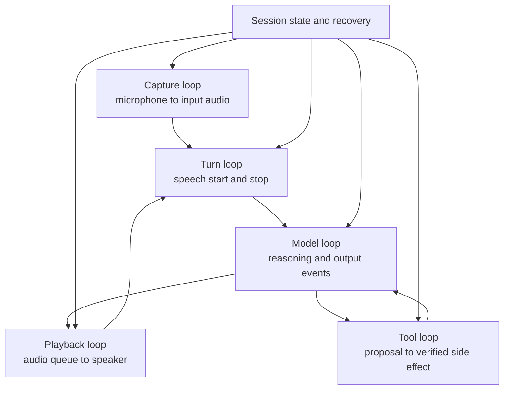
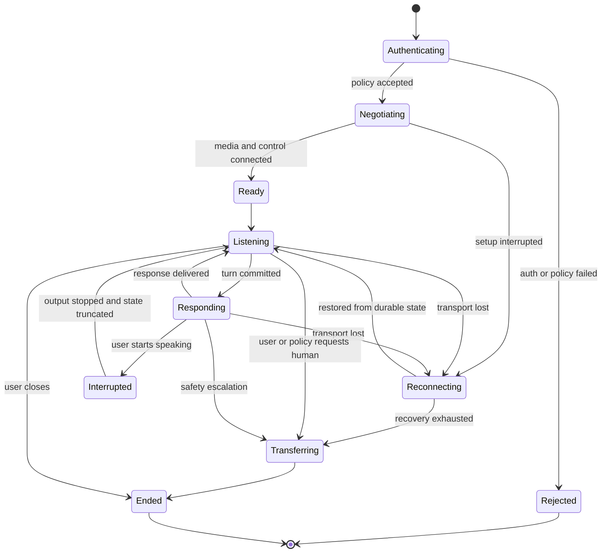
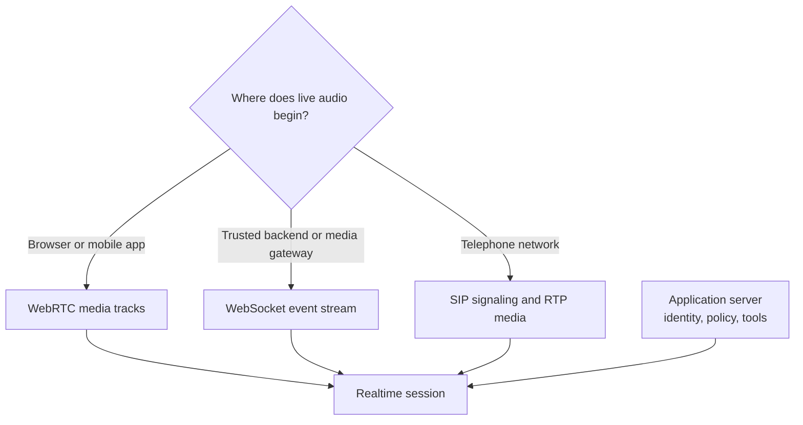
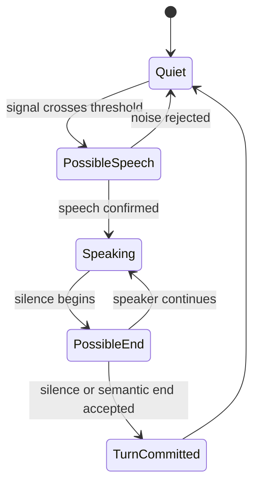
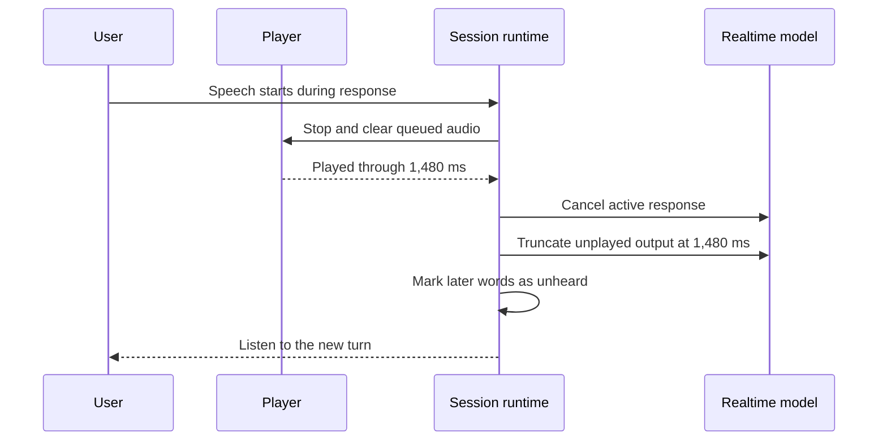
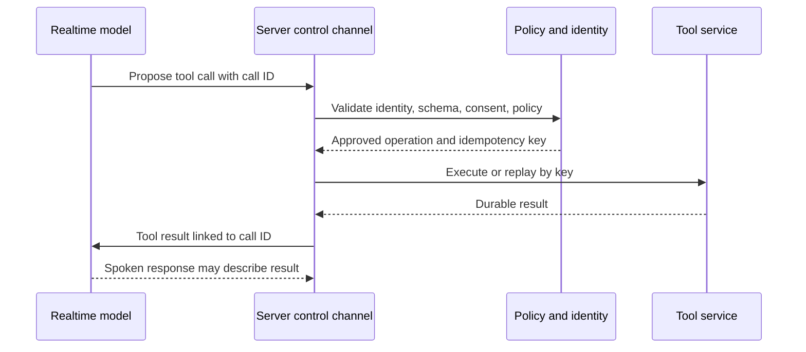
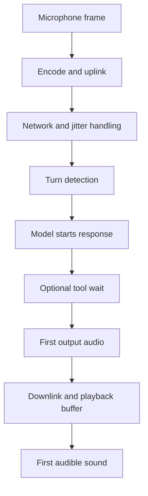
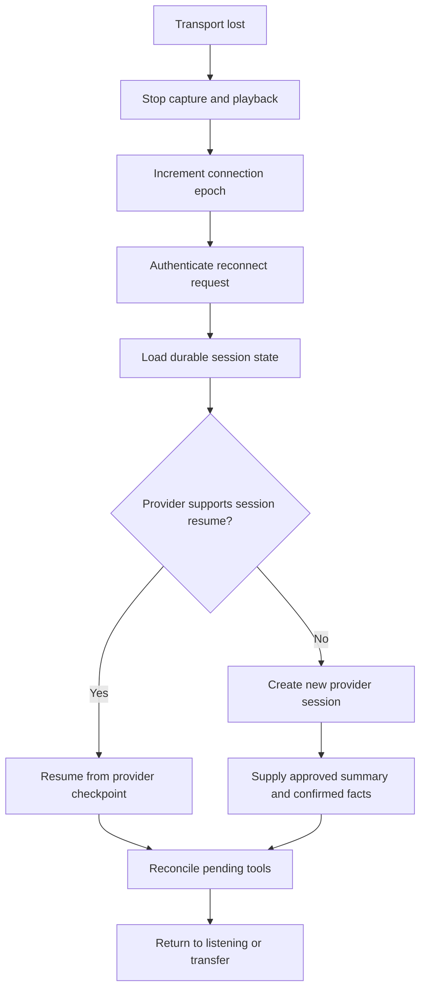
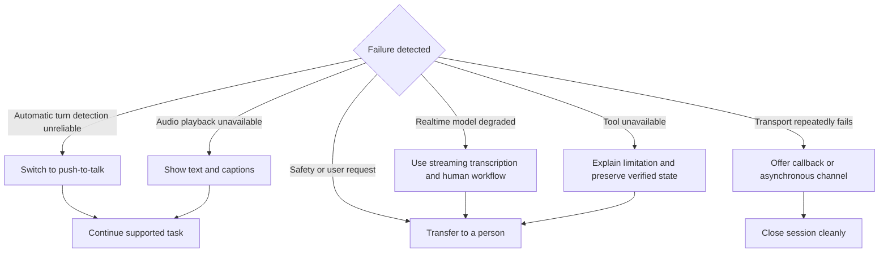

## Table of Contents

1. [What A Realtime Voice Session Does](#what-a-realtime-voice-session-does)
2. [Define The Voice Session Lifecycle](#define-the-voice-session-lifecycle)
3. [Choose WebRTC, WebSocket, Or SIP For The Connection](#choose-webrtc-websocket-or-sip-for-the-connection)
4. [Move Audio From The Microphone To The Speaker](#move-audio-from-the-microphone-to-the-speaker)
5. [Handle Network Delay And Out-Of-Order Audio](#handle-network-delay-and-out-of-order-audio)
6. [Detect Turns Without Cutting People Off](#detect-turns-without-cutting-people-off)
7. [Handle User Interruptions As State Changes](#handle-user-interruptions-as-state-changes)
8. [Do Not Treat Partial Transcripts As Final](#do-not-treat-partial-transcripts-as-final)
9. [Run Tool Actions Behind A Trusted Server](#run-tool-actions-behind-a-trusted-server)
10. [Measure Delay Across The Full Conversation](#measure-delay-across-the-full-conversation)
11. [Reconnect From Saved Session State](#reconnect-from-saved-session-state)
12. [Build Safety, Consent, and Accessibility into the Session](#build-safety-consent-and-accessibility-into-the-session)
13. [Monitor And Evaluate The Voice Experience](#monitor-and-evaluate-the-voice-experience)
14. [Plan Cost And Capacity Per Concurrent Session](#plan-cost-and-capacity-per-concurrent-session)
15. [Degrade Safely And Transfer To A Person](#degrade-safely-and-transfer-to-a-person)
16. [Use A Common Runtime Across Provider APIs](#use-a-common-runtime-across-provider-apis)
17. [How A Production Voice Runtime Fits Together](#how-a-production-voice-runtime-fits-together)
18. [References](#references)

At a high level, a realtime voice application keeps listening, reasoning, and speaking inside one live connection. Audio travels in both directions, events keep arriving, and the user may interrupt at any moment. The application has to remember which turn is active, which audio reached the speaker, which transcript is still changing, and whether a tool has already changed the outside world.

This is the central difference from an ordinary API request. A normal request has a clear beginning and end: send one payload, wait, receive one result. A live voice session has many overlapping beginnings and endings. The microphone may capture a new utterance while previous audio is still playing. A tool can finish after the user has changed their mind. A network reconnect can occur after an action succeeded but before the client received confirmation.

The production design therefore starts with session state and events. Voice models and provider transports fit inside that runtime.

## What A Realtime Voice Session Does

<!-- section-summary: Realtime voice keeps a two-way media channel open while session state coordinates audio, turns, responses, tools, and recovery. -->

**Duplex** means information can move in both directions. A telephone call is full duplex because both people can speak and hear during the same connection. Realtime voice systems follow the same pattern: microphone audio flows toward the model while generated audio flows back toward the user.

The connection is also **stateful**. Stateful means that later events depend on earlier events in the same session. The runtime remembers the selected voice, conversation items, active response, audio buffers, confirmed facts, pending tool calls, and current playback position.

You can think of the runtime as five cooperating loops:


```mermaid
flowchart TD
    A["Capture loop<br/>microphone to input audio"] --> B["Turn loop<br/>speech start and stop"]
    B --> C["Model loop<br/>reasoning and output events"]
    C --> D["Playback loop<br/>audio queue to speaker"]
    C --> E["Tool loop<br/>proposal to verified side effect"]
    D --> B
    E --> C
    F["Session state and recovery"] --> A
    F --> B
    F --> C
    F --> D
    F --> E
```

Each loop has a different clock. Audio capture may produce a frame every few milliseconds. Turn detection waits for enough evidence that speech ended. The model emits output in pieces. Playback runs at the speaker's pace. A database tool may take hundreds of milliseconds or several seconds.

This explains several failures that look surprising in a demo. The model can finish generating audio before the device has played it. A user can interrupt audio that already exists in a network buffer. A transcript can show words that are still subject to correction. A tool result can arrive after the response that requested it was canceled.

A robust runtime records these as separate facts. “Generated,” “received,” “queued,” and “played” are four different audio states. “Proposed,” “authorized,” “started,” and “committed” are four different tool states.

## Define The Voice Session Lifecycle

<!-- section-summary: A session lifecycle defines legal transitions from authentication and connection setup through listening, responding, interruption, recovery, transfer, and closure. -->

A voice session begins before the first audio frame. The application authenticates the user, loads policy, chooses a region and route, creates short-lived provider access, and establishes the media connection. Only then is it ready to listen.

An explicit lifecycle prevents one event handler from guessing what another handler already did:


```mermaid
stateDiagram-v2
    [*] --> Authenticating
    Authenticating --> Negotiating: policy accepted
    Authenticating --> Rejected: auth or policy failed
    Negotiating --> Ready: media and control connected
    Negotiating --> Reconnecting: setup interrupted
    Ready --> Listening
    Listening --> Responding: turn committed
    Responding --> Listening: response delivered
    Responding --> Interrupted: user starts speaking
    Interrupted --> Listening: output stopped and state truncated
    Listening --> Reconnecting: transport lost
    Responding --> Reconnecting: transport lost
    Reconnecting --> Listening: restored from durable state
    Reconnecting --> Transferring: recovery exhausted
    Listening --> Transferring: user or policy requests human
    Responding --> Transferring: safety escalation
    Transferring --> Ended
    Listening --> Ended: user closes
    Rejected --> [*]
    Ended --> [*]
```

The session record stores an application session ID separately from the provider connection ID. A reconnect may create a new provider connection while the application session continues. It also records the configuration version, authenticated subject, allowed tools, consent state, current mode, and last durable turn.

Some state belongs only in memory. Raw input buffers, queued output audio, and partial transcript text can disappear after a disconnect. Other state must survive: confirmed values, completed tool effects, transfer status, and consent evidence. This split is the foundation of safe recovery.

A connection close is also a state transition. The server revokes short-lived credentials, stops accepting tool calls, flushes safe metrics, releases session capacity, and applies the audio-retention policy. Relying on a browser tab to perform cleanup will leave abandoned sessions after crashes and network loss.

## Choose WebRTC, WebSocket, Or SIP For The Connection

<!-- section-summary: WebRTC suits interactive client media, WebSocket suits trusted server streams, and SIP brings telephone calls into the voice runtime. -->

The transport is the connection that carries live audio and control events between the user, the application, and the model service. Its best shape depends on where the audio begins and which component already knows how to handle media. A browser benefits from built-in microphone and playback support, a backend can exchange ordered events directly, and a telephone call must enter through the phone network.

### WebRTC for browser and mobile media

**WebRTC** is a collection of standards and browser APIs for real-time media. It gives an application separate tracks for microphone input and speaker output. It also negotiates an audio format, adapts to network congestion, recovers from some packet loss, and provides a data channel for control events. These capabilities make it the usual starting point for browser and mobile voice applications.

During setup, the peers exchange an **SDP** offer and answer. SDP, or Session Description Protocol, describes the audio formats and connection details each side can support. **ICE**, or Interactive Connectivity Establishment, then tests possible network paths. A **TURN** server can relay the media if firewalls or network address translation prevent a direct path. Managed voice providers often handle much of this negotiation. The application still records setup time and failure reason so it can offer a retry, text mode, or another transport.

The browser should receive only short-lived session authority. A durable provider API key stays on the application server. The server authenticates the user, selects policy, and either negotiates the session or issues an ephemeral credential according to the provider's documented flow.

### WebSocket for trusted server streams

A **WebSocket** is one long-lived, two-way connection carried over TCP. Messages arrive reliably and in order on that socket. This is useful for server-to-server integrations, media gateways, and telephony bridges whose backend already owns the audio.

The application has more work. It usually packages input audio into events, decodes output audio events, maintains the playback buffer, and implements interruption bookkeeping. TCP also waits for missing packets before delivering later bytes. This property, called **head-of-line blocking**, can produce a latency spike on a poor network even though no audio data is lost.

### SIP for telephone calls

**SIP**, or Session Initiation Protocol, establishes, changes, and ends internet telephone calls. A SIP trunking provider connects phone numbers and the public telephone network to IP services. SIP handles call signaling; RTP commonly carries the live audio after setup.

Telephony adds caller routing, ringing, call acceptance, transfer, dual-tone keypad input, and carrier failures. **DTMF** is the familiar keypad signal produced by telephone digits. It gives users a useful fallback for confirmation or menu choices if speech recognition is unreliable.


```mermaid
flowchart TD
    A{"Where does live audio begin?"} -->|Browser or mobile app| B["WebRTC media tracks"]
    A -->|Trusted backend or media gateway| C["WebSocket event stream"]
    A -->|Telephone network| D["SIP signaling and RTP media"]
    B --> E["Realtime session"]
    C --> E
    D --> E
    F["Application server<br/>identity, policy, tools"] --> E
```

The transport does not decide business authority. WebRTC, WebSocket, and SIP carry media and control events. The application server still owns identity, authorization, tool execution, retention, and transfer policy.

## Move Audio From The Microphone To The Speaker

<!-- section-summary: A stable audio path controls capture, channel layout, sample rate, encoding, resampling, buffering, playback, and device failure. -->

Voice quality begins at capture. The client requests microphone permission, shows a visible listening state, supports mute, and reports the selected input device. Browser features such as echo cancellation, noise suppression, and automatic gain control can improve ordinary calls. They can also alter specialized audio, so the product must test its actual devices and environments.

A **sample rate** is the number of audio measurements recorded each second. For example, 16 kHz means 16,000 samples per second. **PCM** stores those measurements directly. A **codec** compresses audio for transport or storage. Opus is common in WebRTC, while G.711 is common in telephony. Provider WebSocket APIs may require a specific PCM or telephony format.

**Resampling** converts audio from one sample rate to another. A laptop may capture at 48 kHz while a model route expects 16 kHz. The gateway should convert once with a tested library, preserve one channel if the route expects mono, and record the input and output formats. Repeated resampling can add delay and damage speech clarity.

A compact media contract makes format assumptions visible:

```yaml
audio_path:
  capture:
    channels: 1
    sample_rate_hz: 48000
    browser_processing: [echo_cancellation, noise_suppression]
  transport:
    kind: webrtc
    codec: negotiated
  model_adapter:
    expected_channels: 1
    expected_sample_rate_hz: provider_contract
    resampler_version: audio-normalizer-v4
  playback:
    target_buffer_ms: 120
    maximum_buffer_ms: 600
    drop_after_interrupt: true
```

Playback needs its own state. Incoming audio chunks enter a bounded queue and leave according to the device audio clock. The runtime records how many milliseconds actually played. It pauses or switches to captions if the output device disappears.

Echo deserves special attention. The microphone can capture the agent's own speaker output and make the model answer itself. WebRTC echo cancellation helps, as do headsets and careful speaker placement. A loop detector can alert on repeated assistant phrases appearing in input transcripts.

## Handle Network Delay And Out-Of-Order Audio

<!-- section-summary: Event identities, sequence rules, bounded queues, and jitter buffers keep concurrent audio and control streams coherent. -->

Realtime systems receive many small events. A server may announce response creation, send transcript deltas, stream audio, request a tool, mark audio complete, and finally close the response. Some event types can occur concurrently.

**Jitter** is variation in arrival time. Audio frames may be produced at a steady rate but reach the device in small bursts. A **jitter buffer** holds a short amount of audio and releases it at a steady pace. Too little buffering produces gaps. Too much buffering makes conversation feel slow.

There may be no single global order. A WebSocket gives order within one socket. WebRTC often carries media and control on separate channels. A speech-start event can reach application code a few milliseconds before or after the related media frame.

The runtime therefore uses stable identities and local state:

```yaml
event:
  session_id: voice_7d2
  connection_epoch: 3
  event_id: evt_01842
  response_id: resp_104
  item_id: item_209
  kind: output_audio_chunk
  chunk_index: 17
  provider_time_ms: 48120
  received_monotonic_ms: 9320481
```

`connection_epoch` increments after reconnect. A late event from epoch two cannot modify epoch three. `chunk_index` detects a missing or duplicate audio chunk inside one response. A **monotonic clock** only moves forward, so local durations remain valid even if the wall clock is corrected.

Input and output queues need limits. If encoding or playback falls behind, **backpressure** slows input, drops policy-approved stale media, or closes the unhealthy session before memory grows without bound. Control events and tool results usually deserve priority over old audio chunks.

For example, a mobile device can freeze for one second and then deliver a burst of callbacks. The player should preserve a small useful buffer and discard response audio that was already invalidated by an interruption. Playing every late chunk would make the agent speak over the user's next turn.

## Detect Turns Without Cutting People Off

<!-- section-summary: VAD, semantic turn detection, and manual controls decide how speech is grouped into turns and how quickly the model may respond. -->

A conversation needs to decide which audio belongs to one user turn. **Voice activity detection (VAD)** estimates whether an audio region contains speech. It does not know whether the speaker finished the thought.

Silence-based VAD usually has three important controls. The activation threshold decides how much evidence counts as speech. Prefix padding keeps a short piece of audio from before detection, protecting the first sound of a word. Silence duration decides how long quiet must continue before the turn closes.

Short silence makes responses begin quickly, but it can cut off a thoughtful pause. Long silence protects slower speech, but it creates dead air. Traffic noise, accents, speech impairments, microphone gain, and language all affect the result.

Some providers also offer semantic turn detection. This uses linguistic context to estimate whether the utterance sounds complete. It can preserve a pause inside a sentence, though its behavior still needs evaluation on the product's languages and tasks.


```mermaid
stateDiagram-v2
    [*] --> Quiet
    Quiet --> PossibleSpeech: signal crosses threshold
    PossibleSpeech --> Speaking: speech confirmed
    PossibleSpeech --> Quiet: noise rejected
    Speaking --> PossibleEnd: silence begins
    PossibleEnd --> Speaking: speaker continues
    PossibleEnd --> TurnCommitted: silence or semantic end accepted
    TurnCommitted --> Quiet
```

Manual controls remain valuable. Push-to-talk lets the user mark the start and end directly. A visible “send turn” control helps in noisy places. The product can keep VAD for transcription while requiring explicit confirmation before the model responds.

A strong evaluation includes short acknowledgements, long pauses, false starts, coughs, background speakers, and double talk. **Double talk** means user and agent speech overlap. Measure false starts, clipped first sounds, premature turn ends, and end-of-turn delay rather than reporting one VAD accuracy number.

## Handle User Interruptions As State Changes

<!-- section-summary: Barge-in stops playback, cancels generation, records delivered audio, truncates unheard context, and reviews any tool already in flight. -->

**Barge-in** means the user starts speaking while the agent is talking. A natural voice interface should stop promptly, but stopping the speaker is only the first step.

The runtime must reconcile four pieces of state:

1. Stop local audio playback and clear queued chunks.
2. Cancel the active model response where the provider supports cancellation.
3. Record how much output the user actually heard.
4. Remove or mark the unheard portion so later reasoning does not assume delivery.


```mermaid
sequenceDiagram
    participant U as User
    participant P as Player
    participant S as Session runtime
    participant M as Realtime model
    U->>S: Speech starts during response
    S->>P: Stop and clear queued audio
    P-->>S: Played through 1,480 ms
    S->>M: Cancel active response
    S->>M: Truncate unplayed output at 1,480 ms
    S->>S: Mark later words as unheard
    S-->>U: Listen to the new turn
```

The played-through position comes from the playback clock. Generated duration and received duration can be larger because audio may still be buffered.

Transport changes the implementation. Current OpenAI WebRTC and SIP sessions let the server manage the output buffer and automatically truncate unplayed audio after user interruption. With an OpenAI WebSocket connection, the client owns playback and must send `conversation.item.truncate` with the delivered audio position.

Tools need separate handling. Canceling speech does not automatically reverse a database write or payment. A pending read can often be canceled. A completed side effect may require a compensation workflow, such as voiding a reservation. The tool ledger records its real state before the voice runtime promises anything to the user.

A focused test plays 2,400 milliseconds of generated audio, reports 1,480 milliseconds as delivered, and injects speech start. It should observe stopped playback, canceled generation, truncation at 1,480 milliseconds, and no delivery marker for later words. Another test interrupts during a tool call and verifies that the tool state remains accurate.

## Do Not Treat Partial Transcripts As Final

<!-- section-summary: Transcript deltas support responsive interfaces, while final text and explicit confirmation protect durable facts and tool arguments. -->

Streaming speech recognition emits **partial transcripts** before the turn is complete. These early words make captions feel responsive, but they can change as more audio arrives. The recognizer may revise “fourteen” to “forty” or change a name after hearing the full phrase.

A **final transcript** means that the recognizer finished that segment according to its current session. It is still a model output and may contain an error. Critical values need another source of confidence or direct user confirmation.

```yaml
transcript_segment:
  turn_id: turn_18
  revision: 6
  state: final
  text: "Send the report to account forty-two."
  entities:
    - kind: account_number
      value: "42"
      confirmation: required
  audio_range_ms: [18420, 21780]
```

The user interface can render partial text in a quieter style, replace it as revisions arrive, and mark the final segment. Downstream analytics should avoid counting every revision as another utterance.

Tool execution must never start from an unstable text fragment. The runtime waits for a complete tool proposal and validates its arguments. For names, addresses, account numbers, medical details, or other consequential entities, it reads back the interpreted value or offers a text and keypad correction path.

The transcript and model's direct audio understanding can also disagree. Keep the original audio reference under the approved retention policy, the transcript revision, and the final interpreted entity as separate evidence. General logs should receive identifiers and safe summaries rather than raw speech.

## Run Tool Actions Behind A Trusted Server

<!-- section-summary: The model proposes a tool call, while the server authenticates, validates, authorizes, deduplicates, executes, and reports the durable result. -->

A spoken conversation can trigger external work: look up an order, reserve a time, send a message, or transfer a call. The low-latency model should propose that work. The application server decides whether it is allowed.

The server derives identity from the authenticated session rather than spoken claims or model arguments. It validates the complete tool schema, checks authorization and policy, verifies required confirmations, and assigns an **idempotency key**. An idempotency key names one intended operation, allowing a retry to return the earlier result instead of repeating the side effect.


```mermaid
sequenceDiagram
    participant M as Realtime model
    participant C as Server control channel
    participant P as Policy and identity
    participant T as Tool service
    M->>C: Propose tool call with call ID
    C->>P: Validate identity, schema, consent, policy
    P-->>C: Approved operation and idempotency key
    C->>T: Execute or replay by key
    T-->>C: Durable result
    C->>M: Tool result linked to call ID
    M-->>C: Spoken response may describe result
```

Tool call IDs correlate provider events. Business idempotency keys protect real effects. The two identifiers serve different purposes and both should be recorded.

The agent may say, “I’m checking that now,” after the lookup begins. It should announce success only after the server returns a durable success result. If the tool is slow, the conversation can continue with a truthful progress state or offer an asynchronous update.

Interruption introduces a race. The user may say “stop” after the tool started. If the provider sends a tool-cancellation event, the server checks its ledger. A queued operation can be canceled. An already committed operation stays committed and may need an explicit compensating action. The system never treats canceled speech as proof that a side effect disappeared.

Current OpenAI Realtime supports a server **sideband** channel for WebRTC and SIP sessions. Sideband means the user has a media connection while the application server has another control connection to the same session. The server can keep tool logic private, monitor events, and update allowed session behavior.

## Measure Delay Across The Full Conversation

<!-- section-summary: Voice latency includes capture, network, buffering, turn detection, inference, tools, synthesis, delivery, and playback. -->

Model latency is only one part of the delay a user hears. Audio must first leave the microphone, cross the network, pass turn detection, reach the model, and return through a playback buffer. A tool call can add another pause in the middle. A latency budget assigns an expected time to each stage, which lets the team find the slow stage instead of blaming the model for every awkward silence.

The budget starts at the user action and ends at the user experience. For a spoken turn, the most important endpoint is usually the first audible sound from the response:


```mermaid
flowchart TD
    A["Microphone frame"] --> B["Encode and uplink"]
    B --> C["Network and jitter handling"]
    C --> D["Turn detection"]
    D --> E["Model starts response"]
    E --> F["Optional tool wait"]
    F --> G["First output audio"]
    G --> H["Downlink and playback buffer"]
    H --> I["First audible sound"]
```

Three measurements describe different experiences:

- **time to first audio** measures from committed user turn to the first sound played;
- **turn completion latency** measures from committed input to the end of useful output;
- **interruption stop latency** measures from new user speech to silence from the agent.

Measure p50, p95, and p99. The p95 is the value that 95 percent of observed sessions meet or beat. Slice by transport, region, network type, device class, route, tool, and app version. A global average can hide poor mobile or telephony performance.

Each stage receives a product-specific budget. For one application, turn detection may dominate. Another may wait on a retrieval tool. A third may generate quickly but buffer too much audio before playback. Distributed traces and client timing events locate the real delay.

Perceived latency can improve without pretending that work finished. The interface can show listening and processing state immediately. The voice can acknowledge a long tool only after execution begins. Short first sentences can start playback while the rest is generated, provided they do not claim an unverified result.

## Reconnect From Saved Session State

<!-- section-summary: Reconnection creates a new transport epoch, restores confirmed application state, and uses idempotency to reconcile uncertain tool outcomes. -->

A connection can fail while listening, speaking, or running a tool. Recovery begins by separating **transport state** from **business state**.

Transport state includes peer connections, sockets, audio buffers, response IDs, and partial transcripts. Business state includes authenticated identity, consent, confirmed facts, completed tool effects, and transfer status. The server persists the second group.


```mermaid
flowchart TD
    A["Transport lost"] --> B["Stop capture and playback"]
    B --> C["Increment connection epoch"]
    C --> D["Authenticate reconnect request"]
    D --> E["Load durable session state"]
    E --> F{"Provider supports session resume?"}
    F -->|Yes| G["Resume from provider checkpoint"]
    F -->|No| H["Create new provider session"]
    H --> I["Supply approved summary and confirmed facts"]
    G --> J["Reconcile pending tools"]
    I --> J
    J --> K["Return to listening or transfer"]
```

Provider session resumption can preserve conversation context, but application state still remains authoritative for business effects. If the provider cannot resume, a new session receives a concise approved summary and structured confirmed facts.

The client sends its last acknowledged state version. The server returns the current version and connection epoch. A stale client discards queued audio and speculative transcript text. Late events from the old epoch are ignored.

An uncertain tool requires reconciliation. Suppose a booking service committed a reservation and the socket closed before the result reached the voice client. Retrying with the same idempotency key must retrieve that reservation. Starting the operation again under a new key could create a duplicate.

Reconnect attempts use bounded exponential backoff with random jitter. **Exponential backoff** increases the delay between attempts, reducing pressure during an outage. Random variation prevents thousands of clients from reconnecting at the same instant. After the limit, the product offers text, callback, or human transfer instead of looping silently.

## Build Safety, Consent, and Accessibility into the Session

<!-- section-summary: Realtime voice exposes microphone, speech, identity, retention, and accessibility risks that require visible controls and alternate paths. -->

The user should always know whether the application is listening, processing, speaking, or connected to a person. Microphone permission, recording consent, AI-voice disclosure, and raw-audio retention follow the product's jurisdiction and policy. The interface provides mute, stop, end-session, and human-help controls.

Voice is not reliable authentication by itself. A familiar-sounding person may be a recording or synthetic voice. Background speakers can also issue commands. Sensitive actions require the authenticated session plus appropriate confirmation, and high-risk workflows may require a stronger factor.

Audio and transcripts can contain names, health information, payment details, voices, and background conversation. Minimize capture and retention. Keep raw audio out of general telemetry. Restrict any consented quality sample by purpose, access, and deletion deadline. Delete derived transcripts, summaries, embeddings, and provider session artifacts according to the same lifecycle.

Accessibility improves both inclusion and recovery:

- live captions for generated and incoming speech where appropriate;
- text input and output alongside voice;
- push-to-talk for users or environments that VAD handles poorly;
- transcript and entity correction before consequential actions;
- keyboard, switch, and screen-reader access to mute, stop, and transfer controls;
- DTMF keypad choices on telephone routes;
- a no-audio path for users who cannot hear or speak.

For example, a user may speak a reference number and see the recognized value before confirmation. They can correct one digit with the keyboard or phone keypad. This avoids forcing another full utterance and protects the downstream tool.

Safety policy must account for the persuasive effect of a natural voice. The agent states uncertainty, avoids false claims of completed work, and transfers according to defined risk triggers. Emergency or regulated use cases need explicit supported-task boundaries and tested human escalation.

## Monitor And Evaluate The Voice Experience

<!-- section-summary: Session, turn, media, tool, and product measurements explain whether the voice system remains responsive, understandable, safe, and useful. -->

One trace spanning a long call can become unwieldy. A practical OpenTelemetry design correlates a session record with shorter traces or spans for connection setup, each turn, each tool, reconnect, and transfer. A safe session ID links them without placing raw audio or direct identifiers in ordinary attributes.

Operational signals cover the entire runtime:

- active and rejected sessions by region and transport;
- setup failure and reconnect rates;
- input and output audio duration;
- jitter-buffer depth, underruns, and dropped stale audio;
- false speech starts and end-of-turn delay;
- time to first audio and interruption stop latency;
- partial-to-final transcript corrections;
- tool latency, cancellation, replay, and failure;
- transfer completion and abandoned-session rate;
- token, duration, and provider usage by route.

An **underrun** occurs if the playback buffer empties before the next audio arrives, producing a gap. This metric connects a choppy experience to network or buffering behavior.

Quality evaluation uses recorded fixtures and interactive simulations. The fixture matrix should vary devices, echo, noise, packet loss, jitter, accents, dialects, languages, speech rate, long pauses, overlapping speakers, code switching, and speech impairments. Interactive tests inject interruption, slow tools, reconnects, output-device loss, and human transfer.

```yaml
voice_eval:
  scenario: correction_during_tool_wait
  network: mobile_jitter
  user_behavior: barge_in
  expected:
    agent_audio_stops_within_ms: 250
    provisional_value_is_not_committed: true
    tool_effect_count: 0
    correction_path_available: true
    transcript_visible: true
```

Evaluate product outcomes as well as components. Measure whether users complete the supported task, correct misunderstood entities, receive required warnings, reach a human successfully, and abandon the call. Human review should use a stable rubric for clarity, pacing, pronunciation, interruption, and cognitive load.

Synthetic calls belong to a sandbox tenant with non-production tools. A load generator that can reach live payments, messages, or dispatch systems creates unacceptable risk.

## Plan Cost And Capacity Per Concurrent Session

<!-- section-summary: Realtime capacity depends on open connections, media throughput, conversation growth, tool concurrency, and regional headroom. -->

Ordinary APIs are often planned in requests per second. Realtime voice also depends on **concurrent sessions**, the number of open conversations at once. A ten-minute call occupies connection, gateway, provider, and monitoring capacity throughout its lifetime.

Capacity planning includes peak open sessions, call duration distribution, audio bitrate, model input and output usage, tool concurrency, regional failover headroom, and human-transfer capacity. Per-tenant limits and admission control should reject excess work cleanly before a provider quota or overloaded gateway fails unpredictably.

```yaml
capacity_policy:
  tenant_session_limit: 120
  regional_session_limit: 8000
  reserve_for_human_transfer: 0.10
  gateway_drain_timeout_seconds: 45
  reconnect_attempt_limit: 5
  admission_fallback: callback_or_text
```

Long-lived connections affect deployment. A gateway being replaced enters **draining** mode: it refuses new sessions while existing sessions finish or reconnect elsewhere. External durable state keeps a session from depending entirely on one gateway process.

Cost follows provider billing and the architecture. Track active input audio, generated audio, transcription, conversation tokens, cached tokens, tool calls, and idle session duration where relevant. Current OpenAI voice-agent sessions create a response from accumulated conversation state, so later turns can carry more input context. Its translation and transcription session types use different streaming and billing patterns.

Silence bugs and reconnect loops deserve separate alerts. A session that remains open without useful activity can consume capacity or keep accumulating cost. Enforce idle timeouts with a warning, an opportunity to continue, and a clean close.

Context also needs a budget. Long sessions may truncate old conversation items or replace completed turns with an approved summary. Confirmed business facts remain in structured server state. Evaluate summary and truncation behavior on corrections, negation, names, and unresolved commitments.

## Degrade Safely And Transfer To A Person

<!-- section-summary: A fallback ladder preserves user control through text, push-to-talk, specialist transcription, callback, and human transfer. -->

Graceful degradation means the product continues with a narrower honest capability or exits safely. It should avoid an endless spinner, silent microphone, or confident promise from an unhealthy tool.

Different failures need different fallbacks:


```mermaid
flowchart TD
    A{"Failure detected"} -->|Automatic turn detection unreliable| B["Switch to push-to-talk"]
    A -->|Audio playback unavailable| C["Show text and captions"]
    A -->|Realtime model degraded| D["Use streaming transcription and human workflow"]
    A -->|Transport repeatedly fails| E["Offer callback or asynchronous channel"]
    A -->|Tool unavailable| F["Explain limitation and preserve verified state"]
    A -->|Safety or user request| G["Transfer to a person"]
    B --> H["Continue supported task"]
    C --> H
    D --> G
    E --> I["Close session cleanly"]
    F --> G
```

A handoff packet contains authenticated identity references, confirmed facts, unresolved questions, consent state, completed tool effects, warnings already delivered, and a trace ID. It excludes partial transcript guesses and hidden model reasoning.

Transfer is itself an idempotent state transition. The runtime revokes model tool access, stops generated audio, creates or finds one operator ticket, and announces the change. A retry must attach the same ticket rather than queue another operator.

If no operator is available, the product follows an approved callback or emergency policy. The model cannot invent queue time or service availability. The session records the fallback offered and the user's choice.

Release drills should test provider outage, region loss, full operator queue, old client versions, and a deployment draining active connections. The drill succeeds only if new sessions follow the intended admission path, active tool authority is revoked, and committed effects remain consistent.

## Use A Common Runtime Across Provider APIs

<!-- section-summary: Current OpenAI, AWS, Google Cloud Agent Platform, and Microsoft Foundry services expose different transports and event contracts behind the same session responsibilities. -->

The portable runtime owns lifecycle, durable facts, tool policy, playback truth, evaluation, and fallback. Provider adapters translate those concepts into current connection and event contracts.

### OpenAI Realtime

OpenAI currently describes Realtime sessions as open connections that accept audio or text, emit events, maintain conversation state, and support tool calls. Its documentation recommends WebRTC for browser and mobile clients and WebSocket for server-to-server applications. SIP connects inbound telephone calls.

Current event flows include `session.created`, `session.update`, speech-start and speech-stop events, transcript deltas, `response.output_audio.delta`, tool items, and `response.done`. Event names and supported fields belong in a versioned adapter.

OpenAI currently offers silence-based `server_vad` and context-aware `semantic_vad`. VAD can be disabled for push-to-talk. For WebRTC and SIP, the service manages the output buffer and interruption truncation. WebSocket clients own playback and send the delivered position through `conversation.item.truncate`.

OpenAI also supports a sideband server connection for current WebRTC and SIP sessions. This lets the application server handle private tools and session control while the user media follows its direct transport.

### Amazon Web Services

Amazon Nova 2 Sonic is the current active Amazon speech-to-speech model in Bedrock. It uses `InvokeModelWithBidirectionalStream`, an event-driven API for continuous input and output. Its event lifecycle and tool configuration fit the same session, turn, and tool-ledger framework.

Amazon Transcribe Streaming is a narrower option for live speech-to-text. It accepts sequential audio chunks over supported SDK, HTTP/2, or WebSocket paths and returns transcript results. This route can support captions, specialist recognition, or a fallback from a full speech-to-speech agent.

### Google Cloud Gemini Enterprise Agent Platform

Gemini Live API on Agent Platform provides a stateful WebSocket API for bidirectional audio and video interaction. Readers may know it by its former name, Gemini Live API on Vertex AI. Its current documentation includes setup messages, realtime media input, generated content, interruption signals, tool calls, usage metadata, and session-resumption checkpoints.

Google currently labels Gemini Live API as preview and describes it as designed for server-to-server communication. That maturity and boundary should be verified before production selection. The application still needs its own durable business state even if a provider checkpoint can resume model context.

### Microsoft Foundry

Voice Live API in Foundry Tools provides a realtime bidirectional voice interface using WebSocket events. It integrates speech processing and model behavior behind a session contract. Microsoft currently recommends WebRTC for client-side low-latency audio, while the documented Voice Live WebRTC capability remains public preview.

Microsoft recommends a Microsoft Foundry resource for full Voice Live feature availability. Azure Speech in Foundry Tools also provides dedicated realtime speech recognition and synthesis. A team may use Voice Live for an interactive speech-to-speech agent or assemble specialist speech components around its own text and tool orchestration.

| Portable responsibility | Provider adapter maps it to |
| --- | --- |
| Media transport | WebRTC tracks, WebSocket audio events, or telephony media |
| Session lifecycle | Provider setup, update, close, and resume events |
| Turn state | VAD or explicit activity and commit events |
| Interruption | Cancel, clear playback, truncate, or provider interruption signal |
| Transcript state | Delta and final transcript events |
| Tools | Provider call ID plus server-owned policy and business idempotency |
| Usage | Provider token, duration, connection, or model usage records |
| Recovery | Resume checkpoint or new session with approved state |

Model IDs, event fields, codecs, limits, regions, pricing, and preview status change. Release automation should check official documentation and run a representative connection probe. The capability registry records only routes that the team has tested.

## How A Production Voice Runtime Fits Together

<!-- section-summary: A reliable voice runtime coordinates transport, audio, turns, playback, tools, durable state, recovery, and fallback throughout one live session. -->

A reliable voice runtime keeps one coherent truth across several fast-moving streams. It knows which connection is current, which user turn closed, which response is active, which audio played, which transcript finalized, which tool committed, and which facts the user confirmed.

WebRTC, WebSocket, and SIP solve different connection problems. Audio contracts control capture, encoding, resampling, buffering, and playback. VAD and manual controls shape turns. Barge-in cancels speech and removes unheard context. Server-side tools protect identity and side effects. Durable state makes reconnect safe. Consent, accessibility, retention, observability, capacity limits, and fallback complete the operational design.

The system can then answer every important failure with a specific action. Choppy audio adjusts the media or network path. Premature turn endings change VAD or offer push-to-talk. An interrupted response clears unheard audio. An uncertain tool result reconciles by idempotency key. Repeated connection failure moves to text, callback, or a person. This is how a voice feature grows from a fluent demo into an operable service.

## References

- [OpenAI: Realtime and audio](https://developers.openai.com/api/docs/guides/realtime)
- [OpenAI: Realtime API with WebRTC](https://developers.openai.com/api/docs/guides/realtime-webrtc)
- [OpenAI: Realtime API with WebSocket](https://developers.openai.com/api/docs/guides/realtime-websocket)
- [OpenAI: Realtime API with SIP](https://developers.openai.com/api/docs/guides/realtime-sip)
- [OpenAI: Realtime conversations](https://developers.openai.com/api/docs/guides/realtime-conversations)
- [OpenAI: Voice activity detection](https://developers.openai.com/api/docs/guides/realtime-vad)
- [OpenAI: Webhooks and server-side controls](https://developers.openai.com/api/docs/guides/realtime-server-controls)
- [OpenAI: Managing Realtime costs](https://developers.openai.com/api/docs/guides/realtime-costs)
- [AWS: Amazon Nova 2 Sonic](https://docs.aws.amazon.com/bedrock/latest/userguide/model-card-amazon-nova-2-sonic.html)
- [AWS: Nova 2 Sonic event lifecycle](https://docs.aws.amazon.com/nova/latest/nova2-userguide/sonic-event-lifecycle.html)
- [AWS: Amazon Transcribe streaming](https://docs.aws.amazon.com/transcribe/latest/dg/streaming.html)
- [Google Cloud: Gemini Live API on Agent Platform reference](https://docs.cloud.google.com/gemini-enterprise-agent-platform/reference/models/multimodal-live)
- [Microsoft Foundry Tools: Voice Live API](https://learn.microsoft.com/en-us/azure/ai-services/speech-service/voice-live-how-to)
- [Microsoft Foundry Tools: Voice Live API with WebRTC](https://learn.microsoft.com/en-us/azure/ai-services/speech-service/voice-live-webrtc)
- [W3C: WebRTC specification](https://www.w3.org/TR/webrtc/)
- [OpenTelemetry: Semantic conventions](https://opentelemetry.io/docs/specs/semconv/)
- [OWASP: LLM06 Excessive Agency](https://genai.owasp.org/llmrisk/llm062025-excessive-agency/)
