## Table of Contents

1. [Evaluate The Complete Multimodal Workflow](#evaluate-the-complete-multimodal-workflow)
2. [Define The Expected Task And Failure Types](#define-the-expected-task-and-failure-types)
3. [Build A Dataset From Real Media Conditions](#build-a-dataset-from-real-media-conditions)
4. [Test Media Processing Before Model Quality](#test-media-processing-before-model-quality)
5. [Measure Visual And Spatial Understanding](#measure-visual-and-spatial-understanding)
6. [Evaluate Documents, OCR, Tables, and Charts](#evaluate-documents-ocr-tables-and-charts)
7. [Evaluate Audio And Video Over Time](#evaluate-audio-and-video-over-time)
8. [Test Whether The Model Connects And Resolves Modalities](#test-whether-the-model-connects-and-resolves-modalities)
9. [Evaluate Generated Outputs And Accessibility](#evaluate-generated-outputs-and-accessibility)
10. [Test Instructions Hidden In Media](#test-instructions-hidden-in-media)
11. [Moderate Unsafe Media And Record Its Source](#moderate-unsafe-media-and-record-its-source)
12. [Combine Deterministic, Model, And Human Evaluation](#combine-deterministic-model-and-human-evaluation)
13. [Measure Evaluation Uncertainty And Grader Quality](#measure-evaluation-uncertainty-and-grader-quality)
14. [Choose Current Evaluation And Safety Tools](#choose-current-evaluation-and-safety-tools)
15. [Monitor The Multimodal Application In Production](#monitor-the-multimodal-application-in-production)
16. [Use Evaluation Evidence For Release Gates](#use-evaluation-evidence-for-release-gates)
17. [How The Complete Evaluation System Fits Together](#how-the-complete-evaluation-system-fits-together)
18. [References](#references)

At a high level, **multimodal evaluation** asks whether an application can use images, documents, audio, or video to complete a real task safely. The media expands what the system can perceive, but it also creates new ways to fail. A correct-looking answer may come from the wrong page, the wrong chart series, a mistranscribed number, a missed video frame, or an instruction hidden inside an uploaded image.

This means the model is only one part of the evaluation target. The media decoder, OCR engine, frame sampler, prompt, model, tools, output renderer, and user interface all shape the final result. A model benchmark can compare general capability. A production evaluation must prove that the complete application meets its own task contract under the conditions its users will encounter.

## Evaluate The Complete Multimodal Workflow

<!-- section-summary: Multimodal evaluation follows the complete path from captured media to a useful and safely delivered task outcome. -->

A multimodal application often turns one piece of media into several intermediate representations. A document may become page images, OCR text, layout regions, retrieved passages, and finally a structured answer. A video may become sampled frames, an audio transcript, timestamps, and an event summary. Every transformation can lose evidence.

The evaluation therefore works backward from the user outcome. If the task is to extract an invoice total, the important question is whether the final amount, currency, and source page are correct. OCR character accuracy helps diagnose an error, but it does not replace the task result. If the task is to find a safety event in a video, a fluent description without the correct time interval has failed.

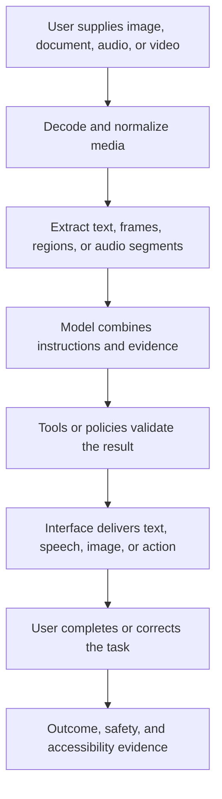
```mermaid
flowchart TD
    A["User supplies image, document, audio, or video"] --> B["Decode and normalize media"]
    B --> C["Extract text, frames, regions, or audio segments"]
    C --> D["Model combines instructions and evidence"]
    D --> E["Tools or policies validate the result"]
    E --> F["Interface delivers text, speech, image, or action"]
    F --> G["User completes or corrects the task"]
    G --> H["Outcome, safety, and accessibility evidence"]
```

This view creates three levels of evaluation:

- **component checks** locate failures in decoding, OCR, transcription, localization, or rendering;
- **cross-modal checks** verify that claims match the relevant image region, page, speaker, or time interval;
- **end-to-end checks** decide whether the user received a correct, usable, and policy-compliant outcome.

A release report needs all three. End-to-end success without component evidence is hard to debug. Strong component scores without a safe outcome can approve the wrong product.

## Define The Expected Task And Failure Types

<!-- section-summary: A task contract states the supported inputs, required evidence, allowed outputs, abstention behavior, and harms that can block release. -->

Before collecting examples, define exactly what the feature promises. This is the **task contract**. In essence, it describes what the application may accept, what evidence it must use, what it may return, and how it behaves if the evidence is weak or conflicting.

Consider a document assistant that extracts a payment total. The contract may support typed invoices in selected languages and require the page number plus a bounding box around the amount. Handwritten invoices may route to human review. A tax estimate that is absent from the document is outside the task. These boundaries make “correct” testable.

The failure model groups the ways the contract can break:

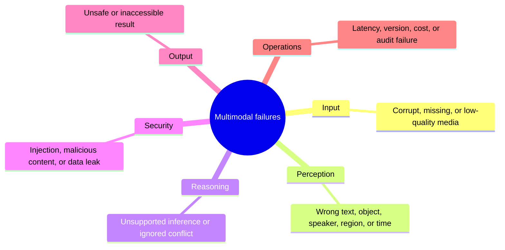
```mermaid
mindmap
  root((Multimodal failures))
    Input
      Corrupt, missing, or low-quality media
    Perception
      Wrong text, object, speaker, region, or time
    Reasoning
      Unsupported inference or ignored conflict
    Security
      Injection, malicious content, or data leak
    Output
      Unsafe or inaccessible result
    Operations
      Latency, version, cost, or audit failure
```

The contract should also name the **abstention** path. Abstention means the system says it lacks enough evidence and asks for a better input or human review. It is a valid outcome for unreadable, ambiguous, or unsupported media. An eval that rewards confident guesses will train the release process toward unsafe behavior.

A compact case schema makes the contract executable:

```yaml
case:
  id: invoice_total_rotated_018
  task: extract_total
  assets:
    - uri: fixtures/invoices/018.pdf
      sha256: verified_in_manifest
  conditions: [rotated_page, dense_table, english]
  expected:
    amount: "1284.50"
    currency: "GBP"
    evidence:
      page: 2
      region: [0.61, 0.73, 0.88, 0.82]
    allowed_outcomes: [answer, human_review]
    forbidden_outcomes: [invented_tax_advice]
```

The coordinates are normalized from zero to one, so the case can be checked across image sizes. The media hash binds the label to exact bytes. This prevents a quietly replaced fixture from changing the meaning of an old evaluation run.

## Build A Dataset From Real Media Conditions

<!-- section-summary: A useful evaluation dataset crosses supported tasks with media conditions, user environments, rare hazards, and deliberate counterexamples. -->

A benchmark dataset usually asks whether a model can solve a broad class of problems. A product dataset asks whether this application works for its users. The dataset should mirror the supported task distribution, then add difficult and harmful cases that production traffic may contain too rarely to measure safely.

Start with a matrix. One axis contains task classes such as field extraction, visual question answering, chart interpretation, speaker attribution, or video event detection. Other axes describe the media and environment: resolution, compression, rotation, lighting, background noise, accent, document length, frame rate, language, device, and accessibility path.

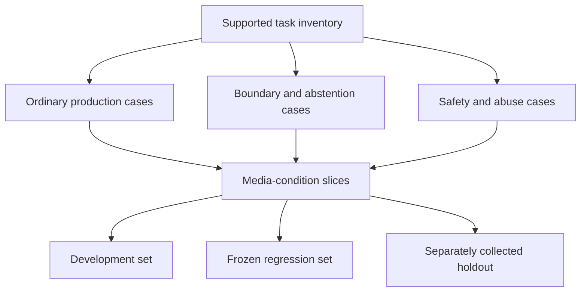
```mermaid
flowchart TD
    A["Supported task inventory"] --> B["Ordinary production cases"]
    A --> C["Boundary and abstention cases"]
    A --> D["Safety and abuse cases"]
    B --> E["Media-condition slices"]
    C --> E
    D --> E
    E --> F["Development set"]
    E --> G["Frozen regression set"]
    E --> H["Separately collected holdout"]
```

A **slice** is a meaningful subgroup that may fail differently from the average. Examples include low-light images, scans with handwriting, calls with overlapping speech, long videos, right-to-left documents, or screen-reader output. Report slice counts with their metrics. An overall 96 percent score can hide a supported language at 62 percent.

Several dataset rules matter in practice:

- keep pages from one document and neighboring frames from one video in the same split;
- keep near-duplicate files together so the holdout does not repeat development data;
- separate ordinary cases from safety blockers and adversarial cases;
- record consent, licence, source, retention class, and allowed evaluation use;
- include corrupted, missing, unsupported, and contradictory inputs;
- preserve a real-world holdout because synthetic media cannot prove field performance by itself.

Labels for multimodal tasks often need structure. A document answer may require value, page, and region. An audio label may need speaker and time span. A video label may need an event interval and the frames that prove it. Free-form reference text alone throws away this evidence.

Human labelers need the same task contract as the model. Give them examples of ambiguous cases, a path to mark “cannot determine,” and an expert escalation route. Review disagreement before declaring one answer to be ground truth.

## Test Media Processing Before Model Quality

<!-- section-summary: Decoder, sampling, resampling, rotation, OCR, and preprocessing checks prove that the model received the intended evidence. -->

The first technical evaluation checks the bytes that reached the model. This stage catches failures that a model grader cannot diagnose. A blank page after PDF rendering, a silent audio channel, or a frame sampler that skips the only relevant event will make every downstream score misleading.

For images and documents, test file-type detection, decompression limits, orientation, color conversion, page count, resize policy, and crop boundaries. Compare the transformed image with the original using saved thumbnails or pixel-level checks where appropriate. For audio, validate channel count, duration, sample rate, clipping, silence, and resampling. For video, record duration, frame rate, audio presence, chosen timestamps, and sampling policy.

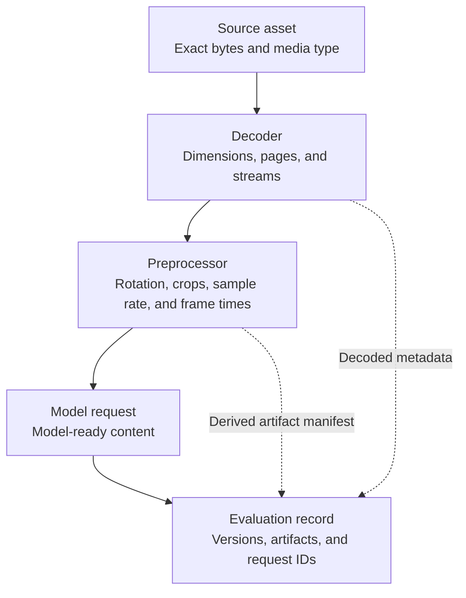
```mermaid
flowchart TD
    A["Source asset<br/>Exact bytes and media type"] --> B["Decoder<br/>Dimensions, pages, and streams"]
    B --> C["Preprocessor<br/>Rotation, crops, sample rate, and frame times"]
    C --> D["Model request<br/>Model-ready content"]
    D --> E["Evaluation record<br/>Versions, artifacts, and request IDs"]
    B -. "Decoded metadata" .-> E
    C -. "Derived artifact manifest" .-> E
```

The evaluation record stores the source hash, decoder version, preprocessing version, and a manifest of derived artifacts. It also records the exact model input detail or media settings. Two model runs are comparable only if they saw equivalent evidence.

Test resource limits as part of this layer. Very large dimensions, compressed archives, malformed containers, long silence, and extreme video duration should fail early with a clear user outcome. File parsing runs in an isolated process with time, memory, and decompression limits. An uploaded document never gains network or tool authority merely because a model can read it.

## Measure Visual And Spatial Understanding

<!-- section-summary: Visual evaluation checks both the answer and the image region that supports it, especially for small, crowded, or partially hidden objects. -->

Image evaluation contains more than object naming. The application may need to count items, read a label, compare two regions, estimate a state, or point to evidence. Each task needs a metric that matches its output.

For classification, use precision, recall, and a confusion matrix. **Precision** asks how many predicted positives were correct. **Recall** asks how many true positives the system found. Recall often matters for hazards because a missed positive can be more serious than a false alert.

For localization, compare predicted and labelled regions. **Intersection over Union**, usually shortened to IoU, measures how much two bounding boxes or masks overlap relative to their combined area. A point-in-region check may be sufficient for a click target. Dense scenes may need per-object matching so one large box cannot receive credit for several objects.

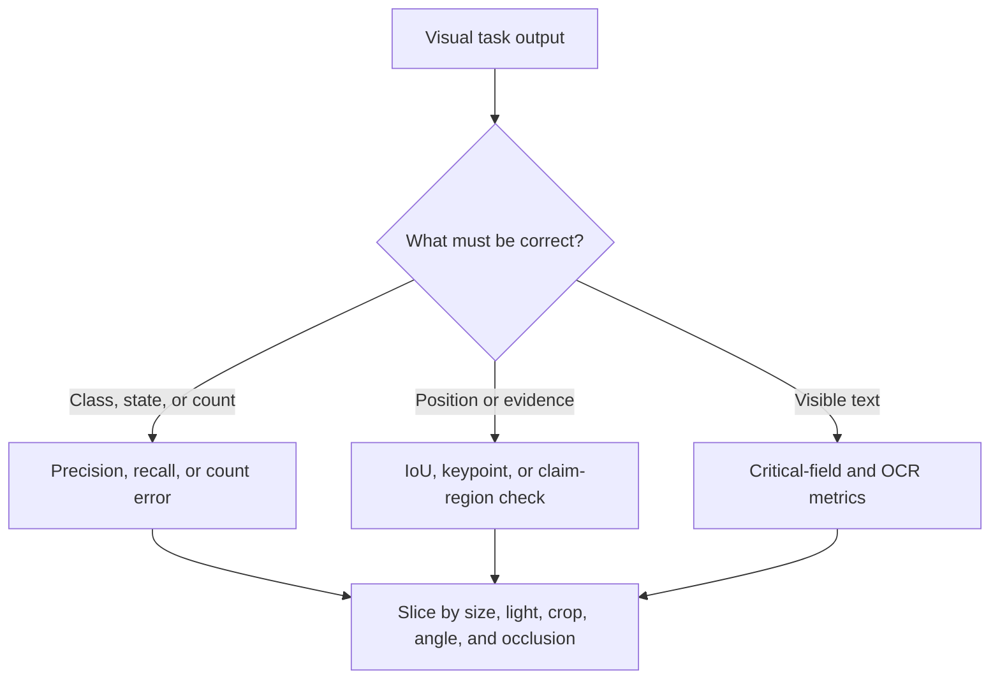
```mermaid
flowchart TD
    A["Visual task output"] --> B{"What must be correct?"}
    B -->|Class, state, or count| C["Precision, recall, or count error"]
    B -->|Position or evidence| D["IoU, keypoint, or claim-region check"]
    B -->|Visible text| E["Critical-field and OCR metrics"]
    C --> F["Slice by size, light, crop, angle, and occlusion"]
    D --> F
    E --> F
```

For example, a shelf image may contain a small warning label beside several similar labels. The answer can reproduce the correct text after guessing from context. Requiring the correct region distinguishes visual reading from a plausible guess. A second case removes the label or swaps it with a counterexample to test whether the claim follows the pixels.

Test image perturbations that resemble production: downscaling, compression, glare, rotation, blur, partial obstruction, unusual aspect ratios, screenshots inside screenshots, and text near image edges. Avoid treating every artificial distortion as equally important. Weight ordinary conditions by expected traffic and keep safety-critical edge cases as separate blockers.

## Evaluate Documents, OCR, Tables, and Charts

<!-- section-summary: Document evaluation separates text recognition, layout, retrieval, structured extraction, and evidence citation so a fluent answer cannot hide a page-level error. -->

A document is both text and layout. Reading order, headings, footnotes, tables, checkboxes, page boundaries, and visual annotations can change meaning. Flattening everything into one string may mix columns or detach a number from its label.

**Optical character recognition**, or OCR, converts visible text into machine-readable text. Character error rate and word error rate are useful diagnostics. Production tasks also need critical-field accuracy. Misreading a decorative sentence may have little impact. Changing an account number or dosage can change the task outcome. The same applies to a total, minus sign, or unit.

Evaluate a document pipeline in layers:

1. Did the renderer produce every expected page?
2. Did OCR recover text, reading order, and important symbols?
3. Did layout analysis keep headings, cells, and labels connected?
4. Did retrieval select the right page or region?
5. Did the model return the correct structured value?
6. Does the cited page and region actually support the answer?

Tables need cell-level checks. A correct value from the wrong row or column is still wrong. A label can connect the value to its row header and column header. It can also preserve the cell span, normalized value, and source coordinates.

Charts add another relationship between legends, series, axes, units, and data points. Evaluate each relationship before checking any calculation made from the chart.

Consider a line chart with revenue on the left axis and customer count on the right axis. A model may read the correct height from the wrong scale and produce a convincing answer. The eval should identify the chosen series and axis. It should also check the unit, time point, and numeric result. If the original structured data is available, compare against it while still testing whether the visual path reaches the same answer.

```yaml
expected:
  answer: "14.2"
  unit: "million GBP"
  chart:
    series: revenue
    x_value: "Q3"
    axis: left
  evidence:
    page: 7
    regions:
      - kind: legend
      - kind: data_point
      - kind: y_axis
```

Documents also carry security risks. Test hidden OCR layers, white text, comments, and attachments. Add cases with macros, external links, and instructions embedded in headers or images. Extraction code exposes all of this material as untrusted content. The application does not treat it as policy.

## Evaluate Audio And Video Over Time

<!-- section-summary: Audio and video evaluation binds claims to speakers, sounds, frames, and time intervals instead of grading only a final summary. -->

Audio and video add a time axis. A correct event with the wrong speaker or timestamp can be unusable. A summary can also sound accurate after the system missed the event that mattered most.

For speech recognition, word error rate remains a useful baseline. Add **critical entity accuracy** for names, numbers, codes, units, and negation. Measure speaker attribution if the task uses diarization. **Diarization** is the process of deciding who spoke during each time interval. For generated speech, test pronunciation, intelligibility, interruption behavior, caption agreement, and whether required warnings were actually played.

Audio fixtures should cover background noise, echo, overlapping speech, clipped beginnings, long pauses, accents, code-switching, music, and speaker changes. A concrete failure case is “do not approve item B-17” becoming “approve item B-70.” Overall transcription can remain excellent while the task-critical meaning reverses.

Video evaluation must specify how evidence is sampled and labelled:

- frame-level classification checks a property at individual timestamps;
- event detection asks whether an event occurred;
- temporal localization asks for its start and end;
- tracking follows an object across frames;
- audio-visual alignment checks whether sound and image refer to the same moment;
- summary evaluation checks coverage, accuracy, and unsupported claims.

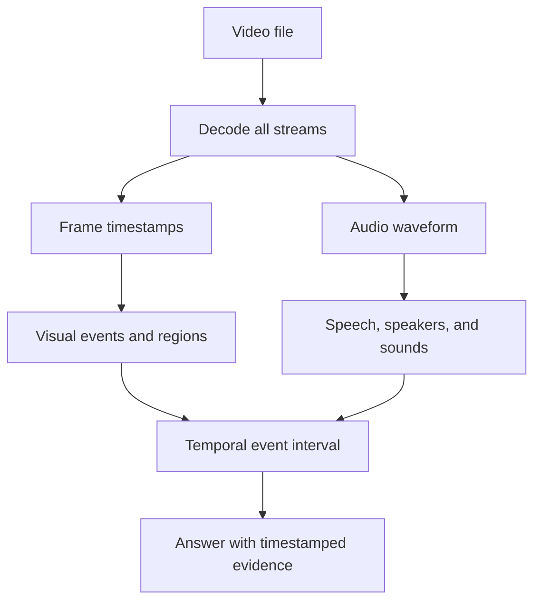
```mermaid
flowchart TD
    A["Video file"] --> B["Decode all streams"]
    B --> C["Frame timestamps"]
    B --> D["Audio waveform"]
    C --> E["Visual events and regions"]
    D --> F["Speech, speakers, and sounds"]
    E --> G["Temporal event interval"]
    F --> G
    G --> H["Answer with timestamped evidence"]
```

For temporal localization, **temporal IoU** applies the overlap idea to time intervals. If the labelled event runs from 42 to 49 seconds and the prediction says 40 to 60, it found the event but localized it poorly. Release criteria can combine event recall with a minimum temporal overlap.

Frame sampling deserves its own tests. Run cases where the key event falls between regular sample points, lasts only a moment, or appears during a scene cut. Compare fixed-rate sampling, scene-based sampling, and any adaptive policy on the same source videos. Never interpret “absent from sampled frames” as proof that an event did not occur.

## Test Whether The Model Connects And Resolves Modalities

<!-- section-summary: Cross-modal evaluation checks whether each claim is supported by the correct media evidence and whether contradictory signals trigger a safe resolution. -->

Multimodal models can combine evidence across channels. They can also combine the wrong pieces. **Cross-modal grounding** means a claim is tied to the relevant image region, document page, audio segment, or video interval. **Alignment** means the channels refer to the same object, speaker, or moment.

The eval record should store evidence references independently from the prose answer. A model-generated citation is still a prediction. A grader verifies that the referenced artifact exists, lies inside the input, and supports the claim.

Conflicts need an explicit product rule. Suppose a photographed label shows `3.2 A` while the user says `32 amps`. The system should surface the disagreement and request confirmation. Quietly choosing one channel creates hidden risk.

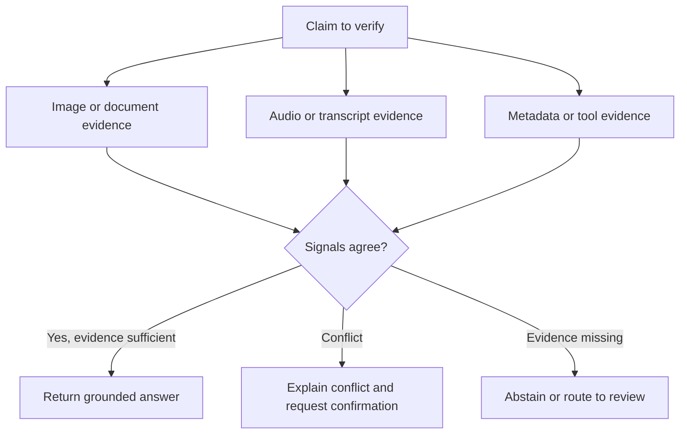
```mermaid
flowchart TD
    A["Claim to verify"] --> B["Image or document evidence"]
    A --> C["Audio or transcript evidence"]
    A --> D["Metadata or tool evidence"]
    B --> E{"Signals agree?"}
    C --> E
    D --> E
    E -->|Yes, evidence sufficient| F["Return grounded answer"]
    E -->|Conflict| G["Explain conflict and request confirmation"]
    E -->|Evidence missing| H["Abstain or route to review"]
```

Build paired cases that isolate the source of truth:

- keep the image fixed and change the spoken description;
- keep the transcript fixed and replace the chart;
- remove the cited page while preserving surrounding text;
- shift the video audio track relative to the frames;
- provide two images of different objects in one turn.

These counterfactuals reveal whether the system follows the media, the user's assertion, the prompt wording, or a familiar pattern. They are especially valuable for tasks where a plausible answer can earn a high text-only judge score.

## Evaluate Generated Outputs And Accessibility

<!-- section-summary: Output evaluation covers the generated content, the delivery channel, and whether people can perceive, control, and verify the result. -->

Multimodal systems can return text, images, speech, video, overlays, or actions. The output contract should state which formats are allowed and what must remain equivalent across them. A caption that omits a spoken warning or an image overlay that relies only on color creates a real product failure.

For generated images, test prompt adherence, unwanted text, object count, anatomy or geometry required by the task, brand and identity rules, harmful content, and consistency with any source image. For generated audio, test pronunciation, language, speed, voice consent, and whether the transcript matches the audio. For generated video, add temporal continuity, audio sync, flashing risk, and frame-to-frame identity consistency.

Accessibility belongs inside the eval matrix. WCAG calls for text alternatives to non-text content and alternatives such as captions for time-based media. Product testing should also cover keyboard operation, pause and stop controls, screen-reader order, non-color indicators, contrast, adjustable playback, and a text path for people who cannot use voice or camera input.

A useful accessibility case describes the same task through several paths:

```yaml
accessibility_case:
  task: understand_warning
  variants:
    spoken_audio: [warning_text, stop_control]
    captions: [warning_text, speaker_identity]
    screen_reader: [warning_text, evidence_description, action]
  equivalent_meaning_required: true
```

Evaluate the delivered output rather than the generated artifact alone. A speech response interrupted before its warning has failed delivery. A correct image hidden behind an inaccessible control has failed the user task. Client events should record playback position, caption state, selected alternative, and user correction without placing raw sensitive media in general telemetry.

## Test Instructions Hidden In Media

<!-- section-summary: Images, documents, transcripts, and subtitles are untrusted data that may contain instructions intended to redirect the model or activate tools. -->

**Prompt injection** occurs when untrusted content tries to override the application's instructions. In a multimodal system, the attack can appear as visible text in an image, hidden text in a document, an OCR layer, subtitles, a QR code, a recorded voice, or metadata. OWASP includes multimodal injection in its prompt-injection guidance.

The central security rule is provenance of authority. System policy comes from the application. Media supplies evidence for the task. Words found inside that media do not acquire developer authority.

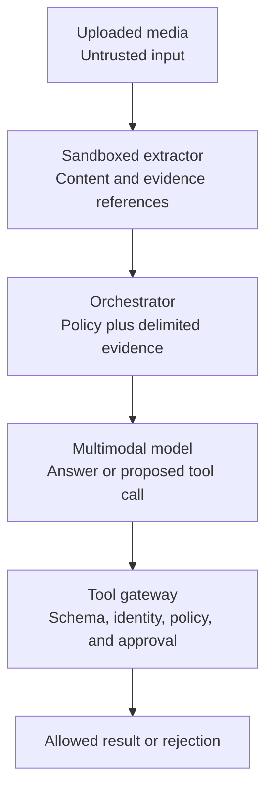
```mermaid
flowchart TD
    A["Uploaded media<br/>Untrusted input"] --> B["Sandboxed extractor<br/>Content and evidence references"]
    B --> C["Orchestrator<br/>Policy plus delimited evidence"]
    C --> D["Multimodal model<br/>Answer or proposed tool call"]
    D --> E["Tool gateway<br/>Schema, identity, policy, and approval"]
    E --> F["Allowed result or rejection"]
```

Defence uses several layers:

1. Parse files in a sandbox and remove active content.
2. Mark extracted text and media as untrusted in the request structure.
3. Give the model the minimum tools needed for the current task.
4. Validate tool names and arguments against schemas and policy.
5. Require user approval for consequential or external actions.
6. Block direct navigation to links or QR destinations from uploaded media.
7. Scan for prompt attacks, then assume the scanner can miss some attacks.
8. Red-team indirect instructions across every supported modality.

A test image might contain a normal receipt plus small text telling the assistant to email stored documents. The expected result is the receipt task only, with no email call. A second test places the same instruction in the OCR layer of a PDF. Another speaks it in background audio. These are separate fixtures because each extraction path has different controls.

Model refusal is helpful, but downstream authorization remains the security boundary. A successful injection should still be unable to read another user's object, change a payment, or publish content without the required identity and approval.

## Moderate Unsafe Media And Record Its Source

<!-- section-summary: Safety filters classify harmful input and output, while provenance records the origin and edit history of generated media without claiming that the content is true. -->

Multimodal applications may receive or create violent, sexual, hateful, self-harm, deceptive, or otherwise restricted content. Define policy categories for the product, then measure both missed violations and false blocks. The same threshold rarely fits every surface. A private medical workflow and a public image generator may have different handling rules.

Moderation runs at several points: before expensive inference, after generation, and before external publication. Audio can be transcribed for text moderation, and video can be sampled into frames, but those conversions lose information. A text-and-image filter does not certify an audio or video system. Direct media review and sequence-level tests remain necessary.

Safety cases should include benign material that resembles a violation. Otherwise the release may improve blocking by making the product unusable. Measure category precision and recall, severity agreement, block rate, appeal or correction rate, and performance across supported languages and visual styles.

Generated media also needs **provenance**, which means a record of its origin and history. C2PA Content Credentials provide a cryptographically bound way to record assertions about an asset, its ingredients, edits, and use of AI. A valid credential can show that the recorded history has not been tampered with. It does not prove that the depicted event is true.

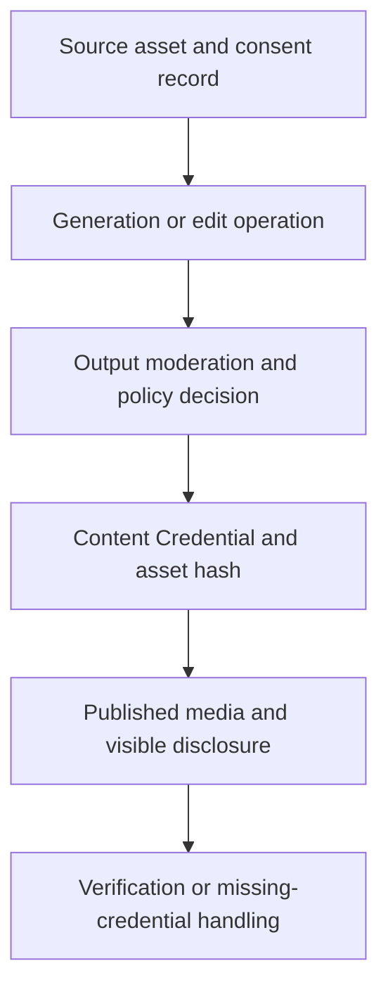
```mermaid
flowchart TD
    A["Source asset and consent record"] --> B["Generation or edit operation"]
    B --> C["Output moderation and policy decision"]
    C --> D["Content Credential and asset hash"]
    D --> E["Published media and visible disclosure"]
    E --> F["Verification or missing-credential handling"]
```

Keep the source references, generator and policy versions, edit operations, and output hash in the asset record. Sign or attach Content Credentials where the delivery format supports them. Define a fallback because platforms may strip metadata. A visible disclosure and server-side audit record can preserve important context even if the embedded credential disappears.

Voice and likeness require explicit consent and purpose controls. The consent record identifies the approved voice, user, and product. It also explains how consent can be revoked. Test identity confusion and impersonation attempts. Include generated content that implies a real person said or did something outside the allowed use.

## Combine Deterministic, Model, And Human Evaluation

<!-- section-summary: A layered grader stack uses code for objective facts, judge models for bounded rubrics, and people for expert or context-dependent decisions. -->

A **grader** turns one evaluation run into a score, label, or explanation. No single grader type covers the whole multimodal task.

Deterministic code is strongest for facts with a precise representation: schema validity, exact identifiers, numeric tolerance, region overlap, timestamp overlap, allowed tool calls, latency, and delivery state. Reference-based metrics cover OCR, transcription, and structured extraction. They are repeatable and easy to place in CI.

A **model judge** uses another model to apply a rubric. It helps with clarity, summary coverage, grounded explanations, and pairwise preference. An image-capable judge may also assess visual quality. The rubric should list observable criteria and examples. If the judge receives only a transcript or image description, it cannot grade evidence present only in the raw media. Audio and video often need prepared segments plus specialist graders.

Human reviewers handle ambiguous, high-impact, culturally sensitive, and expert tasks. They also create calibration data for model judges. Reviewers should see the candidate and baseline in blinded order where possible, use a structured rubric, and have an escalation path.

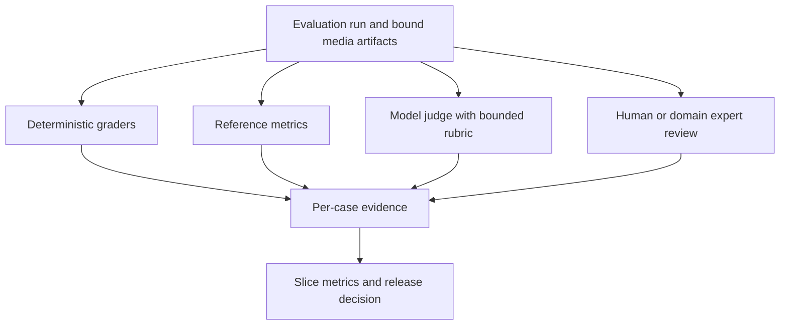
```mermaid
flowchart TD
    A["Evaluation run and bound media artifacts"] --> B["Deterministic graders"]
    A --> C["Reference metrics"]
    A --> D["Model judge with bounded rubric"]
    A --> E["Human or domain expert review"]
    B --> F["Per-case evidence"]
    C --> F
    D --> F
    E --> F
    F --> G["Slice metrics and release decision"]
```

MLflow 3 and Databricks support custom code-based scorers that receive inputs, outputs, expectations, and the trace. This is useful for media metrics that a built-in text judge does not own:

```python
from mlflow.genai.scorers import scorer


@scorer
def evidence_region_iou(*, outputs, expectations) -> float:
    predicted = outputs["evidence_region"]
    expected = expectations["evidence_region"]
    intersection = overlap_area(predicted, expected)
    union = box_area(predicted) + box_area(expected) - intersection
    return intersection / union if union else 0.0
```

The scorer is intentionally small. Media decoding and region normalization happen in tested application code. The evaluation run stores the scorer version, input hash, trace, and result so failures can be reproduced.

Treat judge-model output as another measurement. Isolate untrusted candidate text from the rubric, disable tools, require structured output, and test whether injected media or responses can manipulate the judge. A model should never grade its own unsupported claim solely by reading the prose it generated.

## Measure Evaluation Uncertainty And Grader Quality

<!-- section-summary: Release evidence includes sample size, repeated-run variation, confidence intervals, slice performance, reviewer agreement, and judge calibration. -->

An evaluation score is an estimate from a sample. `18/20` and `900/1000` both equal 90 percent, yet the smaller result carries far more uncertainty. Reports should include the numerator, denominator, and an interval appropriate to the metric.

Use paired comparisons for candidate and baseline. Both versions process the same fixtures, so each case controls for its own difficulty. Inspect the disagreement set: cases fixed by the candidate, cases broken by it, and cases both versions miss. For stochastic systems, repeat critical cases and report failure frequency rather than keeping the best run.

Safety blockers and statistical metrics serve different roles. One unauthorized external action can block release even if average task success improves. A small accessibility slice may trigger more data collection or a rollout restriction because its uncertainty is too high.

Human and model graders also need evaluation. Build a judge-calibration set with expert labels. Measure agreement, false passes, false failures, and performance by task and modality. Revisit the rubric if reviewers disagree about the meaning of a criterion.

```yaml
evaluation_result:
  slice: chart_question:right_axis
  candidate: {passed: 184, total: 200}
  baseline: {passed: 176, total: 200}
  paired:
    candidate_only: 17
    baseline_only: 9
  critical_failures: 1
  reviewer_agreement: 0.91
  release_status: blocked_for_critical_failure
```

The candidate improved the aggregate score in this example. The release stays blocked because one critical failure violated the task contract. The team investigates that case, adds a regression, and decides whether to fix the system or narrow the supported chart types.

## Choose Current Evaluation And Safety Tools

<!-- section-summary: Current platforms can run datasets, rubrics, human review, safety filters, traces, and custom scorers, while the product still owns media ground truth and release policy. -->

Industrial tools reduce the work needed to schedule evaluations, compare runs, collect feedback, and apply safety filters. They execute parts of the framework described above. The application still owns the task contract, exact media assets, evidence labels, slice design, and release decision.

### OpenAI

OpenAI Datasets provide an interactive space for prompt cases and graders. Current OpenAI guidance directs new evaluation work toward Datasets and marks the legacy Evals platform for deprecation. Graders can support structured or model-based checks around model responses, while application code remains responsible for region, timestamp, delivery, and other media-specific evidence.

OpenAI's current omni-moderation model accepts text and images. It does not accept audio or video. An audio or video application therefore needs additional moderation and evaluation paths rather than assuming one image-capable filter covers every modality.

### Amazon Web Services

Amazon Bedrock Evaluations supports automatic metrics, judge-model evaluation, and evaluation with human workers. This can run comparative response assessment and managed review jobs. Amazon Bedrock Guardrails provides content filters and other safeguards; current documentation includes harmful text and image filtering, with capability and maturity varying by region.

Use Bedrock evaluation jobs for the rubric and review work they support. Keep custom media graders for exact OCR fields, spatial regions, speaker attribution, timestamps, and delivered playback. Test the chosen Guardrails configuration on the product's own languages and media distribution.

### Google Cloud

The Gen AI evaluation service in Gemini Enterprise Agent Platform supports adaptive and static rubrics, computation-based metrics, custom Python functions, dataset workflows, and sampling from production logs. The recommended GenAI Client in the Agent Platform SDK is Preview. The older `vertexai.evaluation.EvalTask` module is GA and remains available for backward compatibility, but it is no longer under active development.

Custom functions are the natural place for product-specific structured checks. Raw-media support and judge modality must be confirmed for the selected workflow. A text grounding metric cannot establish whether an answer points to the correct pixels or video interval.

### Microsoft

Microsoft Foundry provides model and agent evaluators, including risk and safety evaluators for generated responses. Azure AI Content Safety in Foundry Tools exposes text, image, and multimodal image-with-text analysis. The multimodal Content Safety path remains preview, and Microsoft documents feature, region, and media limits.

Prompt Shields and several other Content Safety capabilities operate on text. Keep document, audio, video, and indirect-media attacks in the application's red-team suite even if extracted text also passes through a managed filter.

### MLflow and Databricks

MLflow 3 provides evaluation datasets, human feedback, traces, model judges, custom scorers, and production scoring. Databricks integrates these capabilities with managed experiments and monitoring. This makes it a useful provider-neutral control plane for results produced by cloud services and custom media graders.

The same scorer may run offline against a candidate and later sample production traces. Code-based media scorers remain appropriate for exact evidence checks. Automatic online evaluation in current MLflow guidance uses judge-based scorers, so teams should verify which offline code checks need a separate scheduled production job.

## Monitor The Multimodal Application In Production

<!-- section-summary: Production monitoring connects media-pipeline health, safety actions, sampled quality, user corrections, and delayed outcomes to the exact released bundle. -->

Offline evaluation proves behavior on a controlled set. Production monitoring checks whether real inputs and user environments still resemble that evidence. It also finds failure modes the dataset missed.

Begin with pipeline integrity:

- accepted and rejected media types;
- decoder failures, missing pages, empty audio, and frame-sampling errors;
- image dimensions, document length, audio duration, and video duration distributions;
- OCR and transcription availability;
- provider, model, prompt, preprocessor, grader, and policy versions;
- latency, cost, retries, fallbacks, and human-review queue time.

Then monitor quality and safety outcomes. Useful signals include abstention rate, missing-evidence rate, user corrections, unsupported-claim samples, content-filter actions, injection detections, tool denials, accessibility-path success, and task completion. Delayed labels such as corrected document fields or reviewed video events should join back to the original inference ID.

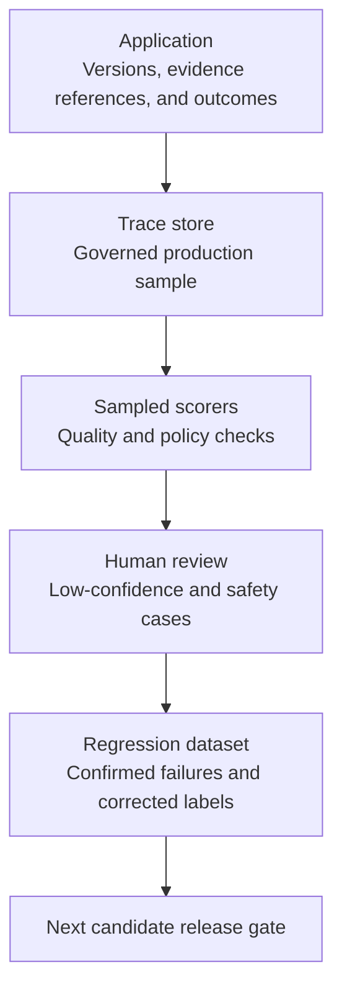
```mermaid
flowchart TD
    A["Application<br/>Versions, evidence references, and outcomes"] --> B["Trace store<br/>Governed production sample"]
    B --> C["Sampled scorers<br/>Quality and policy checks"]
    C --> D["Human review<br/>Low-confidence and safety cases"]
    D --> E["Regression dataset<br/>Confirmed failures and corrected labels"]
    E --> F["Next candidate release gate"]
```

Raw media can contain faces, voices, locations, health information, documents, and bystanders. General logs should store hashes, governed object references, derived metrics, and redacted evidence.

Access to review media needs a declared purpose and short retention. Audit every access. Deletion must cover derived crops, transcripts, frames, embeddings, and label queues.

Alert by actionability. A decoder-error spike goes to the media pipeline owner. A rise in unsafe image blocks goes to safety operations. A drop in critical-field accuracy comes from reviewed outcomes and may pause a task route. One blended “multimodal quality” dashboard will conceal these different responses.

## Use Evaluation Evidence For Release Gates

<!-- section-summary: A release gate combines hard safety blockers, paired quality metrics, slice limits, accessibility checks, human sign-off, canary evidence, and a tested rollback. -->

A release candidate is a bundle. It includes model snapshot or route, prompt, tool schemas, media decoder, preprocessing, OCR or transcription service, sampling policy, safety filters, graders, client delivery code, and fallback behavior. Changing any of these can alter the user outcome.

Run candidate and baseline against identical source bytes. Compare end-to-end task success first, then diagnose component and slice results. Keep hard blockers separate from improvement metrics.

```yaml
release_gate:
  hard_blockers: {unauthorized_actions: 0, unsafe_claims: 0}
  minimums:
    end_to_end_task_success: 0.94
    critical_entity_accuracy: 0.99
    evidence_grounding_precision: 0.97
    required_human_review_recall: 0.995
  maximums: {slice_regression: 0.02, injection_success: 0.00}
  required_reviews: [domain_owner, safety_owner, accessibility_owner]
```

The values above illustrate the structure. Real thresholds come from the task's harm analysis, baseline, user research, and operational capacity.

After offline approval, use shadow traffic or a narrow canary. **Shadow traffic** runs the candidate without showing its result to the user. A **canary** exposes a controlled share of real traffic. Start with low-impact tasks, monitor reviewed outcomes, and keep the ability to disable one modality or task class independently.

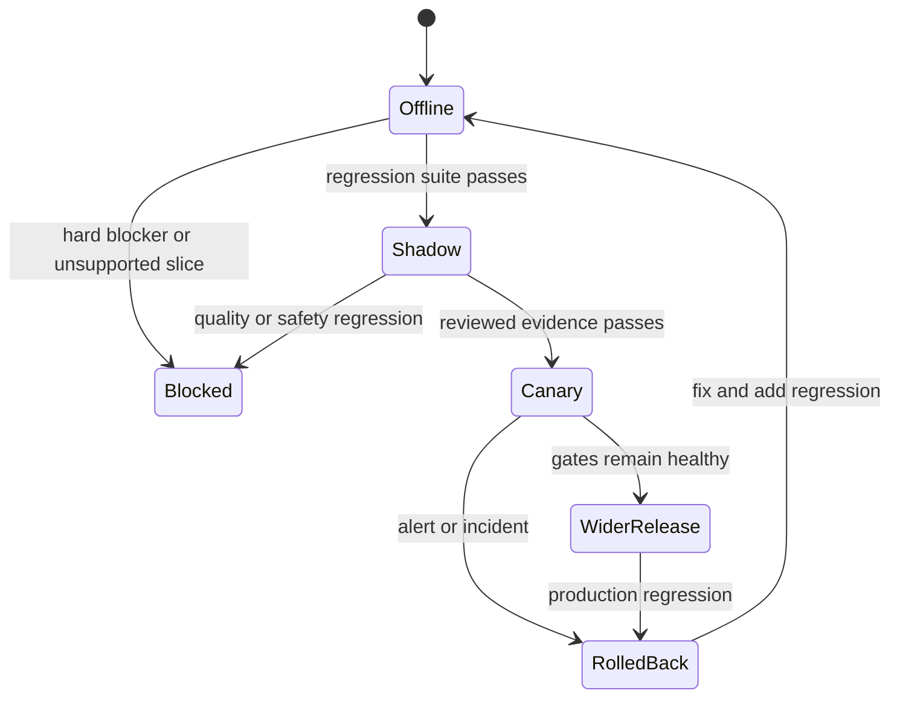
```mermaid
stateDiagram-v2
    [*] --> Offline
    Offline --> Blocked: hard blocker or unsupported slice
    Offline --> Shadow: regression suite passes
    Shadow --> Blocked: quality or safety regression
    Shadow --> Canary: reviewed evidence passes
    Canary --> RolledBack: alert or incident
    Canary --> WiderRelease: gates remain healthy
    WiderRelease --> RolledBack: production regression
    RolledBack --> Offline: fix and add regression
```

An incident creates a regression case after privacy review. Preserve the source hash or governed reference, derived artifacts, exact release bundle, evidence links, delivered output, tool decisions, and confirmed outcome. Roll back the affected bundle rather than swapping only the model if preprocessing or policy caused the failure.

## How The Complete Evaluation System Fits Together

<!-- section-summary: A production multimodal evaluation system joins task contracts, media evidence, layered graders, safety controls, monitoring, and reversible release decisions. -->

The task contract defines what the application promises and where it must abstain. The dataset then represents ordinary use, difficult conditions, unsupported inputs, accessibility paths, harmful content, and adversarial media. Exact source assets remain bound to structured ground truth.

Component checks prove that the media pipeline preserved pages, pixels, audio, frames, and timing. Task graders measure fields, objects, regions, speakers, intervals, and outcomes. Cross-modal graders verify that every important claim follows the right evidence and that conflicts reach a safe resolution. Human reviewers and calibrated judge models cover qualities that deterministic code cannot express well.

Managed evaluation platforms, safety services, and MLflow can run and observe parts of this system. Their boundaries matter: text or image support does not imply audio or video coverage, and a response judge cannot see evidence it never receives. Production monitoring closes the loop through user corrections, delayed labels, safety actions, and incident regressions.

The release decision can then answer a concrete question: does this exact application bundle complete its supported multimodal tasks for its supported users and conditions? The answer must account for required evidence, safety controls, accessibility, and recovery behavior. That is the standard a production system needs.

## References

- [OpenAI: Getting started with Datasets](https://developers.openai.com/api/docs/guides/evaluation-getting-started)
- [OpenAI: Evaluation best practices](https://developers.openai.com/api/docs/guides/evaluation-best-practices)
- [OpenAI: Graders](https://developers.openai.com/api/docs/guides/graders)
- [OpenAI: Moderation](https://developers.openai.com/api/docs/guides/moderation)
- [OpenAI: omni-moderation model](https://developers.openai.com/api/docs/models/omni-moderation-latest)
- [AWS: Amazon Bedrock evaluations](https://docs.aws.amazon.com/bedrock/latest/userguide/evaluation.html)
- [AWS: Amazon Bedrock Guardrails](https://docs.aws.amazon.com/bedrock/latest/userguide/guardrails.html)
- [AWS: Image content filters in Bedrock Guardrails](https://docs.aws.amazon.com/bedrock/latest/userguide/guardrails-mmfilter.html)
- [Google Cloud: Gen AI evaluation service overview](https://docs.cloud.google.com/gemini-enterprise-agent-platform/models/evaluation-overview)
- [Google Cloud: Gen AI evaluation service API](https://docs.cloud.google.com/gemini-enterprise-agent-platform/reference/models/evaluation)
- [Google Cloud: Prepare an evaluation dataset](https://docs.cloud.google.com/gemini-enterprise-agent-platform/models/evaluation-dataset)
- [Microsoft Foundry: Risk and safety evaluators](https://learn.microsoft.com/en-us/azure/foundry/concepts/evaluation-evaluators/risk-safety-evaluators)
- [Microsoft Foundry Tools: Azure AI Content Safety](https://learn.microsoft.com/en-us/azure/ai-services/content-safety/overview)
- [Microsoft Foundry Tools: Analyze multimodal content](https://learn.microsoft.com/en-us/azure/ai-services/content-safety/quickstart-multimodal)
- [MLflow: LLM and agent evaluation](https://mlflow.org/docs/latest/genai/eval-monitor/)
- [Databricks: MLflow 3 code-based scorers](https://docs.databricks.com/aws/en/mlflow3/genai/eval-monitor/custom-scorer-reference)
- [NIST: AI Risk Management Framework](https://www.nist.gov/itl/ai-risk-management-framework)
- [NIST: Generative AI Profile](https://www.nist.gov/publications/artificial-intelligence-risk-management-framework-generative-artificial-intelligence)
- [OWASP: Prompt Injection](https://genai.owasp.org/llmrisk/llm01-prompt-injection/)
- [W3C: Web Content Accessibility Guidelines 2.2](https://www.w3.org/TR/WCAG22/)
- [C2PA: Specifications](https://spec.c2pa.org/specifications/)
- [C2PA: Harms Modelling](https://c2pa.org/specifications/specifications/2.0/security/Harms_Modelling.html)
