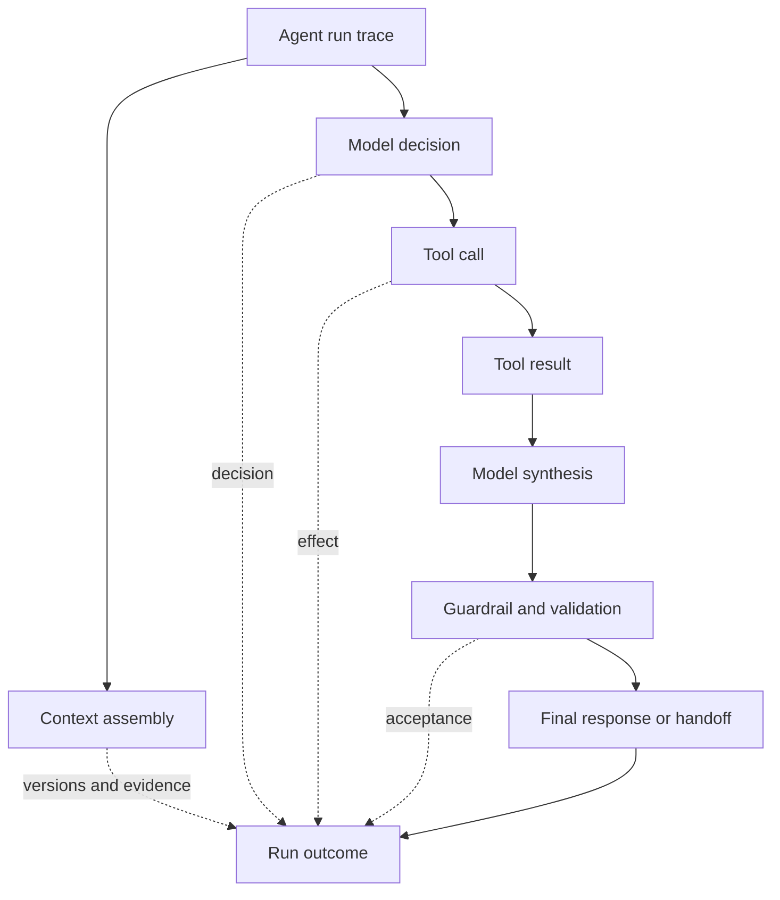
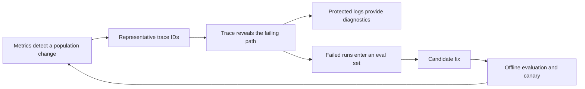
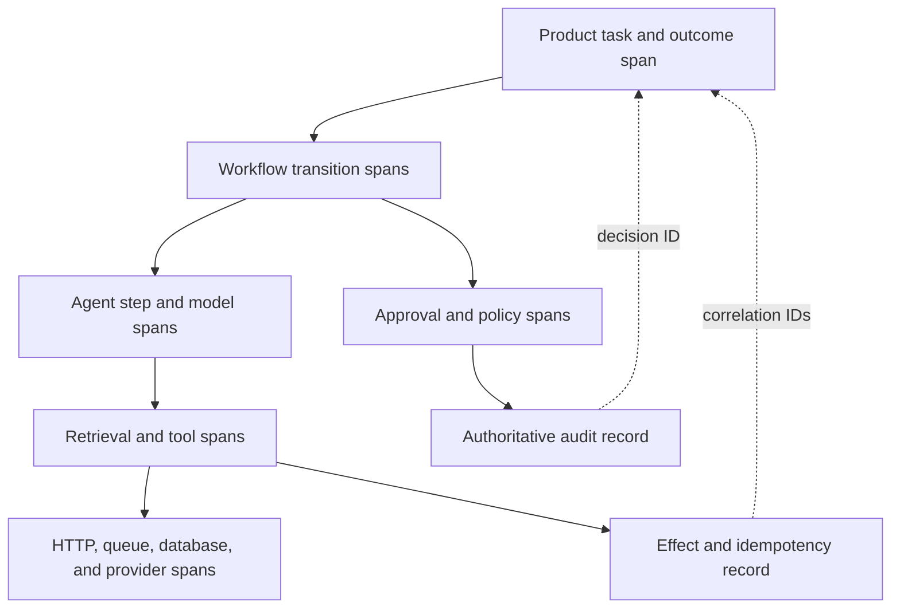
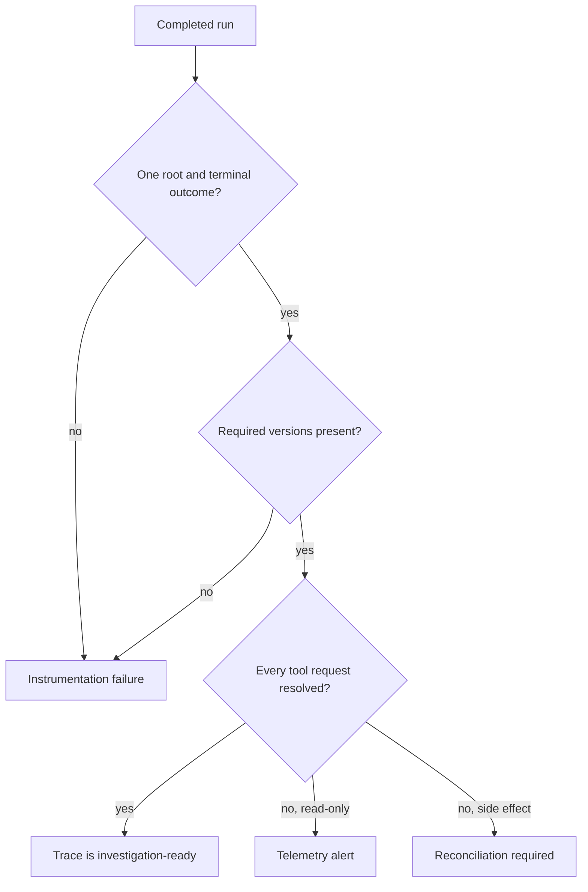

## An Agent Failure Is Usually a Chain, Not One Call

<!-- section-summary: Agent tracing records the causal path of a run so teams can explain how context, decisions, tools, and failures produced an outcome. -->

When a normal API is slow, an engineer often asks which service or database consumed the time. An agent run is harder to explain. The system may retrieve documents, assemble context, call a model, invoke several tools, update state, retry, hand work to another agent, run a guardrail, and finally produce an answer. A poor outcome can originate at any transition.

**Agent tracing** records this path as a connected causal history. A **trace** represents the whole user-facing run. A **span** represents one timed operation within it, such as retrieval or a tool call. An **event** records a notable occurrence inside a span, such as a cache hit, retry, approval, or validation warning.



The purpose is not to collect everything. It is to preserve enough evidence to answer: what did the system attempt, which versions and inputs shaped the decision, where did time and cost go, what side effects occurred, and why was the final outcome accepted or rejected?

## Traces, Metrics, Logs, and Evals Have Different Jobs

<!-- section-summary: Observability works when traces explain individual runs, metrics reveal population changes, logs preserve sparse events, and evals judge quality. -->

Tracing is one part of an observability system:

- **Traces** reconstruct one run and the relationships between its steps.
- **Metrics** summarize many runs, such as p95 latency, success rate, escalation rate, or cost per completed task.
- **Logs** record detailed, discrete events such as a policy rejection or provider error.
- **Evals** judge whether outputs and decisions meet task-specific quality requirements.

A trace does not prove that an answer is correct. It shows which answer was produced and how. An evaluator or reviewer supplies the quality label. Metrics then reveal whether that label changed across models, prompt versions, tenants, or release cohorts. Logs may contain the protected diagnostic detail needed to investigate the underlying error.



This division prevents two common mistakes: turning metrics into a high-cardinality event store, or dumping every prompt into logs and calling the system observable.

## Build the Trace Around the Run Hierarchy

<!-- section-summary: A trace tree should follow the control flow and preserve parent-child relationships across asynchronous work and handoffs. -->

The root span represents the product task, not merely the first HTTP request. Its children represent meaningful stages: routing, context assembly, model generation, retrieval, tool execution, guardrails, validation, checkpointing, and handoff. A tool span can have children for the downstream API and database. A retry is a new attempt span linked to the same logical operation rather than overwriting the first failure.

Parent-child structure answers causal questions. If the final model call took eight seconds, its parent shows which route selected it, while sibling spans show whether retrieval or tools also contributed. If a tool changed production state, its span shows the approval and idempotency identity associated with that effect.

Asynchronous work needs deliberate context propagation. A trace ID and span context must cross queues, workers, tool servers, and agent-to-agent handoffs. A later process can create a child span when the work remains part of the same run, or a **span link** when it starts a separate trace that is causally related. Without propagation, a run appears as several unrelated fragments.

Do not make every helper function a span. Trace operations that matter for latency, decisions, external dependencies, state transitions, cost, policy, or recovery. Excessive detail increases storage and makes the important path harder to read.

## Instrument the Boundaries That Own Meaning

<!-- section-summary: Framework instrumentation captures model activity, while application spans preserve the business decisions, state transitions, and effects needed to explain an outcome. -->

Automatic instrumentation is useful because it records model requests, tool calls, and timing consistently. It cannot infer why `licensed_review` was required, whether a payment proposal matched an approval, or which customer outcome defines success. Those meanings live in application code and domain services.

Build the trace in three layers. The **transport layer** records HTTP, queue, RPC, and database operations. The **agent-runtime layer** records model calls, retrieval, tools, guardrails, and handoffs. The **product layer** records workflow states, policy decisions, approvals, effects, and outcomes. Parent-child relationships connect the layers without forcing one library to understand all of them.



Use trace attributes to link authoritative records, while keeping the trace backend out of the role of system of record. An approval service should retain the signed decision and policy evidence. A payment service should retain the committed effect and idempotency key. The trace keeps their safe identifiers, status, and timing so an investigator can navigate to protected evidence with the right access.

Instrumentation ownership follows the boundary. The runtime team can supply standard model and tool spans. A domain team adds transitions and outcome fields for its workflow. The observability team maintains naming, sampling, redaction, export, and completeness checks. Security and privacy owners define which payload classes may leave the application. This division prevents a central tracing library from collecting content it cannot classify correctly.

Test propagation at every asynchronous boundary. Enqueue a known trace context, run it through a worker and tool service, then verify the resulting parent or link. Test cancellation and delayed work as well as the happy path. If a workflow forks into parallel research steps, their spans share the product-run ancestor; if one step launches a separately owned long-running process, a span link may express the causal relationship more accurately than an artificial parent that stays open for hours.

Finally, record instrumentation health as its own signal. Export failures, dropped spans, propagation misses, redaction failures, and incomplete root spans should produce bounded metrics and alerts. A tracing pipeline can fail while the user workflow succeeds, leaving the team blind exactly when a later incident needs evidence.

## Capture Four Layers of Evidence

<!-- section-summary: Useful traces connect run identity, system versions, step behaviour, and the final product outcome. -->

### Run identity and product context

Record the workflow or agent name, environment, release cohort, route, anonymous or protected tenant segment, and a correlation identity that support staff can use. Avoid raw user identity in widely accessible telemetry. The root span should end with a small outcome taxonomy such as `answered`, `completed`, `rejected`, `human_handoff`, `cancelled`, or `failed`.

### Versions and configuration

Record model request and response identifiers when available, prompt or instruction version, tool contract versions, retrieval index or corpus version, policy version, and application deployment. Agent behaviour is produced by their combination. A trace with only the model name cannot distinguish a prompt regression from an index or tool change.

### Step behaviour

For model calls, capture latency, token usage, finish reason, cache usage, and tool-selection metadata. For retrieval, capture query version, filters, document identifiers or hashes, scores, and returned count. For tools, capture tool name, contract version, effect class, sanitized argument summary, approval state, idempotency identity, status, retry count, and duration. Guardrail and validation spans should record the rule or evaluator version and the decision.

### Outcome and later evidence

Connect the run to the product result: Was the ticket resolved? Did a person override the answer? Did a code patch pass tests? Was a generated query executed successfully? Some evidence arrives hours or days later. Store the trace ID or run ID with the domain event so later analytics can join outcome, cost, and release information.

This final link turns tracing from debugging metadata into learning data. A model call that returned HTTP 200 can still belong to a failed customer outcome.

## Use a Small, Stable Event Vocabulary

<!-- section-summary: Stable names and bounded attributes keep traces comparable across frameworks and vendors. -->

OpenTelemetry provides vendor-neutral traces and emerging generative-AI semantic conventions. Agent frameworks may add automatic model, tool, handoff, and guardrail spans. Use those integrations, then add product spans for operations the framework cannot understand.

Keep an internal naming and mapping layer because provider and semantic-convention fields evolve. A sanitized tool span might be represented like this:

```json
{
  "name": "tool.claim_status.lookup",
  "trace_id": "trc_01J...",
  "parent_span_id": "spn_agent_step",
  "status": "ok",
  "attributes": {
    "service.name": "claims-assistant",
    "deployment.environment.name": "prod",
    "app.workflow": "claim_question",
    "app.prompt.version": "claims-answer-v4",
    "tool.name": "claim_status_lookup",
    "tool.contract.version": "1.7",
    "tool.effect": "read_only",
    "tool.result": "success",
    "failure.class": "none"
  }
}
```

The example contains identifiers and bounded categories, not raw claim notes. Attributes used for filtering should have controlled **cardinality**, meaning a limited number of distinct values. Workflow, environment, tool name, and failure class are suitable. Raw user IDs, prompts, URLs with identifiers, and document text are not.

A stable failure taxonomy makes incidents countable. Start with categories such as `model_timeout`, `tool_timeout`, `tool_contract_error`, `retrieval_empty`, `validation_rejected`, `guardrail_blocked`, `human_handoff`, and `unclassified`. Assign the class close to the failing operation, while the root records the final run outcome. A tool timeout may be recovered by a fallback, so step failure and run outcome are different facts.

## Protect Payloads Before Export

<!-- section-summary: Trace design must minimize sensitive data and separate broadly queryable metadata from restricted payload evidence. -->

Agent inputs can contain personal data, proprietary code, credentials, medical information, or retrieved documents. Observability platforms often have a wider audience and different retention policy than the product database. Assume raw content is sensitive.

Use three capture levels:

1. **Default metadata:** versions, bounded categories, counts, timings, usage, and status.
2. **Sanitized summaries:** redacted arguments, document IDs, hashes, or short derived descriptions.
3. **Restricted payloads:** raw prompts, model outputs, and tool bodies stored only when justified, encrypted, access-controlled, audited, and retained briefly.

Redaction should happen in the application before export because the application understands the data. A collector can add a second defence by deleting or hashing prohibited attributes. Neither layer should depend only on a developer remembering not to log a field.

Test redaction with synthetic sensitive values and inspect the exported telemetry. Also define sampling deliberately. Head sampling decides near the start of a trace and is inexpensive, but may discard rare failures. Tail sampling decides after spans arrive and can retain errors, high latency, guardrail blocks, or expensive runs. Sampling rules must preserve enough representative successful traffic for comparison.

## Trace Completeness Is a Reliability Property

<!-- section-summary: A trace must contain its required stages and terminal outcome before teams can rely on it during recovery or audit. -->

A trace backend accepting spans gives no guarantee that the trace is complete. An exporter may drop attributes, a queue may lose context, or a tool request may have no matching result. Define a trace contract for each important workflow.

At minimum, check that there is one root span, required version attributes are present, every requested tool call has a terminal or indeterminate result, handoffs keep a causal link, and the root ends with an outcome and failure class. Run these checks on staging eval traces and a sampled set of production traces.

Missing evidence has different severity. A missing cache event may reduce cost analysis. A missing result for a side-effecting tool means the system cannot prove whether the action completed; the workflow may need reconciliation. Observability therefore participates in safe recovery rather than serving only dashboards.



## Investigate From Outcome Backward

<!-- section-summary: Effective investigation starts with the user-visible outcome and follows the trace backward through validation, actions, decisions, and context. -->

When a metric or support report identifies a problem, start with representative trace IDs. Confirm the final outcome and validator decision, then move backward:

1. Did the final answer or action fail the product contract?
2. Which guardrail, evaluator, or human label established that?
3. Which tool results and retrieved evidence shaped the answer?
4. Did the model select the correct action from the context it received?
5. Was context missing, stale, contradictory, or wrongly prioritized?
6. Which model, prompt, tool, index, policy, and application versions were active?
7. Did a retry, timeout, cache, or handoff change the path?

This method distinguishes a model problem from a system problem. A hallucinated policy statement may actually originate from an outdated index. A duplicated action may be an idempotency defect. A slow run may spend most of its time waiting for approval rather than generating tokens.

Save confirmed failures with their trace identities and reviewer labels into an eval dataset. The next change can replay those cases before release. Dashboards reveal recurrence, traces explain mechanisms, and evals prevent the same class of failure from returning unnoticed.

## What Production Tracing Provides

<!-- section-summary: Mature agent tracing creates a privacy-aware, complete, and queryable causal record connected to real outcomes. -->

A production trace follows the entire task across API boundaries, queues, agents, and tools. It uses a readable span hierarchy, stable versions and failure classes, governed payload capture, and explicit terminal outcomes. Metrics and logs share the same bounded vocabulary. Completeness tests prove that important steps were not lost, and domain events connect the run to later product outcomes.

The key idea is that tracing is not a transcript viewer. A transcript shows messages; a trace shows causality, timing, versions, decisions, effects, and recovery. That distinction is what makes tracing useful for incident response, cost analysis, governance, and the next evaluation cycle.

## References

- [OpenAI Agents SDK tracing](https://openai.github.io/openai-agents-python/tracing/)
- [OpenTelemetry trace concepts](https://opentelemetry.io/docs/concepts/signals/traces/)
- [OpenTelemetry GenAI semantic conventions repository](https://github.com/open-telemetry/semantic-conventions-genai)
- [OpenTelemetry context propagation](https://opentelemetry.io/docs/concepts/context-propagation/)
- [OpenTelemetry handling sensitive data](https://opentelemetry.io/docs/security/handling-sensitive-data/)
- [OpenTelemetry tail sampling processor](https://opentelemetry.io/docs/concepts/sampling/)
- [Prometheus metric and label naming](https://prometheus.io/docs/practices/naming/)
- [Langfuse observability overview](https://langfuse.com/docs/observability/overview)
- [Phoenix tracing overview](https://arize.com/docs/phoenix/tracing/llm-traces)
