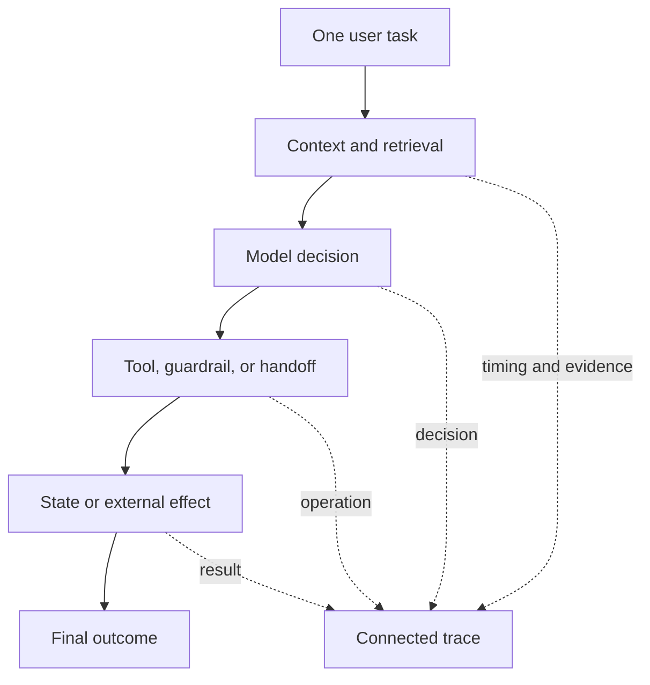
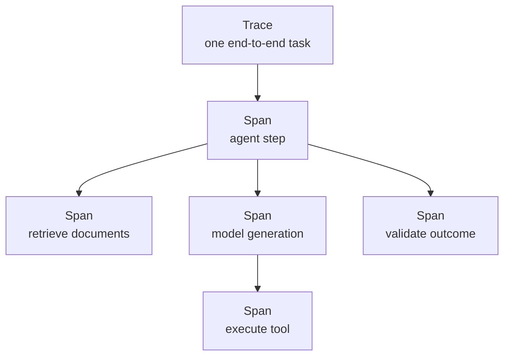
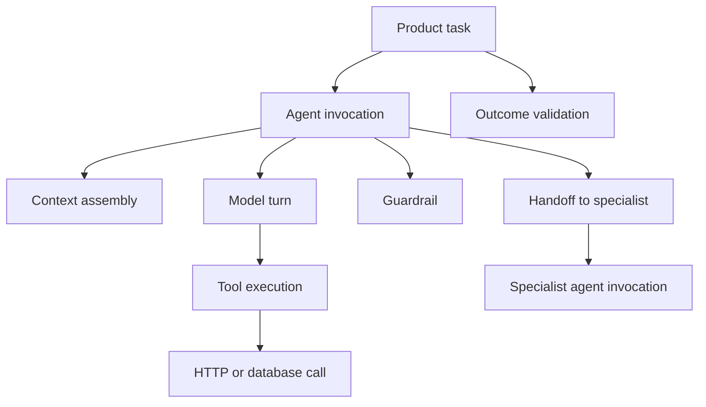
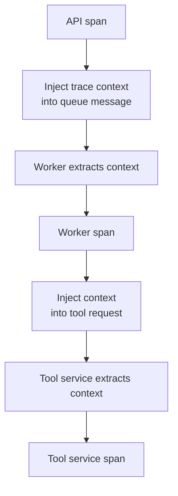
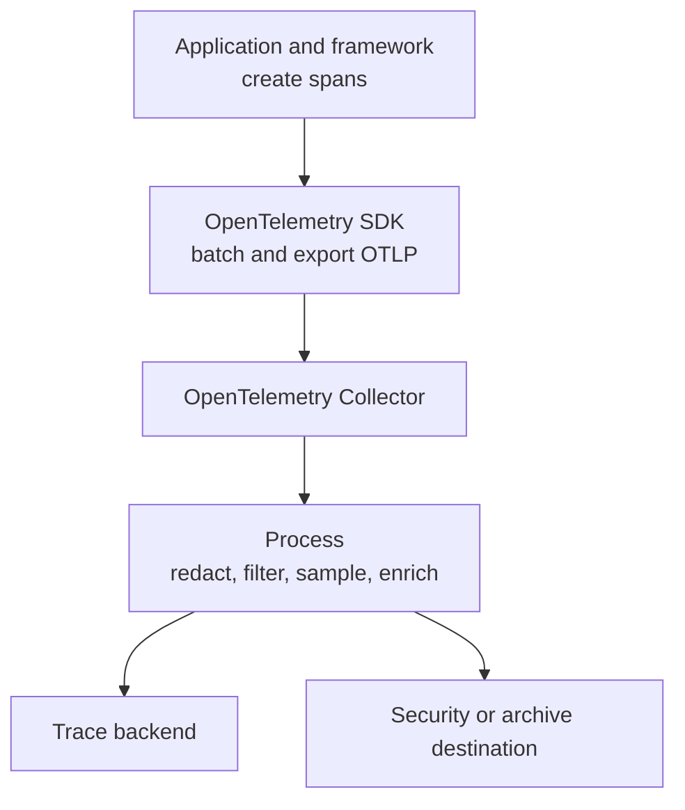
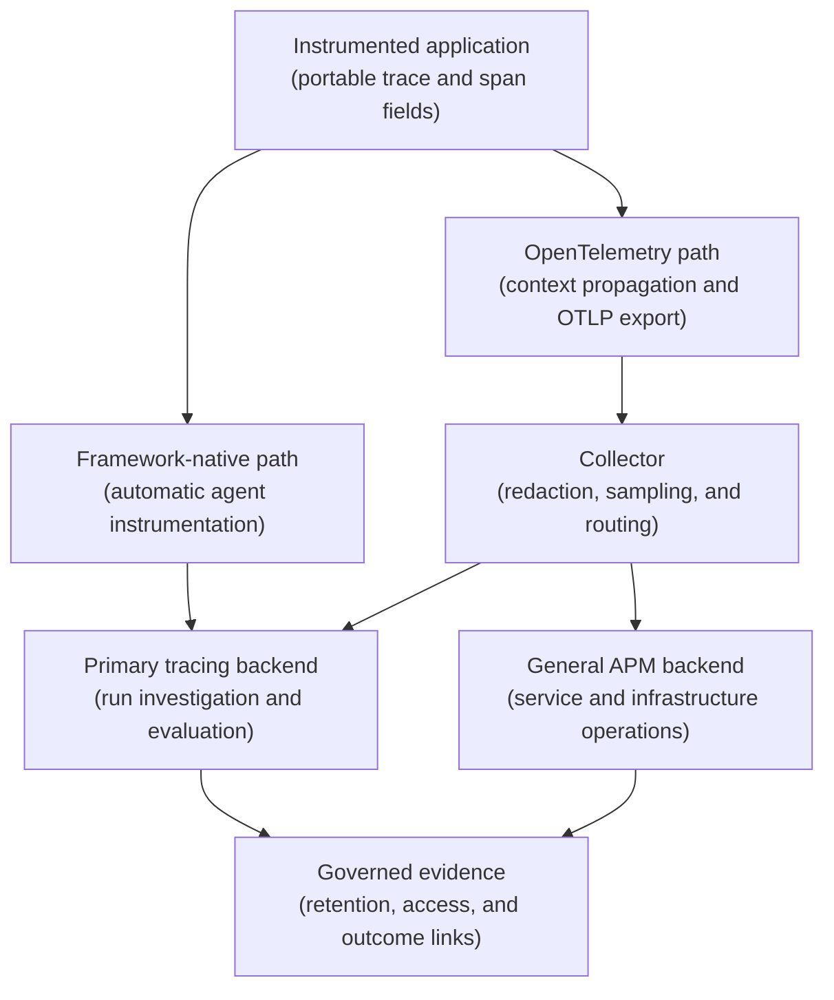
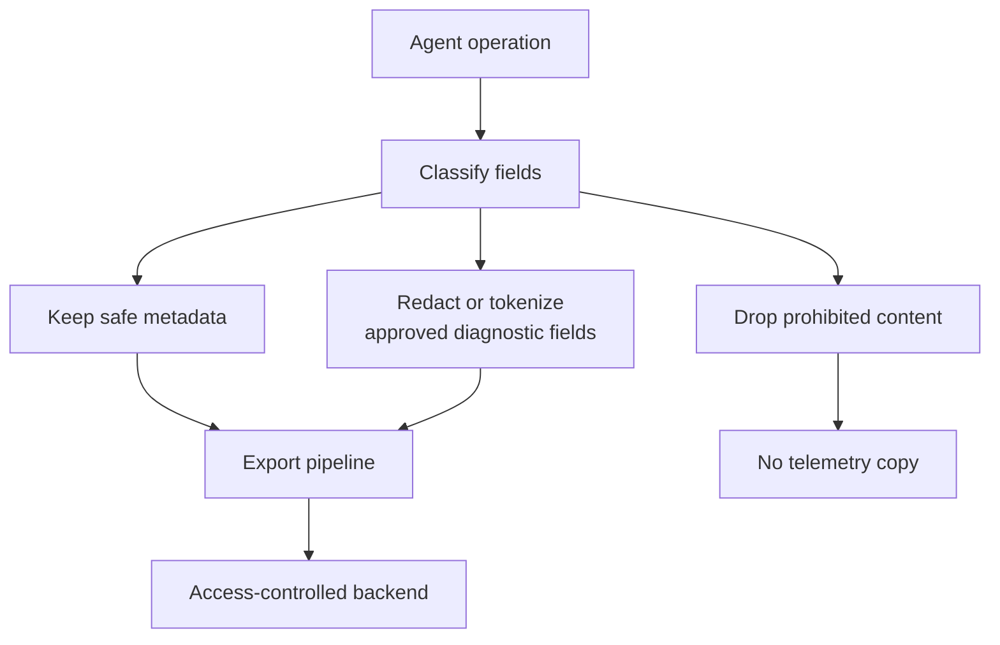
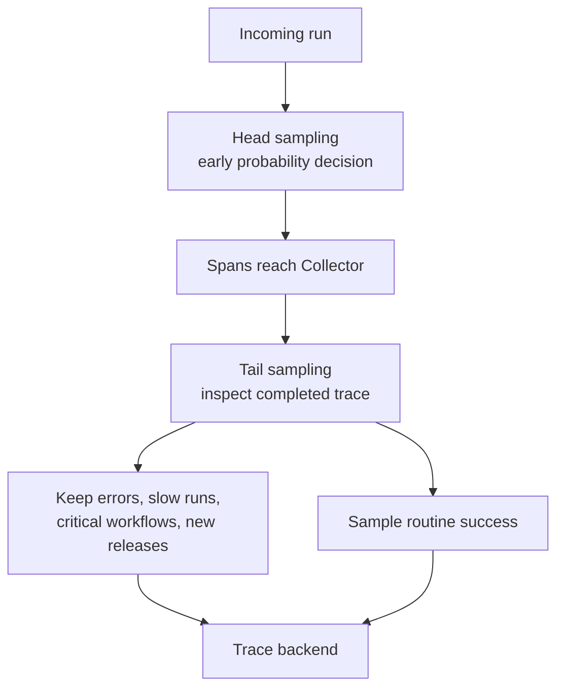
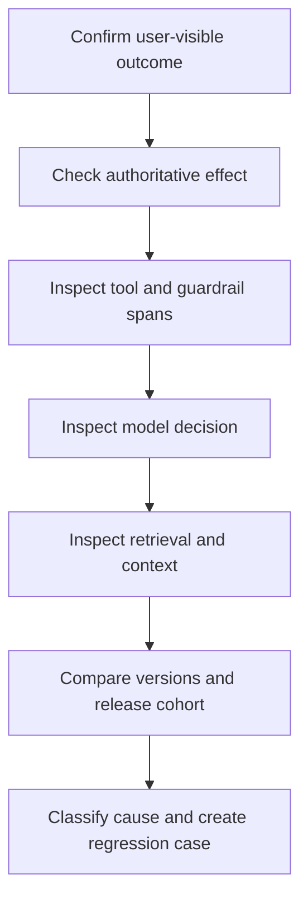
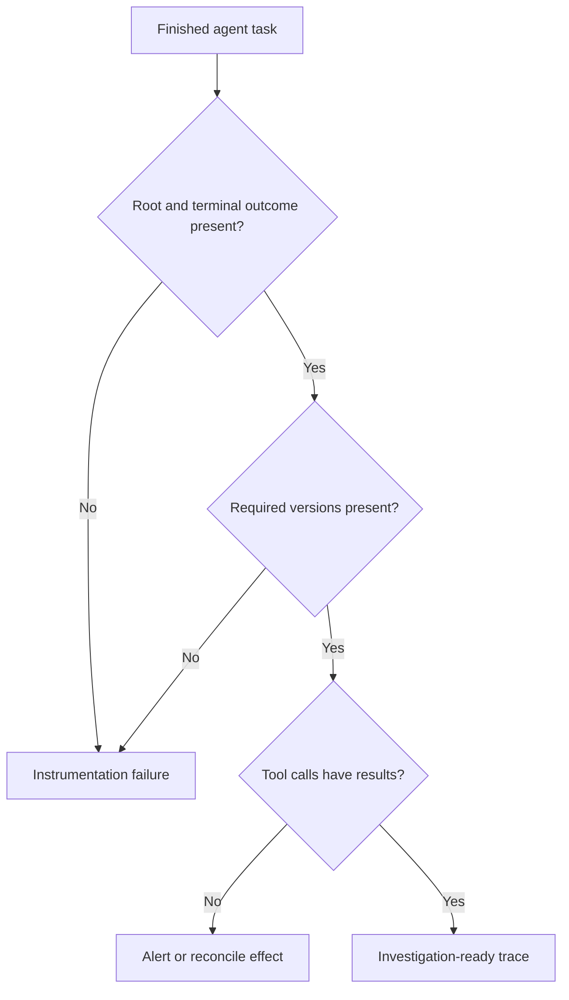

## Table of Contents

1. [What Agent Tracing Means](#what-agent-tracing-means)
2. [Understand Runs, Traces, And Spans](#understand-runs-traces-and-spans)
3. [Follow Agent Work Through A Trace](#follow-agent-work-through-a-trace)
4. [Carry Trace Identity Across Services And Queues](#carry-trace-identity-across-services-and-queues)
5. [Record The Right Evidence For Each Agent Step](#record-the-right-evidence-for-each-agent-step)
6. [Use OpenTelemetry For Portable Tracing](#use-opentelemetry-for-portable-tracing)
7. [Understand How Current Platforms Represent Traces](#understand-how-current-platforms-represent-traces)
8. [Protect Sensitive Data Before Export](#protect-sensitive-data-before-export)
9. [Control Trace Volume, Export, And Retention](#control-trace-volume-export-and-retention)
10. [Investigate An Agent Failure From Outcome To Cause](#investigate-an-agent-failure-from-outcome-to-cause)
11. [Check Whether Traces Cover Real Runs](#check-whether-traces-cover-real-runs)
12. [The Main Idea](#the-main-idea)
13. [References](#references)

## What Agent Tracing Means

<!-- section-summary: Agent tracing records the connected path of one agent task so a team can explain its decisions, effects, latency, cost, and outcome. -->

A final answer cannot show why an agent selected a tool, where it obtained evidence, or which step consumed most of the time. **Agent tracing** records the complete path of one task: model calls, retrieval, tools, guardrails, handoffs, state changes, errors, timing, and the final outcome.

You can think of a trace as a flight recorder plus a map. The recorder preserves useful facts from the run. The map shows which operation caused the next one. Together, they help a team answer a question that ordinary request logs struggle with: how did this agent reach this outcome?

An agent needs this view because its work rarely fits inside one model request.
A support agent might retrieve a policy, ask a model to choose an action, request approval, call an account tool, retry after a timeout, and then write a response.
A correct-looking response can hide an expired document or a failed tool.
A slow response can spend most of its time in retrieval or a queue, even if model generation was fast.


```mermaid
flowchart TD
    A["One user task"] --> B["Context and retrieval"]
    B --> C["Model decision"]
    C --> D["Tool, guardrail, or handoff"]
    D --> E["State or external effect"]
    E --> F["Final outcome"]
    B -. "timing and evidence" .-> G["Connected trace"]
    C -. "decision" .-> G
    D -. "operation" .-> G
    E -. "result" .-> G
```

### Traces work alongside metrics, logs, and evals

Each observability signal answers a different question. **Metrics** summarize many runs and reveal changes in error rate, latency, token use, or cost. **Logs** preserve discrete diagnostic events. **Traces** explain one connected execution. **Evals** judge whether the answer, trajectory, or outcome met the task requirements.

Suppose a dashboard shows that successful task completion fell after a release. Metrics reveal the population change. A sample of trace IDs identifies the failing paths. Protected logs may contain a provider error or validation detail. The failed traces can then enter an eval dataset so the repair is tested before the next release.

Tracing alone cannot prove that an answer is accurate. A model request can finish successfully and still produce a poor answer. The span status describes the operation, while an evaluator or later product outcome supplies the quality judgment.


*A trace explains the causal path of one run, while an eval judges its quality. Keeping the proposed action separate from the authoritative effect prevents a fluent response from masquerading as a completed operation.*

## Understand Runs, Traces, And Spans

<!-- section-summary: A run is the work being performed, a trace is its telemetry record, and spans describe the timed operations inside that record. -->

Tracing vocabulary can seem abstract because platforms use some words differently. Start with the work itself. At the product level, a **run** is one execution of an agent task. A **trace** is the connected telemetry record for that run. A **span** is one operation inside the trace.

For a request that searches product documentation and drafts an answer, the trace covers the whole request. Retrieval, model generation, and answer validation can each have a span. The parent-child relationships form a tree, so the viewer can show which model decision triggered a tool and which downstream call consumed the time.


```mermaid
flowchart TD
    A["Trace<br/>one end-to-end task"] --> B["Span<br/>agent step"]
    B --> C["Span<br/>retrieve documents"]
    B --> D["Span<br/>model generation"]
    D --> E["Span<br/>execute tool"]
    B --> F["Span<br/>validate outcome"]
```

### Use A Span To Describe One Operation

A span has a name, start time, end time, and **span context**. The context contains a trace ID, span ID, trace flags, and trace state. The trace ID groups spans into one trace. The span ID identifies the operation. Parent IDs and links express causal relationships.

The duration helps answer performance questions. The name and structured fields explain what the operation did. A retrieval span might say which index version it queried. A tool span might say which tool contract it used and whether the downstream effect succeeded.

### Record Attributes, Events, Status, And Links

An **attribute** is a key-value fact attached to a span. Examples include `service.name`, model name, prompt version, tool name, token count, or a bounded outcome class. Attributes work well for facts that describe the operation and support filtering.

An **event** records a meaningful point during the operation. A retry scheduled at a specific time, an approval received, or a token budget crossed can be an event. If the fact needs its own duration and children, it deserves a span. If a timestamp is the important part, an event is often enough.

**Span status** describes whether the operation completed with a technical error. OpenTelemetry defines `Unset`, `Error`, and `Ok`. `Unset` is the normal default for an operation that finished without an error. `Error` marks a failed operation. `Ok` is an explicit success decision and is rarely required.

This distinction matters for agents. A model call that returns a fluent hallucination may finish with `Unset` status because the provider request worked. Record answer quality through an eval result or product outcome. A tool that returns a rejected business decision may also complete technically; its span can use `Unset` plus a bounded attribute such as `app.tool.result="rejected"`.

A **span link** expresses a causal relationship outside the parent-child tree. It is useful for queued work, batch processing, or a new trace created from an earlier task. The link says “this work was caused by that work” without forcing one parent span to stay open for a long time.

### Map Product Terms To Trace Terms

Some tools use **run** as their word for a span. LangSmith, for example, defines a trace as a collection of runs and treats each run as one operation. The OpenAI Agents SDK uses a trace for an end-to-end workflow and records agent, generation, function, handoff, and guardrail spans inside it. The labels differ, although both represent a connected hierarchy of operations.

A team should define a small internal glossary and map each platform into it. That prevents queries, dashboards, and incident notes from using “run” for three different levels of work.

## Follow Agent Work Through A Trace

<!-- section-summary: The trace hierarchy should mirror the product task, agent loop, and external effects without turning every helper function into telemetry. -->

The root span should represent the user-visible task or durable workflow. Its children represent operations that help explain decisions, latency, cost, effects, and recovery. This structure keeps the trace close to the actual work.

For a single-agent request, the root can contain context assembly, several model turns, tool execution, guardrails, and final validation. For a multi-agent workflow, the root can contain router and handoff spans, with a child agent span for each delegated task. Transport spans for HTTP, messaging, and databases can sit below the agent-specific operations.


```mermaid
flowchart TD
    A["Product task"] --> B["Agent invocation"]
    B --> C["Context assembly"]
    B --> D["Model turn"]
    D --> E["Tool execution"]
    E --> F["HTTP or database call"]
    B --> G["Guardrail"]
    B --> H["Handoff to specialist"]
    H --> I["Specialist agent invocation"]
    A --> J["Outcome validation"]
```

### Set The Root Span To The Task Boundary

An incoming HTTP request is sometimes the task boundary, although durable agents may outlive it. A job can pause for approval, resume on a worker, and continue through several services. In that case, the product workflow is the useful root concept. The API request and worker processing are operations within the broader history or causally linked traces.

Long conversations need a deliberate boundary too. One endless trace for an entire chat can grow too large and obscure the latency of each turn. A practical design uses one trace per user turn or completed task, then connects those traces with a governed conversation or session identifier. LangSmith calls this sequence a thread.

### Create Spans For Operations That Support Investigation

Most helper functions can remain inside their parent span.
Create spans around model calls, retrieval, tools, guardrails, handoffs, checkpoints, approvals, external dependencies, expensive transformations, and important state transitions.
These operations explain behavior or consume meaningful time.

A parser that takes microseconds and has no independent failure mode can remain inside its parent. A parser that enforces a safety contract and rejects malformed tool arguments deserves visible evidence. The deciding question is whether an operator would inspect this operation during a quality, reliability, security, latency, or cost investigation.

### Trace The Proposed Action And Actual Effect Separately

Agents often propose a tool call before application code executes it. These are two related facts. The model span can record that the model requested `issue_refund`. A child tool span records schema validation, authorization, approval, execution, and the authoritative result.

If the model requests a refund and validation rejects the arguments, the trace should still show the proposed call. It should also show that no payment effect occurred. Combining both facts into one “tool used” attribute would hide the boundary that protects the system.

## Carry Trace Identity Across Services And Queues

<!-- section-summary: Context propagation carries trace identity across services, workers, queues, and handoffs so separately emitted spans form one causal history. -->

A trace tree can only cross process boundaries if the next process receives the current trace context. **Context propagation** is the mechanism that carries that identity through HTTP headers, RPC metadata, queue messages, or task payloads. The receiving service extracts the context and creates its span under the correct parent.

OpenTelemetry commonly uses the W3C `traceparent` header for this job. It contains the trace ID, parent span ID, and trace flags. `tracestate` can carry vendor-specific trace information. The application or instrumentation injects these headers on outgoing calls and extracts them on incoming calls.


```mermaid
flowchart TD
    A["API span"] --> B["Inject trace context<br/>into queue message"]
    B --> C["Worker extracts context"]
    C --> D["Worker span"]
    D --> E["Inject context<br/>into tool request"]
    E --> F["Tool service extracts context"]
    F --> G["Tool service span"]
```

### Test Trace Context Across Queues And Asynchronous Work

HTTP instrumentation often propagates context automatically. Queues, workflow engines, background tasks, and custom tool protocols may need manual configuration. Test each boundary with a known trace and verify the resulting parent-child relationship in the backend.

A producer span can represent publishing a message, and a consumer span can represent processing it. If one message contributes to a later batch or several upstream tasks converge, span links may describe the relationship more accurately than one parent.

Agent handoffs also cross logical boundaries. A child agent running in the same process can inherit the current context. A remote agent service needs propagated context. Record the source agent, destination agent, handoff reason, and a safe reference to the transferred state.

### Limit What Trace Baggage Carries

OpenTelemetry **baggage** carries key-value context alongside trace context. A value in baggage can be made available across downstream services. It does not automatically become a span attribute.

Baggage travels in request metadata and may reach third-party services. Avoid credentials, personal data, raw prompts, or unrestricted customer identifiers. Low-risk routing information may be useful, although many teams prefer an opaque tenant or policy reference that downstream services resolve under access control.

Propagation failures should produce their own metrics. Count extracted contexts, missing parents, invalid headers, and exporter drops. A user request can succeed while its trace splits into fragments, leaving the later investigation incomplete.


*Trace context preserves causality across process boundaries but never grants authority. Queue and tool boundaries need explicit propagation tests, safe baggage rules, and metrics that reveal silently fragmented traces.*

## Record The Right Evidence For Each Agent Step

<!-- section-summary: Model, retrieval, tool, handoff, guardrail, and state spans each require a focused set of evidence tied to their operational role. -->

Useful tracing records the evidence needed to explain each kind of agent step. A universal dump of prompts and payloads creates privacy and cost problems while still missing business meaning. The better approach is to define a small contract for each span type.

The contract says which identifiers, versions, bounded outcomes, timing values, and safe references belong on the span. Rich content can remain disabled by default or stored separately under stricter access.

### Record Model Requests And Provider Results

A model span should identify the provider, requested model, resolved response identifier where available, operation type, and model parameters that materially affect behavior. It can record input and output token usage, cached tokens, finish reason, first-token latency, total latency, retry count, and error type.

Prompt or instruction versions matter more than copying the whole prompt into a searchable backend. Record an immutable prompt version and a safe input classification. If content capture is approved, apply redaction before export and use a shorter retention period.

Tool calling creates an important distinction. The model output may contain a requested tool name and arguments. That proposal belongs to the model interaction. The actual execution, authorization, and side effect belong to the tool span.

### Record Which Evidence Entered The Context

A retrieval span should record the data source or index version, query strategy, filters, returned count, latency, and safe document identifiers. Similarity scores, reranker version, and top-k value can help explain selection. Raw document content is usually too sensitive and too large for ordinary trace attributes.

Suppose an answer cites an obsolete policy. The trace can show that the current-policy filter was absent and the archived document ranked first. That evidence points toward retrieval configuration. A model-only trace might incorrectly suggest that the model invented the policy.

### Connect Tool Proposals, Controls, And Effects

A tool span needs to connect the requested capability with its execution result.
Identify the tool and contract version. Classify the effect and approval state.
Keep a sanitized argument summary, idempotency reference, retry count, and bounded result.
For a write tool, link to the authoritative audit or transaction record.
The trace backend should never replace that system of record.

Consider a calendar agent that says a meeting was booked. The trace should reveal the proposed tool call, validated arguments, calendar API response, and resulting event identifier. If the calendar call timed out, the span should record an indeterminate outcome and trigger reconciliation before the agent claims success.

```json
{
  "span": "execute_tool calendar.create_event",
  "status": "UNSET",
  "attributes": {
    "gen_ai.operation.name": "execute_tool",
    "gen_ai.tool.name": "calendar.create_event",
    "app.tool.contract.version": "v5",
    "app.tool.effect": "write",
    "app.approval.state": "approved",
    "app.tool.result": "success",
    "app.effect.reference": "calendar-event-ref"
  }
}
```

`UNSET` says that the operation completed without a technical error. `app.tool.result` records the domain result. The effect reference lets an authorized investigator verify the calendar record without putting event details into the trace.

### Record Handoffs, Guardrails, And State Changes

A handoff span should identify the source and destination agent versions, reason category, transferred-context reference, and result. This evidence can reveal a routing loop, lost context, or a specialist that never returned.

A guardrail span should record the guardrail version, input or output stage, bounded decision, severity, and safe reason code. Store raw flagged content only under an approved policy. A block can be an expected product outcome, so the guardrail span may complete without a technical error while the root outcome says `rejected`.

State transitions deserve visibility if they change the future path.
Record a safe before-state and after-state, transition name, checkpoint version, and triggering span.
Avoid recording hidden chain-of-thought.
The trace needs observable decisions, tool evidence, and application state. Private reasoning tokens provide no required operational evidence.

## Use OpenTelemetry For Portable Tracing

<!-- section-summary: OpenTelemetry standardizes trace structure, context propagation, export, and shared GenAI names so agent telemetry can move across services and backends. -->

**OpenTelemetry**, often shortened to **OTel**, is an open standard and set of SDKs for producing traces, metrics, and logs. Its trace model defines spans, context, attributes, events, status, links, and propagation. OTLP is the protocol commonly used to send this telemetry to a Collector or compatible backend.

For agent systems, the value is portability. HTTP, database, queue, model, and tool operations can participate in the same trace. A team can route OTLP through an OpenTelemetry Collector to one or more observability platforms without teaching application code every backend API.


```mermaid
flowchart TD
    A["Application and framework<br/>create spans"] --> B["OpenTelemetry SDK<br/>batch and export OTLP"]
    B --> C["OpenTelemetry Collector"]
    C --> D["Process<br/>redact, filter, sample, enrich"]
    D --> E["Trace backend"]
    D --> F["Security or archive destination"]
```

### Use Shared Names For Common Operations

A **semantic convention** defines common span names and attribute keys for a type of operation. HTTP conventions let different services describe HTTP calls consistently. Generative AI conventions aim to do the same for model and agent work.

Current OpenTelemetry GenAI conventions include operation names such as `invoke_agent` and `execute_tool`, plus attributes under the `gen_ai.*` namespace. They cover agent identity, provider and model information, tool identity, token usage, messages, and related operations.

The GenAI work is still marked as development and evolves more quickly than the stable core trace model. OpenTelemetry’s main semantic-conventions documentation now points GenAI users to the dedicated GenAI conventions project. Production teams should pin SDK and convention versions, keep an internal mapping layer, and test backend field mappings during upgrades.

This maturity detail changes implementation strategy. Adopt the current standard names where they fit. Keep product fields under a controlled namespace such as `app.*`. Avoid rewriting all historical telemetry each time an experimental attribute changes.

### Add Product Meaning With Manual Spans

Automatic instrumentation can capture provider calls and common framework operations. Application code still owns product decisions and effects. A focused manual span can add that missing layer:

```python
from opentelemetry import trace
from opentelemetry.trace import Status, StatusCode

tracer = trace.get_tracer("decision-service")

def execute_approved_tool(tool, arguments, approval):
    with tracer.start_as_current_span("execute approved tool") as span:
        span.set_attribute("app.tool.name", tool.name)
        span.set_attribute("app.tool.effect", tool.effect_class)
        span.set_attribute("app.approval.state", approval.state)
        try:
            result = tool.execute(arguments, approval.reference)
            span.set_attribute("app.tool.result", result.status)
            return result
        except Exception as error:
            span.record_exception(error)
            span.set_status(Status(StatusCode.ERROR))
            raise
```

The code traces a boundary that matters to the product: an approved tool execution. It records bounded metadata and keeps raw arguments out of ordinary telemetry. Provider auto-instrumentation can still create HTTP or database children beneath this span.

## Understand How Current Platforms Represent Traces

<!-- section-summary: OpenAI, LangSmith, and MLflow automate different parts of agent tracing, while the portable framework remains trace, span hierarchy, context, evidence, and outcome. -->

Industrial platforms can remove much of the basic instrumentation work.
Their trace models overlap, yet capture defaults, naming, export paths, and data governance differ.
Choose one primary operational path, then define the minimum portable fields your system needs across vendors.

The portable layer includes trace identity, parent relationships, workflow and release versions, model and tool operations, bounded outcomes, latency, token usage, error type, and safe references to authoritative effects. Platform-specific features can add richer views and evaluation workflows.


```mermaid
flowchart TD
    App["Instrumented application<br/>(portable trace and span fields)"] --> OTel["OpenTelemetry path<br/>(context propagation and OTLP export)"]
    App --> Native["Framework-native path<br/>(automatic agent instrumentation)"]
    OTel --> Collector["Collector<br/>(redaction, sampling, and routing)"]
    Native --> Backend["Primary tracing backend<br/>(run investigation and evaluation)"]
    Collector --> Backend
    Collector --> APM["General APM backend<br/>(service and infrastructure operations)"]
    Backend --> Governed["Governed evidence<br/>(retention, access, and outcome links)"]
    APM --> Governed
```

### OpenAI Agents SDK

The OpenAI Agents SDK enables tracing by default. Its current tracing model records the overall runner workflow plus task, turn, agent, generation, function tool, guardrail, handoff, and custom spans. A Python context variable tracks the current trace and span inside concurrent code.

Generation and function spans can include sensitive inputs and outputs. The SDK currently captures sensitive trace data by default, so production teams need to set `trace_include_sensitive_data` or the corresponding environment setting according to policy. The SDK also supports custom trace processors that can add or replace export destinations.

This implementation is a strong fit for applications already using the Agents SDK. Product spans are still needed for approval, authoritative effects, business states, and delayed outcomes.

### LangSmith

LangSmith organizes traces inside projects. A trace represents one operation, and each **run** represents an individual span such as an LLM call, retrieval step, or tool. Related conversation turns can be grouped as a thread through a shared session or conversation identifier.

Supported integrations provide automatic capture, while `@traceable`, a trace context manager, and `RunTree` add manual spans. LangSmith also supports OpenTelemetry ingestion and can use an OpenTelemetry Collector for fan-out. Its distributed-tracing helpers propagate LangSmith trace headers and optional baggage across services.

This implementation connects tracing closely with datasets, feedback, and experiments. Teams should still review input/output capture, retention, regional endpoint, and access policies.

### MLflow Tracing

MLflow Tracing is OpenTelemetry-compatible and supports GenAI semantic conventions for ingestion and export. It provides automatic integrations for agent and model frameworks, plus manual spans through `@mlflow.trace` and span context managers. Its trace data can connect production observations with evaluation datasets and scorers.

For production, MLflow documents asynchronous logging, trace-level sampling, context propagation, and a smaller `mlflow-tracing` package. Client-side span processors can redact data before it leaves the application.

This implementation is useful for teams that want tracing, evaluation, and ML lifecycle evidence in one platform or on self-managed infrastructure.
The deployment still needs a production database, retention policy, access controls, and monitoring for asynchronous export queues.

### Keep Trace Data Portable

A framework integration can send directly to its hosted backend. A larger platform may export OTLP to an OpenTelemetry Collector and then route to MLflow, LangSmith, a general APM backend, or multiple destinations. The choice depends on evaluation workflow, operations ownership, data residency, cost, and existing observability infrastructure.

Avoid sending the same full payload to several backends without a governance reason. Duplicate exports multiply privacy exposure and storage cost. A portable metadata stream plus a restricted content store often provides a cleaner boundary.

## Protect Sensitive Data Before Export

<!-- section-summary: Trace data should be classified, minimized, and redacted inside the application before collectors and backends receive it. -->

Agent traces can contain personal data, credentials, proprietary code, health information, retrieved documents, and tool results. The observability backend often has broader access and longer retention than the product database. Treat trace design as part of the data architecture.

The safest default is metadata-only capture. Record versions, bounded categories, counts, timing, token usage, status, and opaque references. Add sanitized summaries only for approved workflows. Store raw prompts, outputs, or tool payloads in a restricted tier with encryption, access logging, short retention, and a documented purpose.


```mermaid
flowchart TD
    A["Agent operation"] --> B["Classify fields"]
    B --> C["Keep safe metadata"]
    B --> D["Redact or tokenize<br/>approved diagnostic fields"]
    B --> E["Drop prohibited content"]
    C --> F["Export pipeline"]
    D --> F
    E --> G["No telemetry copy"]
    F --> H["Access-controlled backend"]
```

### Redact Data In The Application And Pipeline

Application code understands which fields contain account numbers, source code, or protected documents. Redact there before export. MLflow span processors can alter trace inputs and outputs client-side. OpenAI Agents SDK users can disable sensitive generation and function payload capture. Similar controls exist in other tracing integrations.

The OpenTelemetry Collector can provide a second layer through attribute, filter, redaction, or transform processors. This defence catches known prohibited fields and enforces an allowlist. It cannot reliably understand every free-form prompt, so it cannot replace source-side classification.

### Protect Identifiers And Baggage

Raw user IDs and document text create privacy risk and high-cardinality indexes. Use an opaque correlation reference or a one-way token where investigation requires linkage. Keep the mapping in an authorized system.

Baggage deserves stricter review because it travels to downstream services and may enter third-party requests. Never place secrets, API keys, prompt text, or unrestricted personal identifiers in baggage. Accept trace context only as correlation data; it must never grant authorization.

### Inspect Exported Traces For Leaks

Redaction tests should send synthetic secrets, emails, account identifiers, and prohibited document text through every instrumented path. Inspect the Collector output and destination backend. Test error paths too, because exception messages and failed tool arguments often leak data that the success path removes.

## Control Trace Volume, Export, And Retention

<!-- section-summary: Production tracing controls overhead through deliberate sampling, asynchronous OTLP export, Collector processing, monitored queues, and tiered retention. -->

Capturing every span from every high-volume agent can create substantial network, storage, and indexing cost. A production pipeline decides which traces to keep, removes unsafe fields, batches exports, and sends the result to governed storage. It also exposes its own health metrics so telemetry loss is visible.

The common path is application SDK to OTLP exporter, then OpenTelemetry Collector, then one or more backends. The Collector receives data, applies processors, and exports it. Batching reduces network overhead. Memory limits and queues protect the service. Redaction and sampling control data volume.

### Choose Head Or Tail Sampling

**Head sampling** makes the decision near the start of a trace. It is efficient and useful for a representative percentage of normal traffic. At that point, the system has not seen the final latency, guardrail result, or error.

**Tail sampling** waits until most or all spans arrive. It can retain every error, slow run, blocked guardrail, expensive run, or new release cohort while sampling ordinary successes at a lower rate. Tail sampling needs state and capacity because the Collector holds trace data until it decides.


```mermaid
flowchart TD
    A["Incoming run"] --> B["Head sampling<br/>early probability decision"]
    B --> C["Spans reach Collector"]
    C --> D["Tail sampling<br/>inspect completed trace"]
    D --> E["Keep errors, slow runs,<br/>critical workflows, new releases"]
    D --> F["Sample routine success"]
    E --> G["Trace backend"]
    F --> G
```

Critical workflows may require complete tracing for audit or reconciliation. Regulation may also prohibit dropping certain records. Sampling policy therefore belongs to risk and governance owners as well as the observability team.

### Operate The OpenTelemetry Collector Reliably

The OpenTelemetry Collector is the usual control point for batching, retries, filtering, redaction, transformation, and routing. Use TLS and authenticated exporters. Separate tenant or sensitivity classes if access requirements differ. Pin component versions and check each component’s maturity because Collector components have individual stability levels.

Monitor accepted spans, refused spans, export failures, retry queues, memory pressure, and tail-sampling decisions.
The application should also count local export drops.
If tracing is asynchronous, process shutdown must flush within a bounded period.
OpenAI’s Agents SDK exposes `flush_traces()` for cases that need immediate delivery after a unit of work.

### Use Retention Tiers For Trace Data

Recent metadata can stay in an indexed trace backend for incident response and dashboards. Restricted payload evidence can use a shorter retention period and narrower access. Long-term aggregates belong in metrics or a warehouse. Confirmed failure traces can be redacted and promoted into eval datasets with explicit labels.

Trace IDs should connect these stores. The trace carries a safe effect reference. The authoritative service keeps the payment, ticket, or calendar record. The eval system stores the reviewed test case. Each system retains the evidence it is designed to govern.

## Investigate An Agent Failure From Outcome To Cause

<!-- section-summary: Effective agent debugging starts with the user-visible outcome and follows causal spans backward to the first meaningful divergence. -->

A large trace tree can still confuse an investigator without a repeatable method. Start from the user-visible outcome, then move backward through validation, external effects, tools, model decisions, and context. This order keeps the investigation tied to what actually failed.

Suppose a support agent says that an account change completed, although the account remained unchanged. The root span reports `app.outcome="claimed_success"`. The tool span shows `app.tool.result="timeout"`. Its downstream HTTP span ended with an error, and no authoritative effect reference exists. The first repair target is success reporting and reconciliation, not the model wording.


```mermaid
flowchart TD
    A["Confirm user-visible outcome"] --> B["Check authoritative effect"]
    B --> C["Inspect tool and guardrail spans"]
    C --> D["Inspect model decision"]
    D --> E["Inspect retrieval and context"]
    E --> F["Compare versions and release cohort"]
    F --> G["Classify cause and create regression case"]
```

### Follow A Repeatable Investigation Sequence

First, confirm the final outcome through the authoritative system or a trusted label. Then verify whether the root span recorded that outcome honestly. Check side-effecting tools before read-only steps because they may require reconciliation.

Next, find the earliest meaningful divergence. A retrieval span may show an archived source. A model span may request the wrong tool even though the right evidence was present. A handoff span may route the task to an agent without the required capability. A guardrail may apply an outdated policy version.

Finally, compare the prompt, model, tool contract, retrieval index, guardrail, and application release. One trace identifies a mechanism. Similar traces and metrics show its scope. Add a reviewed failure to the regression suite so the repaired behavior stays protected.

### Route Common Incidents To The Correct Owner

A fluent answer grounded in the wrong document points toward retrieval filters, corpus versions, or context assembly. A correct tool request rejected by schema validation points toward a contract mismatch. A duplicate write points toward idempotency or retry behavior. A routing loop points toward handoff rules and state. A trace split across services points toward propagation or instrumentation.

Tracing shortens diagnosis because it separates these mechanisms. It also prevents every agent incident from being described as “the model failed.”

## Check Whether Traces Cover Real Runs

<!-- section-summary: A trace is investigation-ready only after required stages, versions, tool results, links, and terminal outcomes have been recorded. -->

A backend can accept spans while still receiving an incomplete history. A queue may lose context. A process may exit before its batch exporter flushes. A tool request may have no result span. Define a **trace contract** for each important workflow and test it in staging plus sampled production traffic.

The contract should require one root, a terminal outcome, release and configuration versions, causal links across remote work, and terminal results for important tools. A side-effecting tool with an unknown result needs a reconciliation path. Missing evidence must never count as proof of success.


```mermaid
flowchart TD
    A["Finished agent task"] --> B{"Root and terminal outcome present?"}
    B -->|No| F["Instrumentation failure"]
    B -->|Yes| C{"Required versions present?"}
    C -->|No| F
    C -->|Yes| D{"Tool calls have results?"}
    D -->|No| G["Alert or reconcile effect"]
    D -->|Yes| E["Investigation-ready trace"]
```

### Test Tracing During Releases

Run synthetic tasks through API, queue, worker, model, and tool boundaries. Confirm the tree shape, required attributes, redaction result, and backend query. Stop a worker before flush and verify the expected loss or recovery behavior. Break propagation deliberately and confirm that completeness metrics detect the fragment.

Instrumentation changes need the same release discipline as application changes. A renamed attribute can break dashboards, sampling policies, and incident queries. A new framework integration can capture raw payloads unexpectedly. Pin versions, review diffs, and keep representative trace fixtures for compatibility tests.

### Monitor The Tracing Pipeline

Track SDK export failures, Collector refused spans, queue depth, processor errors, backend ingestion latency, and trace completeness rate. Compare accepted root spans with completed product tasks. A sudden gap means the team may be losing the evidence needed for later incident response.

Tracing should add bounded overhead and fail safely. An unavailable trace backend should not take down the agent service. Security policy may require a request to stop if mandatory audit evidence cannot be written for a regulated effect. Define that distinction explicitly by workflow risk.

## The Main Idea

<!-- section-summary: Strong agent tracing connects a user task to its decisions, operations, effects, and outcome through a portable and governed causal record. -->

Agent tracing gives a team a connected explanation of one agent task. The trace contains spans for meaningful operations. Attributes describe them. Events mark important moments. Status records technical failure. Context propagation preserves causality across services, and links connect related asynchronous work.

The agent-specific layer adds model, retrieval, tool, guardrail, handoff, state, cost, and outcome evidence. OpenTelemetry provides the portable foundation. OpenAI Agents SDK, LangSmith, and MLflow automate parts of the implementation. Product teams still own business meaning, authoritative effects, privacy controls, sampling policy, and trace completeness.

The result is more useful than a transcript. It shows what the agent attempted, what the surrounding system actually did, where resources were spent, and which evidence supports the final outcome.


*An investigation-ready trace preserves causality without copying uncontrolled payloads, proves that required evidence is present, links to authoritative effects, and turns confirmed failures into release regressions.*

## References

- [OpenTelemetry — Trace concepts](https://opentelemetry.io/docs/concepts/signals/traces/)
- [OpenTelemetry — Context propagation](https://opentelemetry.io/docs/concepts/context-propagation/)
- [OpenTelemetry — Baggage](https://opentelemetry.io/docs/concepts/signals/baggage/)
- [OpenTelemetry — Sampling](https://opentelemetry.io/docs/concepts/sampling/)
- [OpenTelemetry — Collector](https://opentelemetry.io/docs/collector/)
- [OpenTelemetry — Collector components](https://opentelemetry.io/docs/collector/components/)
- [OpenTelemetry — Handling sensitive data](https://opentelemetry.io/docs/security/handling-sensitive-data/)
- [OpenTelemetry — GenAI semantic conventions](https://github.com/open-telemetry/semantic-conventions-genai)
- [OpenTelemetry — Current GenAI span model](https://github.com/open-telemetry/semantic-conventions-genai/blob/main/model/gen-ai/spans.yaml)
- [OpenAI Agents SDK — Tracing](https://openai.github.io/openai-agents-python/tracing/)
- [LangSmith — Observability concepts](https://docs.langchain.com/langsmith/observability-concepts)
- [LangSmith — Distributed tracing](https://docs.langchain.com/langsmith/distributed-tracing)
- [LangSmith — Trace with OpenTelemetry](https://docs.langchain.com/langsmith/trace-with-opentelemetry)
- [MLflow — LLM tracing and agent observability](https://mlflow.org/docs/latest/genai/tracing)
- [MLflow — Production tracing and monitoring](https://mlflow.org/docs/latest/genai/tracing/prod-tracing/)
- [MLflow — Redacting sensitive data from traces](https://mlflow.org/docs/latest/genai/tracing/observe-with-traces/masking/)
