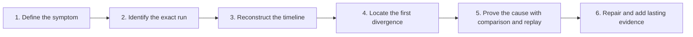
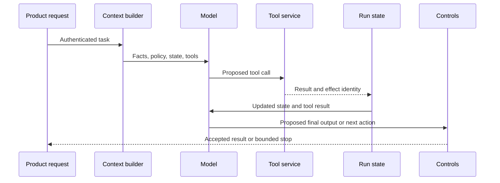

Debugging an LLM or agent run means explaining how one request moved through the system and identifying the earliest point where actual behaviour diverged from expected behaviour. The final answer is often only the visible symptom. The cause may be missing context, a changed tool response, an incorrect state transition, an unsafe retry, an unavailable dependency, a prompt regression, or a product rule the system never encoded.

The discipline is **causal reconstruction**. Start with what the user observed. Find the run. Rebuild its timeline. Locate the first divergence. Compare the evidence with a healthy run. Reproduce the failure under controlled conditions. Fix the owning layer, then preserve the case as regression coverage.

## Use A Six-Stage Debugging Framework
<!-- section-summary: A run investigation moves from symptom to identity, timeline, divergence, controlled proof, and permanent learning. -->



Each stage prevents a common debugging failure.

1. **Define the symptom.** Keep the investigation tied to the user or operator impact.
2. **Identify the run.** Avoid mixing evidence from different retries, releases, tenants, or environments.
3. **Reconstruct the timeline.** Read actions and state transitions in execution order.
4. **Locate the first divergence.** Find the earliest wrong input, decision, transition, or effect.
5. **Prove the cause.** Use a nearby successful run, version comparison, and controlled replay.
6. **Create lasting evidence.** Add a contract test, eval case, metric, alert, runbook note, or trace field.

This framework works for a one-call assistant, a tool-using agent, and a durable multi-step workflow. The amount of evidence changes; the order of reasoning does not.

## Stage One: Define The User-Visible Symptom
<!-- section-summary: A precise symptom and expected outcome give the investigation a falsifiable target before internal evidence creates bias. -->

Write one sentence for actual behaviour and one for expected behaviour. “The agent is bad” is too broad. “The procurement agent asked for a cost centre that was already present, repeated the vendor lookup twice, and failed to route an expired vendor for review” is actionable.

Capture impact separately. Did one user receive a poor draft? Did a high-risk action execute? Are all requests on one release stuck? Severity depends on the effect, not the complexity of the trace.

The initial note should contain the minimum coordinates:

| Field | Why it matters |
| --- | --- |
| User-visible symptom | Keeps debugging connected to product behaviour |
| Expected outcome | Defines what success would have looked like |
| Timestamp and environment | Narrows the search and dependency state |
| Workflow and entry point | Confirms the correct execution path |
| Trace or run ID | Connects evidence across systems |
| Release and prompt version | Locates the deployed behaviour |
| Impact and current containment | Guides urgency and safe next action |

Do not copy sensitive user content into a broad incident channel. Use a protected evidence link or an approved summary. The investigation needs enough detail to reproduce the failure without expanding data exposure.

## Stage Two: Establish Run Identity
<!-- section-summary: Stable run, trace, release, and operation identities prevent retries and related calls from being mistaken for one execution. -->

An application request, an agent run, a trace, and an external operation can have different identities. Record their relationships.

- A **request ID** identifies the call at the product boundary.
- A **run ID** identifies one logical agent or workflow execution.
- A **trace ID** connects spans across instrumented services.
- A **tool-call ID** connects a model request with its result.
- An **operation or idempotency key** identifies a side effect in the authoritative service.

One user click may create several HTTP requests. One durable run may continue after a process restart. One tool operation may be retried across traces. Without these distinctions, an engineer can mistake a successful retry for proof that the first attempt committed, or count the same logical action several times.

Every production run should record the workflow, environment, application release, model and prompt identifiers, tool-schema versions, retrieval-index version, and tenant-safe correlation fields on its root trace or run record. If support cannot find a run from a ticket, improve correlation before the next incident.

## Stage Three: Read The Trace As A State Timeline
<!-- section-summary: A useful trace shows ordered decisions, tool effects, state transitions, retries, and guardrails instead of only nested model calls. -->

A **trace** is an end-to-end record of one operation. A **span** is a timed operation inside that trace, such as context assembly, retrieval, a model call, a tool call, validation, or a state checkpoint.

Read the root span first. Confirm the workflow and release. Then scan child spans for failure, high duration, repetition, fan-out, and missing expected steps. Only after the shape is clear should you inspect model and tool payloads.



The expected sequence acts as a reference. In a failing run, ask:

- Was the correct context assembled before the model call?
- Did every accepted tool call produce one matched result?
- Did the authoritative result update run state?
- Did the next model turn receive that updated state?
- Did a retry repeat a read or a side effect?
- Did an approval, budget, or loop guard fire at the intended transition?
- Did the run terminate with an honest account of committed work?

A compact trace summary is usually more useful at first than a full transcript:

```json
{
  "run_id": "run_proc_7d4b913f",
  "release": "proc-agent-18",
  "prompt_version": "2026-07-04.5",
  "tool_schema": {"vendor_policy": "3.2.0"},
  "duration_ms": 184230,
  "model_turns": 6,
  "tool_calls": {"vendor_policy.lookup": 2},
  "terminal_state": "stopped_by_loop_guard",
  "first_warning": "unmapped_vendor_status"
}
```

This summary points to the likely area without exposing raw purchase data. The investigator can open restricted span payloads only when needed.

## Stage Four: Locate The First Divergence
<!-- section-summary: The earliest incorrect fact, contract interpretation, state transition, effect, or control decision usually identifies the owning layer. -->

Later failures often cascade from an earlier divergence. A model repeats a question because state dropped a field. A loop guard fires because an unknown tool enum prevented the run from advancing. A final answer lacks a citation because retrieval never returned the source. Fixing the final text would hide the mechanism.

Use seven fault domains:

| Fault domain | Question | Typical evidence |
| --- | --- | --- |
| Input and identity | Did the run start with the correct task, caller, and tenant? | request record, auth decision |
| Context and retrieval | Did the model receive relevant, current, permitted facts? | context manifest, retrieval ranks and sources |
| Model and instructions | Did the model interpret available evidence incorrectly? | prompt version, model items, repeated trials |
| Tool contract | Did arguments or results violate an expected schema or meaning? | schema version, validation event, result code |
| Orchestration and state | Did the run choose, persist, resume, or terminate incorrectly? | transition log, checkpoint, retry record |
| Controls and policy | Did authorization, approval, budget, or guard behaviour match policy? | policy decision, bound proposal hash |
| Environment and dependency | Did latency, outage, quota, or deployment state alter the path? | logs, metrics, dependency status |

Start with context and state before blaming the model. The model can only act on the view it receives. Inspect a context manifest that lists sources, versions, token allocation, and trust labels. Compare extracted fields with authoritative input. Check that tool results appear in the next model input or state projection.

Then inspect contracts. An HTTP 200 response can still be semantically new. If a tool changes `approval_status` from three known values to a fourth, the run may fail even though transport and schema validation pass. Contract compatibility includes field meaning and enum evolution, not only JSON shape.

For side effects, compare requested, acknowledged, and committed state. A timeout means “the caller did not receive a conclusive response.” Query the authoritative system using the operation key. Avoid inferring commit status from the agent transcript.

## Use A Healthy Run As A Control
<!-- section-summary: A nearby successful run reduces speculation by revealing which inputs, versions, transitions, and dependency conditions differ. -->

Find a successful run with the same workflow, similar input class, environment, and time window. Compare one dimension at a time:

| Dimension | Compare |
| --- | --- |
| Input class | intent, locale, permissions, risk level |
| Context | selected sources, missing fields, retrieval results |
| Versions | application, model, prompt, tool schema, index, policy |
| Control flow | model turns, tool sequence, transitions, approvals |
| Environment | region, dependency latency, quotas, feature flags |
| Outcome | final state, committed effects, user response |

The control run does not prove causality by itself. It narrows the difference set. If successful runs used tool schema 3.1 and failing runs use 3.2 with a new enum, that is a strong hypothesis. Replay can then test it.

Avoid changing several variables at once. A replay that changes the prompt, model, tool fixture, and retrieval index may pass without revealing which change mattered.

## Stage Five: Prove The Cause With Controlled Replay
<!-- section-summary: A replay packet freezes relevant input, context, tool results, versions, and expected transitions so one hypothesis can be tested safely. -->

**Replay** runs a sanitized equivalent of the case against controlled dependencies. The goal is mechanism proof, not a visual demonstration.

A useful replay packet contains:

```yaml
case_id: procurement-expired-vendor-001
source_run: run_proc_7d4b913f
input_class: software_renewal
context:
  cost_center: ENG-DESIGN
  seat_count: 45
  amount_usd: null
tool_fixtures:
  vendor_policy.lookup:
    approval_status: expired_pending_reapproval
expected:
  state: route_to_procurement_ops
  forbidden_actions:
    - ask_for_cost_center
  max_model_turns: 2
```

Fixtures preserve the original dependency result. Calling a live vendor service during replay could return a repaired status and erase the failure condition. Keep a separate integration test for the live contract.

Run the packet against the released system configuration first. It should reproduce the divergence. If it does not, the packet is incomplete or nondeterminism needs repeated trials. Then change one suspected cause, such as adding the new enum to the state transition policy. The candidate should take the expected path across repeated runs.

Some assertions are deterministic: no unauthorized tool, schema-valid output, exact state transition, bounded turns, one idempotency key. Language quality may need rubric-based or human evaluation. Keep these grader types separate so a fluent answer cannot compensate for an unsafe transition.

Replay has limits. Time-dependent data, provider changes, nondeterministic sampling, concurrency, and external side effects can prevent exact reproduction. Record those uncertainties. The goal is sufficient control to test a causal claim, not bit-for-bit equivalence in every system.

## Correlate One-Run Evidence With Fleet Signals
<!-- section-summary: Traces explain an individual path, while logs and metrics reveal whether the same failure class affects a release, segment, tool version, or dependency. -->

One trace explains one run. Structured logs expose detailed events. Metrics reveal frequency and distribution. Join them with safe, bounded labels such as workflow, release, prompt version, tool name, tool-schema version, outcome, and failure class.

Avoid user IDs, raw prompts, order IDs, and high-cardinality run IDs as metric labels. Keep those in controlled trace or log systems. Metrics should support aggregation.

For example, a Prometheus counter can show whether tool-contract failures increased after a schema release:

```promql
sum by (tool_schema_version, failure_class) (
  rate(agent_run_failures_total{workflow="procurement_request"}[15m])
)
```

If the failing trace is isolated, handle it as a defect or evaluation gap. If the rate rises across requests on one schema or prompt version, treat it as an incident and contain the release. Also check the denominator: ten failures among twenty runs and ten failures among a million runs have different meanings.

Sampling policy matters. Keep complete traces for errors and selected high-risk outcomes where privacy policy allows it. Sample ordinary successful runs enough to provide comparison controls. Record sampling decisions so absence of traces is not mistaken for absence of events.

## Stage Six: Fix The Owning Layer
<!-- section-summary: The repair should target the earliest proven divergence and include rollout, verification, and recovery evidence. -->

Map the cause to its owner:

- missing or stale knowledge → context or retrieval owner;
- prompt interpretation gap → model behaviour owner;
- incompatible enum or field → tool producer and consumer owners;
- lost result or wrong transition → orchestrator or state owner;
- repeated effect → tool and workflow idempotency owners;
- excessive turns → product policy and runtime owner;
- dependency saturation → service or platform owner.

The fix packet should name the symptom, first divergence, evidence, changed component, replay case, rollout scope, monitoring signal, and rollback trigger. A prompt change may need a prompt-version release. A tool-contract repair may need producer compatibility and consumer handling. A state-machine repair may need migration logic for interrupted runs.

Verify at three levels:

1. **Case level:** the replay passes and the released configuration reproduces the earlier failure.
2. **System level:** contract, state, authorization, and side-effect tests pass.
3. **Fleet level:** failure rate, latency, turn count, cost, and product outcome recover after rollout.

Rollback should restore the complete behaviour bundle when necessary: application code, prompt, model route, tool configuration, retrieval index, and state policy. Record which in-flight runs can resume safely and which need cancellation or migration.

## Turn The Incident Into Better Observability
<!-- section-summary: A resolved run should leave behind an eval case, stronger contract, clearer state event, safer metric, or improved support correlation. -->

The strongest debugging outcome is a system that will explain the same failure faster next time. Add only evidence that changes a decision.

- Add the replay packet to regression evals.
- Add a compatibility test for the new tool enum.
- Emit an explicit event when the orchestrator sees an unmapped result.
- Record prompt, tool, index, and policy versions on the root span.
- Alert on the failure rate with a meaningful denominator.
- Improve support-to-trace correlation.
- Redact or remove payload fields that the investigation did not need.

Avoid solving observability gaps by logging everything. More raw content raises privacy and cost while making investigation slower. Prefer structured summaries, stable identities, source references, state transitions, and controlled deep links to restricted payloads.

## The Durable Debugging Method
<!-- section-summary: Agent debugging is a repeatable evidence discipline that assigns the earliest proven divergence to the correct system layer. -->

Define the user symptom. Identify the exact run. Read the trace as an ordered state timeline. Locate the earliest divergence across input, context, model, tool, orchestration, control, and environment layers. Compare with a healthy run. Freeze the important evidence in a replay packet. Change one variable, prove the repair, monitor the fleet, and preserve the case.

This method keeps an investigation from collapsing into transcript reading or prompt guessing. It also teaches the larger lesson of LLM operations: model behaviour is one part of a stateful software system, so its failures need software-quality evidence across the whole path.

## References

- [OpenAI Agents SDK tracing](https://openai.github.io/openai-agents-python/tracing/)
- [OpenAI Agents SDK running agents](https://openai.github.io/openai-agents-python/running_agents/)
- [OpenTelemetry traces](https://opentelemetry.io/docs/concepts/signals/traces/)
- [OpenTelemetry logs](https://opentelemetry.io/docs/specs/otel/logs/)
- [OpenTelemetry GenAI semantic conventions repository](https://github.com/open-telemetry/semantic-conventions-genai)
- [Prometheus querying basics](https://prometheus.io/docs/prometheus/latest/querying/basics/)
- [LangSmith observability concepts](https://docs.langchain.com/langsmith/observability-concepts)
- [Phoenix tracing](https://arize.com/docs/phoenix/tracing/llm-traces)
- [Langfuse observability](https://langfuse.com/docs/observability/overview)
