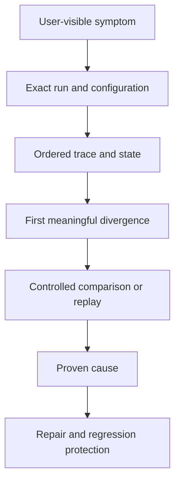
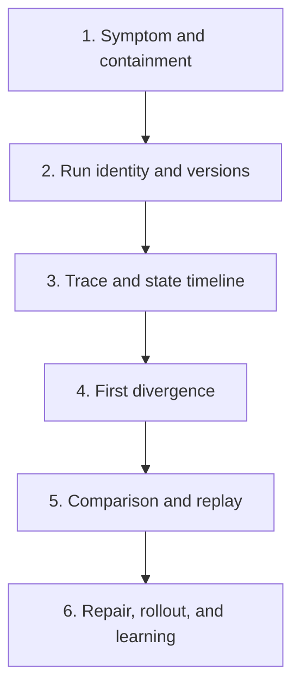
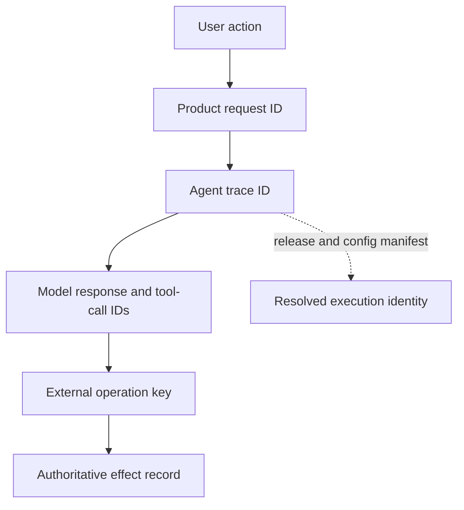
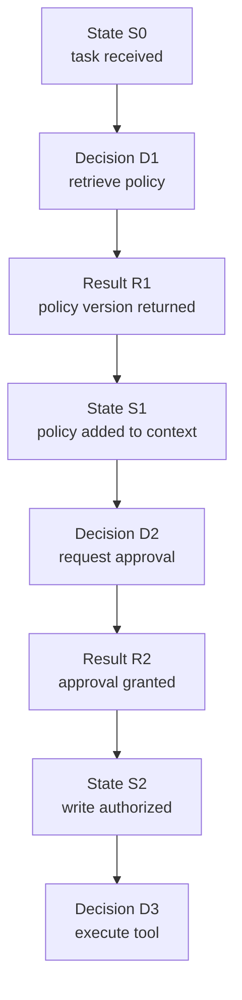
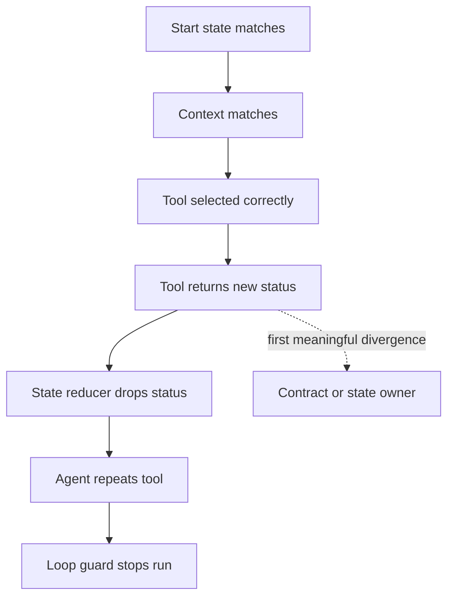
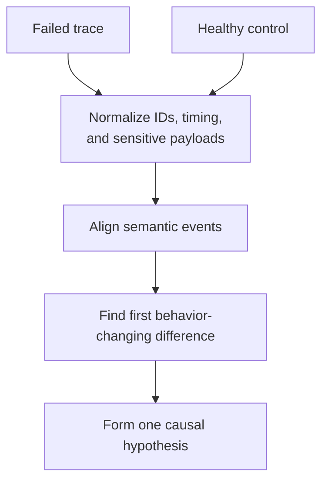
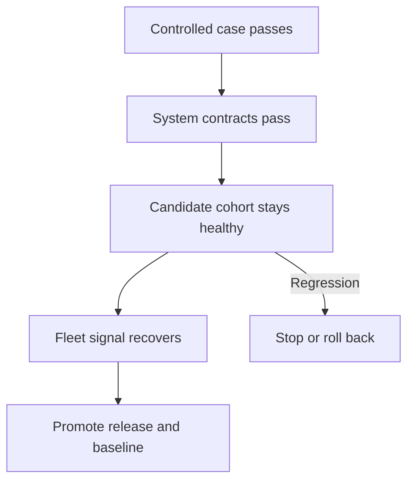
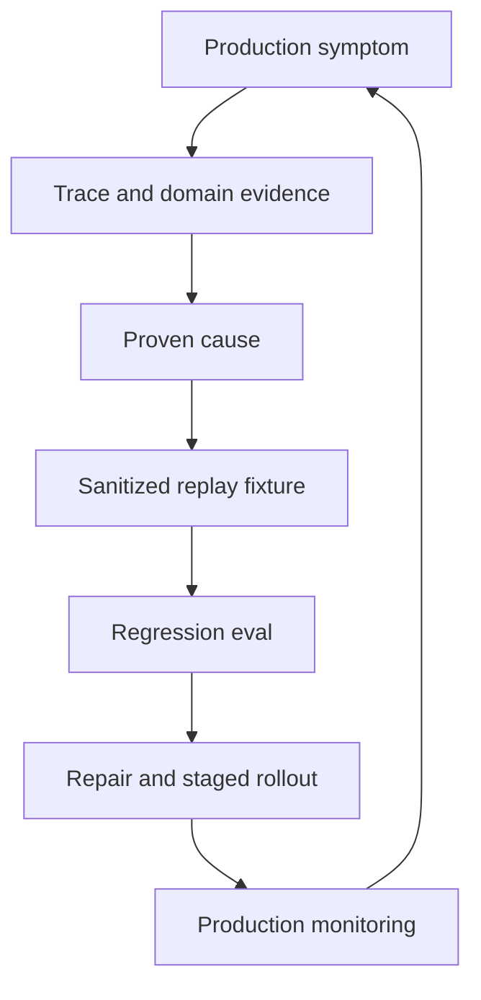

## Table of Contents

1. [Debugging an Agent Run Means Reconstructing Cause](#debugging-an-agent-run-means-reconstructing-cause)
2. [A Six-Stage Framework Keeps the Investigation Grounded](#a-six-stage-framework-keeps-the-investigation-grounded)
3. [Stage One: Define the Symptom and Contain the Risk](#stage-one-define-the-symptom-and-contain-the-risk)
4. [Stage Two: Identify the Exact Run and Configuration](#stage-two-identify-the-exact-run-and-configuration)
5. [Stage Three: Read the Trace as a State Timeline](#stage-three-read-the-trace-as-a-state-timeline)
6. [Stage Four: Find the First Meaningful Divergence](#stage-four-find-the-first-meaningful-divergence)
7. [A Healthy Control and Fleet Signals Show the Scope](#a-healthy-control-and-fleet-signals-show-the-scope)
8. [Stage Five: Prove the Cause With Controlled Replay](#stage-five-prove-the-cause-with-controlled-replay)
9. [Common Failure Patterns Point to Different Repairs](#common-failure-patterns-point-to-different-repairs)
10. [Current Tools Support Different Parts of the Workflow](#current-tools-support-different-parts-of-the-workflow)
11. [Stage Six: Repair the Owning Layer and Verify Recovery](#stage-six-repair-the-owning-layer-and-verify-recovery)
12. [Turn Every Confirmed Failure Into Lasting Evidence](#turn-every-confirmed-failure-into-lasting-evidence)
13. [The Main Idea](#the-main-idea)
14. [References](#references)

## Debugging an Agent Run Means Reconstructing Cause

<!-- section-summary: Agent debugging explains how one execution produced an unwanted outcome and identifies the earliest system condition that needs repair. -->

An agent can fail while every service returns a successful HTTP status. It may retrieve an old policy, call a valid tool with the wrong account, lose state after a handoff, repeat an already committed write, or describe a timeout as success. The final response is the visible symptom. The cause usually sits earlier in the path.

**Debugging an agent run** means reconstructing that path from evidence. The investigator starts with what the user or system experienced, finds the exact execution, reads its trace and state changes, and identifies the earliest meaningful difference from acceptable behavior. A controlled comparison or replay then tests the suspected cause.

You can think of this as rebuilding a chain of cause and effect:


```mermaid
flowchart TD
    A["User-visible symptom"] --> B["Exact run and configuration"]
    B --> C["Ordered trace and state"]
    C --> D["First meaningful divergence"]
    D --> E["Controlled comparison or replay"]
    E --> F["Proven cause"]
    F --> G["Repair and regression protection"]
```

The first divergence matters because later failures often cascade. An agent may ask the same question four times because a tool returned a new enum that the state reducer could not map. The loop is visible, while the unmapped enum is causal. Raising the loop limit would prolong the failure. Updating the contract handling repairs it.

### A model is one layer of the system

An agent run combines application input, identity, context assembly, retrieval, model behavior, tool contracts, orchestration, persistent state, policy controls, and external dependencies. A defect in any layer can change the path. Starting with “the model made a mistake” narrows the investigation too early.

Suppose a generated answer cites a policy that expired. The model may have selected the highest-ranked document correctly. The retrieval system supplied an archived version because a filter disappeared during deployment. The repair belongs to retrieval configuration and release validation.

Good debugging assigns the earliest proven divergence to the layer that owns it. It also records uncertainty. One trace can demonstrate what happened during one run. Similar traces, metrics, and repeated replay show whether the mechanism is widespread and reliable.

## A Six-Stage Framework Keeps the Investigation Grounded

<!-- section-summary: A disciplined investigation moves from symptom and identity through timeline, divergence, proof, repair, and permanent learning. -->

Agent traces can contain many model turns and nested operations. Opening the largest payload first often leads to speculation. A staged framework gives each step a clear question and evidence boundary.

The six stages are:

1. Define the user-visible symptom and contain immediate risk.
2. Identify the exact run plus the configuration that produced it.
3. Reconstruct the ordered trace and state timeline.
4. Locate the earliest meaningful divergence.
5. Prove the suspected cause through comparison or controlled replay.
6. Repair the owning layer and preserve regression evidence.


```mermaid
flowchart TD
    A["1. Symptom and containment"] --> B["2. Run identity and versions"]
    B --> C["3. Trace and state timeline"]
    C --> D["4. First divergence"]
    D --> E["5. Comparison and replay"]
    E --> F["6. Repair, rollout, and learning"]
```

Each stage prevents a common failure in the investigation itself. A precise symptom prevents vague conclusions. Exact identity prevents evidence from retries or releases from being mixed. Timeline reconstruction prevents the final answer from dominating attention. Replay separates plausible explanations from demonstrated causes.

The framework works for a one-call assistant, a tool-using loop, and a durable multi-agent workflow. More complex systems create more evidence, although the reasoning order stays stable.

### Evidence strength increases across the process

A support report is a symptom. A trace event is an observation. A difference from a healthy control is a hypothesis. A replay that changes one variable provides stronger causal evidence. A repaired release that recovers both the case and fleet signal confirms the operational result.

Use language that matches the evidence. “The candidate prompt caused the error” is too strong if the only evidence is one failed trace. “Failures occur only on the candidate prompt cohort, and replay recovers after restoring the accepted prompt” is a defensible causal statement.

## Stage One: Define the Symptom and Contain the Risk

<!-- section-summary: A precise symptom states actual behavior, expected behavior, impact, and safe containment before internal evidence shapes the investigation. -->

The symptom anchors the investigation in product behavior. Describe what actually happened and what should have happened. “The agent is unreliable” offers no testable target. “The agent announced a calendar booking although the calendar API timed out and no event exists” defines a concrete failure.

Separate **symptom** from **impact**. A poor draft seen by one reviewer has different urgency from an unauthorized payment. A single long-running task differs from every task on one release entering a loop. Severity follows the effect and exposure.

### Write a falsifiable incident statement

A useful statement contains:

- the observed outcome;
- the expected outcome;
- the affected workflow and environment;
- the release or cohort;
- the known scope;
- the current containment.

A useful incident statement could read: **Observed:** a scheduling run on the candidate release reported a successful booking after the calendar tool returned an indeterminate timeout. **Expected:** the run reports an uncertain result until the calendar effect is reconciled. **Containment:** candidate traffic is paused, and the operation key is under reconciliation.

The statement gives the investigation a success condition: establish the tool effect, find why the response claimed success, and verify that the repair handles indeterminate writes safely.

### Containment protects users while evidence is collected

Containment can disable a side-effecting tool, route traffic to the accepted release, require human approval, reduce a rollout cohort, or stop a queue consumer. Preserve evidence before deleting or retrying state. A blind retry can duplicate a write or replace the failed trace with a successful one.

For an indeterminate payment or calendar operation, query the authoritative service using the idempotency or operation key. The agent transcript cannot prove commit state. Reconcile the external effect first, then decide whether a retry is safe.

Sensitive user content belongs in a protected evidence store. Incident channels can use a sanitized summary plus trace and domain-record references. Debugging should never widen data exposure without a specific operational need.

## Stage Two: Identify the Exact Run and Configuration

<!-- section-summary: Stable identities and a resolved configuration manifest prevent evidence from different attempts, releases, tenants, or dependencies from being combined. -->

One user action can create several requests, retries, agent executions, and external operations. The investigation needs a precise identity map. Without it, a successful retry may be mistaken for proof that the first tool call committed.

A **request ID** identifies work at the product boundary. A **trace ID** connects instrumented spans. A framework **run ID** may identify the agent execution or one span, depending on the platform. A **tool-call ID** connects a model request with its result. An **idempotency key** identifies one intended external effect across retries.


```mermaid
flowchart TD
    A["User action"] --> B["Product request ID"]
    B --> C["Agent trace ID"]
    C --> D["Model response and tool-call IDs"]
    D --> E["External operation key"]
    E --> F["Authoritative effect record"]
    C -. "release and config manifest" .-> G["Resolved execution identity"]
```

### Resolve the behavior bundle

Agent behavior depends on more than source code. Capture the application release, agent or graph revision, prompt version, requested and resolved model, model settings, tool contract versions, retrieval index, policy version, feature flags, and environment.

Keep the record compact and structured:

```json
{
  "trace_id": "trace_redacted",
  "request_id": "request_redacted",
  "workflow": "account-change",
  "environment": "production",
  "release": "git-sha",
  "agent_revision": "graph-v14",
  "prompt_version": "account-agent-v9",
  "model_route": "primary",
  "tool_contracts": {"account.update": "v6"},
  "retrieval_snapshot": "policy-index-v21",
  "policy_version": "account-controls-v8"
}
```

The values can be immutable references, which keeps raw configuration in its governed source. Their purpose is to explain which behavior bundle produced the run and support a compatible replay.

### Verify trace identity against domain evidence

Trace metadata provides correlation data. Authorization and effect evidence remain in their authoritative systems. Confirm a payment through the payment ledger, a ticket through the ticket system, and an approval through the approval service.

The trace should hold safe references to those records. If the reference is missing, the gap itself is evidence. An agent claiming success without an effect reference points toward result handling or trace completeness.

Current platforms expose different identity fields. OpenAI Agents SDK traces use `trace_id` and can use `group_id` for related conversations. LangSmith groups spans called runs under one trace and links conversational traces into threads. MLflow traces expose trace IDs, metadata, tags, and client request IDs for search and correlation.

## Stage Three: Read the Trace as a State Timeline

<!-- section-summary: The trace tree explains causal nesting, while a state timeline shows the ordered facts and transitions that controlled the agent’s next action. -->

A trace viewer usually shows a tree.
The root represents the workflow, and child spans represent model calls, retrieval, tools, guardrails, handoffs, and external dependencies.
This tree answers “which operation caused this child work?” Debugging also needs execution order and state.

A **state timeline** lists the important facts available before each decision, the action selected, the result observed, and the state produced for the next step. It reveals missing updates that a span tree alone can hide.


```mermaid
flowchart TD
    A["State S0<br/>task received"] --> B["Decision D1<br/>retrieve policy"]
    B --> C["Result R1<br/>policy version returned"]
    C --> D["State S1<br/>policy added to context"]
    D --> E["Decision D2<br/>request approval"]
    E --> F["Result R2<br/>approval granted"]
    F --> G["State S2<br/>write authorized"]
    G --> H["Decision D3<br/>execute tool"]
```

### Scan the trace shape before reading payloads

Start with the root. Confirm workflow, release, duration, terminal outcome, and failure class. Then scan child spans for errors, long duration, repeated operations, unexpected fan-out, missing stages, and open spans.

A repeated model-tool-model cycle can signal a loop. A retrieval span with zero documents can explain a weak answer. A long tool span can explain latency. A missing guardrail span can show that the expected control never ran.

Only then inspect protected inputs and outputs. The trace shape narrows which payloads matter and reduces unnecessary exposure.

### Read one transition at a time

For each important step, ask four questions:

1. What facts and state were available?
2. What decision or operation occurred?
3. What result or external effect followed?
4. Which state reached the next step?

Suppose a tool returns `approval_status="expired_pending_review"`. The tool span records that value, yet the next checkpoint still says `approval_status="active"`. The model later repeats the tool call. The divergence sits in result-to-state projection, not in tool selection.

### Missing evidence is a result

A tool request without a result has an indeterminate outcome. A handoff without a destination child may mean propagation or runtime failure. A model span without prompt version weakens comparison. Record these gaps explicitly as `trace_incomplete` or a similar bounded class.

Missing telemetry cannot support a successful conclusion. A side-effecting tool with an unknown result requires reconciliation. A read-only tool with a missing result may require a rerun after instrumentation repair.

## Stage Four: Find the First Meaningful Divergence

<!-- section-summary: The first meaningful divergence is the earliest input, context, decision, contract, state, control, or environment condition that explains the unwanted path. -->

A **divergence** is the first point where the actual run departs from acceptable behavior. The word “acceptable” matters because agents may take several valid paths. Different search order or wording is harmless if required evidence, controls, and outcomes remain correct.

The investigator compares the actual path with a contract, expected invariant, healthy control, or reviewed trajectory. The goal is to find the earliest difference that changes later behavior.


```mermaid
flowchart TD
    A["Start state matches"] --> B["Context matches"]
    B --> C["Tool selected correctly"]
    C --> D["Tool returns new status"]
    D --> E["State reducer drops status"]
    E --> F["Agent repeats tool"]
    F --> G["Loop guard stops run"]
    D -. "first meaningful divergence" .-> H["Contract or state owner"]
```

The visible failure is the loop guard. The first meaningful divergence is the unsupported result status. The repair can add explicit handling, update compatibility tests, and route the status to human review.

### Inspect the fault layers in a useful order

Start with **input and identity**. Confirm task, caller permissions, tenant, and locale. A correct workflow operating on the wrong account is still a critical failure.

Move to **context and retrieval**. Confirm source versions, filters, ranks, trust labels, and the exact context passed to the model. Missing or stale evidence frequently explains plausible but incorrect answers.

Then inspect **tool contracts and effects**. Compare the model’s proposed arguments with the schema, authorization decision, tool result, retry policy, and authoritative state. Transport success cannot prove semantic compatibility.

Next inspect **orchestration and state**. Verify routing, checkpoint contents, resume behavior, loop counters, timeouts, and termination. Check that a handoff preserved the facts needed by the destination agent.

Inspect **guardrails and policy** around the transition they govern. Confirm the policy version, bounded decision, approval reference, and actual enforcement point.

Evaluate **model behavior** after verifying the evidence it received. The model owns a poor decision if current context, tools, instructions, and state were available and the decision still violated the acceptance rule.

Finally, inspect **environment and dependencies**. Quotas, regional failures, rate limits, queue delay, provider changes, and release configuration can alter an otherwise sound path.

### Semantic contract drift can hide behind valid JSON

A tool response may remain schema-valid while its meaning changes. Adding a new enum value, changing whether an empty list means “none” or “unknown,” or returning eventual consistency after a write can break the consumer.

Industrial contract testing covers field meaning and evolution. Producers publish versioned contracts and representative fixtures. Consumers test known and unknown enum behavior. Unknown states route to a bounded fallback or human review. They never silently map to success.

## A Healthy Control and Fleet Signals Show the Scope

<!-- section-summary: A nearby healthy run narrows the difference set, while fleet metrics reveal whether the same mechanism affects one case, cohort, release, or dependency. -->

One failed run establishes what happened once. A healthy control helps isolate what changed. Fleet signals show how broadly the same failure class appears.

Choose a healthy run from the same workflow, input class, environment, and nearby traffic window. Keep permissions and risk level similar. Prefer the accepted release if the failure appeared in a candidate cohort.

### Compare semantic events, not raw trace text

Raw traces differ in timestamps, IDs, token counts, and harmless wording. Normalize both runs into meaningful events: retrieval source selected, tool requested, arguments validated, state changed, guardrail decided, handoff completed, and outcome recorded.

Align those events and locate the first meaningful difference:


```mermaid
flowchart TD
    A["Failed trace"] --> C["Normalize IDs, timing,<br/>and sensitive payloads"]
    B["Healthy control"] --> C
    C --> D["Align semantic events"]
    D --> E["Find first behavior-changing difference"]
    E --> F["Form one causal hypothesis"]
```

LangSmith currently supports side-by-side trace comparison. Other platforms can export spans into a normalized event representation. A small internal diff layer is valuable because backend display models and experimental GenAI fields evolve.

Change one comparison dimension at a time. If the failed run differs in prompt, model, tool contract, and retrieval index, the pair is a weak control. Find a closer run or use controlled replay.

### Use metrics and trace search to measure scope

Filter traces by release, workflow, tool contract, failure class, and outcome. MLflow’s current trace search syntax supports fields such as `trace.status`, `trace.execution_time_ms`, tags, and metadata. A focused query can find failed traces from one release:

```python
failed = mlflow.search_traces(
    filter_string=(
        "trace.status = 'ERROR' "
        "AND tag.environment = 'production' "
        "AND tag.release = 'candidate'"
    ),
    order_by=["timestamp_ms DESC"],
)
```

Technical error status will miss quality failures that completed successfully. Add product outcome, evaluator feedback, guardrail result, or human labels to the search path.

Prometheus can reveal whether a bounded failure class rose after release:

```promql
sum by (release, failure_class) (
  rate(agent_runs_total{
    workflow="account_change",
    outcome="failed"
  }[15m])
)
```

Always read the denominator. Ten failures among twenty tasks signal a different incident from ten among a million. Use trace IDs for investigation and bounded labels for metrics. Raw request IDs and user IDs create high cardinality and privacy risk.

## Stage Five: Prove the Cause With Controlled Replay

<!-- section-summary: Controlled replay freezes the relevant state and dependencies, reproduces the failure, and changes one suspected cause to test causality safely. -->

A comparison produces a hypothesis. **Controlled replay** tests it by running a sanitized equivalent under known conditions. The replay fixes the task, starting state, tool responses, retrieval snapshot, policies, and versioned configuration. It then changes one suspected cause.

The first replay uses the affected release and should reproduce the divergence. The second uses the candidate repair and should follow the expected path. Failure to reproduce means the replay packet is missing evidence or the behavior needs repeated trials.

```yaml
case_id: unknown-tool-status
source_trace: protected-trace-reference
starting_state:
  approval_status: active
tool_fixtures:
  account.lookup:
    approval_status: expired_pending_review
expected:
  terminal_state: human_review
  forbidden_tools:
    - account.update
  max_tool_calls:
    account.lookup: 1
```

This fixture preserves the result that triggered the bug. A live account service may already have changed, which would hide the original condition.

### Replay in a sandbox

Replay must isolate side effects. Replace payment, email, calendar, account, and infrastructure tools with sandbox implementations or recorded fixtures. Keep authorization and idempotency logic active so the test still exercises safety contracts.

External reads may also need fixtures. A current search index cannot reproduce a result caused by an older snapshot. Store source identifiers, versions, filters, and safe content fixtures needed for the case.

### Durable runtimes can replay from checkpoints

LangGraph supports checkpoint-based replay and forking through its time-travel features. Nodes before the selected checkpoint reuse persisted state. Nodes after it execute again, including model calls, API calls, and interrupts.

That last detail is operationally important. Checkpoint replay actively executes downstream work. Re-executed nodes can produce new outputs and side effects. Use a sandbox, replace write tools, or enforce idempotency before resuming a production-derived checkpoint.

### Variable behavior needs repeated trials

Deterministic assertions cover schema validation, forbidden tools, exact state transitions, approval order, idempotency, and bounded retries. One violation can prove a contract failure.

Semantic decisions can vary across model calls. Run several trials with the same fixture and report pass rate plus individual reasons. A repair that succeeds once and fails four times is still unreliable. Preserve the original failure and every rerun; retries must never erase evidence.

## Common Failure Patterns Point to Different Repairs

<!-- section-summary: Wrong answers, false success, loops, unsafe actions, and slow runs each leave different evidence and belong to different system owners. -->

Agent incidents often share a surface symptom while requiring very different repairs. The trace and state timeline separate these mechanisms. The scenarios below illustrate how industrial teams move from evidence to the owning layer.

### A grounded-looking answer uses the wrong source

The answer cites a real document, yet that document is archived. Inspect the retrieval span for data-source version, filters, returned identifiers, ranks, and reranker version. Inspect context assembly to confirm which chunks reached the model.

If the current-version filter is missing, repair the retrieval configuration and add a test containing both active and archived documents. Monitor the rate of archived-source selection. A prompt instruction saying “use current policy” provides weaker protection because the model cannot recover a document that retrieval omitted.

### The agent reports success after a tool timeout

Inspect the model’s proposed tool call, application validation, tool span, downstream request, and authoritative effect record. A timeout means the caller lacks a conclusive result. The external system may have committed the operation.

Repair the workflow with idempotency keys, an `indeterminate` state, authoritative reconciliation, and response rules that prohibit success claims without an effect reference. Replay both outcomes: committed after timeout and absent after timeout. Each branch needs a safe next action.

### The agent enters a loop

Repeated model and tool spans reveal the loop shape. Inspect state changes between iterations. Common causes include a result that never reaches state, an unknown enum, a retry counter that resets, or a completion condition that reads the wrong field.

Repair the state or contract mechanism first. Keep a loop guard as containment. Add deterministic assertions for maximum calls and required state progress. Track turn count and repeated-tool rate by release so gradual regressions appear before cost grows sharply.

### A handoff loses required context

The source agent selects the correct specialist, yet the specialist asks for information already collected. Compare the source checkpoint, handoff payload, destination starting state, and propagated identity. Check serialization and field allowlists.

Repair the handoff contract with a versioned state schema and required-field validation. Record safe state references on both spans. A contract test can reject a handoff that omits approval state or tenant scope before the destination agent runs.

### A guardrail blocks valid work or allows unsafe work

Inspect the guardrail version, stage, input reference, decision, reason code, and enforcement result. A guardrail can make the correct decision while orchestration ignores it. It can also receive the wrong content because it ran before context assembly or after a lossy transformation.

Replay positive and negative fixtures. Calibrate model-based guardrails against expert labels. Keep deterministic authorization and approval controls outside a probabilistic judge. Monitor block rate and false-positive review by policy version.

### A run is slow or unexpectedly expensive

Read the span waterfall and token usage. Separate queue time, retrieval, model latency, tool latency, retries, and parallel fan-out. A long root span does not identify the bottleneck.

If repeated retrieval dominates, cache or deduplicate safe reads. If context growth increases model time, repair state summarization and context selection. If one dependency dominates p95, set timeouts and a bounded fallback. Verify quality alongside latency and cost so optimization does not remove required evidence.

## Current Tools Support Different Parts of the Workflow

<!-- section-summary: OpenTelemetry, OpenAI, LangSmith, MLflow, Prometheus, and durable runtimes each provide a distinct part of an industrial debugging system. -->

No single platform owns every debugging responsibility. The common production pattern combines trace collection, trace exploration, metrics, domain records, controlled replay, and regression evaluation.

OpenTelemetry supplies portable span structure, context propagation, and OTLP export. The Collector can batch, redact, sample, and route trace data. Prometheus or a cloud monitoring service measures fleet-level rates and distributions. Authoritative domain services prove side effects.

### OpenAI Agents SDK traces

The current OpenAI Agents SDK traces runner workflows, model generations, function tools, guardrails, handoffs, and custom operations. Trace IDs and group IDs help locate one execution and related conversation turns. Custom trace processors can send evidence to additional destinations.

Use these spans to inspect the agent path. Add product-specific evidence for approvals, state transitions, and authoritative effects. Trace grading and agent evals can turn confirmed failures into repeatable quality checks.

### LangSmith trace exploration and LangGraph replay

LangSmith provides trace, run, and thread views. Its details view exposes timing, token counts, errors, metadata, and child operations. Side-by-side comparison supports healthy-control analysis. Tags and metadata help filter by release and environment.

LangGraph checkpointers preserve state for durable workflows. Time-travel replay can resume from a checkpoint or fork with modified state. Re-executed nodes require sandbox controls because model and tool calls run again.

### MLflow trace search and evaluation

MLflow Tracing supports OpenTelemetry and GenAI semantic conventions. `mlflow.search_traces()` can filter by status, duration, tags, and metadata. Selected traces can feed MLflow GenAI evaluation, connecting production evidence with scorers and datasets.

Use technical status and product outcome together. A trace with status `OK` can still contain a poor answer or rejected business action. Store evaluator assessments and outcome fields so quality incidents remain searchable.

### Build a stable evidence contract above the vendor

Keep a small internal schema for workflow, release, prompt, model route, tool contract, retrieval snapshot, policy, outcome, failure class, and authoritative references. Map platform-specific fields into it.

This layer keeps runbooks and regression fixtures stable as tracing backends or experimental GenAI conventions evolve. It also lets metrics, traces, and incident records use the same bounded vocabulary.

## Stage Six: Repair the Owning Layer and Verify Recovery

<!-- section-summary: The repair targets the earliest proven divergence and is verified at case, system, rollout, and fleet levels. -->

The cause determines the owner and repair. Missing source filters belong to retrieval. An incompatible tool result belongs to producer-consumer contract handling. Lost checkpoint fields belong to orchestration or state. An unsafe success claim belongs to tool-result interpretation and response policy.

A repair packet records the symptom, first divergence, supporting traces, replay case, changed component, rollout scope, monitoring signal, and rollback trigger. Keep these relationships explicit so review focuses on the demonstrated cause.

### Verify at four levels

**Case verification** reruns the controlled fixture. The affected release reproduces the failure, and the candidate repair passes across the required trials.

**System verification** checks neighboring contracts. Tool schema, authorization, state transition, idempotency, guardrail, and trace-completeness tests protect the mechanism around the repair.

**Rollout verification** sends the candidate through a small cohort or staged environment. Compare quality, failure class, latency, token use, tool calls, and cost with the accepted release.

**Fleet verification** confirms that the production failure rate and product outcome recover. Watch long enough to include delayed outcomes and lower-volume critical slices.


```mermaid
flowchart TD
    A["Controlled case passes"] --> B["System contracts pass"]
    B --> C["Candidate cohort stays healthy"]
    C --> D["Fleet signal recovers"]
    D --> E["Promote release and baseline"]
    C -->|Regression| F["Stop or roll back"]
```

### Roll back the complete behavior bundle

Agent behavior can change through code, prompt, model route, tool configuration, retrieval index, policy, or feature flag. A rollback that restores only application code may leave the harmful prompt or index active.

Record the full accepted bundle and restore the changed components together where needed. Decide how in-flight runs are handled. Some can resume safely from a compatible checkpoint. Others need cancellation, migration, or manual reconciliation.

## Turn Every Confirmed Failure Into Lasting Evidence

<!-- section-summary: A resolved incident should add the smallest durable test, trace field, metric, contract, or runbook change that prevents recurrence or shortens diagnosis. -->

A repaired incident can still repeat if the knowledge stays only in a chat thread. Convert the confirmed mechanism into durable evidence.

Create a sanitized regression case that preserves the failure condition. Add expert expectations, severity, required or forbidden operations, and relevant state outcomes. Confirm that the affected release fails the case before accepting it as a regression test.

### Improve the weakest evidence boundary

If support could not find the trace, add correlation from the product record. If the trace lacked tool results, add a completeness contract. If an unknown enum caused the failure, add producer-consumer compatibility fixtures. If the fleet signal hid the cohort, add a bounded release label.

Choose the smallest addition that changes a decision. Logging every prompt creates cost and privacy exposure. A version, result class, state-transition event, or authoritative reference often provides stronger evidence.

### Close the production-to-eval loop

The durable loop is:


```mermaid
flowchart TD
    A["Production symptom"] --> B["Trace and domain evidence"]
    B --> C["Proven cause"]
    C --> D["Sanitized replay fixture"]
    D --> E["Regression eval"]
    E --> F["Repair and staged rollout"]
    F --> G["Production monitoring"]
    G --> A
```

This loop improves both the agent and its operating system. The dataset remembers known failures. The trace explains each run. Contracts protect deterministic rules. Metrics reveal recurrence. Human review supplies meaning for ambiguous outcomes.

## The Main Idea

<!-- section-summary: Reliable agent debugging moves from a precise symptom to an exact run, causal divergence, controlled proof, owned repair, and durable regression evidence. -->

Agent debugging is causal reconstruction. Start with the user-visible outcome and immediate risk. Resolve the exact execution and behavior bundle. Read the trace as both a causal tree and a state timeline. Find the earliest behavior-changing divergence.

A healthy control narrows the difference set. Fleet signals reveal scope. Controlled replay tests one causal hypothesis under safe, versioned conditions. The proven cause determines the owner and repair. Case, system, rollout, and fleet verification establish recovery.

The final result is more than a fixed prompt or code path. It is a regression case, clearer evidence contract, and faster route from the next symptom to its cause.

## References

- [OpenAI Agents SDK — Tracing](https://openai.github.io/openai-agents-python/tracing/)
- [OpenAI Agents SDK — Running agents](https://openai.github.io/openai-agents-python/running_agents/)
- [OpenAI — Agent evals](https://developers.openai.com/api/docs/guides/agent-evals)
- [OpenTelemetry — Trace concepts](https://opentelemetry.io/docs/concepts/signals/traces/)
- [OpenTelemetry — Context propagation](https://opentelemetry.io/docs/concepts/context-propagation/)
- [OpenTelemetry — Collector](https://opentelemetry.io/docs/collector/)
- [OpenTelemetry — GenAI semantic conventions](https://github.com/open-telemetry/semantic-conventions-genai)
- [LangSmith — Observability concepts](https://docs.langchain.com/langsmith/observability-concepts)
- [LangSmith — View traces](https://docs.langchain.com/langsmith/view-traces)
- [LangSmith — Compare and manage traces](https://docs.langchain.com/langsmith/manage-trace)
- [LangGraph — Persistence](https://docs.langchain.com/oss/python/langgraph/persistence)
- [LangGraph — Time-travel replay](https://docs.langchain.com/oss/python/langgraph/use-time-travel)
- [MLflow — Search traces](https://mlflow.org/docs/latest/genai/tracing/search-traces/)
- [MLflow — Evaluate production traces](https://mlflow.org/docs/latest/genai/eval-monitor/running-evaluation/traces/)
- [Prometheus — Querying basics](https://prometheus.io/docs/prometheus/latest/querying/basics/)
