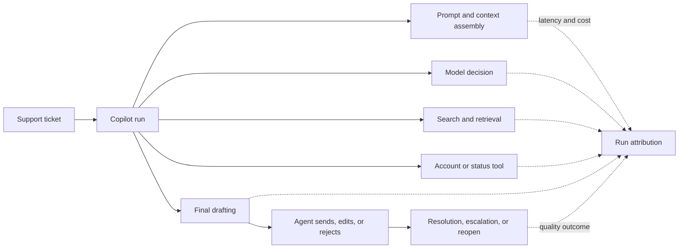
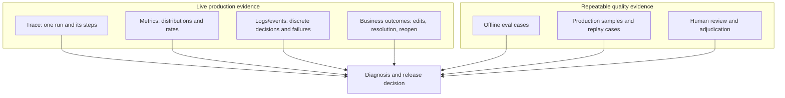
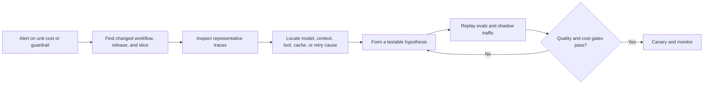

A cheaper LLM application is not better if more users abandon it, correct its answers, or reopen their tickets. A more accurate application is not sustainable if one simple task triggers ten model calls, repeated retrieval, and unnecessary human review.

Quality and cost must be read together because both emerge from the same workflow. The model is only one contributor. Prompts, retrieval, tools, orchestration, retries, caches, routing, and user interaction all change the outcome and the bill.

## Connect Spend To A User Outcome
<!-- section-summary: The useful unit of observation is a completed or failed task, with every model and tool step attributed to that outcome. -->

Use BrightCart, a software company whose support copilot drafts answers, searches documentation, reads account settings, checks service status, and recommends escalation. One ticket may finish after a single model call. Another may loop through retrieval and tools before an agent discards the draft.

Counting requests or tokens alone treats those runs as unrelated events. The operational view starts with a task outcome and follows its work:



This produces unit questions that a team can act on: cost per useful draft, cost per confirmed resolution, latency per workflow, human minutes per resolved ticket, or cost of an unnecessary escalation. **Unit economics** means relating resource consumption to a product unit that represents value. “We spent £4,000” is an accounting fact. “Password-reset resolutions cost 40% more because a retry loop doubled model calls” is an engineering diagnosis.

The outcome arrives later than the response. A draft can look good immediately and still lead to a reopened ticket two days later. Keep stable run and business-event IDs so delayed outcomes can join back to the trace without putting ticket IDs into high-cardinality metric labels.

## Define Quality Before Building The Dashboard
<!-- section-summary: A quality scorecard combines task success, evidence, safety, user friction, and important slices so cost reductions have explicit guardrails. -->

“Quality” is not one universal number. For BrightCart it includes whether the agent used the draft, whether the answer resolved the problem, whether claims were supported, whether escalation was correct, and whether policy was followed.

A scorecard defines those dimensions before optimization begins:

```yaml
workflow: support-draft
primary_outcomes:
  useful_draft_rate: agent sent with no or light edits
  confirmed_resolution_rate: closed and not reopened within 7 days
guardrails:
  policy_safe_rate: ">= 99.8%"
  supported_claim_rate: ">= 98%"
  incorrect_account_action_rate: "0%"
experience:
  p95_ready_latency_seconds: "<= 12"
  heavy_edit_rate: "<= 15%"
slices:
  - ticket_family
  - customer_plan
  - language
  - model_route
```

The primary outcome expresses value. Guardrails prevent a cheaper or faster design from winning by becoming unsafe. Experience signals expose user friction. Slices reveal uneven behaviour hidden by an average.

Not every signal means the same thing. An agent sending a draft is useful behavioural feedback, but time pressure may cause weak drafts to be sent. A thumbs-up is sparse and self-selected. An automated grader is scalable but may disagree with experts. Ticket reopen is a strong downstream signal but can have causes unrelated to the answer. Treat each as evidence with known limits.

Combine three kinds of quality measurement:

- **Deterministic checks** for schema validity, tool authorization, citation IDs, or policy invariants.
- **Evaluators and graders** for supportedness, relevance, completeness, or style, calibrated against human labels.
- **Product and human outcomes** such as edits, acceptance, escalation, repeat contact, and reviewed incidents.

The scorecard should state which signal gates a release and which only raises an investigation. A noisy sentiment score should not automatically roll back a safe system; one confirmed unauthorized account action should.

## Attribute Cost At Run And Step Level
<!-- section-summary: A run ledger separates model input, output, cache, retrieval, tool, infrastructure, and human cost so waste has a location and owner. -->

Provider invoices report usage, but the application needs a **cost ledger**—a record that attributes resource usage to a run, step, workflow, tenant class, and released system version.

For each model call, retain provider and model identity, input and output units, cached units when reported, service tier, latency, retry status, and dated price-catalog version. For tools, record billable API calls, compute time, bytes processed, and retries. Retrieval has embedding, search, reranking, storage, and ingestion cost. Human review and incident work can dominate low-volume high-risk workflows.

Use prices as versioned data, not constants scattered through code or dashboards. Provider models, prices, cached-token rules, and service tiers change. Historical reports should use the rate that applied to the event or clearly state that they revalue usage under a newer catalog.

A run may have several useful cost views:

| View | Question it answers |
| --- | --- |
| Model cost | Which model calls and token types drove provider spend? |
| Workflow cost | Which retrieval, tool, retry, and model steps consumed the run? |
| Tenant or feature cost | Who or what product capability used the capacity? |
| Outcome cost | How much did a useful draft or confirmed resolution cost? |
| Failure cost | How much was spent on abandoned, rejected, or repeated work? |

Do not double-count a retry as a new product outcome. Link attempts to one logical step. Record cache hits and misses, but remember that a high hit rate is valuable only when reused work remains correct.

## Use Traces, Metrics, Logs, And Evals For Different Jobs
<!-- section-summary: Traces explain individual runs, metrics reveal fleet patterns, logs record discrete events, and evals provide repeatable quality evidence. -->

No single observability signal carries the whole explanation.



A trace follows one run through model calls, retrieval, tools, handoffs, retries, and validation. It should show system-bundle versions and causal parent-child relationships. It is where an engineer learns that a tool timed out, the orchestrator retried, and the second model call received a larger context.

Metrics aggregate behaviour over many runs. Counters suit completed requests, failures, tokens, and tool calls. Histograms suit latency, token counts, cost, queue wait, and edit distance. Percentiles expose the slow or expensive tail that an average hides. Prometheus's current guidance prefers native histograms where practical; whichever representation is used, choose it based on the required aggregation and error properties.

Logs or structured events record discrete state: route selected, policy blocked, cache invalidated, grader failed, or reviewer overrode. Evals replay fixed cases against a candidate system and provide evidence before release. Production samples extend that evidence to real traffic and turn incidents into regression cases.

OpenTelemetry semantic conventions help standardize names for model operations, token usage, and related attributes. The GenAI conventions are still evolving, so pin instrumentation versions and map them into a small internal contract rather than binding every dashboard directly to unstable attributes.

## Keep Metrics Aggregatable And Traces Investigable
<!-- section-summary: Low-cardinality dimensions belong in metrics, while run IDs, user IDs, prompts, and detailed evidence belong in controlled trace or warehouse records. -->

A metric system creates a time series for each unique label combination. Labels such as raw run ID, ticket ID, user ID, prompt text, or error message can create unbounded **cardinality**—too many series to store and query reliably. They can also expose sensitive data.

Use bounded labels such as workflow, environment, model route, outcome class, error class, release version, region, and customer tier. Put high-cardinality identifiers in traces or a warehouse, then connect a dashboard sample to a trace through an exemplar or controlled link.

Content capture needs an explicit privacy policy. Full prompts and tool results are useful for debugging but may include customer records, secrets, or regulated data. Default to metadata, hashes, token counts, selected safe fields, and redacted excerpts. Restrict content capture by environment and role, sample it, encrypt it, apply retention, and audit access. Observability storage is another data system, not an exception to product privacy.

Sampling must preserve important failures. Randomly retaining one percent of traces can discard every rare safety incident. Keep all policy violations, expensive outliers, failed tools, and user-reported problems; sample ordinary successes at a lower rate. Record the sampling rule so analysts do not interpret the sample as raw traffic.

## Build Dashboards Around Decisions
<!-- section-summary: A useful dashboard starts with outcomes and guardrails, then allows operators to move from a changed segment to representative traces and causes. -->

The top row should answer whether the product is healthy: traffic, useful outcome rate, safety guardrails, p50 and p95 latency, cost per successful outcome, and budget consumption. The next row explains composition: workflow, release, model route, ticket family, cache behaviour, retry rate, and tool contribution. A third layer links suspicious segments to example traces and evaluation cases.

Never graph cost without a quality companion. When cost per ticket falls, show useful draft rate, supported-claim rate, reopen rate, and latency for the same segment and time window. When a quality metric changes, show traffic mix and sample size. A tiny new-language slice should not swing a global release decision without its uncertainty being visible.

Avoid averaging percentiles across instances or time buckets. Aggregate the underlying histogram correctly. Show distributions for tokens and cost because a small number of agent loops can dominate spend. Separate queue time, time to first useful output, and full completion time; users experience them differently.

Budgets work at several levels. A request has limits on context, output, steps, and retries. A workflow has a target cost per successful task. A tenant or team has a period budget. The product has provider and infrastructure commitments. Alert on both consumption and outcome: a sudden cost increase with stable traffic is different from planned growth with stable unit economics.

## Investigate Tradeoffs Causally
<!-- section-summary: Quality or cost incidents are diagnosed by locating the changed slice, tracing its step-level cause, testing a hypothesis, and verifying both dimensions after the fix. -->

Suppose Monday cost rises 35% while ticket volume rises 5%. The team should not immediately route everything to a cheaper model.



The slice may reveal barcode-sync tickets. Traces show a retrieval miss, two broader retries, and a fallback to the largest model. The real repair may be to index the current workaround and fix source metadata. Model routing alone would mask the knowledge failure and might lower answer quality.

Common waste patterns have different remedies:

| Pattern | Likely evidence | Better first action |
| --- | --- | --- |
| Growing input tokens | context and prompt versions | remove duplication, improve retrieval selection, compact state |
| Repeated model calls | trace loops and validation failures | repair schema, stop condition, or orchestrator transition |
| Tool retry cost | dependency errors and attempt spans | fix timeout, idempotency, backoff, or circuit breaker |
| Low cache value | hits with quality failures or frequent invalidation | correct identity and freshness; remove unsafe cache |
| High human edit cost | edit classes and ticket slices | improve knowledge, instructions, or training data for that slice |
| Large-model overuse | route reason and outcome comparison | strengthen router and evaluate smaller eligible routes |

Every incident should produce durable evidence: a corrected source or control, representative trace IDs, an eval case, a quality-and-cost comparison, and a release decision. Otherwise the same failure returns under a new prompt or model.

## Optimize The Workflow, Not The Invoice
<!-- section-summary: Sustainable optimization removes unnecessary work while preserving measured task value, safety, and user experience. -->

Start with the highest-cost failed or low-value outcomes. Remove duplicate context, runaway retries, unnecessary model calls, stale retrieval, and work that deterministic code can perform. Then evaluate model routing, caching, batching, shorter outputs, or a different service tier. Each change needs the same quality scorecard and staged release as any other product change.

The durable operating model is: define the outcome, attribute every step, observe distributions, keep privacy and cardinality bounded, connect fleet metrics to traces, and test cost changes against quality guardrails. The goal is not the lowest model bill. It is the least wasteful system that reliably produces the outcome users and the business need.

## References

- [OpenAI Agents SDK tracing](https://openai.github.io/openai-agents-python/tracing/)
- [OpenAI prompt caching](https://developers.openai.com/api/docs/guides/prompt-caching)
- [OpenAI cost optimization](https://developers.openai.com/api/docs/guides/cost-optimization)
- [OpenAI latency optimization](https://developers.openai.com/api/docs/guides/latency-optimization)
- [OpenTelemetry GenAI semantic conventions](https://github.com/open-telemetry/semantic-conventions-genai)
- [OpenTelemetry metrics data model](https://opentelemetry.io/docs/specs/otel/metrics/data-model/)
- [OpenTelemetry trace concepts](https://opentelemetry.io/docs/concepts/signals/traces/)
- [Prometheus histograms and summaries](https://prometheus.io/docs/practices/histograms/)
- [FinOps Framework](https://www.finops.org/framework/)
- [Langfuse observability overview](https://langfuse.com/docs/observability/overview)
- [Phoenix tracing overview](https://arize.com/docs/phoenix/tracing/llm-traces)
