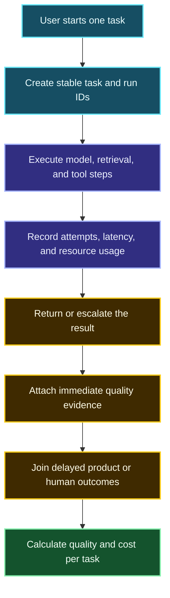
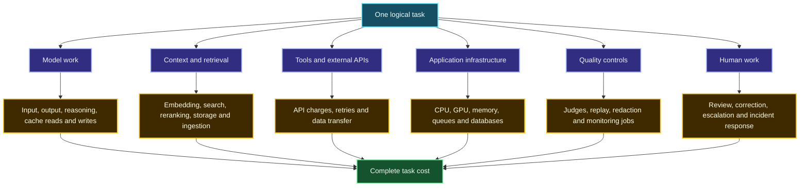
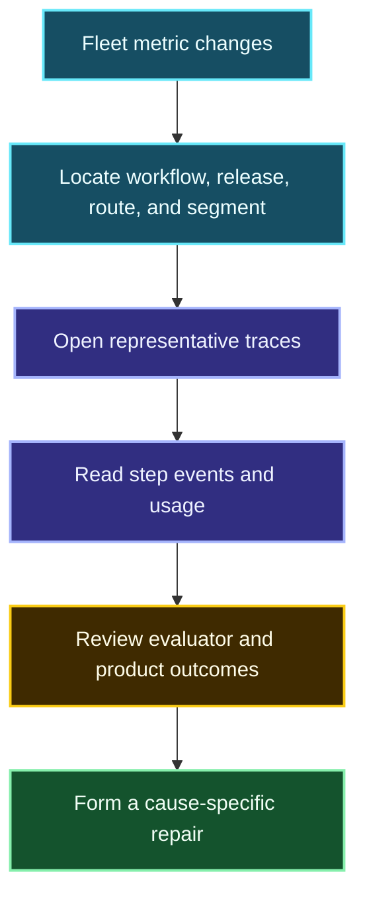
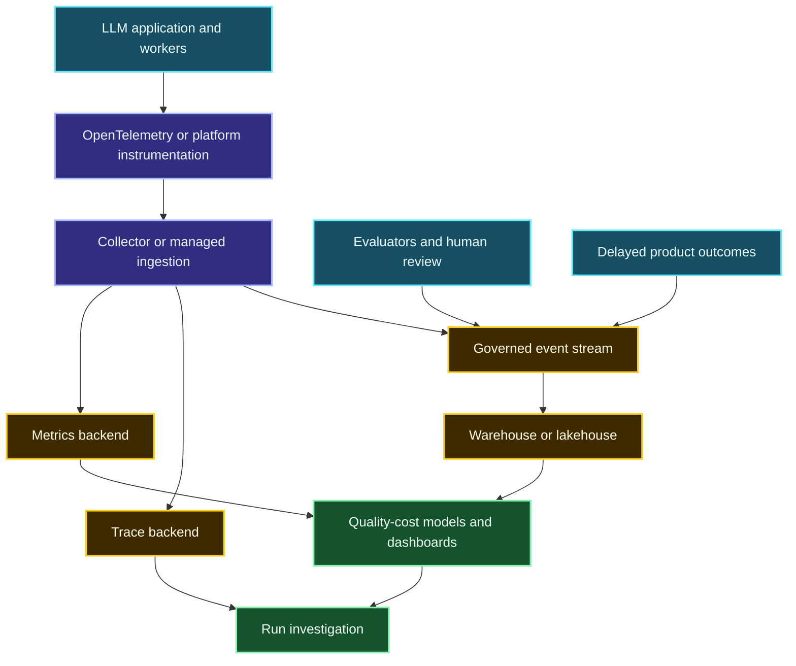
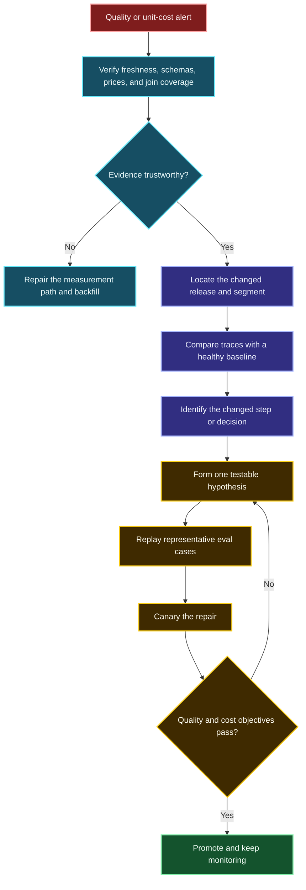
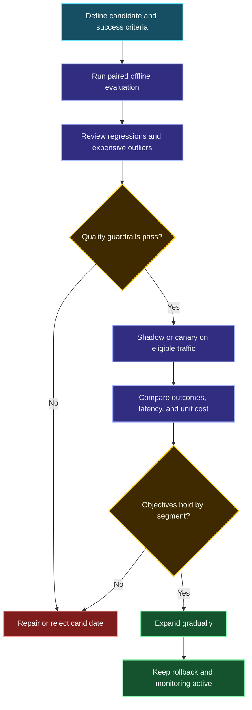

## Table of Contents

1. [What Quality And Cost Mean](#what-quality-and-cost-mean)
2. [Start With A User Task And An Acceptable Outcome](#start-with-a-user-task-and-an-acceptable-outcome)
3. [Build A Quality Scorecard](#build-a-quality-scorecard)
4. [Understand Where Quality Evidence Comes From](#understand-where-quality-evidence-comes-from)
5. [Calculate The Complete Cost Of A Run](#calculate-the-complete-cost-of-a-run)
6. [Turn Spend Into Unit Economics](#turn-spend-into-unit-economics)
7. [Record Usage Without Hard-Coding Prices](#record-usage-without-hard-coding-prices)
8. [Give Each Observability Signal A Clear Job](#give-each-observability-signal-a-clear-job)
9. [Store Detailed Evidence Safely](#store-detailed-evidence-safely)
10. [Build Dashboards Around Decisions](#build-dashboards-around-decisions)
11. [Set Quality Objectives And Cost Budgets](#set-quality-objectives-and-cost-budgets)
12. [Diagnose A Quality Or Cost Change](#diagnose-a-quality-or-cost-change)
13. [Repair Common Sources Of Waste](#repair-common-sources-of-waste)
14. [Test The Quality-Cost Tradeoff](#test-the-quality-cost-tradeoff)
15. [Choose A Production Tooling Path](#choose-a-production-tooling-path)
16. [Operate A Continuous Quality-Cost Loop](#operate-a-continuous-quality-cost-loop)
17. [References](#references)

At a high level, **quality and cost observability** tells a team whether an LLM application is producing acceptable results and how much work the system performs to produce them.

The two ideas belong in the same operating view. A low-cost answer has little value if it is incorrect, unsafe, or rejected by the user. An excellent answer may still be impractical if a routine task triggers several model calls and repeated searches. Unnecessary tools and manual review add further expense.

The core question is: **How reliably does the workflow complete the user’s task, and what resources does one acceptable outcome consume?**

That question changes the focus from an isolated model request to the complete workflow. Prompts, retrieved context, tools, orchestration, retries, caches, model routes, validation, and human effort can all affect the result. Each part must be visible enough to measure and improve.

## What Quality And Cost Mean
<!-- section-summary: Quality measures whether a workflow meets its requirements, while cost measures the resources consumed to reach that result. -->

**Quality** is the degree to which an LLM workflow meets the requirements of a user task. Accuracy is one part of quality. The full definition may also include completeness, supported claims, safety, policy compliance, correct tool use, response time, and the amount of correction required from a person.

Consider a workflow that drafts a response to a support request. A fluent answer can still be poor if it cites an old policy, invents an account action, or sends the case to the wrong queue. A useful definition of quality must describe the result the user actually needs: a correct, supported, policy-compliant response that resolves the request with little editing.

**Cost** is the total resource consumption associated with producing that result. Model tokens are usually visible on a provider bill, yet they are only one part of the total. Search queries, embedding calls, reranking, tool APIs, database work, GPU or CPU time, retry traffic, evaluation jobs, human review, and incident work may all contribute.

The practical aim is **value efficiency**: produce more acceptable outcomes from the resources available while preserving safety and user experience. Cost cutting is only one possible action. A team may deliberately spend more on a high-risk task because stronger verification reduces harmful errors. It may also route a simple classification to a smaller model because evaluation shows no meaningful quality loss.

Quality and cost are properties of a system configuration. A configuration includes the model, prompt, tools, retrieval settings, orchestration rules, safety controls, and release version. Comparing model names without the rest of that configuration gives an incomplete result.

## Start With A User Task And An Acceptable Outcome
<!-- section-summary: A logical task connects every attempt and step to the result the user ultimately receives. -->

The most useful measurement unit is a **logical task**. A logical task represents the piece of work the user wanted completed, such as answering one support request, extracting one contract, resolving one coding issue, or processing one research question.

One task can contain several technical requests. The application may retrieve documents, call a model, reject invalid structured output, retry the model, call a tool, and ask a person for approval. Counting each request as a separate success would hide the fact that they all served one outcome.


```mermaid
flowchart TD
    A["User starts one task"] --> B["Create stable task and run IDs"]
    B --> C["Execute model, retrieval, and tool steps"]
    C --> D["Record attempts, latency, and resource usage"]
    D --> E["Return or escalate the result"]
    E --> F["Attach immediate quality evidence"]
    F --> G["Join delayed product or human outcomes"]
    G --> H["Calculate quality and cost per task"]

    classDef start fill:#164E63,stroke:#67E8F9,color:#ECFEFF,stroke-width:2px; classDef work fill:#312E81,stroke:#A5B4FC,color:#EEF2FF,stroke-width:2px;
    classDef evidence fill:#3F2A00,stroke:#FACC15,color:#FEFCE8,stroke-width:2px; classDef result fill:#14532D,stroke:#86EFAC,color:#F0FDF4,stroke-width:2px;
    class A,B start;
    class C,D work;
    class E,F,G evidence;
    class H result;
```

The application should assign a stable `task_id` and a `run_id` at the boundary where work is accepted. Every model call, retrieval query, tool invocation, retry, and evaluator result refers to those identifiers. A retry keeps the same logical task and usually the same logical step identifier, with a new attempt number.

The outcome can arrive long after the response. A generated answer may pass an immediate evaluator and still cause a user to reopen the request later. A document extraction may look structurally valid, then fail an accounting reconciliation the following day. Store an **outcome join key** in a governed event record so later business events can be connected to the original run.

For example, a support workflow could define:

- the task as one incoming support request;
- the immediate outcome as sent, edited, rejected, or escalated;
- the delayed outcome as resolved, reopened, or corrected;
- the useful outcome as sent with light editing and no reopen during the policy window.

Those definitions make “cost per useful answer” possible. They also reveal failure cost: money spent on drafts that were rejected, abandoned, or repeated.

## Build A Quality Scorecard
<!-- section-summary: A scorecard separates product outcomes, hard guardrails, user experience, and diagnostic evidence. -->

A single quality score often hides the exact behaviour a team needs to protect. A workflow can improve its average relevance score while creating more unsupported claims. It can also become safer by refusing nearly everything, which damages task completion.

A **quality scorecard** is a small set of measures that describes acceptable behaviour from several angles. A useful scorecard has four layers.

### Product outcome

The product outcome represents user value. Examples include a resolved request, an accepted draft, a correctly extracted record, a completed workflow, or a verified answer. The measure should be close enough to the real task that a change in the number matters to product and operations teams.

### Hard guardrails

Guardrails describe behaviour that cannot be traded away for average quality or lower cost. Common guardrails include authorization, policy compliance, prohibited-content rate, unsupported high-risk claims, and incorrect side effects. Some are expressed as rates; a severe event may instead have a zero-tolerance incident policy.

### User experience

Experience measures how the workflow feels to the person using it. Time to first useful output, full completion time, abandonment, edit effort, extra turns, and escalation rate often reveal problems that an answer grader misses.

### Diagnostic evidence

Diagnostic measures help engineers locate causes. Retrieval relevance, citation coverage, tool success, schema-valid output, loop count, route choice, and context size belong here. They are valuable operational signals, although they do not prove that the user’s task succeeded.

A compact configuration keeps the definitions reviewable:

```yaml
workflow: support_response

primary_outcome:
  name: accepted_resolution_rate
  definition: accepted response with no reopen during the policy window

guardrails:
  authorization_violation_rate: 0
  supported_high_risk_claim_rate: ">= 0.995"

experience:
  p95_time_to_first_useful_output_seconds: "<= 8"
  heavy_edit_rate: "<= 0.12"

diagnostics:
  retrieval_hit_rate: ">= 0.90"
  tool_success_rate: ">= 0.995"

slices:
  - task_family
  - language
  - risk_tier
  - model_route
  - release_version
```

Each measure needs an exact numerator and denominator. It also needs an observation window, an owner, a data source, and a policy for missing evidence. “Accuracy” is too vague. “The proportion of reviewed high-risk answers whose supported-claim score passes the expert-calibrated threshold” can be implemented and audited.

Slices deserve the same care. A global average can look healthy while one language, task type, customer tier, or tool route fails. Use a bounded set of product-relevant dimensions and require a minimum sample size before making a decision from a small segment.

## Understand Where Quality Evidence Comes From
<!-- section-summary: Deterministic checks, evaluators, human judgement, and product outcomes answer different quality questions. -->

Quality is partly latent: the system cannot directly observe whether every answer is genuinely useful and correct. Teams estimate it from several forms of evidence, each with strengths and limitations.

### Deterministic checks

A deterministic check has an exact rule. It can verify JSON schema, required citations, permitted tool arguments, numerical totals, authorization decisions, or the presence of mandatory fields. These checks are fast, repeatable, and easy to run on every request.

Their limitation is scope. A valid JSON object can contain a wrong answer. A citation identifier can exist while failing to support the sentence that uses it. Deterministic checks should own properties that software can prove.

### Human review

Domain experts can judge correctness, nuance, policy application, and real usefulness. Their labels form the best reference for calibrating automated evaluators in high-stakes areas.

Human judgement also needs an operating process. Reviewers need a rubric, examples, an adjudication path for disagreements, and periodic agreement checks. A raw thumbs-up collected from users has a different meaning from a blinded expert review. Store the source of the judgement alongside the score.

### Product outcomes

Product behaviour provides evidence from real use: acceptance, editing, completion, repeat contact, escalation, conversion, or downstream correction. These signals are valuable because they connect the LLM to a real task.

They can be delayed or confounded. A user may accept a weak answer due to time pressure. A request may reopen because an external system failed. Analyse these outcomes with task context and supporting evidence instead of treating them as perfect labels.

### Automated evaluators

Code-based scorers and LLM judges scale quality assessment across offline datasets and sampled production traces. They can estimate supportedness, relevance, instruction following, completeness, style, or safety.

An evaluator is another measurement system. Calibrate it against reviewed examples, measure false positives and false negatives, version its rubric and judge model, and retain explanations for sampled cases. A release gate should use evaluators that have demonstrated useful agreement with the people responsible for the task.

Suppose a retrieval assistant receives an answer that is fluent and relevant. A deterministic check confirms that citations exist. An LLM judge says the answer is supported. A reviewer later finds that one citation refers to the wrong document version. The incident should improve the evidence system: add document-version checks, include similar cases in the evaluation set, and recalibrate the supportedness scorer. The repair is broader than changing a dashboard threshold.

## Calculate The Complete Cost Of A Run
<!-- section-summary: Complete run cost includes model usage, data access, tools, infrastructure, evaluation, and human work. -->

The provider charge for a model call is **model cost**. The amount required to operate the user task is **workflow cost**. The difference matters most in agentic and retrieval-heavy applications.

Model cost can be compared to the price of one ingredient. Workflow cost describes the complete meal: the application may retrieve documents, call tools, validate output, retry failed steps, and request human approval. Every one of those actions consumes resources.

A complete calculation follows the logical task from acceptance to its final outcome. It preserves the individual categories so an engineer can see where the money went, while also producing one task-level total for product and financial analysis.


```mermaid
flowchart TD
    A["One logical task"] --> B["Model work"]
    A --> C["Context and retrieval"]
    A --> D["Tools and external APIs"]
    A --> E["Application infrastructure"]
    A --> F["Quality controls"]
    A --> G["Human work"]

    B --> B1["Input, output, reasoning, cache reads and writes"]
    C --> C1["Embedding, search, reranking, storage and ingestion"]
    D --> D1["API charges, retries and data transfer"]
    E --> E1["CPU, GPU, memory, queues and databases"]
    F --> F1["Judges, replay, redaction and monitoring jobs"]
    G --> G1["Review, correction, escalation and incident response"]

    B1 --> H["Complete task cost"]
    C1 --> H
    D1 --> H
    E1 --> H
    F1 --> H
    G1 --> H

    classDef task fill:#164E63,stroke:#67E8F9,color:#ECFEFF,stroke-width:2px; classDef category fill:#312E81,stroke:#A5B4FC,color:#EEF2FF,stroke-width:2px;
    classDef detail fill:#3F2A00,stroke:#FACC15,color:#FEFCE8,stroke-width:2px; classDef total fill:#14532D,stroke:#86EFAC,color:#F0FDF4,stroke-width:2px;
    class A task;
    class B,C,D,E,F,G category;
    class B1,C1,D1,E1,F1,G1 detail;
    class H total;
```

Model usage may include input tokens, output tokens, cached input, cache writes, reasoning units, images, audio, or provider tools. The exact categories vary across providers and model families. Record the raw units returned by the provider rather than forcing everything into one token count.

Retrieval cost includes the continuous path as well as the request path. Embedding a document collection, updating indexes, storing vectors, running hybrid search, and reranking results all serve future requests. Allocate shared ingestion and storage costs across a meaningful unit, such as the workflow, knowledge domain, or successful retrieved answer.

Tool cost can be direct, such as a paid search API, or indirect, such as database compute. Attempts matter. Five timed-out calls may produce no useful result and still consume capacity.

Evaluation also has a cost. Running an LLM judge on every production trace can approach the cost of the application itself. Use deterministic checks broadly, apply judges to representative samples and important risk classes, and keep all confirmed incidents for regression testing.

Human work belongs in the model if it changes the operating decision. A low model bill can coexist with expensive manual correction. For a workflow that requires expert review, report machine cost and human minutes separately; combine them only after finance and operations agree on a conversion method.

## Turn Spend Into Unit Economics
<!-- section-summary: Unit economics relates technology cost to a product unit that represents completed value. -->

**Unit economics** connects technology spending to the value-producing unit of a product. In LLMOps, useful units include a completed task, accepted draft, resolved case, verified document, successful research run, or active user served.

The denominator is the difficult part. Cost per API request may fall because the application splits one user task into more requests. Cost per token may improve while a retry loop doubles the number of tokens. Cost per successful task resists those distortions because every attempt is attributed to the same outcome.

The basic calculation is:

```text
cost per successful task
= total cost of all observed tasks
  / number of tasks that met the success definition
```

It is often useful to report two additional numbers:

```text
cost per attempted task = total cost / all tasks
failure spend = cost attributed to failed, abandoned, or rejected tasks
```

Imagine 1,000 document extractions. They cost 200 currency units in total, and 800 pass validation plus downstream reconciliation. Cost per request is 0.20. Cost per successful extraction is 0.25. If a new configuration costs 220 but produces 950 successful results, its cost per successful extraction is about 0.23. The larger invoice produces better unit economics.

A warehouse or lakehouse query can calculate the metric after delayed outcomes arrive. In this example, `llm_step_cost` has one row per billable step attempt, so retries create additional rows under the same stable `task_id`. `llm_task_outcome_current` is a curated view with at most one final outcome per task; its pipeline has already deduplicated the raw outcome events.

Aggregate the step costs to one row per task before joining the outcome. A direct join between step attempts and raw outcome events could multiply rows and overstate cost.

```sql
WITH task_cost AS (
  SELECT task_id, workflow, release_version,
         SUM(machine_cost) AS machine_cost
  FROM llm_step_cost
  WHERE event_time >= :window_start AND event_time < :window_end
  GROUP BY task_id, workflow, release_version
),
task_result AS (
  SELECT cost.*, outcome.outcome
  FROM task_cost AS cost
  LEFT JOIN llm_task_outcome_current AS outcome
    ON outcome.task_id = cost.task_id
)
SELECT workflow, release_version,
       COUNT(*) AS attempted_tasks,
       SUM(CASE WHEN outcome = 'accepted' THEN 1 ELSE 0 END) AS accepted_tasks,
       SUM(machine_cost) AS total_machine_cost,
       SUM(machine_cost) / NULLIF(
         SUM(CASE WHEN outcome = 'accepted' THEN 1 ELSE 0 END), 0
       ) AS cost_per_accepted_task
FROM task_result
GROUP BY workflow, release_version;
```

The left join keeps every attempted task in the denominator even if its delayed outcome is still missing. Missing-outcome coverage should appear beside the unit-cost result so operators can distinguish a real quality change from a delayed or broken outcome feed. Segment the result by task family, risk tier, language, and route. Comparing unrelated task mixes can make a release appear more or less efficient than it truly is.

## Record Usage Without Hard-Coding Prices
<!-- section-summary: Telemetry preserves raw usage and joins it to a versioned price catalogue for reproducible cost calculation. -->

Provider prices and billing categories change. An event emitted today should remain interpretable after a price update. Store raw usage separately from the catalogue used to value it.

A model-step event can contain:

```json
{
  "task_id": "task_7f31",
  "run_id": "run_12a9",
  "step_id": "draft_answer",
  "attempt": 2,
  "workflow": "support_response",
  "release_version": "release_42",
  "provider": "provider_name",
  "model": "model_route_target",
  "usage": {
    "input_units": 4280,
    "output_units": 360,
    "cached_input_units": 3100
  },
  "latency_ms": 1840,
  "status": "ok",
  "price_catalog_version": "catalog_18"
}
```

The event records what happened. A versioned price catalogue maps provider, model, usage category, service tier, region, and effective period to a rate. A cost-enrichment job joins the event to that catalogue and writes a derived cost record.

This design supports two legitimate historical views:

- **as-billed cost**, using the rate effective during the event;
- **revalued cost**, applying one catalogue to several releases for a controlled engineering comparison.

Label the view clearly. Revaluing old usage with current rates can help compare architectures, although it does not reproduce an old invoice.

Caching needs similar care. Some providers report cached input separately; newer model families may also report cache-write usage. A cache hit is not automatically a saving because an unnecessary cache write, low reuse, stale result, or extra validation call can erase the benefit. Track the provider’s reported categories and calculate the net effect for the complete task.

## Give Each Observability Signal A Clear Job
<!-- section-summary: Metrics reveal fleet patterns, traces explain runs, events preserve decisions, and evaluations measure behaviour against criteria. -->

Production observability uses several signals because each answers a different question. Think of them as several views of the same workflow: metrics reveal the broad pattern, while detailed evidence explains individual runs and measures their results.

**Metrics** show rates and distributions across many tasks. Counters suit completed tasks, failures, calls, and usage units. Histograms suit latency, input size, output size, step count, and task cost. They help operators find a changed workflow, route, or release.

**Traces** explain one execution. A trace follows a run through model calls, retrieval, tools, validators, retries, and handoffs. A **span** represents one timed step within that trace. The trace reveals which step created the latency or cost and what happened before it.

**Structured events and logs** preserve discrete decisions, such as a route selection, budget stop, cache invalidation, policy block, human override, or evaluator failure. They are especially useful for state changes that should be counted and audited.

**Evaluations** compare behaviour against explicit criteria. Offline evaluation runs on curated cases before release. Production evaluation scores sampled real traces, user-reported problems, and important risk classes. The same scorer can be used in both places if its inputs and rubric stay compatible.


```mermaid
flowchart TD
    A["Fleet metric changes"] --> B["Locate workflow, release, route, and segment"]
    B --> C["Open representative traces"]
    C --> D["Read step events and usage"]
    D --> E["Review evaluator and product outcomes"]
    E --> F["Form a cause-specific repair"]

    classDef fleet fill:#164E63,stroke:#67E8F9,color:#ECFEFF,stroke-width:2px; classDef inspect fill:#312E81,stroke:#A5B4FC,color:#EEF2FF,stroke-width:2px;
    classDef evidence fill:#3F2A00,stroke:#FACC15,color:#FEFCE8,stroke-width:2px; classDef action fill:#14532D,stroke:#86EFAC,color:#F0FDF4,stroke-width:2px;
    class A,B fleet;
    class C,D inspect;
    class E evidence;
    class F action;
```

OpenTelemetry provides portable tracing, metrics, and log concepts. Its GenAI semantic conventions cover model, agent, tool, and MCP telemetry in a dedicated OpenTelemetry repository. The conventions continue to evolve, so pin instrumentation versions and translate vendor attributes into a small internal event contract. Dashboards and warehouse models can then depend on stable internal fields.

Avoid storing `task_id`, user ID, prompt text, or error messages as metric labels. Every unique label combination creates another time series. Bounded labels such as workflow, environment, route, release, status class, and region keep the metric system aggregatable. Detailed identifiers belong in traces and governed analytical records.

## Store Detailed Evidence Safely
<!-- section-summary: A production data path separates low-cardinality operational metrics from governed detailed evidence and delayed outcomes. -->

Quality-cost analysis joins operational telemetry with content, evaluations, and business outcomes. That makes observability a sensitive data system. Prompts and tool results can contain personal data, account details, secrets, source documents, or regulated information.

The default record should contain metadata, version identifiers, usage, and status. Timings explain performance. Hashes and selected safe fields can support correlation without exposing full content.

Content capture requires an approved purpose plus redaction and access controls. Encryption and retention rules protect the stored evidence. Audit logging records who accessed it.


```mermaid
flowchart TD
    A["LLM application and workers"] --> B["OpenTelemetry or platform instrumentation"]
    B --> C["Collector or managed ingestion"]
    C --> D["Metrics backend"]
    C --> E["Trace backend"]
    C --> F["Governed event stream"]
    G["Evaluators and human review"] --> F
    H["Delayed product outcomes"] --> F
    F --> I["Warehouse or lakehouse"]
    I --> J["Quality-cost models and dashboards"]
    D --> J
    E --> K["Run investigation"]
    J --> K

    classDef source fill:#164E63,stroke:#67E8F9,color:#ECFEFF,stroke-width:2px; classDef transport fill:#312E81,stroke:#A5B4FC,color:#EEF2FF,stroke-width:2px;
    classDef store fill:#3F2A00,stroke:#FACC15,color:#FEFCE8,stroke-width:2px; classDef use fill:#14532D,stroke:#86EFAC,color:#F0FDF4,stroke-width:2px;
    class A,G,H source;
    class B,C transport;
    class D,E,F,I store;
    class J,K use;
```

The metrics backend carries fleet-level rates and distributions. The trace backend preserves sampled run structure for diagnosis. The warehouse or lakehouse handles high-cardinality joins among tasks, releases, costs, evaluation results, reviews, and delayed outcomes.

Sampling should protect rare failures. Random sampling alone may discard every severe safety event. Keep all policy violations, high-cost outliers, failed tools, user-reported problems, and reviewed incidents. Sample ordinary successful runs at a lower rate. Record the sampling policy so an analyst knows which conclusions the data supports.

For a Databricks implementation, MLflow Tracing can capture application traces and evaluation feedback, while Delta tables provide a governed place for cost events and delayed outcome joins. Unity Catalog can govern access to the resulting data assets. Production teams can implement the same separation with OpenTelemetry, a trace backend, Prometheus-compatible metrics, and Snowflake, BigQuery, PostgreSQL, or another governed analytical store.

## Build Dashboards Around Decisions
<!-- section-summary: A dashboard connects product health to changed segments and then to representative runs. -->

A useful dashboard connects a fleet-level change to the part of the workflow that caused it. It should help a product owner understand the outcome and help an engineer reach representative runs without searching across unrelated tools. Three questions organize that path:

1. Is the product still delivering acceptable outcomes?
2. Which workflow, release, route, or segment changed?
3. Which runs explain the change?

The first view should combine task volume, accepted outcome rate, hard guardrails, p50 and p95 latency, cost per accepted task, and budget consumption. The second view should break those measures down by workflow, task family, risk tier, model route, release version, cache result, and tool path. The final view should link a suspicious group to representative traces and evaluation records.

Every cost chart needs a quality companion for the same population and time window. A falling cost per task has different meanings if accepted outcomes remain stable, improve, or decline. A rising quality score also needs its cost, latency, and sample coverage beside it.

Show distributions for task cost, tokens, step count, and latency. A small group of looping agent runs can dominate spend while the average remains calm. Percentiles help expose the tail, but they must be calculated from an aggregatable histogram or the underlying events. Averaging separately calculated percentiles produces a misleading result.

Coverage belongs on the dashboard. If only 5% of production tasks receive an LLM-judge score, show the evaluated count and sampling policy. If delayed outcomes are available for 60% of tasks, show join coverage. A quality number without its evidence coverage can create false confidence.

A concrete investigation might start from a 25% rise in cost per accepted task. The breakdown shows one document type and one release. Example traces reveal that a parser change causes schema validation to fail, so the orchestrator repeats the model call with the same invalid instruction. The useful dashboard connects the aggregate alert to that repeated step without placing raw document IDs in metric labels.

## Set Quality Objectives And Cost Budgets
<!-- section-summary: Objectives define acceptable service behaviour, while budgets contain individual runs and total consumption. -->

A **quality objective** defines the level of product behaviour the team intends to maintain. A **cost target** defines the expected resource consumption per value-producing unit. A **budget** sets a boundary on consumption.

These controls operate at different levels.

- A request budget limits context size, output size, tool calls, steps, retries, or elapsed time.
- A workflow target defines cost per accepted outcome and quality guardrails.
- A tenant budget controls period consumption and protects shared capacity.
- A platform budget controls provider spend, evaluation capacity, and infrastructure commitments.

Hard request limits prevent runaway work. A loop should have a maximum step count and a stop reason. A retry policy defines eligible errors, backoff, and a maximum number of attempts. Tool calls need timeouts and idempotency controls.

Every limit also needs a safe fallback. Depending on the task, the application can return a partial result, ask for clarification, queue asynchronous work, or escalate to a person.

```yaml
workflow_limits:
  max_model_steps: 4
  max_tool_calls: 8
  max_retries_per_step: 2
  max_elapsed_seconds: 45

budget_actions:
  at_soft_limit: compact_context
  at_hard_limit: escalate_with_trace

release_gate:
  accepted_outcome_rate_drop: "<= 0.01"
  supported_claim_rate: ">= 0.995"
  cost_per_accepted_task_increase: "<= 0.08"
```

The values above are examples rather than universal defaults. Derive limits from task risk, observed distributions, user expectations, and capacity. A research workflow may reasonably use more steps than a routing classifier.

Alerts should distinguish growth from inefficiency. Total spend can rise because traffic grows while cost per successful task remains stable. Unit cost can rise with flat traffic because contexts expand or retries increase. Monitor both total consumption and unit economics.

## Diagnose A Quality Or Cost Change
<!-- section-summary: Investigation verifies evidence, locates the changed population, examines run structure, and tests one causal hypothesis. -->

An alert reports that a measured condition crossed a boundary. It does not identify the cause. A disciplined investigation separates failures in the evidence pipeline from genuine changes in application behaviour before the team changes a model or rolls back a release.

First verify evidence integrity. Check event freshness, schema changes, price-catalog versions, evaluator coverage, delayed-outcome join coverage, and traffic mix. A stale price table can imitate a cost change. A broken outcome join can make cost per success jump even though the application behaves normally.

Next locate the changed population. Compare workflow, release, model route, task family, language, risk tier, region, cache result, and tool path. Keep sample size and uncertainty visible.

Then inspect representative runs from the changed group. Compare step count, context size, model usage, tool attempts, route reason, evaluator results, and outcome evidence against a healthy baseline.


```mermaid
flowchart TD
    A["Quality or unit-cost alert"] --> B["Verify freshness, schemas, prices, and join coverage"]
    B --> C{"Evidence trustworthy?"}
    C -->|No| D["Repair the measurement path and backfill"]
    C -->|Yes| E["Locate the changed release and segment"]
    E --> F["Compare traces with a healthy baseline"]
    F --> G["Identify the changed step or decision"]
    G --> H["Form one testable hypothesis"]
    H --> I["Replay representative eval cases"]
    I --> J["Canary the repair"]
    J --> K{"Quality and cost objectives pass?"}
    K -->|No| H
    K -->|Yes| L["Promote and keep monitoring"]

    classDef alert fill:#7F1D1D,stroke:#FCA5A5,color:#FEF2F2,stroke-width:2px; classDef verify fill:#164E63,stroke:#67E8F9,color:#ECFEFF,stroke-width:2px;
    classDef inspect fill:#312E81,stroke:#A5B4FC,color:#EEF2FF,stroke-width:2px; classDef test fill:#3F2A00,stroke:#FACC15,color:#FEFCE8,stroke-width:2px;
    classDef good fill:#14532D,stroke:#86EFAC,color:#F0FDF4,stroke-width:2px;
    class A alert;
    class B,C,D verify;
    class E,F,G inspect;
    class H,I,J,K test;
    class L good;
```

The direction of change narrows the search:

- **Cost rises and quality stays stable.** Look for longer contexts, more steps, provider-route changes, cache misses, tool retries, or a different traffic mix.
- **Quality falls and cost stays stable.** Look for prompt, retrieval, policy, tool-result, evaluator, or model behaviour changes.
- **Cost and quality both fall.** A smaller route, aggressive truncation, stronger cache reuse, or early stopping may have removed useful work.
- **Cost and quality both rise.** The added work may be justified. Compare the value of the quality gain with latency, budget, and task risk.

Suppose a knowledge assistant costs more after a release. The changed slice contains questions about recently updated procedures. Traces show failed retrieval followed by two broad searches and a larger-model fallback. The durable repair is likely in indexing freshness or metadata, followed by a regression case for that procedure. Routing every request to a cheaper model would leave the retrieval failure in place.

## Repair Common Sources Of Waste
<!-- section-summary: Effective optimization removes a measured source of unnecessary work and verifies the result against the same quality scorecard. -->

Waste means resource consumption that does not contribute enough to the acceptable outcome. The solution depends on the location of that waste.

### Context keeps growing

Repeated instructions, full conversation history, overly broad retrieval, and duplicated tool output can inflate input usage and latency.

Inspect input size by prompt component rather than looking only at total tokens. Record system-instruction and conversation-state sizes separately. Track retrieved passages, tool schemas, and tool results as their own components.

Remove duplicated instructions. Retrieve fewer, better passages. Summarize or compact state after preserving facts required by future turns. Expose only relevant tools to the current task.

OpenAI’s cost and latency guidance recommends reducing input and output tokens, making fewer requests, and selecting smaller models where evaluation supports the choice. Prompt caching can improve repeated-prefix efficiency, though current accounting differs across model families. Keep stable reusable prefixes together, record cache read and write usage, and compare net task cost.

### The orchestrator repeats work

A retry loop may turn one recoverable error into several expensive model calls. Common causes include ambiguous stop conditions, invalid structured output, non-idempotent tools, and retry policies that treat permanent errors as transient.

Classify failures before retrying. A timeout may deserve bounded exponential backoff. An authorization failure should stop. A schema error may be repaired once with the validation message. Give each loop a step limit, elapsed-time limit, and explicit terminal state.

For example, if traces show three calls producing the same invalid JSON, improve the schema description and validator feedback, then allow one targeted repair attempt. Add the failing payload shape to regression tests. A lower retry limit alone protects cost but may leave users with avoidable failures.

### Retrieval work produces little evidence

Search, reranking, and long context can consume resources while returning irrelevant or stale material. Measure retrieval separately: query count, hit rate, selected-document versions, reranker latency, and citation support.

Repair the earliest broken layer. Update stale source ingestion, fix metadata filters, improve chunking, or rewrite the query before changing the answer model. Test the repair on a retrieval evaluation set, then verify answer quality and complete task cost.

### A cache has high activity and low value

A high cache-hit rate looks efficient, yet reused content may be stale or may trigger extra validation and correction. Define cache value as avoided correct work.

Inspect cache identity, freshness, invalidation, and downstream outcomes. Include the model route, prompt version, tool-policy version, knowledge version, and relevant user scope in the key. Apply a time-to-live that matches data freshness. Remove caching from paths where safe identity or invalidation cannot be guaranteed.

### A large model handles simple tasks

Model routing can lower cost if task complexity is predictable. Start with explicit eligible classes, such as language detection, intent classification, extraction with a strict schema, or low-risk drafting. Evaluate each class against the full scorecard.

Run the current and candidate routes on the same representative cases. Compare accepted outcomes, severe errors, latency, and cost. Release by task class and retain a fallback reason in telemetry. Route complexity must not exceed the savings it creates.

### Production evaluation consumes too much capacity

LLM judges can be expensive, especially across every trace and every score. Split quality controls by purpose. Run deterministic checks on all eligible traffic. Keep all high-risk events and failures. Sample routine successful traces. Apply expensive judges to a smaller stratified sample and periodically review their agreement with experts.

Databricks MLflow 3 supports applying the same scorers in development and sampled production monitoring. Its managed continuous production-monitoring capability is currently Beta, so adoption should include a maturity review and fallback plan. A stable alternative is MLflow tracing plus scheduled evaluation jobs that write scores to governed tables.

## Test The Quality-Cost Tradeoff
<!-- section-summary: A candidate optimization must prove its effect on representative tasks before gradual production release. -->

Quality and cost changes should be tested as product changes. The candidate includes every altered component: model route, prompt, context policy, tool set, cache behaviour, orchestration limits, and evaluator version.

Start with a representative evaluation set. Include ordinary tasks, important segments, rare safety cases, previous incidents, long conversations, tool failures, and expensive outliers. Run the current and candidate configurations on the same cases so the comparison is paired.

Measure outcome quality, guardrails, latency, complete cost, step count, and failure spend. Inspect individual regressions rather than accepting a better average blindly. A one-percent average gain cannot excuse a new severe authorization error.


```mermaid
flowchart TD
    A["Define candidate and success criteria"] --> B["Run paired offline evaluation"]
    B --> C["Review regressions and expensive outliers"]
    C --> D{"Quality guardrails pass?"}
    D -->|No| E["Repair or reject candidate"]
    D -->|Yes| F["Shadow or canary on eligible traffic"]
    F --> G["Compare outcomes, latency, and unit cost"]
    G --> H{"Objectives hold by segment?"}
    H -->|No| E
    H -->|Yes| I["Expand gradually"]
    I --> J["Keep rollback and monitoring active"]

    classDef define fill:#164E63,stroke:#67E8F9,color:#ECFEFF,stroke-width:2px; classDef evaluate fill:#312E81,stroke:#A5B4FC,color:#EEF2FF,stroke-width:2px;
    classDef decide fill:#3F2A00,stroke:#FACC15,color:#FEFCE8,stroke-width:2px; classDef stop fill:#7F1D1D,stroke:#FCA5A5,color:#FEF2F2,stroke-width:2px;
    classDef ship fill:#14532D,stroke:#86EFAC,color:#F0FDF4,stroke-width:2px;
    class A define;
    class B,C,F,G evaluate;
    class D,H decide;
    class E stop;
    class I,J ship;
```

Offline results cannot reproduce every production condition. Use shadow traffic for changes that can run safely without affecting the response. Use a canary for changes that need real product outcomes. Expand gradually and compare the same task mix. Keep a rollback route and versioned configuration.

Some candidates form a **quality-cost frontier**: no candidate is both cheaper and better on every dimension. The decision then depends on risk and product value. A high-risk legal review may choose a costlier configuration with stronger supportedness. A low-risk suggestion feature may prefer a faster, cheaper route with similar acceptance.

## Choose A Production Tooling Path
<!-- section-summary: A production stack needs tracing, aggregate metrics, evaluations, governed analytical joins, dashboards, and budget controls. -->

The architecture matters more than a product list. Teams need a path from application events to a production decision, with enough detail to investigate one run and enough structure to compare thousands of tasks. Six capabilities support that path:

1. instrumentation for model, retrieval, tool, and orchestration steps;
2. traces for run-level investigation;
3. metrics for fleet-level rates and distributions;
4. evaluations and human feedback for quality evidence;
5. a governed warehouse or lakehouse for cost and delayed-outcome joins;
6. dashboards, alerts, and release controls.

### Portable open stack

OpenTelemetry can carry traces, metrics, and structured telemetry through a Collector. Prometheus-compatible storage and Grafana can serve operational dashboards and alerts. MLflow, Langfuse, LangSmith, or Phoenix can provide LLM-focused traces and evaluation workflows. A warehouse or lakehouse calculates unit economics and joins delayed outcomes.

Choose one primary trace identity and one governed analytical schema. Sending the same event to several products without a clear source of truth creates conflicting totals.

### Databricks and MLflow 3

MLflow 3 for GenAI unifies tracing, evaluation, observability, human feedback, and application or prompt versioning. On Databricks, managed MLflow adds governed hosting and lakehouse integration. A practical path is:

- instrument the application with MLflow Tracing;
- attach prompt, model, tool, and release versions to traces;
- define code-based scorers and calibrated LLM judges;
- run the same scorers against offline cases and sampled production traces;
- archive or export trace and assessment data to Delta tables;
- join cost records with product outcomes in the lakehouse;
- govern access through Unity Catalog and publish decision-oriented dashboards.

Managed continuous production monitoring runs scorers over configurable samples of production traces and is currently marked Beta. Teams that require generally available controls can schedule explicit MLflow evaluation jobs and store the results in governed tables while keeping the same scorer definitions.

### Provider-native and purpose-built platforms

Provider-native tools can expose authoritative usage fields, quotas, service tiers, and invoice reconciliation. Purpose-built LLM observability platforms add trace views, prompt management, datasets, evaluator workflows, and token or cost tracking.

Use provider usage as the raw billing evidence, then enrich it with internal task, workflow, release, and outcome data. Avoid allowing a vendor’s default “cost per trace” to become the sole business metric; it may omit human work, shared infrastructure, delayed outcomes, or multi-run tasks.

## Operate A Continuous Quality-Cost Loop
<!-- section-summary: Quality-cost observability turns production evidence into safe, measurable workflow improvements. -->

Quality-cost observability is an operating practice rather than a one-time dashboard project. The team repeatedly turns production evidence into a tested system change, then checks the same outcome and cost measures after release. The loop has a clear sequence:

1. define the user task and acceptable outcome;
2. build a quality scorecard with hard guardrails;
3. instrument every model, retrieval, tool, and orchestration step;
4. preserve raw usage and value it through a versioned price catalogue;
5. join traces, evaluations, human feedback, and delayed product outcomes;
6. monitor quality, cost, latency, coverage, and important segments together;
7. investigate changed measurements from aggregate signal to representative run;
8. repair the actual source of unnecessary work;
9. prove the tradeoff through paired evaluation and gradual release;
10. turn incidents and reviewed failures into durable regression cases.

In essence, quality and cost observability gives the team a disciplined way to spend resources on work that improves the user’s outcome. The strongest systems can explain both sides of every production decision: what became better for the user, and which work the application added or removed to achieve it.

## References

- [FinOps Framework: Unit Economics](https://www.finops.org/framework/capabilities/unit-economics/)
- [OpenTelemetry trace concepts](https://opentelemetry.io/docs/concepts/signals/traces/)
- [OpenTelemetry GenAI semantic conventions](https://github.com/open-telemetry/semantic-conventions-genai)
- [Prometheus histograms and summaries](https://prometheus.io/docs/practices/histograms/)
- [OpenAI cost optimization](https://developers.openai.com/api/docs/guides/cost-optimization)
- [OpenAI prompt caching](https://developers.openai.com/api/docs/guides/prompt-caching)
- [OpenAI latency optimization](https://developers.openai.com/api/docs/guides/latency-optimization)
- [OpenAI Batch API](https://developers.openai.com/api/docs/guides/batch)
- [MLflow 3 for GenAI on Databricks](https://docs.databricks.com/aws/en/mlflow3/genai/)
- [Databricks production monitoring for GenAI applications](https://docs.databricks.com/gcp/en/mlflow3/genai/eval-monitor/production-monitoring)
- [MLflow trace evaluation](https://mlflow.org/docs/latest/genai/eval-monitor/running-evaluation/traces/)
- [Langfuse token and cost tracking](https://langfuse.com/docs/observability/features/token-and-cost-tracking)
- [LangSmith observability](https://docs.langchain.com/langsmith/observability)
- [Phoenix LLM tracing](https://arize.com/docs/phoenix/tracing/llm-traces)
