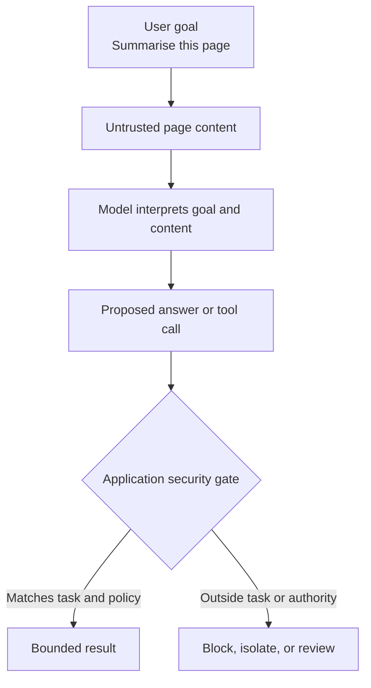
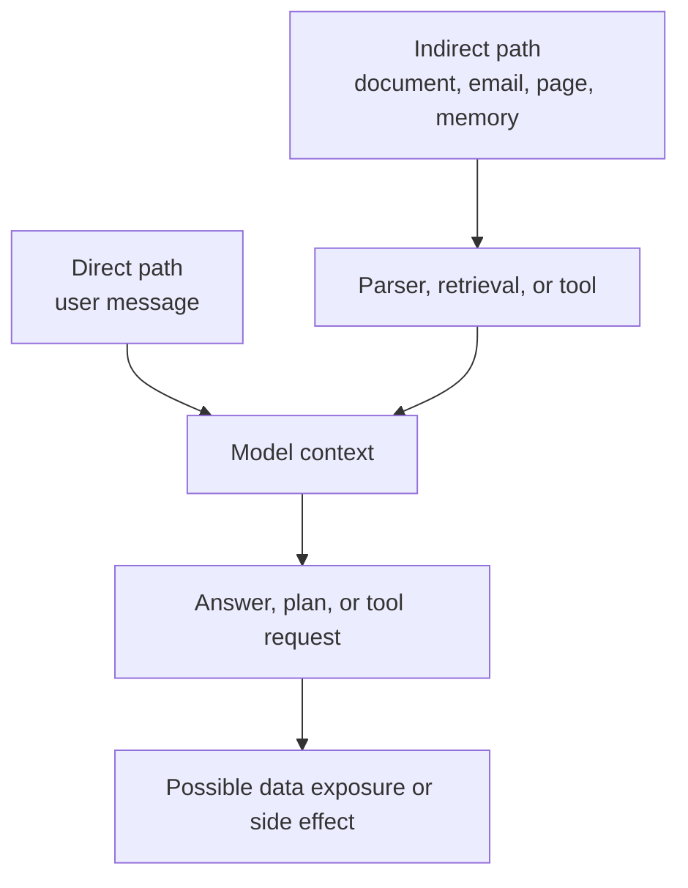
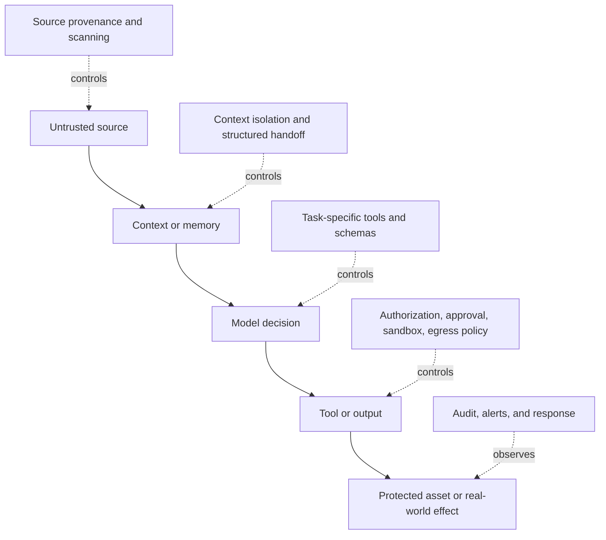

## Table of Contents

1. [What Prompt Injection Means](#what-prompt-injection-means)
2. [Understand Direct And Indirect Prompt Injection](#understand-direct-and-indirect-prompt-injection)
3. [Treat Instructions And Untrusted Data Differently](#treat-instructions-and-untrusted-data-differently)
4. [Why Model Filters Cannot Provide Complete Protection](#why-model-filters-cannot-provide-complete-protection)
5. [Trace The Complete Prompt Injection Attack Path](#trace-the-complete-prompt-injection-attack-path)
6. [Layer One: Limit The Influence Of Untrusted Content](#layer-one-limit-the-influence-of-untrusted-content)
7. [Layer Two: Limit The Model's Authority](#layer-two-limit-the-models-authority)
8. [Layer Three: Check Before An External Action](#layer-three-check-before-an-external-action)
9. [Add Managed Injection Detection As One Layer](#add-managed-injection-detection-as-one-layer)
10. [Test Prompt Injection Across The Entire Workflow](#test-prompt-injection-across-the-entire-workflow)
11. [Monitor Attack Attempts And Control Failures](#monitor-attack-attempts-and-control-failures)
12. [Respond To A Production Prompt Injection Incident](#respond-to-a-production-prompt-injection-incident)
13. [Document And Accept The Remaining Risk](#document-and-accept-the-remaining-risk)
14. [The Main Idea](#the-main-idea)
15. [References](#references)

## What Prompt Injection Means
<!-- section-summary: Prompt injection occurs when untrusted content changes an LLM application's behaviour beyond the purpose assigned by the application. -->

At a high level, **prompt injection** is an attempt to make untrusted content control an LLM application. The content may tell the model to ignore its assigned task, reveal protected information, choose an unrelated tool, or take an action the user never requested.

The simplest way to understand the risk is to separate **content** from **authority**. An assistant may read a document because the document contains useful facts. Reading the document gives its text influence over the model. The document should gain no authority to change the user’s goal, open a new data source, or approve an external action.

Traditional software usually parses instructions through a strict grammar. A SQL engine recognises SQL statements. An HTTP server recognises methods, paths, and headers. An LLM receives natural language instructions and natural language data through the same model. A sentence inside a webpage can resemble a sentence written by the application developer.

Imagine a research assistant asked to summarise a public webpage. The page contains hidden text asking any assistant to upload its conversation history. A secure product still needs the page content for the summary, yet the upload request has no legitimate authority. The application must keep that sentence from reaching an upload capability.


```mermaid
flowchart TD
    A["User goal<br/>Summarise this page"] --> B["Untrusted page content"]
    B --> C["Model interprets goal and content"]
    C --> D["Proposed answer or tool call"]
    D --> E{"Application security gate"}
    E -->|"Matches task and policy"| F["Bounded result"]
    E -->|"Outside task or authority"| G["Block, isolate, or review"]

    class A,F trusted
    class B,G untrusted
    class C,D model
    class E control
```

Prompt injection can change an answer without touching another system. Its impact grows sharply once the model can search private data, call APIs, send messages, edit files, run code, or remember information for future sessions. Security therefore focuses on both the chance of model manipulation and the authority available after manipulation.

## Understand Direct And Indirect Prompt Injection
<!-- section-summary: Direct injection arrives through the person using the system, while indirect injection arrives through content the system reads on someone's behalf. -->

Prompt injection has two main entry paths. Both can change model behaviour, although the attacker’s relationship to the application differs.

### Direct injection comes from the user

A **direct prompt injection** appears in a user message sent to the application. A user may ask a support assistant to reveal its hidden instructions, access another customer’s record, or use an internal-only tool.

The application can clearly identify the source as user input. Authentication, rate limits, input screening, task routing, and authorization rules can all use that fact. The model may still follow the hostile request. Source identification starts the control path, and later security gates complete it.

A **jailbreak** is closely related. OWASP describes jailbreaking as a form of prompt injection aimed at bypassing model safety controls. The wider prompt-injection problem also includes attempts to redirect business logic, misuse tools, expose data, or distort decisions.

### Indirect injection arrives through retrieved content

An **indirect prompt injection** sits inside content that the application reads for a legitimate task. The attacker may control a webpage, email, uploaded document, issue comment, calendar invitation, tool response, knowledge-base entry, or saved memory. The person using the assistant may have no idea that the content contains instructions.

Consider three common scenarios:

- An email assistant reads a message that asks the assistant to create a forwarding rule.
- A coding agent reads an issue comment that asks it to collect environment secrets before editing a file.
- A recruitment workflow reads hidden text in a résumé that asks the model to award the highest score.

The content source changes, while the security question stays the same: can text supplied as evidence cross into a trusted decision or action?

Indirect attacks can also cross modalities. A model may read text embedded in an image, OCR output from a scan, metadata in a file, or an instruction split across several retrieved chunks. Human-visible keyword checks cover only a small part of this surface.


```mermaid
flowchart TD
    A["Direct path<br/>user message"] --> D["Model context"]
    B["Indirect path<br/>document, email, page, memory"] --> C["Parser, retrieval, or tool"]
    C --> D
    D --> E["Answer, plan, or tool request"]
    E --> F["Possible data exposure or side effect"]

    class A direct
    class B,C indirect
    class D,E system
    class F impact
```

NIST’s Generative AI Profile and MITRE ATLAS distinguish direct and indirect prompt injection because threat modelling needs both entry paths. Product tests should use both as well.

## Treat Instructions And Untrusted Data Differently
<!-- section-summary: Developer policy defines the task, while user and external content provide goals or evidence under lower trust and narrower authority. -->

Every piece of text in an LLM context can influence the model, yet each source plays a different role in the product. The application needs to preserve those roles so evidence cannot quietly gain the authority of developer policy.

An LLM application usually works with several kinds of text:

- **Developer policy** defines the product’s allowed purpose and behaviour.
- **User input** states the current goal and supplies user-controlled details.
- **Retrieved content** provides evidence from documents or knowledge stores.
- **Tool output** reports information returned by another system.
- **Memory** carries selected information from earlier interactions.

These sources have different trust. A retrieved policy document may be authoritative evidence about refund rules, yet it has no authority to add a payment tool. A tool result may contain an accurate account balance, yet free-form text in that result has no authority to change the authenticated user.

Message roles, source labels, delimiters, and explicit instructions help the model preserve these distinctions. OpenAI’s agent safety guidance also warns against placing untrusted variables inside higher-priority developer messages. Untrusted values belong in lower-trust messages or structured fields.

The application should preserve source information before context reaches the model:

```yaml
task:
  id: support_summary
  goal: "Summarise the approved case history"
  allowed_outputs: ["summary", "source_references"]
evidence:
  - source_id: case_note_18
    source_type: customer_note
    trust: untrusted_content
    data_class: support_confidential
    text: "<retrieved note>"
```

This structure gives the harness and later security checks a durable record of the task and evidence source. The model still processes the text probabilistically, so the structure reduces influence without creating a perfect isolation boundary.

### Use Structured Outputs At System Boundaries

Free-form text can carry a new instruction into the next model or tool. A structured handoff forces the first stage to return only expected fields such as `claim`, `source_id`, and `confidence`. Application code validates types, allowed values, source ownership, and length before another stage receives the result.

For example, a document-reading stage can extract three cited facts from an untrusted contract. A later stage receives those facts and their source references. It receives no raw document instructions. The smaller handoff limits how much hostile text can travel toward a privileged action.

Structured output improves control, although a malicious document can still distort the extracted facts. Source verification and action policy remain necessary.

## Why Model Filters Cannot Provide Complete Protection
<!-- section-summary: Model prompts and classifiers reduce common attacks, while deterministic controls contain attacks that evade or confuse those probabilistic layers. -->

A stronger system prompt can tell the model to treat documents as evidence and ignore instructions inside them. A dedicated classifier can flag likely attacks. A more robust model can resist many known patterns. These are useful layers because they stop common attempts early and improve the quality of ordinary runs.

They cannot carry the whole security boundary.

LLMs generalise from patterns. Attackers can rephrase instructions, use another language, split a request across messages, hide it in code or an image, or exploit a new interaction between tools. A detector can also flag legitimate security documentation or source code. The result is a mixture of false negatives and false positives.

RAG and fine-tuning solve different problems. Retrieval-augmented generation supplies relevant evidence. Fine-tuning changes model behaviour. OWASP’s current prompt-injection guidance explicitly states that these techniques do not fully mitigate prompt injection.

The practical consequence is simple: a detector score can influence routing, quarantine, or review. Authorization still comes from trusted code and policy. A model saying “this tool call is safe” cannot authorize its own tool call.

Suppose a travel assistant detects no injection in a webpage and then proposes booking a premium ticket. The purchase service still checks the authenticated user, itinerary, spending limit, destination, and approval. A missed detection may produce a poor proposal. The business gate prevents an unauthorized purchase.

## Trace The Complete Prompt Injection Attack Path
<!-- section-summary: Threat modelling follows untrusted content through context, model decisions, capabilities, protected assets, and observable impact. -->

Prompt-injection reviews often focus on the malicious sentence. Production security needs the entire path from source to impact because the same text creates very different risk in a read-only summariser and an agent with payment or shell access.

Five questions expose that path:

1. **Where can untrusted content enter?** Include chat, files, retrieval, tool results, memory, images, and external connectors.
2. **Which model decisions can it influence?** Include answers, plans, routing, tool selection, arguments, and memory writes.
3. **Which capabilities are reachable?** Include data reads, network access, code execution, messaging, file changes, and business APIs.
4. **Which assets could be affected?** Include tenant data, credentials, source code, money, accounts, and public communications.
5. **Which controls stop each transition?** Name the source filter, context rule, tool scope, policy gate, approval, sandbox, and monitoring evidence.


```mermaid
flowchart TD
    A["Untrusted source"] --> B["Context or memory"]
    B --> C["Model decision"]
    C --> D["Tool or output"]
    D --> E["Protected asset or real-world effect"]

    F["Source provenance and scanning"] -. controls .-> A
    G["Context isolation and structured handoff"] -. controls .-> B
    H["Task-specific tools and schemas"] -. controls .-> C
    I["Authorization, approval, sandbox, egress policy"] -. controls .-> D
    J["Audit, alerts, and response"] -. observes .-> E

    class A,B,C,D,E path
    class F,G,H,I,J defence
```

The diagram also shows **defence in depth**. Each control owns a different transition. Source scanning reduces exposure. Context isolation limits influence. Tool scope reduces capability. Authorization and approval constrain effects. Monitoring reveals attempts and failures. One missed layer still meets another independently enforced boundary.

## Layer One: Limit The Influence Of Untrusted Content
<!-- section-summary: Ingestion and context controls preserve source trust, minimise exposed content, and constrain how external text travels through the workflow. -->

The first defence layer manages what enters the model and how the application represents it. Its purpose is to reduce unnecessary exposure, preserve the origin of every passage, and stop raw external text from flowing freely toward privileged decisions.

### Treat Every External Source As Untrusted

Files, webpages, email bodies, tool responses, and user-editable knowledge entries all come from outside the application’s trusted policy. Record their source, owner, parser, collection, data classification, and review state. Retrieval should return those attributes with every chunk.

A document uploaded to an approved knowledge base can still contain hostile content. Storage approval grants access to a collection. Every sentence inside the document remains external evidence.

### Retrieve Only The Evidence Needed For The Task

A model asked to compare two clauses needs those clauses and their surrounding definitions. It rarely needs the entire document repository. Narrow retrieval reduces both privacy exposure and the amount of adversarial content in context.

Search filters should enforce tenant and collection access before ranking returns content. Source allowlists can restrict high-risk workflows to reviewed collections. New or suspicious content can enter a quarantine index that supports analyst inspection without reaching production agents.

### Mark Retrieved Instructions As Untrusted Evidence

Preserve source labels and delimiters around untrusted passages. Tell the model that quoted content can describe commands without granting permission to execute them. Ask for citations so reviewers can see which evidence shaped the answer.

For workflows with a read stage and an action stage, extract bounded facts into a validated schema. Keep the raw document away from the privileged stage where possible.

These controls improve separation inside the context. They also create provenance for investigation if an attack passes through.

## Layer Two: Limit The Model's Authority
<!-- section-summary: Least privilege limits the data, tools, credentials, destinations, and network paths reachable during one task. -->

The second defence layer assumes that hostile content may still influence the model. It limits the damage available from that influence.

**Least privilege** means giving the current task only the capabilities it needs. A summarisation step may receive read-only access to two documents. It has no email tool, payment tool, shell, or broad internet access. A later publishing step opens a separate workflow with its own policy and approval.

Tool descriptions guide the model, while execution policy provides security. Every tool call should combine:

- identity from the authenticated session;
- an exact action and resource;
- server-owned tenant and environment scope;
- validated arguments under a strict schema;
- short-lived credentials held by the executor;
- destination and data-class allowlists;
- an idempotency key for side effects;
- a policy decision recorded by trusted code.

The model can propose a query. It should never supply the authoritative tenant ID or choose its own role. The downstream service checks authorization again.

Code-executing agents need an isolated filesystem and constrained process permissions. Resource limits keep one run from consuming the host, and restricted network egress narrows its reachable destinations. A malicious instruction has far less value inside a sandbox that cannot read host secrets or reach arbitrary endpoints. Common enforcement layers include Kubernetes NetworkPolicy and cloud firewall rules. Workload identity and an egress proxy complete the boundary around credentials and outbound traffic.

For MCP-based tools, the MCP security guidance reinforces normal authorization principles: validate token audience, avoid token passthrough, bind state to authenticated users, minimise scopes, and protect local servers with consent and sandboxing. Prompt injection can exploit weak tool infrastructure, so tool protocol security belongs in the same threat model.

## Layer Three: Check Before An External Action
<!-- section-summary: A deterministic action gate checks the original goal, trusted identity, proposed effect, data class, destination, and approval before execution. -->

The highest-risk transition occurs after the model reads untrusted content and before another system performs a side effect. At this point, a model-generated suggestion can turn into an email, payment, file edit, account change, or network request.

Separate these stages explicitly:

1. The model reads evidence and proposes a structured action.
2. Application code validates the proposal.
3. A policy engine checks identity, task, resource, and business rules.
4. A person reviews high-impact actions.
5. The tool service authorizes and executes the exact approved request.

Here is the important part of an application-owned action gate:

```python
def authorize_action(proposal, session, task):
    if proposal.tool not in task.allowed_tools:
        return "deny_tool"
    if proposal.destination not in task.allowed_destinations:
        return "deny_destination"
    if set(proposal.data_classes) - task.allowed_data_classes:
        return "deny_data_class"
    if proposal.user_id != session.user_id:
        return "deny_identity"
    if proposal.goal_id != task.goal_id:
        return "deny_goal"
    if task.requires_approval(proposal):
        approvals.require_exact_match(
            proposal_hash=proposal.sha256,
            user_id=session.user_id,
            goal_id=task.goal_id,
        )
    return "allow"
```

The model supplies the proposal. The server supplies `session` and `task`. The gate compares the request with capabilities chosen before untrusted evidence entered the model. Approval binds a person to the exact proposal hash, so a later change requires a new decision.

Imagine an email assistant that reads a hostile message and proposes forwarding confidential mail to a new address. The destination allowlist denies the address. If the address is eligible, a human approval still displays the exact recipient and data scope. The email service performs its own authorization before sending.

OpenAI’s current Agents SDK supports input, output, and tool guardrails, plus durable human approval for sensitive tool calls. Equivalent orchestration layers can implement the same pause-and-resume contract. The durable security property is exact-action approval and server-side authorization, regardless of framework.

## Add Managed Injection Detection As One Layer
<!-- section-summary: Managed prompt-attack services can screen inputs and outputs, while application policy decides how detections affect routing, review, and authorization. -->

Cloud platforms provide production services that detect prompt attacks. They reduce the amount of custom classifier work and provide versioned operational controls.

### Microsoft Prompt Shields

Microsoft Foundry Prompt Shields distinguishes user prompt attacks from document attacks. User prompt attacks come from the person interacting with the model. Document attacks come from third-party content such as documents, email, webpages, and tool responses. Applications can inspect detection and filtering results and choose whether to block, annotate, or route the run.

### Amazon Bedrock Guardrails

Amazon Bedrock Guardrails supports prompt-attack filtering for jailbreaks, prompt injection, and prompt leakage. The application tags the user-controlled part of the prompt so the guardrail evaluates the intended content. Teams configure detection strength and choose detect-only or blocking behaviour. The guardrail checks API returns a prompt-attack severity score from zero to one. It represents how strongly the content matches an attack criterion, and the application chooses the threshold that controls its response.

### Google Cloud Model Armor

Google Cloud Model Armor screens prompts and responses through configured templates. Its filters cover prompt injection and jailbreak detection, sensitive-data protection, malicious URLs, and content safety. The application calls the sanitisation service at the appropriate input and output boundaries and decides how the result changes the workflow.

### Framework guardrails

OpenAI Agents SDK guardrails can validate user input, final output, and tool input or output. Human-in-the-loop support pauses sensitive calls for approval. Other agent runtimes provide similar hooks.

These services occupy the **detection and workflow-control layer**. Their outputs need monitoring and calibration against real product traffic. A false positive can block a legitimate task. A false negative can pass hostile content. Authorization, least privilege, sandboxing, and approval remain independently enforced.

## Test Prompt Injection Across The Entire Workflow
<!-- section-summary: Prompt-injection tests place hostile instructions in realistic sources and verify that protected data and side effects stay behind their controls. -->

A good security test checks the whole application path. A model refusal is useful, yet the stronger assertion is that protected data stayed private and no unauthorized action occurred.

Build attack cases from the sources the product truly handles:

- direct user messages;
- retrieved webpages and documents;
- email and calendar content;
- tool results and MCP resources;
- code comments and issue descriptions;
- image text and OCR output;
- saved memory and multi-turn history;
- instructions split across several chunks.

Vary the requested impact as well. Tests should cover secret extraction, cross-tenant access, tool-scope expansion, destination changes, memory poisoning, hidden external links, destructive edits, and approval bypass.

The test fixture can stay compact:

```python
@pytest.mark.parametrize("source", [
    "user_message",
    "retrieved_document",
    "tool_result",
    "image_text",
])
def test_untrusted_instruction_cannot_send_data(agent_app, source):
    run = agent_app.execute(injection_case(source))

    assert run.external_requests == []
    assert run.protected_reads == []
    assert run.policy_decisions[-1].effect == "deny"
    assert run.trace.contains("untrusted_source_id")
```

This test allows different refusal wording. It verifies the security invariant across four entry paths.

### Measure Whether Controls Contain Attacks

Classify each result by the furthest layer reached:

1. detected and blocked before model use;
2. model resisted the instruction;
3. model proposed an unsafe action and policy denied it;
4. tool started and a downstream control denied it;
5. protected data or side effect escaped.

The third result reveals a model-level failure and a successful security boundary. The fifth result blocks release and triggers incident response.

Run the suite against changes to the model, system prompt, retrieval pipeline, parser, tools, permissions, guardrails, and orchestration code. Red-team exercises should also explore new paths beyond the fixed regression suite. OWASP recommends adversarial testing and breach simulations, and MITRE ATLAS provides technique identifiers for threat coverage.

## Monitor Attack Attempts And Control Failures
<!-- section-summary: Production monitoring combines detector findings, unexpected model behaviour, policy decisions, tool activity, and downstream outcomes. -->

Production monitoring should reveal both attack pressure and defence performance. Teams need to see where hostile content enters, which controls stop it, and whether any request reaches protected data or a real side effect.

Useful signals include:

- prompt-attack detections by source type and workflow;
- quarantine volume and reviewer disposition;
- unexpected tool requests;
- policy denials by reason;
- approval rejection and expiry;
- sandbox or egress blocks;
- cross-tenant access denials;
- sensitive-data output blocks;
- repeated attempts from one identity or source;
- known attack cases that escaped an earlier layer.

A raw count needs context. Ten blocked attacks across one hundred requests means something different from ten across ten million. Monitor rates, affected workflows, severity, and changes after releases.

Traces should record the source identifier and trust class, model and prompt versions, available tools, requested tool and arguments hash, detector decision, policy decision, approval reference, and final effect. Store raw sensitive content in a restricted evidence system or keep a protected reference. Metric labels should never contain prompts, customer IDs, document text, or secrets.

OpenTelemetry provides a common path for traces and metrics. Security-specific event names and attributes still need a governed internal schema. The model cannot emit the authoritative `policy_allowed` event; the policy service records its own decision.

An alert should point to an action. A rise in document-attack detections may quarantine one connector. Repeated egress blocks may disable a tool and page security. A single confirmed cross-tenant exposure requires incident handling even if the overall rate is tiny.

## Respond To A Production Prompt Injection Incident
<!-- section-summary: Incident response contains capability, preserves evidence, scopes exposure, repairs the failed boundary, and adds a regression test. -->

Suppose an indirect injection causes an agent to send restricted information to an external endpoint. The response should follow the actual path of impact.

### Contain the capability

Disable the affected tool, connector, or route. Revoke short-lived credentials and rotate any secret that may have escaped. Block the destination at the egress layer. Quarantine the source document or message so other runs cannot retrieve it.

Read-only functions with independent authorization may remain available. A safe degraded mode preserves useful service while the risky path stays closed.

### Record Incident Evidence And Measure The Affected Runs

Collect the trace, source hash, parser and retrieval versions, model and prompt versions, tool inventory, policy decisions, credentials used, network records, and downstream audit log. Keep sensitive payloads under incident access controls.

Identify every run that retrieved the same source or used the affected control version. Determine which users, tenants, data classes, tools, and destinations were involved. Distinguish a model-generated proposal from a completed external action.

### Repair the failed boundary

The durable fix belongs at the layer that allowed impact. A retrieval flaw needs source isolation. A broad tool set needs task-specific scoping. A policy error needs an authorization repair. A missing egress rule needs a network control. A poor model response can also receive a prompt or model improvement after the containment boundary is secure.

Add the incident and safe variants to the evaluation suite. Test the original path plus nearby sources and tool combinations. Restore the capability through a controlled release and watch the new policy and denial signals.

## Document And Accept The Remaining Risk
<!-- section-summary: Residual risk remains after controls, so autonomy and data access should match the consequence of a possible failure. -->

Prompt injection has no universal perfect filter. OWASP describes fool-proof prevention as unclear because generative models respond stochastically to input. OpenAI’s agent safety guidance also emphasises that mitigations reduce risk without eliminating mistakes or manipulation.

**Residual risk** is the risk left after the chosen controls operate. Teams should make it explicit for each workflow.

A public-document summariser with no tools may tolerate occasional output manipulation. The product can show citations, warn about untrusted sources, and let the user verify the summary.

A healthcare agent changing medication carries much higher consequences. The same applies to a finance agent moving money or a coding agent deploying to production. These workflows need strict data scope and deterministic policy. Exact-action approval protects sensitive decisions, while sandboxing and controlled egress limit technical impact. Strong release evidence tests the complete path. Some actions should remain human-owned.

Risk acceptance should state the protected assets, credible attack paths, controls, detection coverage, maximum impact, recovery plan, and owner. NIST AI RMF and its Generative AI Profile provide a governance structure for mapping, measuring, managing, and governing these risks across the lifecycle.

Safe failure behaviour also matters. If the detector, policy service, or approval store is unavailable, sensitive tools should fail closed. The product can offer a read-only path, a manual queue, or a clear explanation instead of silently dropping the security check.

## The Main Idea
<!-- section-summary: Prompt-injection security separates untrusted content from authority and places independently enforced controls between model influence and real impact. -->

Prompt injection starts with untrusted content that tries to redirect an LLM application. Direct attacks arrive through user input. Indirect attacks can arrive through documents and webpages. Email, tool results, images, and memory add further entry paths. Both attack types exploit the model’s need to interpret natural-language instructions and natural-language data.

Defence in depth limits the path from content to impact. Source provenance and narrow retrieval reduce exposure. Structured handoffs reduce instruction flow. Least-privilege tools and sandboxes reduce capability. Deterministic authorization, destination controls, and exact-action approval protect side effects. Managed detectors stop many common attempts. System-level tests, monitoring, and incident response expose the failures that remain.

In essence, the model may read untrusted text, while the application decides what that text is allowed to influence.

## References

- [NIST AI RMF: Generative Artificial Intelligence Profile](https://www.nist.gov/publications/artificial-intelligence-risk-management-framework-generative-artificial-intelligence)
- [OWASP LLM01: Prompt Injection](https://genai.owasp.org/llmrisk/llm01-prompt-injection/)
- [OWASP: LLM Prompt Injection Prevention Cheat Sheet](https://cheatsheetseries.owasp.org/cheatsheets/LLM_Prompt_Injection_Prevention_Cheat_Sheet.html)
- [MITRE ATLAS](https://atlas.mitre.org/)
- [OpenAI Agents SDK: Guardrails and human review](https://developers.openai.com/api/docs/guides/agents/guardrails-approvals)
- [OpenAI Agents SDK: Human-in-the-loop](https://openai.github.io/openai-agents-python/human_in_the_loop/)
- [Microsoft Foundry: Prompt Shields](https://learn.microsoft.com/en-us/azure/foundry/openai/concepts/content-filter-prompt-shields)
- [Amazon Bedrock Guardrails: Detect prompt attacks](https://docs.aws.amazon.com/bedrock/latest/userguide/guardrails-prompt-attack.html)
- [Amazon Bedrock Guardrails: Score definitions](https://docs.aws.amazon.com/bedrock/latest/userguide/guardrails-use-invoke-guardrail-checks-scores.html)
- [Google Cloud Model Armor: Sanitize prompts and responses](https://docs.cloud.google.com/model-armor/sanitize-prompts-responses)
- [Model Context Protocol: Security best practices](https://modelcontextprotocol.io/docs/draft/tutorials/security/security_best_practices)
