## An Agent Uses Someone’s Authority

<!-- section-summary: A production agent must act with the authenticated user's authority and the application's task and policy limits. -->

An LLM application needs normal authorization as soon as it can read or change business data. The model may decide which tool would help, but it should never expand the authority of the person using the product.

Imagine **TenantDesk**, a support agent for a business-to-business software company. Customers use it to explain errors, search their own support history, and prepare billing requests. Internal support engineers can inspect more detailed logs, while finance staff can approve account credits. The company serves many tenants, so a user from one customer must never see another customer’s records.

A user named Maya asks, “Why did our checkout service fail this morning?” TenantDesk needs application logs, but the question alone does not prove which tenant Maya belongs to or whether she may read logs. Those facts come from the authenticated session. The agent can help interpret the request; trusted code establishes the authority behind it.

```mermaid
flowchart LR
    A[Authenticated user and workload] --> B[Task and purpose scope]
    B --> C[Context and tool eligibility]
    C --> D[Model proposes read or action]
    D --> E[Policy decision: principal, action, resource, context]
    E --> F[Short-lived scoped credential]
    F --> G[Domain service authorization]
    G --> H[Filtered result or controlled effect]
    H --> I[Audit, trace, and retention policy]
```



Authority stays outside model-visible arguments at every transition. The model can choose a useful operation, while trusted identity, tenant scope, domain authorization, credentials, and audit follow application policy.

## Authorization Follows the Request Into the Tool

<!-- section-summary: Every tool decision joins a trusted principal, requested action, exact resource, and runtime conditions. -->

When TenantDesk considers a log query, the application evaluates four things. The **principal** is Maya together with the support-agent workload identity. The **action** is `logs:read`. The **resource** is the checkout service for Maya’s tenant. The **context** includes the production environment, support-case ID, read-only purpose, and current time.

The model can suggest “read checkout logs for the last 30 minutes.” It does not supply the authoritative tenant ID or user role. The server attaches those values from the authenticated session before the tool runs.

```python
from dataclasses import dataclass


@dataclass(frozen=True)
class ToolContext:
    user_id: str
    tenant_id: str
    role: str
    case_id: str
    purpose: str
    environment: str


def fetch_service_logs(ctx: ToolContext, service: str, minutes: int):
    if ctx.role not in {"tenant_admin", "support_engineer"}:
        raise PermissionError("role_cannot_read_logs")
    if ctx.purpose != "support_case_investigation":
        raise PermissionError("purpose_cannot_read_logs")
    if ctx.environment != "production":
        raise PermissionError("environment_mismatch")
    case = case_registry.require_active_assignment(ctx.case_id, ctx.user_id, ctx.tenant_id)
    resource = service_catalog.require_exact(
        tenant_id=ctx.tenant_id,
        environment=ctx.environment,
        service=service,
    )
    if resource.service_id not in case.allowed_service_ids:
        raise PermissionError("service_outside_case")

    return log_store.query(
        tenant_id=ctx.tenant_id,
        service_id=resource.service_id,
        environment=ctx.environment,
        case_id=ctx.case_id,
        purpose=ctx.purpose,
        since_minutes=min(minutes, 60),
    )
```

This function receives the tenant from `ToolContext`, which the application created after authentication. The model never gets an argument such as `tenant_id="another-company"` that the tool blindly trusts. The same rule should continue into the log store, where row-level or index-level controls filter the actual query.

TenantDesk also checks purpose and environment. A customer-facing support task may read sanitized application logs, while a security investigation tool may expose more detail to a smaller internal role. Production and staging use separate identities and data paths so a broad development permission cannot leak into live support.

## Authorization as a Testable Policy Decision

<!-- section-summary: A policy engine receives trusted identity and resource facts, returns an allow or deny decision, and gives teams a versioned rule set they can test independently from model behavior. -->

The Python tool wrapper demonstrates where authorization runs. Larger platforms often move shared rules into a policy engine such as Open Policy Agent (OPA), whose Rego language evaluates structured input. The model never writes the policy input directly. TenantDesk's gateway builds it from the authenticated session, route, resource catalog, and bounded model request.

```rego
package tenantdesk.logs

import rego.v1

default allow := false

allowed_role contains "tenant_admin"
allowed_role contains "support_engineer"

allow if {
    input.principal.role in allowed_role
    input.action == "logs:read"
    input.resource.tenant_id == input.principal.tenant_id
    input.resource.environment == "production"
    input.resource.service_id == input.context.case.allowed_service_id
    input.context.case.status == "active"
    input.context.case.assigned_user_id == input.principal.user_id
    input.context.purpose == "support_case_investigation"
    input.context.minutes >= 1
    input.context.minutes <= 60
}
```

`default allow := false` makes an incomplete input deny access. `allowed_role` contains only the roles that may use this path. The tenant, environment, exact catalog service ID, active case assignment, purpose, and time window must all match. The gateway resolves the service name into that catalog record and loads the case fields; the model supplies neither object. A broad permission for “logs” therefore cannot drift across a different service or unrelated case.

The service evaluates this document before it exchanges its workload identity for log-platform credentials. A denial returns a safe tool error with policy version and reason code. A policy timeout also denies the production read. Teams can choose a different availability tradeoff for low-risk public resources, but that choice belongs in an explicit resource policy rather than exception handling inside the agent.

OPA tests prove the boundary without running a model:

```rego
package tenantdesk.logs_test

import rego.v1
import data.tenantdesk.logs

test_same_tenant_admin_is_allowed if {
    logs.allow with input as {
        "principal": {"user_id": "usr_maya", "role": "tenant_admin", "tenant_id": "tenant_acme"},
        "action": "logs:read",
        "resource": {"tenant_id": "tenant_acme", "environment": "production", "service_id": "svc_checkout_prod"},
        "context": {"purpose": "support_case_investigation", "case": {"status": "active", "assigned_user_id": "usr_maya", "allowed_service_id": "svc_checkout_prod"}, "minutes": 30}
    }
}

test_cross_tenant_read_is_denied if {
    not logs.allow with input as {
        "principal": {"user_id": "usr_maya", "role": "tenant_admin", "tenant_id": "tenant_acme"},
        "action": "logs:read",
        "resource": {"tenant_id": "tenant_other", "environment": "production", "service_id": "svc_checkout_prod"},
        "context": {"purpose": "support_case_investigation", "case": {"status": "active", "assigned_user_id": "usr_maya", "allowed_service_id": "svc_checkout_prod"}, "minutes": 30}
    }
}
```

Run `opa test . -v --fail-on-empty` in CI. The first test proves the intended path. The second changes only the resource tenant and proves fail-closed isolation. Add tests for missing case ID, a 61-minute window, customer role, expired principal, and staging resource. The `--fail-on-empty` flag catches a misnamed test suite that would otherwise report success without evaluating rules.

Policy evaluation is one layer. The log store still enforces tenant filters, and the short-lived credential still has read-only scope. During an incident, compare gateway input, OPA decision, credential claims, and warehouse audit row. Agreement across those records shows which boundary allowed the request; disagreement identifies the broken propagation step.

## Tool Scope Changes With the Task

<!-- section-summary: The harness offers only the capabilities needed for the current task and opens a separate controlled path for higher-impact actions. -->

Maya’s first request needs read-only investigation. TenantDesk receives tools for searching approved support documents, reading sanitized logs for Maya’s tenant, and opening her existing cases. It does not receive account-credit, plan-change, or incident-closure tools.

After reading the logs, the agent explains that a provider timeout caused failed payments. Maya then asks for a service credit. This request enters a new workflow. The model can gather the incident ID, affected period, account plan, and credit policy. It can prepare a proposal, while finance policy decides whether a credit is allowed and who must approve it.

Changing the task creates a new permission boundary. A read-only investigation should not carry latent write capabilities “just in case.” Narrow tool sets reduce accidental calls, simplify model choice, and shrink the impact of prompt injection.

The server still validates every action even when the model had permission to see the tool description. Tool availability helps guide the model. Authorization at execution time creates the real security decision.

## Credentials Should Expire With the Work

<!-- section-summary: Short-lived workload credentials give tools the smallest practical permission for the current environment and action. -->

TenantDesk needs a machine identity when its log tool calls the observability platform. A long-lived administrator token would let any compromised run query every tenant and change configuration. The platform instead issues a short-lived credential for the log-reading service and the permitted tenant scope.

The credential expires after a few minutes and cannot perform writes. A different tool that prepares a billing request uses a separate identity. Submitting the request after approval uses another narrowly scoped action. This separation makes audit records clearer and limits the value of a stolen token.

On cloud platforms, workload identity is usually safer than static access keys stored in environment variables. Kubernetes workloads can exchange their service identity for cloud credentials. CI systems can use OpenID Connect, usually shortened to OIDC, to receive temporary deployment access. The exact provider mechanism differs, while the principle stays the same: the credential should match the workload, environment, resource, and duration.

The model does not need to see these credentials. A tool executor holds them and returns only the fields needed for the next model decision.

## Retrieval Must Enforce the Same Boundary

<!-- section-summary: Search filters and source permissions must run before retrieved chunks enter model context. -->

TenantDesk searches support tickets and internal documentation to explain incidents. Retrieval can leak data before the model writes its final answer, so the search layer needs authorization too.

Maya’s query carries her tenant ID and user role into the retrieval service. The service filters candidate documents before vector or keyword ranking returns them. A chunk from another customer never enters the model context, even if its text is highly similar to Maya’s error.

The source document keeps ownership, tenant, data classification, and retention metadata. If a user loses access to a case, the retrieval index must reflect that change. Filtering only after the model generates an answer is too late because the model has already received the content.

Internal support engineers may have cross-tenant access for an active incident, but that authority should come through a named role and case assignment. The trace should explain why the broader search was permitted.

## Memory Needs a Write Policy

<!-- section-summary: Durable memory stores selected, correctable information with a clear purpose, scope, lifetime, and authorisation rule. -->

At the end of the conversation, TenantDesk may want to remember that Maya prefers incident updates by email. That preference could improve future support, but the application should decide whether it is appropriate to store and reuse.

Memory is another data write. TenantDesk needs a purpose, an owner, a tenant and user scope, a retention period, and a correction path. It should save a confirmed preference rather than an uncertain inference such as “Maya is always unhappy with the checkout service.” Sensitive log excerpts, payment details, and raw prompts should not turn into long-term memory by default.

When a later conversation starts, the harness selects only relevant and permitted memories for context. Deleting or correcting a preference should remove it from future use. Tenant boundaries apply to memory just as they apply to source records and retrieval.

This separation also keeps run state from quietly becoming personal history. A tool result can remain in the current support case without being copied into every future conversation.

## High-Impact Actions Need a Durable Pause

<!-- section-summary: Approval binds an authorised person to one exact proposed action and expires when the action changes. -->

TenantDesk calculates that Maya’s incident qualifies for a £200 service credit. The model prepares the request, but finance policy requires approval above £100. The run saves the proposal and pauses.

The approver sees the tenant, incident, amount, policy reason, evidence, and proposed account change. Their decision is tied to this exact request. If the model changes the amount or destination account, the previous approval no longer applies.

After approval, the billing service checks authorization again and executes the change with an idempotency key. Approval does not replace service-level authorization. It adds a human decision to the existing identity and policy checks.

This durable pause survives worker restarts and creates a clean audit trail. A generic “allow” button without the action details would force the person to approve a hidden state they cannot evaluate.

## Traces Need Privacy Boundaries Too

<!-- section-summary: Audit and debugging records preserve identity, decisions, versions, and outcomes while limiting raw sensitive content and retention. -->

TenantDesk records the run ID, authenticated principal, tenant, tool names, policy decisions, approval, model and prompt versions, and final outcome. That evidence helps operators investigate a leak or explain why an account change occurred.

The trace should not copy every log line, ticket body, or payment field into a broadly accessible telemetry backend. Sensitive payloads can remain in a governed store and appear in the trace through protected references or approved summaries. Access and retention for traces should match the risk of the data they contain.

Audit evidence also needs integrity. The model should not write its own authoritative statement that “authorization passed.” The policy component and tool executor emit those events from the actual decision path.

## Test the Boundaries as a System

<!-- section-summary: Security tests try cross-tenant reads, role changes, prompt injection, stale sessions, memory leaks, and altered approvals through the complete application path. -->

TenantDesk’s test suite creates users from two tenants and attempts to cross the boundary through chat text, tool arguments, retrieval queries, memory, and direct API calls. It tests a customer role against internal log tools, an expired session against an active run, and a changed credit amount against an old approval.

The team also places prompt-injection instructions inside a support ticket and checks that the agent cannot expand its tool scope or query another tenant. These tests matter because each individual service may look secure while the composition passes the wrong identity or fails to recheck a decision.

When a test fails, the team fixes the authoritative layer. A retrieval leak needs a search filter or source-permission repair. A write performed with an expired approval needs an execution-gate repair. Prompt wording may improve behaviour, but it should not carry the security boundary.

## Following Maya’s Authority Through the Run

<!-- section-summary: The complete design carries trusted identity and tenant scope through context, retrieval, tools, memory, approval, and evidence. -->

Maya’s support request now has one continuous authority story. Authentication identifies her and her tenant. The harness offers tools that fit the current task. Each tool receives trusted runtime context and uses a short-lived workload identity. Retrieval filters sources before the model sees them. Memory stores only approved, correctable facts. A high-value credit pauses for a person and still passes service authorization at execution time. The trace records the decisions without spreading raw sensitive data.

That is how permissions fit into an agent system. The model helps interpret goals and propose actions. The application carries identity, policy, and data boundaries through every component that can read, remember, or change something.

## References

- [NIST: Zero Trust Architecture](https://csrc.nist.gov/pubs/sp/800/207/final)
- [OWASP: Authorization Cheat Sheet](https://cheatsheetseries.owasp.org/cheatsheets/Authorization_Cheat_Sheet.html)
- [OpenAI: Safety in building agents](https://developers.openai.com/api/docs/guides/agent-builder-safety)
- [OpenAI Agents SDK: Human-in-the-loop](https://openai.github.io/openai-agents-python/human_in_the_loop/)
- [Kubernetes: Service Accounts](https://kubernetes.io/docs/concepts/security/service-accounts/)
- [OpenID Connect Core](https://openid.net/specs/openid-connect-core-1_0.html)
- [Open Policy Agent policy language](https://www.openpolicyagent.org/docs/policy-language)
- [Open Policy Agent policy testing](https://www.openpolicyagent.org/docs/policy-testing)
