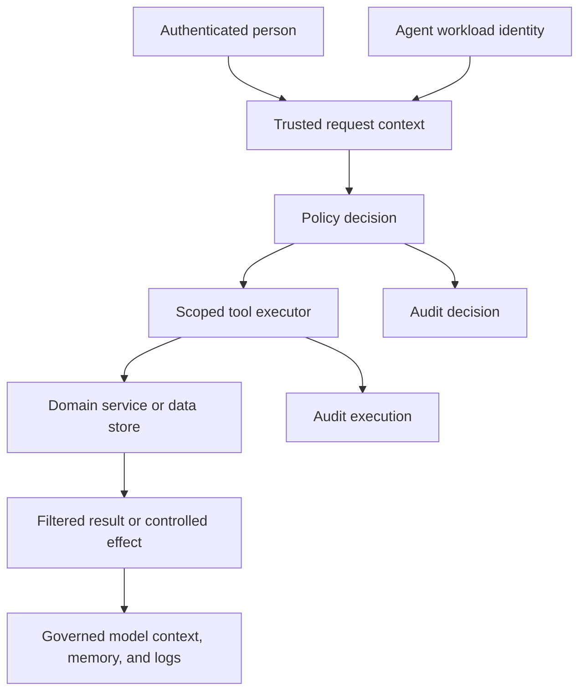
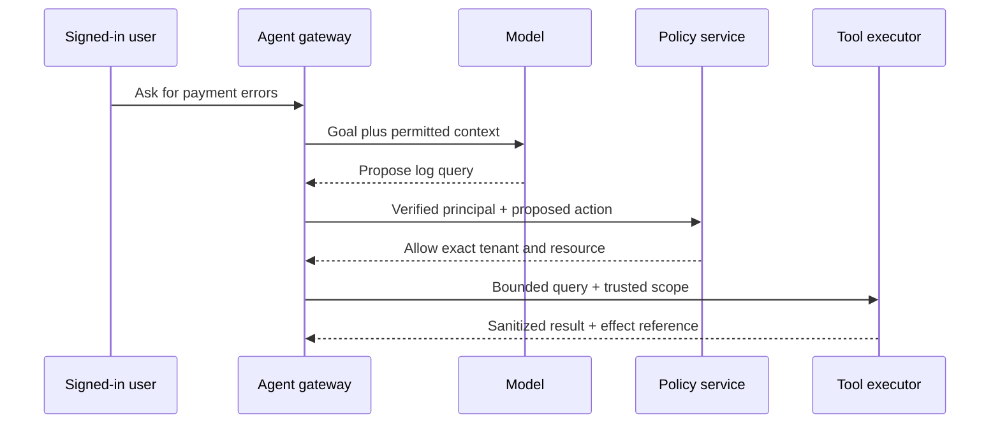
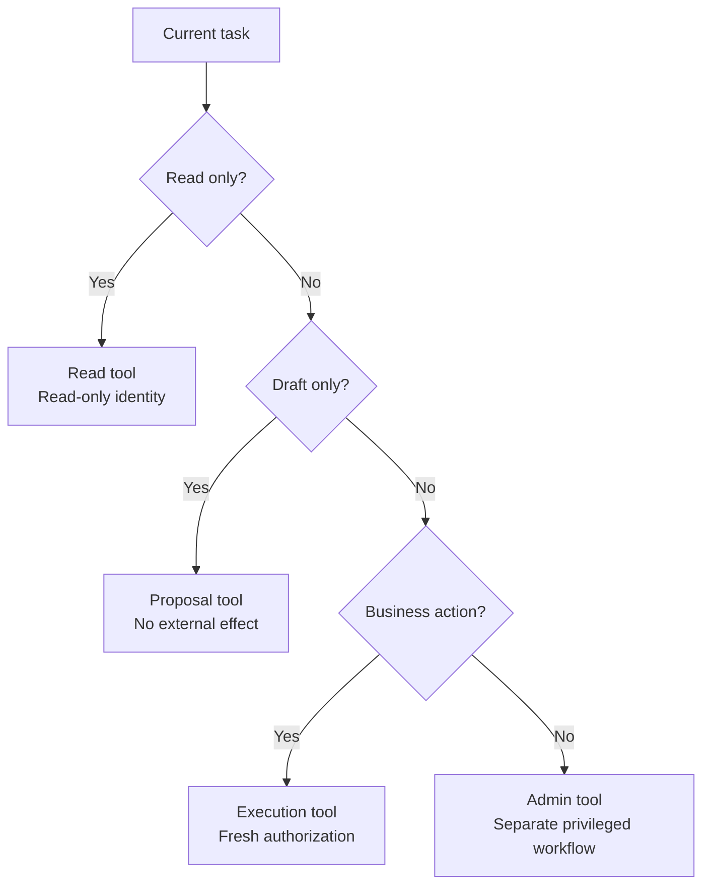
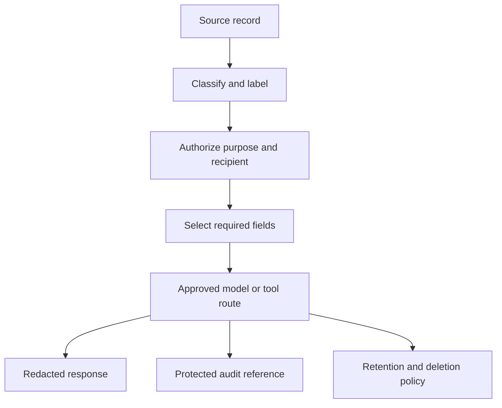
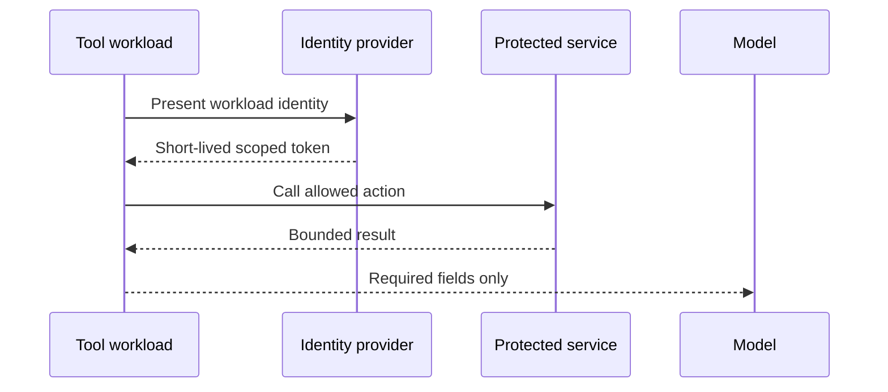
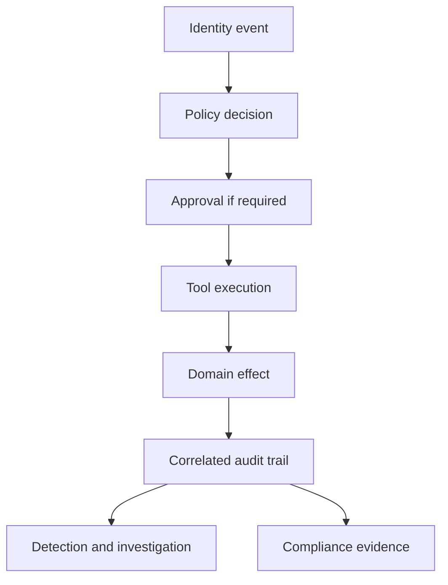

## Table of Contents

1. [Permissions and Data Start With Three Questions](#permissions-and-data-start-with-three-questions)
2. [Principals Carry Authority Through the Run](#principals-carry-authority-through-the-run)
3. [Authorization Evaluates Principal, Action, Resource, and Context](#authorization-evaluates-principal-action-resource-and-context)
4. [Tool Exposure and Tool Execution Are Separate Boundaries](#tool-exposure-and-tool-execution-are-separate-boundaries)
5. [Tenant Isolation Must Continue Through Every Data Layer](#tenant-isolation-must-continue-through-every-data-layer)
6. [Classify Data Before Giving It to the Agent](#classify-data-before-giving-it-to-the-agent)
7. [Secrets and Credentials Belong to the Tool Executor](#secrets-and-credentials-belong-to-the-tool-executor)
8. [Purpose, Consent, Retention, and Deletion Govern Data Over Time](#purpose-consent-retention-and-deletion-govern-data-over-time)
9. [High-Impact Actions Need Approval for One Exact Proposal](#high-impact-actions-need-approval-for-one-exact-proposal)
10. [Audit Evidence Comes From the Components That Enforce the Rules](#audit-evidence-comes-from-the-components-that-enforce-the-rules)
11. [Common Failures Point to Specific Repairs](#common-failures-point-to-specific-repairs)
12. [Verification Exercises the Complete Boundary](#verification-exercises-the-complete-boundary)
13. [Incident Response Revokes Authority First](#incident-response-revokes-authority-first)
14. [Main Idea](#main-idea)
15. [References](#references)

## Permissions and Data Start With Three Questions

<!-- section-summary: Safe agent systems identify who is acting, which exact actions and resources are allowed, and which data may cross each boundary. -->

At a high level, permissions and data controls answer three questions before an agent reads a record or changes the outside world. **Who is acting? What exact action may that identity perform on this resource? Which information may flow into the model, tools, memory, and logs?** These questions turn a vague instruction such as “help with this account” into a decision that software can verify.

The distinction matters because an agent combines two very different abilities. The model interprets language and proposes useful steps. The surrounding application holds user sessions, database connections, cloud identities, and business APIs. A convincing prompt can influence the first ability. It must never grant the second one.

Several security terms describe parts of this framework:

- **Identity** describes a person or workload, such as a signed-in analyst or the service that executes a search.
- **Authentication** proves the claimed identity, commonly through a session, OAuth token, passkey, certificate, or cloud workload identity.
- **Authorization** decides whether that identity may perform an action on an exact resource under the current conditions.
- **Data governance** decides which information may be collected, processed, retained, shared, corrected, or deleted.

You can think of the model as a planner working inside a secured building. It can suggest which room contains the answer. The access-control system still checks the badge at every protected door, and the records team still controls what may leave the room.


```mermaid
flowchart TD
    A["Authenticated person"] --> C["Trusted request context"]
    B["Agent workload identity"] --> C
    C --> D["Policy decision"]
    D --> E["Scoped tool executor"]
    E --> F["Domain service or data store"]
    F --> G["Filtered result or controlled effect"]
    D --> H["Audit decision"]
    E --> I["Audit execution"]
    G --> J["Governed model context, memory, and logs"]
```

This layout creates defense in depth. The gateway establishes identity, the policy layer evaluates permission, the executor holds credentials, the domain service enforces its own rules, and the data layer filters records. One faulty prompt or missing check then faces another independent boundary.

## Principals Carry Authority Through the Run

<!-- section-summary: A principal is the verified person or workload whose authority travels with a request and remains separate from model-generated arguments. -->

A **principal** is the verified identity behind an action. Most agent runs involve at least two principals: the person requesting help and the workload executing tools. A user session might prove that a support engineer is signed in. A Kubernetes service account, AWS IAM role, Google service account, or Azure managed identity might prove which deployed service is calling a backend.

The application combines those identities into a trusted request context. That context can include the user ID, organization or tenant ID, workload ID, assigned role, active case, environment, and authentication strength. Model-generated text may describe a desired customer, project, or resource, yet the authoritative tenant and role must come from verified systems.

Consider a support request asking for recent payment errors. The model may extract `payment-api` and a thirty-minute time window from the message. The server adds the signed-in user, their tenant, the active support case, and the production workload identity. The log service receives both kinds of information and treats them differently: model arguments describe the requested query, while trusted context limits where that query may run.

This separation prevents a **confused deputy** problem. A confused deputy is a privileged service that can reach protected data and gets tricked into using that privilege for the wrong caller. For example, a model could produce a tool argument containing another tenant’s ID. A safe executor discards that claimed tenant and derives the scope from the authenticated session. Google’s workload identity guidance also recommends audience checks and attribute conditions because a valid external token may still target the wrong service or tenant.


```mermaid
sequenceDiagram
    participant U as Signed-in user
    participant G as Agent gateway
    participant M as Model
    participant P as Policy service
    participant T as Tool executor

    U->>G: Ask for payment errors
    G->>M: Goal plus permitted context
    M-->>G: Propose log query
    G->>P: Verified principal + proposed action
    P-->>G: Allow exact tenant and resource
    G->>T: Bounded query + trusted scope
    T-->>G: Sanitized result + effect reference
```

Long-running runs need one more safeguard. Authorization can change while a worker is paused. A user may leave the organization, lose a role, or close the relevant case. Resumed work should verify the session and policy again before each protected action. A checkpoint preserves progress; it never freezes permission forever.

## Authorization Evaluates Principal, Action, Resource, and Context

<!-- section-summary: Production authorization evaluates a verified principal, one requested action, an exact resource, and relevant runtime conditions on every protected call. -->

Authorization is easiest to reason about as a four-part decision: **principal, action, resource, and context**. In plain language, the system asks, “May this identity do this specific thing to this specific object under these conditions?” A role such as `support_engineer` supplies only one part of the answer.

The action should be precise. `invoice:read`, `invoice:propose_refund`, and `invoice:execute_refund` carry very different risk. The resource should also be exact: tenant, account, environment, record, or object path. Context can add an active case assignment, approved purpose, network boundary, authentication strength, time window, or prior human approval.

**Least privilege** means granting the smallest useful set of actions and resources for the shortest practical duration. **Deny by default** means missing or malformed facts produce a denial. **Per-request authorization** means a previous successful call never grants a blanket permission to later calls.

Open Policy Agent (OPA) is one common way to keep shared rules in versioned, testable policy. The gateway builds the input from trusted identity and resource services. The model supplies only bounded request details.

```rego
package agent.logs

import rego.v1

default allow := false

allow if {
    input.principal.role in {"tenant_admin", "support_engineer"}
    input.action == "logs:read"
    input.resource.tenant_id == input.principal.tenant_id
    input.resource.environment == "production"
    input.context.case_status == "active"
    input.context.purpose == "support_investigation"
    input.context.window_minutes <= 60
}
```

Read the rule as a sentence. The caller needs an approved role and a read action. The resource tenant and production environment must match the verified request. An active support investigation limits the purpose and time range. If `case_status` is missing, the default decision denies the request.

OPA is one implementation choice. AWS IAM, Google Cloud IAM, Azure role and attribute controls, Cedar, cloud API gateways, and authorization services can play similar roles. The durable design principle is central policy with enforcement close to the protected operation. A model prompt saying “only access the current tenant” offers useful behavioral guidance, while the policy engine and domain service create the enforceable rule.

Teams should also return machine-readable denial reasons such as `tenant_mismatch`, `case_inactive`, or `approval_expired`. The user-facing response can remain simple. Operators and tests gain a precise explanation without exposing sensitive policy internals to the model.

## Tool Exposure and Tool Execution Are Separate Boundaries

<!-- section-summary: A task-specific tool set guides model behavior, while server-side authorization protects every tool call at execution time. -->

Agent platforms often decide which tools to describe to the model. This is a valuable control because a read-only support task rarely needs account-deletion or payment capabilities. Deployment and administrator tools belong in their own workflows. A smaller tool set reduces accidental choices, limits prompt-injection opportunities, and gives the model a clearer decision space.

Tool exposure, however, is a capability-shaping control. Execution authorization supplies the security decision. A hidden tool could still have a callable endpoint, a stale run could still remember its schema, or an attacker could call the API directly. The executor must authenticate and authorize every invocation.

A practical tool framework separates capabilities by effect. Read tools return governed information. Proposal tools create drafts with no external effect. Execution tools change business state. Administrative tools alter policy, identity, or infrastructure. Each group can use a different workload identity, approval requirement, timeout, rate limit, and audit policy.


```mermaid
flowchart TD
    A["Current task"] --> B{"Read only?"}
    B -->|Yes| C["Read tool<br/>Read-only identity"]
    B -->|No| D{"Draft only?"}
    D -->|Yes| E["Proposal tool<br/>No external effect"]
    D -->|No| F{"Business action?"}
    F -->|Yes| G["Execution tool<br/>Fresh authorization"]
    F -->|No| H["Admin tool<br/>Separate privileged workflow"]
```

Suppose an agent is helping investigate a failed order. It may receive `read_order`, `read_shipping_events`, and `draft_customer_reply`. A request to refund the order moves into a separate workflow that exposes `propose_refund`. The actual `execute_refund` path can require fresh authorization and approval. The investigation run never carries a dormant refund credential.

Tool wrappers should validate schemas, normalize identifiers, cap query ranges, enforce idempotency, and reject unknown fields. The domain service repeats the business authorization using the verified caller. Prompt injection inside a document can request a larger scope, yet it cannot add a tool, mint a credential, or override the service rule.

## Tenant Isolation Must Continue Through Every Data Layer

<!-- section-summary: Tenant isolation filters records at retrieval, storage, caching, memory, and service boundaries before protected content reaches the model. -->

A tenant is an organization or customer sharing the same application infrastructure with others. **Tenant isolation** keeps one tenant’s identities, records, indexes, caches, and operations separate from every other tenant. Filtering the final answer comes too late because the model may already have received another tenant’s content.

The boundary must travel through the complete data path. The API derives the tenant from the session. The search service applies document access rules before ranking. The vector or keyword index stores tenant and classification metadata. Cache keys include the tenant and relevant policy version. Memory records keep their owner and tenant. The database enforces row rules as another independent layer.

PostgreSQL Row-Level Security (RLS) can protect shared tables. A trusted transaction sets `app.tenant_id` from the authenticated request, and the policy restricts both reads and writes:

```sql
ALTER TABLE documents ENABLE ROW LEVEL SECURITY;
ALTER TABLE documents FORCE ROW LEVEL SECURITY;

CREATE POLICY tenant_documents ON documents
USING (tenant_id = current_setting('app.tenant_id')::uuid)
WITH CHECK (tenant_id = current_setting('app.tenant_id')::uuid);
```

`USING` filters rows that the current request may see. `WITH CHECK` prevents a write from creating or moving a row outside the active tenant. `FORCE ROW LEVEL SECURITY` also applies the policy to the table owner in ordinary access paths. PostgreSQL superusers and roles with `BYPASSRLS` still bypass row policies, so the application role should own neither the table nor that privilege.

Retrieval introduces additional traps. A shared vector index can work if every chunk carries authoritative tenant and access metadata and the retrieval engine applies pre-filtering. Some teams choose separate indexes for stronger isolation or regulatory boundaries. Either design still needs source permission updates, deletion propagation, and tests against direct index access.

A concrete cache failure shows why every layer matters. If a retrieval result is cached under `query_hash` alone, two tenants asking the same question can receive the same cached chunks. The repair includes `tenant_id`, user access group, data classification, and policy version in the key, followed by invalidation after permission changes. The cache should store protected references or sanitized results according to the same retention policy as the source.

## Classify Data Before Giving It to the Agent

<!-- section-summary: Data classification maps information sensitivity to allowed models, tools, destinations, logging fields, retention periods, and review requirements. -->

Data classification gives the platform a vocabulary for deciding how information may flow. Many organizations use levels such as public, internal, confidential, and restricted. The names can vary. The important part is a documented rule that connects each class to approved processing locations, identities, models, tools, logs, retention, and human access.

An agent run creates more data surfaces than a conventional API request. The initial prompt, retrieved documents, tool arguments, tool results, model response, trace, evaluation dataset, feedback record, and durable memory may each contain sensitive information. Classification should follow the data across those copies.

For example, a public product manual may enter any approved support model and appear in ordinary traces. A confidential contract may enter only a tenant-approved model endpoint. Its route can disable payload logging and use short trace retention. A restricted health or payment record may require field-level minimization in a dedicated processing environment. Strong approval and protected audit references can add further controls. The classification policy decides the route before the content enters model context.

**Data minimization** means sending only the fields needed for the current purpose. A tool answering “Has the refund cleared?” can return status, amount, currency, and timestamp. It usually has no reason to return a full card token, postal address, internal fraud notes, or the complete payment object.


```mermaid
flowchart TD
    A["Source record"] --> B["Classify and label"]
    B --> C["Authorize purpose and recipient"]
    C --> D["Select required fields"]
    D --> E["Approved model or tool route"]
    E --> F["Redacted response"]
    E --> G["Protected audit reference"]
    E --> H["Retention and deletion policy"]
```

Classification metadata needs its own governance. A model may suggest that text contains personal or secret material, yet deterministic labels from source systems and reviewed detection rules should control routing. Scanners for personal data, credentials, and regulated identifiers can add protection at ingestion and egress. Human review remains appropriate for uncertain, high-risk classifications.

Teams also need an explicit policy for third-party tools and hosted models. Data use and retention may differ by endpoint or feature. Regional processing, subprocessors, and zero-data-retention eligibility also deserve separate checks. Verify the exact service configuration before routing confidential data, then capture that decision in policy rather than relying on a general vendor statement.

## Secrets and Credentials Belong to the Tool Executor

<!-- section-summary: Tool executors obtain narrow, short-lived credentials while the model receives only the result fields needed for its next decision. -->

A secret proves access to something valuable. API keys, database passwords, signing keys, certificates, and OAuth refresh tokens are common examples. A model has no operational reason to read most secrets. The tool executor can use a credential and return a bounded result without placing the credential in a prompt, trace, error message, or memory.

The preferred industrial pattern is workload identity with temporary credentials. AWS recommends IAM roles and temporary credentials for workloads. Google Workload Identity Federation exchanges an external workload identity for short-lived Google credentials. Azure managed identities and workload identity federation serve the same general purpose. Kubernetes service accounts identify cluster workloads and can connect to cloud identity mechanisms.


```mermaid
sequenceDiagram
    participant W as Tool workload
    participant I as Identity provider
    participant S as Protected service
    participant M as Model

    W->>I: Present workload identity
    I-->>W: Short-lived scoped token
    W->>S: Call allowed action
    S-->>W: Bounded result
    W-->>M: Required fields only
```

Static secrets still exist for legacy databases and third-party APIs. Store them in a managed service such as AWS Secrets Manager, Azure Key Vault, Google Secret Manager, or HashiCorp Vault. Grant the executor access only to the required secret, rotate versions, audit reads, and revoke quickly during an incident. Separate production, staging, and development identities so a development compromise cannot reach live data.

Kubernetes Secrets need careful handling. Base64 encoding supplies no confidentiality, and Kubernetes documentation notes that Secrets are stored unencrypted in etcd by default unless encryption at rest is configured. Limit `get`, `list`, and `watch`; mount a secret only into the container that needs it; and consider an external secret-store integration. Permission to create a Pod that mounts a secret can also expose that secret, so RBAC review must include indirect access paths.

Secrets can leak through debug endpoints, environment dumps, shell history, exception payloads, or model traces. Redaction should happen before telemetry export. Secret scanning in repositories and CI catches committed values. Runtime detection should alert on unusual secret reads, expired-token reuse, access from a new workload, or a large burst of secret retrieval.

## Purpose, Consent, Retention, and Deletion Govern Data Over Time

<!-- section-summary: Data governance records why information is processed, which authority permits it, how long copies remain, and how correction or deletion propagates. -->

Authorization answers whether a caller may access data now. Data governance also asks why the data is being processed and what happens later. A useful record connects a data category to its purpose, legal or organizational basis, owner, allowed processors, region, retention period, and deletion procedure.

**Consent** is one possible basis for processing personal data. It is never a universal switch that permits every later use. Depending on jurisdiction and context, processing may rely on a contract or legal obligation. Legitimate interest, public task, and other bases can also apply. Privacy and legal teams define the relevant rules. The engineering system then enforces the recorded purpose and user choices.

Conversation state, durable memory, traces, evaluation datasets, and source records deserve separate lifetimes. Short-lived run state may contain tool results needed to complete a task. Durable memory should hold a small, confirmed fact with a clear future purpose. Evaluation data should be selected and de-identified under its own policy. Copying every conversation into all three stores silently expands both exposure and retention.

Imagine a user asks to delete a saved preference. Removing one row from the memory database is only the first step. The deletion workflow should locate derived search chunks, caches, analytics copies, evaluation examples, and backups according to policy. It should record completion or an allowed retention exception. Future retrieval tests should confirm that the deleted preference stays absent.

The GDPR illustrates several broadly useful engineering principles: purpose limitation, data minimization, storage limitation, accuracy, security, and accountability. Its specific legal obligations depend on scope and context. Similar controls help any platform understand why personal data exists and prevent indefinite accumulation.

Provider settings also matter. Hosted model endpoints and third-party MCP services can have different storage behavior and retention controls. OpenAI documents data-control eligibility by endpoint and capability, for example. Platform policy should map each data class to a verified provider configuration and keep evidence of that configuration.

## High-Impact Actions Need Approval for One Exact Proposal

<!-- section-summary: Human approval binds an authorized reviewer to one visible proposal, expires under defined conditions, and still receives execution-time authorization. -->

Some actions deserve a person’s review because they move money, publish content, delete records, change permissions, deploy code, or create legal consequences. A useful approval shows the reviewer the exact target, amount or change, evidence, policy reason, and expected effect.

The approval record should bind to a canonical proposal: tool name, normalized arguments, target resource, tenant, policy version, expiration, and an integrity hash. Any material change creates a new proposal. A reviewer who approved a £200 refund has given no authority for a £2,000 refund or a different account.

OpenAI Agents SDK tools can declare `needs_approval`, which pauses a run and exposes pending tool calls for approval or rejection. The serialized run state can resume after a durable pause:

```python
from agents import function_tool


@function_tool(needs_approval=True)
async def issue_refund(order_id: str, amount_minor: int) -> str:
    return await billing.execute_refund(
        order_id=order_id,
        amount_minor=amount_minor,
    )
```

The decorator creates the pause in this SDK. Production safety still depends on the surrounding approval service. Store the proposal outside worker memory, authenticate the approver, enforce separation of duties where required, and record the decision. Approval should expire after a policy-defined interval or relevant account change.

Execution performs fresh authorization because roles, account state, limits, and policy may have changed during the pause. It also uses an idempotency key, which lets retries refer to the same business operation without duplicating the effect. The executor records the authoritative effect ID returned by the billing, deployment, or administration service.

Low-risk requests may use policy-based automatic approval. High-risk requests can require one or two named roles. The decision belongs to a risk policy with explicit thresholds. Leaving every action to manual review creates alert fatigue; approving entire future runs creates excessive authority.

## Audit Evidence Comes From the Components That Enforce the Rules

<!-- section-summary: Authoritative services record identity, policy, approval, execution, and outcome events while sensitive payloads remain in governed stores. -->

An agent trace explains how a run unfolded. A security audit trail proves which trusted component made each important decision. These records overlap, yet they serve different audiences and carry different integrity and retention requirements.

The identity gateway should record authentication and delegated context. The policy service should record the decision, reason code, input references, and policy version. The approval service should record the proposal hash and reviewer decision. The tool executor should record the requested operation, credential identity, target, result status, and authoritative effect reference. The model may summarize what happened, though its summary cannot prove that authorization succeeded.


```mermaid
flowchart TD
    A["Identity event"] --> B["Policy decision"]
    B --> C["Approval if required"]
    C --> D["Tool execution"]
    D --> E["Domain effect"]
    E --> F["Correlated audit trail"]
    F --> G["Detection and investigation"]
    F --> H["Compliance evidence"]
```

Correlation IDs connect the events without copying raw payloads everywhere. A trace can say that tool call `tc_42` read protected document references and received three sanitized results. Investigators with separate permission can follow those references into the governed source. Access tokens, passwords, full prompts, payment data, and sensitive personal fields should be removed, masked, hashed, encrypted, or replaced with protected references according to policy.

Audit storage needs restricted writers and controlled readers. It also needs defined retention and integrity protection.

Reliable timestamps and alerts reveal gaps in the evidence. Central platforms commonly route security events into cloud audit services, a SIEM, or an append-oriented store. OpenTelemetry can carry correlation attributes, but the audit contract should remain independent of one telemetry backend.

Monitor evidence quality as well as security events. Missing policy versions, unmatched tool calls, duplicate effect IDs, unexpected raw payload fields, or a sudden drop in authorization-denial events can all reveal broken instrumentation. A complete trace with incomplete audit events still leaves a security blind spot.

## Common Failures Point to Specific Repairs

<!-- section-summary: Each permission or data failure maps to an authoritative control that can block recurrence without depending on model obedience. -->

Security failures often appear as an agent giving the wrong answer, yet the durable repair belongs in the component that owns the boundary. Prompt changes can reduce unsafe proposals. Policy, identity, storage, and execution changes prevent those proposals from causing protected reads or effects.

### Repair Data Boundaries at the Data Path

A **cross-tenant retrieval leak** occurs after a search query reaches another tenant’s chunks. Repair the pre-filter, source ACL propagation, database row policy, index partitioning, and cache key. Rebuild or delete contaminated derived data, then add negative tests through direct retrieval and the full agent path.

A **retention leak** leaves deleted personal data in memory, indexes, traces, or evaluation sets. Build a data inventory and propagate deletion through each derivative. Verify provider settings and test that future retrieval excludes the record. The repair should follow every copy listed in the data lineage.

### Repair Excess Authority at Identity and Policy

A **confused deputy** failure lets a privileged executor act for the wrong caller or audience. Bind delegated identity to the intended service, tenant, action, and resource. Validate token issuer and audience. Derive scope from the authenticated session, and use a dedicated workload identity per executor.

An **overpowered tool** may expose read, write, and administration through one broad credential. Split capabilities, assign narrow roles, cap arguments, and route high-impact effects through approval. Cloud IAM analyzers and access reviews can find permissions that the workload has never used.

### Repair Unsafe Execution at the Action Gate

A **prompt-injection attempt** may tell the model to reveal hidden records or call an administrator tool. It may also request a secret in the reply. Treat retrieved content as untrusted input. Keep authority outside model text, restrict available tools, authorize execution, and minimize returned fields. Add egress scanning where policy requires it.

A **stale approval** appears after the proposal or policy changes. Bind approval to normalized arguments and policy version, set an expiration, and repeat authorization immediately before execution. An idempotency key protects retries after an uncertain response.

A **secret exposure** calls for immediate revocation or rotation, followed by log review and affected-workload isolation. Downstream credential analysis checks how far the exposure reached. Remove the secret from prompts and telemetry, repair its delivery path, and add repository plus runtime detection. Deleting the value from the latest source tree leaves earlier history untouched and the active credential valid.

## Verification Exercises the Complete Boundary

<!-- section-summary: Verification combines policy tests, cross-tenant system tests, adversarial prompts, credential inspection, audit checks, and production monitoring. -->

Security review should prove both permitted and forbidden paths. A successful same-tenant read demonstrates useful access. A failed cross-tenant read proves isolation. Both results are necessary because a system that denies everything is secure only in a narrow sense and unusable in practice.

Policy unit tests cover missing fields, wrong roles, expired assignments, environment mismatch, excessive query windows, and changed approvals. OPA users can run `opa test . -v --fail-on-empty`; the final flag catches a suite whose test files were never discovered. Database tests should connect through the real application role because table owners, superusers, and `BYPASSRLS` roles can bypass PostgreSQL row policies.

System tests should attempt the same protected operation through multiple paths:

- ask the model directly for another tenant’s data;
- place a malicious instruction inside a retrieved document;
- alter a tool argument after approval;
- resume a run after revoking the user’s role;
- call the tool endpoint without the agent;
- reuse a cached result under another tenant;
- request a deleted memory record;
- force an executor error and inspect logs for secrets.

A realistic refund test, for example, creates one order in each of two tenants. The signed-in user can propose a refund for their own order. The other order returns a stable denial through chat, direct tool API, and domain service. Changing the approved amount invalidates the proposal. Repeating the authorized execution with the same idempotency key returns the original effect.

Production monitoring extends that proof. Track authorization denials by reason, cross-tenant attempts, privileged-role changes, secret access, approval latency, rejected actions, tool calls outside normal patterns, audit-event completeness, and deletion-workflow failures. Segment metrics by tool, environment, tenant class, and policy version while protecting sensitive identifiers.

Alert thresholds should reflect risk. One cross-tenant success or an administrator tool called by an unexpected workload deserves immediate attention. A gradual increase in ordinary denials may indicate a deployment or policy mismatch. Runbooks should link the alert to revocation, containment, evidence, and recovery steps.

## Incident Response Revokes Authority First

<!-- section-summary: Permission incidents reduce further harm by revoking access, pausing effects, preserving evidence, reconciling outcomes, and repairing the failed boundary. -->

During a permission or data incident, the first objective is to stop further protected access or effects. Disable the affected tool route, revoke tokens, rotate exposed secrets, remove a compromised role, or pause the action queue. Choose the smallest containment step that reliably blocks the dangerous path.

Next, preserve authoritative evidence. Capture identity events, policy decisions, approval records, tool executions, domain effects, data references, deployment versions, and relevant provider audit logs. Restrict access to that evidence because it may contain sensitive data. Keep investigation notes separate from the original records.

Scope the incident through concrete questions. Which principals and workload identities were involved? Which tenants, resources, and data classes were reachable? Did the model merely receive sensitive content, or did it return or act on it? Which credentials remain valid? Which caches, memories, traces, or evaluation sets contain derived copies?

Recovery includes reconciling external effects. Refunds and messages may need reversal or customer communication. Permission changes, deployments, and deletions require their own reconciliation steps. Data handling follows the organization’s legal and incident policies. Restore the tool only after the authoritative control is repaired and negative tests pass. Credentials must be safe, and monitoring must detect recurrence.

Residual risk remains even in a layered design. Policies can contain bugs, identities can be compromised, insiders may misuse legitimate access, provider controls can be misconfigured, and sensitive meaning can survive simple redaction. Strong isolation, short-lived authority, independent enforcement, human review, data minimization, and tested response reduce those risks without pretending that a single control removes them.

## Main Idea

<!-- section-summary: The model proposes useful work while trusted services carry identity, enforce permission, protect data, and record evidence. -->

Permissions and data controls give an agent a safe operating boundary. The application verifies the person and workload, evaluates every protected action against an exact resource, exposes a task-sized tool set, and keeps credentials inside trusted executors. Retrieval, storage, caches, memory, and traces carry the same tenant and classification rules.

In essence, the model proposes. Identity, policy, domain services, and data systems decide and enforce. That separation lets teams improve model capability without quietly expanding who can read sensitive information or change the real world.

The strongest design has a continuous authority story. Every protected read or effect can be traced from the authenticated principal through policy, scoped execution, governed data, and authoritative evidence.

## References

- [NIST: Zero Trust Architecture](https://csrc.nist.gov/pubs/sp/800/207/final)
- [OWASP: Authorization Cheat Sheet](https://cheatsheetseries.owasp.org/cheatsheets/Authorization_Cheat_Sheet.html)
- [OWASP: Secrets Management Cheat Sheet](https://cheatsheetseries.owasp.org/cheatsheets/Secrets_Management_Cheat_Sheet.html)
- [OWASP: Logging Cheat Sheet](https://cheatsheetseries.owasp.org/cheatsheets/Logging_Cheat_Sheet.html)
- [Open Policy Agent: Policy Language](https://www.openpolicyagent.org/docs/policy-language)
- [Open Policy Agent: Policy Testing](https://www.openpolicyagent.org/docs/policy-testing)
- [PostgreSQL: Row Security Policies](https://www.postgresql.org/docs/current/ddl-rowsecurity.html)
- [AWS IAM: Security Best Practices](https://docs.aws.amazon.com/IAM/latest/UserGuide/best-practices.html)
- [Google Cloud IAM: Workload Identity Federation Best Practices](https://cloud.google.com/iam/docs/best-practices-for-using-workload-identity-federation)
- [Microsoft Entra: Workload Identities](https://learn.microsoft.com/en-us/entra/workload-id/)
- [Kubernetes: Service Accounts](https://kubernetes.io/docs/concepts/security/service-accounts/)
- [Kubernetes: RBAC Good Practices](https://kubernetes.io/docs/concepts/security/rbac-good-practices/)
- [Kubernetes: Good Practices for Secrets](https://kubernetes.io/docs/concepts/security/secrets-good-practices/)
- [OpenAI Agents SDK: Human-in-the-loop](https://openai.github.io/openai-agents-python/human_in_the_loop/)
- [OpenAI API: Data Controls](https://platform.openai.com/docs/models/default-usage-policies-by-endpoint)
- [European Union: General Data Protection Regulation](https://eur-lex.europa.eu/eli/reg/2016/679/oj/eng)
