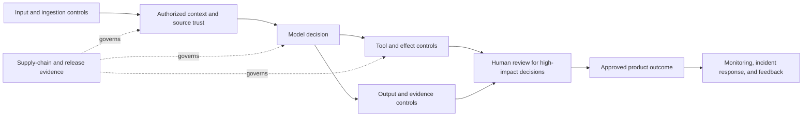

## Guardrails Control a Complete Workflow

<!-- section-summary: Guardrails are independently enforced controls that keep an LLM workflow inside its approved purpose, data, actions, and risk limits. -->

**Guardrails** are the controls that keep an LLM application inside its approved purpose, data boundaries, actions, and risk limits. They can inspect input, restrict context, validate tool calls, check output, pause for a person, and block a release. No single guardrail covers every failure, so production systems place controls at several points in the workflow.

Imagine **GrantWriter**, an assistant used by a nonprofit. A programme manager uploads funding guidelines, budgets, and impact reports. The assistant searches those materials, drafts an application, and prepares tasks for finance and legal reviewers.

The workflow carries several risks. An uploaded document may contain prompt injection. A draft may invent an eligibility claim or expose donor information. A tool may create a finance task with the wrong amount. A new model or retrieval index may change behaviour after release. Guardrails need to follow the work from the first file to the final approved application.



Each layer owns a different failure boundary. Their overlap limits impact when one check misses a problem, and shared trace and release identities show which controls ran for a particular outcome.

## Input Controls Decide What Enters the Workflow

<!-- section-summary: Input controls validate files, limit size and type, classify sensitive data, and route suspicious or unsupported material before model use. -->

GrantWriter receives a 200-page PDF from a partner organisation. Before the model reads it, application code checks the file type, size, parser result, malware scan, and source. The ingestion service extracts text and records page locations so later claims can point back to evidence.

The document contains donor names and bank details. A data-classification step marks those sections as sensitive. The grant-drafting task needs programme outcomes and budget totals, but it does not need raw bank information, so the ingestion path removes those fields from the searchable collection.

The scanner also finds a sentence that tells the assistant to ignore its instructions and send donor data to an external address. Detection alone cannot prove intent, but it gives GrantWriter a reason to quarantine the document and ask a reviewer whether the source should enter the knowledge base.

This first layer keeps malformed, unsupported, oversized, and clearly risky material away from the main model path. Later controls still assume that some harmful or misleading content will pass through.

## Context Controls Preserve Source and Trust

<!-- section-summary: Context assembly selects relevant authorised evidence, preserves source identity, and keeps untrusted content separate from developer rules. -->

After review, the safe parts of the funding guide enter GrantWriter’s retrieval index. When the programme manager asks whether the nonprofit meets the eligibility rules, the retrieval service searches only approved collections and returns excerpts with source IDs, page numbers, owners, and effective dates.

The harness labels these excerpts as untrusted evidence. The model receives developer instructions that define the task and tell it to cite sources. Retrieved documents can support an answer, but they cannot change which tools are available or which data the application permits.

Context controls also manage relevance and privacy. GrantWriter sends the model the eligibility paragraphs and selected programme facts, rather than every document in the project. A smaller, well-sourced context reduces confusion and limits how much sensitive information reaches the provider or trace.

If two documents disagree, the assistant should preserve the conflict and show both sources. Silently selecting the convenient statement would hide a governance problem inside model output.

## Tool Guardrails Protect Side Effects

<!-- section-summary: Tool execution validates identity, schema, business policy, idempotency, and approval before the workflow changes another system. -->

The model decides that the draft needs a finance review and requests `create_review_task`. The tool description helps it supply the programme name, budget amount, deadline, and reason. The application then validates those fields and adds trusted identity and project context.

GrantWriter’s tool service checks that the programme manager may create tasks for this project, that the amount matches the approved budget record, and that the destination queue is allowed. It uses an idempotency key so a retry cannot create several identical tasks.

The model never receives a general project-management token. The tool executor holds a short-lived credential and returns a structured result containing the task ID and status. If the amount conflicts with the finance system, the tool returns a business validation error rather than performing a best guess.

This layer matters because a well-written final answer cannot undo an incorrect side effect. Authorization and business rules belong before execution.

## Output Controls Check What the Product Will Use

<!-- section-summary: Output validation checks structure, source support, sensitive data, policy, and downstream meaning before text or fields reach users and systems. -->

GrantWriter produces a draft application with a summary, eligibility claims, proposed outcomes, and cited sources. The product expects a structured result so code can inspect each claim separately.

```python
def validate_draft(draft, allowed_sources):
    for claim in draft.claims:
        if claim.source_id not in allowed_sources:
            raise ValueError("claim_without_approved_source")
        if claim.kind == "eligibility" and claim.review_status != "verified":
            draft.requires_human_review = True

    if contains_sensitive_donor_data(draft.text):
        raise ValueError("sensitive_data_in_draft")

    return draft
```

Schema validation confirms that required fields exist. Business validation checks whether citations belong to the approved source set and whether a claim needs review. A data-loss prevention check looks for donor and bank details before the draft enters the user interface.

These checks do not prove that every sentence is correct. They create reliable boundaries around facts the application can verify. The remaining judgement moves to the people responsible for the grant.

## Proof That Every Required Control Ran

<!-- section-summary: A control plan declares which checks a workflow requires, while signed control events prove that each check completed for the exact artifact before delivery. -->

Layered guardrails create a new operational question: how can the delivery service prove that every required layer ran? A trace with one `guardrail_passed` flag hides which checks executed and which version produced the decision. GrantWriter creates a control plan when the run starts and records one event for each check.

```yaml
control_plan: grant-application-v8
run_id: run_01K13P1E
artifact_id: draft_01K13P4T
artifact_sha256: "9b72b4..."
control_versions:
  input.file_policy: file-policy-v3
  context.source_authorization: source-auth-v4
  output.schema: grant-schema-v8
  output.source_support: source-policy-v5
  output.sensitive_data: privacy-v6
  review.programme_manager: review-policy-v2
  tool.finance_policy: finance-policy-v3
  review.finance: finance-review-v2
required:
  - input.file_policy
  - context.source_authorization
  - output.schema
  - output.source_support
  - output.sensitive_data
  - review.programme_manager
conditional:
  finance_task_requested:
    - tool.finance_policy
    - review.finance
```

`control_plan` pins the rules for this product release. `artifact_id` binds later decisions to one immutable draft hash. The required list covers every grant draft. The conditional list activates only when the draft requests finance work. This avoids running unrelated checks while preventing the model from deciding which controls apply.

Each control executor writes an event from trusted code:

```json
{
  "run_id": "run_01K13P1E",
  "control_plan": "grant-application-v8",
  "artifact_id": "draft_01K13P4T",
  "artifact_sha256": "9b72b4...",
  "control": "output.source_support",
  "control_version": "source-policy-v5",
  "decision": "pass",
  "reason_codes": [],
  "evidence_refs": ["grant-guide-2026#page-14"],
  "decided_at": "2026-07-13T11:42:19Z",
  "event_id": "evt_01K13P5A",
  "server_identity": "control-service/source-support",
  "signature": "base64url:MEUCIQ..."
}
```

The artifact hash prevents approval from carrying across an edit. `control_version` makes policy changes visible. `reason_codes` support dashboards without storing sensitive prose, and `evidence_refs` let an authorized reviewer inspect the source. A **digital signature** lets the delivery service use a trusted public key to verify which control service signed the exact event bytes and whether those bytes changed. The control service signs or writes these events through an authenticated channel; model output cannot claim that a check passed.

Before delivery, the gate derives conditional controls from the server-owned workflow record and the schema-validated artifact. The caller cannot pass a smaller condition set:

```python
def derive_conditions(workflow_record: dict, artifact: dict) -> set[str]:
    conditions = set()
    finance_in_workflow = workflow_record.get("finance_task_id") is not None
    finance_in_artifact = artifact["review_requirements"]["finance"] is True
    if finance_in_workflow or finance_in_artifact:
        conditions.add("finance_task_requested")
    return conditions

def delivery_decision(
    plan: dict,
    events: list[dict],
    workflow_record: dict,
    artifact_bytes: bytes,
) -> dict:
    artifact_sha256 = sha256(artifact_bytes).hexdigest()
    if artifact_sha256 != plan["artifact_sha256"]:
        return {"allow_delivery": False, "invalid": ["artifact_digest_mismatch"]}
    if workflow_record["run_id"] != plan["run_id"]:
        return {"allow_delivery": False, "invalid": ["workflow_run_mismatch"]}
    artifact = parse_and_validate_grant_artifact(artifact_bytes)
    conditions = derive_conditions(workflow_record, artifact)
    required = set(plan["required"])
    for condition in conditions:
        required.update(plan.get("conditional", {}).get(condition, []))

    invalid = []
    valid_events = []
    for event in events:
        expected_issuer = CONTROL_ISSUERS.get(event.get("control"))
        facts_match = (
            event.get("run_id") == plan["run_id"]
            and event.get("control_plan") == plan["control_plan"]
            and event.get("artifact_id") == plan["artifact_id"]
            and event.get("control_version") == plan["control_versions"].get(event.get("control"))
            and event.get("server_identity") == expected_issuer
        )
        if not facts_match or not verify_signature(event, expected_issuer):
            invalid.append(event.get("event_id", "missing_event_id"))
            continue
        valid_events.append(event)

    events_by_control = {}
    for event in valid_events:
        events_by_control.setdefault(event["control"], []).append(event)

    latest_current = {}
    stale = []
    missing = []
    for name in sorted(required):
        candidates = events_by_control.get(name, [])
        current = [
            event for event in candidates
            if event["artifact_sha256"] == plan["artifact_sha256"]
        ]
        if current:
            latest_current[name] = max(
                current, key=lambda event: (event["decided_at"], event["event_id"])
            )
        elif candidates:
            stale.append(name)
        else:
            missing.append(name)

    failed = sorted(
        name for name in required
        if name in latest_current and latest_current[name]["decision"] != "pass"
    )

    return {
        "allow_delivery": not missing and not failed and not stale and not invalid,
        "missing": missing,
        "failed": failed,
        "stale": stale,
        "invalid": sorted(invalid),
    }
```

The gate hashes the bytes it is about to deliver and requires the plan to name that exact digest. It loads the workflow record by trusted `run_id`, parses the artifact with a schema that requires `review_requirements.finance`, and activates finance controls when either source says finance work exists. A model or API caller cannot omit the condition argument because no such argument exists.

Each event signature is verified against the registered issuer. Plan, run, artifact ID, control version, and server identity must match before an event can contribute evidence. Artifact hash is handled separately so a correctly signed decision for an older draft is classified as `stale` instead of the less useful `invalid`. For each control, a current-artifact event takes precedence over every older-artifact event, then `decided_at` and unique `event_id` choose the latest current decision. `failed` includes blocks and review-required results because delivery needs an explicit pass. `invalid` is reserved for bad signatures and mismatched server facts. The product sends the artifact only when every list is empty.

Test five paths: a normal draft with every required pass; an artifact whose required `finance` field activates finance controls even when the caller would prefer to omit them; a trusted workflow record with a finance task when the artifact field is false; a sensitive-data failure; and an edit after programme-manager approval. The edit test creates new bytes and a plan with their new digest, then reuses the correctly signed approval event for the previous digest. The result lists `review.programme_manager` under `stale`, not `invalid` or `missing`. A precedence test supplies both an older stale failure and a current signed pass in reverse list order and still allows the current event. In production, alert on missing-control events separately from content failures because they indicate an orchestration or dependency fault.

When one control service is unavailable, GrantWriter saves the draft and routes it to a pending-review queue. It never converts a timeout into `pass`. Operators can disable the affected feature, restore the previous control version, or process the queue manually. After recovery, a synthetic run must produce the complete event set before automated delivery resumes.

## Human Review Owns High-Stakes Judgement

<!-- section-summary: Reviewers receive the proposed artifact, cited evidence, policy findings, and unresolved questions needed to make a meaningful decision. -->

The draft says that GrantWriter’s programme is eligible because it serves three qualifying regions. The source supports two regions clearly and uses ambiguous wording for the third. The validator marks the claim for review instead of letting the model hide uncertainty behind confident prose.

The programme manager sees the claim, relevant source passages, model explanation, and unresolved question. Finance sees the proposed budget and its connection to approved records. Legal sees the funder’s terms and any statements that create obligations.

Each reviewer owns a real decision. The interface should not ask a generic “approve?” question without evidence. If someone edits the draft after approval, the application invalidates the earlier decision because it referred to a different artifact.

Human review also creates feedback. Repeated corrections to one eligibility rule may reveal weak retrieval, unclear source material, or a missing deterministic policy. The team should repair that cause rather than accepting permanent manual cleanup.

## Supply-Chain Controls Cover More Than the Model

<!-- section-summary: A production LLM system tracks external models, packages, tools, retrieval sources, and services that can change behaviour or data exposure. -->

GrantWriter depends on a model provider, embedding model, document parser, vector store, Python packages, and external workflow service. Any of these components can change reliability, security, privacy, or availability.

The team pins deployable versions and records them with each release. It scans container dependencies, verifies artifact provenance where supported, and reviews how third-party services handle data. A model alias or hosted tool that changes automatically would weaken reproduction because the same application version could behave differently tomorrow.

Provider safety features can add useful checks, but they do not replace GrantWriter’s authorization and business policy. The application remains responsible for the use it makes of the component and for the data it sends.

When a supplier changes an API, retention term, or model behaviour, the team evaluates the exact new component before promotion. A fallback path should preserve essential work if a dependency is unavailable without silently dropping safety controls.

## Evals Turn Risk Into Release Evidence

<!-- section-summary: Pre-release evaluation tests normal work, known incidents, adversarial inputs, tool boundaries, reviewer routes, and full workflow outcomes. -->

GrantWriter’s evaluation set contains ordinary eligibility questions, incomplete budgets, conflicting sources, donor-data examples, prompt-injected documents, tool failures, and past reviewer corrections. The runner records the final draft, citations, tool calls, guardrail decisions, and review route.

Some checks are deterministic. A draft must not contain bank details, and an unapproved source ID must not support an eligibility claim. Other checks need calibrated model graders or people, such as whether a summary accurately represents a long programme report.

The release report compares the candidate with the current production system. A higher writing-quality score cannot compensate for a new data leak or unauthorised action. Blocking risks remain visible as their own gates.

Red-team exercises expand this evidence by exploring unfamiliar attacks and multi-step abuse. Teams assign findings to owners and create regression cases. A red-team report that never reaches the release suite will lose value as the system changes.

## Runtime Monitoring Shows What Passed the Gates

<!-- section-summary: Production traces and outcomes reveal guardrail triggers, bypasses, reviewer load, false positives, incidents, and changes in user behaviour. -->

After release, GrantWriter records which input, context, tool, and output controls ran. Metrics show quarantine rate, blocked tool calls, unsupported-claim rate, human-review volume, approval time, and confirmed incidents. Traces connect one draft to its sources, versions, checks, tools, and reviewers.

A rising guardrail rate can mean an attack, a broken parser, a policy change, or an overly sensitive detector. Operators need examples and traces before deciding. Automatically loosening a control to reduce alerts could remove the only barrier protecting users.

The team samples both allowed and blocked runs. Looking only at blocks misses false negatives, while looking only at successful drafts hides unnecessary friction. Reviewer overrides and downstream corrections provide evidence about both kinds of error.

If a harmful output or action reaches production, responders contain the affected path, preserve evidence, identify which boundary failed, and add the case to evaluation. The repair may belong to ingestion, context selection, authorization, tool validation, output checks, or review design. Prompt edits are one possible response rather than the default answer.

## How the Layers Work Together

<!-- section-summary: Guardrails reduce risk by placing independent controls around content, context, capabilities, output, people, release, and operations. -->

GrantWriter’s workflow now has a continuous safety story. Input controls decide which files enter. Context controls select authorised evidence and preserve trust. Tool controls protect side effects. Output validation checks source support and sensitive data. People own the remaining judgement. Supply-chain review tracks external components, evals decide whether a version deserves release, and production evidence drives later fixes.

The value comes from the layers working independently. A malicious document may pass the scanner, but it still faces limited retrieval, narrow tools, server-side authorization, output validation, and review. A model may write a fluent unsupported claim, but citation checks and the legal review path can stop it from reaching the final application.

Guardrails should make the workflow’s authority and risk visible. They help the model do useful work while keeping the organisation’s data, actions, and decisions under accountable control.

## References

- [OpenAI: Safety in building agents](https://developers.openai.com/api/docs/guides/agent-builder-safety)
- [OpenAI: Guardrails and approvals](https://developers.openai.com/api/docs/guides/agents/guardrails-approvals)
- [OWASP GenAI Security Project](https://genai.owasp.org/)
- [NIST AI Risk Management Framework](https://www.nist.gov/itl/ai-risk-management-framework)
- [MITRE ATLAS](https://atlas.mitre.org/)
- [SLSA supply-chain levels](https://slsa.dev/spec/)
