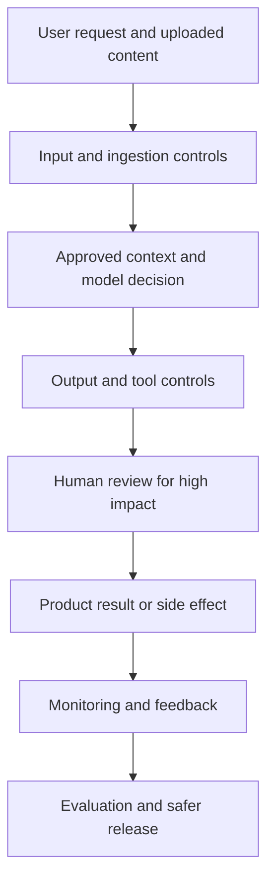
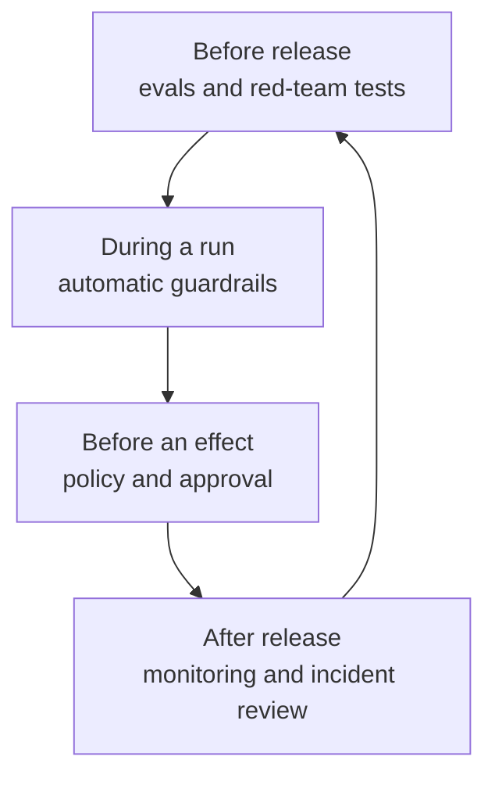
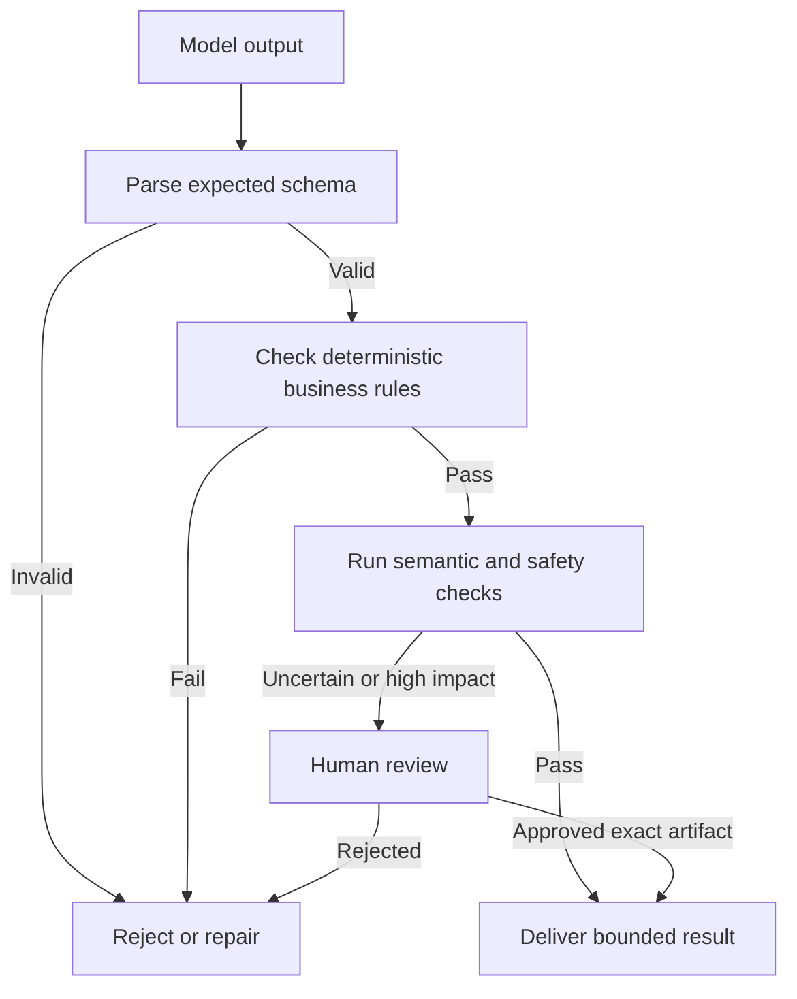
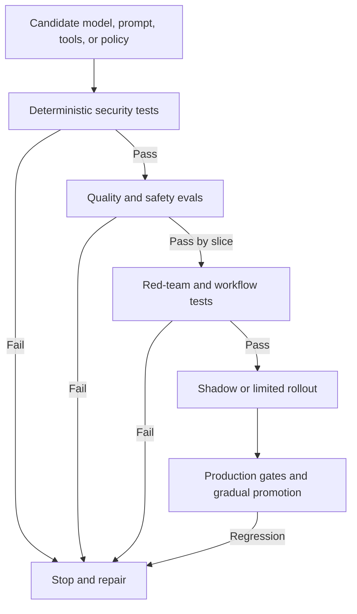

## Table of Contents

1. [What Guardrails Do](#what-guardrails-do)
2. [Know The Difference Between Guardrails, Policy, Evals, And Human Review](#know-the-difference-between-guardrails-policy-evals-and-human-review)
3. [Choose Controls From The Product Risk](#choose-controls-from-the-product-risk)
4. [Check Inputs Before The Workflow Uses Them](#check-inputs-before-the-workflow-uses-them)
5. [Check Outputs Before The Product Returns Them](#check-outputs-before-the-product-returns-them)
6. [Authorize Tool Calls And Side Effects](#authorize-tool-calls-and-side-effects)
7. [Require Human Review For High-Impact Decisions](#require-human-review-for-high-impact-decisions)
8. [Record Which Required Controls Ran](#record-which-required-controls-ran)
9. [Assess Supply-Chain Risk Across Models, Tools, And Data](#assess-supply-chain-risk-across-models-tools-and-data)
10. [Use Evaluations As Release Gates](#use-evaluations-as-release-gates)
11. [Monitor Guardrail And Policy Performance](#monitor-guardrail-and-policy-performance)
12. [Choose Industrial Tools For Each Control Layer](#choose-industrial-tools-for-each-control-layer)
13. [Document Residual Risk And Exceptions](#document-residual-risk-and-exceptions)
14. [The Main Idea](#the-main-idea)
15. [References](#references)

## What Guardrails Do
<!-- section-summary: Guardrails are checks placed around an LLM workflow to detect risk, constrain behaviour, pause sensitive work, or stop an unsafe result. -->

Imagine a customer asks an AI support assistant to cancel a subscription and refund the latest payment. The request sounds simple, yet the workflow contains several decisions.

The assistant must identify the correct account. It must read the refund policy and transaction history. It may draft a response, call a cancellation tool, request a refund, and send confirmation. A mistake in the explanation is inconvenient. A refund to the wrong account changes real money.

**Guardrails** are the checks placed around that workflow to keep it inside the product’s safety, security, privacy, and business limits. One guardrail may detect sensitive data in the final message. Another may reject a refund amount that exceeds policy. A third may pause the action for a person.

You can think of guardrails as gates along a journey:


```mermaid
flowchart TD
    A["User request and uploaded content"] --> B["Input and ingestion controls"]
    B --> C["Approved context and model decision"]
    C --> D["Output and tool controls"]
    D --> E["Human review for high impact"]
    E --> F["Product result or side effect"]
    F --> G["Monitoring and feedback"]
    G --> H["Evaluation and safer release"]

    class A source
    class B,D,E control
    class C,F result
    class G,H evidence
```

No single gate can cover the whole system. A content filter can identify harmful language, yet it cannot decide whether a customer qualifies for a refund. A business policy can validate the amount, yet it cannot judge whether a long explanation is respectful and clear. Production safety comes from several controls with clear responsibilities.

## Know The Difference Between Guardrails, Policy, Evals, And Human Review
<!-- section-summary: Automatic guardrails, deterministic policy, evaluations, and human review answer different risk questions and produce different evidence. -->

Teams often use the word *guardrail* for every safety mechanism. That broad use can hide important differences. Four terms provide a clearer design.

An **automatic guardrail** checks an input, output, or tool interaction during a run. It may use deterministic code, a regular expression, a classifier, or another model. Examples include schema validation, prompt-attack detection, sensitive-data scanning, and groundedness scoring.

A **policy** is an authoritative rule about what the application may do. It might say that refunds above a limit require finance approval or that one tenant can read only its own records. Policy decisions should come from trusted application code or a policy engine such as Open Policy Agent, usually called OPA.

An **evaluation**, shortened to **eval**, tests a saved system version against a dataset before or after release. It answers questions such as: did the candidate follow the cancellation policy across known edge cases, and did it introduce a new sensitive-data leak?

**Human review** gives a qualified person responsibility for a judgment or action. The reviewer needs the proposal, relevant evidence, policy result, and consequence. A generic approval button provides too little information for a meaningful decision.

These controls work at different times:


```mermaid
flowchart TD
    A["Before release<br/>evals and red-team tests"] --> B["During a run<br/>automatic guardrails"]
    B --> C["Before an effect<br/>policy and approval"]
    C --> D["After release<br/>monitoring and incident review"]
    D --> A

    class A prerelease
    class B runtime
    class C decision
    class D learning
```

The distinction prevents a dangerous shortcut. A model-based guardrail may estimate that a refund request looks safe. The refund service still applies its authoritative account and amount policy.

## Choose Controls From The Product Risk
<!-- section-summary: A control plan connects each important risk to an intervention point, enforcement method, evidence record, owner, and failure response. -->

A guardrail program starts with the product’s risks. Copying the same filter settings to every assistant produces uneven protection because a writing helper and a payment agent have different consequences.

Begin with the outcome the product enables. Identify the people and assets that could be harmed. Then follow credible failure paths through input, context, model decisions, tools, output, and downstream use.

For the refund workflow, the team may identify these risks:

- another customer’s transaction enters context;
- a malicious note changes the model’s goal;
- the model invents a refund-policy exception;
- a tool receives the wrong account or amount;
- sensitive payment details appear in the response;
- a new model version skips the approval route.

Each risk leads to a **control objective**. A control objective describes the safety property in plain language, such as “a refund can affect only the authenticated customer’s eligible transaction.”

The plan then records where and how that property is enforced:

```yaml
workflow: subscription_refund
control_plan: refund_controls_v6
risk_tier: high
required:
  - id: context.tenant_scope
    point: context
    enforcement: retrieval_policy
  - id: tool.refund_authorization
    point: before_tool
    enforcement: opa_policy
  - id: review.large_refund
    point: before_tool
    enforcement: exact_action_approval
  - id: output.payment_data
    point: before_delivery
    enforcement: sensitive_data_filter
release_gates:
  - cross_tenant_access_zero
  - unauthorized_refund_zero
```

This small file gives the workflow an explicit safety contract. It names required controls and release blockers. The application loads the plan by workflow version; the model never chooses which controls apply.

### Choose Deterministic, Model, Or Human Enforcement

Use deterministic checks for facts code can decide exactly: schema validity, allowed tool, authenticated tenant, amount limit, destination, and approval match.

Use probabilistic checks for judgments with fuzzy boundaries: harmful content, prompt attacks, groundedness, tone, or semantic policy classification. Calibrate their thresholds on representative traffic and preserve a review path for uncertain cases.

People own consequential judgments that require accountability or domain expertise. Contextual interpretation also belongs with a qualified reviewer. Common examples include legal commitments and large financial actions. Medical decisions and public statements often require the same treatment.

## Check Inputs Before The Workflow Uses Them
<!-- section-summary: Input and context guardrails validate content, classify risk, enforce source access, preserve provenance, and limit what reaches the model. -->

Input guardrails protect the first part of the workflow: user messages, uploaded files, external content, and retrieved evidence. They decide which material can enter, how it is classified, and which trust labels follow it into model context.

At ingestion, ordinary application security still applies. Check file type and size. Use a hardened parser and malware scanning. Reject malformed data. Classify sensitive information before indexing or model use. Record the source owner, collection, parser version, data class, and review state.

Model-aware checks add another layer. Prompt-attack detection can quarantine suspicious text. Content safety classifiers can block or route harmful requests. A purpose classifier can send an account request to the refund workflow and a technical issue to support.

Context controls decide which data the model sees. Retrieval enforces tenant and source permissions before ranking returns chunks. The harness selects only task-relevant evidence and carries source IDs into the prompt. External text remains labelled as untrusted evidence.

Consider a user who uploads a long invoice bundle to dispute one charge. The workflow needs the selected invoice and refund policy. Sending every invoice increases privacy exposure and gives unrelated content more influence. Narrow retrieval improves both security and answer quality.

Input controls have false positives and false negatives. A security report may resemble an attack. A novel injection may evade a classifier. Later policy and tool controls should assume that risky content can still pass.

## Check Outputs Before The Product Returns Them
<!-- section-summary: Output guardrails check structure, sensitive data, source support, policy, and downstream meaning before a result reaches people or systems. -->

An output guardrail evaluates the artifact the product is about to use: a message, structured decision, generated file, tool result, or action plan.

Start with structure. JSON Schema can define expected fields and reject extra ones. Pydantic and Zod provide common code-level validation options. A structured result lets application code inspect the amount and account reference separately. Evidence IDs and proposed actions receive their own checks as well.

Then apply checks that match the product risk. A support response may need sensitive-data scanning and approved-source citations. A medical summary may need completeness checks and clinician review. Generated code may need static analysis, tests, and a sandbox before execution.

The order matters:


```mermaid
flowchart TD
    A["Model output"] --> B["Parse expected schema"]
    B -->|"Invalid"| G["Reject or repair"]
    B -->|"Valid"| C["Check deterministic business rules"]
    C -->|"Fail"| G
    C -->|"Pass"| D["Run semantic and safety checks"]
    D -->|"Uncertain or high impact"| E["Human review"]
    D -->|"Pass"| F["Deliver bounded result"]
    E -->|"Approved exact artifact"| F
    E -->|"Rejected"| G

    class A output
    class B,C,D,E check
    class F success
    class G reject
```

A model grader can estimate groundedness or policy adherence. Its score remains a probabilistic judgment. High-impact claims need source verification or a qualified reviewer. The final delivery service should also confirm that every required control produced a current result.

## Authorize Tool Calls And Side Effects
<!-- section-summary: Tool guardrails validate model-proposed arguments, while authorization and business policy decide whether the exact action may execute. -->

Tool calls cross from model reasoning into another system. A useful tool guardrail checks the request immediately before execution and inspects the result before it returns to the model.

Input checks validate the tool name, argument schema, amount range, destination, resource ID, and data classification. Output checks can remove secrets, reject an unexpected response shape, and prevent one tool’s free-form result from steering a later action.

Authorization uses server-owned identity and resource facts. The model can propose `refund(transaction_id, amount)`. The server attaches the authenticated user and tenant. The policy engine confirms that the transaction belongs to that tenant, the amount is eligible, and the approval requirement is satisfied.

A compact OPA policy shows the authoritative boundary:

```rego
package refunds

import rego.v1

default allow := false

allow if {
    input.action == "refund:create"
    input.transaction.tenant_id == input.principal.tenant_id
    input.request.amount <= input.transaction.refundable_amount
    input.request.currency == input.transaction.currency
    input.approval.valid_for_request == true
}
```

The model supplies the proposed request. Trusted services build the principal, transaction, and approval objects. `default allow := false` means missing facts produce a denial.

Tool access should also be narrow. A read-only explanation step has no refund tool. The tool executor holds a short-lived credential and keeps secrets outside model context. Side effects use idempotency keys so a retry cannot duplicate the refund.

OpenAI Agents SDK currently provides tool input and output guardrails for function tools. Hosted and built-in tools use different control surfaces, so teams should verify coverage for every actual tool type. Other runtimes expose equivalent middleware or interceptors. The security property is the same: every path into an effect reaches the authoritative gate.

## Require Human Review For High-Impact Decisions
<!-- section-summary: Human review pauses a consequential action and gives an accountable person the exact proposal, evidence, policy result, and consequence. -->

Human review is a control for judgment and accountability. It works only if the reviewer can understand the choice, see the evidence, and recognise the consequence of approving the proposed action.

For a large refund, the review screen should show the customer account, transaction, proposed amount, policy rule, model explanation, supporting evidence, and downstream effect. The person approves one exact action. If the amount or destination changes, the application invalidates the approval.

The workflow must persist the pause. A worker restart should leave the action pending. The reviewer’s identity, decision, reason, policy version, artifact digest, and expiry belong in the audit record.

OpenAI Agents SDK supports durable pause-and-resume flows for tools that require approval. Its `RunState` can be serialized and resumed after a person accepts or rejects a call. Other orchestrators can store the same interruption in a database or workflow engine.

Approval should stay rare enough to deserve attention. Sending every harmless read to a person creates fatigue and delays. Classify actions by reversibility, financial or safety impact, data sensitivity, external visibility, and user expectation. Use automatic policy for low-risk bounded reads and reserve people for consequential or ambiguous actions.

## Record Which Required Controls Ran
<!-- section-summary: Control evidence ties a policy or guardrail decision to one run, artifact, version, and trusted executor so delivery can detect missing or stale checks. -->

Several guardrails create an operational question: how can the product prove that each required control ran on the exact artifact it will deliver?

A single `guardrail_passed=true` field hides too much. The event should identify the control, its version, the artifact, and the trusted component that made the decision:

```json
{
  "run_id": "run_f83a",
  "artifact_id": "refund_proposal_72",
  "artifact_sha256": "sha256:5d1c...",
  "control_plan": "refund_controls_v6",
  "control": "tool.refund_authorization",
  "control_version": "refund_policy_v14",
  "decision": "pass",
  "reason_codes": [],
  "decision_id": "decision_a91e",
  "issuer": "policy-service"
}
```

The artifact digest binds the decision to exact content. An edit produces a new digest and makes the old approval stale. `issuer` distinguishes an authoritative policy event from text produced by the model. `reason_codes` support dashboards without copying sensitive payloads into metrics.

Before delivery or execution, the gate loads the server-owned control plan and checks for every required current event. Missing evidence fails closed for high-risk workflows. A timeout can move the request to a manual queue; it cannot silently count as a pass.

OPA decision logs can record policy bundle revision, decision ID, trace ID, input, and result. Sensitive fields can be masked before log upload. Similar policy systems provide equivalent decision evidence. Connect the policy decision ID to the agent trace and business audit record so an incident review can follow the whole path.

## Assess Supply-Chain Risk Across Models, Tools, And Data
<!-- section-summary: LLM supply-chain review covers model providers, prompts, packages, containers, parsers, retrieval sources, connectors, tools, and safety services. -->

An LLM product depends on more than its main model. Its behaviour and data exposure can change through a model alias, prompt bundle, embedding model, parser, package, container, retrieval source, MCP server, hosted tool, classifier, or external API.

Create an inventory of these components. Record the owner and exact version or digest. Source and data-handling terms explain where the component came from and what it receives. Permissions define its authority, while maturity and fallback describe operational risk. Pin exact artifacts where the platform permits it. Treat an automatic provider upgrade as a material change that requires evaluation.

Software controls still matter. Generate an SBOM, scan dependencies, sign release images, and verify provenance in deployment. SLSA provides an industry specification for increasing software supply-chain guarantees and defines provenance for tracing artifacts back through their build process.

AI-specific review adds questions that an SBOM cannot answer. Which provider receives prompts? Can the provider retain data? Which region processes it? Can a connector change its tool description? Does a retrieval source have an approval workflow? Which model or guardrail feature is Preview?

Microsoft Foundry’s agent guardrails and tool-call intervention points are currently Preview. That maturity affects production risk and fallback design. A preview feature can support testing or a compensating layer, while critical authorization remains in stable application policy.

If a safety dependency fails, the product needs an explicit response. A low-risk public summariser may continue with reduced features. A refund workflow may enter a read-only mode or manual queue. Silent removal of a required guardrail creates an uncontrolled release.

## Use Evaluations As Release Gates
<!-- section-summary: Risk-based evals test normal work, known failures, adversarial cases, policy boundaries, and full workflow effects before promotion. -->

Runtime guardrails protect individual runs. **Release evals** decide whether a changed system deserves production traffic. They replay normal, difficult, and adversarial cases against one exact candidate before that candidate can affect users.

Build the evaluation set from the control plan. Include normal tasks, edge cases, past incidents, adversarial inputs, important user slices, tool failures, approval routes, and successful behaviours worth preserving.

Each test should assert the relevant layer. A prompt-injection case checks the final effect and policy denial. A sensitive-data case checks the delivered artifact. A refund case checks account ownership, amount, currency, approval, idempotency, and downstream audit.

Some gates are absolute. Cross-tenant exposure, unauthorized refunds, and skipped required controls should block release. Other measures use thresholds: false-positive rate, reviewer load, unsupported-claim rate, latency, and cost.


```mermaid
flowchart TD
    A["Candidate model, prompt, tools, or policy"] --> B["Deterministic security tests"]
    B -->|"Pass"| C["Quality and safety evals"]
    B -->|"Fail"| G["Stop and repair"]
    C -->|"Pass by slice"| D["Red-team and workflow tests"]
    C -->|"Fail"| G
    D -->|"Pass"| E["Shadow or limited rollout"]
    D -->|"Fail"| G
    E --> F["Production gates and gradual promotion"]
    F -->|"Regression"| G

    class A candidate
    class B,C,D,E gate
    class F promote
    class G stop
```

MLflow’s current GenAI evaluation APIs can build datasets from production traces, run built-in or custom scorers, and compare versions. Its production trace evaluation can also apply the same scoring concepts to sampled live traces. Human calibration remains important for model-based judges.

Red-team exercises explore paths beyond the saved suite. OWASP’s AI Agent Security guidance recommends testing after material changes to prompts, tools, memory, retrieval, policy, or providers. Every confirmed failure should gain an owner and a regression case.

## Monitor Guardrail And Policy Performance
<!-- section-summary: Production monitoring measures control coverage, trigger rates, false positives, escapes, review load, and the downstream outcomes controls were meant to protect. -->

Production monitoring answers two questions: did every required control run, and did the control reduce the targeted harm? The first question checks enforcement coverage. The second checks whether the safety design works under real traffic.

**Coverage** measures whether required checks produced current evidence. **Trigger rate** shows how often a guardrail blocks, routes, or requests review. **Override rate** shows how often reviewers reverse a guardrail. **Escape rate** counts confirmed failures that passed the controls. **Review burden** measures queue volume and age.

Read these signals together. A sudden fall in sensitive-data detections may reflect safer output, a broken detector, or missing instrumentation. A rise in blocks may reflect an attack, a parser change, or a threshold that is too strict. Sample allowed and blocked cases to estimate both false negatives and false positives.

The trace should connect:

- workflow and release version;
- model, prompt, retrieval, and tool versions;
- control plan and control versions;
- input, output, tool, policy, and approval decisions;
- business action and final outcome;
- protected evidence references.

Raw prompts, personal data, credentials, and full documents need restricted storage or redacted references. Keep high-cardinality identifiers in traces and audit stores instead of metrics labels.

Alerts should map to a runbook. Missing authorization evidence can disable the affected tool. A spike in output blocks can route traffic to the previous release. A confirmed unauthorized action starts incident response: contain the capability, preserve evidence, scope impact, repair the failed boundary, add a regression case, and verify the recovery.

## Choose Industrial Tools For Each Control Layer
<!-- section-summary: Current platforms provide specialised guardrail, policy, evaluation, tracing, and supply-chain capabilities that teams combine around one control plan. -->

Industrial stacks usually combine several tools because each product covers a different layer. The useful design starts by assigning one clear responsibility to each product and defining the evidence it passes to the rest of the workflow.

### Runtime safety filters

Amazon Bedrock Guardrails provides content filters, prompt-attack controls, denied topics, word filters, sensitive-information filters, contextual grounding checks, and automated-reasoning checks. Teams choose the checks that match their risk and test the configured behaviour.

Google Cloud Model Armor screens prompts and responses for content safety, prompt injection, jailbreaks, sensitive data, and malicious URLs. Microsoft Foundry guardrails define risks, intervention points, and actions for model and agent traffic; the agent and tool-call surfaces are Preview and should be treated at that maturity level.

These services provide probabilistic safety signals and blocking. Tenant authorization still comes from trusted identity and resource policy. Transaction rules and exact-action approval remain independent gates.

### Agent-runtime controls

OpenAI Agents SDK provides input and output guardrails, function-tool guardrails, tracing, and human-in-the-loop interruptions. LangGraph, Temporal, and managed workflow systems can express durable pauses and explicit state transitions. Framework choice should preserve the same control contract across retries and resumptions.

### Deterministic policy

OPA can evaluate structured authorization and business-policy input close to the service. Its bundles version policy, and decision logs provide audit evidence. Cloud-native IAM policy engines can serve similar roles. The domain service still enforces the decision at execution time.

### Evaluation and observability

MLflow supports GenAI traces, evaluation datasets, scorers, version comparisons, and production trace evaluation. OpenTelemetry provides vendor-neutral traces and metrics that can connect agent spans with policy and tool services. Prometheus, Grafana, or cloud monitoring can alert on bounded operational metrics.

### Supply-chain assurance

SLSA describes build and source assurance levels plus provenance formats. Sigstore Cosign can sign and verify container artifacts. Container scanners and SBOM tools inspect deployable dependencies. AI inventories add hosted models, prompts, tools, data sources, and provider safety services to that software evidence.

The architecture stays understandable if every tool maps to a control objective, intervention point, owner, evidence record, and failure response.

## Document Residual Risk And Exceptions
<!-- section-summary: Governance assigns ownership, documents remaining risk, controls exceptions, and keeps risk decisions current as the workflow changes. -->

Controls reduce risk and leave some uncertainty. A classifier may miss harmful content. A reviewer may make a poor decision. A supplier may change behaviour. **Residual risk** is the risk left after the selected controls operate.

NIST AI RMF organises continuous risk management through four functions: Govern, Map, Measure, and Manage. Applied to an agent workflow, the team maps people, assets, and failure paths; measures likelihood and impact; manages risks through controls and recovery; and governs ownership, policy, documentation, and review.

Assign an owner to every high or accepted residual risk. The record identifies the affected workflow and credible scenario. It describes the potential impact and current controls, then links the supporting evidence and decision. A review condition and expiry keep the acceptance temporary and visible.

An exception is a controlled temporary decision. Suppose a groundedness service is unavailable and a low-risk internal summariser continues with mandatory citations and human review. The exception should name the restricted workflow, compensating controls, approver, monitoring, and expiry. It should never silently change the control plan for every product.

Risk review also follows change. A new tool, broader data source, provider model, autonomy level, or user population can create a new path to harm. The control plan and evaluation suite should change with the architecture.

## The Main Idea
<!-- section-summary: Guardrails manage LLM risk through layered controls, explicit ownership, verifiable evidence, and continuous evaluation across the workflow lifecycle. -->

Guardrails are the gates around an LLM workflow. Automatic checks inspect inputs, outputs, and tool interactions. Deterministic policy protects identity, resources, and business rules. Human review owns consequential judgments. Evals decide whether a release has enough evidence. Monitoring reveals missing controls, false positives, escapes, and changing risk.

A risk-based control plan connects these layers. It starts with a credible failure, names the safety property, chooses the intervention point and enforcement type, records trusted evidence, and defines the response to failure.

In essence, guardrails work as an accountable system of controls. Their value comes from the real outcomes they prevent, the decisions they make visible, and the evidence they provide throughout development and production.

## References

- [NIST AI Risk Management Framework](https://www.nist.gov/itl/ai-risk-management-framework)
- [NIST AI RMF: Generative Artificial Intelligence Profile](https://www.nist.gov/publications/artificial-intelligence-risk-management-framework-generative-artificial-intelligence)
- [OWASP: AI Agent Security Cheat Sheet](https://cheatsheetseries.owasp.org/cheatsheets/AI_Agent_Security_Cheat_Sheet.html)
- [OpenAI Agents SDK: Guardrails](https://openai.github.io/openai-agents-python/guardrails/)
- [OpenAI Agents SDK: Human-in-the-loop](https://openai.github.io/openai-agents-python/human_in_the_loop/)
- [Amazon Bedrock Guardrails: Components](https://docs.aws.amazon.com/bedrock/latest/userguide/guardrails-components.html)
- [Microsoft Foundry: Guardrails and controls overview](https://learn.microsoft.com/en-us/azure/foundry/guardrails/guardrails-overview)
- [Google Cloud Model Armor: Overview](https://docs.cloud.google.com/model-armor/overview)
- [LangGraph: Interrupts](https://docs.langchain.com/oss/python/langgraph/interrupts)
- [Temporal: Durable Execution](https://docs.temporal.io/temporal)
- [Open Policy Agent: Decision logs](https://www.openpolicyagent.org/docs/management-decision-logs)
- [MLflow: Build evaluation datasets](https://mlflow.org/docs/latest/genai/datasets/)
- [MLflow: Evaluate production traces](https://mlflow.org/docs/latest/genai/eval-monitor/running-evaluation/traces/)
- [OpenTelemetry: Generative AI semantic conventions](https://github.com/open-telemetry/semantic-conventions-genai)
- [SLSA specification](https://slsa.dev/spec/v1.2/)
- [Sigstore Cosign: Verify an image](https://docs.sigstore.dev/cosign/verifying/verify/)
- [Model Context Protocol: Security best practices](https://modelcontextprotocol.io/docs/draft/tutorials/security/security_best_practices)
