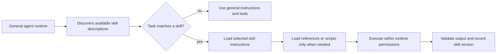
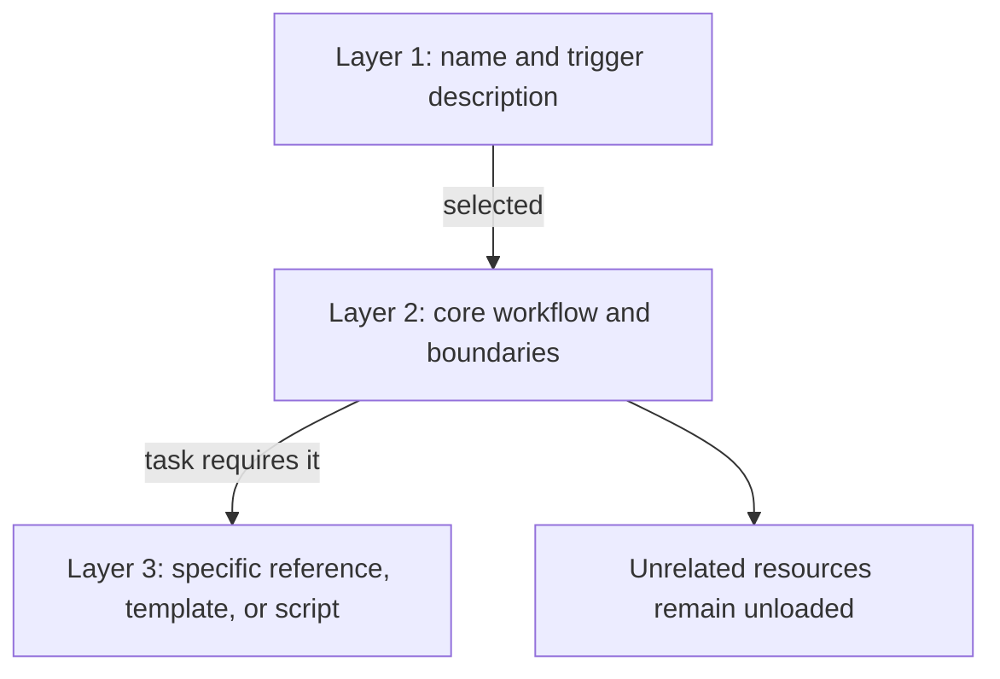
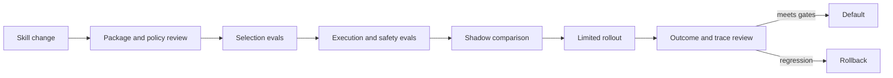

## Skills Package the Missing Operating Procedure

<!-- section-summary: A skill gives an agent a reusable and governed procedure for a class of tasks. -->

A general-purpose agent may know how to read files, call tools, and write text, yet still lack the local procedure for a real task. "Review this infrastructure change" could require an organization-specific risk taxonomy, approved commands, a report template, validation scripts, and a rule that production changes need human approval. Repeating all of that in every user prompt is fragile and expensive.

An **agent skill** packages this operating procedure as a reusable capability. The package usually contains a concise description for discovery, detailed instructions loaded when selected, optional references and templates, deterministic scripts, tool requirements, and evaluation cases. It is versioned and owned like other production behaviour.

The skill does not replace the model, runtime, or tools. It connects them with maintained domain procedure. That distinction is essential: a skill is operational knowledge, not another name for any prompt file.

## Separate Skills From Nearby Concepts

<!-- section-summary: Skills, prompts, tools, workflows, and agents solve different parts of an agent system. -->

A **prompt** supplies instructions or context for one model interaction. It may be part of a skill, but a skill can also contain files, scripts, templates, and validation rules that span several interactions.

A **tool** exposes an action or resource through a contract. It answers "what can the runtime do?" A skill answers "how should this class of work be performed?" A deployment-review skill might use repository search, policy lookup, test execution, and ticket creation tools.

A **workflow** defines control flow: ordered steps, branches, retries, approvals, and state transitions. A skill can describe or invoke a workflow, while an orchestrator enforces its runtime state. Instructions alone do not provide durable checkpoints or exactly-once execution.

An **agent** is the decision-making runtime that interprets a task, selects actions, and uses context and tools. An agent can load many skills. A skill may also instruct an orchestrator to hand a specialized step to another agent, but the package itself is not a running agent.

This separation prevents overloaded designs. If the problem is missing API access, add or fix a tool. If it is durable branching and recovery, use a workflow runtime. If it is repeatable expert procedure, a skill is a good fit.

## Why Skills Need Progressive Disclosure

<!-- section-summary: The runtime first sees small discovery metadata, then loads detailed instructions and supporting material only for the selected task. -->

An organization may have hundreds of procedures. Loading every one into the model context would consume tokens, dilute attention, expose irrelevant information, and increase the chance of conflicting instructions. Skills address this through **progressive disclosure**.

The runtime first exposes only compact metadata, normally a name and a precise description. The description acts as a routing surface: it says what the skill covers and when it should be used. When the task matches—or the user names the skill—the runtime loads the full instruction file. The instructions can then direct the agent to particular references, scripts, or templates as the task requires.

This design improves both relevance and governance. A security-review skill can load the organization’s threat taxonomy without injecting that taxonomy into an unrelated writing task. It also means the description deserves evaluation: a poorly written description causes the right skill to be missed or the wrong skill to trigger.

## The Capability Bundle Has Six Parts

<!-- section-summary: A production skill combines discovery, procedure, resources, capability requirements, output rules, and quality evidence. -->

### 1. Discovery metadata

The name should be stable and specific. The description should state the task, important inputs, and boundaries in natural language. Metadata may also record owner, version, risk class, compatibility, and review status. Only fields useful for discovery should enter every run’s context.

### 2. Core procedure

The main instructions explain the goal, required inputs, sequence of reasoning or work, decision points, stop conditions, and how to handle missing information. They should encode the framework used by experts, not merely tell the agent to "be careful." Core understanding belongs here rather than behind optional references.

### 3. References and templates

Long policy documents, taxonomies, provider-specific guidance, and worked examples belong in separate resources that are loaded when relevant. Templates define repeatable output without turning one example into the logic of the skill. References need provenance and review dates because stale procedure can be worse than no procedure.

### 4. Deterministic helpers

Scripts are useful for work that should not depend on model judgement: parsing, schema validation, formatting, static checks, or artifact generation. Prefer existing tested helpers to asking the model to reproduce the same transformation each time. Scripts still require ordinary code review and sandboxing.

### 5. Capability and policy requirements

The skill may declare which tools or data sources it expects and which actions need approval. The runtime intersects those requirements with the user’s identity and platform policy. A skill can request a capability; it cannot grant itself permission. Side effects remain subject to tool contracts, authorization, idempotency, and audit.

### 6. Output and quality contract

Define the deliverable, required evidence, validation steps, and conditions that require human review. Evaluation cases should cover correct routing, normal tasks, ambiguous inputs, missing tools, prompt injection, unsafe requests, and recovery paths.

A compact `deployment-review` package might contain:

- `SKILL.md` for discovery metadata, the core procedure, and resource routing;
- `references/risk-taxonomy.md` and `references/rollback-policy.md` for deeper policy;
- `scripts/validate-report.sh` for a deterministic report check;
- `templates/review-report.md` for the deliverable shape;
- `evals/safe-change.yaml` and `evals/unsafe-production-change.yaml` for release evidence.

The directory is not important by itself. The design value comes from the separation: the primary procedure stays readable, deeper material is discoverable, deterministic checks are executable, and quality expectations are reviewable.

## Discovery Is a Retrieval and Policy Decision

<!-- section-summary: Skill discovery selects an eligible procedure from metadata, user intent, runtime capability, and policy before detailed instructions enter context. -->

Progressive disclosure saves context only when the discovery stage works well. A runtime may choose from local packages, an organization registry, hosted skills, or a set explicitly attached to one environment. The registry supplies candidate metadata; the host still decides which candidates are eligible for this user, workspace, environment, and task.

Think of discovery as two filters followed by a ranking decision. The **eligibility filter** removes skills whose source is untrusted, version is disabled, required runtime is unavailable, or policy forbids their data and tools. The **task filter** removes descriptions unrelated to the request. Ranking then chooses the smallest set that covers the work. An explicit user selection can raise a candidate’s priority while remaining subject to the same integrity and permission controls.

Descriptions should identify positive triggers and useful boundaries in plain language. A description such as “helps with deployment” overlaps with many jobs and will trigger unpredictably. “Review Kubernetes deployment changes for rollout, observability, security, migration, and rollback evidence; use for a proposed manifest or pull request, without applying production changes” gives the selector a clearer job and stop boundary.

Overlapping skills need an explicit rule. One skill may own the complete deliverable and call a narrower parser skill. Two domain-review skills may both contribute findings that an orchestrator merges. Two mutually exclusive policy skills may require the registry to choose by jurisdiction or product. Loading both and asking the model to reconcile contradictory instructions creates a hidden governance decision.

Discovery telemetry should record the candidate set by stable identifiers, exclusion reasons, selected versions, explicit user selection, and any conflict resolution. Avoid sending every full description to a general analytics system; identifiers and bounded reasons are enough for population analysis. Selection evals can then distinguish three failures: the right skill was never eligible, it was eligible but ranked poorly, or it was selected and executed poorly.

Hosted skill platforms and local agent runtimes expose different packaging and execution details. Keep the article’s six-part capability contract portable, then map it to the current platform. For example, OpenAI’s current API documentation describes versioned file bundles with a `SKILL.md` manifest for hosted or local shell environments, while the open Agent Skills specification defines a portable package shape. Platform-specific upload APIs and runtime limits should live in deployment guidance or automation, where teams can re-check them as the service evolves.

## Write the Framework, Not One Ideal Transcript

<!-- section-summary: Skill instructions should teach stable decisions and boundaries rather than prescribe one long example conversation. -->

A weak skill often contains one successful worked example and expects the model to imitate it. That approach breaks when inputs change. A stronger skill defines the decision structure.

For a deployment review, the procedure might be:

1. establish the system, environment, change intent, and deployment boundary;
2. identify affected components, data, identities, and downstream consumers;
3. evaluate release, migration, observability, security, and rollback evidence;
4. distinguish blocking defects from risks and optional improvements;
5. validate cited files, commands, tests, and deployment assumptions;
6. produce a report with evidence and required human decisions.

A small example can demonstrate how one finding cites a manifest and explains rollback impact. The example should illuminate the framework without taking over its structure. This keeps the skill transferable across services, languages, and deployment platforms.

Instructions should also say what not to do. A review skill may inspect and report but not deploy. A data-cleanup skill may generate a plan but require approval before deletion. Stop conditions are part of the capability.

## Skills Run Inside a Trust Boundary

<!-- section-summary: Skill content is instruction input, while the runtime remains responsible for integrity, permissions, isolation, and trusted execution. -->

Skills can include powerful instructions and executable helpers, so packages from outside the organization should be treated as untrusted until reviewed. A production registry should resolve an approved version, verify its contents, and record the version or content digest used for each run. Changed files should produce a new release rather than silently altering historical behaviour.

The runtime should enforce:

- package source and integrity verification;
- allowed file paths and resource sizes;
- script sandboxing and network policy;
- tool permissions derived from user and workload identity;
- approval for sensitive effects;
- secret isolation from model-visible content;
- trace and audit records for selection, resources, tools, and validation.

Instruction priority also matters. A skill does not override system security policy or explicit user scope merely because it contains imperative language. Retrieved documents and user-provided files are data, not trusted instructions. Skills that operate on adversarial content should explicitly tell the agent to ignore embedded requests that conflict with the task.

## Design for Composition Without Conflict

<!-- section-summary: Multiple skills can cooperate when their responsibilities, outputs, and precedence are explicit. -->

A complex task may need several skills: one to inspect a PDF, one to apply a domain review procedure, and one to render the final artifact. Composition fails when each skill claims the entire task or gives contradictory formatting and tool instructions.

Keep skills cohesive and assign a clear owner to the final deliverable. Define what each skill consumes and produces. The orchestrator can load them in sequence or delegate bounded parts, while shared platform rules resolve permission and safety. If two skills disagree about a domain policy, do not ask the model to improvise precedence; fix the registry, ownership, or workflow.

Avoid splitting every tiny instruction into a skill. Selection has a cost, and fragments make the agent reconstruct procedure from too many packages. A good skill represents a recognizable expert job or reusable transformation with its own quality contract.

## Evaluate Selection and Execution Separately

<!-- section-summary: A skill can fail because it was selected incorrectly or because its procedure produced a poor result. -->

Skill evaluation has two layers.

**Selection evaluation** asks whether the runtime loads the right skill. Include positive cases, near misses, overlapping descriptions, explicit user requests, and tasks that should use no skill. Measure false triggers as well as missed triggers.

**Execution evaluation** asks whether the selected skill performs the job. Test required steps, evidence quality, tool boundaries, output structure, missing-input handling, unsafe content, and human escalation. Trace inspection helps reveal whether the agent loaded the intended references and ran the validator, while task-specific graders and human reviewers judge the result.

Roll out a material skill change like a software release. Compare the candidate with the current version on representative tasks, start with shadow or internal users, then widen traffic with rollback thresholds. Record skill, reference, script, model, tool, and policy versions in traces so a later review can reconstruct the behaviour.

## What a Production Skill Provides

<!-- section-summary: A mature skill is discoverable, focused, governed, testable, and connected to runtime evidence. -->

A production skill represents one coherent capability. Its description routes the right tasks; its main instructions explain the expert framework and boundaries; its resources load progressively; its scripts handle deterministic work; and its required tools stay inside runtime permissions. It has an owner, version, quality contract, evaluation set, trace evidence, staged rollout, and rollback path.

The important shift moves from "a long prompt that worked once" to "a maintained capability artifact." Skills make specialized procedure reusable without placing every procedure in every context. Reliability depends on designing discovery, execution, tools, validation, and release evidence together.

## References

- [OpenAI Codex agent skills](https://developers.openai.com/codex/skills)
- [OpenAI API skills](https://developers.openai.com/api/docs/guides/tools-skills)
- [Agent Skills specification](https://agentskills.io/specification)
- [OpenAI Agents SDK overview](https://developers.openai.com/api/docs/guides/agents)
- [OpenAI MCP and connectors](https://developers.openai.com/api/docs/guides/tools-connectors-mcp)
- [Model Context Protocol tools specification](https://modelcontextprotocol.io/specification/2025-11-25/server/tools)
- [OpenAI agent evaluation guidance](https://developers.openai.com/api/docs/guides/agent-evals)
- [OWASP Top 10 for LLM applications](https://genai.owasp.org/llm-top-10/)
