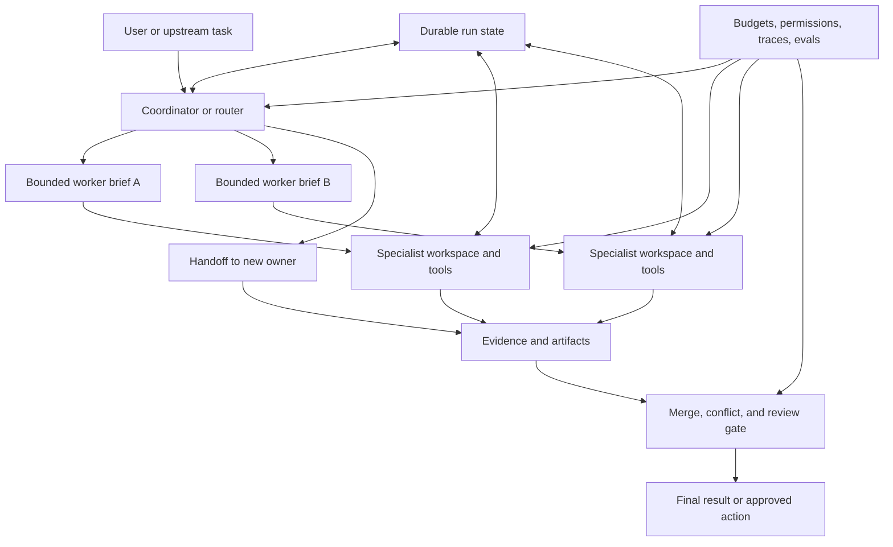
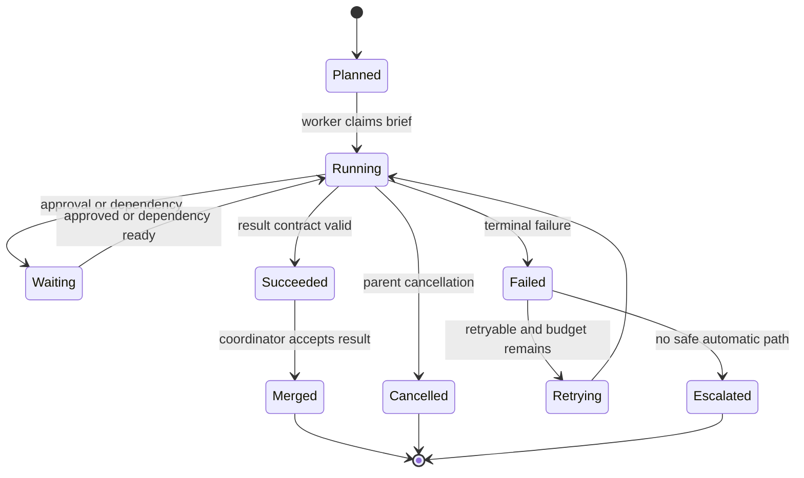

A **subagent** is a bounded specialist invoked as part of a larger task. A **handoff** transfers control and responsibility to another specialist or workflow state. Both patterns divide work. They differ in who owns the next decision and the final response.

Multi-agent design should start with coordination, not with the number of agents. The architecture needs one answer for task decomposition, context, tools, state, concurrency, authority, evidence, failure, and merge. Creating five prompts with five job titles does not create those guarantees.

## See The Coordination System First
<!-- section-summary: A production multi-agent system consists of delegation, specialist execution, shared evidence, coordination state, merge authority, and controls. -->



The **coordinator** decides how work is divided and which results are needed. A **worker brief** defines one bounded assignment. A worker uses a narrow context and tool surface. Evidence and artifacts return through a contract. A merge gate checks completeness, conflicts, and authority. Durable state records ownership and progress. Controls apply to the whole topology.

The diagram also shows why multi-agent architecture is broader than prompt routing. Parallel workers need job identities, cancellation, isolated writes, and result collection. Handoffs need persistent ownership. Merge needs deterministic checks. None of those responsibilities can be recovered reliably from chat history alone.

## Use Three Patterns For Three Ownership Models
<!-- section-summary: Manager, handoff, and router patterns differ primarily in who retains context and who owns the next interaction. -->

### Manager with agents as tools

A central manager retains the user conversation and calls specialists as tools. Each specialist receives a generated task context and returns a result. The manager synthesizes the final response.

Use this when specialists perform research, analysis, review, or generation that the coordinator must combine. Current OpenAI Agents SDK documentation calls this the **manager** or **agents-as-tools** pattern. LangChain documentation calls a similar topology **subagents** or a supervisor pattern.

The manager pattern gives one place for final authority and user communication. It can also create a bottleneck: the manager may receive too much output, mismerge conflicting findings, or repeatedly call specialists without progress. Bound result schemas and budgets are essential.

### Handoff

A handoff transfers control to a specialist. The receiving agent or state takes active ownership and may interact directly with the user. OpenAI Agents SDK represents handoffs as tools exposed to the model; LangChain describes handoffs as state-driven transitions that change the active agent or configuration.

Use handoffs when the next specialist should own the conversation or workflow branch: a billing issue moves to billing, a payment incident moves to a payment lead, or a support process unlocks a refund state after warranty validation.

The handoff packet should carry the minimum required context and a clear reason for transfer. Passing every internal message can leak irrelevant reasoning, expand context, and confuse the receiving specialist.

### Router

A router makes one dispatch decision, often from a classification rule or model call, then sends the task to a destination. It does not coordinate an open-ended network across many turns.

Use a router when the categories are stable and one specialist can own the request. Deterministic routing is preferable when policy already identifies the destination. A model-based router fits ambiguous language only after routing evals show acceptable confusion and escalation behaviour.

| Requirement | Manager | Handoff | Router |
| --- | --- | --- | --- |
| One coordinator owns final answer | Strong fit | Weak fit | Destination owns answer |
| Parallel specialist work | Strong fit | Usually sequential | One initial dispatch |
| Specialist talks directly to user | Indirect by default | Strong fit | After routing |
| Shared synthesis | Coordinator merge | Explicit later merge needed | Usually absent |
| Durable staged workflow | Needs orchestrator state | Natural with state transitions | Needs workflow around it |

These patterns can compose. A triage router can hand off to a payment lead, and that lead can call read-only log and deployment specialists as tools.

## An Ordinary Agent Loop Is Not Enough For Durable Parallel Work
<!-- section-summary: A model-tool loop handles one sequence of turns; multi-agent work also needs persisted jobs, concurrency rules, cancellation, conflict handling, and merge state. -->

A basic agent loop sends input to a model, executes requested tools, returns results, and repeats until final output. It works for short synchronous delegation when every specialist finishes inside the parent process.

The loop is insufficient when:

- workers run for minutes or hours;
- several workers execute concurrently;
- the parent process can restart;
- a worker pauses for approval;
- workers edit overlapping artifacts;
- the user changes or cancels the task;
- one worker succeeds while another fails;
- results need deadlines, retries, or late-arrival policy;
- an external action may have committed before a timeout.

At that point, the system needs an **orchestrator** or durable job layer. LangGraph can represent specialist nodes, conditional transitions, checkpoints, and interrupts. Durable workflow engines can manage long-lived jobs and retries. A queue plus explicit database state can be enough for a smaller design. The product choice matters less than the persisted state machine.



The parent run stores each assignment, attempt, owner, deadline, status, evidence URI, and result digest. The model can propose delegation; application state decides whether the assignment already exists, whether capacity is available, and whether the result is still relevant.

## Decompose Work Only When The Boundary Is Real
<!-- section-summary: Good subagent tasks have a distinct capability, limited context, observable output, and little need for continuous shared reasoning. -->

Delegation helps when at least one of these is true:

- the task needs specialised instructions or tools;
- context isolation prevents one area from crowding another;
- independent work can run concurrently;
- a risk boundary requires narrower permissions;
- a specialist can produce an independently reviewable artifact.

Avoid delegation when the work is tiny, tightly coupled, or needs constant shared state. Splitting one coherent calculation among several agents creates coordination cost and more failure paths. A single agent with deferred tool loading can handle a large tool catalogue without introducing multiple owners.

Before spawning work, test four properties:

| Property | Question |
| --- | --- |
| Independence | Can the worker proceed without frequent answers from another worker? |
| Boundedness | Can success and stop conditions fit in a short brief? |
| Evidence | Can the result be checked through sources, tests, or an artifact? |
| Mergeability | Can the coordinator combine the result without guessing hidden intent? |

Parallelism should follow the dependency graph. Run independent evidence collection together. Run analysis after required evidence arrives. Run public communication or production changes after merge and approval.

## A Worker Brief Is An Execution Contract
<!-- section-summary: A worker brief defines objective, scope, context, tools, output, evidence, budget, and stop conditions. -->

```yaml
assignment_id: incident-418-metrics-1
parent_run_id: incident-418
worker: metrics-investigator
objective: "Find the earliest abnormal checkout, payment, and email signals."
scope:
  services: [checkout-api, payment-webhook, email-notifier]
  time_window: ["2026-07-16T01:30:00Z", "2026-07-16T03:00:00Z"]
allowed_tools: [query_metrics, open_dashboard]
blocked_actions: [change_config, restart_service, post_message]
output:
  required: [timeline, affected_services, evidence_links, unknowns]
  format: incident_finding_v2
limits:
  tool_calls: 12
  deadline_seconds: 180
stop_when:
  - evidence is stale or unavailable
  - payment-capture risk requires immediate human escalation
```

The brief tells the specialist what to inspect and what authority it lacks. It also tells the coordinator what a valid result contains. “Investigate metrics” supplies none of those boundaries.

Context should be selected for the assignment. The metrics worker needs service names, time window, current symptom, and read access. It does not need customer message contents or deployment credentials. Context minimisation improves focus and reduces privacy and permission exposure.

Worker instructions should distinguish facts, hypotheses, and recommendations. A finding needs source IDs or tool query IDs. Confidence wording without evidence is weak. Unknowns are a valid output when the available tools cannot establish the answer.

## Handoff Packets Transfer Ownership, Not Raw History
<!-- section-summary: A handoff packet carries current state, evidence, decisions, permissions, and expected next action to a named owner. -->

A receiving owner should know why control moved, what is already established, what remains open, and which actions are allowed.

```json
{
  "handoff_id": "handoff-incident-418-payment",
  "from": "incident-coordinator",
  "to": "payment-incident-lead",
  "reason": "duplicate confirmation pattern follows payment webhook retries",
  "established_facts": [
    {"claim": "retries increased at 02:03 UTC", "evidence": "metrics://query/8841"},
    {"claim": "feature flag changed at 02:01 UTC", "evidence": "deploy://change/771"}
  ],
  "open_questions": ["Did payment capture repeat or only confirmation delivery?"],
  "current_containment": "confirmation fan-out paused",
  "allowed_actions": ["read payment traces", "prepare rollback proposal"],
  "approval_required": ["change payment routing", "execute rollback"],
  "expected_next_action": "classify financial risk and propose a verified containment path"
}
```

The packet is a projection of authoritative state. It should link to evidence instead of copying large logs and transcripts. The receiving owner acknowledges the handoff, and the run state changes active ownership atomically. If the receiver cannot accept, the workflow returns to a known owner rather than leaving the task unowned.

## Isolate State And Writes During Parallel Work
<!-- section-summary: Parallel workers should use separate workspaces and append-only findings, with one authority for shared state and final writes. -->

Concurrent read-only investigation is relatively safe. Concurrent writes create conflicts and duplicate effects.

Give each worker:

- a unique assignment and attempt ID;
- a scoped context snapshot or version;
- a separate workspace or output prefix;
- narrow credentials and network access;
- an append-only result channel;
- a cancellation and deadline signal.

Do not let several workers mutate one document, branch, ticket, or production resource without a coordination protocol. Workers can produce patches or proposals in isolation. One merge owner validates and applies them. For external side effects, stable idempotency keys and authoritative status checks prevent duplicate execution across retries.

Shared facts should live in structured run state with version or compare-and-swap semantics. If two workers report conflicting service owners, preserve both claims and evidence. Do not overwrite one with whichever completed last.

Late results need policy. A worker that finishes after the parent task changed may be marked stale, revalidated against the new context version, or offered as supplemental evidence. Silent merging of old results is unsafe.

## Merge Is A Distinct Reasoning And Control Stage
<!-- section-summary: The coordinator validates result contracts, checks evidence, resolves conflicts, and applies authority gates before synthesis or action. -->

Merge should run in layers:

1. **Contract validation:** required fields, artifact formats, and assignment IDs are present.
2. **Evidence validation:** links resolve, tool results match claims, and timestamps fit the task.
3. **Conflict detection:** workers disagree on facts, versions, ownership, or recommendations.
4. **Coverage check:** every required branch returned or has an explicit failure.
5. **Authority check:** the coordinator may synthesize findings, while risky actions still need policy or human approval.
6. **Final synthesis:** produce the user result, plan, patch, or approval packet.

A language model can help summarize compatible evidence. Deterministic code should enforce required fields, missing branches, permission boundaries, and approval. A confident synthesis cannot convert unsupported claims into facts.

Human review needs the proposed action, evidence, alternatives, affected resources, and rollback. Approval should bind to a digest of that exact proposal. If a worker changes it after approval, the gate opens again.

## Trace The Topology, Not Only Individual Model Calls
<!-- section-summary: Parent-child trace links and stable assignment identities make delegation, waits, conflicts, retries, and merge decisions observable. -->

One trace or linked trace group should show:

- parent run and coordinator version;
- assignment creation and selected worker;
- context and tool-policy versions;
- worker attempts, tool calls, and artifacts;
- wait time, queue time, and cancellation;
- handoff sender and receiver;
- result validation and conflicts;
- merge decision and human approval;
- final outcome, latency, tokens, and cost.

Privacy boundaries still apply. A coordinator may see summaries while a specialist uses restricted source content. Trace storage should preserve this separation through redaction and access control rather than copying every payload into the parent span.

Useful multi-agent metrics include task success, routing accuracy, worker invocation rate, duplicate assignment rate, conflict rate, stale-result rate, merge rejection, human escalation, end-to-end latency, queue time, tool errors, and cost per successful outcome. More parallel calls can reduce wall-clock time while raising cost and inconsistency.

## Evaluate Coordination Separately From Specialist Quality
<!-- section-summary: Multi-agent evaluation tests routing, briefs, context transfer, worker results, merge, authority, and recovery as separate failure surfaces. -->

Evaluation needs cases for the topology:

| Layer | Example check |
| --- | --- |
| Decomposition | independent tasks are split; tightly coupled tasks stay together |
| Routing | correct specialist or handoff destination is selected |
| Brief | objective, scope, tools, output, and stop rules are complete |
| Context | required evidence arrives without unrelated sensitive data |
| Worker | result is correct and source-backed |
| Merge | conflicts are surfaced and missing branches fail closed |
| Authority | no worker performs a blocked action |
| Recovery | retry, cancellation, restart, and late result follow policy |
| Efficiency | extra agents improve outcome enough to justify cost and latency |

Test adversarial and operational cases: a worker returns polished unsupported claims, one worker times out, two workers propose conflicting changes, the user cancels during parallel execution, a handoff receiver is unavailable, and an action commits before a timeout. These cases reveal architecture quality more reliably than a happy-path demo.

Compare against a single-agent or deterministic workflow baseline. Multi-agent complexity is justified only when it improves measured quality, context control, parallel speed, or risk isolation.

## Map The Pattern To Frameworks
<!-- section-summary: Framework primitives implement manager calls, handoffs, graph state, and tracing after the ownership model is chosen. -->

OpenAI Agents SDK supports both manager-style agents-as-tools and handoffs. The manager retains control when it calls a specialist through `as_tool()`. A handoff passes control and conversation context to the receiving agent. The SDK Runner manages turns and traces, while durable background work still needs the appropriate session, sandbox, or external orchestration design.

LangChain and LangGraph document subagent, handoff, router, and graph patterns. LangGraph is useful when transitions, checkpoints, interrupts, and subgraphs should be explicit. Its documentation also cautions that handoff context must preserve valid tool-call/tool-result pairs and avoid passing irrelevant subagent history.

Plain application code remains valid for small topologies. A queue, database table, and worker process can implement the state diagram directly. Choose a framework for the lifecycle and observability it provides, not because multi-agent terminology sounds advanced.

## The Durable Delegation Method
<!-- section-summary: Good multi-agent systems use the smallest topology that gives clear ownership, bounded context, safe tools, durable state, verifiable results, and controlled merge. -->

Choose the ownership pattern first: manager, handoff, or router. Decompose only real specialist boundaries. Write every assignment as a contract. Pass selected context. Isolate workspaces and side effects. Persist state when work can outlive one loop. Validate and merge results through an explicit authority gate. Trace parent-child work and evaluate coordination failures separately.

Subagents are useful when they make a complex system easier to reason about. If they only multiply prompts and tool calls, a single agent or deterministic workflow is the stronger design.

## References

- [OpenAI Agents SDK: agent orchestration](https://openai.github.io/openai-agents-python/multi_agent/)
- [OpenAI Agents SDK: agents as tools](https://openai.github.io/openai-agents-python/tools/#agents-as-tools)
- [OpenAI Agents SDK: handoffs](https://openai.github.io/openai-agents-python/handoffs/)
- [OpenAI Agents SDK: tracing](https://openai.github.io/openai-agents-python/tracing/)
- [LangChain multi-agent: subagents](https://docs.langchain.com/oss/python/langchain/multi-agent/subagents)
- [LangChain multi-agent: handoffs](https://docs.langchain.com/oss/python/langchain/multi-agent/handoffs)
- [LangChain multi-agent: router](https://docs.langchain.com/oss/python/langchain/multi-agent/router)
- [LangGraph persistence](https://docs.langchain.com/oss/python/langgraph/persistence)
