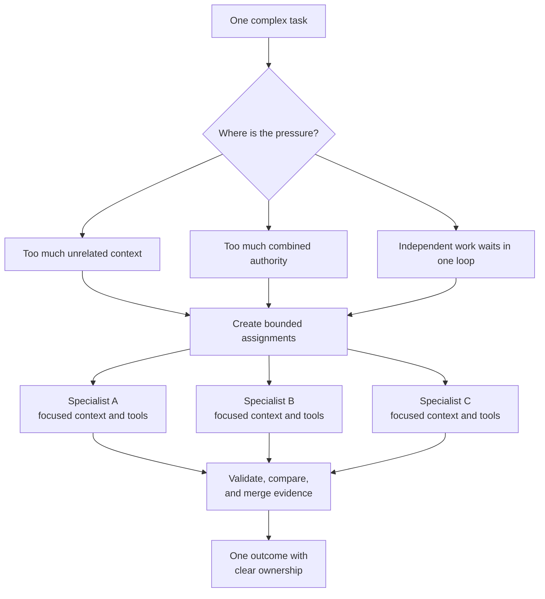
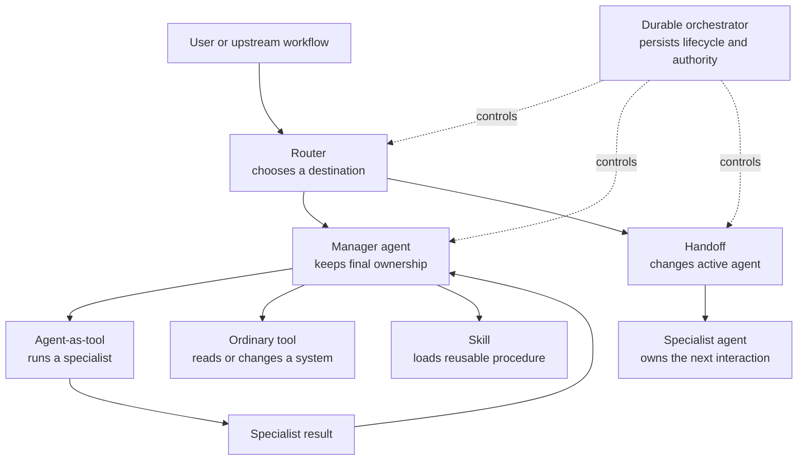
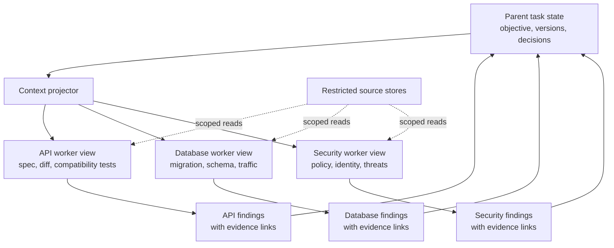
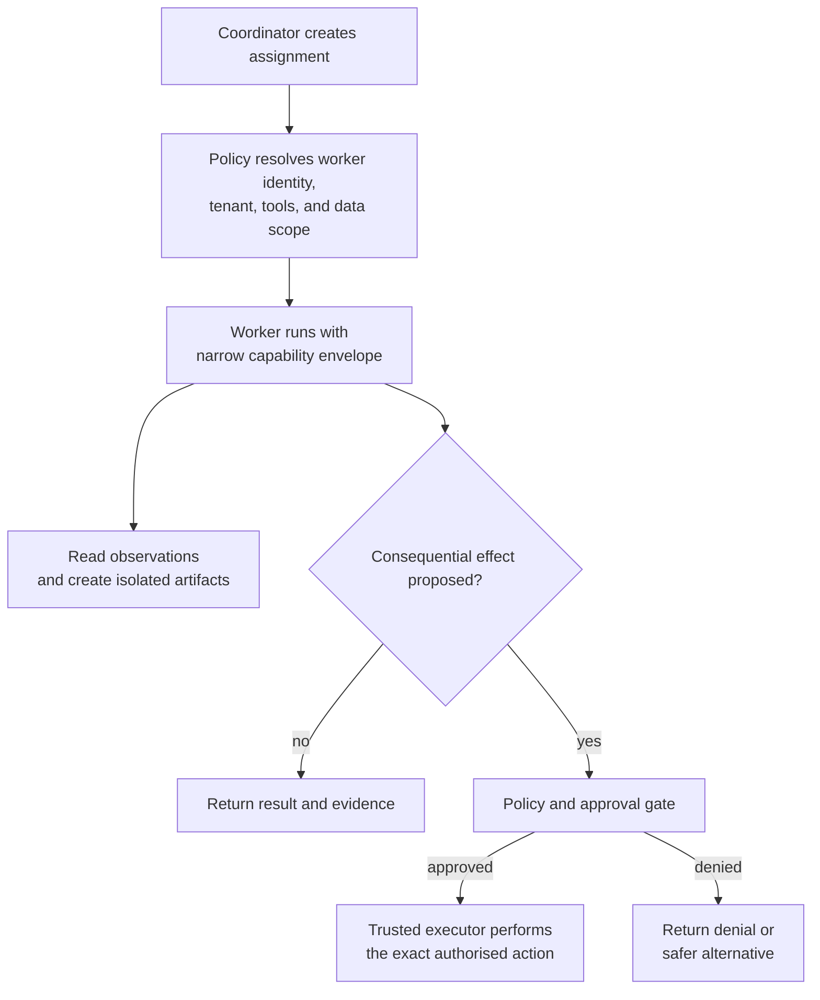
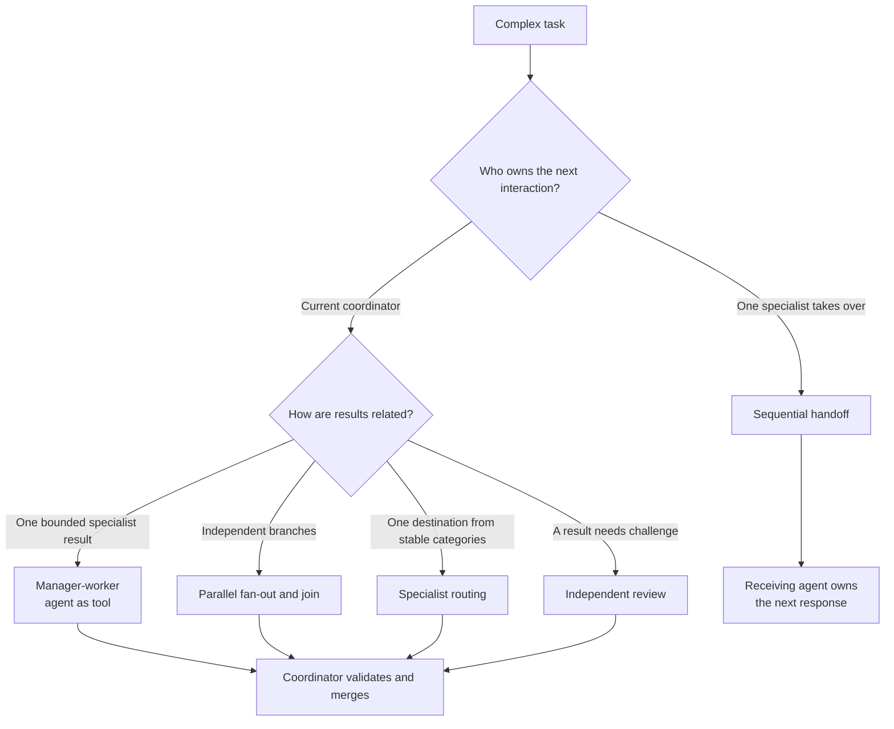
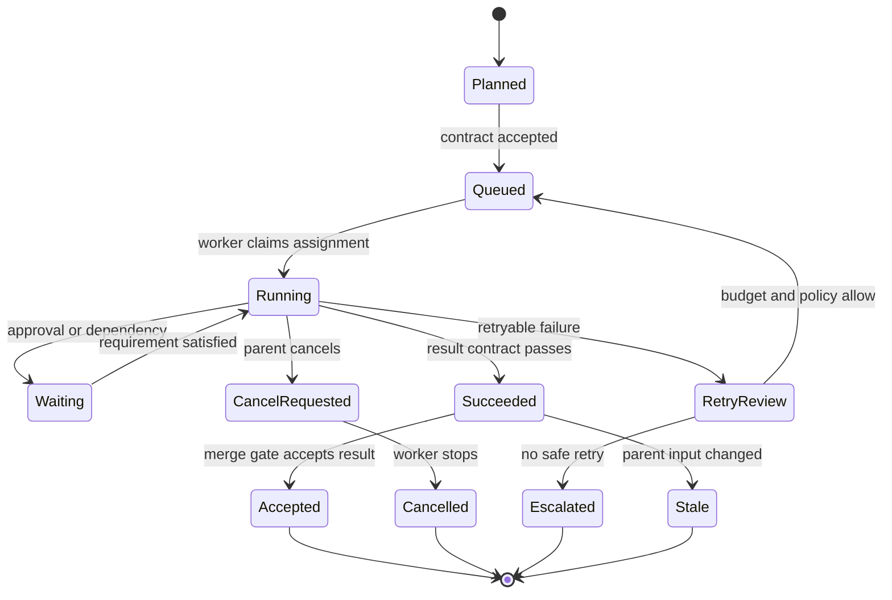
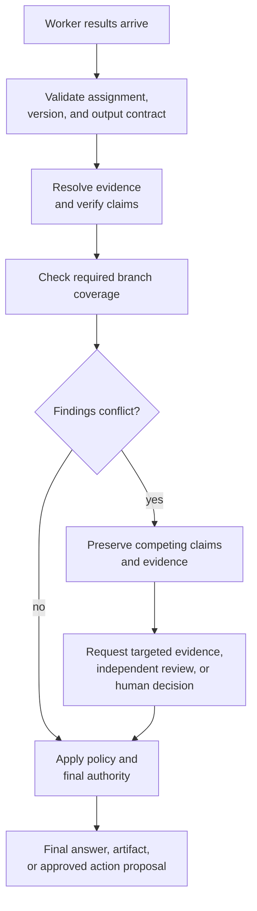
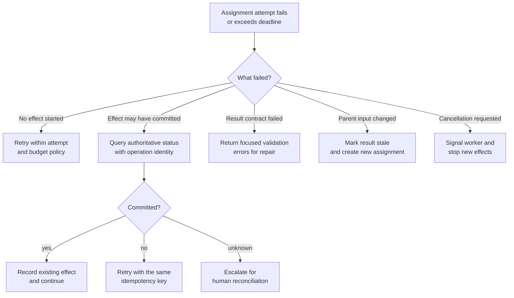
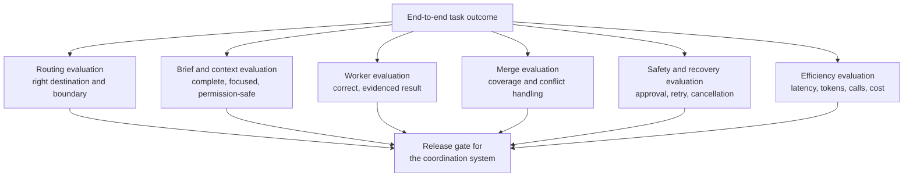
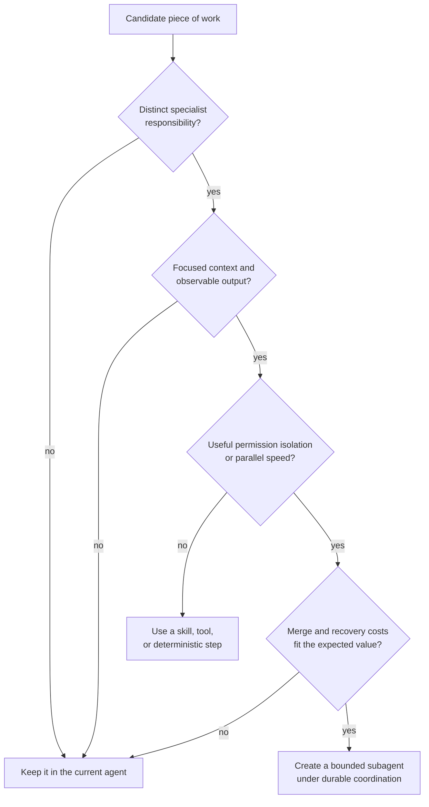

## Table of Contents

1. [Why One Agent Should Not Own Every Task](#why-one-agent-should-not-own-every-task)
2. [Understand Delegation, Routing, Handoffs, And Review](#understand-delegation-routing-handoffs-and-review)
3. [Define The Delegated Task And Expected Result](#define-the-delegated-task-and-expected-result)
4. [Give Each Worker Focused Context](#give-each-worker-focused-context)
5. [Limit Worker Authority](#limit-worker-authority)
6. [Choose The Multi-Agent Pattern From Ownership And Dependencies](#choose-the-multi-agent-pattern-from-ownership-and-dependencies)
7. [Store Delegated Work In Durable State](#store-delegated-work-in-durable-state)
8. [Merge Worker Results Into One Decision](#merge-worker-results-into-one-decision)
9. [Handle Cancellation, Timeouts, And Partial Failure](#handle-cancellation-timeouts-and-partial-failure)
10. [Require Approval For The Exact Multi-Agent Action](#require-approval-for-the-exact-multi-agent-action)
11. [Trace And Evaluate The Complete Delegation System](#trace-and-evaluate-the-complete-delegation-system)
12. [Use One Agent If The Delegation Boundary Is Unclear](#use-one-agent-if-the-delegation-boundary-is-unclear)
13. [References](#references)

## Why One Agent Should Not Own Every Task
<!-- section-summary: Subagents divide complex work after one agent can no longer hold the required context, authority, and independent tasks inside one clear operating boundary. -->

A large task may contain several investigations that need separate context, tools, or ownership. **Subagents are bounded workers that take those smaller jobs.** Each receives a focused view of the evidence and only the capabilities required for its part, while a coordinator tracks the overall objective and decides what to do with the results.

Imagine a release review that covers an API change, a database migration, and a security policy update. One agent can inspect all three. As the review grows, it also has to hold several sets of files, tool descriptions, test results, and risk rules in the same working context. It may receive database credentials for one check and deployment access for another. Independent investigations run one after another, even though they could proceed at the same time.

The pressure comes from three directions:

- **Context pressure:** unrelated evidence competes for the model's attention and token budget.
- **Authority pressure:** one runtime accumulates tools and credentials from several trust domains.
- **Work pressure:** independent tasks wait behind one agent loop, and a failure can interrupt all progress.

A multi-agent design can separate those pressures. An API specialist reviews compatibility. A database specialist checks locking and rollback. A security specialist examines the policy change. The coordinator receives structured findings and produces one release recommendation.

That split also creates a new system to operate. Someone must create assignments, select context, enforce permissions, collect results, resolve disagreement, handle cancellation, and preserve progress across failures. More agents increase coordination work, so the design only pays off after the boundaries are real.


```mermaid
flowchart TD
    U["One complex task"] --> P{"Where is the pressure?"}
    P --> C["Too much unrelated context"]
    P --> A["Too much combined authority"]
    P --> W["Independent work waits in one loop"]
    C --> D["Create bounded assignments"]
    A --> D
    W --> D
    D --> S1["Specialist A<br/>focused context and tools"]
    D --> S2["Specialist B<br/>focused context and tools"]
    D --> S3["Specialist C<br/>focused context and tools"]
    S1 --> M["Validate, compare,<br/>and merge evidence"]
    S2 --> M
    S3 --> M
    M --> O["One outcome with<br/>clear ownership"]
```

The useful question is therefore, “Which boundary should this worker own?” A job title in a prompt supplies no isolation by itself. The assignment, context, runtime identity, result contract, and coordinator create the production boundary.


*Three specialists inspect the same release candidate through separate context and permission boundaries; only the coordinator owns the final recommendation.*

## Understand Delegation, Routing, Handoffs, And Review
<!-- section-summary: Subagents, specialist agents, agent tools, handoffs, routers, skills, ordinary tools, and orchestrators solve different parts of a coordinated system. -->

Multi-agent discussions use several similar terms. A beginner can separate them by following two questions: **who makes the next decision, and who owns the user-facing task?**

A **specialist agent** is an agent configuration designed for a particular class of work. It may have domain instructions, a dedicated skill set, selected tools, and a constrained runtime. A security-review agent and a data-quality agent are examples.

A **subagent** describes the specialist's relationship to a larger run. The coordinator delegates a bounded assignment, the subagent performs it, and a result returns to the parent. The same specialist can run alone in one product and act as a subagent in another.

An **agent-as-tool** exposes a specialist through a tool-shaped interface. The manager calls it, receives its output, and keeps control of the main conversation. In current OpenAI Agents SDK terminology, `Agent.as_tool()` implements this manager pattern.

A **handoff** transfers active responsibility to another agent. The receiving specialist takes over as the current agent for the next part of the interaction. The earlier agent may have routed the request, but it no longer owns that immediate response.

An **ordinary tool call** asks deterministic software or an external service to perform an operation. A function that reads a deployment record has no independent model loop. A deployment specialist can reason over several tool results before returning a finding.

A **skill** loads reusable operating knowledge into the current agent. The agent remains the decision-maker. A skill is often the smaller choice if the main problem is missing procedure or reference material.

A **router** decides where work should go. A stable account type can route through ordinary code. Ambiguous natural language may need a model classification. Routing ends after dispatch unless another coordination layer collects or combines several results.

A **durable workflow or orchestrator** owns the run lifecycle. It persists assignments, states, deadlines, retries, approvals, and completion. It may call agents, tools, or deterministic services at different states.


```mermaid
flowchart TD
    U["User or upstream workflow"] --> R["Router<br/>chooses a destination"]
    R --> M["Manager agent<br/>keeps final ownership"]
    R --> H["Handoff<br/>changes active agent"]
    M --> AT["Agent-as-tool<br/>runs a specialist"]
    M --> T["Ordinary tool<br/>reads or changes a system"]
    M --> K["Skill<br/>loads reusable procedure"]
    AT --> SR["Specialist result"]
    SR --> M
    H --> SA["Specialist agent<br/>owns the next interaction"]
    O["Durable orchestrator<br/>persists lifecycle and authority"] -. "controls" .-> R
    O -. "controls" .-> M
    O -. "controls" .-> H
```

Consider a request to investigate a failed data pipeline. A diagnostics skill can teach one agent the investigation method. Metrics and log tools supply live evidence. A specialist subagent can examine Spark execution while the manager investigates the upstream data source. A handoff fits after the issue clearly belongs to the data-platform team and that specialist should continue with the user. A durable workflow fits after the investigation can pause for hours, survive a restart, or trigger an approved repair.

The boundaries can compose. A router selects an incident coordinator. The coordinator calls two specialists as tools. One specialist loads a domain skill. The surrounding workflow records their assignments and pauses before a production change.

## Define The Delegated Task And Expected Result
<!-- section-summary: A delegation contract tells one worker exactly what outcome it owns, which evidence and authority it receives, and when it must stop or escalate. -->

“Investigate the problem” sounds clear to the person who already knows the system. A worker can interpret it in many ways. It may inspect the wrong time window, call an expensive tool repeatedly, return a polished summary with no evidence, or change a resource that the coordinator only wanted reviewed.

A **delegation contract**, sometimes called a worker brief, turns the request into a bounded unit of work. It contains:

- one objective and the reason that result is needed;
- the scope, exclusions, and current input versions;
- selected context and links to authoritative evidence;
- the required output shape and supporting evidence;
- permitted tools, data, credentials, and side effects;
- token, tool-call, cost, and wall-clock budgets;
- completion, stop, and escalation conditions.

Here is a compact brief for a read-only migration review:

```yaml
assignment_id: release-review-db-1
objective: "Assess whether the proposed schema migration can block writes."
scope:
  files: ["migrations/add_order_status.sql"]
  database_engine: "PostgreSQL"
  environment: "production-like staging"
context:
  release_commit: "reviewed-commit-digest"
  schema_snapshot: "catalog://orders/schema/current"
  traffic_profile: "metrics://orders/write-profile"
permissions:
  tools: ["read_file", "query_catalog", "run_explain_in_staging"]
  effects: []
output:
  schema: "migration_finding_v2"
  required: ["risk", "evidence", "safe_rollout", "rollback", "unknowns"]
limits:
  tool_calls: 10
  deadline_seconds: 180
stop_conditions:
  - "staging schema differs from the supplied snapshot"
  - "the review requires production data access"
escalate_to: "release-coordinator"
```

The objective names a decision the parent can use. The scope prevents the specialist from drifting into unrelated release work. Versioned inputs protect the review from silent changes during execution. The output contract tells the coordinator what it can validate before accepting the finding.

Permissions and limits belong inside the job contract. This worker can run an explain plan in staging and has no production-write capability. If the staging schema differs, continuing would produce evidence about the wrong system. The stop condition sends that mismatch back to the coordinator.

### Require Evidence With The Worker Result

A worker result should separate established facts, interpretation, recommendations, and unknowns. A migration specialist might return:

- **fact:** the statement requires a table rewrite on the staging version;
- **evidence:** query plan ID, engine version, and schema snapshot digest;
- **interpretation:** the rewrite can hold a lock beyond the release budget;
- **recommendation:** split the change into an additive migration and later cleanup;
- **unknown:** production table size exceeds the staging sample.

The parent can inspect that chain. A confidence score alone cannot reveal whether the worker queried the right database or inferred the answer from general knowledge.

### Confirm The Assignment Before Work Begins

Before expensive work starts, the worker can acknowledge the contract: restate the objective, list missing inputs, and confirm the authority boundary. This short exchange catches ambiguity while it is cheap to fix.

If the worker needs a new tool or wider data access, it returns an escalation request. It cannot silently expand its own scope. The coordinator can amend the assignment, create a separate worker, or ask a person for approval.

## Give Each Worker Focused Context
<!-- section-summary: Context isolation selects the smallest complete view for each assignment and keeps authoritative run state outside individual agent transcripts. -->

The main reason to create a specialist is often context control. Copying the parent's entire transcript into every worker throws away that advantage.

Each worker needs a **context projection**, which is a selected view of the information relevant to its contract. The task brief states the worker's objective. Input versions bind that objective to the current parent state, while a small evidence set supplies the facts needed for the assignment. Separate worker instructions describe the procedure and available tools. Unrelated conversations, private fields, and other workers' scratch work stay outside.

Suppose a release coordinator delegates three reviews:

- the API worker receives the changed endpoint specification and compatibility tests;
- the database worker receives the migration, schema snapshot, and traffic profile;
- the security worker receives the policy diff, identity model, and threat assumptions.

The workers share the release commit digest because it ties their findings to the same candidate. Each one receives only the source material for its own review. Their outputs return through stable evidence links, so the coordinator can retrieve detail during merge.


```mermaid
flowchart TD
    P["Parent task state<br/>objective, versions, decisions"]
    P --> C["Context projector"]
    C --> A["API worker view<br/>spec, diff, compatibility tests"]
    C --> D["Database worker view<br/>migration, schema, traffic"]
    C --> S["Security worker view<br/>policy, identity, threats"]
    A --> AR["API findings<br/>with evidence links"]
    D --> DR["Database findings<br/>with evidence links"]
    S --> SR["Security findings<br/>with evidence links"]
    AR --> P
    DR --> P
    SR --> P
    X["Restricted source stores"] -. "scoped reads" .-> A
    X -. "scoped reads" .-> D
    X -. "scoped reads" .-> S
```

Three kinds of state should remain distinct:

- **conversation state** explains what the user and active agent have discussed;
- **run state** records assignments, attempts, approvals, and completed transitions;
- **domain state** records the current truth in systems such as the release service or incident platform.

Run state remains authoritative after a worker says, “migration review complete.” The coordinator still needs the validated artifact, assignment status, and exact input digest. A conversation may call a release approved while the release service records a rejection.

Current OpenAI Agents SDK handoffs pass conversation history to the receiving agent by default. An `input_filter` can select or transform what the receiver sees. Agent-as-tool runs use their own nested state, and the parent conversation is only shared through an explicit session or another chosen state strategy. These APIs implement the same context-projection decision at different boundaries.

Privacy follows the projection. A specialist can read governed source data through a scoped tool and return a safe summary plus evidence ID. General traces and parent context carry the identifier and outcome, while the restricted payload remains in its protected store.

Context can also go stale. Record a context version or digest with the assignment. A worker that returns after the release commit changes should be marked stale, re-run against the new candidate, or treated as historical evidence. Quietly merging the old finding would connect a valid analysis to the wrong object.

## Limit Worker Authority
<!-- section-summary: The runtime gives each worker the minimum credentials and effects required for its assignment, while policy and human approval retain control of consequential actions. -->

Delegating reasoning never grants authority by itself. A sentence such as “you may deploy this fix” is only model input. The runtime decides which identity, tools, network routes, and data scopes the worker can actually use.

The safest design gives each worker a distinct capability envelope:

- a read-only investigator can query approved logs and metrics;
- a patch worker can write inside an isolated branch or workspace;
- a release worker can prepare a deployment proposal;
- a trusted executor can apply an approved change through the deployment system.

This separation limits blast radius. A log specialist has no reason to hold a production deployment token. A code reviewer can produce a patch without permission to merge it. A handoff to a billing specialist can expose billing records through a tenant-scoped service while keeping unrelated account data unavailable.


```mermaid
flowchart TD
    C["Coordinator creates assignment"] --> P["Policy resolves worker identity,<br/>tenant, tools, and data scope"]
    P --> W["Worker runs with<br/>narrow capability envelope"]
    W --> R["Read observations<br/>and create isolated artifacts"]
    W --> E{"Consequential effect proposed?"}
    E -->|no| O["Return result and evidence"]
    E -->|yes| G["Policy and approval gate"]
    G -->|approved| X["Trusted executor performs<br/>the exact authorised action"]
    G -->|denied| N["Return denial or<br/>safer alternative"]
```

Credential propagation deserves explicit design. Passing the parent's broad token into every nested call gives every specialist the parent's power. A better runtime exchanges the parent identity for a short-lived, assignment-scoped credential or calls a policy-enforcing service on the worker's behalf. The audit record keeps both the requesting parent and the executing workload identity.

Trust also applies to the worker package. A specialist can contain instructions, tools, dependencies, and retrieved material from different owners. Pin reviewed versions, verify package integrity, and apply the same supply-chain controls used for agent skills and ordinary services.

Current OpenAI Agents SDK supports approval gates around agents exposed as tools and around tools used inside nested agents. A sensitive request appears as an interruption on the outer run, where application code can approve or reject it before resuming. That mechanism supplies a pause point. Business policy still decides which requests qualify, who may approve them, and how long the decision remains valid.

## Choose The Multi-Agent Pattern From Ownership And Dependencies
<!-- section-summary: Manager-worker, routing, parallel fan-out, sequential handoff, and independent review patterns fit different ownership and dependency shapes. -->

The pattern should follow the shape of the work. Start with ownership: does one coordinator keep the final answer, or should another specialist take over? Then inspect dependencies: can tasks run independently, or does one result define the next assignment?

Ownership determines where the user conversation and final decision live. A manager pattern keeps both with one coordinator. A handoff moves the active conversation to the receiving specialist.

Dependencies determine the schedule. Independent branches can run together and meet at a join. A later step waits after its input depends on an earlier result. Independent review creates a separate branch because the second worker needs to challenge the first result.


```mermaid
flowchart TD
    T["Complex task"] --> O{"Who owns the next interaction?"}
    O -->|"Current coordinator"| D{"How are results related?"}
    O -->|"One specialist takes over"| H["Sequential handoff"]
    D -->|"One bounded specialist result"| M["Manager-worker<br/>agent as tool"]
    D -->|"Independent branches"| F["Parallel fan-out and join"]
    D -->|"One destination from stable categories"| R["Specialist routing"]
    D -->|"A result needs challenge"| V["Independent review"]
    M --> J["Coordinator validates and merges"]
    F --> J
    R --> J
    V --> J
    H --> N["Receiving agent owns<br/>the next response"]
```

### Use Manager-Worker For One Final Owner

In the **manager-worker pattern**, a central agent calls specialists and receives their results. The manager keeps the user conversation, decides whether another worker is needed, and produces the final answer.

This pattern fits a research synthesis, release review, or incident assessment where several specialists contribute to one decision. The workers need bounded outputs because the manager can otherwise receive several long essays and lose the benefit of context isolation.

Current OpenAI Agents SDK implements the pattern through `Agent.as_tool()`. The callable can expose structured parameters, a turn limit, hooks, and an approval requirement. The important production contract lives around that API: build a focused brief, validate the nested result, and retain the manager's authority boundary.

### Route Work To One Specialist

A **router** classifies a request and sends it to a specialist. It fits stable categories such as account access, billing, data quality, and deployment support.

Use ordinary code after an authoritative field already identifies the destination. If `service_owner_id` maps directly to the data-platform queue, a model adds uncertainty. A model router helps after the distinction depends on ambiguous language, such as separating a refund request from a duplicate-charge investigation.

Routing evaluation needs near misses and an explicit unknown path. A low-confidence request can return to a general coordinator or human triage. Forcing every input into a known category creates confident misroutes.

### Run Independent Work In Parallel

**Fan-out** creates several assignments. **Join** waits for the required results and combines them. The pattern saves wall-clock time after branches are genuinely independent.

A production-readiness review can run security, load, and rollback checks together. Training-data extraction and model evaluation have a dependency, so evaluation waits for the dataset. The dependency graph should determine concurrency.

Parallel work raises cost and conflict risk. Set a concurrency limit, cancel branches whose results are no longer needed, and define whether the join requires all workers or a named subset.

### Use Sequential Handoff To Transfer Ownership

A **sequential handoff** fits work whose next stage needs a different specialist to continue the interaction. A general support agent may establish that an account is locked, then transfer to an identity specialist who gathers the required verification and answers the user directly.

The handoff needs an acknowledgement and a safe return path. If the receiver is unavailable or rejects the assignment, ownership returns to a known coordinator. The run must never sit between two agents with neither responsible for the next action.

Current OpenAI Agents SDK represents handoffs as tools available to the model. The receiving agent takes over inside the same run, and handoff inputs can carry a small structured reason or priority. An input filter controls the history it receives.

### Use Independent Review To Challenge The Work

An **independent review pattern** sends a proposed result to a second worker with review criteria and source evidence. The reviewer looks for unsupported claims, missing cases, policy violations, or unsafe actions. It returns findings to a merge gate, which decides whether the proposal needs revision.

For example, one worker drafts an infrastructure change while another receives the diff, acceptance criteria, test output, and risk policy. The reviewer should have read-only access to the proposal and no authority to deploy it.

Independence is strongest after the reviewer receives a fresh context and can inspect primary evidence. Reusing the maker's complete reasoning history encourages the reviewer to follow the same assumptions. A different prompt can help, although real independence comes from context, evidence, authority, and evaluation boundaries.

## Store Delegated Work In Durable State
<!-- section-summary: A durable orchestrator records assignments and transitions so delegated work can resume after waits, failures, restarts, and human decisions. -->

An ordinary agent loop can call a model, execute tools, process a handoff, and stop after a final answer. That is enough for short work inside one process. A release investigation that lasts an hour or pauses overnight needs a stronger lifecycle.

The coordinator must preserve several facts outside model context:

- which assignments were created and from which input version;
- which worker and attempt currently own each assignment;
- which branches succeeded, failed, timed out, or were cancelled;
- which artifacts and evidence belong to each result;
- which approval is pending and who may decide it;
- which external effects were proposed or committed;
- which results have already entered the final merge.

A **durable orchestrator** persists those facts and applies legal transitions. The model can propose a worker or next step. Application state commits the assignment once, controls concurrency, and decides whether a late result still belongs to the active run.


```mermaid
stateDiagram-v2
    [*] --> Planned
    Planned --> Queued: contract accepted
    Queued --> Running: worker claims assignment
    Running --> Waiting: approval or dependency
    Waiting --> Running: requirement satisfied
    Running --> Succeeded: result contract passes
    Running --> RetryReview: retryable failure
    Running --> CancelRequested: parent cancels
    RetryReview --> Queued: budget and policy allow
    RetryReview --> Escalated: no safe retry
    CancelRequested --> Cancelled: worker stops
    Succeeded --> Accepted: merge gate accepts result
    Succeeded --> Stale: parent input changed
    Accepted --> [*]
    Cancelled --> [*]
    Escalated --> [*]
    Stale --> [*]
```

The orchestrator can be small. A database table, queue, and worker process can support bounded assignments with clear states. LangGraph fits applications that benefit from explicit graph nodes, conditional transitions, interrupts, and checkpoints. Its production persistence uses a durable checkpointer; an in-memory saver loses checkpoints after restart. Temporal or another durable workflow engine fits work with long waits, process recovery, timers, retries, and child workflows.

Current OpenAI Agents SDK supports in-run handoffs and serializable run state for interruptions. Separate integrations connect the SDK to durable runtimes, including Temporal, Dapr, Restate, and DBOS. Those runtimes sit around the agent loop and provide lifecycle guarantees. Choose one from the system's recovery and operating needs.

Durable state also separates assignment history from conversation history. A compact user-facing summary can change over time. The assignment record retains the worker version, brief digest, context version, attempt count, result digest, and transition history needed for an audit or retry.

## Merge Worker Results Into One Decision
<!-- section-summary: Merge validates worker contracts, checks evidence and coverage, preserves disagreement, and applies final authority before producing one outcome. -->

Several plausible worker responses still require validation and comparison. **Merge** is the stage that turns those outputs into one supported decision.

The merge owner first validates the result contract. It checks assignment identity, input version, required fields, artifact shape, and worker status. A malformed result returns for repair or enters the failed-branch path.

Next comes evidence. Source links must resolve, timestamps must fit the assignment, and claims must match the cited observations. A worker that says “tests passed” needs the test run ID and candidate digest. A result tied to an older release remains historical evidence.

Coverage asks whether every required branch returned. A release gate might require security and rollback findings while treating a documentation review as optional. The workflow should encode that difference before results arrive.

Conflict detection preserves disagreement. Suppose one worker recommends a deployment because the load test passes, while another blocks it because the rollback path cannot restore the old schema. Combining both into “mostly ready” would erase the blocking evidence. The merge owner records the conflicting claims, their sources, and the policy that determines precedence.


```mermaid
flowchart TD
    R["Worker results arrive"] --> C["Validate assignment,<br/>version, and output contract"]
    C --> E["Resolve evidence<br/>and verify claims"]
    E --> V["Check required branch coverage"]
    V --> X{"Findings conflict?"}
    X -->|no| A["Apply policy and<br/>final authority"]
    X -->|yes| F["Preserve competing claims<br/>and evidence"]
    F --> Q["Request targeted evidence,<br/>independent review, or human decision"]
    Q --> A
    A --> O["Final answer, artifact,<br/>or approved action proposal"]
```

The synthesis model should receive structured findings and selected evidence. Full worker transcripts usually stay outside its context. This focused view prevents a verbose worker from dominating the decision.

A partial result needs an explicit status. An incident coordinator can publish a preliminary impact summary while the root cause remains unknown. A release decision may fail closed after one required review times out. The caller should see which branch is missing, how that affects confidence or authority, and what will happen next.

Deterministic code should enforce assignment IDs, required branches, approvals, and schema checks. Model judgement can compare explanations, summarize compatible evidence, and identify questions for a follow-up worker. This division keeps mechanical guarantees outside probabilistic synthesis.

## Handle Cancellation, Timeouts, And Partial Failure
<!-- section-summary: Recovery classifies failures, reconciles uncertain effects, and retries bounded work without repeating external actions or accepting stale results. -->

Delegated work rarely fails as one clean event. One worker may succeed while another times out. A user may cancel after a write has started. The parent may restart while a specialist is waiting for approval. Recovery needs to preserve the completed evidence and identify the smallest safe action.

Begin by classifying the failure:

- **pre-execution failure:** the worker never claimed the assignment;
- **execution failure:** the worker failed before producing a valid result;
- **uncertain effect:** a tool timed out after the external system may have committed;
- **contract failure:** the worker returned output that validation rejected;
- **stale result:** the parent input changed before the result arrived;
- **cancelled work:** the task is no longer wanted.

Retry policy follows that classification. A read-only query can often retry with backoff. A malformed result can receive one repair attempt. A stale analysis needs a new input version. An uncertain write needs reconciliation against the authoritative system before any replay.


```mermaid
flowchart TD
    F["Assignment attempt fails<br/>or exceeds deadline"] --> C{"What failed?"}
    C -->|"No effect started"| R["Retry within attempt<br/>and budget policy"]
    C -->|"Effect may have committed"| Q["Query authoritative status<br/>with operation identity"]
    C -->|"Result contract failed"| P["Return focused validation<br/>errors for repair"]
    C -->|"Parent input changed"| S["Mark result stale<br/>and create new assignment"]
    C -->|"Cancellation requested"| K["Signal worker and<br/>stop new effects"]
    Q --> D{"Committed?"}
    D -->|yes| A["Record existing effect<br/>and continue"]
    D -->|no| I["Retry with the same<br/>idempotency key"]
    D -->|unknown| H["Escalate for<br/>human reconciliation"]
```

An **idempotency key** gives repeated attempts one stable operation identity. Suppose a worker asks a ticket service to create a change record and the response times out. The runtime queries the ticket service using the key. If the record exists, it stores that result. If it is absent, it repeats the request with the same key. A new key could create a duplicate record.

Cancellation is cooperative for running work. The orchestrator first records `cancel_requested` and stops dispatching dependent jobs. It then signals active workers and rejects late effects. A worker still needs separate deadlines for its model run, tool calls, and whole assignment because a lost process cannot respond to a cancellation message.

Partial failure policy belongs to the parent task. A research summary may proceed with two of three optional sources and disclose the gap. A production change should stop after a required safety review fails. These choices should be encoded before an incident tests them.

## Require Approval For The Exact Multi-Agent Action
<!-- section-summary: Human approval pauses the run at a consequential boundary and authorizes one reviewed action with a known scope, digest, and expiry. -->

Human approval matters after the system reaches a decision that software should not take alone. Typical examples include deploying to production, sending external communication, moving money, deleting data, or accepting a high-risk exception.

The reviewer needs an approval packet containing:

- the exact action and parameter digest;
- the target environment or business object;
- worker findings and evidence links;
- known risks and unresolved questions;
- predicted effects and rollback path;
- the requester, policy, expiry, and required approver role.

Approval attaches to that exact proposal. If a worker changes the target version, command, recipients, or parameters, the digest changes and the action returns to review.


*Approval covers one reviewed action digest. A changed, rejected, or expired proposal returns for review instead of reaching execution.*

Human approval should bind to one exact action. Agent identity remains a separate trust decision. “Trust the deployment agent for the rest of the run” can cover future commands the reviewer never saw. Broader standing approvals require a separate policy decision with carefully bounded parameters.

Current OpenAI Agents SDK human-in-the-loop flow pauses sensitive tool calls as interruptions. The application serializes `RunState`, records approvals or rejections, and resumes the original top-level run. Interruptions can also surface from a handoff destination or an agent running as a tool. Long waits still require durable storage, version compatibility, and an owner for expired requests.

A rejected action is a normal workflow outcome. The worker may offer a read-only report, revise the proposal, or stop. The system should preserve the rejection reason without pressuring the reviewer through repeated equivalent requests.

## Trace And Evaluate The Complete Delegation System
<!-- section-summary: Multi-agent evaluation separates routing, worker execution, merge, safety, cost, and recovery so the team can identify the layer that failed. -->

A final answer can look correct even though the system chose the wrong specialist, leaked excess context, retried an effect, or ignored a failed branch. Observability needs to show the path that produced the outcome.

One end-to-end trace should connect:

- parent run, workflow version, and user-visible objective;
- routing decision and candidate specialists;
- assignment IDs, worker versions, and attempt numbers;
- brief, context, and policy digests;
- tool calls, approvals, deadlines, and cancellation;
- result artifacts, evidence IDs, and validation outcomes;
- merge coverage, conflicts, and final authority;
- latency, token use, tool cost, and final outcome.

Sensitive payloads stay in governed stores. The trace carries stable identifiers, safe attributes, and access-controlled links. A parent coordinator may be allowed to see a redacted worker summary while the specialist's source evidence remains restricted.


```mermaid
flowchart TD
    T["End-to-end task outcome"] --> R["Routing evaluation<br/>right destination and boundary"]
    T --> B["Brief and context evaluation<br/>complete, focused, permission-safe"]
    T --> W["Worker evaluation<br/>correct, evidenced result"]
    T --> M["Merge evaluation<br/>coverage and conflict handling"]
    T --> S["Safety and recovery evaluation<br/>approval, retry, cancellation"]
    T --> E["Efficiency evaluation<br/>latency, tokens, calls, cost"]
    R --> G["Release gate for<br/>the coordination system"]
    B --> G
    W --> G
    M --> G
    S --> G
    E --> G
```

Evaluation should separate the layers. **Routing evaluation** measures correct destination, false delegation, missed delegation, and escalation. **Worker evaluation** measures factual quality, contract compliance, source support, and useful unknowns. **Merge evaluation** measures required coverage, conflict detection, and final decision quality. **Recovery evaluation** exercises timeouts, unavailable receivers, stale results, cancellation, uncertain writes, and restart.

Operational metrics tell the team how the topology behaves at scale. Useful signals include worker invocation rate, routing confusion, queue wait, assignment latency, timeout rate, retries, duplicate-effect count, stale-result rate, merge rejection, human escalation, end-to-end success, and cost per successful task.

Cost and latency require end-to-end interpretation. Three parallel calls may finish sooner than one serial investigation while consuming more tokens. A review worker may increase latency and reduce unsafe releases. The product outcome determines whether the trade is worthwhile.

Current OpenAI Agents SDK tracing records model generations, tool calls, handoffs, guardrails, and custom events inside traces and spans. OpenTelemetry or another observability backend can carry the wider application and infrastructure path. The essential requirement is a stable parent-child relationship between the user task, assignments, attempts, and effects.

Compare every multi-agent candidate against a simpler baseline. Test one agent with a focused skill first. Deferred tools or a deterministic workflow provide two other useful baselines. A multi-agent release should improve at least one important outcome, such as quality, isolation, parallel speed, or risk control. The measured gain needs to cover its extra operating cost.

## Use One Agent If The Delegation Boundary Is Unclear
<!-- section-summary: A task should remain with one agent when splitting creates more context transfer, shared state, and merge work than independent value. -->

A task can be large and still need one continuous line of reasoning. Splitting that work adds briefs, context transfer, and merge decisions while providing little independent progress. The design goal is the smallest topology that preserves a clear path from evidence to outcome.

Keep one agent if the next step depends continuously on the same evolving reasoning, the work shares one small context, or the result cannot be reviewed independently. Splitting a tightly coupled calculation across three workers forces them to exchange intermediate assumptions and gives the coordinator more opportunities to merge incompatible states.

Small tasks also lose to coordination overhead. Loading a skill or calling an ordinary tool may solve the real problem. A deterministic workflow fits a known sequence whose branches need no specialist judgement.

Before adding a worker, check five properties:

1. **Distinct responsibility:** the worker owns a recognizable job.
2. **Bounded context:** its useful inputs can fit in a focused projection.
3. **Narrow authority:** its permissions can be smaller than the parent's.
4. **Observable output:** evidence or an artifact can prove completion.
5. **Manageable dependency:** the parent can merge the result without constant hidden coordination.


```mermaid
flowchart TD
    T["Candidate piece of work"] --> R{"Distinct specialist<br/>responsibility?"}
    R -->|no| A["Keep it in the current agent"]
    R -->|yes| C{"Focused context and<br/>observable output?"}
    C -->|no| A
    C -->|yes| P{"Useful permission isolation<br/>or parallel speed?"}
    P -->|no| K["Use a skill, tool,<br/>or deterministic step"]
    P -->|yes| D{"Merge and recovery costs<br/>fit the expected value?"}
    D -->|no| A
    D -->|yes| S["Create a bounded subagent<br/>under durable coordination"]
```

A sound multi-agent system has the smallest topology that creates a real boundary. Every worker receives a contract, selected context, narrow authority, and a measurable result. The orchestrator preserves state and ownership. Merge protects evidence. Recovery protects effects. Human approval protects consequential decisions. Evaluation then proves whether the extra coordination improves the product.


*Delegate only when responsibility, context, authority, results, and dependencies form a useful boundary whose value exceeds the coordination cost.*

## References

- [OpenAI Agents SDK: Agent orchestration](https://openai.github.io/openai-agents-python/multi_agent/)
- [OpenAI Agents SDK: Agents as tools](https://openai.github.io/openai-agents-python/tools/#agents-as-tools)
- [OpenAI Agents SDK: Handoffs](https://openai.github.io/openai-agents-python/handoffs/)
- [OpenAI Agents SDK: Human-in-the-loop](https://openai.github.io/openai-agents-python/human_in_the_loop/)
- [OpenAI Agents SDK: Running agents](https://openai.github.io/openai-agents-python/running_agents/)
- [OpenAI Agents SDK: Tracing](https://openai.github.io/openai-agents-python/tracing/)
- [OpenAI: Agent evaluations](https://developers.openai.com/api/docs/guides/agent-evals)
- [LangChain: Multi-agent systems](https://docs.langchain.com/oss/python/langchain/multi-agent)
- [LangGraph: Persistence](https://docs.langchain.com/oss/python/langgraph/persistence)
- [Temporal: Workflow execution](https://docs.temporal.io/workflow-execution)
