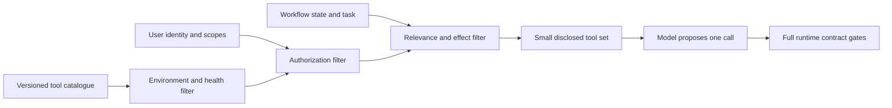
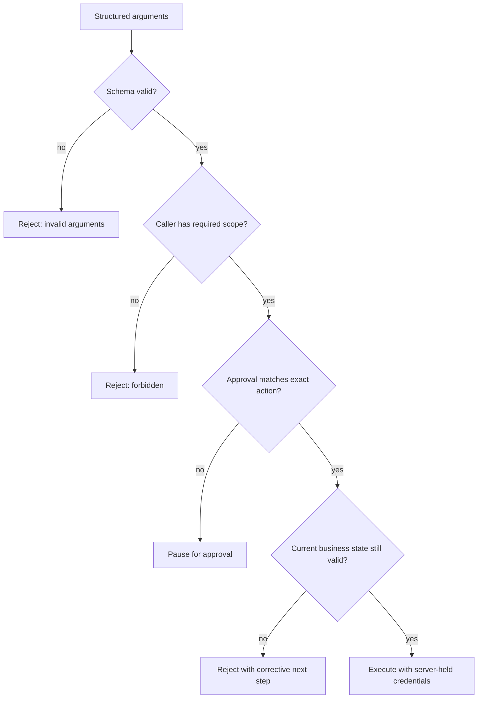

## A Tool Call Is a Proposal, Not Permission

<!-- section-summary: A model can propose a structured action, while trusted application code decides whether and how that action runs. -->

An LLM tool exposes a capability such as searching documents, reading an account, running a query, creating a ticket, or issuing a refund. The model chooses a tool and supplies arguments, but its output is still untrusted input. A syntactically correct call does not prove that the user is allowed to perform the action, that the requested state exists, or that the action is safe to repeat.

A **tool contract** is the complete agreement at this boundary. It includes what the model sees—name, purpose, and argument schema—and what the runtime must enforce: identity, authorization, approval, business rules, retry semantics, result shape, version compatibility, and audit evidence.


*A tool call crosses four distinct stages: the model proposes, trusted code governs, the server executes with durable controls, and the workflow receives a stable result.*

This separation is the foundation of safe tool use. The model can help decide what should happen. The application remains responsible for whether it may happen and for preserving the rules of the real system.

## The Contract Has Two Audiences

<!-- section-summary: The model needs a small, precise interface, while the runtime needs a wider operational and security contract. -->

The **model-facing contract** should be narrow. It describes when to use the tool and defines arguments with JSON Schema: types, required fields, enums, ranges, formats, and whether extra properties are forbidden. Clear field descriptions reduce ambiguity and help the model ask for missing information instead of inventing it.

The **runtime contract** is larger. It defines:

- which authenticated identities and scopes may invoke the tool;
- which facts must come from trusted session or workflow state;
- whether a person must approve the exact proposed action;
- which business invariants must hold at execution time;
- how duplicate requests and unknown outcomes are handled;
- which result states the caller can receive;
- what is logged, redacted, measured, and retained;
- which versions are compatible and how rollback works.

The model should not be allowed to assert trusted facts in its arguments. Fields such as `user_id`, `is_admin`, `customer_approved`, or a spending limit should normally come from authenticated application context. Otherwise, the model may copy an instruction from untrusted content or simply infer a value that the server mistakenly treats as authority.

## Discovery Determines Which Contracts Enter Context

<!-- section-summary: A tool catalogue stores operational truth, while a disclosure policy exposes only the eligible model-facing definitions for the current step. -->

Production systems may own hundreds of tools, yet one model step usually needs only a few. Passing the entire catalogue increases token use, creates overlapping choices, and exposes capabilities unrelated to the task. The runtime should separate the **tool catalogue** from the **disclosed tool set**.

The catalogue is an application record. It stores owner, purpose, contract version, effect class, required identity and scopes, data classification, supported environments, timeout, idempotency and reconciliation support, approval policy, health, and deprecation status. Most of that metadata never needs to enter model context.

The disclosure policy uses trusted workflow facts to choose eligible tools. A customer-support answer step may receive `search_policy` and `read_case`. A later refund-proposal state may add `propose_refund` when the authenticated user, tenant, case status, and product policy allow it. The model sees a concise name, description, and schema for each eligible tool. The runtime retains the wider policy evidence.



Tool search and deferred loading can help when the candidate set remains large. The model or host first searches compact tool metadata, then loads selected definitions. This is a context-management technique. The search result still passes the same eligibility and authorization filters; discovering a tool never grants permission to call it.

Descriptions shape selection behaviour and therefore belong under version control and evaluation. A vague pair such as `lookup_record` and `get_record` encourages arbitrary choices. State the business operation, required preconditions, important limitations, and whether the tool reads or proposes an effect. Keep descriptions short enough to compare. Put detailed policy enforcement in trusted code rather than asking the model to interpret several pages of tool documentation.

Evaluate disclosure separately from argument generation. For each workflow state, verify which tool identities should be present and absent. Then test whether the model selects correctly among the eligible definitions. A failure where a dangerous tool appeared too early belongs to disclosure policy; a failure where the model ignored the correct disclosed tool belongs to selection behaviour. Combining them under “wrong tool call” hides the owner.

## Design Tools Around One Business Operation

<!-- section-summary: A good tool performs one bounded operation with a clear success condition and ownership boundary. -->

Tool design begins before the schema. Choose an operation that the application can validate and observe. `create_support_ticket` is usually clearer than `handle_customer_problem`; `get_invoice` is clearer than `manage_billing`. A broad tool forces the model to hide several business decisions inside free-form arguments and makes permissions difficult to express.

A useful tool definition answers four questions:

1. What single capability does it expose?
2. When should and should not the model call it?
3. What information must the model provide?
4. What constitutes a successful, rejected, or uncertain outcome?

Read-only tools and side-effecting tools deserve different treatment. A document search can often be retried safely. A payment, deployment, deletion, or message send can create damage when repeated. The contract must classify the effect because approval and recovery policy depend on it.

## Schema Validation Is Only the First Gate

<!-- section-summary: JSON Schema validates the shape of a proposal; server-side policy validates its meaning and authority. -->

Consider a tool that places a temporary hold on an already quoted booking. The model-facing schema can be compact:

```json
{
  "name": "create_booking_hold",
  "description": "Place a 15-minute hold on one option from an existing quote after the user approves it.",
  "strict": true,
  "parameters": {
    "type": "object",
    "additionalProperties": false,
    "properties": {
      "quote_id": { "type": "string" },
      "option_id": { "type": "string" },
      "traveler_count": { "type": "integer", "minimum": 1, "maximum": 6 }
    },
    "required": ["quote_id", "option_id", "traveler_count"]
  }
}
```

Strict structured output can ensure that these fields are present and correctly typed. It cannot prove that the quote belongs to the current user, that its price is unchanged, that the option is still available, that the caller has booking permission, or that approval covers this exact proposal. Those are **business invariants** and must be checked against authoritative data immediately before execution.

The trusted runtime should also attach the active user, tenant, trace, policy version, credentials, and approval evidence. Secrets should never be exposed in model-visible arguments. The tool adapter receives them from a secret manager or workload identity after authorization succeeds.



Ordering matters. Cheap structural checks should happen before network calls. Authorization should happen before sensitive data is loaded or a side effect is attempted. Business validation should use current state, because a price, record status, or deployment target may have changed since the model saw it.

## Approval Must Bind to the Exact Action

<!-- section-summary: Human approval is meaningful only when it identifies the operation and values that will actually be executed. -->

An approval such as "yes" is weak if the underlying proposal can change afterward. For high-impact tools, show the person a normalized summary: operation, target, important values, and expected effect. Store approval evidence against a stable fingerprint of that proposal. If the amount, target, or other protected field changes, the fingerprint changes and the runtime requires approval again.

Approval is also not the same as authorization. A user may approve a refund but lack permission to issue it. Conversely, an authorized operator may still need a second person to approve a production deletion. The contract should state both rules and identify which system supplies their evidence.

Some tools do not need human approval. Read-only, low-risk operations may run automatically within narrow scopes. The goal is proportional control, not adding a confirmation dialog to every call.

## Idempotency Protects Side Effects

<!-- section-summary: Idempotency lets repeated delivery of one intended operation return one outcome instead of creating duplicate effects. -->

Distributed systems cannot assume exactly-once delivery. A tool may complete in the downstream service while its response is lost. The agent runtime sees a timeout and may retry. Without protection, one intended refund can create two refunds.

An **idempotency key** identifies one intended operation. Trusted application code derives or assigns it; the model should not choose it. The service stores the key with a fingerprint of the normalized request and the current state:

- `started`: one worker owns execution;
- `succeeded`: replay the stored safe result;
- `failed_safe`: the service knows no effect occurred and policy may allow another attempt;
- `indeterminate`: the downstream effect may have happened and must be reconciled.

If the same key arrives with different arguments, return an idempotency conflict. If two workers receive the same request concurrently, only one should acquire execution; the other observes the existing record. When the downstream API supports idempotency, forward the same key across that boundary.

The difficult case is an **unknown outcome**. If a deployment API accepted a request and then the connection broke, automatically trying again may be unsafe. The runtime should query the downstream system by operation ID or idempotency key. If no reconciliation interface exists, stop automatic retries and route the case to a person or compensating workflow. Calling such an outcome "failed" would be a dangerous guess.


*Approval binds to the exact action, while the idempotency record tells the runtime whether to replay, retry, reconcile, or stop when delivery becomes uncertain.*

Idempotency does not make every tool retryable. It gives the service enough state to decide whether replay, rejection, reconciliation, or a new attempt is correct.

## Return Meaning, Not Raw Provider Output

<!-- section-summary: A result envelope gives the workflow stable states and safe next actions without exposing internal provider responses. -->

Raw downstream responses are poor tool results. They change across providers, may contain sensitive data, and force the model to interpret infrastructure errors. A **result envelope** translates them into stable application semantics.

A useful envelope distinguishes:

- `success`: the requested operation completed;
- `rejected`: the request was understood but violates a rule or current state;
- `retryable_error`: no effect occurred and a bounded retry is allowed;
- `indeterminate`: the effect may have occurred, so automatic retry is blocked;
- `failed`: the operation did not complete and another route or human action is required.

It should include a safe data payload, a machine-readable error code, a short corrective action, trace identity, tool version, and explicit retry guidance. For example:

```json
{
  "status": "rejected",
  "tool": "create_booking_hold",
  "version": "2026-07-01",
  "trace_id": "trc_01J...",
  "data": null,
  "error": {
    "code": "price_changed",
    "message": "The quoted total changed.",
    "next_action": "Show the new total and request approval again."
  },
  "automatic_retry_allowed": false
}
```

The message guides the workflow without exposing a partner error code or stack trace. Detailed diagnostics belong in protected logs linked by the trace ID. The envelope is part of the public contract and needs compatibility tests just like the input schema.

## Version the Whole Boundary

<!-- section-summary: A tool version represents input, policy, effect, and result semantics—not only a JSON schema file. -->

A change can be breaking even when JSON still validates. Renaming a field is obviously incompatible, but changing the meaning of "cancel," adding a mandatory approval, or making an operation asynchronous also changes the contract. Version the model definition, runtime validation, result semantics, and relevant policy as one release unit.

Prefer additive optional fields when their absence has an unambiguous meaning. Use a new version when required inputs, permissions, effects, or result states change. During migration, the registry can expose both versions while telemetry shows which agents still call the old one. Define a deprecation window and a rollback path before removing it.

A tool registry should record owner, effect class, active versions, required scopes, approval policy, timeout, idempotency support, data classification, and support contact. This is operational metadata, not model context; the orchestrator can disclose only the portion the model needs.

## Test the Boundary in Layers

<!-- section-summary: Contract tests cover syntax, policy, effects, recovery, and compatibility as separate responsibilities. -->

Schema tests should accept valid examples and reject missing, extra, mistyped, and out-of-range fields. Policy tests should verify identity, tenant isolation, scopes, approval binding, and current business rules. Effect tests should show that concurrent duplicates create one downstream action and that a reused key with changed arguments is rejected.

Recovery tests are especially important. Simulate a downstream success followed by a lost response, then prove that reconciliation finds the existing effect rather than creating another one. Test each result state and confirm that raw secrets or personal data never enter the model-visible envelope. Compatibility tests run supported agent and tool versions together.

In evaluation, measure more than whether the model chose the correct tool. Check whether it asked for missing information, avoided tools when no action was needed, selected arguments supported by the conversation, responded correctly to rejection, and stopped when the outcome was indeterminate.

## What a Production Tool Contract Provides

<!-- section-summary: A mature tool contract makes every transition from proposal to real-world effect explicit and reviewable. -->

A production tool has one bounded purpose, a strict model-facing schema, trusted runtime context, least-privilege authorization, explicit approval rules, current-state validation, and an effect-aware retry policy. Side effects use durable idempotency and reconciliation. Results use a stable envelope. Versions, owners, traces, redaction, and tests are part of the same contract.

The central idea is that structured output solves only the first few metres of the boundary. The difficult engineering lies between valid JSON and a safe real-world effect. Keeping those layers visible helps beginners understand why a function definition is not the tool runtime, and helps production teams review exactly where authority and responsibility live.


*The complete contract joins the small interface the model sees with the larger runtime, evidence, release, and testing responsibilities that make an effect safe.*

## References

- [OpenAI function calling](https://developers.openai.com/api/docs/guides/function-calling)
- [OpenAI Structured Outputs](https://developers.openai.com/api/docs/guides/structured-outputs)
- [OpenAI tools guide](https://developers.openai.com/api/docs/guides/tools)
- [OpenAI Agents SDK tools](https://openai.github.io/openai-agents-python/tools/)
- [JSON Schema documentation](https://json-schema.org/learn/getting-started-step-by-step)
- [OWASP API Security Top 10](https://owasp.org/API-Security/)
- [OpenTelemetry GenAI semantic conventions repository](https://github.com/open-telemetry/semantic-conventions-genai)
