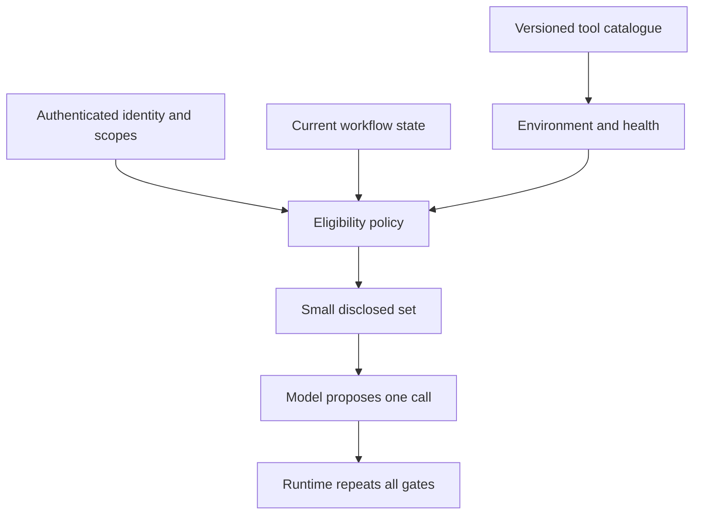
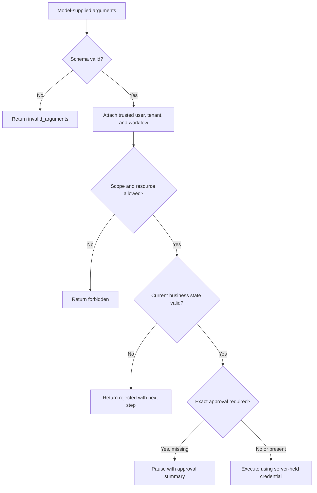

## Table of Contents

1. [Treat Every Tool Call As An Untrusted Proposal](#treat-every-tool-call-as-an-untrusted-proposal)
2. [Define The Proposal And Execution Halves](#define-the-proposal-and-execution-halves)
3. [Choose One Bounded Business Operation](#choose-one-bounded-business-operation)
4. [Use The Schema To Constrain Tool Arguments](#use-the-schema-to-constrain-tool-arguments)
5. [Show The Model Only Tools Allowed At The Current Step](#show-the-model-only-tools-allowed-at-the-current-step)
6. [Add Trusted Identity And Authority Outside The Model](#add-trusted-identity-and-authority-outside-the-model)
7. [Approve The Exact Proposed Action](#approve-the-exact-proposed-action)
8. [Prevent Duplicate Side Effects](#prevent-duplicate-side-effects)
9. [Define Stable Tool Result Categories](#define-stable-tool-result-categories)
10. [Version And Release The Tool Contract And Executor Together](#version-and-release-the-tool-contract-and-executor-together)
11. [Test And Monitor Every Tool Boundary](#test-and-monitor-every-tool-boundary)
12. [How The Complete Tool Boundary Works](#how-the-complete-tool-boundary-works)
13. [References](#references)

## Treat Every Tool Call As An Untrusted Proposal

<!-- section-summary: A model can suggest a structured action, while trusted application code decides whether that action is allowed and how it reaches the real system. -->

An LLM can read a request and suggest an action such as searching a knowledge base, creating a ticket, issuing a refund, or starting a deployment. The suggestion may arrive as tidy JSON with the correct tool name and every required field. Real authority still lives in the application and the service that owns the data.

Consider one complete tool call. A user reports a duplicate charge and asks for the second payment to be refunded. The model selects `propose_refund` and supplies the payment ID, amount, currency, and reason. The application then performs a series of checks:

1. the fields match the tool schema;
2. the authenticated user owns the payment;
3. the support operator has the required scope;
4. the payment service confirms that the charge is settled and still refundable;
5. the user approves the exact payment and amount;
6. the payment service receives a durable idempotency key;
7. the runtime records one outcome and returns a safe result.

The visible result is a single refund reference, or a clear rejection that explains the next valid step. If the network breaks after the payment service accepts the request, the runtime checks the existing operation before it attempts anything else. The model never receives payment credentials and never decides that the caller has permission.

A **tool** is the capability exposed to the model. A **tool call** is the model's proposed use of that capability. A **tool contract** is the complete agreement that carries the proposal into trusted software. It covers the model-visible name and schema, the runtime controls around execution, the meaning of each result, and the evidence needed for release and investigation.


*The model proposes a bounded operation. Trusted software validates the proposal, applies authority and safety controls, executes through server-held credentials, and returns a stable result.*

A production tool has five responsibilities: describe one operation, restrict what enters execution, prove authority, protect the effect, and report what happened. The input schema defines the proposed operation at the execution boundary. Trusted runtime controls carry the authority, effect-safety, and reporting responsibilities.

## Define The Proposal And Execution Halves

<!-- section-summary: The model-facing definition helps the model form a proposal, while the runtime contract governs whether and how the proposal runs. -->

The model needs a compact interface it can understand during one decision. Trusted software needs a wider agreement that covers security, reliability, and operations. Keeping these two views connected prevents the short model definition from being mistaken for the complete production boundary.

The **model-facing definition** usually contains a stable name, a plain description, and an input schema. Some providers also support an output schema or behavioural annotations. This definition should tell the model which business operation the tool represents, which information it must supply, and which important precondition may require another question.

The **runtime contract** starts after the model returns a call. It identifies the implementation version, trusted caller context, required scopes, approval policy, current-state checks, downstream credentials, timeout, retry rules, idempotency behavior, result states, redaction policy, telemetry, and owner. Most of this information stays outside the model context.

```mermaid
flowchart TD
    A["Model-facing definition"] --> B["Name and purpose"]
    A --> C["Input schema"]
    A --> D["Selection guidance"]

    E["Runtime contract"] --> F["Identity and authorization"]
    E --> G["Approval and business rules"]
    E --> H["Execution and recovery"]
    E --> I["Results, audit, and versions"]

    B --> J["Proposed tool call"]
    C --> J
    D --> J
    J --> E

    class A,B,C,D model
    class E,F,G,H,I runtime
    class J call
```

The boundary also has two audiences among engineers. Agent developers evaluate whether the model selects the right tool and fills its fields from evidence. Service owners verify permissions, invariants, effects, and recovery. A tool can perform well for one audience and fail badly for the other. Separating those test results leads an incident to the right owner.

## Choose One Bounded Business Operation

<!-- section-summary: A strong tool represents one operation with a clear owner, effect, success condition, and recovery path. -->

Tool design starts with the operation, before any JSON is written. A useful operation has one purpose that the receiving service can validate and observe. `create_support_ticket` describes a specific effect. `handle_customer_problem` hides investigation, policy, drafting, and ticket creation inside one vague instruction.

The right size follows the business boundary. A tool may combine several low-level API requests if they form one atomic operation owned by one service. Reserving stock and creating a short-lived hold may belong together if the booking service guarantees one result. Searching policies and sending a customer email usually belong in separate tools because they use different permissions, evidence, and failure rules.

Four questions expose an unclear boundary:

1. Which system owns the authoritative state?
2. What single outcome should exist after success?
3. Which failures can the caller recover from safely?
4. Which permission and approval protect the operation?

The effect class matters as well. A read-only lookup can often use a bounded retry after a timeout. A payment, deletion, message send, or production change needs durable duplicate protection and a plan for an uncertain outcome. A long-running operation may return a job handle rather than hold one request open. These choices belong in the contract because the orchestrator needs them to control the run.

Descriptions should state the real boundary in ordinary language. “Create a ticket in the approved project after the required evidence has been collected” guides selection better than “Manage tickets.” The detailed permission logic still runs in trusted code; a description informs model behavior and never grants authority.

## Use The Schema To Constrain Tool Arguments

<!-- section-summary: JSON Schema constrains the fields a model may propose, while semantic and business checks establish whether those values make sense. -->

The schema turns free-form model output into an object that application code can validate. In essence, it defines the shape of the request: field names, types, required values, allowed enums, numeric bounds, and whether unknown properties are accepted.

Suppose the refund workflow has already established the payment and amount shown to the user. The model-facing tool needs only the fields the model can legitimately propose:

```json
{
  "name": "propose_refund",
  "description": "Propose a refund for one settled payment after the user confirms the payment, amount, and reason.",
  "input_schema": {
    "$schema": "https://json-schema.org/draft/2020-12/schema",
    "type": "object",
    "additionalProperties": false,
    "properties": {
      "payment_id": {
        "type": "string",
        "description": "The settled payment selected from the trusted payment lookup."
      },
      "amount_minor": {
        "type": "integer",
        "minimum": 1,
        "description": "Refund amount in the currency's minor unit, such as cents."
      },
      "currency": {
        "type": "string",
        "enum": ["GBP", "EUR", "USD"]
      },
      "reason": {
        "type": "string",
        "enum": ["duplicate", "service_not_received", "other"]
      }
    },
    "required": ["payment_id", "amount_minor", "currency", "reason"]
  }
}
```

`additionalProperties: false` catches accidental fields such as `approved_by` or `is_admin`. The integer amount avoids ambiguous decimal handling. The enum keeps the reason inside the downstream policy vocabulary. Field descriptions explain where values should come from instead of inviting the model to invent them.

Schema validation answers structural questions. It can confirm that `amount_minor` is a positive integer and `currency` is supported. It cannot establish that the payment belongs to this user, that the remaining refundable balance covers the amount, or that the user approved the current proposal. Those checks need authoritative records.

Most model providers expose tools through a name, description, and JSON-Schema-like input definition, yet supported schema features and strict modes vary. Validate the schema with the exact model API and SDK used in production. Keep a server-side validator even if the provider constrains generation, because calls can arrive from older clients, tests, queues, or a compromised caller.

## Show The Model Only Tools Allowed At The Current Step

<!-- section-summary: A governed catalogue records every tool, while a disclosure policy selects the small eligible set shown to the model for one step. -->

A production platform may own hundreds of tools. A single model step usually needs a handful. Sending the entire collection consumes context, creates overlapping choices, and exposes capabilities unrelated to the current task.

The **tool catalogue** stores operational truth: owner, purpose, contract version, effect class, required scopes, supported environments, data classification, timeout, idempotency support, approval policy, health, and deprecation state. The **disclosed tool set** is the smaller collection whose model-facing definitions enter the current context.

For a support conversation, the first step may expose `search_policy` and `read_case`. The refund tool appears only after trusted workflow state contains an authenticated account, a settled payment returned by the payment service, and a case type eligible for refund review. Disclosure narrows the model's choices. The runtime repeats authorization at execution because workflow state can be stale or corrupted.


```mermaid
flowchart TD
    A["Versioned tool catalogue"] --> B["Environment and health"]
    C["Authenticated identity and scopes"] --> D["Eligibility policy"]
    E["Current workflow state"] --> D
    B --> D
    D --> F["Small disclosed set"]
    F --> G["Model proposes one call"]
    G --> H["Runtime repeats all gates"]

    class A,C,E source
    class B,D,F,H control
    class G action
```

Large catalogues can use tool search or deferred loading. That is a context-management mechanism. The search index should contain only capabilities the caller is allowed to discover, and every loaded tool still passes disclosure and execution policy. Discovery supplies candidates; it never creates permission.

Evaluate disclosure separately from model selection. One test should assert which tool IDs are present for each workflow state. Another should check whether the model selects correctly among those tools. This distinction reveals whether a dangerous capability appeared too early or the model chose poorly from a correct set.

## Add Trusted Identity And Authority Outside The Model

<!-- section-summary: The runtime combines authenticated context, least-privilege credentials, current domain state, and policy before execution. -->

The model may mention a user, tenant, role, or approval in its arguments. Those values remain ordinary text. The runtime obtains trusted identity from the authenticated request, workload identity, signed workflow state, or another verified control-plane source.

### Separate Authentication From Authorization

Authentication answers who is calling. Authorization answers which operation that identity may perform on which resource. A remote service commonly uses OAuth or workload identity with a token restricted to the intended audience and scopes. A local service may use an operating-system identity or short-lived service credential. In both cases, the downstream service performs the final resource-level authorization.

The runtime also checks **business invariants**, which are rules that must hold at execution time. For the refund proposal, it loads the payment through the trusted account relationship, verifies the currency and remaining refundable amount, checks case policy, and confirms that no conflicting operation has completed. This fresh read closes the gap between what the model saw and what is currently true.


```mermaid
flowchart TD
    A["Model-supplied arguments"] --> B{"Schema valid?"}
    B -->|No| X["Return invalid_arguments"]
    B -->|Yes| C["Attach trusted user, tenant, and workflow"]
    C --> D{"Scope and resource allowed?"}
    D -->|No| Y["Return forbidden"]
    D -->|Yes| E{"Current business state valid?"}
    E -->|No| Z["Return rejected with next step"]
    E -->|Yes| F{"Exact approval required?"}
    F -->|Yes, missing| W["Pause with approval summary"]
    F -->|No or present| G["Execute using server-held credential"]

    class A,C input
    class B,D,E,F gate
    class X,Y,Z,W stop
    class G run
```

Secrets stay outside model-visible arguments and results. The adapter obtains them from a secret manager, workload identity, or managed credential after authorization succeeds. Tool traces should record credential type and policy decision, while token values remain absent.

A policy engine such as Open Policy Agent or Cedar can help an organization centralize complex authorization rules. A small application may keep the same rules in reviewed service code. The essential property is a deterministic, testable decision using trusted inputs and a recorded policy version.

## Approve The Exact Proposed Action

<!-- section-summary: A useful approval names the operation, target, important values, and effect that trusted code will execute. -->

Approval protects the point where a proposed action can create a meaningful effect. A generic “yes” carries little value if the payment, amount, destination, or environment can change afterward.

The runtime should normalize the protected fields and present a concise summary: operation, target, amount or configuration, expected effect, and any irreversible consequence. It stores approval evidence against a digest of that normalized proposal. A change to any protected field produces a different digest and sends the workflow back for review.

Authorization and approval answer different questions. Authorization establishes that the caller is allowed to request a refund. Approval records that the responsible person accepted this exact refund. Some operations also require separation of duties, where one identity prepares a production change and another approves it.

Controls should match the effect. A low-risk read may run automatically inside a narrow scope. A production deletion, external message, payment, or privilege change usually deserves explicit review. Repeated confirmation boxes on harmless reads train users to click through them, so policy should classify operations rather than apply one prompt to every tool.

Approval expires as business state changes. A quote accepted yesterday may no longer match today's price. Before execution, the service compares the approved digest and rechecks the authoritative record. Recovery evidence should identify the approver, proposal digest, policy version, execution time, and final effect.

## Prevent Duplicate Side Effects

<!-- section-summary: A durable operation identity lets retries recover one intended effect without creating duplicates. -->

Networks can fail after the receiving service has accepted an action. The caller sees a timeout and cannot tell whether the effect happened. Blindly repeating a refund, ticket creation, or deployment can create a second effect.

### Give Each Intended Write A Durable Identity

An **idempotency key** identifies one intended operation. Trusted application code creates it from the durable workflow operation; the model does not choose it. The server stores the key together with a digest of the normalized request and a state such as:

- `started`: one worker owns the attempt;
- `succeeded`: return the stored safe result;
- `failed_safe`: evidence proves that no effect occurred;
- `indeterminate`: the downstream system may have committed the effect.

The same key with different protected arguments is a conflict. Concurrent requests for the same key need one atomic claim, often implemented with a unique database constraint or conditional write. If the downstream provider supports its own idempotency token, the adapter forwards the same operation identity through that boundary.

### Reconcile Actions With An Unknown Outcome

An indeterminate result requires **reconciliation**, which means checking the downstream system before choosing the next action. The runtime first queries by idempotency key or provider operation ID. Some services instead require a lookup by the expected resource identity, such as the refund reference attached to a payment.

A completed refund turns the operation into `succeeded`, and the runtime returns the existing reference. Evidence that no effect occurred may permit a new attempt under policy. If the provider offers no reliable lookup, automation stops and routes the case to an operator. This branch preserves uncertainty instead of guessing that a timeout means failure.


*Approval identifies the accepted action. The idempotency record tells the runtime whether to replay a stored result, retry safely, reconcile an uncertain effect, or stop.*

Provider idempotency windows have limits. Stripe and several AWS APIs, for example, retain keys for bounded periods and reject a reused key with changed parameters. The application contract should record the provider's scope and retention, preserve its own operation record for the required audit period, and avoid promising stronger duplicate protection than the downstream system can supply.

Idempotency gives the runtime evidence for a safe decision. It cannot reverse an already completed effect. Compensation, such as creating a corrective payment or rolling back a deployment, is a separate governed operation with its own approval and identity.

## Define Stable Tool Result Categories

<!-- section-summary: A result envelope translates provider-specific responses into states the orchestrator can handle safely. -->

The workflow needs to know what happened and which next action is allowed. A raw HTTP status, stack trace, or provider payload rarely answers that reliably. Provider formats change, internal messages may reveal sensitive data, and a `500` cannot distinguish a safe retry from an unknown effect.

### Use The Result Envelope To Choose The Next Safe Step

A **result envelope** maps downstream behavior into stable application states. A compact contract may use:

- `success`: the operation completed and includes a durable reference;
- `rejected`: current policy or domain state prevents the operation;
- `retryable_error`: evidence proves that no effect occurred and a bounded retry is allowed;
- `indeterminate`: the effect may exist and reconciliation is required;
- `failed`: the operation ended without a valid automatic recovery.

```json
{
  "status": "rejected",
  "tool": "propose_refund",
  "contract_version": "refund-v4",
  "operation_id": "op_01K...",
  "trace_id": "trc_01K...",
  "data": null,
  "error": {
    "code": "amount_exceeds_refundable_balance",
    "message": "The requested amount is above the remaining refundable balance.",
    "next_action": "Read the current balance and ask the user to confirm a valid amount."
  },
  "automatic_retry_allowed": false
}
```

The model receives the safe message and next action. Protected logs retain the detailed provider response under the trace and operation IDs. An output schema can help clients validate the envelope, while service code still decides which provider failures map to each state.

### Separate Protocol Failures From Business Outcomes

Keep protocol errors separate from tool outcomes. A malformed request, unsupported contract version, or failed authentication means the call never reached normal business execution. A valid request rejected because the refund window closed is a business result. That distinction shapes retry behavior, monitoring, and user messaging.

## Version And Release The Tool Contract And Executor Together

<!-- section-summary: Contract versions cover input, meaning, authority, effects, results, and compatibility rather than only the JSON schema. -->

A tool can change behavior while its input still validates. A cancellation may gain a non-refundable fee. A workflow may require a second approver. A synchronous operation may move to a background job. Each change alters the contract because the effect or the caller's obligations changed.

Version the model-facing definition, runtime validator, policy expectations, implementation, result envelope, and evaluation set as one release unit. Record the deployed combination so a trace can identify the exact behavior behind a call.

An additive optional field is compatible only if existing consumers have one clear behavior in its absence. A new required field or changed enum meaning usually needs a new contract version. The same applies to a broader effect, tighter permission, or different retry guarantee.

During migration, the catalogue can expose both versions to selected workflows. Telemetry then shows which agent runs still use the older contract.

Treat descriptions as behavior-bearing code. A wording change can alter tool selection even if the schema is identical. Run tool-choice and argument-generation evaluations before production disclosure. Release first to tests, then shadow or canary traffic, compare selection and outcome metrics, and retain the previous implementation and catalogue policy for rollback.

Deprecation needs an owner, usage evidence, a removal condition, and a compatibility window. If old agent runs can resume from checkpoints, their contract version must remain executable or migrate through an explicit state transition.

## Test And Monitor Every Tool Boundary

<!-- section-summary: Production evidence separates model selection, structural validation, policy, effects, recovery, and compatibility. -->

Testing a tool means proving each control at the boundary, rather than checking only that one example returned success. A complete test plan follows the same path as a real call: model selection, schema, authority, approval, effect, recovery, and final evidence. This structure tells the team which guarantee failed and which owner should respond.

### Use Contract Tests For Deterministic Controls

Schema tests cover missing, extra, mistyped, and out-of-range fields. Semantic tests use valid JSON with invalid relationships, such as a refund amount above the payment total. Authorization tests cross users, tenants, roles, and environments. Approval tests mutate one protected field after review. Effect tests submit concurrent duplicates. Recovery tests simulate downstream success followed by a lost response and verify that reconciliation finds the original effect.

### Use Agent Evaluations For Model Behaviour

Agent evaluations answer a different set of questions. Does the model select the correct eligible tool? Does it ask for information that is genuinely missing? Are arguments supported by retrieved evidence? Does it recover after a rejection? Does it stop and escalate after an indeterminate outcome? Keep these scores separate from server contract tests so a schema-perfect model cannot hide a broken authorization path.

### Connect Tool Decisions To Effects With Telemetry

OpenTelemetry traces can connect the model decision, policy checks, tool execution, downstream call, and result. Useful fields include tool and contract version, operation ID, effect class, policy decision, approval presence, sanitized result state, latency, retry count, and downstream status class. W3C Trace Context carries correlation across services.

Raw prompts, access tokens, complete payment objects, and unrestricted exception text should stay out of ordinary telemetry. Use allowlisted attributes, controlled evidence references, access and retention policy, and an explicit opt-in path for sensitive debugging. Metrics should track selection errors, policy rejections, approval waits, execution latency, duplicate replays, indeterminate outcomes, reconciliation age, and failures by contract version.

An operational test should prove the recovery path itself. Create an allowed test operation, interrupt the response after downstream acceptance, resume the workflow, and verify one durable effect, one reconciled result, and one complete audit chain.

## How The Complete Tool Boundary Works

<!-- section-summary: A mature tool contract connects a small model interface to deterministic authority, safe execution, recovery, evidence, and controlled change. -->

A production tool represents one bounded operation. The model sees a precise description and schema. The runtime supplies trusted identity, current domain state, policy, approval, credentials, and a durable operation ID. The service protects side effects with idempotency and reconciliation. A stable envelope tells the orchestrator which transitions are safe. Versioned releases, layered tests, traces, and recovery exercises keep the boundary dependable as models and services change.

The main design question is therefore larger than “Can the model produce valid arguments?” The team must also answer who may request the operation, which current facts make it valid, how one intended effect survives retries, how uncertainty is reconciled, and which evidence proves the final outcome.


*The model-facing definition is intentionally small. The production contract continues through authorization, execution, recovery, observability, testing, and release control.*

## References

- [JSON Schema specification](https://json-schema.org/specification)
- [JSON Schema object reference](https://json-schema.org/understanding-json-schema/reference/object)
- [OpenAI function calling](https://platform.openai.com/docs/guides/function-calling)
- [Anthropic tool use](https://docs.anthropic.com/en/docs/agents-and-tools/tool-use/implement-tool-use)
- [Stripe idempotent requests](https://docs.stripe.com/api/idempotent_requests)
- [AWS guidance for idempotent API design](https://docs.aws.amazon.com/wellarchitected/latest/framework/rel_prevent_interaction_failure_idempotent.html)
- [OAuth 2.0 Resource Indicators](https://www.rfc-editor.org/rfc/rfc8707.html)
- [Open Policy Agent documentation](https://www.openpolicyagent.org/docs/latest/)
- [Cedar policy language documentation](https://docs.cedarpolicy.com/)
- [OpenTelemetry traces](https://opentelemetry.io/docs/concepts/signals/traces/)
- [W3C Trace Context](https://www.w3.org/TR/trace-context/)
