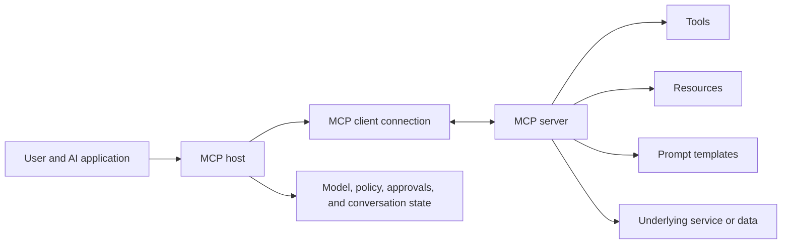
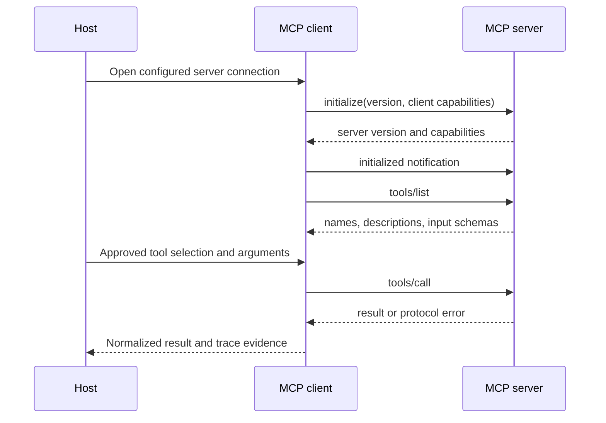
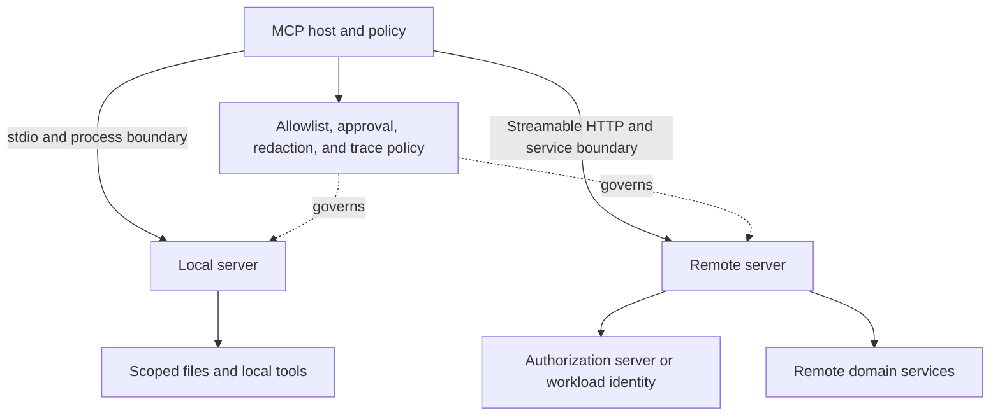
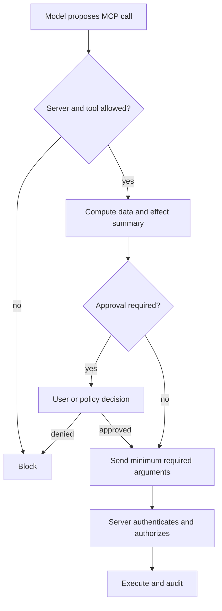

## MCP Standardizes a Connection Boundary

<!-- section-summary: MCP lets an AI application discover and use capabilities through a common protocol instead of one custom integration per system. -->

An agent may need files from a repository, records from a business system, or actions from a deployment platform. Without a shared protocol, every agent host and every service needs a custom adapter. Tool discovery, schemas, transport, errors, and authentication are implemented repeatedly.

The **Model Context Protocol (MCP)** standardizes this connection boundary. An AI application can connect to an MCP server, discover the capabilities it exposes, and invoke them through protocol messages. The server can wrap a local filesystem, a remote software-as-a-service API, an internal database, or a purpose-built tool runtime.

MCP does not make a tool safe, grant a user access, or orchestrate the whole agent. It provides a common way to describe and exchange capabilities. The host and server still own policy, authorization, validation, execution, and audit.

## Host, Client, and Server Have Different Responsibilities

<!-- section-summary: The host owns the user experience and policy, the client manages one protocol connection, and the server exposes bounded capabilities. -->

The **host** is the AI application or runtime. It owns the model interaction, conversation context, user consent, tool-selection policy, and the decision about which server results enter the model context. A desktop assistant, coding agent, or API-based agent service can be a host.

An **MCP client** is the protocol component inside the host that maintains a connection to one server. It negotiates capabilities, sends requests, receives notifications, and translates protocol results into the host’s internal representation. A host connected to five servers normally has five client connections.

The **MCP server** publishes capabilities and executes requests against an underlying system. It owns the truth of its tool schemas and resource identifiers, validates inputs, maps authenticated identity to downstream permissions, and returns protocol results. A server should expose coherent domain operations rather than mirror every low-level endpoint automatically.

This boundary clarifies incident ownership. If the model selected the wrong exposed tool, investigate host context and evaluation. If a valid tool call changed the wrong record, investigate the server’s contract and business validation. If messages are lost or incompatible, investigate the client-server protocol and transport.

## Tools, Resources, and Prompts Are Different Primitives

<!-- section-summary: MCP separates actions, readable context, and reusable interaction templates so hosts can apply different policies to each. -->

**Tools** are callable operations. They have names, descriptions, input schemas, and results. A tool may read data or create a side effect. The server should declare useful annotations, but the host must not treat server-supplied descriptions as trusted authorization policy.

**Resources** are addressable context that a client can read, such as a file, schema, documentation page, or database view. They use URIs and may support discovery or subscriptions. Resources are useful when the host needs content rather than an action.

**Prompts** are reusable templates or interaction starters exposed by the server. They can help a user or host compose a domain task, but they are not higher-priority system instructions. The host decides whether and how they enter context.

Keeping these primitives distinct improves policy. A host may allow read-only resources automatically, require confirmation for a write tool, and expose prompts only through an explicit user action. A server that encodes everything as a tool loses those differences.

## The Protocol Lifecycle Makes Capabilities Discoverable

<!-- section-summary: An MCP connection initializes, negotiates capabilities, discovers primitives, handles requests, and shuts down through explicit protocol states. -->

MCP uses JSON-RPC messages over supported transports. The current architecture separates a data layer—the messages and lifecycle—from the transport layer that carries them. Local integrations commonly use standard input/output, while remote servers commonly use Streamable HTTP. Check the current specification before implementing because protocol versions and transport guidance evolve.

Initialization opens the connection lifecycle. Client and server exchange protocol versions, implementation information, and supported capabilities. Only after successful negotiation should the client issue normal requests. It can then list tools, resources, or prompts supported by that server. When the model or workflow selects a tool, the client sends a call request with structured arguments and receives content or an error result.

Discovery is a powerful feature, but it creates a version boundary. A server can change the tools it reports without the host redeploying. Production hosts should filter allowed tools, cache definitions carefully, record the discovered schema version or digest, and evaluate changes before they affect sensitive workflows.

## MCP Does Not Replace the Tool Contract

<!-- section-summary: The protocol carries a tool definition and call, while application controls determine whether the call is valid and safe. -->

A tool schema can ensure that an argument is a string or enum. It cannot prove that the authenticated user may read the record, that a deployment has been approved, or that retrying a payment is safe. The MCP server still needs the production controls described in the tool-contract article:

- authenticate the caller or receive verifiable delegated identity;
- authorize the exact operation and resource;
- validate current business state after schema validation;
- require approval for sensitive effects;
- use idempotency and reconciliation for side effects;
- return stable result semantics without leaking internal errors;
- propagate trace context and write audit evidence.

The host also needs an allowlist and approval policy. Tool definitions come from the server and can influence model behaviour, so connecting a server is similar to installing a capability provider. Prefer servers operated by the service owner, review their data practices, and do not enable every discovered tool by default.

## Identity Must Survive the Boundary

<!-- section-summary: Authentication connects the host to the server, while authorization must preserve the user and workload permissions relevant to each operation. -->

A local server may run under the user’s operating-system identity. A remote server commonly uses HTTP authentication and may rely on OAuth. The exact mechanism depends on the host, server, and deployment, but the security questions remain stable:

1. Which user and workload initiated the connection?
2. Which audience and scopes is the credential valid for?
3. Does the server act as the user, as the application, or through a separate service identity?
4. Which downstream system makes the final authorization decision?
5. How are tokens stored, refreshed, revoked, and prevented from reaching model context?

Use short-lived, audience-bound credentials and least-privilege scopes. The model should never receive access tokens as text. The client or server adapter attaches credentials outside the model-visible arguments.

For multi-tenant services, authorization must include tenant isolation at every data lookup. A model-supplied `tenant_id` is not trusted identity. Derive it from authenticated context and reject attempts to cross that boundary.

## Local and Remote Servers Have Different Trust Topologies

<!-- section-summary: Local and remote MCP deployments use the same protocol concepts while presenting different identity, isolation, transport, and data-disclosure risks. -->

A **local server** normally runs as a child process or nearby service and communicates through standard input/output. It may inherit a working directory, selected environment variables, filesystem access, and the operating-system identity of the host. Low network exposure does not make it harmless. A compromised package can read files, invoke local programs, or return hostile content under whatever permissions the process received.

Launch local servers with an explicit executable path, minimal environment, restricted working directory, resource limits, and a sandbox where the capability justifies it. Avoid passing a complete shell environment full of tokens. Pin and verify packages, because changing an executable under the same configured name changes the capability provider without changing the host application.

A **remote server** communicates over HTTP infrastructure and crosses a service boundary. It adds DNS and certificate trust, server identity, OAuth or workload authentication, egress policy, rate limits, data residency, and an external retention policy. The host should know which organization operates the endpoint, which data categories may leave the environment, and how the server reaches its downstream services.

The same server implementation can run in either topology, but the deployment contract changes. A filesystem server that is sensible in a developer sandbox could expose unacceptable paths on a shared production host. A remote issue-tracker server may be appropriate for a managed agent service only after tenant identity and user delegation survive the boundary.

For the current stable MCP authorization specification, protected HTTP servers act as OAuth resource servers and publish protected-resource metadata. Clients identify the intended resource, and servers validate token audience. A server calling a downstream API should obtain an appropriate downstream credential instead of passing the inbound MCP token through. This prevents a token intended for one server from gaining unintended authority elsewhere.

Authorization support at the protocol layer still leaves domain authorization to the server. A valid token can identify a user and scope, while the issue tracker decides whether that user may read project `ALPHA` or create a release ticket. Record both the protocol authentication decision and the domain authorization result so an incident can distinguish identity failure from resource-policy failure.

## Capability Changes Are Runtime Changes

<!-- section-summary: Discovery allows servers to evolve independently, so hosts need change handling, schema digests, compatibility tests, and controlled rollout. -->

MCP discovery lets a server add, remove, or revise tools, resources, and prompts without rebuilding every host. That flexibility creates a live dependency. A renamed tool can break a workflow. A broader description can change model selection. A resource URI change can make stored references unusable. A new required field can cause every existing caller to fail validation.

Hosts should record the discovered capability set and content digests, then compare changes against an approved policy. Read-only additions may enter a test environment automatically. A new side-effecting tool, changed effect annotation, or incompatible schema deserves review and agent evaluation before disclosure to production models. When a server sends capability-change notifications, treat them as an invalidation signal and refresh through the same controlled path.

Keep a last-known-good server release or capability policy for rollback. Compatibility testing should cover old host with new server, new host with old server, and staggered deployment when both occur in production. Protocol negotiation catches unsupported protocol revisions; product contract tests catch changes that remain valid JSON-RPC but alter business meaning.

## Approval Controls Data Leaving the Host

<!-- section-summary: Approval can protect both sensitive actions and the data that a tool call sends to an external server. -->

An MCP call may send user content or retrieved data to a third-party server. Approval is therefore about disclosure as well as side effects. Before presenting a confirmation, the host should show the selected server, tool, important arguments, data categories being shared, and expected effect.

OpenAI’s current remote MCP interface requires approval by default before sharing data with a connector or remote server, while allowing developers to configure trusted tools differently. Regardless of platform, sensitive actions should keep explicit approval unless a documented risk review supports automation.

Approval does not neutralize prompt injection. A malicious document can tell the model to upload secrets through an allowed tool, and a server can return text that tries to influence later decisions. Treat tool descriptions, resource content, and tool results as untrusted data. Minimize exposed context, restrict destinations, validate URLs, and keep secrets outside model context.

## Operate the Server as a Production Dependency

<!-- section-summary: MCP servers require ordinary reliability, compatibility, security, and observability engineering. -->

Define timeouts, concurrency limits, request-size limits, and bounded retries. Read-only calls may be retried under policy; side effects need idempotency. Use circuit breakers when an unhealthy server would otherwise consume the agent’s whole latency budget. Return structured protocol errors that distinguish invalid arguments, authorization failure, unavailable dependencies, and unknown outcomes.

Trace connection initialization, capability discovery, approvals, calls, downstream dependencies, and results. Record server identity, negotiated protocol version, tool name, schema digest, effect class, approval decision, sanitized argument summary, latency, error class, and final workflow outcome. Do not put raw tokens or sensitive payloads in traces.

Compatibility tests should run representative hosts against server releases. Verify initialization, capability negotiation, schemas, success and error results, cancellation, authorization, and transport recovery. Add agent evals for correct tool selection, missing-tool behaviour, refusal of unsafe calls, and handling of untrusted output.

Version the server implementation and its tool contracts separately from the MCP protocol version. A protocol-compatible server can still introduce a breaking tool change. Prefer additive changes, publish deprecation windows, and retain a rollback route.

## When MCP Is the Right Boundary

<!-- section-summary: MCP is valuable for reusable capability providers, while a local function may be simpler for one tightly coupled application. -->

Use MCP when several hosts need the same tools or resources, when capability discovery is valuable, when teams want a standard client-server boundary, or when the service should evolve independently from one agent application. It is also useful for connecting external capability providers through an established protocol.

A local function or ordinary internal API adapter may be clearer when one application owns both sides, the capability is tiny, or introducing a separate server adds no reuse or policy benefit. MCP is an interoperability choice, not a requirement for every tool call.

A production-ready MCP integration has a trusted server source, explicit primitives, negotiated compatibility, filtered capabilities, strong identity, tool-level authorization, proportional approval, prompt-injection defences, bounded recovery, and end-to-end traces. The protocol reduces integration variation; the surrounding system still determines whether the capability is safe and useful.

## References

- [Model Context Protocol introduction](https://modelcontextprotocol.io/introduction)
- [MCP architecture](https://modelcontextprotocol.io/specification/2025-11-25/architecture)
- [MCP lifecycle](https://modelcontextprotocol.io/specification/2025-11-25/basic/lifecycle)
- [MCP tools](https://modelcontextprotocol.io/specification/2025-11-25/server/tools)
- [MCP resources](https://modelcontextprotocol.io/specification/2025-11-25/server/resources)
- [MCP authorization](https://modelcontextprotocol.io/specification/2025-11-25/basic/authorization)
- [OpenAI MCP and connectors](https://developers.openai.com/api/docs/guides/tools-connectors-mcp)
- [OAuth 2.1](https://datatracker.ietf.org/doc/html/draft-ietf-oauth-v2-1)
- [OWASP Top 10 for LLM applications](https://genai.owasp.org/llm-top-10/)
