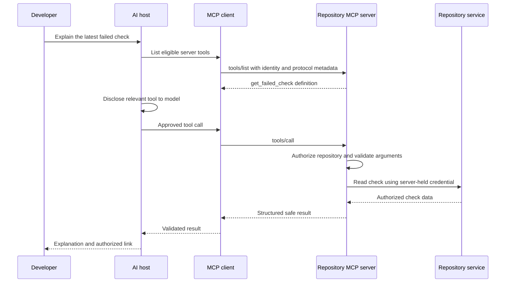
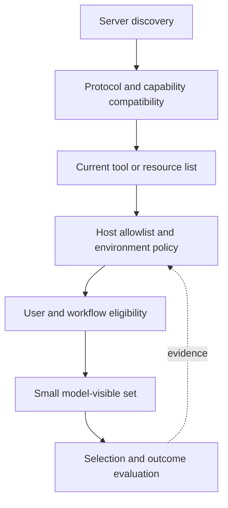
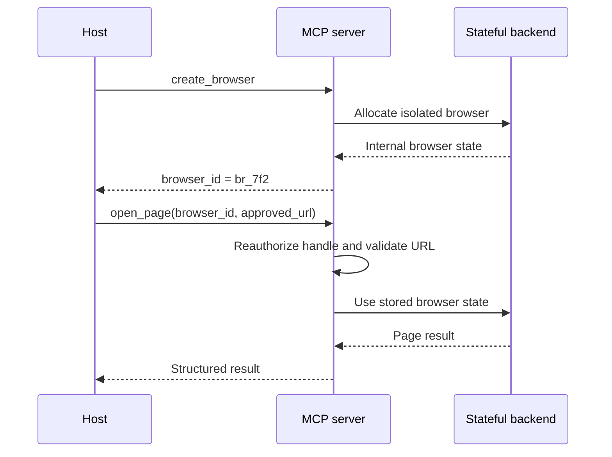
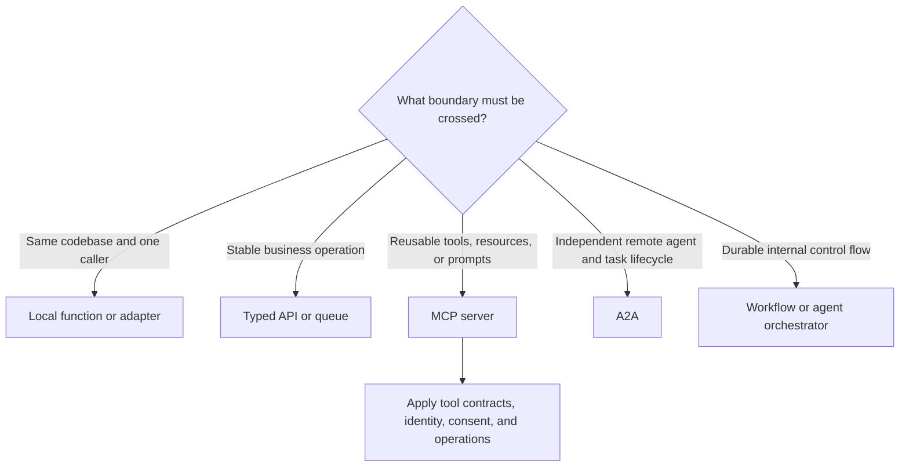

## Table of Contents

1. [What MCP Standardizes](#what-mcp-standardizes)
2. [Understand Host, Client, And Server Responsibilities](#understand-host-client-and-server-responsibilities)
3. [How MCP Requests Carry Their Own Context](#how-mcp-requests-carry-their-own-context)
4. [Choose Tools, Resources, Or Prompts For The Capability](#choose-tools-resources-or-prompts-for-the-capability)
5. [Discover Live MCP Capabilities At Runtime](#discover-live-mcp-capabilities-at-runtime)
6. [Apply The Tool Contract During MCP Execution](#apply-the-tool-contract-during-mcp-execution)
7. [Protect Local And Remote MCP Servers Differently](#protect-local-and-remote-mcp-servers-differently)
8. [Require Consent For Actions And Data Sharing](#require-consent-for-actions-and-data-sharing)
9. [Use Explicit Handles For State And Long-Running Work](#use-explicit-handles-for-state-and-long-running-work)
10. [Operate An MCP Server Reliably](#operate-an-mcp-server-reliably)
11. [Use MCP For Cross-System Interoperability](#use-mcp-for-cross-system-interoperability)
12. [How A Production MCP Request Works](#how-a-production-mcp-request-works)
13. [References](#references)

## What MCP Standardizes

<!-- section-summary: MCP gives an AI application a common way to discover and use external capabilities while the host and server retain their own policy responsibilities. -->

An AI application often needs information or actions that live outside the model. It may read repository data, inspect an issue, discover a database schema, check a deployment, or request a controlled business action.

Building a custom adapter for every combination of AI application and service repeats the same connection work. Each adapter must define how capabilities are found, how requests travel, how callers authenticate, and how failures return.

The **Model Context Protocol (MCP)** standardizes that connection. An AI application can discover capabilities exposed by an MCP server and use them through a common set of protocol messages. The server may wrap a local process, an internal service, or a managed external system.

Start with one complete interaction. A developer asks a coding assistant to explain the latest failing CI check in a repository:

1. the assistant host already has an approved connection to a repository MCP server;
2. its MCP client obtains the server's current capabilities and lists the tools visible to this user;
3. the host gives the model one relevant definition, `get_failed_check`;
4. the model proposes the repository and check identifier;
5. the host applies its disclosure and approval policy;
6. the client sends a self-contained MCP request with protocol metadata and an audience-bound access token;
7. the server validates the token, checks repository permission, calls the repository API, and returns a structured result;
8. the host validates and filters that result before placing the useful summary in model context.

The developer sees the failed step, its safe error summary, and a link to the authorized check. The server never receives the whole conversation. The model never receives the access token. The repository remains the authority for who may read the check.


```mermaid
sequenceDiagram
    participant U as Developer
    participant H as AI host
    participant C as MCP client
    participant S as Repository MCP server
    participant R as Repository service

    U->>H: Explain the latest failed check
    H->>C: List eligible server tools
    C->>S: tools/list with identity and protocol metadata
    S-->>C: get_failed_check definition
    H->>H: Disclose relevant tool to model
    H->>C: Approved tool call
    C->>S: tools/call
    S->>S: Authorize repository and validate arguments
    S->>R: Read check using server-held credential
    R-->>S: Authorized check data
    S-->>C: Structured safe result
    C-->>H: Validated result
    H-->>U: Explanation and authorized link
```

MCP owns the shared language used across the middle of this path. The host still owns model context, consent, tool disclosure, and user experience. The server still owns its domain contract, authorization, downstream credentials, execution, and audit evidence. This separation is the key to understanding the rest of the protocol.

## Understand Host, Client, And Server Responsibilities

<!-- section-summary: The host coordinates the AI experience, one client represents each server connection, and the server exposes a focused domain capability. -->

MCP uses three roles because an AI application and a capability service have different responsibilities. Treating them as one component hides where policy and failures belong.

The **host** is the AI application. It owns the model interaction, user session, context assembly, server allowlist, consent experience, and the decision about which capabilities the model sees. A desktop assistant, coding agent, or managed agent service can all act as hosts.

An **MCP client** is the protocol adapter created by the host for one MCP server. The client attaches protocol version and supported capabilities to requests, sends JSON-RPC messages over the selected transport, receives results, and keeps one server's data isolated from other server connections. A host using four servers typically manages four clients.

The **MCP server** exposes a focused capability surface. It publishes tools, resources, or prompts and validates the protocol request. It then maps authenticated identity to domain permissions, calls its underlying systems, and returns an MCP result.

A repository server understands repositories; a warehouse server understands governed datasets. Each server should expose domain operations with clear ownership instead of mirroring every low-level endpoint automatically.

These responsibilities guide incident response. A wrong tool appearing in model context points to host disclosure policy. A correctly formed call reading the wrong repository points to server authorization. A request rejected because client and server support different protocol behavior points to the MCP boundary. The trace should preserve enough evidence to make that distinction.

## How MCP Requests Carry Their Own Context

<!-- section-summary: Current MCP requests carry their own version and client capabilities, which removes the earlier requirement for a connection handshake. -->

The current MCP core is **stateless at the protocol layer**. Each request carries the protocol version, client identity, and client capabilities needed to interpret that request. A remote server can therefore handle two calls from the same host on different instances behind a normal load balancer.

This is an important change from earlier MCP revisions, which used an `initialize` exchange and a protocol session before normal calls. New implementations should follow the current self-contained request model. Compatibility adapters may still support the earlier handshake for older clients or servers, and that path should be tested as a distinct protocol mode.

### Use The Data Layer To Describe The Message

MCP uses JSON-RPC 2.0 for requests, responses, errors, and notifications. The data layer defines operations such as `tools/list` and `tools/call`, along with the shapes of tools, resources, prompts, results, progress, and cancellation.

A client may call `server/discover` to learn supported protocol versions and server capabilities before other work. This discovery call is optional. A client can also send a normal request and handle an unsupported-version response. In either path, the request carries the current client metadata.

The following fragment shows the important pieces of a remote tool call. The HTTP headers let infrastructure identify the MCP operation, while `_meta` carries the protocol and client information:

```http
POST /mcp HTTP/1.1
Authorization: Bearer <token-for-this-mcp-server>
MCP-Protocol-Version: <current-version>
Mcp-Method: tools/call
Mcp-Name: get_failed_check
Content-Type: application/json

{
  "jsonrpc": "2.0",
  "id": "call-104",
  "method": "tools/call",
  "params": {
    "name": "get_failed_check",
    "arguments": {
      "repository": "platform/api",
      "check_id": "4831"
    },
    "_meta": {
      "io.modelcontextprotocol/protocolVersion": "<current-version>",
      "io.modelcontextprotocol/clientInfo": {
        "name": "engineering-assistant",
        "version": "4.2.0"
      },
      "io.modelcontextprotocol/clientCapabilities": {}
    }
  }
}
```

Set `<current-version>` from reviewed runtime configuration and test that value against every supported server release. Pin the version for each deployment and roll out protocol changes through compatibility tests. Production code should use the official SDK for its language where possible, since the SDK handles wire details and revision negotiation that application code should avoid recreating.

### Use The Transport Layer To Carry The Message

**Standard input/output**, usually called **stdio**, connects a host to a local server process through its input and output streams. It fits developer tools and local integrations where the host launches and supervises the server.

**Streamable HTTP** carries MCP between services. It fits remote servers, shared managed capability providers, and ordinary HTTP infrastructure. TLS, server identity, OAuth, gateways, load balancing, and egress policy matter at this boundary.

The protocol message can describe the same tool over either transport. The operating model changes greatly. A local process inherits selected machine permissions and supply-chain risk. A remote service introduces network identity, external data disclosure, service availability, and data-residency questions.

## Choose Tools, Resources, Or Prompts For The Capability

<!-- section-summary: MCP separates callable actions, addressable context, and reusable interaction templates so hosts can apply suitable policy to each. -->

The host needs to know whether it is asking for an action, reading context, or offering the user a reusable starting point. MCP represents those three needs separately. This gives the host enough information to choose a suitable disclosure and consent policy before any content reaches the model.

A **tool** is an operation the model can propose. `get_failed_check` reads a check; `rerun_check` creates a side effect. Tools have names, descriptions, input schemas, and optional output schemas. The current tool specification uses JSON Schema 2020-12 by default unless a tool declares another supported draft.

A **resource** is addressable content that the host can read, such as a repository file, database schema, policy document, or job log. Resources use URIs so a host can identify and retrieve content without pretending that every read is an action. A tool may also return a resource link to a result too large or sensitive to copy into the immediate response.

A **prompt** is a reusable message template or workflow starter offered by a server. A host may show it as an explicit user action, such as “Investigate failed build.” The template can help compose a domain task, while host instructions and policy retain their higher authority.

These distinctions support different controls. A host may load an approved policy resource automatically, expose a prompt through a menu, permit a read tool inside a narrow workflow, and require approval for a write tool. A server that encodes every capability as a generic tool removes useful information about intent and control.

MCP also defines optional extensions. They include durable tasks, interactive applications, and richer skills. Extensions require explicit support from both sides. They should enter an architecture only after the core interaction works and a real requirement justifies the extra lifecycle.

## Discover Live MCP Capabilities At Runtime

<!-- section-summary: Discovery lets servers evolve independently, so hosts need filtering, caching, change review, compatibility tests, and rollback. -->

Discovery removes hard-coded capability lists from every host. It also means a server can change what the model sees without a host release. A renamed tool can break a workflow. A broader description can change model selection. A new required argument can reject old calls. A newly exposed write tool can increase risk immediately.

The host first learns which primitive families the server supports. It can then call `tools/list`, `resources/list`, or `prompts/list` as appropriate. Current list results can include a time-to-live and cache scope, which tell the client how long a result remains fresh and whether it can be shared across users. Tool lists may vary by the authorization on a request because different callers may have different scopes.

The host should place a governed filter after discovery:


```mermaid
flowchart TD
    A["Server discovery"] --> B["Protocol and capability compatibility"]
    B --> C["Current tool or resource list"]
    C --> D["Host allowlist and environment policy"]
    D --> E["User and workflow eligibility"]
    E --> F["Small model-visible set"]
    F --> G["Selection and outcome evaluation"]
    G -. evidence .-> D

    class A,B,C discover
    class D,E govern
    class F,G use
```

A cached definition must stay tied to the server and caller that produced it. Record the trusted server identity, caller scope, retrieval time, and protocol version. A digest identifies the exact definitions shown to the model.

A change notification or expired time-to-live triggers refresh through the same governed path. High-impact changes should enter a test environment and pass contract and agent evaluations. Canary disclosure then limits the first production exposure. The previous approved definition set gives the host a rollback target.

Names are unique only inside one server. A host aggregating several servers can receive two tools called `search`. It needs a deterministic internal identity, often based on trusted server identity plus tool name, and a model-visible naming strategy that avoids confusion. The server's display name alone may be duplicated, so configuration should supply the trusted namespace.

## Apply The Tool Contract During MCP Execution

<!-- section-summary: MCP carries definitions and calls, while application and domain controls decide whether a proposed operation is valid and safe. -->

MCP gives tool providers and hosts a shared wire contract for definitions and calls. A production tool uses trusted caller identity and resource authorization to decide who may request the operation. Current-state checks and approval decide whether it may run now. Idempotency protects retries, while stable result states and audit evidence explain what happened. The schema catches structural errors such as extra fields or wrong types; trusted runtime code applies the controls that protect the effect.

For the CI example, `repository` and `check_id` may pass JSON Schema. The server then derives the user from the access token, checks permission on `platform/api`, verifies that the check belongs to that repository, and queries through a server-held downstream credential. A model-supplied `user_id` or `is_admin` never replaces those facts.

MCP tool definitions may include annotations about behavior. Hosts should treat descriptions and annotations as untrusted unless the server source has passed review. A label claiming that a tool is read-only cannot overrule observed server behavior, contract tests, or local policy.

The execution order remains concrete. The host first permits disclosure, and the model proposes arguments. Schema validation runs before resource authorization. Current-state and approval checks run before the server uses its credential. The server then executes under a durable operation identity, normalizes the outcome, and returns only safe MCP content.

Output schemas improve interoperability for structured results. The server must produce conforming data, and the client should validate it. The host still treats the content as external input. A schema-valid tool result can contain misleading instructions, stale data, an unauthorized link, or text designed to influence the model.

## Protect Local And Remote MCP Servers Differently

<!-- section-summary: Local servers require process isolation and supply-chain control, while remote servers require strong network identity, delegated authorization, and data-boundary review. -->

The transport determines which security problems surround the same MCP messages. A local server runs as software on the user's machine. A remote server receives requests across a network and may belong to another organization. Each topology therefore needs its own deployment and identity controls.

### Protect A Local Server With Machine-Level Controls

A local stdio server often starts as a child process of the host. It may receive a working directory, environment variables, file access, and the operating-system identity of the current user. Even with little network exposure, a compromised package can use every permission granted to that process.

Launch local servers from a pinned and reviewed package or executable. Pass a minimal environment, explicit working directory, scoped file roots, resource limits, and only the credentials required for the advertised capability. A filesystem server for one repository should receive only that repository path. Sandboxing is appropriate for code execution, broad file access, or other high-impact capabilities.

The host should also capture server version and package digest. Replacing a binary under the same command changes the capability provider even though host configuration appears unchanged.

### Protect A Remote Server As An OAuth Resource

A remote Streamable HTTP server introduces a service boundary. Before sending user data, the host needs to establish who operates the server and which trusted origin identifies it. The review also covers TLS identity, data location, retention policy, and incident contact.

For protected remote servers, the MCP authorization specification builds on OAuth. The MCP server acts as a protected resource. It publishes Protected Resource Metadata so the client can discover the appropriate authorization server and scopes. The client requests a token for the specific MCP server audience, then includes that token in every HTTP request. The MCP server validates issuer, expiry, audience, and scope.

The token proves permission at the protocol boundary. Domain authorization still checks the target resource. A `repositories:read` scope may allow the operation family, while the repository service decides whether this user can read `platform/api`.

An MCP server calling another API should obtain an appropriate downstream credential. Passing the inbound MCP token through to a different service gives that token a new audience and creates a confused-deputy risk. Workload identity, OAuth token exchange, or a service-owned credential with user-aware policy are common solutions.

If a tool needs additional scope, the server can return an insufficient-scope challenge. The host may guide the user through a step-up authorization flow for the required permission. The operation then returns through normal authorization and tool-contract checks.

## Require Consent For Actions And Data Sharing

<!-- section-summary: A useful consent decision shows which server receives which data and which effect the selected capability may create. -->

An MCP call can send retrieved documents, user text, identifiers, or generated arguments to another process or organization. Consent therefore covers data leaving the host as well as actions performed by a tool.

For a sensitive call, the host should show the server identity, tool name, important arguments, data categories being shared, destination, and expected effect. Approval should bind to the normalized protected fields. Trusted low-risk reads may use a documented policy path, while write operations and new external destinations usually deserve explicit review.

Prompt injection can enter through tool descriptions, resource content, and tool results. A malicious issue comment might ask the model to read local secrets and send them through another server. The host protects the boundary by limiting disclosed tools, restricting data sources and destinations, keeping secrets outside model context, validating URLs, and requiring approval for sensitive transfers.

Each MCP client should isolate one server's information. A repository server needs only the request fields and approved evidence for its operation. It has no reason to receive the full conversation or the results from a payroll server. The host controls cross-server composition and records which information moved between those boundaries.

Result filtering matters too. The host should validate structured output, cap content size, apply media and URI policy, scan files where required, and label returned content as external evidence. High-risk content can enter a quarantine or human-review path before the model consumes it.

## Use Explicit Handles For State And Long-Running Work

<!-- section-summary: Stateless protocol requests carry explicit application handles, while an optional tasks extension supports durable asynchronous work where both sides implement it. -->

A stateful application can run over stateless protocol requests. One browser context, shopping basket, or export job may live across several calls, so the server needs a reliable way to connect those calls to the same application state. The relevant state identity appears explicitly in each request.

Suppose a browser-automation server needs several calls against one browser context. `create_browser` returns an opaque `browser_id`. Later calls such as `open_page` and `capture_page` accept that ID. The server stores the actual browser state and verifies the caller's authorization on every use.


```mermaid
sequenceDiagram
    participant H as Host
    participant S as MCP server
    participant B as Stateful backend

    H->>S: create_browser
    S->>B: Allocate isolated browser
    B-->>S: Internal browser state
    S-->>H: browser_id = br_7f2
    H->>S: open_page(browser_id, approved_url)
    S->>S: Reauthorize handle and validate URL
    S->>B: Use stored browser state
    B-->>S: Page result
    S-->>H: Structured result
```

The handle names a piece of state. Permission still comes from authenticated context and a fresh authorization check. The handle should be opaque, hard to guess, bound to an owner or tenant, and governed by a clear lifetime. An expired handle produces a specific recovery result so the workflow can create a new context or ask the user.

Some work lasts longer than a normal tool call. The current protocol offers a tasks extension for asynchronous execution, polling, mid-flight input, cancellation, and durable handles. Both client and server must opt into the extension. A simpler server can return an application job ID from `start_export` and expose `get_export_status`; this pattern is sufficient for many internal integrations.

Choose the tasks extension if several interoperating hosts need one standard long-running lifecycle. Use a domain job handle if one service already owns a clear asynchronous API.

In both cases, the host links its local workflow to the remote task or job. It records the deadline and observed cancellation state. The final record identifies the returned artifact so a resumed run can verify the same outcome.

## Operate An MCP Server Reliably

<!-- section-summary: Production MCP requires reliability limits, compatibility control, safe telemetry, supply-chain evidence, and tested recovery. -->

Connecting an MCP server adds a runtime dependency to the agent path. The service needs ordinary production controls plus tests for model-facing behavior.

Set per-call deadlines, request and result size limits, concurrency limits, and a total tool budget for the agent run. Read-only calls may use bounded retries with backoff. Side effects follow the idempotency and reconciliation rules in their tool contract. A circuit breaker can stop one unhealthy server from consuming the complete user latency budget.

Trace discovery, capability filtering, approval, the MCP call, downstream dependencies, and the normalized result. The current protocol defines W3C Trace Context propagation in request metadata, which allows an OpenTelemetry trace to continue from host to server. Useful attributes include trusted server identity, transport, protocol version, tool name, definition digest, effect class, approval state, result class, latency, retry count, and downstream status.

Keep tokens, raw prompts, unrestricted tool arguments, complete resources, and full error bodies out of routine telemetry. Store allowlisted summaries and controlled evidence links. Access, retention, and deletion policies should follow the sensitivity of the underlying data.

Compatibility tests should run representative host and server releases together. Verify discovery, lists, schemas, structured outputs, authorization challenges, cancellation, timeouts, and result limits. Agent evaluations check tool selection, missing-capability behavior, refusal of unsafe calls, and response to hostile output.

For local servers, add package provenance, pinned versions, vulnerability response, and sandbox tests. For remote servers, add availability objectives, rate-limit behavior, certificate and OAuth configuration, data-residency review, and an operator escalation path. Keep a last-known-good server release or capability policy for rollback.

## Use MCP For Cross-System Interoperability

<!-- section-summary: MCP earns its operating cost where reusable capabilities, independent ownership, or standard discovery matter across AI hosts. -->

MCP fits a capability that several AI hosts should consume through a shared contract. It also fits an independently owned service that needs standard discovery, multiple primitives, or a transport-neutral client boundary.

A local function is usually the smaller design for one application and one tiny capability owned by the same codebase. An ordinary typed service API fits a stable business operation already used by many non-agent clients. A workflow engine fits durable control flow, checkpoints, and approvals. A2A fits collaboration with an independent agent that owns a task lifecycle. These boundaries can coexist.


```mermaid
flowchart TD
    A{"What boundary must be crossed?"}
    A -->|Same codebase and one caller| B["Local function or adapter"]
    A -->|Stable business operation| C["Typed API or queue"]
    A -->|Reusable tools, resources, or prompts| D["MCP server"]
    A -->|Independent remote agent and task lifecycle| E["A2A"]
    A -->|Durable internal control flow| F["Workflow or agent orchestrator"]
    D --> G["Apply tool contracts, identity, consent, and operations"]

    class A question
    class B,C,D,E,F choice
    class G control
```

The deciding questions are practical. Will several hosts reuse the capability? Does another team own and release it independently? Does dynamic discovery provide real value? Can the organization operate and secure another process or service boundary? A positive answer to those questions gives MCP a clear job.

## How A Production MCP Request Works

<!-- section-summary: MCP standardizes capability exchange while trusted hosts and servers preserve context boundaries, authority, safe execution, recovery, and evidence. -->

A production MCP integration starts with a trusted server source and an explicit transport. The host creates one isolated client for that server. Self-contained requests carry protocol and client metadata. Discovery finds the current capability set; host policy filters it to a small eligible surface. The model proposes a call, and consent protects the action and any disclosed data.

The server authenticates the request, authorizes the target resource, validates the tool contract, and executes through server-held credentials. Structured results are validated and filtered before the host adds useful evidence to model context. Explicit handles preserve application state. Optional extensions enter only where both sides need their additional lifecycle.

Operations complete the picture: bounded retries, idempotent effects, traces, redaction, compatibility tests, supply-chain controls, canary releases, and rollback. MCP reduces custom integration work. The reliability and safety of the final system still come from the engineering on both sides of the protocol.

## References

- [Model Context Protocol specification](https://modelcontextprotocol.io/specification/latest)
- [MCP architecture](https://modelcontextprotocol.io/specification/2026-07-28/architecture)
- [MCP tools](https://modelcontextprotocol.io/specification/2026-07-28/server/tools)
- [MCP authorization](https://modelcontextprotocol.io/specification/2026-07-28/basic/authorization)
- [MCP specification release overview](https://blog.modelcontextprotocol.io/posts/2026-07-28-release-candidate/)
- [JSON-RPC 2.0 specification](https://www.jsonrpc.org/specification)
- [JSON Schema specification](https://json-schema.org/specification)
- [OAuth 2.0 Protected Resource Metadata](https://www.rfc-editor.org/rfc/rfc9728.html)
- [OAuth 2.0 Resource Indicators](https://www.rfc-editor.org/rfc/rfc8707.html)
- [OpenTelemetry traces](https://opentelemetry.io/docs/concepts/signals/traces/)
- [W3C Trace Context](https://www.w3.org/TR/trace-context/)
