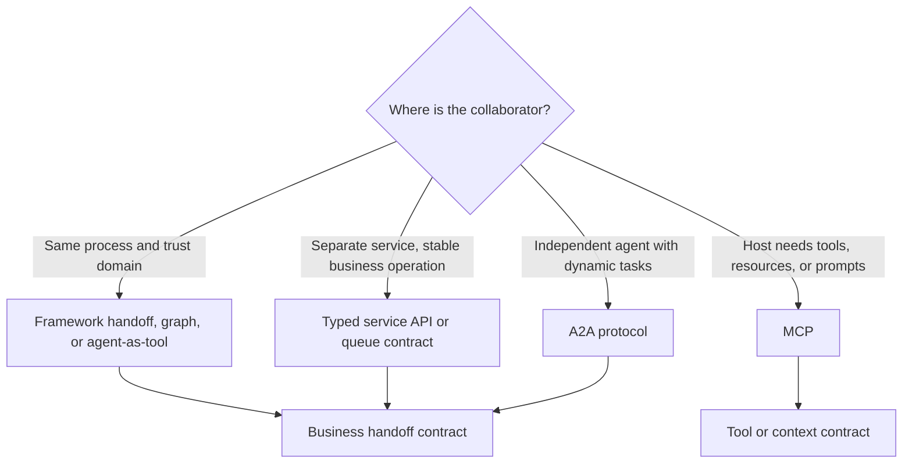
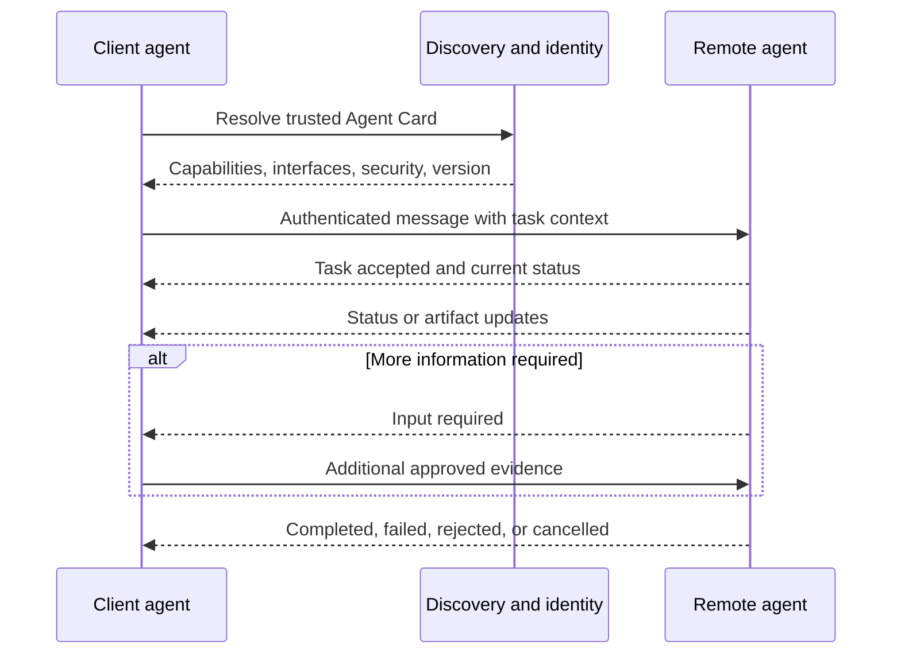
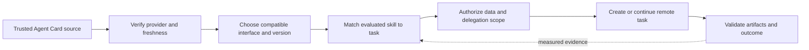

Agents can collaborate without sharing the same model, framework, tools, or memory. What they need is a contract for transferring work. That contract must preserve the goal, evidence, state, authority, and outcome across the boundary.

**Agent interoperability** is the ability of independently implemented agent systems to discover capabilities and exchange tasks, messages, status, and artifacts without exposing their internal reasoning or implementation. Inside one application, a framework handoff or graph may be enough. Across teams, vendors, or trust domains, a network protocol such as Agent2Agent (A2A) can replace a collection of one-off adapters.

## Choose The Boundary Before The Protocol
<!-- section-summary: Local orchestration, service APIs, MCP, and A2A solve different boundaries; the smallest boundary that preserves ownership is usually the clearest. -->

Use BrightDesk, a SaaS support company. A Research Agent investigates a reported CSV duplication issue. A Ticket Agent drafts an engineering ticket. A Review Agent checks customer-data policy before creation.

If all three run inside one application, share one release cadence, and use the same state store, ordinary orchestration is enough. The coordinator can call specialists as tools or transfer active control through a framework handoff. A wire protocol adds little.

If Ticket Agent is operated by another team as an independent service, a typed service API may fit when the operation is stable: `draft_ticket(evidence_packet)`. A2A fits when the remote system is intentionally agent-like: it advertises several skills, may ask for more input, performs long-running work, produces multiple artifacts, and can evolve independently.



A2A and MCP are complementary. MCP connects a host to capabilities such as tools and resources. A2A connects a client agent to another agent that owns how work is performed. A remote A2A agent may use MCP internally; the caller does not need to see that tool topology.

The protocol choice does not define who may create a ticket, which customer data may cross the boundary, or what evidence makes the ticket acceptable. Those remain business and security contracts.

## Interop Has A Control Plane And A Work Plane
<!-- section-summary: Capability discovery and negotiation establish how agents can interact; messages, tasks, status, and artifacts carry the actual work. -->

Think about the boundary in two planes.

The **control plane** answers: Which agent is this? What capabilities and interaction modes does it advertise? Which protocol and interface versions does it support? How is it authenticated? What policy allows this caller to use it?

The **work plane** answers: What task is being attempted? Which messages and artifacts belong to it? Is it running, waiting for input, completed, failed, rejected, or cancelled? How does the caller resume, stream, or retrieve it?

A2A 1.0 supplies a common model for these concerns. An Agent Card advertises an agent and its capabilities. Messages carry content between participants. A task represents work whose lifecycle may outlive one request. Artifacts are task outputs. The protocol supports multiple bindings and version negotiation so independently released agents can interoperate.



Discovery information is not automatically trustworthy because it is formatted as an Agent Card. Fetch it from an authenticated location, validate allowed domains and certificates, bind it to service identity, and apply local allowlists. Capabilities are claims that still need authorization and evaluation.

## Discovery Supplies Candidates, While Policy Selects a Collaborator

<!-- section-summary: Agent Cards advertise capabilities and interfaces, while the calling organization decides trust, eligibility, fit, and allowed delegation. -->

An **Agent Card** is discovery metadata. It can describe the provider, supported interfaces, capabilities, skills, security schemes, and other connection details. This lets a client learn how to communicate without hard-coding every field for every agent. It should be read as a service claim that the caller verifies, rather than a recommendation to delegate work.

A collaborator-selection policy can use four gates:

1. **Trust:** Is the card resolved from an approved location, associated with the expected provider, fresh enough, and valid under the organization’s signature or service-identity policy?
2. **Compatibility:** Does the client support one advertised protocol binding, version, extension set, content type, streaming mode, and authentication scheme?
3. **Capability:** Does an advertised skill match the task and required artifact, and has evaluation shown that the agent performs that capability reliably?
4. **Authority:** May this caller share the required evidence and ask this remote service to perform the proposed work?

These gates lead to a selected **agent interface**, which is the concrete endpoint and protocol binding used for the task. A service may advertise JSON-RPC, HTTP with JSON, or gRPC interfaces. The client chooses one it supports and records the choice. Switching bindings should preserve the protocol’s business semantics, while transport-specific performance and failure behaviour may still differ.



Cache Agent Cards according to their current protocol guidance and local risk policy. Cache entries need an origin, retrieval time, version or digest, and expiry. A changed card can remove an interface, alter authentication, or revise a skill description. High-impact integrations should review and test those changes before a new card affects routing.

An extended or authenticated Agent Card may expose capabilities intended only for authorized clients. That is useful for private workflows, but it also means discovery itself can reveal sensitive operational information. Fetch it with the appropriate identity, retain it under the right access controls, and disclose only the small skill description needed for coordinator selection.

Capability evaluation belongs beside discovery. If the remote service advertises `draft_engineering_ticket`, maintain contract cases for evidence preservation, forbidden customer data, artifact schema, clarification, timeout, and cancellation. A valid signed card proves who published the claim; it cannot prove that the implementation currently meets the claim. Production outcome and compatibility evidence close that gap.

## A Task Is A Durable Conversation About Work
<!-- section-summary: A remote task gives long-running work a stable identity and state, while messages exchange information and artifacts carry outputs. -->

A synchronous tool call usually returns one result or error. Agent work may take minutes, wait for a reviewer, stream intermediate artifacts, or require clarification. A task makes that lifecycle explicit.

The application should map remote states into its own durable state rather than letting a UI infer progress from text. At minimum, distinguish queued or submitted, working, input required, completed, failed, rejected, and cancelled according to the current binding and business needs. Terminal states should not silently return to working under the same identity.

Messages are conversation units, not necessarily completed work. An agent can respond with a direct message for a simple interaction or create/update a task for longer work. Artifacts are named outputs such as a ticket draft, evidence bundle, report, or generated file. Keep artifacts addressable and versioned so the caller can validate and store them without scraping prose.

The remote task ID and local workflow ID need a durable mapping. Also retain caller request ID, trace context, user or service subject, agent identity/version, and protocol version. If a network call times out after the remote agent accepted work, query or reconcile by that identity before submitting again.

## The Business Handoff Packet Remains Essential
<!-- section-summary: The protocol transports work, while a typed business packet defines the objective, evidence, constraints, permissions, and acceptance criteria the receiving agent needs. -->

The Research Agent should not hand Ticket Agent a paragraph and hope it infers the important parts. BrightDesk defines one application-level packet:

```json
{
  "handoff_version": "support-to-engineering-3",
  "task": {
    "objective": "Draft an engineering ticket for duplicated CSV export rows",
    "acceptance": ["reproduction conditions", "observed impact", "evidence links", "owner suggestion"]
  },
  "evidence": [
    {"id": "deploy-2026-0715", "kind": "release-note", "trust": "internal-reviewed"},
    {"id": "trace-88c1", "kind": "support-trace", "trust": "customer-reported"}
  ],
  "constraints": {
    "customer_pii": "exclude",
    "allowed_actions": ["draft_ticket"],
    "requires_human_approval": true
  },
  "continuity": {
    "local_run_id": "support-run-10421",
    "traceparent": "00-...",
    "deadline": "2026-07-16T16:00:00Z"
  }
}
```

This packet is not an A2A replacement. It can be one structured part inside an A2A message or the payload of an internal API. It defines BrightDesk's semantics while the protocol defines transport and task interaction.

Include references rather than copying every transcript and log. The receiving agent retrieves only evidence it is authorized to read. Label provenance and trust: customer claims, model inferences, reviewed runbooks, and authoritative deployment records should not appear equivalent.

Acceptance criteria tell the receiver what “done” means. Constraints name forbidden data and allowed actions. Continuity links traces and deadlines. Versioning lets the receiver reject or adapt an unsupported packet instead of silently misreading a new field.

## Identity And Delegation Cross The Boundary
<!-- section-summary: Authentication proves the calling service, authorization limits the requested capability, and delegation preserves which user or workflow authority the agent may exercise. -->

Agent-to-agent calls often contain two identities: the service agent and the user or workflow on whose behalf it acts. Do not replace both with one broad API key.

Authenticate the service through a supported transport mechanism such as mutually authenticated TLS, OAuth, or workload identity. Authorize capability and resource scope. If user delegation is required, transmit a bounded assertion or token exchange that identifies subject, audience, permissions, purpose, and expiry. The remote agent must not treat user text that says “I am an administrator” as authority.

Separate permission to ask for a draft from permission to create the real ticket. BrightDesk lets remote Ticket Agent produce an artifact; a local reviewed tool performs the external side effect after human approval. This keeps high-impact authority near the system that owns the policy.

Avoid sending provider credentials, internal tool tokens, or the caller's complete permission set. Each agent obtains its own credentials for its tools. The handoff grants the minimum capability needed for the task and expires when the task or approval window ends.

## Preserve Audit And Trace Continuity
<!-- section-summary: Cross-agent evidence links local and remote spans, messages, artifacts, approvals, and side effects without assuming one vendor owns the complete trace. -->

A trace header can correlate services, but audit evidence needs application identities too. Record local workflow and step, remote agent and version, protocol/interface version, task and message IDs, packet digest, artifact identities, authorization decision, approval, final status, and external side effects.

Do not require a vendor to expose chain-of-thought or private internal memory. Interoperability needs observable inputs, decisions, state transitions, artifacts, and outcomes—not hidden reasoning. The remote agent can retain its internal trace and return a correlation ID under an agreed support and retention policy.

Sensitive content should not be duplicated into every trace system. Store digests, classifications, and controlled evidence links. Preserve enough metadata to answer who sent what task, which agent accepted it, what artifact came back, who approved it, and which system committed the effect.

## Version The Boundary In Layers
<!-- section-summary: Protocol, binding, Agent Card, capability, business packet, and artifact schemas can evolve independently and need explicit compatibility policy. -->

An interop boundary has several versions:

| Layer | Example change |
| --- | --- |
| A2A protocol | semantic model or negotiation rule changes |
| Transport binding | JSON/HTTP, JSON-RPC, gRPC, or another supported interface |
| Agent Card and skill | capability or authentication changes |
| Business handoff packet | new evidence or constraint field |
| Artifact schema | ticket draft adds a structured risk section |
| Agent implementation | prompt, model, tools, or workflow changes |

Negotiate protocol and binding through the current specification. Version business schemas separately. Prefer additive compatible fields, explicit enums, and rejection of unknown critical requirements. Run contract tests between supported client and server versions and keep a compatibility window during staggered releases.

An agent version update can change behaviour without changing the wire schema. Treat it as a model-system release: run interop evals, shadow or canary traffic, monitor outcomes, and preserve a rollback target.

## Failure Recovery Follows Ownership
<!-- section-summary: Timeouts, duplicate submission, input waits, cancellation, partial artifacts, and remote failures need reconciliation based on durable task identity. -->

Failures happen before acceptance, after acceptance but before the response, during work, while waiting for input, or after an artifact is produced but before a local side effect. Each point has a different safe action.

If submission fails before a task identity exists, a bounded retry may be safe. If the outcome is unknown, query by request or task identity before resubmitting. If input is required, validate that the requested data is allowed and still relevant. Cancellation is a request whose outcome must be observed; it cannot undo a side effect already committed. Partial artifacts need explicit completeness markers and should not be mistaken for final output.

Set deadlines and retry budgets across the whole chain so each agent does not multiply attempts independently. Use circuit breakers and queues to prevent one unavailable collaborator from exhausting the coordinator. Define a human or local fallback for critical work.

Test duplicate messages, reordered status events, expired delegated credentials, unsupported versions, malformed artifacts, lost streaming connections, task cancellation races, and a remote agent that completes after the local deadline.

## Evaluate The Boundary, Not Just Each Agent
<!-- section-summary: Interop evals measure capability selection, information preservation, policy enforcement, lifecycle correctness, artifact quality, and end-to-end task outcome. -->

An individually strong Research Agent and Ticket Agent can still fail together. Evaluate whether the coordinator chooses the correct collaborator, whether the packet preserves required evidence, whether the receiver asks for missing information, whether forbidden data stays excluded, and whether retries create duplicate effects.

Include compatibility matrices, long-running and input-required paths, policy denials, expired authentication, network failures, and adversarial remote content. Measure task completion, artifact validity, evidence coverage, approval correctness, latency, cost, and audit completeness. Conformance tooling can test protocol behaviour; product evals still test BrightDesk's meaning.

The durable design is boundary-first. Keep local orchestration local when possible. Use a typed API for stable operations. Use A2A when independent agents need discovery and a shared task model. In every case, carry a versioned business handoff, least authority, durable identity, trace continuity, and a tested failure policy.

## References

- [A2A Protocol 1.0 documentation](https://a2a-protocol.org/v1.0.0/)
- [A2A Protocol specification](https://a2a-protocol.org/latest/specification/)
- [A2A task lifecycle](https://a2a-protocol.org/latest/topics/life-of-a-task/)
- [Model Context Protocol specification](https://modelcontextprotocol.io/specification/latest)
- [OpenAI Agents SDK handoffs](https://openai.github.io/openai-agents-python/handoffs/)
- [OpenAI Agents SDK orchestration](https://openai.github.io/openai-agents-python/multi_agent/)
- [LangChain multi-agent patterns](https://docs.langchain.com/oss/python/langchain/multi-agent)
- [OpenTelemetry trace context](https://www.w3.org/TR/trace-context/)
