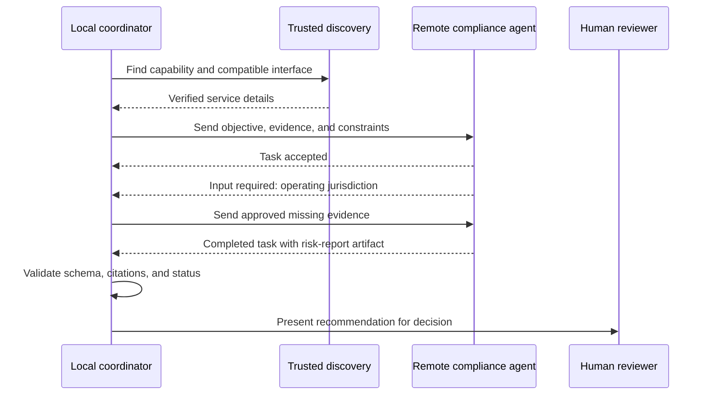
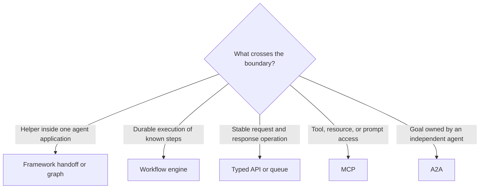
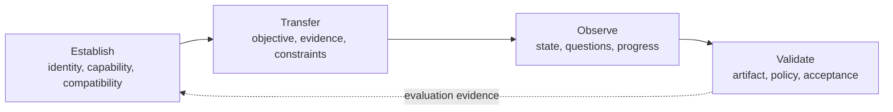
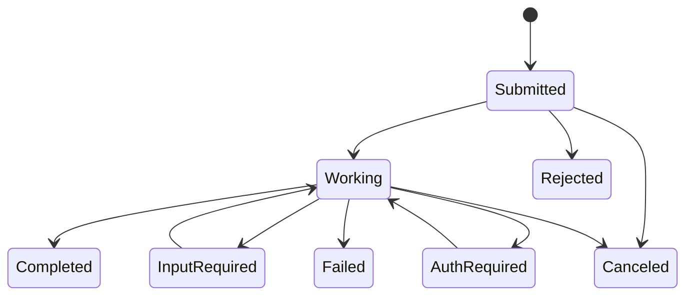

## Table of Contents

1. [How A Remote Agent Handoff Works](#how-a-remote-agent-handoff-works)
2. [Choose Local Or Remote Coordination Before The Protocol](#choose-local-or-remote-coordination-before-the-protocol)
3. [The Four Stages Of Agent Interoperability](#the-four-stages-of-agent-interoperability)
4. [Discover Capabilities And Verify The Remote Agent](#discover-capabilities-and-verify-the-remote-agent)
5. [Use Messages, Tasks, And Artifacts For Different Work](#use-messages-tasks-and-artifacts-for-different-work)
6. [Use Task States For Long-Running Work](#use-task-states-for-long-running-work)
7. [Include Business Context In Every Handoff](#include-business-context-in-every-handoff)
8. [Separate Service Identity From Delegated Authority](#separate-service-identity-from-delegated-authority)
9. [Preserve Trace And Audit Records Across The Handoff](#preserve-trace-and-audit-records-across-the-handoff)
10. [Plan Versioning, Failure, And Recovery](#plan-versioning-failure-and-recovery)
11. [Evaluate The Complete Agent Collaboration](#evaluate-the-complete-agent-collaboration)
12. [References](#references)

At a high level, **agent interoperability** is the ability of one agent system to give meaningful work to another agent system. The two systems may use different models, frameworks, memory stores, and tools. They can still collaborate if they agree on how to describe the work, exchange evidence, report progress, return results, and prove who was allowed to do what.

This matters once an agent crosses an ownership boundary. Calling a helper inside one application is ordinary software orchestration. Asking a separately deployed agent, perhaps owned by another team or vendor, to accept a task creates a distributed-system boundary. The caller no longer controls the remote runtime. The remote team can change how the agent reasons and which tools it uses. It can also change retry behaviour and stored state independently, so the interaction needs a dependable contract.

Agent2Agent, usually shortened to **A2A**, is an open protocol for this remote-agent boundary. It gives independently implemented agents a shared language for capability discovery, messages, durable tasks, progress updates, and artifacts. A2A supplies the communication model. Product teams still define the business meaning, security policy, acceptance criteria, and recovery rules around it.

## How A Remote Agent Handoff Works

<!-- section-summary: A complete remote handoff moves from trusted discovery to an accepted task, clarification, a validated artifact, and a locally controlled action. -->

Consider a procurement workflow that must review a supplier before onboarding can continue. A local coordinator has the supplier questionnaire, security evidence, and the organization's risk policy. A separate compliance agent specializes in reviewing these packages. The compliance service has its own deployment, models, tools, and operating team.

The coordinator first discovers what the compliance agent claims to support. It checks the service identity, chooses a compatible interface, and confirms that policy permits the evidence to leave the local system. It then sends a structured request containing the review objective, evidence references, constraints, and the expected report format.

The remote agent accepts the work as a durable task. During its review, it discovers that the supplier's operating jurisdiction is missing. Instead of guessing, it changes the task state to `input required` and explains which fact it needs. The coordinator retrieves that fact from an approved source and resumes the same task. The compliance agent eventually returns a structured risk report as an artifact.

The coordinator validates the report schema, checks that every high-risk conclusion cites evidence, and confirms that the task reached a successful terminal state. A human reviewer then decides whether onboarding may continue. The remote agent prepared a recommendation; the system that owns the procurement policy kept control of the final action.


```mermaid
sequenceDiagram
    participant C as Local coordinator
    participant D as Trusted discovery
    participant R as Remote compliance agent
    participant H as Human reviewer
    C->>D: Find capability and compatible interface
    D-->>C: Verified service details
    C->>R: Send objective, evidence, and constraints
    R-->>C: Task accepted
    R-->>C: Input required: operating jurisdiction
    C->>R: Send approved missing evidence
    R-->>C: Completed task with risk-report artifact
    C->>C: Validate schema, citations, and status
    C->>H: Present recommendation for decision
```

This interaction contains the whole subject in miniature. Discovery answers who can do the work. The handoff packet explains what the work means. The task records its lifecycle. Messages carry questions and answers. The artifact contains the deliverable. Identity and authorization control access. Validation and human review protect the final decision.

## Choose Local Or Remote Coordination Before The Protocol

<!-- section-summary: Local orchestration, workflow engines, typed APIs, MCP, and A2A address different collaboration boundaries. -->

Teams sometimes reach for an agent protocol as soon as two agents appear in an architecture diagram. The better starting question is simpler: **who owns each component, and what kind of interaction crosses the boundary?**

### Coordinate Inside One Ownership Boundary

For two agents inside one application, an in-process handoff, graph, or agent-as-tool pattern usually gives the developer enough control. The same team owns the state, deployment, observability, and failure policy. Frameworks such as LangGraph can make branching, pausing, and durable state explicit inside that application.

A workflow engine addresses a different problem. Temporal, Airflow, Dagster, and managed workflow services help an application persist steps, schedule work, retry failures, and resume after interruption. They coordinate work that the application already understands. A workflow engine may call remote agents, yet it does not define a standard language through which unrelated agents advertise capabilities or exchange task artifacts.

### Coordinate Across A Service Boundary

A typed API or queue contract fits a stable business operation. If another service exposes `calculate_shipping_quote(request)` and always returns the same response shape, agent discovery and a conversational task lifecycle add little value. Ordinary service contracts give tests a fixed request, response, and error model.

**Model Context Protocol (MCP)** connects an AI host to tools, resources, and prompts. An agent can use an MCP server to query a catalog, read a document, or invoke an approved action. The host remains responsible for the larger task and decides how those capabilities are used.

**A2A** fits an independent agent that accepts ownership of a goal. The remote agent may plan several steps, ask for clarification, work asynchronously, and return one or more artifacts. Its internal tools can remain private. In fact, an A2A agent may use MCP servers inside its own runtime.


```mermaid
flowchart TD
    A{"What crosses the boundary?"}
    A -->|"Helper inside one agent application"| B["Framework handoff or graph"]
    A -->|"Durable execution of known steps"| C["Workflow engine"]
    A -->|"Stable request and response operation"| D["Typed API or queue"]
    A -->|"Tool, resource, or prompt access"| E["MCP"]
    A -->|"Goal owned by an independent agent"| F["A2A"]
```

The procurement example needs A2A only if the compliance reviewer is truly an independent agent service. If compliance is a fixed policy function, a typed API is clearer. If it is a local specialist inside the coordinator, a framework handoff is enough. Choosing the smallest suitable boundary reduces protocol, security, and operational work.

## The Four Stages Of Agent Interoperability

<!-- section-summary: A reliable agent boundary establishes trust, transfers meaningful work, observes execution, and validates the returned outcome. -->

A larger operating framework gives every protocol feature a clear purpose. Without one, teams can implement discovery and message exchange yet still lose the goal, send excessive authority, or accept an unusable result. A dependable interaction therefore follows four stages from collaborator selection to outcome validation.

### Establish Trust And Transfer Work

**Establish** identifies a suitable collaborator. The caller discovers the service, verifies its identity, checks protocol compatibility, evaluates the advertised capability, and confirms that local policy permits the connection.

**Transfer** gives the remote agent enough information and authority to own the task. The request needs an objective, evidence, constraints, expected deliverables, and a bounded authorization scope. A vague prompt such as “review this supplier” leaves too much business meaning implicit.

### Observe Progress And Validate Results

**Observe** follows the work through a durable identity. The caller can see whether the task is submitted, running, blocked on input, completed, or failed. It can reconnect after a network interruption without starting the work again.

**Validate** decides whether the result is safe to accept. The caller checks task status, artifact schema, evidence coverage, policy compliance, and approval requirements. Completion means that the remote agent finished its work; acceptance means that the receiving system trusts and can use the result.


```mermaid
flowchart LR
    A["Establish<br/>identity, capability, compatibility"] --> B["Transfer<br/>objective, evidence, constraints"]
    B --> C["Observe<br/>state, questions, progress"]
    C --> D["Validate<br/>artifact, policy, acceptance"]
    D -. "evaluation evidence" .-> A
```

These stages also reveal ownership. The remote service owns how it performs the accepted task. The caller owns collaborator selection, evidence disclosure, result validation, and any local side effect. Both sides own a clear failure and support contract.

## Discover Capabilities And Verify The Remote Agent

<!-- section-summary: An A2A Agent Card advertises how to reach an agent and what it claims to do; local policy decides whether the caller may rely on that claim. -->

An **Agent Card** is the A2A discovery document. You can think of it as a machine-readable service profile. It describes the agent, the organization providing it, the skills it advertises, its security schemes, and the interfaces through which clients can communicate.

### What The Agent Card Describes

A public service can publish a card at `/.well-known/agent-card.json`. Enterprises can also use a curated registry or direct private configuration. A registry is often a better fit for internal services because platform teams can approve entries, attach ownership information, and remove an integration centrally.

In A2A 1.0, a card can advertise several supported interfaces. Each interface identifies an endpoint, a protocol binding, and a protocol version. Current standard bindings include JSON-RPC, HTTP with JSON, and gRPC. A client selects a combination it supports. The business meaning of a task should remain consistent across bindings even though streaming, performance, and transport failures differ.

### What The Caller Must Verify

Reading a card completes only the first half of discovery. The caller still needs to answer:

- Did the card come from an approved origin and the expected service identity?
- Is at least one advertised interface compatible with the client?
- Does an advertised skill match the required input and artifact?
- Has the service passed the organization's reliability and safety evaluations?
- May this caller disclose the required evidence and request this capability?

A signed Agent Card can help detect tampering and bind the document to its publisher. It still represents a capability claim. For example, a signed statement that an agent produces evidence-backed risk reports proves who made the statement. Contract tests and production outcome data show whether the service fulfils it.

Card updates deserve the same care as API changes. Cache them with normal HTTP controls such as expiry and `ETag`, retain the origin and digest, and re-run compatibility checks after high-impact changes. An authenticated extended card can reveal private capabilities to approved callers, which keeps sensitive skills out of public discovery.

## Use Messages, Tasks, And Artifacts For Different Work

<!-- section-summary: Messages carry communication, Parts hold typed content, Tasks give work a durable identity, and Artifacts represent deliverables. -->

A2A uses several objects because a conversation and a piece of work are not the same thing. Understanding their roles prevents a common design mistake: placing every question, status update, and result inside one unstructured text field.

### Use Messages And Parts For Communication

A **Message** is one turn of communication from the client or remote agent. The first message might request the supplier review. A later message can provide the missing jurisdiction. A remote message can explain why a task was rejected.

Each message contains one or more **Parts**. A Part holds a specific kind of content, such as text, structured JSON data, raw bytes, or a URL, together with useful metadata such as a media type or filename. In the review request, one text Part can explain the objective while a structured-data Part carries the policy constraints. Evidence can travel as governed references instead of copied documents.

### Use Tasks And Artifacts For Durable Work

A **Task** represents durable work. The server creates its identity and records its status, history, and artifacts. A `contextId` can group related tasks and messages into one broader interaction. If a completed report later needs a new regional assessment, the client creates a new task in the same context and refers to the earlier artifact. Terminal tasks stay terminal, preserving an unambiguous history of what finished and what came next.

An **Artifact** is a concrete output produced by the task. The compliance agent's report should be an artifact with its own identity, content type, and schema version. A short conversational acknowledgement can remain a message. Giving deliverables stable artifact identities lets the caller validate, store, compare, and audit them without extracting data from prose.

A2A `SendMessage` can return a direct message for a simple stateless exchange or a task for stateful work. That flexibility is useful, but clients should define which response shapes they accept for each capability. A production review workflow should not silently accept a friendly text response where a validated report artifact is required.

## Use Task States For Long-Running Work

<!-- section-summary: Explicit task states let callers distinguish active work, missing input, successful completion, rejection, failure, and cancellation. -->

Agent work often lasts longer than one HTTP request. It may wait for a human, call slow tools, or need information that the initial request omitted. A durable task lets the caller disconnect and return without losing the identity of the work.

### Use State Transitions To Guide The Caller

A typical task moves from `submitted` to `working`. The remote agent can enter `input required` if it needs more information or `auth required` if a fresh authorization step is necessary. Successful work reaches `completed`. Invalid or disallowed work can be `rejected`; execution problems can lead to `failed`; accepted cancellation can lead to `canceled`.


```mermaid
stateDiagram-v2
    [*] --> Submitted
    Submitted --> Working
    Submitted --> Rejected
    Submitted --> Canceled
    Working --> InputRequired
    InputRequired --> Working
    Working --> AuthRequired
    AuthRequired --> Working
    Working --> Completed
    Working --> Failed
    Working --> Canceled
```

The state names matter because they lead to different actions. `Input required` invites the caller to inspect the request, authorize the missing evidence, and continue the same task. `Rejected` indicates that the service refused the work, perhaps because the capability or policy did not allow it. `Failed` means execution began but could not finish. Treating all three as generic errors would produce poor retries and confusing user messages.

### Change Update Delivery Without Changing The Task

A2A offers several ways to receive updates. **Polling** with `GetTask` is suitable for short or low-volume background work. The client asks for current state at a controlled interval. **Streaming** uses server-sent events for interactive progress and artifacts, and a client can subscribe again after a connection breaks. **Push notifications** suit long-running server-to-server work where the caller may be offline, provided the webhook endpoint authenticates the sender and protects against replay.

Choose one primary delivery mode per use case and keep reconciliation available. A lost stream must not imply a lost task. The client stores the task ID, reconnects or calls `GetTask`, and continues from durable server state.

Cancellation also needs precise expectations. A cancellation request asks the remote agent to stop future work. It cannot reverse an email, database change, or external approval that already happened. High-impact side effects therefore need their own idempotency keys, status records, and compensation procedures.

## Include Business Context In Every Handoff

<!-- section-summary: A2A transports the interaction, while an application-level packet defines the objective, evidence, constraints, acceptance criteria, and continuity data. -->

The protocol can tell the remote agent that a message belongs to a task, yet it cannot know what an acceptable supplier review looks like for your organization. That meaning belongs in a versioned **business handoff packet**.

### Include Five Required Handoff Fields

The packet should answer five practical questions. What outcome is requested? Which evidence may the receiver use? Which rules and limits apply? What must the artifact contain? How can both systems correlate this task with the surrounding workflow?

```json
{
  "handoff_version": "supplier-review.v2",
  "objective": "Assess the supplied onboarding evidence and produce a risk report",
  "evidence": [
    {
      "reference": "governed://supplier-questionnaire/current",
      "kind": "questionnaire",
      "provenance": "supplier-submitted"
    },
    {
      "reference": "governed://security-scan/approved-result",
      "kind": "security-scan",
      "provenance": "internal-tool"
    }
  ],
  "constraints": {
    "allowed_action": "draft_recommendation",
    "prohibited_data": ["personal_contact_details"],
    "policy_version": "supplier-risk.v4"
  },
  "acceptance": {
    "artifact_schema": "supplier-risk-report.v3",
    "required_sections": ["findings", "evidence_links", "recommended_controls"]
  },
  "continuity": {
    "workflow_id": "workflow-8f31",
    "request_id": "request-2c19"
  }
}
```

### Read The Handoff From Evidence To Acceptance

The example uses references to governed evidence. This gives the receiving agent a narrow retrieval path and avoids copying sensitive documents into messages, traces, and task history. Provenance distinguishes a supplier's own claim from a finding produced by an approved internal scanner.

Constraints define the authority boundary. The remote agent may draft a recommendation, while the local procurement system retains the onboarding decision. The policy version tells investigators which rules shaped the result. Acceptance criteria turn “produce a good report” into something the caller can validate mechanically and review meaningfully.

The handoff packet can be a structured Part inside an A2A message. The same packet could also travel through a typed API or queue, which is why it deserves its own schema and version. Protocol conformance confirms that the systems can communicate. Packet validation confirms that they understand the same business request.

## Separate Service Identity From Delegated Authority

<!-- section-summary: The remote service must know which system is calling, whose authority it represents, and exactly which capability and data that authority permits. -->

Cross-agent calls often involve two identities. The first is the calling service, such as the procurement coordinator. The second is the user or workflow authority behind the request, such as a reviewer who is permitted to assess one supplier.

### Use Service Identity To Prove Who Connected

Authentication proves the caller's service identity. A2A declares supported security schemes in the Agent Card, while credentials travel through the HTTP transport. Depending on the environment, this may use OAuth, OpenID Connect, mutually authenticated TLS, or cloud workload identity. Business text inside a message never serves as proof of identity.

### Use Delegation To Limit What The Caller May Request

Delegation answers a different question: what may this service do on behalf of a person or workflow? A safe delegated credential has a narrow audience, short lifetime, explicit scopes, and a clear subject. The compliance agent might receive permission to read two evidence objects and create one draft report. It should not receive the coordinator's broad cloud credentials or the reviewer's complete permission set.

Imagine that the remote agent asks for access to an additional financial record. The coordinator checks whether that record is relevant, whether policy allows disclosure to this service, and whether the current delegated token covers it. If approval is missing, the task remains blocked or is rejected. Automatically forwarding the caller's credentials would bypass all three controls.

Keep final side effects close to the system that owns the policy. The remote compliance agent can recommend “approve with controls.” A local workflow validates the artifact and asks an authorized human or tightly scoped tool to record the decision. This design contains the impact of a compromised or mistaken remote agent.

## Preserve Trace And Audit Records Across The Handoff

<!-- section-summary: Trace context connects technical execution across services, while durable application records explain the task, authority, artifacts, approvals, and effects. -->

Distributed tracing and audit records solve related but different problems. A trace helps an engineer follow one request through services and locate latency or failures. An audit record explains the business event: who requested the work, which evidence was shared, what the remote agent returned, and who approved the resulting action.

### Trace The Technical Path

W3C Trace Context provides the `traceparent` header used by OpenTelemetry and many observability platforms. Propagating it across the A2A call lets local and remote spans appear in one distributed trace when both sides support that arrangement. The trace ID alone is insufficient for recovery because traces can be sampled or retained for a limited period.

### Record The Business Event

Store durable application identifiers beside telemetry: the local workflow ID, client request ID, remote task and context IDs, selected agent and interface, handoff-packet digest, artifact IDs and schema versions, authorization decision, final task status, approvals, and external side effects. These records let an operator reconstruct the collaboration even after detailed traces expire.

For example, an engineer investigating a delayed review can use the trace to find a slow document-retrieval span. A governance reviewer examining the same case needs the policy version, evidence references, artifact digest, and human approval record. One shared correlation map connects those two investigations.

Interoperability never requires the remote service to reveal private chain-of-thought or internal memory. Useful operational evidence starts with observable inputs and state transitions. It then connects approved tool or policy decisions to the returned artifacts and final outcome. Sensitive payloads can remain in governed stores while traces retain classifications, digests, and access-controlled references.

## Plan Versioning, Failure, And Recovery

<!-- section-summary: Several independently changing layers and several uncertain failure points require explicit compatibility, reconciliation, idempotency, and rollback policies. -->

An agent boundary changes at several layers. The A2A protocol and chosen binding may evolve. The Agent Card can advertise new interfaces or authentication. A skill description can change. The business packet and artifact schemas have their own versions. The remote agent's model, prompts, tools, and workflow can change even if every wire schema stays identical.

### Version Each Layer Separately

Manage those layers separately. Negotiate protocol and interface through the Agent Card. Give business packets and artifacts explicit schema versions. Add optional fields for compatible evolution, reject unknown critical requirements, and run contract tests across every supported client-server pair.

A behavioural agent release needs its own release path. Run task-level evaluations first, then use canary traffic and outcome monitoring. Keep the previous implementation available as a rollback target until the new behaviour is proven.

### Recover From An Uncertain State

Failure handling begins by asking who owns the durable truth:

- If submission fails before the server creates a task, the caller can retry within a bounded budget.
- If the network fails after possible acceptance, the caller reconciles through the request or task identity before submitting again.
- If the task needs input, the caller validates and authorizes that evidence before resuming it.
- If a stream disconnects, the caller reconnects or polls the existing task.
- If an artifact fails validation, the caller keeps the external side effect blocked and requests correction through a new task or message allowed by the capability.
- If the remote service is unavailable, the workflow uses an approved queue, alternate service, or human route.

Retry budgets must cover the complete chain. Five coordinator retries multiplied by five remote retries can create long delays and duplicate work. Idempotency keys protect external actions; deadlines limit stale work; circuit breakers protect an unhealthy dependency; reconciliation jobs find tasks whose local and remote state disagree.

Test the uncomfortable paths before production: duplicate submissions, reordered status updates, expired credentials, unsupported versions, malformed artifacts, cancellation races, and a remote task that completes after the local deadline. These are normal distributed-system conditions, even if every model response is excellent.

## Evaluate The Complete Agent Collaboration

<!-- section-summary: Interop evaluation measures collaborator selection, information preservation, policy enforcement, lifecycle correctness, artifact quality, and the final business outcome. -->

Two capable agents can still collaborate poorly. The coordinator may select the wrong skill, omit essential evidence, disclose restricted data, misread `input required` as failure, or accept a malformed artifact. Agent-level benchmarks will miss these boundary errors.

Build evaluation cases around the four-stage framework. Establishment tests cover trusted discovery, interface compatibility, and correct skill selection. Transfer tests verify that required evidence and constraints survive the handoff. Observation tests exercise long-running work, clarification, reconnect, cancellation, and terminal states. Validation tests check artifact schemas, evidence links, policy decisions, approval gates, and duplicate prevention.

The supplier review provides a useful end-to-end case. Remove the jurisdiction and confirm that the remote agent requests it. Replace the approved scanner result with an untrusted reference and confirm that policy blocks disclosure. Return a report with a missing evidence link and confirm that the coordinator rejects the artifact. Replay the completion event and confirm that onboarding is recorded only once.

Measure protocol conformance and product outcomes separately. Conformance tests show whether messages, tasks, updates, and bindings follow A2A. Product evaluations measure completion rate, artifact validity, evidence coverage, policy violations, human correction rate, latency, cost, and audit completeness.

The main design lesson is boundary ownership. Use local orchestration for collaborators inside one agent system, workflow engines for durable known processes, typed APIs for stable operations, MCP for tool and context access, and A2A for independent agents that own a task. Around every remote-agent call, keep a versioned business packet, bounded authority, durable task identity, traceable evidence, and tested recovery paths.

## References

- [A2A Protocol specification](https://a2a-protocol.org/latest/specification/)
- [A2A key concepts](https://a2a-protocol.org/latest/topics/key-concepts/)
- [A2A agent discovery](https://a2a-protocol.org/latest/topics/agent-discovery/)
- [A2A task lifecycle](https://a2a-protocol.org/latest/topics/life-of-a-task/)
- [A2A streaming and asynchronous operations](https://a2a-protocol.org/latest/topics/streaming-and-async/)
- [A2A enterprise security guidance](https://a2a-protocol.org/latest/topics/enterprise-ready/)
- [A2A and MCP](https://a2a-protocol.org/latest/topics/a2a-and-mcp/)
- [Model Context Protocol specification](https://modelcontextprotocol.io/specification/latest)
- [W3C Trace Context](https://www.w3.org/TR/trace-context/)
