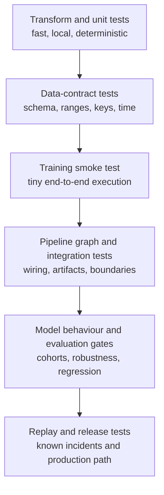

## Why ML Pipeline Tests Need More Than Unit Tests
<!-- section-summary: ML pipeline tests cover code, data contracts, training behavior, evaluation gates, orchestration, and release evidence. -->

Testing an ML pipeline is different from testing a small web function. You still test Python functions, SQL transforms, and API clients, but the pipeline can fail even when every function imports. A feature column can silently change units. A join can multiply rows. A training job can finish with a model that has terrible recall for the segment that matters most. A pipeline can run in the wrong order and publish a model trained on yesterday's labels.

Think about a company called `FleetLens` that predicts which delivery vans need maintenance next week. The pipeline reads telematics events, joins them with repair tickets, creates rolling features, trains a gradient boosting model, evaluates by vehicle type, registers a candidate model, and publishes batch scores. If a developer changes the tire-pressure transform, a normal unit test may pass while the fleet operations team loses trust in every prediction.

You want a layered test suite:

- Fast code tests for pure functions and feature transforms.
- Data contract tests for schemas, missing values, ranges, and uniqueness.
- Training smoke tests that run on a tiny dataset.
- Evaluation tests that block weak candidates.
- Pipeline tests that check task wiring, artifact names, and promotion gates.
- Production replay tests for scary historical cases.



The layers answer different questions. A transform test can identify a reversed subtraction precisely. A data contract can stop a malformed batch before training. A smoke test proves the entry point and artifact path work. Evaluation and replay operate later because they need a trained candidate and more representative evidence.

The goal is early, cheap feedback. A pull request should catch obvious issues in minutes, long before a GPU job, Spark cluster, or managed training service burns money.


*FleetLens uses several cheap test layers so a pull request can catch feature, data, training, graph, and report problems before a costly run starts.*

## Test The Transform Before The Model
<!-- section-summary: Focused transform tests catch feature errors close to the code that introduced them. -->

Most production model failures start in the data path. If you only test final metrics, you find data bugs late and with weak clues. Test transforms close to the code that creates each feature.

Here is a tiny transform for FleetLens:

```python
import pandas as pd


def add_pressure_features(events: pd.DataFrame) -> pd.DataFrame:
    events = events.copy()
    events["pressure_delta"] = events["recommended_psi"] - events["measured_psi"]
    events["under_pressure_flag"] = (events["pressure_delta"] >= 7).astype(int)
    return events
```

A useful unit test checks behavior that matters to the model, rather than only checking that a column exists:

```python
import pandas as pd
from fleetlens.features import add_pressure_features


def test_under_pressure_flag_uses_recommended_minus_measured():
    events = pd.DataFrame(
        {
            "vehicle_id": ["van-7", "van-8"],
            "recommended_psi": [44, 44],
            "measured_psi": [35, 43],
        }
    )

    actual = add_pressure_features(events)

    assert actual["pressure_delta"].tolist() == [9, 1]
    assert actual["under_pressure_flag"].tolist() == [1, 0]
```

That test catches a common bug: reversing the subtraction. It also documents the business rule in a way a new teammate can understand.

## Validate Data Contracts
<!-- section-summary: Data contracts describe what the pipeline expects at a boundary. They are useful at ingestion, after joins, before training, and before publishing scores. -->

Data contracts describe what the pipeline expects at a boundary. They are useful at ingestion, after joins, before training, and before publishing scores.

For local pandas-heavy projects, `pandera` gives you a readable schema:

```python
import pandera.pandas as pa
from pandera.typing import Series


class TelematicsBatch(pa.DataFrameModel):
    vehicle_id: Series[str] = pa.Field(str_length={"min_value": 1})
    event_ts: Series[pa.DateTime]
    measured_psi: Series[float] = pa.Field(ge=0, le=120)
    recommended_psi: Series[float] = pa.Field(ge=20, le=80)
    odometer_miles: Series[float] = pa.Field(ge=0)


def validate_telematics(df):
    return TelematicsBatch.validate(df, lazy=True)
```

For warehouse-scale validation, teams often use Great Expectations or TensorFlow Data Validation. Current GX Core separates an **Expectation Suite** containing rules, a **Batch Definition** describing the data slice, a **Validation Definition** connecting the two, and an optional **Checkpoint** that runs validations and actions. The same framework applies regardless of library: identify the exact batch, apply a versioned contract, retain the result, and stop the pipeline when a required condition fails.

FleetLens checks `vehicle_id` nulls, allowed `maintenance_label` values, tire-pressure ranges, duplicate entity-week keys, and row-count bounds. Freshness and leakage still need time-aware assertions because generic schema validation cannot decide what was knowable at prediction time. The release record should retain the contract version, batch identity, result, and human-readable report instead of one pass/fail log line.

Keep contracts specific. "The dataframe has rows" is weak. "Each vehicle has at most one label for a target week" is much stronger.


*A data contract turns the FleetLens telematics batch into concrete release checks for freshness, ranges, labels, and leakage.*

## Add A Training Smoke Test
<!-- section-summary: A smoke test proves the training entrypoint can run end to end on a tiny fixture. It should finish quickly and avoid external services where possible. -->

A smoke test proves the training entrypoint can run end to end on a tiny fixture. It should finish quickly and avoid external services where possible.

```python
from pathlib import Path
from fleetlens.train import train_model


def test_training_smoke_run(tmp_path: Path):
    result = train_model(
        train_path="tests/fixtures/tiny_train.parquet",
        valid_path="tests/fixtures/tiny_valid.parquet",
        output_dir=tmp_path,
        max_rounds=5,
    )

    assert (tmp_path / "model.joblib").exists()
    assert result.metrics["valid_auc"] >= 0.50
    assert result.signature.inputs["measured_psi"] == "float"
```

The metric threshold is intentionally low because the dataset is tiny. The test is checking that the code path works, artifacts are written, and model metadata is present. Real quality gates belong in evaluation jobs with real validation data.

Smoke tests should also catch dependency mistakes:

- The training package imports in a clean environment.
- The entrypoint accepts the same config keys used by the orchestrator.
- Artifacts are written to the configured output path.
- The model can be loaded after training.
- The prediction function accepts the expected feature schema.

## Test Pipeline Behavior
<!-- section-summary: An ML pipeline is a graph of steps. A bug in the graph can skip validation, publish the wrong artifact, or run training before the feature backfill finishes. -->

An ML pipeline is a graph of steps. A bug in the graph can skip validation, publish the wrong artifact, or run training before the feature backfill finishes.

For Airflow, you can parse DAGs in CI:

```python
from airflow.models import DagBag


def test_fleetlens_dag_imports():
    dag_bag = DagBag(dag_folder="dags", include_examples=False)
    assert dag_bag.import_errors == {}


def test_validation_runs_before_training():
    dag = DagBag(dag_folder="dags", include_examples=False).get_dag("fleetlens_training")
    assert "validate_training_data" in dag.task_ids
    assert "train_model" in dag.task_ids
    assert dag.get_task("validate_training_data") in dag.get_task("train_model").upstream_list
```

For Kubeflow, Prefect, Dagster, or managed cloud pipelines, apply the same idea: check the compiled graph or pipeline definition before a real run. Look for required steps, artifact names, environment variables, resource requests, and promotion gates.

## Mock Services At The Boundary
<!-- section-summary: Boundary adapters and dry-run clients keep pipeline tests away from production warehouses, registries, buckets, and notification services. -->

Pipeline tests should avoid touching production systems. That sounds obvious, yet many ML projects accidentally run tests against the real warehouse, real registry, or real object bucket because the training script reads environment variables directly.

Create a boundary around each external dependency:

- A data reader that can load from a fixture path during tests.
- An artifact writer that can write to a temporary directory.
- A registry client wrapper that can run in dry-run mode.
- A feature store client that can return a small in-memory table.
- A notification client that records messages instead of posting to Slack.

The boundary contract should be small enough to fake without recreating the provider SDK. For a registry adapter, the test double can record model name, artifact URI, source run, signature, and required tags. CI then verifies the call and returns a synthetic version. A separate integration environment tests authentication and the real registry API with an isolated namespace.

This division keeps PR tests fast and safe while still exercising release logic. It also distinguishes two failures: application code built the wrong registry request, or the external integration rejected a correct request.

## Gate Candidate Models With Evaluation Tests
<!-- section-summary: Training can pass while the model should still stay out of production. Evaluation tests decide whether a candidate is good enough for the next environment. -->

Training can pass while the model should still stay out of production. Evaluation tests decide whether a candidate is good enough for the next environment.

FleetLens could use gates like:

```yaml
# config/model-quality-gates.yaml
model_quality_gates:
  global:
    roc_auc_min: 0.82
    precision_at_10_percent_min: 0.35
  segments:
    electric_vans:
      recall_min: 0.62
    diesel_vans:
      recall_min: 0.58
  regression_checks:
    compare_to_alias: champion
    max_auc_drop: 0.01
    max_segment_recall_drop: 0.03
```

Then the evaluator can fail the pipeline with a clear message:

The evaluator has a straightforward responsibility: load the immutable candidate report, resolve the concrete baseline version behind the configured alias, evaluate every rule, and return a structured list of failures. A missing required segment fails the comparison instead of disappearing from the average.

Test the policy engine separately from model training. Start with one passing candidate and baseline, then parameterize cases that violate one rule at a time. Each case should identify the expected rule ID. Add explicit cases for a missing candidate segment, missing baseline segment, wrong baseline identity, malformed report, and a value exactly on each boundary.

Use gates carefully. A single global accuracy number can hide harm. Segment gates make the release process more honest. Store the decision report with the policy digest, candidate report digest, concrete baseline version, sample counts, and uncertainty evidence so the result can be reproduced after aliases move.

## Test Model Behavior, Not Only One Metric
<!-- section-summary: Model behavior tests check invariants, directional expectations, robustness, slices, and statistical tolerances that one aggregate score can miss. -->

An evaluation threshold answers whether a candidate cleared one measured bar. A **model behavior test** checks a relationship the model should preserve across inputs. These tests are useful because many ML outputs have no single exact expected value. FleetLens cannot write a unit test for the precise failure probability of every van, but it can test properties that the maintenance workflow depends on.

The useful test families are:

| Test family | FleetLens example | What failure means |
|---|---|---|
| **Invariant** | Reordering input rows does not change each vehicle's score | Batch code mixes state between examples |
| **Directional** | Holding other fields fixed, a severe pressure deficit should not lower maintenance risk | Feature sign, preprocessing, or model behavior conflicts with the reviewed rule |
| **Metamorphic** | Converting a fixture from miles to kilometres and applying the matching conversion keeps the decision stable | Unit handling differs across paths |
| **Robustness** | Small sensor noise stays inside an agreed score tolerance | The model is too sensitive near ordinary measurement noise |
| **Slice regression** | Electric and diesel van recall stay inside approved deltas from the champion | A global improvement hides a fleet-specific regression |
| **Replay** | Historical tire-pressure and battery incidents still trigger the expected review band | A known production failure returned |

An **invariant** is a property that should stay unchanged. A **directional expectation** says which way an output should move under a controlled input change. A **metamorphic test** creates a second input through a known transformation, then checks the expected relationship between the two outputs. These tests need domain review. A convenient rule that lacks product or engineering support can freeze the wrong behavior into CI.

For example, FleetLens receives odometer readings in miles or kilometres. The reviewed preprocessing contract converts either unit to miles before scoring. A metamorphic test creates two representations of the same van and requires the model score to stay equal within floating-point tolerance:

```python
import numpy as np
import pandas as pd


def prepare_model_input(frame: pd.DataFrame) -> pd.DataFrame:
    prepared = frame.copy()
    factor = prepared["odometer_unit"].map({"miles": 1.0, "kilometres": 0.621371})
    prepared["odometer_miles"] = prepared["odometer_value"] * factor
    return prepared.drop(columns=["odometer_value", "odometer_unit"])


def test_equivalent_distance_units_preserve_maintenance_score(model):
    miles = pd.DataFrame(
        [{"vehicle_id": "van-7", "odometer_value": 62_137.1,
          "odometer_unit": "miles", "measured_psi": 35.0}]
    )
    kilometres = pd.DataFrame(
        [{"vehicle_id": "van-7", "odometer_value": 100_000.0,
          "odometer_unit": "kilometres", "measured_psi": 35.0}]
    )

    score_miles = model.predict_proba(prepare_model_input(miles))[:, 1]
    score_km = model.predict_proba(prepare_model_input(kilometres))[:, 1]

    np.testing.assert_allclose(score_miles, score_km, rtol=1e-5, atol=1e-7)
```

This test catches a unit branch that skips conversion or applies the factor in the wrong direction. The tolerance allows insignificant floating-point rounding while still rejecting a product-visible change.

Numerical assertions should use tolerances and enough repeated evidence for the model type. A training smoke test can use a loose floor because it checks mechanics. A candidate comparison should report sample size, paired deltas, uncertainty where appropriate, and pre-agreed segment limits. Tests should avoid requiring byte-identical floating-point output across different hardware when the release decision only needs predictions to stay inside a meaningful tolerance.

The full test framework now has distinct jobs: code tests check deterministic logic, data tests protect inputs, smoke tests prove the job runs, behavior tests protect model relationships, evaluation gates judge candidate evidence, pipeline tests protect orchestration, and replay tests preserve lessons from production incidents. This hierarchy gives a failed check one clear owner and response.

## Run The Right Tests In CI
<!-- section-summary: Your pull-request workflow should separate fast checks from expensive checks. Fast checks run on every PR. Heavier checks run on main, nightly, or when training code changes. -->

Your pull-request workflow should separate fast checks from expensive checks. Fast checks run on every PR. Heavier checks run on main, nightly, or when training code changes.

:::expand[Implement the split CI workflow]{kind="example"}

```yaml
name: ml-pipeline-tests

on:
  pull_request:
    paths:
      - "src/**"
      - "pipelines/**"
      - "dags/**"
      - "tests/**"
      - "pyproject.toml"
      - "uv.lock"
      - ".github/workflows/ml-pipeline-tests.yml"

jobs:
  fast-tests:
    runs-on: ubuntu-latest
    steps:
      - uses: actions/checkout@v6
      - uses: astral-sh/setup-uv@v8.3.2
        with:
          python-version: "3.12"
          enable-cache: true
      - run: uv lock --check
      - run: uv sync --locked --all-extras --dev
      - run: uv run pytest tests/unit tests/contracts tests/pipeline -q

  training-smoke:
    runs-on: ubuntu-latest
    needs: fast-tests
    steps:
      - uses: actions/checkout@v6
      - uses: astral-sh/setup-uv@v8.3.2
        with:
          python-version: "3.12"
      - run: uv sync --locked --all-extras --dev
      - run: uv run pytest tests/smoke/test_training_entrypoint.py -q
```

:::

This workflow avoids running a full training job on every documentation change. It also installs the dependency set recorded in `uv.lock`; CI fails if `pyproject.toml` and the lockfile disagree. Teams using Poetry, PDM, pip-tools, or the standard `pylock.toml` format can apply the same rule: commit a reviewed lock, check that it is current, and install from that lock without resolving a fresh environment during every run.

## Save Test Reports As Artifacts
<!-- section-summary: CI artifacts give reviewers durable validation reports, feature summaries, smoke metrics, and release decisions. -->

When a pipeline blocks a model, the reviewer should see why without digging through raw logs. CI can upload validation reports, feature summaries, smoke-run metrics, and evaluation decisions as artifacts.

For example, a PR check can produce:

```json
{
  "pipeline": "fleetlens_training",
  "commit": "abc123",
  "checks": {
    "unit_tests": "passed",
    "data_contracts": "passed",
    "training_smoke": "passed",
    "pipeline_graph": "passed"
  },
  "fixtures": {
    "tiny_train_rows": 32,
    "tiny_valid_rows": 16
  },
  "release_ready": false,
  "reason": "full validation runs after merge on scheduled training data"
}
```

Upload the report as a CI artifact using the current supported artifact action for the runner environment. GitHub-hosted runners receive supported runner updates automatically; self-hosted runners need an explicit upgrade policy. Pin third-party actions according to the organisation's supply-chain policy and keep those pins current through dependency automation.

Evidence turns CI from a red or green icon into a teaching tool. A junior engineer can open the report and learn which layer failed.


*The report gives reviewers a quick path from a failed gate to the next fix, instead of sending them through raw CI logs first.*

## Build Useful Test Fixtures
<!-- section-summary: Fixtures are small datasets designed to catch mistakes. They should be tiny, readable, and intentionally awkward. -->

Fixtures are small datasets designed to catch mistakes. They should be tiny, readable, and intentionally awkward.

Good ML fixtures include:

- A row with a missing optional feature.
- A row with a missing required feature.
- A rare category.
- A known leakage column that should be dropped.
- A segment with a different label rate.
- A duplicate entity and timestamp.
- A historical incident example.

For FleetLens, keep `tests/fixtures/tiny_train.parquet` small enough for CI and add a markdown note describing why each row exists. A future developer should be able to say, "Row 8 protects us from the tire-pressure units bug."

## Common Mistakes
<!-- section-summary: Production ML tests must cover data, features, artifacts, orchestration, integrations, and release decisions alongside model quality. -->

The easiest mistake is treating model quality as the only test. A production ML pipeline also needs tests for data shape, feature logic, artifact metadata, orchestration, and release decisions.

Other common mistakes:

- Tests depend on live production databases.
- Tests use random data without fixed seeds.
- Fixtures are too large for PR feedback.
- Pipeline graph checks are skipped because the graph is "just configuration."
- Evaluation gates use only global metrics.
- CI checks write to the real model registry.
- The same test suite handles every risk, so no one knows which layer failed.

Start small. Add one good transform test, one data contract, one smoke test, and one quality gate. Then extend the suite each time an incident or review exposes a missing guardrail.

## Review Changes Through The Test Layers
<!-- section-summary: A pipeline review traces a change through focused code, data, training, workflow, integration, and model-behaviour evidence. -->

The layered test framework also gives code review a stable order. Start at the cheapest layer that can observe the change, then follow its contracts into later layers. A feature transform needs a focused unit test and a data contract. A changed training input needs a smoke run and artifact evidence. A changed release rule needs an evaluation gate and an isolated integration test.

When you review an ML pipeline pull request, use these questions to trace that path:

- Which transform changed, and where is the focused test for that transform?
- Which schema or data contract protects the new column?
- Which tiny fixture proves the code path runs without a warehouse-sized dataset?
- Which artifact metadata will help you reproduce the run later?
- Which test fails if the target leaks into the feature list?
- Which segment metric protects the users most likely to be harmed?
- Which external service is mocked or isolated during CI?
- Which report will a reviewer open when the check fails?

The questions support the test layers; they do not replace them. The review should identify which failure surface changed, which test observes it earliest, and which later evidence proves the whole pipeline still preserves its contracts.

## References

- [pytest documentation](https://docs.pytest.org/en/stable/getting-started.html)
- [Google Research: The ML Test Score](https://research.google/pubs/the-ml-test-score-a-rubric-for-ml-production-readiness-and-technical-debt-reduction/)
- [Google: Rules of Machine Learning](https://developers.google.com/machine-learning/guides/rules-of-ml)
- [GitHub Actions workflow syntax](https://docs.github.com/actions/using-workflows/workflow-syntax-for-github-actions)
- [Great Expectations Validation Definitions](https://docs.greatexpectations.io/docs/core/run_validations/create_a_validation_definition/)
- [Great Expectations Checkpoints and Actions](https://docs.greatexpectations.io/docs/core/trigger_actions_based_on_results/run_a_checkpoint/)
- [uv locking and syncing](https://docs.astral.sh/uv/concepts/projects/sync/)
- [TensorFlow Data Validation](https://www.tensorflow.org/tfx/data_validation/get_started)
- [Pandera documentation](https://pandera.readthedocs.io/en/stable/)
- [MLflow Model Registry](https://mlflow.org/docs/latest/ml/model-registry/)
