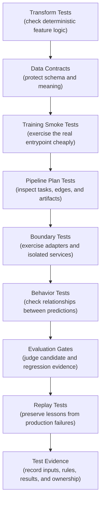
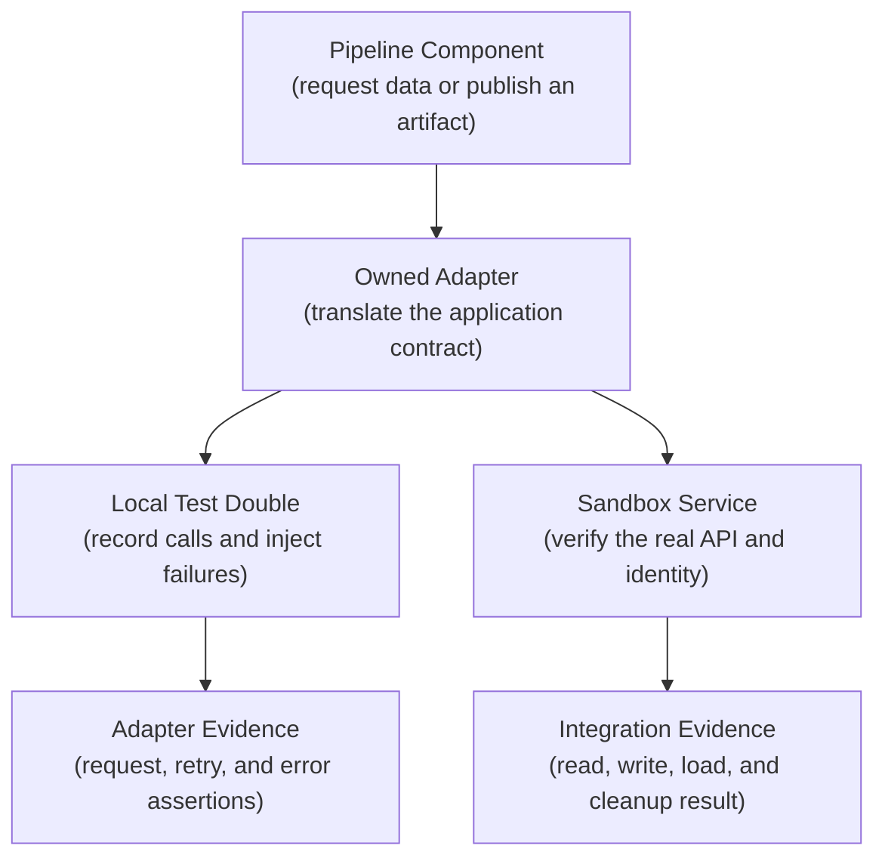
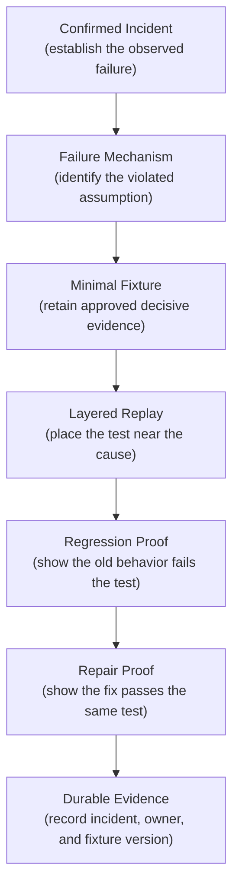

## Table of Contents

1. [Why ML Pipelines Need Layered Tests](#why-ml-pipelines-need-layered-tests)
2. [Test Each Part Of The ML Pipeline In Order](#test-each-part-of-the-ml-pipeline-in-order)
3. [Test Small Data Transformations First](#test-small-data-transformations-first)
4. [Define And Test What Data Each Pipeline Step Accepts](#define-and-test-what-data-each-pipeline-step-accepts)
5. [Run A Small End-To-End Training Test](#run-a-small-end-to-end-training-test)
6. [Check The Pipeline Graph Before Running It](#check-the-pipeline-graph-before-running-it)
7. [Test External Services With Adapters And Sandboxes](#test-external-services-with-adapters-and-sandboxes)
8. [Test How Predictions Respond To Meaningful Input Changes](#test-how-predictions-respond-to-meaningful-input-changes)
9. [Check Model Quality And Regressions Before Release](#check-model-quality-and-regressions-before-release)
10. [Turn Production Failures Into Regression Tests](#turn-production-failures-into-regression-tests)
11. [Build Small Test Datasets With A Clear Purpose](#build-small-test-datasets-with-a-clear-purpose)
12. [Save Enough Test Evidence To Reproduce A Failure](#save-enough-test-evidence-to-reproduce-a-failure)
13. [Investigate The Earliest Failed Test Layer First](#investigate-the-earliest-failed-test-layer-first)
14. [Keep Test Commands Separate From CI Scheduling](#keep-test-commands-separate-from-ci-scheduling)
15. [The Main Idea](#the-main-idea)
16. [References](#references)

## Why ML Pipelines Need Layered Tests
<!-- section-summary: ML pipeline testing checks the assumptions connecting code, data, training, orchestration, external systems, model behavior, and release evidence. -->

A training job can exit successfully while using the wrong feature column, leaking future data, or publishing an incomplete model bundle. **Testing an ML pipeline** means checking the important assumptions that turn raw data into a candidate model. The pipeline is the repeatable chain that collects data, creates features, trains a model, evaluates it, and publishes the resulting artifacts. That chain may contain Python, SQL, an orchestrator, cloud storage, managed training jobs, and a model registry.

The difficult part is that a pipeline can complete without producing trustworthy results. A warehouse query can duplicate each customer three times. Training still returns exit code zero. The model file still loads. An evaluation job may even report a higher score if the duplicate rows caused leakage between the training and validation sets. The system looks healthy from the outside while its evidence has become unreliable.

This is why one end-to-end test cannot carry the whole burden. A failure at the final metric tells the team that something changed, yet it gives weak clues about the cause. A focused transformation test can identify a reversed subtraction. A data contract can identify duplicate customer-period keys. A training smoke test can identify a missing dependency. A graph test can identify a validation step that no longer precedes training.

A useful suite therefore has layers. Each layer answers one question with the smallest realistic input available. Its failure report points to the team that owns the boundary.

## Test Each Part Of The ML Pipeline In Order
<!-- section-summary: The test framework moves from deterministic code toward representative evidence, placing cheap and precise checks before broader and more expensive ones. -->

The layers follow the path taken by a production training run. Early layers test small deterministic units. Later layers need more infrastructure, more representative data, or an actual candidate model.


```mermaid
flowchart TD
    A["Transform Tests<br/>(check deterministic feature logic)"] --> B["Data Contracts<br/>(protect schema and meaning)"]
    B --> C["Training Smoke Tests<br/>(exercise the real entrypoint cheaply)"]
    C --> D["Pipeline Plan Tests<br/>(inspect tasks, edges, and artifacts)"]
    D --> E["Boundary Tests<br/>(exercise adapters and isolated services)"]
    E --> F["Behavior Tests<br/>(check relationships between predictions)"]
    F --> G["Evaluation Gates<br/>(judge candidate and regression evidence)"]
    G --> H["Replay Tests<br/>(preserve lessons from production failures)"]
    H --> I["Test Evidence<br/>(record inputs, rules, results, and ownership)"]
```

The order also guides investigation. A data-contract failure deserves attention before anyone debates a drop in model recall. The candidate was evaluated on evidence that already violated its input assumptions. If every earlier layer passes and a segment regression remains, the investigation can concentrate on training data, model behavior, or the release policy.

Each layer needs positive and negative cases. A positive case proves that an accepted input follows the expected path. A **negative test** deliberately supplies an invalid condition and confirms that the system rejects it with a useful error. Without negative tests, a validator may appear healthy because every fixture already satisfies its rules.


*The same pipeline needs several kinds of tests. The earliest failed layer narrows the investigation before later model evidence is trusted.*

## Test Small Data Transformations First
<!-- section-summary: Deterministic transformation tests protect feature calculations, filtering, joins, and time logic with exact, local examples. -->

A **deterministic transformation** produces the same output from the same declared inputs. It has no hidden dependency on the current clock, a live database, an environment variable, or unseeded randomness. Most feature logic should move toward this shape because exact tests can then describe the intended rule.

### Make Hidden Inputs Explicit

Consider an account-age feature used by a subscription model. The feature must measure whole days between account creation and prediction time. A future creation timestamp signals corrupt input. The transformation and its tests can express both rules directly:

```python
import pandas as pd
import pytest


def account_times(created: str, predicted: str) -> pd.DataFrame:
    return pd.DataFrame({
        "created_time": pd.to_datetime([created]),
        "prediction_time": pd.to_datetime([predicted]),
    })


def add_account_age_days(frame: pd.DataFrame) -> pd.DataFrame:
    result = frame.copy()
    age = result["prediction_time"] - result["created_time"]
    if (age < pd.Timedelta(0)).any():
        raise ValueError("created_time cannot be after prediction_time")
    result["account_age_days"] = age.dt.days
    return result


def test_account_age_uses_prediction_time():
    frame = account_times("2026-04-01T10:00:00Z", "2026-04-11T09:59:00Z")
    actual = add_account_age_days(frame)
    assert actual["account_age_days"].tolist() == [9]


def test_account_age_rejects_future_creation_time():
    frame = account_times("2026-04-12T00:00:00Z", "2026-04-11T00:00:00Z")
    with pytest.raises(ValueError, match="created_time cannot be after"):
        add_account_age_days(frame)
```

The first test protects the time boundary: nine full days have elapsed, even though the two dates are ten calendar dates apart. The second test protects the failure behavior. Silent clipping to zero would hide upstream corruption and give the model a plausible value.

### Test Decisions And Rejections

Transform tests should cover the decisions made by the code. Time-window inclusivity and null handling need explicit cases. Category mapping, unit conversion, deduplication order, and join keys also deserve focused assertions. A test that checks only the presence of a new column misses most of those mistakes.

The feature author normally owns this layer. A failure points to local code or an incorrect rule captured by the fixture. Domain review still matters: a perfectly tested calculation can encode the wrong business meaning. The feature definition should state who approved that meaning and which prediction-time inputs it may use.

## Define And Test What Data Each Pipeline Step Accepts
<!-- section-summary: Data contracts check the structure, relationships, time semantics, and statistical expectations required at important pipeline boundaries. -->

A **data contract** is a versioned agreement about data crossing a boundary. It tells a producer what must be supplied and tells a consumer what it may safely assume. Raw ingestion needs one contract. Large joins, final training tables, and prediction batches need contracts shaped around their own responsibilities.

### Test Data Structure And Business Meaning Separately

Contracts have several kinds of rules. Schema rules describe column names, types, and nullability. Semantic rules describe meaning, such as one row per `customer_id` and `snapshot_date`, or `feature_time <= prediction_time`. Statistical rules describe a batch as a population, such as an expected category domain, missing-value limit, or row-count range.

These rules catch different failures. Suppose a feature join produces three rows for customers with three active addresses. Every column can have the correct type, so the schema passes. The unique customer-snapshot rule fails and shows the duplicated keys. A separate time rule can expose a feature computed after the prediction. The contract needs all three dimensions because valid-looking values can still represent the wrong training examples.


*A valid data type is only one part of the boundary. Duplicate keys, future feature timestamps, and impossible labels should identify the failed rule and route the batch to its owners.*

### Choose A Data Testing Tool That Fits The Pipeline

Pandera is a practical choice for pandas or Polars dataframes inside Python code. The schema can live beside the transformation and return all discovered failures through lazy validation:

```python
import pandera.pandas as pa
from pandera.typing import Series


class TrainingBatch(pa.DataFrameModel):
    prediction_id: Series[str] = pa.Field(unique=True)
    prediction_time: Series[pa.DateTime]
    feature_time: Series[pa.DateTime]
    account_age_days: Series[int] = pa.Field(ge=0)
    label: Series[int] = pa.Field(isin=[0, 1])

    class Config:
        strict = True
```

The class protects column presence and types. It also protects unique prediction identity, non-negative age, and the label domain. A focused assertion outside the schema can reject `feature_time > prediction_time`, an ML-specific rule the schema cannot infer. Separate negative fixtures can then exercise a duplicate ID, a future feature timestamp, and an unexpected label.

Warehouse-first teams often use dbt at this layer. dbt unit tests feed small static inputs into SQL model logic before the full model is materialized. dbt data tests query already-built resources for failing rows, including uniqueness, nulls, relationships, accepted values, and custom semantic violations. Enforced dbt model contracts can check column names and data types before materialization, subject to the selected data platform's constraint support.

Great Expectations organizes rules into Expectation Suites and binds them to concrete batches through Validation Definitions. Checkpoints can execute actions from the results. TensorFlow Data Validation compares dataset statistics with a schema and reports anomalies. Teams using TensorFlow Extended, usually shortened to TFX, can use those reports for domain errors and differences between training and serving data.

The data execution path guides the choice. Pandera fits in-process frames, while dbt fits warehouse SQL. Great Expectations coordinates validation workflows across its supported data sources. TFDV provides TensorFlow ecosystem statistics and schema analysis.

A failed contract does not automatically mean that the producer is wrong. A new legitimate category may require a reviewed contract change. The pipeline should quarantine the violating batch and show representative failed rows or aggregate counts. The data producer and contract owner then decide whether to repair the data or revise the agreement. Automatically learning a new schema from the failing production batch would turn the guardrail into an approval mechanism.

## Run A Small End-To-End Training Test
<!-- section-summary: A training smoke test runs the real entrypoint with tiny data and cheap settings, then verifies loadable artifacts and required metadata. -->

A **training smoke test** asks a narrow question: can the real training entrypoint complete a small run and produce artifacts that the next component understands? It catches broken imports, missing configuration, incompatible library changes, invalid artifact paths, and disagreements between training and loading code.

### Use The Real Entry Point With Small Inputs

The fixture should be tiny yet structurally complete. A binary classifier needs both target classes and every required feature type. One awkward category and enough rows for the selected estimator protect basic preprocessing. Cheap training parameters keep the purpose clear. One tree, one epoch, or a small sample can prove execution; the smoke metric cannot prove production quality.

```python
import joblib
import pytest

from training.entrypoint import TrainingConfigError, train


def test_training_smoke_writes_a_loadable_model(tmp_path):
    result = train(
        train_path="tests/fixtures/tiny_train.parquet",
        validation_path="tests/fixtures/tiny_validation.parquet",
        output_dir=tmp_path,
        max_iterations=3,
        publish=False,
    )

    model = joblib.load(tmp_path / "model.joblib")

    assert result.metrics["validation_log_loss"] < float("inf")
    assert result.signature.target == "label"
    assert model.predict_proba(result.example_input).shape == (1, 2)


def test_training_rejects_target_in_feature_list(tmp_path):
    with pytest.raises(TrainingConfigError, match="target cannot be a feature"):
        train(config="tests/fixtures/leaky_config.yml", output_dir=tmp_path, publish=False)
```

The first test checks the contract between training and model loading. It also requires finite metrics and a recorded signature, so `NaN` loss or missing metadata cannot pass as a successful run. The second test exercises a dangerous configuration failure before any expensive compute begins.

Reproducibility settings belong in the smoke path: fixed seeds, explicit data files, pinned dependencies, and declared parameters. Some GPU algorithms remain numerically nondeterministic, and different hardware can produce small floating-point changes. Tests should use tolerances tied to the product decision instead of demanding byte-identical model files. A large unexplained change still deserves investigation.

### Use Smoke-Test Outputs To Find The Failure

The training-code owner handles entrypoint, dependency, serialization, and configuration failures. A smoke test that fails because a fixture contains one class points to fixture design. A failure limited to the production image points to an environment gap. Reproduce it with that image before changing model logic.

## Check The Pipeline Graph Before Running It
<!-- section-summary: Pipeline-plan tests load or compile the workflow, inspect required tasks and dependencies, and reject unsafe paths before cloud jobs start. -->

An orchestrator turns components into a **directed acyclic graph**, usually shortened to DAG. Each node is a task or asset, and each edge describes a dependency or data flow. The graph decides whether validation happens before training, which artifact reaches evaluation, and which condition permits publication.

### Check The Steps And Dependencies In The Pipeline Graph

A pipeline-plan test inspects that structure without launching the full workflow. It proves that the definition loads, required parameters exist, and component inputs and outputs agree. It also checks mandatory gates and rejects every route that could publish before evaluation.

Negative cases make those claims credible. A test can remove the validation edge from a fixture and expect a graph assertion to fail. Another can pass an artifact of the wrong type or omit a required snapshot parameter and expect compilation to reject the plan.

Airflow supports loader and DAG-structure tests. The current Airflow interface exposes `DagBag` from `airflow.dag_processing.dagbag`, so a focused pytest check can verify import health and the required dependency:

```python
from airflow.dag_processing.dagbag import DagBag


def test_training_dag_keeps_validation_before_training():
    dag_bag = DagBag(dag_folder="dags", include_examples=False)
    dag = dag_bag.get_dag("weekly_training")

    assert dag_bag.import_errors == {}
    assert dag is not None
    assert "validate_training_data" in dag.task_ids
    assert "train_candidate" in dag.task_ids
    assert "validate_training_data" in (
        dag.get_task("train_candidate").upstream_task_ids
    )
```

An import error identifies missing scheduler dependencies or invalid DAG code. A missing edge identifies a workflow-definition problem. The task implementations may be correct while the plan connects them incorrectly. The failure report should name the absent node or edge rather than returning only a serialized graph diff.

### Compile And Inspect Managed Pipeline Definitions

Compiled pipeline systems apply the same principle. Kubeflow Pipelines compiles a Python pipeline into an intermediate-representation YAML file and performs static type checks on connected component inputs and outputs. Gemini Enterprise Agent Platform Pipelines can execute KFP templates, and SageMaker Pipelines produces a JSON DAG definition. A test can compile the definition, parse the resulting document, and assert required components, parameter defaults, artifact types, condition branches, and resource limits. Dagster projects can load definitions and exercise small asset selections with test resources before running the deployed job.

Compiled output should be treated as generated evidence. Human-readable source remains the reviewed definition; the test proves that its executable form preserves the intended graph. Provider submission and permissions belong to the boundary layer because compilation alone cannot prove that a managed service will accept or run the job.

## Test External Services With Adapters And Sandboxes
<!-- section-summary: Adapter tests verify requests and failure handling locally, while sandbox integration tests verify real provider behavior and permissions in an isolated namespace. -->

ML pipelines depend on warehouses, object storage, feature stores, experiment trackers, model registries, and notification systems. A unit test that contacts those production services creates unstable tests and can mutate real state. A test that mocks every provider call can miss authentication, serialization, and API-contract failures.

The solution has two levels. First, place an application-owned adapter around each provider client. An **adapter** is a small layer that translates the pipeline's stable request into provider SDK calls. A local test supplies a **test double**, a controlled substitute that records calls or returns planned failures. Second, run a smaller integration suite against an isolated project, schema, bucket prefix, or registry namespace. That suite checks the real SDK, network path, identity, and service response without sharing production resources.

### Put Cloud And Provider APIs Behind A Small Adapter


```mermaid
flowchart TD
    A["Pipeline Component<br/>(request data or publish an artifact)"] --> B["Owned Adapter<br/>(translate the application contract)"]
    B --> C["Local Test Double<br/>(record calls and inject failures)"]
    B --> D["Sandbox Service<br/>(verify the real API and identity)"]
    C --> E["Adapter Evidence<br/>(request, retry, and error assertions)"]
    D --> F["Integration Evidence<br/>(read, write, load, and cleanup result)"]
```

Local negative tests should inject the failures your component promises to handle. Start with a timeout and a permission denial. Separate cases can cover duplicate requests and partial uploads. Missing objects, malformed responses, and an exhausted retry budget need their own cases.

Each assertion should cover the observable response. The component may delete a temporary object, preserve an **idempotency key** that identifies retries of the same request, or quarantine the result. It may also return a classified error to the orchestrator.

### Verify One Complete Contract In A Sandbox

The sandbox test performs one complete contract. A registry adapter may create a temporary candidate entry, read it back, confirm its signature and tags, and remove or expire the namespace. An object-storage adapter may upload a small artifact and verify its digest after download. A second idempotent call should return the same logical result. Production credentials and production names remain outside this suite.

A local adapter failure belongs to the application owner. A sandbox failure with a correct request may belong to identity, networking, provider configuration, or API compatibility. Keeping both evidence sets prevents an incident from being dismissed as “the cloud test failed.”

## Test How Predictions Respond To Meaningful Input Changes
<!-- section-summary: Behavior tests check invariants, directional expectations, metamorphic relations, robustness, and important slices where exact predictions are unavailable. -->

Many models have no single exact prediction that should be hard-coded forever. Retraining a valid classifier can change a probability from `0.713` to `0.709` while preserving the same product behavior. A **model-behavior test** checks a reviewed relationship between inputs and outputs instead.

### Choose A Behavior The Product Depends On

An **invariant** is a property that should stay unchanged, such as prediction identity after input rows are reordered. A **directional expectation** says that a controlled input change should move the output in a reviewed direction. A **metamorphic relation** creates two equivalent or deliberately related inputs and checks the relationship between their predictions. Robustness tests apply small realistic perturbations, while slice tests evaluate behavior for important cohorts.

Suppose a building-energy model accepts temperatures in Celsius or Fahrenheit and the preprocessing contract converts both to the same canonical unit. Two representations of the same reading should produce the same score within numerical tolerance:

```python
import pytest


@pytest.mark.parametrize(
    "celsius,fahrenheit",
    [(0.0, 32.0), (25.0, 77.0), (37.0, 98.6)],
)
def test_equivalent_units_preserve_score(score_energy_use, celsius, fahrenheit):
    score_c = score_energy_use(value=celsius, unit="celsius")
    score_f = score_energy_use(value=fahrenheit, unit="fahrenheit")
    assert score_c == pytest.approx(score_f, abs=1e-6)
```

This test can reveal a skipped conversion, a reversed formula, or different preprocessing paths between batch and online scoring. It avoids freezing one exact model probability. A failure first points to the unit contract and preprocessing path. Investigate model sensitivity after those checks pass.

### Tie The Tolerance To A Real Decision

Directional tests need domain approval. “Higher income must always reduce default risk” may sound intuitive and still be false across products, time horizons, or interactions. Encoding it without evidence can freeze a convenient belief into the release process. Monotonic constraints, causal expectations, and fairness requirements should link to an approved policy or model-design decision.

Tolerance also needs meaning. Sensor noise can define an acceptable input perturbation. A score tolerance can come from the decision threshold and the cost of crossing it. If a tiny change flips many decisions near the boundary, report both score movement and action movement. A numerical epsilon chosen only to make the test pass offers no protection.

## Check Model Quality And Regressions Before Release
<!-- section-summary: Evaluation gates compare a candidate with absolute requirements, a pinned baseline, important segments, and uncertainty on a versioned dataset. -->

Behavior tests protect specific relationships. An **evaluation gate** decides whether the candidate has enough measured evidence to continue toward release. It runs on a versioned dataset whose label observation windows have closed. The report records the exact candidate, baseline, metric policy, code revision, and data identity.

### Use A Versioned Evaluation Dataset

The gate usually combines several decisions. Absolute thresholds protect minimum acceptable quality. A **regression limit** bounds how far the candidate may fall below a concrete baseline model version. Segment gates prevent a global average from hiding a serious decline for an important population. Operational constraints can cover model size or inference time if those measurements use a representative environment.

For example, a document classifier may improve overall F1 while recall for handwritten forms falls sharply. The missing cases then reach a manual queue and increase customer waiting time. A useful gate records overall metrics, handwritten-form recall, sample counts, and the exact baseline version. It also records a confidence interval or another approved range that expresses uncertainty in the estimate. A missing handwritten segment is a failed evaluation input, not a passing zero-row calculation.

### Automate The Release Check And Keep Its Evidence

MLflow can evaluate traditional classification and regression models. It logs metrics and artifacts, then `mlflow.validate_evaluation_results()` can apply `MetricThreshold` rules. A focused absolute gate looks like this:

```python
import mlflow
from mlflow.models import MetricThreshold


candidate = mlflow.models.evaluate(
    model=candidate_uri,
    data=evaluation_frame,
    targets="label",
    model_type="classifier",
)

mlflow.validate_evaluation_results(
    candidate_result=candidate,
    validation_thresholds={
        "recall_score": MetricThreshold(threshold=0.80, greater_is_better=True),
        "log_loss": MetricThreshold(threshold=0.45, greater_is_better=False),
    },
)
```

The example checks two absolute requirements. A production policy should add the pinned baseline comparison and project-specific segment rules rather than relying on a moving registry alias during the decision. MLflow validation also supports candidate-versus-baseline metric thresholds; the stored decision should retain the resolved model version and both evaluation results.

Gate failures need interpretation. A broad decline with stable data contracts may point to training code or hyperparameters. A decline in one segment may point to coverage, label quality, or an interaction learned by the candidate. A confidence interval that is too wide calls for more evidence instead of an automatic pass. The model owner investigates the candidate, while the domain or risk owner approves the metric policy and any exception.

## Turn Production Failures Into Regression Tests
<!-- section-summary: Replay tests convert a confirmed production failure into durable evidence that can reject the same failure mechanism in a future change. -->

A production incident reveals a gap in the existing suite. A **replay test** preserves the smallest approved evidence that reproduces that gap. It might contain a late-arriving label, an unseen category, a duplicate source record, a timezone boundary, a corrupt artifact manifest, or a sequence that triggered an unsafe fallback.

### Preserve The Smallest Input That Reproduces The Failure

The first step is to identify the failure mechanism. If a batch scored the same customer twice, preserve the duplicate-key shape and the expected deduplication rule. If a category parser mapped an accented value to “unknown,” preserve the minimal encoded input and expected category. Copying a large production dataset into `tests/fixtures` hides the reason for the test and can violate privacy or retention policy.


```mermaid
flowchart TD
    A["Confirmed Incident<br/>(establish the observed failure)"] --> B["Failure Mechanism<br/>(identify the violated assumption)"]
    B --> C["Minimal Fixture<br/>(retain approved decisive evidence)"]
    C --> D["Layered Replay<br/>(place the test near the cause)"]
    D --> E["Regression Proof<br/>(show the old behavior fails the test)"]
    E --> F["Repair Proof<br/>(show the fix passes the same test)"]
    F --> G["Durable Evidence<br/>(record incident, owner, and fixture version)"]
```

### Confirm The New Test Fails On The Old Code

The regression proof is important. Run the new test against the affected revision or reproduce the old behavior through a controlled mutation. If the test also passes before the repair, it does not observe the incident mechanism. The repair proof then uses the same fixture and assertion.

Some incidents require a larger replay. A pipeline backfill may need the original dataset snapshot, feature definitions, and label policy. It may also need the model artifact, container digest, and orchestration parameters. That replay belongs in an isolated environment with bounded data. Its evidence should distinguish an exact historical reproduction from a simulation that uses substituted data or infrastructure.

Replay ownership follows the cause. A transform incident adds a transform-level fixture. A registry idempotency incident adds adapter and sandbox cases. A segment regression adds an evaluation slice. Keeping every incident only in a slow end-to-end suite weakens diagnosis and allows the expensive suite to become a collection of unrelated mysteries.

## Build Small Test Datasets With A Clear Purpose
<!-- section-summary: Small, deliberate fixtures represent normal cases, boundaries, violations, and incidents while preserving provenance and privacy. -->

A **fixture** is controlled test input. Good fixtures are small enough to read, large enough to exercise the rule, and documented through names and assertions. Random rows often produce variety without meaning. A useful fixture includes the exact boundary cases that could change the result.

### Test One Boundary Case At A Time

Start with a tiny valid dataset that completes the main path. Separate fixtures can cover nulls, duplicate keys, unseen categories, and time boundaries. Imbalanced labels, missing segments, and invalid configurations deserve cases whose names identify those risks.

Incident fixtures preserve confirmed failure mechanisms. A **golden dataset** is a curated reference set expected to stay stable across candidate comparisons. Larger golden datasets can support evaluation. They need a version, known provenance, an owner-approved purpose, and a refresh policy.

### Protect Sensitive And Long-Lived Test Data

Synthetic data works well for code paths, schema violations, and public examples. Sampled production data may be necessary for rare encodings or realistic model behavior. That sample must follow access, minimization, de-identification, retention, and deletion rules. A synthetic replacement should be preferred after the team understands which structure caused the issue.

Fixtures also need negative controls. If a contract test is supposed to detect leakage, include a fixture that contains one post-prediction feature and confirm the test fails. If a behavior test protects unit conversion, add a controlled faulty converter during test development and confirm the assertion reacts. These checks prove that the test can observe the defect it claims to cover.

Large fixtures drift if nobody owns them. Record their source or generation method first. Then record schema version, target definition, intended use, and protected cases. Privacy classification and ownership complete the fixture record. A refresh should explain which rows changed and rerun the baseline evidence. Replacing a golden set silently can erase a regression without changing model code.

## Save Enough Test Evidence To Reproduce A Failure
<!-- section-summary: Test evidence records the exact input, rule, environment, result, and ownership required to understand or reproduce a decision. -->

A green check says that a command exited successfully. **Test evidence** explains what was tested. It lets a reviewer answer which data contract ran, which pipeline definition was compiled, which candidate and baseline were evaluated, and which fixture exposed a failure.

### Record The Inputs Needed For Reproduction

A compact machine-readable report can use the same core fields across layers. A **digest** is a hash fingerprint used to identify exact content. For a failed graph rule, the report might record `suite=pipeline_plan`, code and environment digests, fixture version, pipeline-spec digest, and `rule=validation_precedes_training`. The observed value would state that `train_candidate` lacks a validation dependency, while the owner field routes the failure to the ML platform team.

The fields vary by layer. A data-contract report adds batch identity, failed-row counts, and contract version. A smoke report adds configuration digest, output artifact digest, and model signature. An evaluation report starts with dataset snapshot, label policy, candidate version, and resolved baseline version. It then records metrics, segments, sample counts, uncertainty, and the gate-policy digest.

### Protect Sensitive Test Evidence And Investigate Flaky Tests

Keep enough evidence to reproduce the decision without copying restricted rows into a broad-access report. Failed-row samples can use governed tables with narrow access, while the general report stores counts and approved references. Logs should avoid raw features, labels, tokens, direct identifiers, and signed URLs.

A **flaky test** changes between pass and fail without a relevant code or input change. Evidence helps diagnose that instability. A failure report should show seed, library and container versions, hardware class where relevant, retry count, and tolerance. Re-running a failed test without preserving those inputs can turn a real nondeterministic defect into an unexplained green result.

## Investigate The Earliest Failed Test Layer First
<!-- section-summary: Failure interpretation starts at the earliest violated layer and follows evidence forward only after the lower-level contract is restored. -->

The layered framework gives investigation a stable order. Begin with the earliest failed layer because every later result depends on it. Restore that contract, rerun the affected path, and then decide whether the higher-level failure remains.

Suppose a candidate loses recall for one region. The data-contract report also shows that region's training rows fell by 70 percent after a join change. The first action is to inspect eligibility, keys, and source coverage. Tuning the classifier at this point would adapt the model to broken evidence. After the join is repaired and the contract passes, the team rebuilds the candidate and repeats the segment evaluation.

If transform and data tests pass while the smoke test cannot load the saved model, investigate serialization, dependency, and signature compatibility. If the smoke test passes while the compiled graph skips evaluation, repair the workflow definition. If the graph passes locally and the sandbox registry rejects the request, inspect the adapter request, identity, network, and provider policy. If all system layers pass and a reviewed metamorphic relation fails, examine preprocessing parity and model behavior.

Every failure should include the violated rule, expected behavior, observed behavior, affected artifact or batch, and owner. “Pipeline test failed” forces responders to reconstruct the layers from logs. “Training data contract failed: 412 duplicate `prediction_id` values in snapshot `2026-W18`” identifies both the problem and the first investigation boundary.

Approved exceptions should remain visible evidence. A domain owner may accept a temporary coverage shortfall for one cohort. The record needs a reason, scope, approver, expiry, and follow-up test. Disabling the test or weakening its threshold for the whole pipeline removes the original safety claim.

## Keep Test Commands Separate From CI Scheduling
<!-- section-summary: Test suites should expose clear commands and resource needs, leaving trigger, identity, caching, and expensive-job scheduling to the CI design. -->

Test suites should expose proof and resource contracts through separate commands or markers. Local commands can cover deterministic pytest checks and warehouse contracts. Other commands can expose the training smoke path and pipeline compilation. Sandbox integration and versioned evaluation retain separate entrypoints because they require different resources.

Each suite should declare its expected duration and compute class. Network and credential requirements identify the isolation boundary, while the evidence contract identifies the expected output. These declarations let the delivery workflow schedule the suite safely without changing its meaning.

The CI layer decides pull-request triggers, protected identities, dependency caches, artifact transport, and concurrency. It also defines deliberate launch rules for expensive work. A five-minute smoke suite and a two-hour full evaluation may share test definitions while requiring different execution controls.

## The Main Idea
<!-- section-summary: Reliable ML testing places a focused test at each boundary from deterministic code to production replay and preserves evidence for every decision. -->

An ML pipeline is a chain of assumptions. Reliable testing gives each assumption a matching layer: deterministic transforms, data contracts, a training smoke path, an inspected workflow plan, isolated external boundaries, reviewed model relationships, evaluation and regression gates, and incident replay.

The value comes from diagnosis as much as prevention. A failed layer identifies which contract broke, what evidence exposed it, and which owner can act. Small fixtures and focused negative tests catch mistakes near their source. Representative evaluation and replay preserve the broader behavior that local tests cannot prove.

The final result is a test system that explains its decisions. It can show which inputs were used, which rule ran, which artifact was produced, why a candidate stopped, and how the same claim can be checked again.


*Trust comes from a repeatable loop: test the smallest boundary, run representative checks, preserve evidence, and turn production failures into regression fixtures.*

## References

- [pytest documentation](https://docs.pytest.org/en/stable/)
- [Pandera DataFrame Models](https://pandera.readthedocs.io/en/stable/dataframe_models.html)
- [dbt unit tests](https://docs.getdbt.com/docs/build/unit-tests)
- [dbt data tests](https://docs.getdbt.com/docs/build/data-tests)
- [dbt model contracts](https://docs.getdbt.com/docs/mesh/govern/model-contracts)
- [Great Expectations Validation Definitions](https://docs.greatexpectations.io/docs/core/run_validations/create_a_validation_definition/)
- [TensorFlow Data Validation](https://www.tensorflow.org/tfx/data_validation/get_started)
- [Airflow testing best practices](https://airflow.apache.org/docs/apache-airflow/stable/best-practices.html#testing-a-dag)
- [Kubeflow Pipelines compilation](https://www.kubeflow.org/docs/components/pipelines/user-guides/core-functions/compile-a-pipeline/)
- [Gemini Enterprise Agent Platform Pipelines](https://docs.cloud.google.com/gemini-enterprise-agent-platform/machine-learning/pipelines/introduction)
- [SageMaker AI pipeline definitions](https://docs.aws.amazon.com/sagemaker/latest/dg/define-pipeline.html)
- [Prefect workflow testing](https://docs.prefect.io/v3/how-to-guides/workflows/test-workflows)
- [MLflow model evaluation](https://mlflow.org/docs/latest/ml/evaluation/)
- [The ML Test Score](https://research.google/pubs/the-ml-test-score-a-rubric-for-ml-production-readiness-and-technical-debt-reduction/)
