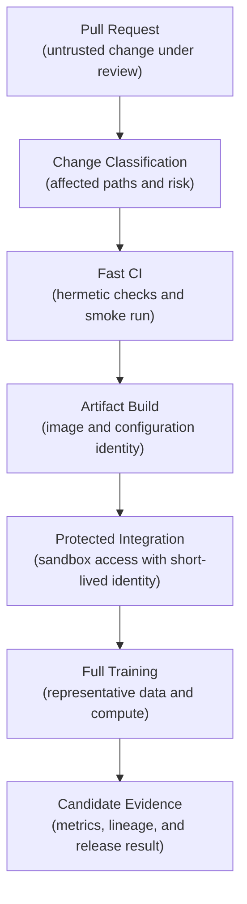
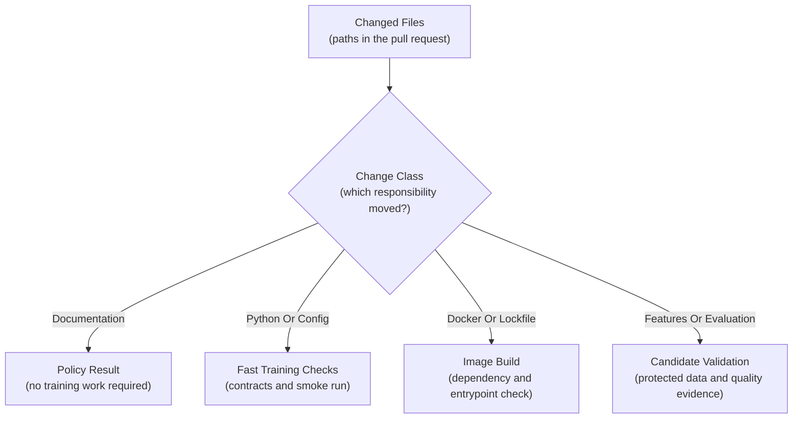
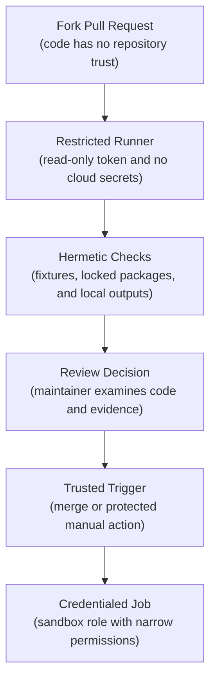
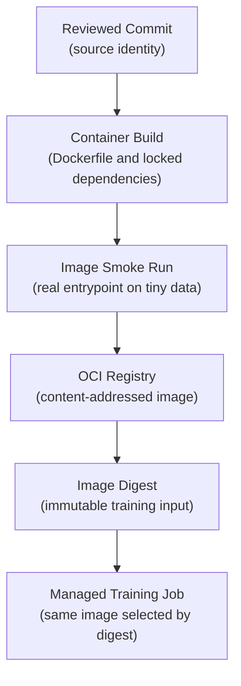
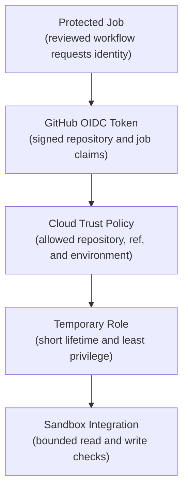
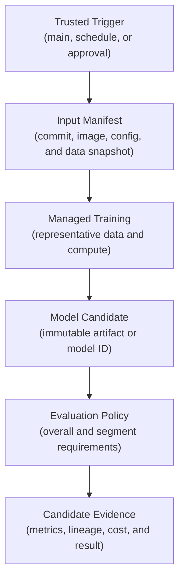
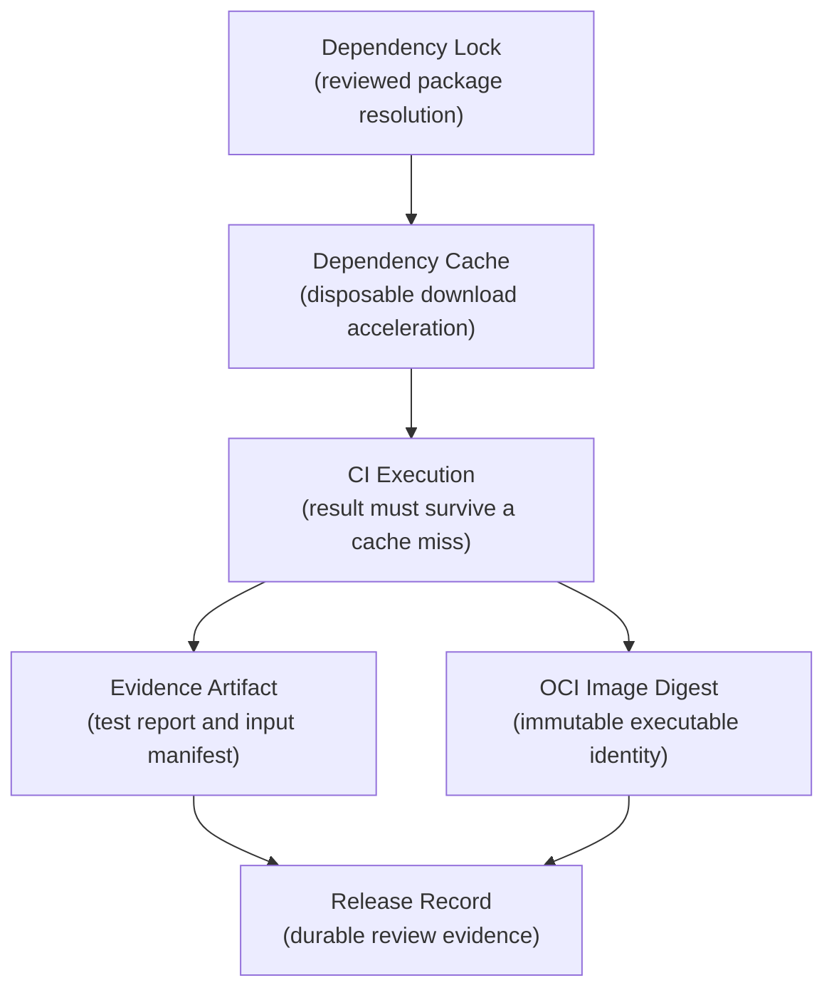
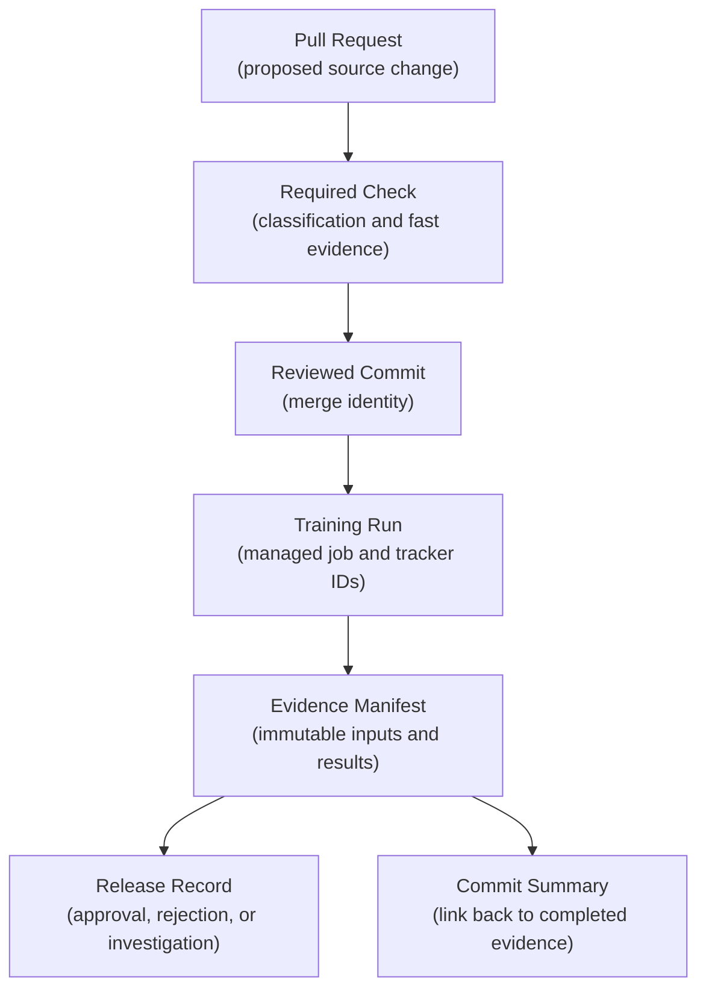
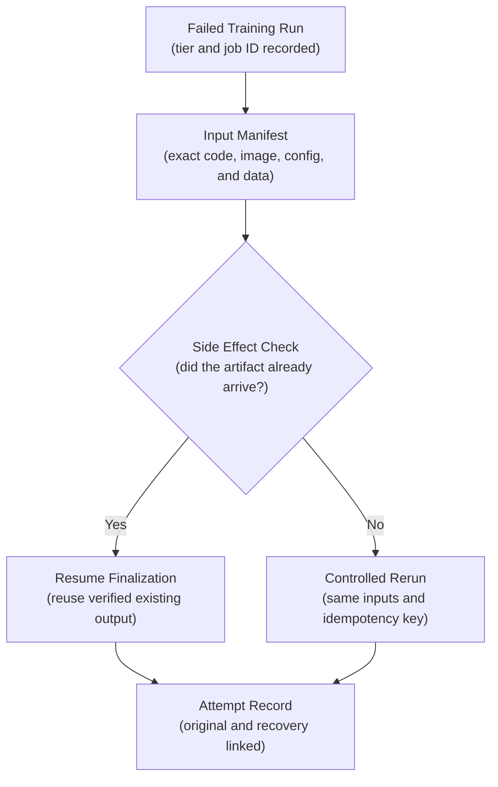

## Table of Contents

1. [What Training CI Can Prove](#what-training-ci-can-prove)
2. [Choose CI Checks Based On What Changed](#choose-ci-checks-based-on-what-changed)
3. [Tier 1: Run Fast Pull-Request Checks Without External Services](#tier-1-run-fast-pull-request-checks-without-external-services)
4. [Tier 2: Build The Training Container](#tier-2-build-the-training-container)
5. [Tier 3: Test Real Services In A Protected Environment](#tier-3-test-real-services-in-a-protected-environment)
6. [Tier 4: Run Full Training And Evaluation](#tier-4-run-full-training-and-evaluation)
7. [Choose What Starts CI And Which Jobs Need Approval](#choose-what-starts-ci-and-which-jobs-need-approval)
8. [Separate Caches From Evidence](#separate-caches-from-evidence)
9. [Link Training Evidence To The Pull Request And Release](#link-training-evidence-to-the-pull-request-and-release)
10. [Make Failed CI Jobs Safe To Rerun](#make-failed-ci-jobs-safe-to-rerun)
11. [The Main Idea](#the-main-idea)
12. [References](#references)

## What Training CI Can Prove
<!-- section-summary: Training CI proves that a change is mechanically sound and decides which costly or privileged checks should follow. -->

At a high level, **training continuous integration (CI)** is the automated review system for changes to an ML training pipeline. A pull request may alter Python code, a feature definition, a dependency lockfile, a container image, or a training configuration. CI checks the change before it reaches a shared training environment.

The unusual part is cost. A web application can often build and run its main test suite in minutes. A training pipeline may need several hours of accelerator time, a large governed dataset, and permission to write model artifacts. Running that entire process for every edit would make feedback slow, expensive, and risky.

Consider a pull request that changes the maximum tree depth in a fraud model. A short CI run can prove that the configuration parses, the training entrypoint starts, and a tiny fixture produces a model artifact. It cannot prove that the candidate improves fraud detection on representative data. That claim requires the full evaluation dataset, segment metrics, and the same release policy used for production candidates.

This gives training CI two responsibilities:

- give the author fast evidence about code, configuration, contracts, and packaging;
- route costly or privileged work through the correct trigger, identity, and approval boundary.

The test suite defines what each check proves. **Training CI governs execution policy**: which checks run, where they run, which identity they receive, and which evidence moves to the next stage.



The stages answer progressively larger questions. A failure near the top should be cheap and quick to repair. A job near the bottom receives more compute, data access, and responsibility.

## Choose CI Checks Based On What Changed
<!-- section-summary: A small classification job maps changed files to the CI stages that can answer the relevant risk. -->

A training repository contains files with very different consequences. Editing a README should not launch a GPU job. Changing a CUDA base image may deserve image validation and a scheduled accelerator test. Changing a feature transformation may require contract tests, a pipeline smoke run, and a fresh candidate evaluation.

**Change classification** is the small first job that turns those differences into an explicit plan. In essence, it answers: *what could this pull request break?* Later jobs read the result, which removes informal guesses from scattered workflow conditions.



GitHub Actions and GitLab CI both support path-based rules. Native path filters are useful for optional workflows, but they need care around branch protection. GitHub documents that a workflow skipped by a path filter can leave its required check in a pending state. A reliable design starts one small policy workflow on every pull request. That workflow reports a stable result such as `training-ci-policy`, then exposes outputs that enable or skip downstream jobs.

A small GitHub Actions classifier can expose path groups as outputs for later jobs. This workflow still starts for every pull request, including a documentation-only change:

```yaml
- uses: actions/checkout@v7
- id: paths
  uses: dorny/paths-filter@7b450fff21473bca461d4b92ce414b9d0420d706 # v4.0.2
  with:
    filters: |
      training: ['src/training/**', 'configs/**', 'tests/training/**']
      image: ['docker/train.Dockerfile', 'pyproject.toml', 'uv.lock']
```

The names describe responsibilities, so individual test commands can evolve inside each group. The action exposes values such as `steps.paths.outputs.image`; the classifier job can map them to job outputs for a condition such as `if: needs.classify.outputs.image == 'true'`. The classifier should also fail safely. An unfamiliar path should select a broader tier or request review. Quietly selecting no work would hide a new risk from CI.

## Tier 1: Run Fast Pull-Request Checks Without External Services
<!-- section-summary: The first tier runs untrusted code without cloud credentials, shared-state writes, or hidden dependencies. -->

The first tier serves the developer who is waiting for feedback. It usually covers formatting, static analysis, unit tests, configuration contracts, and a small end-to-end training smoke run. A practical target is a result within a few minutes. Multi-hour validation belongs in a later tier.

The important property is **hermeticity**. A hermetic check receives all of its required inputs from the repository, pinned dependencies, or controlled test fixtures. It does not depend on yesterday's files on a long-lived runner. It does not read the production warehouse. It does not write to a shared model registry. You can think of the job as a disposable room: the code enters, the declared inputs enter, the checks run, and the room is discarded.

For example, a feature-normalization change can run against a small Parquet fixture committed for testing. The smoke run uses the real command-line entrypoint, limits training to a few iterations, and writes outputs to a temporary directory. The metric value is irrelevant at this stage. CI is checking that the components connect correctly and that the expected files and metadata appear.

```yaml
name: training-ci

on: pull_request

permissions:
  contents: read

concurrency:
  group: training-pr-${{ github.event.pull_request.number }}
  cancel-in-progress: true

jobs:
  fast-training-checks:
    runs-on: ubuntu-latest
    steps:
      - uses: actions/checkout@v7
      - uses: astral-sh/setup-uv@c771a70e6277c0a99b617c7a806ffedaca235ff9 # v9.0.0
        with:
          version: "0.12.1"
          enable-cache: true
      - run: uv sync --locked --all-extras --dev
      - run: uv run pytest tests/unit tests/contracts tests/smoke -q
```

The committed `uv.lock` fixes the reviewed dependency resolution. `uv sync --locked` fails if project metadata requires a lockfile update, so CI does not silently select a different dependency set. The cache only speeds up installation; deleting it must leave the result unchanged.

### Protect Secrets From Untrusted Pull-Request Code

Code from a fork is **untrusted code**. The contributor may be helpful, but the repository owner has not yet approved the code that a runner will execute. A test command can run a modified build script, dependency hook, configuration loader, or Makefile. Any credential available to that job may therefore be read or misused by the pull-request code.

GitHub's `pull_request` event addresses this boundary for forks with a read-only token, withheld secrets, and fork approval policies. Keep the fast tier inside that restricted environment. Avoid using `pull_request_target` to check out a fork's head and execute it with base-repository privileges. That arrangement joins untrusted code to secrets and write permissions in the same process.



An artifact uploaded by an untrusted job remains untrusted data. A later privileged workflow may inspect a test report, but it should not execute a binary, script, or container supplied by the fork. Build the release candidate again from the reviewed commit in a trusted workflow, or promote an artifact produced through a supply-chain process that verifies its source and builder.

## Tier 2: Build The Training Container
<!-- section-summary: The second tier packages reviewed code and configuration into immutable identities that later jobs can reuse. -->

Most production training platforms run a container image. The image contains the training code, Python environment, native libraries, and entrypoint. CI should build it early enough to expose packaging failures before a remote training job starts.

A useful image check runs the entrypoint with `--help` and executes the tiny smoke fixture inside the container. This catches a common class of failures: the Python tests passed on the CI runner, but the Dockerfile omitted a package or copied files into the wrong directory.

The trusted build then pushes the image to an OCI registry and records its **digest**. A tag such as `candidate` is a movable label. A digest such as `sha256:…` identifies the exact image content. Later training and evaluation jobs should receive the digest.



Docker maintains official GitHub Actions around BuildKit. The workflow below shows the responsibility without expanding into a complete delivery pipeline:

```yaml
- uses: docker/setup-buildx-action@v4

- id: image
  uses: docker/build-push-action@v7
  with:
    context: .
    file: docker/train.Dockerfile
    push: true
    tags: registry.example.com/training:${{ github.sha }}
    provenance: true

- run: 'echo "Training image: ${{ steps.image.outputs.digest }}"'
```

The workflow should also identify the training configuration. Teams commonly hash the normalized config or package it with the release artifact. Together, commit SHA, image digest, dependency lock, and configuration digest describe the executable candidate. This set prevents a later rerun from accidentally using a newer image under the same tag.

## Tier 3: Test Real Services In A Protected Environment
<!-- section-summary: Protected integration jobs use short-lived identity to test governed systems in a sandbox. -->

The third tier checks systems outside the disposable CI runner. A local fixture can imitate a table shape, yet it cannot prove that the sandbox role may read the governed warehouse or submit a managed job. Integration CI exercises those real boundaries after code review and inside a controlled environment.

Common boundaries include warehouse schemas, object-storage prefixes, feature services, managed training APIs, and MLflow tracking servers. Each check should target one contract and leave a small, auditable footprint.

A useful integration test stays narrow. A warehouse check can read table metadata and a bounded sample. An object-storage check can read one manifest and write a disposable object under a run-specific prefix. A registry check can create a temporary record and remove it. These tests verify contracts and permission paths. Full training remains a separate tier with representative data and compute.

### Use Short-Lived Cloud Credentials In CI

Older CI systems often stored a cloud access key as a repository secret. That key was a standing credential: it remained valid between runs and required manual rotation. Modern cloud integrations commonly use **OpenID Connect (OIDC)** federation instead.

OIDC gives the cloud provider a signed statement about the workflow job. GitHub issues a JSON Web Token containing claims such as the repository, ref, workflow, environment, and audience. The cloud trust policy evaluates those claims. A matching job receives temporary credentials for a narrowly scoped role.



The GitHub permission below allows the job to request an OIDC token. It does not grant access to a cloud bucket or training service. The cloud role supplies those permissions after its trust policy accepts the token.

```yaml
jobs:
  training-integration:
    runs-on: ubuntu-latest
    environment: ml-integration
    permissions:
      contents: read
      id-token: write
    steps:
      - uses: actions/checkout@v7
      - name: Assume the AWS sandbox role through OIDC
        uses: aws-actions/configure-aws-credentials@e6de054238d6b7531b4efff3b6587d9aade6a06c # v6.2.3
        with:
          role-to-assume: arn:aws:iam::123456789012:role/ml-ci-integration
          aws-region: us-east-1
      - uses: astral-sh/setup-uv@c771a70e6277c0a99b617c7a806ffedaca235ff9 # v9.0.0
      - run: uv sync --locked --all-extras --dev
      - run: uv run pytest tests/integration/training -q
```

This concrete example uses AWS, while Google Cloud Workload Identity Federation and Microsoft Entra workload identity federation follow the same exchange model. The cloud trust policy should restrict the repository and the protected environment or ref. The temporary role should reach development resources only. Production data writes and model promotion require separate identities.

GitHub environments can add required reviewers and branch restrictions. Environment secrets remain unavailable until the protection rules pass. The runner still needs isolation: an environment approval does not turn a reused self-hosted runner into a secure machine.

## Tier 4: Run Full Training And Evaluation
<!-- section-summary: Full training turns a trusted source snapshot into candidate evidence on representative data and compute. -->

Full training answers the expensive question: *does this exact candidate meet the quality and operational policy for its intended use?* It uses representative data, the required compute class, and the complete evaluation suite. Managed services such as SageMaker AI, Gemini Enterprise Agent Platform (formerly Vertex AI), Azure Machine Learning, and Databricks are common execution targets. Some platform teams run the same responsibility on Kubernetes or Ray.

This tier usually begins from a trusted `main` commit, a manual release request, or a schedule. Those triggers provide a stable source snapshot and keep unreviewed fork code away from training data and cloud permissions. They also avoid spending accelerator hours on every small correction to an open pull request.

For example, a pull request may change tokenization for a text classifier. The PR smoke test trains on fifty rows and proves that token IDs reach the model with the expected shape. After merge, a managed GPU job trains the candidate from the recorded image digest and data snapshot. Evaluation then measures overall quality, rare-language segments, calibration, latency, and the release thresholds. Those two runs answer different questions and use different resources.



MLflow Tracking or a managed experiment tracker can record parameters, metrics, dataset inputs, artifacts, and code versions. MLflow 3 can also give the logged model its own model ID. The CI evidence record should keep that external run or model ID. Detailed metrics stay in the tracking system built to query and compare them.

A managed training service introduces a second identity. The CI job needs permission to submit and inspect the job. The training job itself needs a runtime role for governed data and artifact storage. Separating those roles limits the damage from an overly broad CI credential and makes cloud audit records more useful.

## Choose What Starts CI And Which Jobs Need Approval
<!-- section-summary: Triggers express why a job may start, while approvals and concurrency control authority and cost. -->

A training workflow needs a clear answer to two questions: what event requested this work, and what authority does that event carry? The trigger records the reason for starting a job. Approvals decide whether that reason is sufficient for privileged access or significant compute spend. Concurrency decides how several valid requests share limited capacity.

- `pull_request` gives authors quick, restricted feedback on proposed code.
- `push` to `main` builds from reviewed source and can publish candidate artifacts.
- `workflow_dispatch` supports a deliberate manual run with reviewed inputs.
- `schedule` provides recurring full validation for dependency, data, or environment changes that occur without a code edit.

Approvals belong at the transition to privileged or expensive work. A protected environment can require a release owner before a large training job receives credentials. A low-cost sandbox integration job may run automatically after merge. The control should match the potential spend, data sensitivity, and side effects.

**Concurrency** groups runs that should not overlap. Fast pull-request CI generally cancels an older run after a new commit arrives; its evidence has already become stale. Full training needs a deliberate policy. A newer commit may supersede an unstarted job, while an almost-complete training run may still provide useful evidence. Some teams queue one candidate per model; others deduplicate runs by a manifest key made from code, image, configuration, and data snapshot.

```yaml
on:
  push:
    branches: [main]
  workflow_dispatch:
    inputs:
      model_name:
        description: "Model workflow to train"
        required: true
        type: string
  schedule:
    - cron: "17 3 * * 1-5"

concurrency:
  group: full-training-${{ inputs.model_name || 'scheduled' }}
  cancel-in-progress: false
```

Scheduled workflows can be delayed under load, so they should not serve as an exact clock for time-critical production work. A production retraining service may use a dedicated orchestrator or event trigger and use CI only to build and approve the executable artifact.

## Separate Caches From Evidence
<!-- section-summary: A cache saves time, while an immutable artifact proves exactly what moved between stages. -->

CI systems use the words *cache* and *artifact* for stored files, but the two stores make different promises. A cache promises faster future work and may disappear at any time. An evidence artifact preserves a result or identity that another stage needs to verify. Mixing the promises can make a release depend on an optimization that the CI platform is free to evict.

A **cache** is a disposable optimization. It may contain downloaded Python wheels, compiler output, or Docker build layers. Its key usually includes the operating system and a lockfile hash. A cache miss should make the job slower, never change the intended result. GitHub also warns against storing credentials in caches because fork pull requests can read caches from the base branch.

An **artifact** is an output that later work needs to identify or consume. A test report can explain why a check passed. An evaluation manifest can connect metrics to their inputs. An OCI image digest identifies the executable candidate, while a signed provenance statement records its source and builder. These outputs need retention, access policy, and integrity checks. GitHub's artifact actions produce a SHA-256 digest and validate it during download; OCI registries identify images by content digest.



Suppose a rerun restores an old wheel cache. The locked installation still verifies the declared versions, so the cache cannot silently select another package. Suppose an image tag later points at a newer build. The training manifest still references the original digest, so the rerun selects the original executable. These controls solve separate problems.

## Link Training Evidence To The Pull Request And Release
<!-- section-summary: CI results need a stable route back to the change and to the candidate release decision. -->

Training evidence often finishes after the pull request has merged. The result still needs a clear home. Otherwise the training platform shows a successful job, the experiment tracker shows metrics, and the repository never records which change produced them.

Start with a stable required check for the pull request. The check reports the change class, selected tiers, fast-test result, and links to focused reports. Branch protection can require that check before merge. Keep its job name unique and make it complete successfully for a legitimate docs-only change; a required workflow that never starts can block the pull request in a pending state.

The trusted build adds an evidence manifest. A compact record might look like this:

```json
{
  "source_commit": "4f3a91c...",
  "change_class": ["runtime_image", "model_evidence"],
  "lock_digest": "sha256:...",
  "image_digest": "sha256:...",
  "config_digest": "sha256:...",
  "data_snapshot": "training_events@version-1842",
  "training_job_id": "job-7f1...",
  "mlflow_model_id": "m-2b8...",
  "evaluation_policy": "fraud-release-v4",
  "decision": "passed"
}
```

The exact fields vary by platform, but the chain should answer four human questions: Which code ran? Which inputs did it use? Where is the candidate and its evaluation? Which policy produced the decision?



The workflow can attach the manifest to a commit check, deployment record, model version, or release system. It should link to detailed metrics in MLflow or the managed platform. That keeps the repository summary readable while preserving the complete evidence for reviewers.

## Make Failed CI Jobs Safe To Rerun
<!-- section-summary: A useful failure identifies the failed tier, immutable inputs, observed evidence, and safe rerun route. -->

A red CI badge only says that something stopped. Training CI should explain the failure in terms a developer or operator can act on.

A useful report includes the failed tier, the command or managed job, the immutable input manifest, the expected condition, the observed result, and the owning team or runbook. For a schema failure, show the missing column and table snapshot. For an image failure, show the image digest and failing entrypoint. For a candidate-quality failure, link the affected metric segments and evaluation policy.

Consider a full training job that loses its connection while uploading the model. A blind rerun using `latest` may select a new image or newer data and produce a different candidate. A safe rerun reads the original manifest, checks whether the model artifact already exists, and resumes or retries the upload under an idempotency key. If training itself must repeat, it uses the same image digest, config digest, and data snapshot, then records the new attempt beside the original job.



Automatic retries are suitable for bounded transient failures such as a temporary registry timeout. Deterministic failures such as an invalid configuration should stop immediately. Repeated resource exhaustion calls for a reviewed compute change; an unlimited retry loop would only repeat the same expensive failure.

## The Main Idea
<!-- section-summary: Training CI is a staged trust and cost policy that connects a source change to reproducible candidate evidence. -->

Training CI organizes work along two rising curves: cost and authority. A pull request receives restricted, hermetic checks first. Reviewed source produces an immutable image and configuration identity. Protected jobs use short-lived credentials for narrow integration checks. Full training runs from a trusted trigger and returns model evidence to the commit and release record.

This structure gives beginners a practical way to reason about any CI step. Ask what question the step answers, which code it executes, which identity it receives, how much it can cost, and what evidence it leaves behind. A step that has no clear answer to those questions probably belongs in a different tier or needs a stronger contract.

## References

- [GitHub Actions workflow syntax](https://docs.github.com/en/actions/reference/workflows-and-actions/workflow-syntax)
- [Securely using `pull_request_target`](https://docs.github.com/en/actions/reference/security/securely-using-pull_request_target)
- [GitHub Actions secure use reference](https://docs.github.com/en/actions/reference/security/secure-use)
- [OpenID Connect reference](https://docs.github.com/en/actions/reference/security/oidc)
- [Deployments and environments](https://docs.github.com/en/actions/reference/workflows-and-actions/deployments-and-environments)
- [Concurrency in GitHub Actions](https://docs.github.com/en/actions/concepts/workflows-and-actions/concurrency)
- [Dependency caching reference](https://docs.github.com/en/actions/reference/workflows-and-actions/dependency-caching)
- [Store and share data with workflow artifacts](https://docs.github.com/en/actions/tutorials/store-and-share-data)
- [About protected branches](https://docs.github.com/en/repositories/configuring-branches-and-merges-in-your-repository/managing-protected-branches/about-protected-branches)
- [Using uv in GitHub Actions](https://docs.astral.sh/uv/guides/integration/github/)
- [Paths Filter for GitHub Actions](https://github.com/dorny/paths-filter)
- [Docker Build GitHub Actions](https://docs.docker.com/build/ci/github-actions/)
- [Configure AWS Credentials for GitHub Actions](https://github.com/aws-actions/configure-aws-credentials)
- [MLflow Tracking](https://mlflow.org/docs/latest/ml/tracking/)
- [MLflow model evaluation](https://mlflow.org/docs/latest/ml/evaluation/)
