## Start With One Production Path
<!-- section-summary: A simple MLOps architecture should show how data creates a model, how the model reaches production, and how production evidence returns to the next training cycle. -->

MLOps architecture can look complicated because every vendor diagram includes many boxes. A beginner can get lost in feature stores, registries, workflow engines, online serving platforms, drift monitors, experiment trackers, and governance tools before they know what problem the boxes solve.

The simplest useful architecture follows one model through one path. Data comes from the product. A training job creates a candidate model. Evaluation decides whether the candidate deserves release. A registry records the approved model version. Deployment sends the model to a serving path. Monitoring watches production behavior. Feedback creates labels and examples for the next training cycle.

Let's use **ParcelPulse**, a delivery company that predicts whether a package will miss its promised delivery window. The product needs a risk score before dispatchers make route changes in the morning. The model trains from past shipments, warehouse scans, driver shifts, weather, road closures, and final delivery outcomes. The serving API returns a score fast enough for the dispatcher dashboard, while monitoring watches latency, score distribution, missing route features, and delayed delivery labels.

```mermaid
flowchart LR
    Product[Product events<br/>shipments, scans, routes] --> Data[Data pipeline<br/>clean, join, validate]
    Data --> Train[Training job<br/>code, config, environment]
    Train --> Eval[Evaluation<br/>metrics, segments, guardrails]
    Eval --> Registry[Model registry<br/>version, lineage, approval]
    Registry --> Deploy[Deployment pipeline<br/>shadow, canary, production]
    Deploy --> Serving[Serving path<br/>API or batch job]
    Serving --> Monitor[Monitoring<br/>service and model signals]
    Monitor --> Feedback[Feedback<br/>labels, incidents, reviews]
    Feedback --> Data
```



This is the architecture spine. Each box can be simple at first. A small team can run training in a scheduled job, store artifacts in object storage, track metadata in MLflow, and deploy a FastAPI service. A larger team may use managed ML platforms, Kubernetes, feature stores, policy gates, and dedicated observability tooling. The core flow stays the same.


*This visual gives beginners one complete path to follow before the architecture adds more tools or platform choices.*

## Read The Architecture In Five Planes
<!-- section-summary: Five planes separate product traffic, data preparation, learning workloads, control and evidence, and production feedback so each boundary has a clear contract. -->

The lifecycle explains which state follows another. Architecture explains where responsibilities live and how information crosses boundaries. A useful MLOps architecture has five logical planes. A small team can run several planes on one platform, while the contracts between them should remain visible.

| Plane | Responsibility | ParcelPulse example | Boundary contract |
|---|---|---|---|
| **Product and serving plane** | Accept production inputs and return or publish decisions | Dispatcher API and nightly parcel-risk table | Request schema, latency or freshness target, model version, fallback |
| **Data plane** | Collect events, build labels and features, validate and version datasets | Shipment, scan, route, weather, and delivery outcome pipelines | Entity keys, event time, prediction time, label maturity, dataset version |
| **Learning plane** | Run experiments, training, and evaluation on isolated compute | Scheduled training and candidate evaluation jobs | Run config, input artifacts, resource request, output artifacts, exit state |
| **Control and evidence plane** | Coordinate workflows, identities, approvals, registry records, policies, and deployment | Orchestrator, tracking server, registry, CI/CD, identity and access management (IAM), secrets | Immutable IDs, lineage, permissions, gate result, release and rollback record |
| **Observability and feedback plane** | Collect service, data, prediction, label, business, and incident evidence | Latency, feature freshness, score distribution, late-delivery labels | Signal owner, threshold, delay, retention, runbook, link to next change |

This separation clarifies several tool choices. Object storage can hold dataset and model files in the data or learning paths, while a registry record belongs to the control plane because it describes identity, lineage, and approval. Prometheus can collect service metrics, while delayed delivery labels need a data workflow before they support quality monitoring. An orchestrator coordinates work and should avoid hiding the feature or training logic inside one large task.

Security crosses every plane. Product traffic needs authentication and input limits. Data needs access control, privacy, retention, and encryption. Training needs isolated identities and controlled egress. The control plane needs least-privilege release permissions and audit records. Observability needs redaction because logs and prediction records can contain sensitive values.

The next sections walk through these planes using the same ParcelPulse path. Their purpose is to define boundaries and contracts, while the previous lifecycle article owns the detailed state transitions and gates.

## Data Sources And Feature Preparation
<!-- section-summary: The data side of the architecture turns production events into validated training examples and serving inputs with clear ownership. -->

The architecture starts with product data. For ParcelPulse, useful events include shipment creation, warehouse scan timestamps, promised delivery windows, driver assignment, route distance, weather conditions, traffic incidents, customer address zones, and final delivery timestamps. These events were created for logistics, support, routing, and billing systems. MLOps reuses them to train and monitor a model.

A **data pipeline** prepares these events for machine learning. It joins records, applies timestamp rules, creates features, attaches labels, checks quality, and writes versioned datasets. The pipeline should know which fields existed before the morning dispatch decision, because the model cannot depend on a delivery timestamp that arrives at the end of the day.

```yaml
dataset: delivery_delay_training_examples
sources:
  - shipment_events
  - warehouse_scans
  - route_plans
  - weather_observations
  - final_delivery_outcomes
checks:
  - required_columns
  - timestamp_boundaries
  - null_limits
  - delivery_label_delay_report
```

This data layer often includes a warehouse or lakehouse, object storage for dataset snapshots, data quality checks, and sometimes a feature store. A feature store is a shared system for defining, storing, and serving ML features. A small team can start without one, but the architecture still needs a clear answer for where features are defined and how training features match serving features.

## Training And Evaluation Jobs
<!-- section-summary: Training and evaluation jobs turn a validated dataset into a candidate model plus evidence about whether it deserves release. -->

After data preparation, the architecture needs a training job. A **training job** runs model code with a data snapshot, configuration, environment, and output location. It should write a model artifact and a run record, not only print metrics to a console.

For the delivery-delay model, the training job may run every Monday after the previous week's delivery labels land. It reads a versioned dataset, trains a candidate, saves the model file, and records the run metadata. The important detail is that the job leaves behind evidence. A dispatcher should never have to ask which weather table, code commit, or feature list created the model that changed route priorities.

```yaml
training_job: delivery-delay-risk
inputs:
  data_snapshot: s3://parcelpulse-ml-data/delivery-delay/2026-06-30/
  config: configs/delivery-delay-risk.yml
environment:
  image: ghcr.io/parcelpulse/delivery-delay-training@sha256:32421559c392d95d51a9468a23a063f881b9e610b81fa77f52f5f930022abc42
outputs:
  artifact_uri: s3://parcelpulse-ml-models/delivery-delay-risk/candidates/
  metrics_uri: s3://parcelpulse-ml-runs/delivery-delay-risk/
```

The evaluation job should run after training. Evaluation compares the candidate with the current production model, checks important segments, validates latency, and produces a report. This report gives reviewers a standard packet instead of a screenshot from a notebook.

Evaluation is part of architecture because the release path should require evidence. A deployment pipeline should know whether a model has an approved evaluation report, not only whether a file exists.

## Artifact Storage And Model Registry
<!-- section-summary: Artifact storage keeps the files, while the model registry keeps model versions, metadata, approval state, and production lineage. -->

The training job creates files. The architecture needs a safe place for those files and a catalog that explains them. These two ideas are related but separate.

**Artifact storage** stores physical outputs: model files, preprocessing objects, evaluation reports, plots, metrics files, and sometimes dataset snapshots. Object storage is common because artifacts can be large and need durable versioned paths.

**A model registry** stores model versions and metadata. The registry tells the team which artifact belongs to version `v18`, which run produced it, which evaluation approved it, which stage it is in, and where it is deployed. In current MLflow registry concepts, a registered model groups versions and aliases; in SageMaker Model Registry, model package groups and versions carry metadata, lineage, approval status, and deployment links. The names differ, but the architecture responsibility is the same.

```yaml
model_registry_entry:
  name: delivery-delay-risk
  version: v18
  artifact_uri: s3://parcelpulse-ml-models/delivery-delay-risk/v18/model.txt
  run_id: delay-2026-07-04-0915
  approval_status: approved_for_canary
  baseline_version: v17
  owner: logistics-ml-team
```

The registry helps the release pipeline avoid guessing. If production serves `delivery-delay-risk@production`, the registry or deployment config can resolve that label to a specific version. During rollback, the team can return traffic to the previous version with known metadata.


*This visual separates the physical files from the review evidence that makes a model version safe to promote.*

## Deployment And Serving
<!-- section-summary: Deployment moves an approved model version into a serving mode such as batch prediction, online API inference, or streaming/event inference. -->

Deployment connects an approved model version to a production runtime. For ParcelPulse, the dispatch dashboard needs online inference because planners explore route changes while trucks are loading. A nightly batch job can also precompute risk for every parcel, but the live dashboard still needs an endpoint when a dispatcher changes the route, driver, or promised window.

The deployment pipeline should package the model with serving code and runtime dependencies. It should run load checks, schema checks, and basic prediction tests. Then it can release through shadow, canary, and broader rollout stages.

```yaml
deployment:
  model_version: delivery-delay-risk:v18
  serving_image: ghcr.io/parcelpulse/delay-serving:2026-07-04
  input_schema: delivery_route_request_v3
  stages:
    - shadow
    - canary_1_percent
    - production
```

The **serving path** is the runtime path that accepts input and returns predictions. It may be a REST API, a gRPC service, a scheduled batch job, a stream processor, or a managed endpoint. The serving path should expose logs, metrics, health checks, and version information. If the endpoint returns a delivery-delay score, the team should be able to tell which model version produced that score.

## Monitoring And Feedback
<!-- section-summary: Monitoring closes the architecture loop by connecting service health, model behavior, delayed labels, incidents, and retraining evidence. -->

Monitoring is part of the architecture, not a dashboard added later. Production ML needs normal service monitoring and model-specific monitoring. The service can be healthy while model quality changes, so the architecture needs both.

For the delivery-delay model, service monitoring includes request volume, latency, errors, CPU, memory, and dependency health. Model monitoring includes missing route features, input distributions, score distributions, threshold counts, delayed delivery labels, and business guardrails like the number of manual route changes triggered by model risk.

```yaml
monitoring:
  service:
    - request_rate
    - p95_latency_ms
    - error_rate
  model:
    - missing_feature_rate
    - score_distribution
    - late_delivery_risk_share
    - label_delay
    - manual_route_change_rate
```

Feedback closes the loop. When delivery outcomes arrive, the team can compare predictions with outcomes. When an incident happens, the timeline can guide the next model version. When operations finds that the model missed a new warehouse bottleneck, that pattern can shape data collection, feature work, and evaluation.

## Define The Minimum Operating Architecture
<!-- section-summary: A minimum MLOps architecture should cover data, training, tracking, registry, deployment, serving, monitoring, rollback, and ownership. -->

A team can start without every advanced ML platform feature on day one. The first architecture should answer basic production questions. The answers can use managed services, open-source tools, or simple internal scripts, and the architecture needs a place for each responsibility.

| Architecture need | Question it answers |
|---|---|
| Data source and dataset path | Which examples trained the model? |
| Data validation | Did the input data match expectations? |
| Training job | How does the team create a candidate again? |
| Run tracking | Which code, config, data, and environment produced the model? |
| Artifact storage | Where are model files and reports stored? |
| Model registry | Which versions exist and which are approved? |
| Deployment pipeline | How does an approved version reach production? |
| Serving path | How does the product receive predictions? |
| Monitoring | How does the team watch service and model behavior? |
| Rollback path | How does the team return to the previous version? |
| Ownership | Who can approve, deploy, pause, and fix the model? |

This checklist keeps the architecture grounded. A vendor tool can cover several rows, but the team still needs to know which row the tool handles and where the evidence lives.

## Putting It All Together
<!-- section-summary: The simple architecture connects model creation, model release, production serving, and feedback into one loop that the team can operate. -->

The minimum MLOps architecture is a loop. Product events turn into training examples. Training creates a candidate. Evaluation creates evidence. The registry records an approved version. Deployment moves the version into a serving path. Monitoring watches real behavior. Feedback returns labels and incidents to the next data and training cycle.

For ParcelPulse, this architecture gives the delivery-delay model a reliable path. The team can trace a score back to a model version, a model version back to a run, a run back to data and code, and a production issue back to monitoring and rollback evidence. That traceability is the foundation for the rest of the roadmap.


*This summary visual keeps the minimum production responsibilities visible: ownership, rollback, alerts, and the operating loop around the model.*

## What's Next
<!-- section-summary: The next article zooms in on the assets that move through this architecture and need versioning, ownership, and storage. -->

The next article focuses on ML system assets. We will name the files, records, datasets, configs, environments, reports, and runtime pieces that need storage, versioning, and ownership.

## References

- [Google Cloud: MLOps continuous delivery and automation pipelines in machine learning](https://docs.cloud.google.com/architecture/mlops-continuous-delivery-and-automation-pipelines-in-machine-learning) - Describes an end-to-end architecture for ML pipelines with CI, CD, continuous training, validation, metadata, and monitoring.
- [Microsoft Azure Architecture Center: Machine learning operations](https://learn.microsoft.com/en-us/azure/architecture/ai-ml/guide/machine-learning-operations-v2) - Shows common MLOps architecture components across data, training, deployment, and monitoring.
- [AWS SageMaker AI: Implement MLOps](https://docs.aws.amazon.com/sagemaker/latest/dg/mlops.html) - Describes SageMaker MLOps building blocks for workflow automation, model registry, deployment, and monitoring.
- [MLflow Docs: Model Registry](https://mlflow.org/docs/latest/ml/model-registry/) - Documents registry concepts such as model versions, aliases, and lifecycle workflows.
