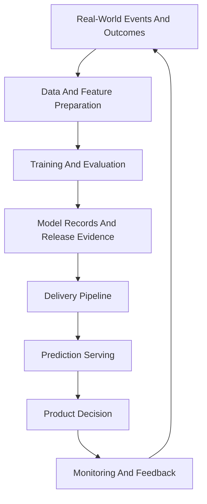
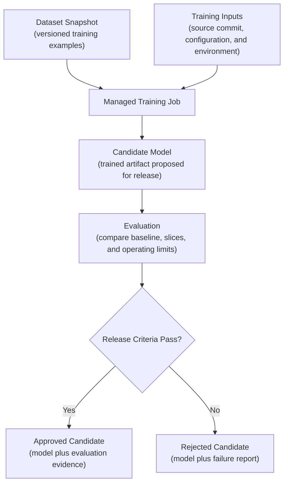
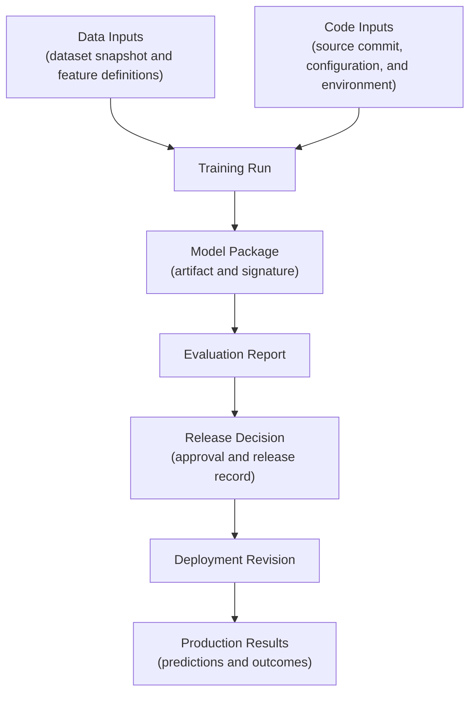
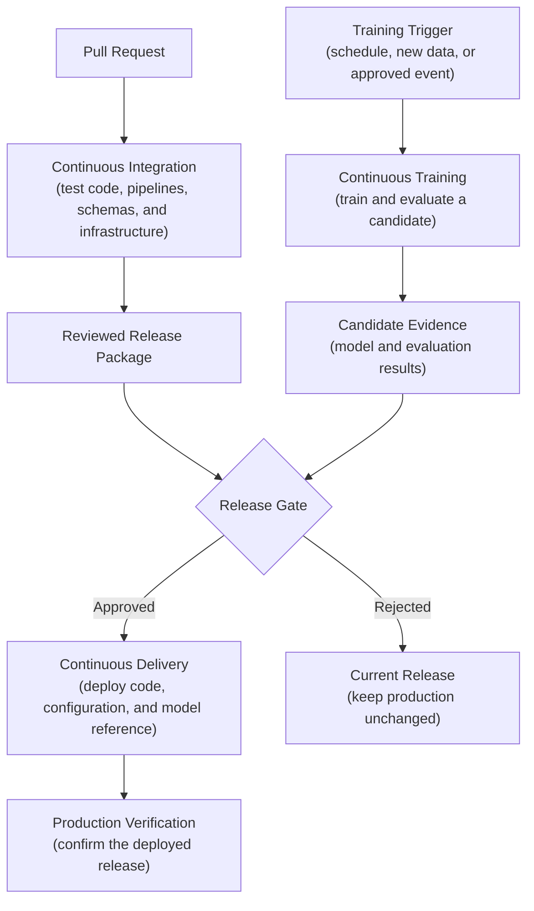
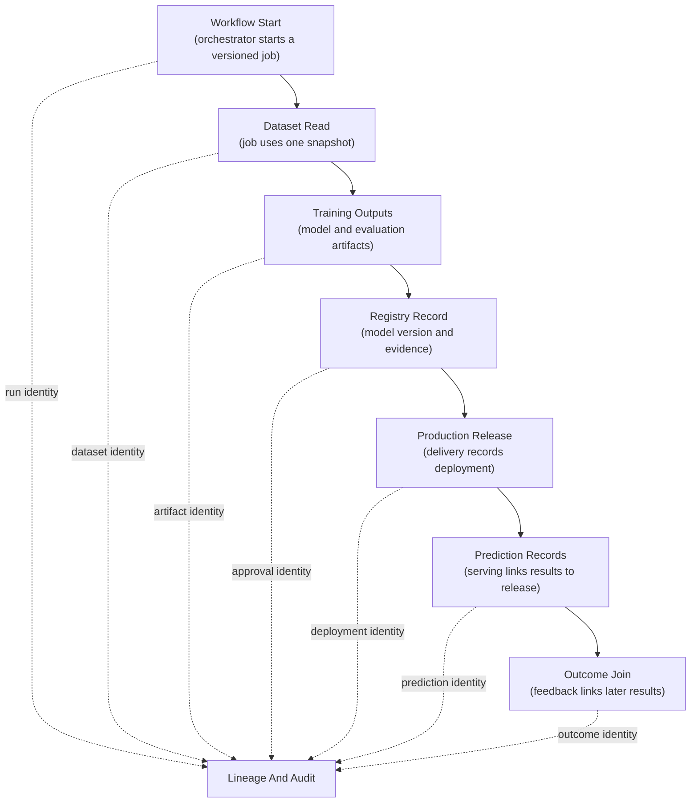
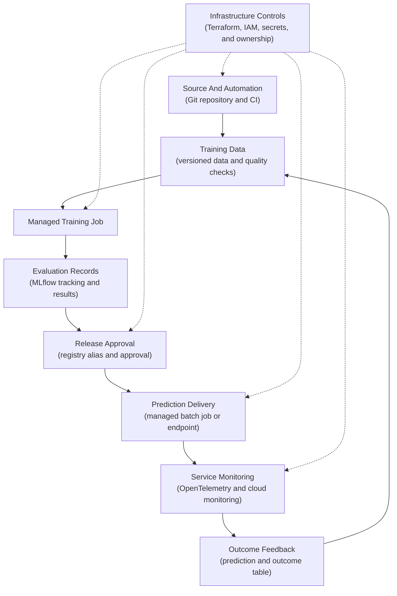

## Table of Contents

1. [Why An ML Product Needs More Than A Model](#why-an-ml-product-needs-more-than-a-model)
2. [What Every Production ML System Must Do](#what-every-production-ml-system-must-do)
3. [1. What Data And Features Mean To A Model](#1-what-data-and-features-mean-to-a-model)
4. [2. How Training Produces A Model](#2-how-training-produces-a-model)
5. [3. How A Trained Model And Its Results Are Recorded](#3-how-a-trained-model-and-its-results-are-recorded)
6. [4. When A Model Is Ready For Production](#4-when-a-model-is-ready-for-production)
7. [5. How Serving Delivers Predictions](#5-how-serving-delivers-predictions)
8. [6. How Monitoring Detects Production Problems](#6-how-monitoring-detects-production-problems)
9. [7. How Outcomes Improve The Next Model](#7-how-outcomes-improve-the-next-model)
10. [How Work, Access, And History Are Coordinated Across The System](#how-work-access-and-history-are-coordinated-across-the-system)
11. [How Real Teams Put The Architecture Together](#how-real-teams-put-the-architecture-together)
12. [What A Small Production Architecture Needs](#what-a-small-production-architecture-needs)
13. [The Main Idea](#the-main-idea)
14. [References](#references)

## Why An ML Product Needs More Than A Model

<!-- section-summary: A production ML product depends on a connected path from real-world events to training, release, prediction, monitoring, and later outcomes. -->

Imagine a payment service that asks a fraud model for a risk score. The user sees one quick decision: approve the payment, request another check, or decline it. That decision depends on work spread across several parts of the organization.

**An MLOps architecture is the set of systems and boundaries that connects this work: it turns real-world data into a model, puts that model into a product, and learns from what happens next.**

Long before the request arrives, data pipelines collect past payments and confirmed fraud outcomes. Feature code turns those events into training examples. A training job produces a proposed model. Evaluation checks overall quality and important segments. A registry records the trained model and its results. A delivery pipeline approves and releases one version.

During the request, the payment service supplies current features to a model endpoint. The endpoint returns a score under a latency target. Policy code turns the score into an action.

Afterward, service metrics show whether the endpoint stayed fast and available. Chargebacks and investigation results arrive later. Those outcomes reveal whether the predictions were useful and supply labels for future evaluation or training.


```mermaid
flowchart TD
    A["Real-World Events And Outcomes"] --> B["Data And Feature Preparation"]
    B --> C["Training And Evaluation"]
    C --> D["Model Records And Release Evidence"]
    D --> E["Delivery Pipeline"]
    E --> F["Prediction Serving"]
    F --> G["Product Decision"]
    G --> H["Monitoring And Feedback"]
    H --> A

    class A,G world
    class B,C build
    class D,E control
    class F,H operate
```

The model is one component inside this path. A model can score a test dataset accurately while the production system fails because live features are stale, the wrong artifact was loaded, an endpoint is overloaded, or outcome labels never return.

Architecture makes the responsibilities and handoffs visible. Each handoff needs a **contract**: a clear agreement about what crosses the boundary, who owns it, how it is identified, and what happens after failure.

For example, the data-to-training contract identifies a dataset snapshot and its schema. The registry-to-delivery contract identifies an approved model version and evaluation report. The serving-to-monitoring contract carries the model version, latency, prediction record, and release metadata.

The central architectural principle is to make the production path understandable, reproducible, and recoverable across every service boundary.

## What Every Production ML System Must Do

<!-- section-summary: Seven architectural responsibilities separate the creation, release, operation, and improvement of a production model. -->

A durable architecture can be understood through seven responsibilities. A small team may run several of them on one platform. A large organization may assign each one to a different service or team. The boundaries remain useful in both cases.

**Data and features** create trustworthy examples for training and trustworthy inputs for prediction. This responsibility owns meaning, time, quality, privacy, and reproducible snapshots.

**Training and evaluation** run versioned code against versioned data. Their output is a proposed model plus results about its quality, limitations, performance, and resource use.

**Registry and evidence** give the trained model a stable identity. They connect the model artifact to the run, dataset, code, evaluation, approvals, and deployment history.

**Delivery** moves reviewed code, configuration, infrastructure, and model references through controlled environments. It checks the proposed model and controls production exposure.

**Serving** runs the approved release in batch, online, streaming, or edge workflows. It owns the production input and output contract, capacity, fallback, and product handoff.

**Monitoring** observes service health, data health, model behaviour, and business impact. It helps the team distinguish an infrastructure incident from a data or model problem.

**Feedback** joins predictions with later outcomes, human review, incidents, and product signals. It creates evidence for evaluation, data improvement, and retraining decisions.


*The seven responsibilities form one operating loop. Stable identities connect the model created during training to the predictions and outcomes seen in production.*

### How The System Handles Data, Instructions, And Records

The seven responsibilities exchange three kinds of information. One carries the material being processed. Another tells work to begin or change. The third records what happened so the result can be checked later. MLOps calls these the data, control, and evidence flows.

The **data flow** carries datasets, features, model artifacts, prediction inputs, predictions, and outcomes. These objects can be large and often live in object storage, a warehouse, a lakehouse, a feature store, or a serving database.

The **control flow** tells work to start, stop, retry, approve, deploy, or roll back. Workflow orchestrators, CI/CD systems, schedulers, and deployment controllers carry this flow.

The **evidence flow** carries identities and explanations: dataset versions, run IDs, metrics, lineage, approval records, deployment revisions, and incident links. Experiment trackers, registries, catalogues, and observability systems preserve this evidence.

Confusing the flows creates fragile designs. An orchestrator should coordinate a training task, while the training code remains a testable component. A registry should record the artifact and approval, while object storage holds the large model files. A monitoring system should report an issue, while a reviewed workflow decides whether retraining is appropriate.

## 1. What Data And Features Mean To A Model

<!-- section-summary: The data boundary turns production events into versioned training examples and prediction inputs with explicit meaning, time, quality, and ownership. -->

Before a model can learn, product events have to be turned into examples that describe the past. Before the trained model can make a prediction, the production system has to calculate the same kinds of input values from current events. This part of the architecture answers two basic questions: **what did the model learn from, and what information will it receive in production?**

Raw product data usually exists for operational reasons. Orders support fulfilment. Sensor readings support equipment control. Claims support insurance processing. Machine learning reuses those events to create features and labels.

A **feature** is an input value used by the model. A **label** is the outcome the model learns to predict, such as a confirmed fraudulent payment or a machine failure. A **training example** combines features with the correct label.

The difficult part is time. Training happens after the outcome is known, so the data pipeline can accidentally include information that production would not have had at prediction time. This is called **data leakage**.

Suppose a fraud dataset includes the result of a manual investigation completed two days after payment. That field predicts fraud very well in training. The live scoring service cannot use it at checkout. The offline score looks impressive because the model has seen part of the answer.

The dataset contract records the event-time boundary:

```yaml
dataset: card_payment_training_examples
entity_key: payment_id
prediction_time: payment_authorized_at
label:
  name: confirmed_fraud
  maturity_delay: governed_outcome_window
features:
  - amount
  - merchant_risk_lookback
  - account_velocity_lookback
checks:
  - schema
  - event_time_before_prediction_time
  - label_join_coverage
  - missing_value_limits
```

`prediction_time` marks the moment the production decision would have occurred. Feature joins must select values available by that time. `maturity_delay` explains how long the team waits before treating the fraud outcome as dependable. `label_join_coverage` shows how many prediction records received a usable outcome.

### How Teams Store And Prepare ML Data

Teams need a durable place for raw events, prepared features, labels, and reproducible training snapshots. Object storage such as Amazon S3, Google Cloud Storage, or Azure Data Lake Storage is a common foundation. Apache Iceberg or Delta Lake can add table transactions, schema handling, and snapshot history above those files. Warehouses such as Snowflake and BigQuery, along with lakehouse platforms such as Databricks, can also provide the main analytical data layer.

Transformations commonly use SQL and dbt, Spark for distributed processing, or Polars for efficient single-node workloads. Data tests may begin with dbt tests and expand to Great Expectations, Soda, or Deequ for richer validation.

A feature store such as Feast or a managed platform feature store helps when many models reuse features, online predictions need low-latency lookups, or training-serving consistency has become difficult. A feature store adds operational work, so small batch systems can begin with governed tables and shared feature code.

The architecture boundary matters more than the product name. Training needs a versioned historical view. Serving needs a compatible current view. Both paths need the same feature meaning and a way to trace values back to their source.

## 2. How Training Produces A Model

<!-- section-summary: Training runs versioned code on versioned data, while evaluation produces the results required to compare a proposed model with a baseline. -->

**Training** is the process that lets an algorithm learn patterns from prepared examples and saves the learned result as a model. That model is still a proposed version. The team has to test it on data that training did not use and check whether it fits the product's operational and risk requirements.

MLOps teams often call this proposed version a **candidate model**. Evaluation measures how the candidate behaves on held-out examples, important subgroups, operational constraints, and product requirements before anyone approves it for production.

A **training job** is a repeatable execution with declared inputs, code, configuration, environment, compute, and output locations. A notebook may help discover an approach. The production training path should run as a job that another engineer or automated workflow can reproduce.

The job needs an isolated environment. Python projects commonly use `uv` or Poetry for dependency management and package the runtime in an OCI container. The environment image, source commit, resolved configuration, and dataset snapshot should appear in the run record.

Managed training jobs are a practical default. Amazon SageMaker AI, Gemini Enterprise Agent Platform (formerly Vertex AI), Azure Machine Learning, and Databricks provide job execution, identity, logs, and accelerator access without requiring a team to operate a general Kubernetes training platform. Kubernetes and Ray fit teams with specialized distributed workloads or an existing platform that already supports them.

### What Evaluation Checks Before Production

Evaluation answers a practical release question: does this trained model perform well enough, for the right cases, under the conditions the production system will impose? One metric rarely provides that answer. A candidate for loan prioritization may improve overall precision while performing poorly for a small region. A demand forecast may reduce average error while missing holiday peaks that matter most to inventory teams.

Evaluation should compare the candidate with a current production model, a business rule, or another approved baseline. The comparison can include:

- Overall model metrics and confidence intervals.
- Important slices, such as regions, device types, customer groups, or rare classes.
- Calibration, threshold behaviour, and product trade-offs.
- Robustness to missing or shifted inputs.
- Inference latency, memory, and cost.
- Fairness, privacy, safety, and compliance checks required by the use case.

Each check needs an explanation alongside its pass/fail field. A reviewer should be able to see which dataset and threshold produced the decision.


```mermaid
flowchart TD
    A["Dataset Snapshot<br/>(versioned training examples)"] --> C["Managed Training Job"]
    B["Training Inputs<br/>(source commit, configuration, and environment)"] --> C
    C --> D["Candidate Model<br/>(trained artifact proposed for release)"]
    D --> E["Evaluation<br/>(compare baseline, slices, and operating limits)"]
    E --> F{"Release Criteria Pass?"}
    F -->|"Yes"| G["Approved Candidate<br/>(model plus evaluation evidence)"]
    F -->|"No"| H["Rejected Candidate<br/>(model plus failure report)"]

    class A,B input
    class C,D,E work
    class F decision
    class G,H result
```

### How Training Jobs Are Coordinated And Repeated

A production training run usually contains several steps: load a fixed dataset, train the model, evaluate it, save the results, and report failure. A workflow orchestrator such as Airflow, Dagster, Prefect, or a managed ML pipeline service schedules those dependencies, retries bounded failures, and sends alerts.

The orchestrator should call a training component with explicit inputs and collect explicit outputs. Hiding all feature, training, and evaluation logic inside one large orchestration task makes local testing and migration difficult.

For example, a failed evaluation can stop the workflow without deleting the candidate or its evidence. The team can inspect the report, change the code, and create a new run. Re-running the same successful task should either reuse an immutable output or write a new version; it should never overwrite an approved artifact silently.

## 3. How A Trained Model And Its Results Are Recorded

<!-- section-summary: The evidence boundary connects a model version to the run, data, code, evaluation, approval, and production releases that give it meaning. -->

A training run can leave behind a model file and a page of metrics. Weeks later, the team still needs to identify the exact model, recover the data and code that produced it, inspect its evaluation, and see whether anyone approved it for production. The saved file cannot answer those questions by itself.

MLOps records the model together with its history. The physical files go into artifact storage. Experiment tracking records the run, parameters, metrics, tags, and outputs. A model registry gives each trained model a stable version so teams can discover, compare, govern, and deploy it.

**Artifact storage** holds model weights, serialized preprocessing, environment files, evaluation reports, and plots. These three systems may be part of one platform or separate services, but their records need to point to the same trained model.

MLflow is a common open-source default for experiment tracking and model registry. Weights & Biases and managed cloud tracking systems cover similar responsibilities. Databricks provides a hosted MLflow registry through Models in Unity Catalog, adding centralized access control, auditing, lineage, and discovery.

Current MLflow workflows use model version aliases and tags for deployment and review status. Legacy model stages are deprecated. A production design should avoid building new automation around stage transitions.

### How Records Connect Training To Production

A model may pass through a training platform, registry, delivery system, and serving platform. Stable identifiers connect those tools. The model version should link backward to its creation and forward to its production use:


```mermaid
flowchart TD
    A["Data Inputs<br/>(dataset snapshot and feature definitions)"] --> B["Training Run"]
    C["Code Inputs<br/>(source commit, configuration, and environment)"] --> B
    B --> D["Model Package<br/>(artifact and signature)"]
    D --> E["Evaluation Report"]
    E --> F["Release Decision<br/>(approval and release record)"]
    F --> G["Deployment Revision"]
    G --> H["Production Results<br/>(predictions and outcomes)"]

    class A,C source
    class B,D run
    class E,F evidence
    class G,H prod
```

The link can be represented by a small release record:

```yaml
release_id: fraud-score-r18
model_uri: models:/prod.risk.fraud_score/42
model_alias: champion
training_run_id: run-8f21
dataset_snapshot: fraud_features@snapshot-184
source_revision: 7c3e1a9
evaluation_report: eval-42
approval_record: approval-117
```

The immutable model version supports reproducibility. The `champion` alias gives serving code a readable reference that can move after approval. The release record preserves which version the alias resolved to during a deployment.

A registry entry is not proof of quality by itself. Registration says that a version exists. The evaluation and approval records explain whether the version may receive production traffic.

## 4. When A Model Is Ready For Production

<!-- section-summary: Delivery promotes reviewed ML code, infrastructure, configuration, and model references through controlled environments and into production exposure. -->

A trained model is ready for production after the required code, data, model, security, performance, and rollback checks have passed and an authorized owner has approved the exact release. Reaching that point involves more than copying a model file. Serving code, configuration, infrastructure, permissions, and the model reference can all change production behaviour.

The delivery process checks those pieces, carries the approved versions through controlled environments, and records what production received.

CI, CD, and CT control different changes in the production system:

**Continuous integration**, or **CI**, checks changes to feature code, training code, serving code, pipeline definitions, tests, and infrastructure. A pull request can run unit tests, schema checks, a small pipeline integration test, and a bounded evaluation.

**Continuous delivery**, or **CD**, deploys approved code and configuration to an environment. It can create or update training jobs, serving endpoints, monitoring rules, and traffic configuration.

**Continuous training**, or **CT**, runs the training and evaluation pipeline from new data or another reviewed trigger. CT creates a candidate. It should still pass release gates before production use.

These flows can move at different speeds. Serving code may need an urgent security update while the model stays fixed. A model may retrain on fresh data while serving code stays fixed. The architecture should identify both versions in the release.


```mermaid
flowchart TD
    A["Pull Request"] --> B["Continuous Integration<br/>(test code, pipelines, schemas, and infrastructure)"]
    B --> C["Reviewed Release Package"]
    D["Training Trigger<br/>(schedule, new data, or approved event)"] --> E["Continuous Training<br/>(train and evaluate a candidate)"]
    E --> F["Candidate Evidence<br/>(model and evaluation results)"]
    C --> G{"Release Gate"}
    F --> G
    G -->|"Approved"| H["Continuous Delivery<br/>(deploy code, configuration, and model reference)"]
    G -->|"Rejected"| I["Current Release<br/>(keep production unchanged)"]
    H --> J["Production Verification<br/>(confirm the deployed release)"]

    class A,D trigger
    class B,C,E,F,H automation
    class G decision
    class I,J result
```

### How A Change Reaches Production

A change usually moves through development, staging, and production. Development supports experimentation. Staging checks pipeline code, permissions, schemas, and serving integration without exposing the change to normal production decisions. Production runs controlled jobs and serves real decisions.

GitHub Actions, GitLab CI, Jenkins, and managed delivery systems are common CI/CD choices. Terraform or Pulumi can define cloud resources, identities, queues, stores, and managed endpoints. Helm and Argo CD or Flux fit organizations that already use Kubernetes.

A strong delivery path creates an immutable package, tests it, and promotes the same package. Environment-specific values arrive through reviewed configuration and secret references.

Databricks recommends separate development, staging, and production environments and usually promotes ML code through them. The production pipeline then trains with production code and governed production data. This pattern avoids treating one model file from a development workspace as the whole release.

### What Must Pass Before A Production Release

A **release gate** is the set of checks and approvals that blocks an unready change from reaching production. It can inspect software behaviour, data contracts, model quality, important slices, security, latency, capacity, cost, and rollback readiness. The selected checks should match product risk.

A model that passes offline accuracy can still fail because its serving package lacks a preprocessing dependency. A full integration test loads the exact release, sends a production-shaped input, records the model version, and verifies the output contract.

## 5. How Serving Delivers Predictions

<!-- section-summary: Serving supplies production inputs to an approved release and delivers usable predictions through batch, online, streaming, or edge execution. -->

Serving answers two questions: **where does prediction run, and how does the result reach the product decision?** The answer determines the runtime, input path, operational target, and output handoff that the product depends on.

An **online endpoint** handles request-response traffic under a latency target. Fraud scoring and interactive recommendations often use this path.

A **batch job** scores many records on a schedule and writes results to a table or file. Demand forecasts, customer segments, and periodic risk lists often fit batch execution.

A **streaming path** consumes events and publishes predictions continuously. Equipment telemetry and live event processing may need this pattern.

An **edge deployment** runs the model on a device or local gateway. It fits disconnected operation, privacy constraints, or very low latency, while adding device rollout and compatibility responsibilities.

The detailed delivery patterns vary, but every serving boundary needs the same core contract:

- The immutable model or release identity.
- Input schema, feature meaning, and freshness.
- Output schema and business interpretation.
- Latency or completion-time objective.
- Capacity and concurrency assumptions.
- Fallback behaviour.
- Prediction records for monitoring and feedback.

### Which Serving Path Fits The Product

The product's timing and operating needs determine the serving path. A nightly forecast can finish as a batch table, while a payment decision needs an online response before the request times out. Managed endpoints from SageMaker AI, Gemini Enterprise Agent Platform (formerly Vertex AI), Azure Machine Learning, and Databricks Model Serving are strong defaults for teams already using those platforms. They provide managed infrastructure, identity integration, scaling options, and platform monitoring.

An ordinary application API can serve a modest CPU model effectively. KServe, NVIDIA Triton Inference Server, or Ray Serve fit deeper requirements such as shared Kubernetes serving, multi-framework GPU inference, or distributed Python serving. These systems add value after the workload justifies their operational cost.

A feature store belongs beside online serving only if low-latency feature retrieval and training-serving consistency require it. A batch model that reads a governed table may gain little from an online store.

Suppose a retailer calculates demand forecasts each night. A batch job can score every product-store pair and publish a table before planners arrive. Turning the same workload into millions of online API calls would add cost and failure points without improving the product decision.

## 6. How Monitoring Detects Production Problems

<!-- section-summary: Monitoring combines service, data, model, and business evidence so teams can locate failures and understand their user impact. -->

Monitoring begins after deployment, but its data contracts should be designed earlier. The serving path must emit the release identity, timing, result status, and enough governed prediction context for later analysis.

Production ML needs four connected views.

**Service health** covers traffic, latency, errors, availability, queue depth, saturation, and dependency health. These signals show whether predictions can reach the product reliably.

**Data health** covers schema, freshness, missing values, ranges, categories, and feature distributions. These signals show whether production inputs still match the expected contract.

**Model behaviour** covers prediction distributions, confidence or calibration where meaningful, slice behaviour, drift indicators, and quality after labels arrive.

**Business and policy outcomes** cover the decision that the organization actually cares about: prevented fraud, accepted recommendations, forecast waste, human overrides, customer impact, and policy violations.

One healthy view cannot stand in for the others. An endpoint may respond quickly while a stale feature pipeline produces poor scores. Model quality may remain stable while queue overload makes predictions arrive after the business decision.

### How Teams Collect And View Monitoring Signals

The serving application first records measurements and events at the points that matter: request boundaries, feature lookups, model execution, output validation, and product handoff. OpenTelemetry is the standard vendor-neutral choice for instrumenting traces, metrics, and logs. Prometheus and Grafana are common for service and infrastructure metrics. AWS CloudWatch, Google Cloud Monitoring, Azure Monitor, and Databricks monitoring features provide integrated cloud paths.

Model-monitoring products include platform-native monitoring, Evidently, Arize, WhyLabs, and Fiddler. Tool choice depends on label availability, governance, scale, and existing observability systems.

The architecture should keep model and release identity as bounded dimensions. A latency increase can then be compared across the current and candidate versions. Prediction IDs belong in traces or governed prediction records because putting a unique ID in a metric label would create excessive metric cardinality.

### What Teams Do After An Alert

An alert needs to identify a condition that an owner can investigate or contain. The runbook defines that owner and the permitted response. A stale feature alert may stop batch scoring, use an approved snapshot, or activate a fallback. A quality alert may reduce candidate traffic and begin investigation. A service saturation alert may scale capacity or shed lower-priority work.

Monitoring supplies evidence. Release, rollback, and retraining workflows decide what to do with that evidence.


*Service, data, model, and outcome evidence answer different questions. Reading them together helps the team locate the failing boundary before choosing a repair.*

## 7. How Outcomes Improve The Next Model

<!-- section-summary: Feedback joins production predictions with delayed outcomes and human evidence to reveal model quality and guide the next improvement cycle. -->

Feedback is the return path from a prediction to what happened in the real world. It turns production activity into evidence about model quality, product impact, and the next improvement decision.

For fraud scoring, a chargeback may arrive weeks after the payment. For a recommendation model, a click arrives quickly while customer satisfaction is harder to measure. For predictive maintenance, the true outcome may be a failure, inspection, or repaired component.

The feedback pipeline needs a stable join key from the prediction record to the outcome. It also needs the release ID, prediction time, policy decision, and label maturity. Without those fields, the team may know that fraud increased while lacking a reliable connection to the model version that handled each payment.

### Why Outcome Data Can Be Incomplete Or Biased

Production outcomes do not arrive as a complete and neutral answer key. Missing outcomes can bias measured quality. Human reviewers may inspect only high-risk cases. Customers may ignore a recommendation for reasons unrelated to relevance. A policy change can alter which examples receive labels.

Track label volume, join coverage, delay, reviewer agreement, and selection rules. A broken outcome feed can cause the measured quality to fall even while the model remains stable.

### When New Outcomes Should Trigger Retraining

Fresh labels can justify another training run after the team verifies that they represent a real and lasting change. A monitoring alert should rarely replace the full release process. New data can contain schema errors, incident artefacts, or a temporary event that the model should not learn as a permanent rule.

A safe loop validates the new data, trains a candidate, evaluates it against the current model, records the evidence, and uses the normal approval and deployment path.

Feedback also improves systems without retraining. It may reveal a missing input field, a poor product threshold, an unclear human-review workflow, or an alert that fires too late. The best fix can live in data, policy, serving, or product design.

## How Work, Access, And History Are Coordinated Across The System

<!-- section-summary: Orchestration coordinates work, governance controls access and accountability, and lineage connects data, jobs, models, releases, and outcomes. -->

The seven responsibilities depend on shared coordination. Jobs must run in the correct order, people and services need controlled access, and every result needs a recoverable history. MLOps uses orchestration, governance, and lineage for those three jobs. They connect work across platforms without merging every responsibility into one large service.

### How Workflows Coordinate Tasks

A training workflow may need prepared data before it can start, and evaluation must wait for training to finish. A **workflow orchestrator** records those dependencies, schedules runs, retries bounded failures, passes artifact references, and reports status. Airflow remains common in established enterprises. Dagster offers an asset-centred approach that fits many greenfield data and ML platforms. Prefect and managed ML pipelines provide other practical choices.

The orchestrator should pass stable references such as a dataset snapshot, run ID, model URI, and evaluation report. Large datasets and model files stay in their proper storage systems.

### How Identities And Permissions Protect Each Stage

Many people and automated services touch an ML system, although each one should reach only the assets required for its job. **Governance** defines those access boundaries and the rules for retention, approval, and accountability. It includes identity and access management, secret storage, data classification, environment separation, approval authority, and audit records.

Each workload should have a narrow identity. A training job may read governed training tables and write candidate artifacts. A serving workload may read one approved release and current features. A delivery workflow may update an endpoint without gaining access to raw sensitive labels.

Data and model catalogues help users discover assets and their owners. Databricks Unity Catalog is one integrated example. Cloud-native catalogues and enterprise data catalogues can cover the same responsibility in other stacks.

### How Lineage Records Where Results Came From

During an incident, the team may start with one bad prediction and ask which model, data, code, and job produced it. **Lineage** records those relationships between assets and runs. OpenLineage defines an interoperable model around datasets, jobs, and runs. Platform-native lineage can provide deeper integration inside a managed ecosystem.


```mermaid
flowchart TD
    A["Workflow Start<br/>(orchestrator starts a versioned job)"] --> B["Dataset Read<br/>(job uses one snapshot)"]
    B --> C["Training Outputs<br/>(model and evaluation artifacts)"]
    C --> D["Registry Record<br/>(model version and evidence)"]
    D --> E["Production Release<br/>(delivery records deployment)"]
    E --> F["Prediction Records<br/>(serving links results to release)"]
    F --> G["Outcome Join<br/>(feedback links later results)"]
    A -. "run identity" .-> H["Lineage And Audit"]
    B -. "dataset identity" .-> H
    C -. "artifact identity" .-> H
    D -. "approval identity" .-> H
    E -. "deployment identity" .-> H
    F -. "prediction identity" .-> H
    G -. "outcome identity" .-> H

    class A,B,C,E,F,G work
    class D record
    class H audit
```

This evidence supports two useful investigations. Backward lineage asks which data, code, and approval produced a model or prediction. Forward lineage asks which models and deployments used a faulty dataset or feature definition.

## How Real Teams Put The Architecture Together

<!-- section-summary: Integrated cloud platforms, lakehouse platforms, and composable open stacks implement the same responsibilities with different operational trade-offs. -->

The responsibilities stay the same even though organizations combine products differently. Most production systems follow one of three broad platform shapes and adapt it to their existing data and cloud foundations.

### Using One Cloud's Managed ML Platform

A team already operating mainly in one cloud can use that provider's managed ML platform for most of the lifecycle. Amazon SageMaker AI, Gemini Enterprise Agent Platform (formerly Vertex AI), and Azure Machine Learning provide managed training jobs, pipelines, registries, endpoints, and monitoring integrations. Their surrounding clouds provide object storage, IAM, secrets, queues, logs, and infrastructure automation.

This shape works well for teams already committed to one cloud and seeking a managed default. The architecture still needs explicit ownership and contracts because one platform service can cover several responsibilities.

For example, a SageMaker Pipeline can coordinate data processing, training, evaluation, and registration. Model Registry stores candidate metadata. A managed endpoint serves the approved version. CloudWatch supplies service telemetry. The team still defines the dataset snapshot, evaluation gates, production alias, prediction record, and feedback join.

### Using A Lakehouse Platform Such As Databricks

An organization whose analytical data already lives in a lakehouse may keep data engineering and machine learning on that shared foundation. Databricks is a common example. Delta tables can hold raw data, features, inference records, and monitoring results. Lakeflow Jobs can coordinate production workflows. MLflow tracks runs and models. Models in Unity Catalog provide governed versions, access control, auditing, lineage, and discovery. Databricks Model Serving provides managed online inference.

This shape reduces handoffs between separate data and ML platforms. It fits organizations whose analytical data and feature pipelines already live in Databricks.

The architectural boundaries still matter. A Delta table containing features has a different contract from a registered model. An MLflow run records an experiment, while an approval record authorizes a release. Unity Catalog model versions describe governed assets, while endpoint configuration describes what currently serves traffic.

### Combining Open And Managed Tools

Some teams already operate several strong data and infrastructure tools or need more portability than one platform provides. They can combine cloud object storage, Iceberg or Delta tables, dbt and Spark or Polars, Airflow or Dagster, MLflow, a managed training service, and OpenTelemetry with Prometheus and Grafana. Terraform defines infrastructure. KServe or Triton may serve models on Kubernetes after scale and platform requirements justify them.

This shape offers portability and lets teams select strong tools for each boundary. It also creates more integration work. The team owns authentication between services, metadata links, upgrades, backup, and incident handling.

### A Practical Starting Point

Start with the data platform the organization already operates. Use managed training jobs and managed endpoints first. Track experiments and models with MLflow or the cloud platform's equivalent. Reusable definitions or low-latency online retrieval create the need for a feature store. Use OpenTelemetry with cloud monitoring for service evidence. Keep infrastructure in Terraform and source changes in Git-backed CI/CD.

The framework helps the team replace one tool later without losing the system contract. Airflow can give way to a managed pipeline while dataset and run identities stay stable. A managed endpoint can move to KServe while the serving input, output, release, and monitoring contracts stay intact.

## What A Small Production Architecture Needs

<!-- section-summary: A minimum architecture covers every lifecycle responsibility with clear ownership before it adds specialized platforms or automation. -->

A first production architecture can use a small number of services. It still needs a complete operating loop that carries one release from source and data to a production decision, then returns dependable evidence about the result.

A practical baseline uses a Git repository for reviewed change, governed storage for data, a managed training job for compute, and MLflow for run and model evidence. A managed serving path delivers predictions, while OpenTelemetry and cloud monitoring record operational behaviour. A feedback table connects predictions with later outcomes. Terraform, workload identities, secrets, and ownership policies support the whole path. The expected result is traceability from a production prediction back to its release, evaluation, run, code, and dataset.


```mermaid
flowchart TD
    A["Source And Automation<br/>(Git repository and CI)"] --> B["Training Data<br/>(versioned data and quality checks)"]
    B --> C["Managed Training Job"]
    C --> D["Evaluation Records<br/>(MLflow tracking and results)"]
    D --> E["Release Approval<br/>(registry alias and approval)"]
    E --> F["Prediction Delivery<br/>(managed batch job or endpoint)"]
    F --> G["Service Monitoring<br/>(OpenTelemetry and cloud monitoring)"]
    G --> H["Outcome Feedback<br/>(prediction and outcome table)"]
    H --> B
    I["Infrastructure Controls<br/>(Terraform, IAM, secrets, and ownership)"] -.-> A
    I -.-> C
    I -.-> E
    I -.-> F
    I -.-> G

    class A,B source
    class C,D,E build
    class F,G,H prod
    class I govern
```

For a small team, this can mean GitHub Actions, object storage or the existing warehouse, dbt or Polars transformations, a scheduled managed training job, MLflow, a managed batch job or endpoint, and cloud monitoring. Terraform defines the resources and workload identities.

Before adding another platform, ask whether the current design can answer these questions:

1. Which data and code created the production model?
2. Which evaluation and approval allowed its release?
3. Which exact version handled a prediction?
4. Can the product receive predictions within its latency or freshness target?
5. Can the team separate service, data, model, and business failures?
6. Can predictions be joined to dependable outcomes?
7. Can the previous release be restored and verified?
8. Who owns each response?

If any answer is missing, fill that architectural gap before adding advanced automation. A scheduled training job with complete evidence is more useful than a sophisticated retraining trigger that produces unexplained models.

As the system grows, add components in response to measured needs: an online feature store for shared low-latency features, distributed training for workloads that exceed one managed job, a dedicated serving platform for many endpoints, or OpenLineage for cross-platform impact analysis.

## The Main Idea

<!-- section-summary: MLOps architecture connects model creation, controlled release, reliable prediction, and production learning through explicit boundaries and stable evidence. -->

An ML product is a connected production system. Data and feature pipelines define what the model can learn. Training and evaluation create a candidate and its evidence. A registry gives the candidate an identity. Delivery controls promotion. Serving connects the release to a product decision. Monitoring explains system behaviour. Feedback reveals real outcomes and guides improvement.

Orchestration coordinates the work, governance controls access and accountability, and lineage connects the evidence across every boundary.

Cloud platforms, Databricks, and composable open stacks package these responsibilities differently. A durable architecture keeps each contract visible, uses current managed defaults where they reduce operational work, and reserves specialized tools for workloads with requirements that justify them.


*A small architecture is complete once every lifecycle responsibility has a clear path, identity, owner, and recovery route. Specialized platforms can follow measured scale or latency needs.*

## References

- [Google Cloud: MLOps continuous delivery and automation pipelines](https://docs.cloud.google.com/architecture/mlops-continuous-delivery-and-automation-pipelines-in-machine-learning)
- [Google Cloud: Gemini Enterprise Agent Platform name changes](https://docs.cloud.google.com/gemini-enterprise-agent-platform/vertex-ai-name-changes)
- [Microsoft Azure Architecture Center: Machine learning operations](https://learn.microsoft.com/en-us/azure/architecture/data-guide/technology-choices/machine-learning-operations-v2)
- [Amazon SageMaker AI: Implement MLOps](https://docs.aws.amazon.com/sagemaker/latest/dg/mlops.html)
- [Databricks: MLOps workflows](https://docs.databricks.com/aws/en/machine-learning/mlops/mlops-workflow)
- [Databricks: Manage model lifecycle in Unity Catalog](https://docs.databricks.com/aws/en/machine-learning/manage-model-lifecycle/)
- [MLflow: Model Registry workflows](https://mlflow.org/docs/latest/ml/model-registry/workflow/)
- [Apache Airflow: Architecture overview](https://airflow.apache.org/docs/apache-airflow/stable/core-concepts/overview.html)
- [Feast: Architecture overview](https://docs.feast.dev/getting-started/architecture/overview)
- [Great Expectations: Validate data with GX Core](https://docs.greatexpectations.io/docs/core/introduction/try_gx/)
- [OpenTelemetry: Observability primer](https://opentelemetry.io/docs/concepts/observability-primer/)
- [OpenLineage: Core concepts](https://openlineage.io/docs/)
