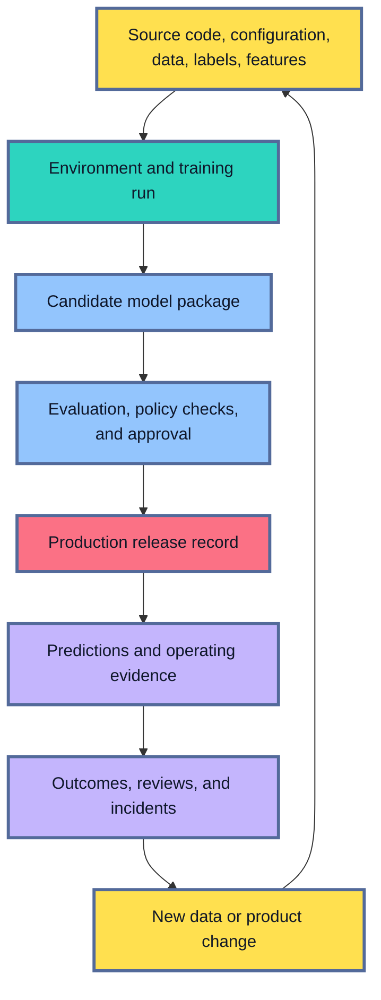
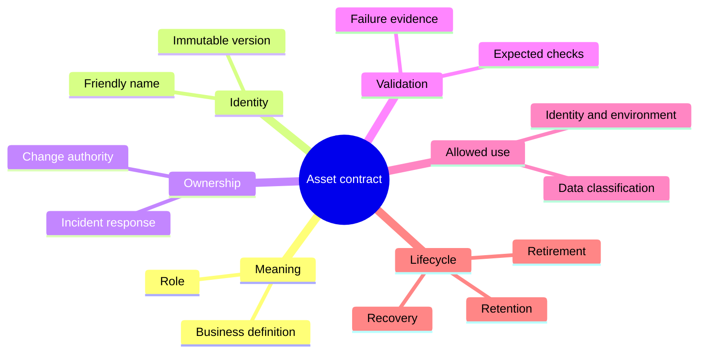
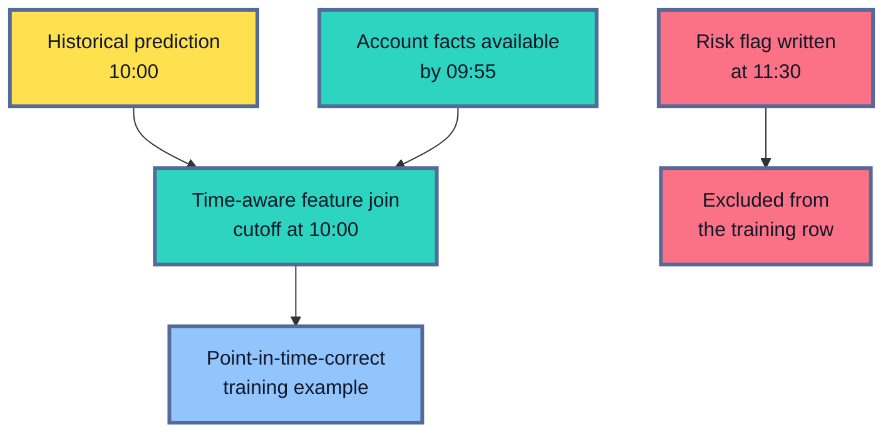
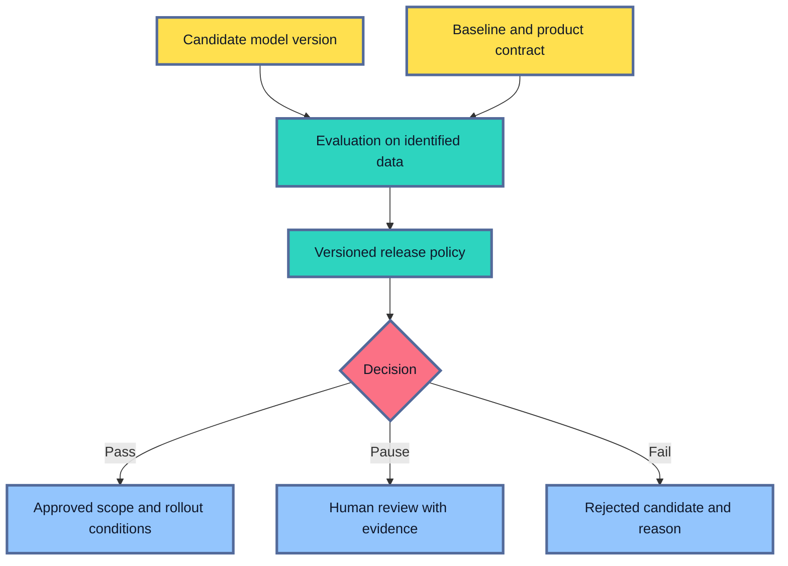
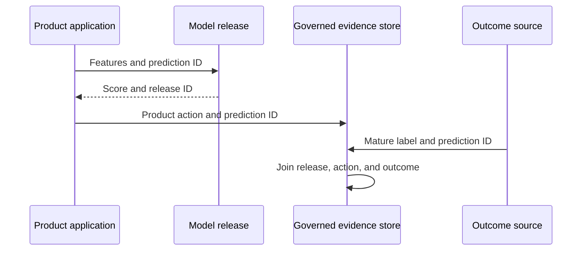
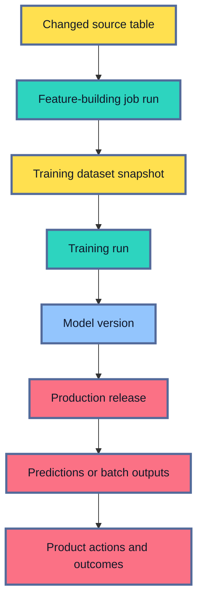

## Table of Contents

1. [A Model File Cannot Explain a Production Release](#a-model-file-cannot-explain-a-production-release)
2. [An ML Release Is a Graph of Versioned Assets](#an-ml-release-is-a-graph-of-versioned-assets)
3. [Every Asset Needs Identity, Ownership, and a Lifecycle](#every-asset-needs-identity-ownership-and-a-lifecycle)
4. [Source and Configuration Assets Define the Intended Work](#source-and-configuration-assets-define-the-intended-work)
5. [Data, Labels, and Features Define What the Model Learned](#data-labels-and-features-define-what-the-model-learned)
6. [Environment and Run Assets Record What Actually Executed](#environment-and-run-assets-record-what-actually-executed)
7. [The Model Asset Must Be a Complete Candidate](#the-model-asset-must-be-a-complete-candidate)
8. [Evaluation and Policy Assets Explain the Decision](#evaluation-and-policy-assets-explain-the-decision)
9. [A Release Record Binds Approved Assets to Production](#a-release-record-binds-approved-assets-to-production)
10. [Prediction and Outcome Assets Connect the Release to Reality](#prediction-and-outcome-assets-connect-the-release-to-reality)
11. [Lineage Connects Assets Across Systems](#lineage-connects-assets-across-systems)
12. [Current Industrial Systems Divide the Work](#current-industrial-systems-divide-the-work)
13. [Retention and Recovery Must Preserve a Complete Release](#retention-and-recovery-must-preserve-a-complete-release)
14. [Verify the Asset Graph in Both Directions](#verify-the-asset-graph-in-both-directions)
15. [Main Idea](#main-idea)
16. [References](#references)

## A Model File Cannot Explain a Production Release
<!-- section-summary: A production release depends on many connected assets because the model file alone cannot explain, reproduce, operate, or recover the system. -->

At a high level, **an ML system asset is any durable object or record needed to create, evaluate, release, operate, or explain a model-powered system**. Source code is an asset. So are a training-data snapshot, a feature definition, a container image, a training run, a model package, an evaluation report, a release record, and the production outcomes used to judge the model later.

The model file is only one result in this chain. It may contain learned weights or decision trees, yet it usually cannot answer the questions that matter during a release or incident:

- Which code and configuration created these parameters?
- Which historical rows and label definition shaped the model?
- Which dependencies can load the artifact?
- Which evaluation justified production use?
- Which release and endpoint actually used it?
- Which predictions and later outcomes belong to that release?
- Which owner can approve, repair, roll back, or retire it?

Consider a demand forecast that starts producing unusually low quantities for one region. The model weights may be intact. The real change could be a missing source partition, a revised holiday feature, a dependency update, a different post-processing threshold, or an incomplete batch output. Engineers need the surrounding assets to distinguish those causes.

That is the practical purpose of asset management in MLOps. It gives the team durable evidence about what changed, which production behaviour may be affected, and which safe state can be restored.



Each arrow represents a relationship that the system should record. A candidate points to its training run. The run points to its inputs. An approval points to the evaluated candidate and policy version. A release points to exact deployable assets. A prediction points to the release that produced it. An outcome points back to the original prediction.

## An ML Release Is a Graph of Versioned Assets
<!-- section-summary: The asset graph groups source, execution, decision, release, and production evidence while preserving the relationships between them. -->

A folder or spreadsheet can list assets, although a list alone cannot explain how they produced one release. MLOps needs an **asset graph**: stable asset identities connected by recorded relationships.

The graph has five broad parts.

**Source assets** describe the intended inputs to the build. They include source code, resolved configuration, dataset and label versions, feature definitions, and policy definitions.

**Execution assets** describe one attempt to perform the work. They include the runtime environment, job definition, run ID, logs, checkpoints, parameters, and intermediate outputs.

**Candidate and decision assets** describe what training produced and why the team accepted or rejected it. They include the model package, signature, evaluation dataset, metrics, slice reports, limitations, security results, approval, and rejection reason.

**Release assets** describe the exact production change. They bind a model version to a runtime image, deployment configuration, input and output contracts, rollout state, and recovery target.

**Production evidence** describes what the release did. It includes prediction or batch-output records, service telemetry, data-quality results, human actions, later labels, product outcomes, incidents, and retirement records.

These groups are useful because each answers a different investigation question. Source assets explain intent. Execution assets explain what ran. Decision assets explain judgement. Release assets explain production state. Production evidence explains real-world behaviour.

The relationships matter as much as the objects. A metric with no model identity cannot support a release decision. A model version with no dataset reference cannot support reproduction. A prediction with no release identity cannot support incident analysis. A label with no prediction join key cannot support production evaluation.

You can think of the graph as the evidence trail for one statement: “this production result came from this approved system.” Every important edge should be queryable instead of living only in a ticket, notebook title, or engineer's memory.

## Every Asset Needs Identity, Ownership, and a Lifecycle
<!-- section-summary: A durable asset contract defines what the asset is, how it is identified, who controls it, how it is verified, and how long it remains usable. -->

Before choosing a registry or catalog, the team needs a consistent contract for its assets. The contract can be expressed through six questions.

### What is the asset?

The name should explain the object's role and meaning. `customer_churn_training_examples` says more than `final_data_v2`. Its description should define one row, important timestamps, intended consumers, and known limits.

This meaning cannot come from storage location alone. A bucket path identifies where bytes live. A catalog entry, data contract, model card, or repository documentation explains what those bytes represent.

### Which exact version is involved?

Human-friendly names help discovery. Production evidence needs an immutable identity.

Git commits identify source states. Delta Lake and Apache Iceberg snapshots identify historical table states. OCI image digests identify container content. Experiment trackers assign run and model IDs. Registries assign model versions. A release system assigns a release or deployment revision.

A mutable alias such as `champion` or `current` is useful at a decision boundary. The workflow should resolve the alias to an immutable version and record that resolved value before execution. Otherwise, the alias can move while the job is running and leave the record ambiguous.

### Who owns the asset?

Ownership answers who defines the asset, accepts changes, responds to failure, and decides retirement. Several teams may contribute, while one accountable owner should remain visible.

For a training dataset, the source team may own raw event correctness, the data team may own transformations, and the ML team may own the final example contract. The asset record should identify each operational boundary and one escalation path.

### What validates it?

Validation should match the asset's role and likely failure. Code changes pass review and automated tests. Data pipelines check structure, freshness, domain meaning, and historical time.

Runtime environments need vulnerability and load checks. Model packages need interface tests and evaluation. Release records need preflight and rollout gates.

Production evidence has its own controls. Prediction and outcome records need valid schemas, complete batches, dependable joins, and enforced retention.

### Where can it be used?

An asset contract should state the allowed environments, identities, purposes, and data classifications. Development access may differ from production access. A model approved for offline analyst support may have no approval for automated customer decisions.

### How long must it remain?

Retention has both minimum and maximum boundaries. A rollback package must remain available through the recovery window. A regulated decision may need evidence for an audit period. Sensitive prediction records may require deletion much sooner. Keeping everything forever increases cost and privacy risk; deleting one dependency too early can make a production release impossible to reconstruct.

These questions turn a loose file into an operational asset. They also expose missing controls before the team buys a larger metadata platform.



## Source and Configuration Assets Define the Intended Work
<!-- section-summary: Source assets preserve the reviewed logic and fully resolved choices that tell a training or inference job what to do. -->

The source layer describes the work the team intended to run. It usually includes training code, feature logic, evaluation code, inference code, pipeline definitions, infrastructure definitions, tests, and configuration.

Git provides the common identity for reviewed source. A training record should capture the repository and commit, while the build process should preserve the link from that commit to the package or image it produced. Branch names are useful for collaboration and unsuitable as final release identities because their pointers move.

Configuration needs equal care. The selected feature set and training window determine which examples enter learning. Model parameters and decision thresholds shape candidate behaviour. Output settings decide where the resulting assets are written.

The final values may come from a checked-in file, environment variables, command-line flags, and platform defaults. Secret references supply protected values without placing them in source control.

The durable asset is the **resolved configuration**: the final values used after every override has been applied. Suppose a checked-in file sets `lookback_days: 30`, while a scheduled job overrides it to `14`. Recording only the file would describe a run that never happened.

Secrets are handled differently. The record should identify the secret reference and version or rotation state where the platform permits it. It should never copy credentials into run metadata, logs, or artifacts.

A useful source record might preserve relationships like these:

```yaml
source:
  repository: "git.example.org/ml/fraud-risk"
  commit: "7d83a14"
  training_entrypoint: "src/train.py"
configuration:
  schema_version: "fraud-training-config-v4"
  resolved_digest: "sha256:4c917b..."
  secret_references:
    - "feature-store-reader"
```

The digest identifies the resolved configuration content without exposing sensitive values. A reviewer can retrieve the governed configuration object, compare it with another run, and verify that the training service used the approved source commit.

GitHub, GitLab, and enterprise source platforms commonly provide repository history and review. GitHub Actions, GitLab CI, Jenkins, or managed CI services connect source identities to tests and build outputs. The CI system owns build evidence; the experiment tracker owns the training-run record. Linking them prevents the training system from claiming a source version that the build process never produced.

## Data, Labels, and Features Define What the Model Learned
<!-- section-summary: Versioned data and feature assets preserve the examples, meanings, and historical time boundaries that shaped model behaviour. -->

Data assets carry meaning and historical time alongside their rows. Those properties explain what one example represents, which outcome counts as its label, and which information was valid at the prediction moment.

A **training example** combines the information available at a historical prediction moment with a later outcome. The inputs are features. The outcome is the label. Their definitions determine which problem the model learns.

Suppose a churn model changes its label from “subscription cancelled within 30 days” to “account inactive within 30 days.” The same customer history can now produce different positive examples. That is a new label asset and a new learning task, even if the training code stays unchanged.

Feature definitions also need identities. For a field called `transactions_7d`, the event source and entity key determine which transactions belong to one account. The aggregation and event-time window define the calculation. Late-arrival and missing-value rules explain how the pipeline handles incomplete history, while the data type protects the interface. The field name alone cannot guarantee that training and production calculate the same value.

### The dataset identity must name a recoverable state

Object-storage paths can change as new files arrive. Table names can point to newer commits. A training run should record the snapshot, table version, partition manifest, or content digest that identifies the state it read.

Delta Lake and Apache Iceberg provide table history through versioned snapshots. Warehouses and managed data platforms may expose snapshots, clones, or time-travel features. A small file-based workflow may use a manifest containing object paths, sizes, and checksums.

The snapshot identity still needs a retention plan. A saved version number cannot recover data files that the platform has already removed. Long investigation or audit windows may require durable snapshots beyond the table's normal history.

### Historical time belongs in the feature asset

Training data is assembled after outcomes are known, so it can accidentally include future information. **Point-in-time correctness** means that each historical example uses only values available by its prediction timestamp.

Imagine a payment scored at 10:00. A risk flag written at 11:30 cannot appear in the 10:00 training row. A time-aware feature join uses the entity key and timestamp to select the latest permitted value. The feature definition should preserve that time rule so another pipeline can reproduce it.



Feature stores such as Feast and managed feature platforms can store shared definitions and support historical or online retrieval. They are useful after several models reuse features or online serving needs consistent low-latency values. A batch model with a few stable warehouse fields may only need governed transformations and versioned tables.

### Catalogs govern the data around its storage

Table formats provide reliable table states and history. Catalogs and platform controls supply governed names, ownership, permissions, discovery, audit, and cross-asset lineage.

Databricks Unity Catalog is one implementation. Native cloud catalogs, warehouse catalogs, and data-governance platforms provide similar responsibilities in other stacks. The catalog points to the governed asset, while the immutable snapshot identifies the exact data state used by the run.

## Environment and Run Assets Record What Actually Executed
<!-- section-summary: Environment and run records capture the runtime, inputs, parameters, outputs, status, and resource context of one execution. -->

Source and data assets describe intended inputs. The **run asset** records one actual execution and ties those inputs to the outputs, status, and operating evidence produced during that attempt.

A run might be one `python train.py` process, a managed training job, or a multi-stage pipeline execution. Its unique ID and lifecycle state distinguish this attempt from every other execution.

The run records the workload identity and the source, configuration, data, and environment it consumed. It also preserves material compute settings. Parameters describe the choices made inside the job, while metrics, logs, and produced assets record the result.

The environment deserves its own identity because dependency drift can change behaviour. A Python lockfile records package resolution. An OCI container packages the operating-system layer, system libraries, Python environment, and application code. The image digest identifies the exact content selected by the runtime.

Tags such as `training:latest` or `serving:stable` can move. Production records should capture the resolved digest:

```text
training image tag:  registry.example.org/fraud-train:stable
resolved identity:   registry.example.org/fraud-train@sha256:9f05c2...
```

Hardware also matters for some workloads. Accelerator type, distributed strategy, precision mode, and framework settings can influence performance or numerical results. The run record should preserve material execution details and define acceptable reproducibility tolerances.

### Runs connect inputs to outputs

The run is the central event in the asset graph:

```mermaid
flowchart TD
    C["Source commit and<br/>resolved configuration"] --> R["Training run"]
    D["Dataset, labels,<br/>and feature versions"] --> R
    E["Environment image digest<br/>and compute context"] --> R
    R --> M["Logged model or checkpoint"]
    R --> Q["Metrics, reports, and logs"]
    R --> X["Intermediate datasets<br/>and pipeline outputs"]

    classDef input fill:#FFE04F,stroke:#536A9A,stroke-width:3px,color:#111827
    classDef run fill:#2DD4BF,stroke:#536A9A,stroke-width:3px,color:#0F172A
    classDef output fill:#93C5FD,stroke:#536A9A,stroke-width:3px,color:#0F172A
    class C,D,E input
    class R run
    class M,Q,X output
```



MLflow Tracking records executions as runs and can attach parameters, metrics, code versions, artifacts, datasets, and Logged Models. MLflow 3 can link metrics to a specific Logged Model and dataset, which is useful after one run produces several checkpoints.

Managed training platforms also create job and run records. SageMaker AI keeps these records inside its managed job system. Google Cloud's Gemini Enterprise Agent Platform records its training executions, while Databricks records job execution alongside its MLflow integration.

Azure Machine Learning versions reusable assets for data, environments, models, and pipeline components, and it keeps job history in a workspace. Any managed platform may supply many fields automatically. The team still needs to add external identities that the platform cannot infer.

A failed run remains valuable evidence. It should keep its error class, last completed stage, relevant logs, and partial outputs that are safe to retain. Overwriting failed attempts removes information about instability and makes comparison unreliable.

## The Model Asset Must Be a Complete Candidate
<!-- section-summary: A model candidate includes learned parameters plus the interface, preprocessing, dependencies, and integrity records required to evaluate and load it consistently. -->

The **model artifact** is the saved result of training. Depending on the framework, it may be a set of weights, a decision-tree file, a serialized estimator, or a directory containing several files.

Production usually needs more than the learned parameters. The complete candidate may include:

- preprocessing and post-processing logic;
- tokenizer or vocabulary files;
- feature order and category mappings;
- thresholds or calibration objects;
- input and output schemas;
- framework and dependency requirements;
- loading or inference wrapper;
- artifact checksum and storage reference.

This collection is the **model package**. The package should match the unit that evaluation tested. If evaluation used one tokenizer and serving loads another, production runs a different system from the approved candidate.

A **model signature** describes the input and output interface. It can catch an endpoint that sends a string where the model expects a number, rearranges a feature vector, or omits a required column. The signature protects shape and type; it cannot prove that a feature carries the correct business meaning or historical timing.

Model registries give packages stable names and immutable versions. MLflow Model Registry is a common open implementation. Models in Databricks Unity Catalog adds Databricks governance to the MLflow registry workflow. AWS, Google Cloud, and Azure also provide managed model registries.

Registration establishes that the asset exists and can be governed. Evaluation and approval records establish whether it should receive production use.

For large language models, the candidate boundary may include adapter weights, tokenizer versions, chat templates, generation defaults, and safety configuration. A prompt or retrieval index can be an independently versioned dependency because changing either can alter application behaviour without changing the base model.

## Evaluation and Policy Assets Explain the Decision
<!-- section-summary: Evaluation evidence records observed behaviour, while versioned policies convert that evidence into an approval, rejection, or limited release. -->

A candidate model gains production meaning through evaluation against the product contract. That evidence explains how the model behaved, which risks were examined, and why a release decision followed.

The evaluation asset anchors every result to the candidate, baseline, and evaluation dataset. It records overall metrics and the important slices that expose uneven behaviour.

Threshold and robustness checks describe behaviour beyond the headline score. Operational tests cover constraints such as latency or memory. Known limitations and the release recommendation explain how reviewers interpreted the evidence.

The numbers need context. A recall value has little value without the dataset, label definition, threshold, and segment that produced it.

Suppose a fraud candidate improves overall recall while doubling false positives for low-value international payments. The evaluation report should preserve both results. A reviewer can then see the tradeoff instead of accepting a headline metric.

The **policy asset** defines how evidence turns into a decision. Data-quality policy may require schema and label-coverage checks. Model policy may define baseline and segment thresholds. Security policy may require an approved dependency scan. Release policy may require shadow traffic and a rollback target.

Policies need versions because their rules change. A release record that says `approved` is incomplete without the policy version and evidence used by the decision. A candidate approved under an older threshold may need another review after the policy changes.



Approval can be automated, manual, or combined. Automation handles repeatable checks. Human review fits unusual tradeoffs, regulated decisions, and high-impact releases. The approval record should identify the subject, evidence, policy, decision, owner, allowed scope, and any expiry or review condition.

MLflow can preserve metrics and artifacts around a model. Registries and managed platforms can hold tags, aliases, approval status, model cards, and lineage. CI/CD or governance workflows often own the final release decision because they can combine model evidence with security, infrastructure, and organizational policy.

## A Release Record Binds Approved Assets to Production
<!-- section-summary: The release record freezes the exact model, runtime, contracts, policy decision, target, rollout, and recovery state used in production. -->

A registered and approved model identifies the candidate. The release record adds the production state, including its serving image, feature configuration, post-processing policy, endpoint settings, or batch-output target.

The **release record** binds those pieces into one production identity. It should point to immutable values and preserve the environment, target, rollout state, and recovery plan.

```yaml
release_id: "fraud-risk-release-42"
model:
  registry_uri: "models:/fraud-risk/42"
  artifact_digest: "sha256:8fd2b7..."
runtime:
  image: "registry.example.org/fraud-serving@sha256:37ac11..."
contracts:
  input_schema: "fraud-features-v5"
  output_schema: "fraud-decision-v3"
decision:
  evaluation_id: "fraud-eval-42"
  policy_version: "high-risk-release-v7"
target:
  environment: "production"
  route: "fraud-score"
recovery:
  fallback_release: "fraud-risk-release-41"
```

Release `42` names one model package, one runtime, one pair of interfaces, one approved decision, one production target, and one fallback.

The deployment system should record observed state as well as intended state. The record may say model version `42` should run, while an endpoint still has version `41` loaded after a failed rollout. Health checks, deployment revisions, and runtime inspection need to confirm the actual state.

Registries can contribute model identity and approval metadata. CI/CD systems, managed deployment services, GitOps controllers, and release databases commonly contribute build, target, and rollout state. One system rarely owns every field, so the release ID must connect them.

For a batch model, the release record binds a scheduled job to one model version. It also identifies the input contract and destination table so a consumer can verify the output.

For an online service, the record binds an endpoint revision to its model and current traffic allocation. Those delivery details differ, while the need for one immutable release identity stays constant.

## Prediction and Outcome Assets Connect the Release to Reality
<!-- section-summary: Production records link each prediction or output batch to its release, product action, and later outcome without copying unrestricted sensitive data into telemetry. -->

Production creates evidence that training cannot supply. The system sees live inputs, executes a release, produces predictions, triggers product actions, and eventually receives outcomes.

A useful prediction record identifies the release, request or batch run, prediction time, governed entity or join key, output summary, policy action, and operational correlation ID. It may also reference the input snapshot or online feature state.

For a payment decision, the record could say that release `42` returned risk band `high`, policy version `fraud-action-v6` routed the payment to review, and trace `abc123` followed the technical request. The later investigation result joins through a governed prediction identifier.



The record should contain the minimum approved fields. A release identity and prediction time usually belong in the operational record. A governed join key can connect the result to restricted source data.

Raw requests and full feature vectors should stay out of general logs and traces. Direct identifiers and sensitive source payloads belong in restricted systems. Credentials and unrestricted exception text have no place in prediction evidence.

Approved references connect the restricted source to operational evidence without creating another uncontrolled copy.

### Prediction records and telemetry serve different jobs

Prediction records support ML and product analysis. They answer which release produced an output and how that output influenced an action.

Operational telemetry supports service diagnosis. OpenTelemetry traces can connect API, feature lookup, queue, and inference spans. Metrics show latency, errors, traffic, and resource use. Logs record bounded operational events.

A trace ID can connect the two records. The trace should avoid becoming a second copy of the governed prediction dataset.

### Outcomes need maturity and join rules

An outcome can arrive seconds, days, or months later. A clear event definition states what counts as the final result. The maturity window says how long the team waits before evaluating it.

A governed join key connects the outcome to its prediction. Revision rules handle corrected labels, and the missing-label policy explains how incomplete joins affect the reported metrics.

Suppose chargebacks mature after several weeks. An early “no chargeback” record is still incomplete. Production evaluation should include only outcomes that passed the maturity rule and should report join coverage. A falling join rate can make model quality appear better because difficult cases are missing.

Actions and interventions belong in the record too. Manual review, recommendation exposure, treatment assignment, and product fallback can change the outcome. Future training data needs those fields to distinguish natural behaviour from behaviour influenced by the model.

## Lineage Connects Assets Across Systems
<!-- section-summary: Lineage records how jobs and decisions consume and produce assets so teams can investigate upstream causes and downstream impact. -->

**Lineage** records how assets derive from and affect one another. You can think of it as a map of production cause and consequence.

Backward lineage starts from an output and follows its history. A disputed prediction leads to a release, model version, evaluation, run, environment, source commit, data snapshot, and feature definitions.

Forward lineage starts from a changed or faulty input and follows its impact. A corrupted label table leads to every run that consumed it, every model those runs produced, every release using those models, and the production outputs that may need review.



Lineage tools discover some relationships automatically. OpenLineage defines Jobs, Runs, and Datasets so compatible systems can emit lineage events across orchestrators and data platforms. Unity Catalog captures supported Databricks query lineage and can include tables, jobs, notebooks, model versions, and external assets. Cloud providers and managed ML platforms also capture lineage inside their own boundaries.

Automatic capture has limits. Dynamic code, renamed objects, custom services, direct file paths, unsupported libraries, and external systems can leave gaps. The release decision and product action may also live outside the data platform.

Teams therefore combine captured lineage with explicit identifiers in run, release, prediction, and approval records. A useful lineage review asks where capture stops, which edge is declared by application code, and which human owner can verify the relationship.

Lineage views must respect the same access rules as the underlying data. Catalog and metadata systems should mask protected nodes and enforce the surrounding governance model.

## Current Industrial Systems Divide the Work
<!-- section-summary: Industrial stacks distribute bytes, metadata, governance, lineage, release state, and telemetry across systems with clear boundaries. -->

ML asset management combines storage, identity, metadata, governance, lineage, release state, and operational evidence. Industrial stacks distribute those responsibilities across several connected systems.

GitHub or GitLab usually owns source history and review. CI systems connect commits to tests, packages, OCI images, infrastructure plans, and build attestations. The OCI registry stores container images and exposes immutable digests.

Object storage, warehouses, and lakehouses store data and large artifacts. Delta Lake and Apache Iceberg provide reliable table snapshots. Catalogs add governed identities, ownership, permissions, discovery, and lineage around those tables.

MLflow Tracking is a common system for run metadata, parameters, metrics, datasets, Logged Models, and artifacts. Its backend store holds structured metadata, while an artifact store such as S3 or Azure Blob Storage holds larger files. Weights & Biases and managed tracking services can fill a similar role.

Model registries organize immutable model versions and lifecycle metadata. MLflow Registry and Models in Unity Catalog cover common open and Databricks workflows. SageMaker Model Registry supplies the AWS-managed option. Gemini Enterprise Agent Platform Model Registry supplies the current Google Cloud option, and Azure Machine Learning registries cover Azure.

Current MLflow workflows use aliases and tags; fixed model stages are deprecated.

Orchestrators such as Airflow, Dagster, Prefect, Lakeflow Jobs, and managed ML pipelines supply job and run state. OpenLineage can carry job, run, and dataset relationships across supported tools. Native catalogs often provide deeper lineage inside one platform.

CI/CD and managed serving platforms usually own deployment and rollout records. OpenTelemetry and cloud monitoring systems own operational telemetry. Governed tables or specialist monitoring systems hold prediction summaries, joined outcomes, and quality evidence.

This division protects important boundaries. A registry entry establishes a model version and its lifecycle metadata. A deployment record establishes the observed production state. An observability trace describes technical request execution, while a governed prediction dataset supports ML and product analysis.

Connecting their identities provides a fuller history while each system keeps the data it is designed to manage.

A small team can start with Git, versioned warehouse tables or manifests, Docker image digests, MLflow, a managed endpoint or batch job, and a controlled release manifest. A larger platform can add a catalog, OpenLineage, policy engines, richer registries, and cross-environment governance after scale and risk justify them.

## Retention and Recovery Must Preserve a Complete Release
<!-- section-summary: Recovery succeeds only if every asset required by the historical release remains available, compatible, permitted, and verifiable. -->

Keeping model weights while deleting the tokenizer, schema, environment, or feature definition leaves an unusable release. Retention should preserve complete operational units.

Production and fallback releases often need longer retention than exploratory runs. A candidate rejected early may keep a smaller evidence set. Regulated or high-impact decisions may need durable evaluation, policy, approval, prediction, and outcome evidence. Sensitive data may have strict maximum retention and deletion obligations.

The retention plan should follow dependency edges. The removal check starts with active releases and their fallbacks. It then covers evidence reserved for audits or open investigations. A catalog or lineage system can assist, while the release manifest remains the clearest statement of what recovery needs.

### Recovery proves more than storage

A recovery exercise starts from a historical release ID and resolves the model package, image digest, contracts, configuration, policy, and fallback. An isolated job verifies checksums, loads the package in the recorded runtime, and scores fixed test fixtures.

The exercise then follows lineage backward to the run and data references. Permissions must still allow the recovery identity to retrieve approved assets. Encryption keys, network paths, registry credentials, and catalog references must still work.

Finally, the team proves the recovered release can enter the intended safe state. For an online endpoint, that may be a temporary route or staging target. For a batch system, it may be a comparison table. Fixed fixtures and service checks confirm that recovery produced the expected interface and behaviour.

If policy requires deleting sensitive source rows before the full audit period ends, the team can retain approved non-sensitive evidence and the lineage needed to interpret it. A hash can support an identity check for evidence still available to an authorized investigation; it cannot recreate deleted data.

## Verify the Asset Graph in Both Directions
<!-- section-summary: Two-direction drills prove that teams can explain a production output and identify every downstream use of a faulty input. -->

An asset graph earns trust through investigation drills that exercise real identities, permissions, and recovery paths. The drills should prove both directions: explaining one production result and finding every affected result from one faulty input.

Start with one production prediction or batch row. Retrieve its release ID, deployment revision, model version, runtime digest, input contract, evaluation, policy decision, training run, source commit, configuration, environment, dataset snapshot, labels, and feature definitions. Follow the record forward to the product action and mature outcome.

Then start with a deliberately invalid test asset. Mark a test data snapshot as withdrawn or publish a known-bad feature version in an isolated environment. The lineage query should identify the consuming run, candidate, release, and outputs. The owner should be able to block promotion, quarantine affected evidence, and record the reason.

Test broken dependencies too. Expire a temporary artifact-store permission, remove access to a test image, or point a release manifest to a missing evaluation report. The release gate should fail before production exposure. Recovery should succeed after the correct asset or permission is restored.

The verification result should answer practical questions:

- Can the team identify the exact content behind every friendly name?
- Can it find an accountable owner for every critical asset?
- Can it prove which policy approved a release?
- Can it detect disagreement between intended and observed deployment state?
- Can it join predictions to mature outcomes without leaking sensitive payloads?
- Can it recover a complete fallback under current permissions?
- Can it retire an asset without breaking an active dependency?

These drills test the relationships that ordinary inventory counts miss. A complete graph lets the team explain, contain, recover, and learn from a production change.

## Main Idea
<!-- section-summary: ML system assets form the durable evidence graph behind model creation, release, production behaviour, and recovery. -->

An ML release is a connected graph of assets that preserves how the system was created, why it was approved, what production ran, and what happened afterward.

Source and configuration describe intended work. Data, labels, and features describe what the model could learn. Environment and run records describe actual execution. The model package is the candidate. Evaluation and policy evidence explain the decision. The release record binds approved assets to production. Prediction and outcome records reveal real-world behaviour.

Stable identities connect these records. Ownership gives each asset an accountable response path. Lineage supports backward cause analysis and forward impact analysis. Retention and recovery keep complete historical releases usable for as long as policy requires.

Industrial tools divide this work across source control, storage, tracking, registries, catalogs, orchestrators, deployment systems, and telemetry platforms. The durable design principle stays the same: every production result should lead to the exact system that created it and every material input should lead to the production results it influenced.

## References

- [MLflow: Tracking](https://mlflow.org/docs/latest/ml/tracking/)
- [MLflow: Model Registry workflows](https://mlflow.org/docs/latest/ml/model-registry/workflow/)
- [OpenLineage: Object model](https://openlineage.io/docs/spec/object-model/)
- [Databricks: Lineage in Unity Catalog](https://docs.databricks.com/aws/en/data-governance/unity-catalog/data-lineage)
- [Databricks: Manage model lifecycle in Unity Catalog](https://docs.databricks.com/aws/en/machine-learning/manage-model-lifecycle/)
- [Amazon SageMaker AI: Model Registry](https://docs.aws.amazon.com/sagemaker/latest/dg/model-registry.html)
- [Google Cloud: Gemini Enterprise Agent Platform Model Registry](https://docs.cloud.google.com/gemini-enterprise-agent-platform/machine-learning/model-registry/introduction)
- [Microsoft Learn: Azure Machine Learning resources and assets](https://learn.microsoft.com/en-us/azure/machine-learning/concept-azure-machine-learning-v2?view=azureml-api-2)
- [Microsoft Learn: Azure Machine Learning environments](https://learn.microsoft.com/en-us/azure/machine-learning/concept-environments?view=azureml-api-2)
- [Open Container Initiative: Content descriptors](https://github.com/opencontainers/image-spec/blob/main/descriptor.md)
- [Apache Iceberg: Evolution and snapshots](https://iceberg.apache.org/docs/latest/evolution/)
- [Delta Lake: Table batch reads and writes](https://docs.delta.io/delta-batch/)
- [OpenTelemetry: Documentation](https://opentelemetry.io/docs/)
