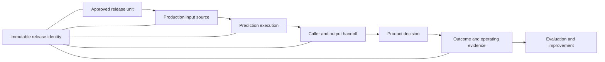

## Prediction Delivery Connects Training To A Product Decision
<!-- section-summary: Prediction delivery is the set of architectural contracts that carries one approved model release from training into a product workflow and returns evidence about its results. -->

**Prediction delivery** is the part of an MLOps architecture that connects an approved training artifact to a real product decision. It identifies the artifact, supplies the right production input, runs prediction in a suitable location, hands the result to a caller, and records enough evidence to trace the result back to one release. Later outcomes return through a feedback path so the team can evaluate what the release actually did.

A trained model file cannot make this connection alone. The product needs preprocessing code, a declared input and output shape, compatible runtime dependencies, and a place to execute. The product also needs a clear handoff. A web application may wait for a response, an ordering system may read a table, and an event processor may consume a prediction message. Each path creates different operational details, while the same architectural questions remain.

Six connected contracts organize prediction delivery:

| Contract | Question it answers | Failure when the answer is missing |
|---|---|---|
| **Training artifact** | Which complete release unit performs prediction? | Serving loads different preprocessing, dependencies, or weights from the evaluated candidate. |
| **Input source** | Which values enter prediction, and at which valid time? | The runtime reads stale, leaked, differently encoded, or unavailable features. |
| **Execution location** | Which process and infrastructure load and run the release? | The model misses latency, capacity, hardware, security, or availability requirements. |
| **Caller and output handoff** | Which product asks for the prediction, and how does it receive a usable result? | Predictions finish successfully but never reach the decision that needs them. |
| **Feedback and evidence** | Which production signals and later outcomes return to the team? | The team sees runtime health without knowing prediction quality or product effect. |
| **Release identity** | Which immutable identifiers connect all five contracts? | An incident cannot reliably connect an output to its artifact, input, runtime, and evaluation. |

The first five contracts form a path. **Release identity** travels across the entire path and lets the team join its records. This framework applies whether prediction runs in a scheduled job, a request-response service, a stream consumer, a mobile application, or a factory gateway. The Model Serving module develops those operating patterns in detail. This foundations article stays focused on the architectural handoffs that every pattern must preserve.



The diagram shows the dependency between contracts. A team can change the infrastructure inside one box, but it still needs an explicit handoff to the next box. That separation lets a small team run a model in one container today and move it to a managed platform later without changing what the product believes the prediction means.

## The Training Artifact Must Be A Complete Release Unit
<!-- section-summary: A production release unit combines the evaluated model with preprocessing, schema, runtime dependencies, and integrity information. -->

The **training artifact contract** names everything the prediction runtime needs from the learning system. A model artifact may hold weights, trees, or a serialized pipeline. A **release unit** adds the surrounding parts that make those learned parameters usable: feature order, preprocessing, postprocessing, label maps, thresholds, input and output schemas, dependency versions, and integrity metadata.

Consider a grocery chain called **OrchardMart**. Its demand model predicts the number of strawberry crates each store should order for the next day. Training produces `demand-forecast@42`. The evaluated release includes the fitted model, categorical encoders, feature names, a prediction wrapper, a model signature, and the runtime dependency lock. If production loads only `model.pkl` while separately reimplementing the encoders, the same input row can produce a different numeric feature vector. The evaluation report then describes a system that production never ran.

The artifact boundary should answer four practical questions. First, which files must move together? Second, which input and output shapes did evaluation use? Third, which runtime can load the files? Fourth, how can the deployment process prove that bytes stayed unchanged? Teams commonly answer the last question with an immutable object path, model version, container-image digest, and cryptographic artifact digest.

MLflow model signatures are one current implementation of part of this contract. A signature records model inputs, outputs, and optional inference parameters. An input example can create and validate a signature during model logging, and MLflow can validate a serving input against that signature. A signature still needs release identity, runtime packaging, security review, and product handoff around it. It covers the data interface rather than the whole delivery architecture.

The release unit should remain immutable after approval. If an engineer changes preprocessing, dependency pins, or threshold configuration, the team has a new candidate that needs evaluation and a new identity. Keeping that boundary strict prevents a deployment system from silently changing the meaning of an approved model.

## The Input Source Defines Production Reality
<!-- section-summary: The input contract identifies entities, schemas, timestamps, freshness, defaults, and ownership for the values supplied to prediction. -->

The **input source contract** describes the production values that reach the release. It includes more than column names. It needs entity keys, data types, units, event timestamps, freshness limits, missing-value behavior, and ownership. These details connect the model's training assumptions to the data that exists at prediction time.

For OrchardMart, one prediction row represents a store, a product, and a forecast date. The runtime reads recent sales, current inventory, promotion plans, store opening hours, and weather forecasts. The contract identifies `store_id`, `sku_id`, and `forecast_date` as the entity key. It also says that sales events must arrive before the 02:00 cutoff and that the inventory snapshot must correspond to the same business date.

This boundary creates a causal requirement: the runtime may use only information available before the product decision. Training can see next-day sales after the day ends because those values form the label. Production cannot use them as features. A delivery path therefore carries a **prediction timestamp** and an **input version** alongside the feature values. These fields let the team rebuild what the runtime knew and detect a point-in-time error.

Different systems can satisfy the same contract. A batch job may read a versioned warehouse snapshot. An online endpoint may combine request fields with values from an online feature store. A stream consumer may read an event and enrich it with keyed state. The storage engine changes, while the contract still preserves the entity, meaning, time, and fallback.

Freshness and fallback belong here too. If the promotion feed misses its deadline, OrchardMart needs an explicit policy. The job might block because promotion plans strongly affect demand, or it might use a previous approved snapshot and mark the run as degraded. Quietly filling the column with zero changes the business meaning and hides the failure from the product owner.

## Execution Location Is A Product And Operations Decision
<!-- section-summary: The execution contract maps product latency, freshness, capacity, security, and availability requirements to a runtime location. -->

The **execution location** is the process and infrastructure that load the release and run prediction. It could be a scheduled container, a long-running API service, a stream processor, a managed inference endpoint, an edge gateway, or code inside a device. This choice follows from the product's timing and operating requirements.

OrchardMart generates all store forecasts before planners arrive. A scheduled container close to the warehouse data can process many rows and write a versioned output table. An interactive substitution recommender would create a different requirement because a shopper waits for the answer. That product may need a long-running service close to the application and an online feature path. A camera that stops a factory conveyor may need local execution because a network round trip creates unacceptable delay.

Five constraints shape the location:

- **Latency and freshness** describe how soon the product needs an answer and how current the input must be.
- **Capacity** describes request rate, batch size, concurrency, memory, CPU, accelerator, and scaling needs.
- **Availability** describes which dependencies may fail and which fallback keeps the product safe.
- **Security and privacy** describe where sensitive inputs may travel, which identity reads them, and whether the runtime needs network isolation.
- **Cost and ownership** describe when compute stays allocated, who operates it, and which platform skills the team already has.

The release unit and input source constrain this choice. A large GPU artifact cannot run on a small device. An endpoint with a 50-millisecond budget cannot wait for a warehouse query. A batch job that reads a warehouse snapshot may gain little from a permanently allocated prediction server. The architecture review should connect each infrastructure choice to one of these constraints.

Detailed operating concerns such as batching, autoscaling, stream offsets, retries, model loading, container images, GPU scheduling, and edge updates belong to the Model Serving module. At this stage, the important architectural result is a named runtime boundary with a compatible release, reachable inputs, and a failure policy.

## The Handoff Must Reach The Product Decision
<!-- section-summary: The output contract connects prediction execution to a caller, a result shape, a delivery guarantee, and a fallback action. -->

The **caller** is the product component that requests or consumes a prediction. The **output handoff** is the interface that carries the result into a business action. The handoff may return an HTTP response, write rows to a table, publish events, update a search index, or store an on-device result. Prediction delivery succeeds only when the caller can use the output within its decision window.

OrchardMart's demand job writes one row per store and product to a staging table. Each row includes the forecast quantity, model release, input snapshot, prediction timestamp, and run ID. The ordering service reads a stable `current` view after validation promotes the new table. The staging boundary matters because planners should keep yesterday's complete forecasts if today's job writes only half its rows.

```json
{
  "store_id": "store_044",
  "sku_id": "strawberry_crate",
  "forecast_date": "2026-07-16",
  "predicted_units": 38.4,
  "release_id": "demand-forecast-42-8fd2b7",
  "input_snapshot": "warehouse.sales_features@2026-07-15T02:00:00Z",
  "prediction_run_id": "run-20260715-0215",
  "generated_at": "2026-07-15T02:23:17Z"
}
```

The numeric prediction is only one field in the handoff. `release_id` and `input_snapshot` preserve provenance. `prediction_run_id` groups rows from one execution and helps detect partial output. `generated_at` supports freshness checks. The caller still needs the output schema, acceptable range, deadline, and fallback action.

Failure semantics differ by handoff. A request-response caller needs a timeout and a product fallback. A batch consumer needs completeness and freshness gates before switching to a new table. A stream consumer needs a stable event key and duplicate handling. These details change across modes, while the architectural requirement stays consistent: the product can tell whether it received a complete, current, identifiable prediction.

## Release Identity Holds The Path Together
<!-- section-summary: Immutable release, artifact, runtime, input, and run identifiers let teams trace each product output to the system that produced it. -->

**Release identity** is the set of immutable identifiers that connects evaluation, deployment, prediction, and feedback. A friendly model name such as `demand-forecast` identifies a product capability. It cannot identify exact bytes or behavior by itself. The delivery path needs a specific model version or logged-model ID, artifact digest, serving-image digest, input schema version, and release record.

One useful release ID points to those immutable values rather than replacing them. OrchardMart can define `demand-forecast-42-8fd2b7` as a release record that binds model version `42`, artifact digest `sha256:8fd2b7...`, runtime image `sha256:37ac11...`, input schema `demand_features_v5`, output schema `demand_predictions_v3`, and approved evaluation `eval-20260714-0912`.

Each prediction execution also needs a run or request identity. The release ID answers which approved system produced a result. The run ID answers which execution produced it. A trace ID can follow a live request across application, feature, and inference services. OpenTelemetry context propagation provides a standard mechanism for carrying trace context across process and network boundaries. Batch and data pipelines can use lineage events; OpenLineage defines job, run, and dataset entities for this purpose.

This identity chain helps during an incident. If forecasts for frozen foods suddenly drop, the team can group bad rows by `release_id`, compare input snapshots by `prediction_run_id`, inspect the exact runtime image, and find the evaluation that approved the release. Without those joins, several teams may inspect different versions while believing they are discussing the same production behavior.

## A Delivery Gate Can Test The Release Invariant
<!-- section-summary: A preflight gate compares the declared delivery contract with observed runtime evidence and blocks handoff when identities or schemas differ. -->

The central delivery invariant is simple: **the release that passed evaluation must be the release that produces the product output under the declared input and output contracts**. A preflight gate can turn that sentence into a deterministic test before a batch table, endpoint route, or stream deployment receives production traffic.

The following example keeps the evaluator independent from any vendor platform. `DeliveryContract` contains the identities approved by the release process. `DeliveryEvidence` contains what the runtime actually loaded and configured during its smoke test. The evaluator compares them and returns a visible state: `ready` or `blocked`.

```python
from dataclasses import dataclass, replace
from typing import Literal


@dataclass(frozen=True)
class DeliveryContract:
    release_id: str
    model_digest: str
    runtime_digest: str
    input_schema: str
    output_schema: str
    output_target: str


@dataclass(frozen=True)
class DeliveryEvidence:
    release_id: str
    loaded_model_digest: str
    running_image_digest: str
    accepted_input_schema: str
    emitted_output_schema: str
    configured_output_target: str
    smoke_prediction_count: int


@dataclass(frozen=True)
class GateDecision:
    state: Literal["ready", "blocked"]
    violations: tuple[str, ...]


def evaluate_delivery(
    contract: DeliveryContract,
    evidence: DeliveryEvidence,
) -> GateDecision:
    expected_and_observed = {
        "release_id": (contract.release_id, evidence.release_id),
        "model_digest": (contract.model_digest, evidence.loaded_model_digest),
        "runtime_digest": (contract.runtime_digest, evidence.running_image_digest),
        "input_schema": (contract.input_schema, evidence.accepted_input_schema),
        "output_schema": (contract.output_schema, evidence.emitted_output_schema),
        "output_target": (contract.output_target, evidence.configured_output_target),
    }
    violations = tuple(
        f"{name}: expected {expected}, observed {observed}"
        for name, (expected, observed) in expected_and_observed.items()
        if expected != observed
    )
    if evidence.smoke_prediction_count < 1:
        violations += ("smoke_prediction_count: expected at least 1",)

    state = "ready" if len(violations) == 0 else "blocked"
    return GateDecision(state=state, violations=violations)


contract = DeliveryContract(
    release_id="demand-forecast-42-8fd2b7",
    model_digest="sha256:8fd2b7",
    runtime_digest="sha256:37ac11",
    input_schema="demand_features_v5",
    output_schema="demand_predictions_v3",
    output_target="warehouse.demand_predictions_staging",
)
matching_evidence = DeliveryEvidence(
    release_id="demand-forecast-42-8fd2b7",
    loaded_model_digest="sha256:8fd2b7",
    running_image_digest="sha256:37ac11",
    accepted_input_schema="demand_features_v5",
    emitted_output_schema="demand_predictions_v3",
    configured_output_target="warehouse.demand_predictions_staging",
    smoke_prediction_count=10,
)

ready = evaluate_delivery(contract, matching_evidence)
assert ready == GateDecision(state="ready", violations=())

wrong_model = replace(matching_evidence, loaded_model_digest="sha256:old991")
blocked = evaluate_delivery(contract, wrong_model)
assert blocked.state == "blocked"
assert blocked.violations == (
    "model_digest: expected sha256:8fd2b7, observed sha256:old991",
)
```

The first test supplies matching state and receives `GateDecision(state="ready")`. The failure test changes one observed value: the runtime loaded an older model digest. The evaluator returns `blocked` with the exact mismatch. A deployment controller or batch orchestrator can store that decision as release evidence and stop before it changes the production handoff.

Recovery should preserve the last trusted output. OrchardMart keeps the existing `current` forecast view pointed at yesterday's complete table, removes the mismatched runtime from the release path, loads the artifact named by the contract, and repeats the smoke test. A team could also create a new contract if it intentionally wants the different artifact. Either path requires a fresh gate result, so the evidence matches what the product will receive.

This small evaluator covers identity and contract compatibility. Production gates usually add artifact integrity verification, representative input fixtures, output range checks, row-count or load checks, permissions, and a product-specific safety test. Those checks should still return explicit evidence rather than an informal statement in a deployment log.

## Feedback Connects Outputs To Outcomes
<!-- section-summary: Feedback joins prediction records with later outcomes and operating signals so teams can evaluate release quality and product effect. -->

The **feedback contract** identifies what the team needs to observe after delivery. Service signals show whether the runtime answered. Data signals show whether production inputs matched the contract. Prediction signals show output volume and distribution. Outcome labels show whether predictions were useful after the real result arrives. Product signals show whether users or automated systems acted on the output.

For OrchardMart, the demand outcome arrives after the forecast date. The team can join sold units and stockout adjustments to the prediction using `store_id`, `sku_id`, and `forecast_date`. It can then group error by `release_id` and compare releases using the same outcome policy.

```sql
SELECT
    p.release_id,
    COUNT(*) AS evaluated_predictions,
    AVG(ABS(p.predicted_units - o.adjusted_units_sold)) AS mean_absolute_error,
    AVG(CASE WHEN o.stockout_minutes > 0 THEN 1.0 ELSE 0.0 END) AS stockout_rate
FROM warehouse.demand_predictions AS p
JOIN warehouse.demand_outcomes AS o
  ON p.store_id = o.store_id
 AND p.sku_id = o.sku_id
 AND p.forecast_date = o.sales_date
WHERE o.label_matured_at <= CURRENT_TIMESTAMP
GROUP BY p.release_id;
```

The query waits for mature outcomes and keeps release identity in the result. `evaluated_predictions` exposes coverage, because a quality metric from a small or biased subset can mislead. Mean absolute error measures forecast accuracy, while stockout rate connects the prediction to an operational guardrail. A real review would also break results down by store size, product category, promotion state, and forecast horizon.

Feedback has its own failure paths. Labels may arrive late, join keys may be missing, users may override recommendations, and a product change may alter how predictions are consumed. The monitoring system should report coverage and label delay beside quality. A missing quality metric should create an explicit `insufficient_feedback` state instead of appearing as a successful release.

## Delivery Modes Preserve The Same Contracts
<!-- section-summary: Batch, online, streaming, and edge delivery use different runtimes and handoffs while preserving artifact, input, output, identity, and feedback contracts. -->

The delivery framework stays stable across prediction modes. The main differences concern trigger, timing, execution, handoff, and recovery.

| Mode | Trigger and execution | Product handoff | Typical recovery boundary |
|---|---|---|---|
| **Batch** | Schedule or dataset event starts a finite job | Versioned table, file, index, or downstream bulk update | Retry partitions or the full run; promote output after completeness checks |
| **Online** | Live request reaches a long-running service or managed endpoint | HTTP, gRPC, or internal service response | Timeout, fallback, circuit breaking, and traffic rollback |
| **Streaming** | Consumer processes events continuously | Prediction event, state update, alert, or table row | Resume from durable progress, handle duplicates, and replay safely |
| **Edge or device** | Local event or user action runs an embedded runtime | Local application or controller result | Keep a previous compatible model and control fleet rollout |

This table classifies where the architectural contracts appear. It leaves the operational mechanisms to the dedicated Model Serving module. That module explains how teams choose patterns and operate batch, online, streaming, and edge inference with latency, capacity, packaging, scaling, retries, and rollback.

At the foundations level, a design review should be able to trace one prediction through the six contracts. It should name the approved release unit, the input and its time meaning, the execution boundary, the caller and handoff, the release and run identities, and the evidence that comes back. If one link stays implicit, the product may still produce predictions, but the team will struggle to verify or recover the path.

## Putting The Delivery Path Together
<!-- section-summary: Prediction delivery works when one identifiable release crosses compatible artifact, input, execution, handoff, and feedback boundaries. -->

Prediction delivery gives a trained model a controlled path into a product. The training artifact defines the complete release unit. The input contract defines production reality at a specific time. The execution contract places the release where it can meet product and operational requirements. The handoff contract connects prediction to a caller and a usable output. Feedback connects that output to runtime signals, mature outcomes, and product effects.

Release identity binds those contracts. It lets a gate prove that the evaluated artifact matches the loaded artifact, lets output records name the producing release and run, and lets monitoring group later outcomes by the system that made the prediction. This architectural chain stays useful as a team moves from a scheduled container to a managed endpoint or adds a streaming path, because the infrastructure can change while the contracts remain explicit.

## References

- [Google Cloud Architecture Center: MLOps continuous delivery and automation pipelines](https://docs.cloud.google.com/architecture/mlops-continuous-delivery-and-automation-pipelines-in-machine-learning) - Describes production ML architecture across validation, metadata, deployment, serving, and monitoring.
- [MLflow: Model signatures and input examples](https://mlflow.org/docs/latest/ml/model/signatures/) - Documents current input, output, and parameter signatures, input examples, serving examples, and signature validation.
- [OpenLineage: Core model](https://openlineage.io/docs/) - Defines interoperable lineage identities for datasets, jobs, and runs.
- [OpenTelemetry: Context propagation](https://opentelemetry.io/docs/concepts/context-propagation/) - Explains how trace context correlates signals across process and network boundaries.
- [Kubeflow: KServe introduction](https://www.kubeflow.org/docs/ecosystem/kserve/introduction/) - Gives a current example of a Kubernetes inference platform that handles runtime concerns around model serving.
