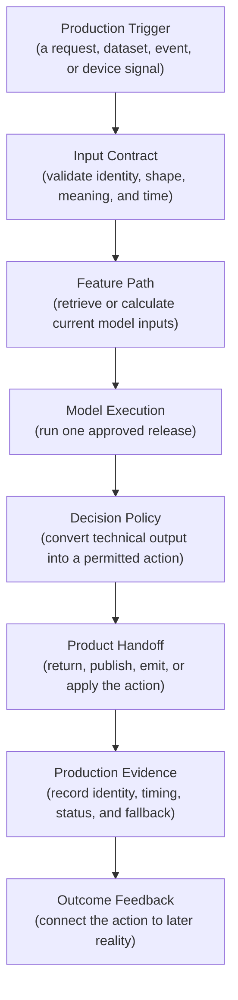
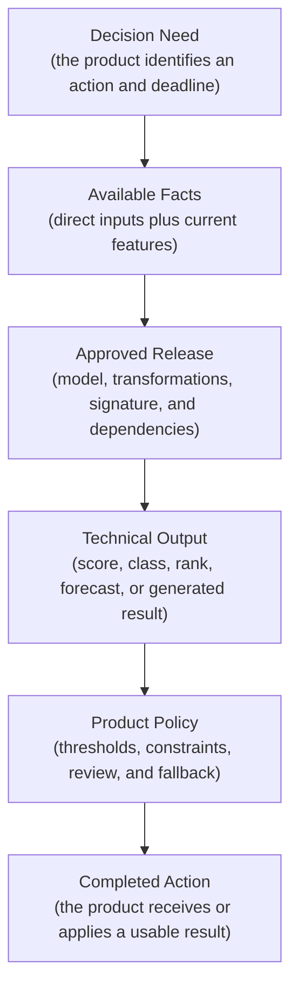
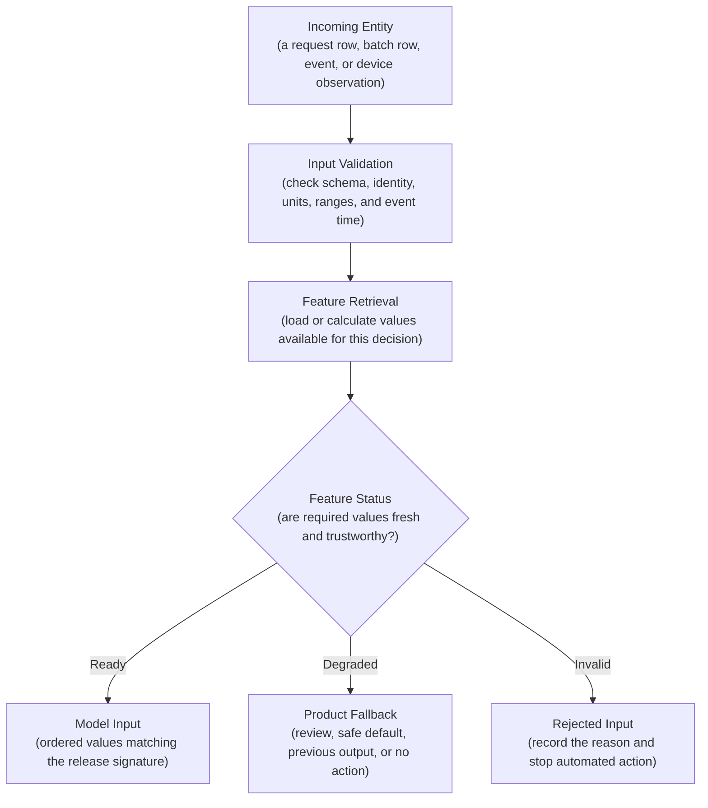
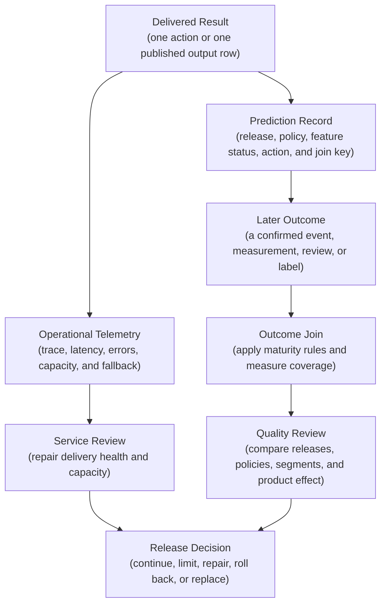
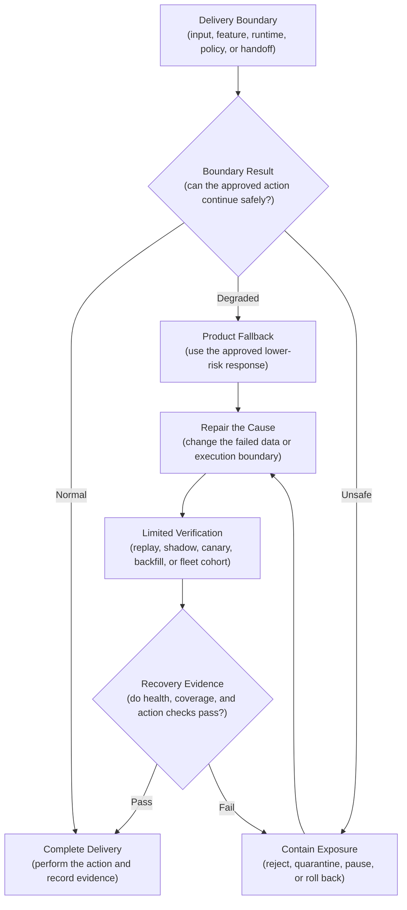
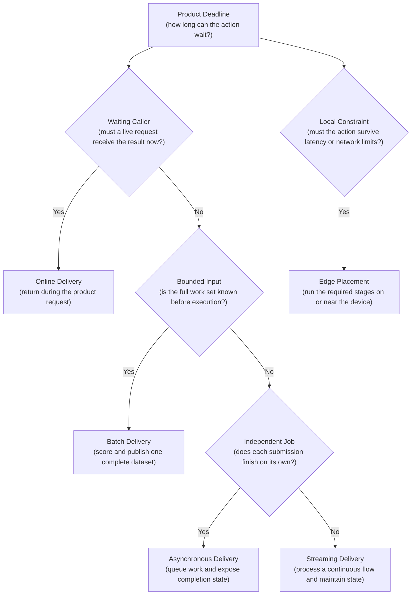

## Table of Contents

1. [What Prediction Delivery Means](#what-prediction-delivery-means)
2. [How A Prediction Reaches The Product](#how-a-prediction-reaches-the-product)
3. [Check The Data Before Running The Model](#check-the-data-before-running-the-model)
4. [Turn Model Output Into A Product Action](#turn-model-output-into-a-product-action)
5. [Record Each Prediction and Learn from Outcomes](#record-each-prediction-and-learn-from-outcomes)
6. [Plan What The Product Does When Prediction Fails](#plan-what-the-product-does-when-prediction-fails)
7. [Choose How And When The Prediction Runs](#choose-how-and-when-the-prediction-runs)
8. [Choose Who Runs The Model In Production](#choose-who-runs-the-model-in-production)
9. [Build A Complete First Version](#build-a-complete-first-version)
10. [The Main Idea](#the-main-idea)
11. [References](#references)

## What Prediction Delivery Means

<!-- section-summary: Prediction delivery carries an approved model from production input to a timely product action, then preserves evidence about what happened. -->

Training ends with a model that can calculate an answer from prepared input. A
product faces a larger problem. It has to collect the facts available at the
decision moment, run the approved model, interpret the output, act before the
answer loses value, and handle every failure along that path.

At a high level, **prediction delivery is the complete production path from a
trigger to a product action and the evidence that explains that action**.

Consider a payment risk check. The model may return a probability such as
`0.82`. The payment service needs an action such as approve the payment, request
another identity check, or send the case to review. Before the score exists, the
system has to validate the payment details and retrieve recent account
behaviour. After the score exists, policy decides which action is permitted. The
whole path has to finish before the payment flow times out.

A daily inventory forecast uses the same responsibilities with a different
clock. A scheduled job reads a complete sales snapshot, creates features, runs
the model for every product and location, applies ordering constraints, and
publishes one complete forecast table. Planners use that table the next morning.
The job can take an hour, although a partial table would still be unsafe to use.

These situations reveal the central idea: model execution is one stage inside
prediction delivery. The surrounding stages protect the meaning, timing, and
product effect of the result.


```mermaid
flowchart TD
    A["Production Trigger<br/>(a request, dataset, event, or device signal)"] --> B["Input Contract<br/>(validate identity, shape, meaning, and time)"]
    B --> C["Feature Path<br/>(retrieve or calculate current model inputs)"]
    C --> D["Model Execution<br/>(run one approved release)"]
    D --> E["Decision Policy<br/>(convert technical output into a permitted action)"]
    E --> F["Product Handoff<br/>(return, publish, emit, or apply the action)"]
    F --> G["Production Evidence<br/>(record identity, timing, status, and fallback)"]
    G --> H["Outcome Feedback<br/>(connect the action to later reality)"]
```

The shape of the trigger changes across products. A caller may wait for an
online response. A worker may process a queued request later. A batch job may
score a bounded dataset. A stream processor may react to continuous events. A
device may act locally. All of them still need the path shown above.

This shared path gives the architecture a stable foundation. Timing determines
how the work is scheduled. Platform ownership determines who operates the
runtime. Neither choice removes the input, policy, evidence, failure, or feedback
responsibilities.

## How A Prediction Reaches The Product

<!-- section-summary: Every delivery path carries a trigger through preparation, execution, policy, handoff, evidence, and feedback under one product deadline. -->

Every prediction starts because a product needs an answer. A user submits a
request, a daily dataset closes, a sensor emits an event, or a camera produces a
frame. This starting event is the **trigger**. It also establishes the product
clock: the latest moment at which the result can still change a real action.

A recommendation for a page being opened may have only tens of milliseconds
inside a larger page-latency budget. A document classification request may take
several minutes if the user receives a completion notification. A weekly demand
forecast can run for hours as long as the complete output arrives before the
planning meeting. A local safety decision may need a result during a network
outage.

The product clock controls the architecture more strongly than the speed of the
model alone. Feature retrieval, queueing, network calls, preprocessing,
post-processing, and handoff all consume part of the same deadline.

### Prepare The Facts The Model Needs

The trigger rarely contains every value the model needs. A payment request may
contain the amount and account identifier, while the model also expects recent
transaction count and account age. A batch forecast may start from sales rows
and still need holiday, price, and stock features.

The delivery path validates the direct input, retrieves or calculates the
remaining features, and arranges them in the exact structure expected by the
release. This preparation must preserve time. A feature written after the
prediction moment cannot silently appear in historical evaluation, and a stale
online value cannot appear current during production.

### Run The Approved Model And Its Preprocessing

Approving a model means approving more than its learned parameters. The same
preprocessing, dependencies, input shape, and label mappings used during
evaluation must travel into production with it. Together, these pieces form the
approved **release**. The model runtime loads that release and calls its
prediction function.

A model file can load successfully while the surrounding transformation differs
from evaluation. For example, evaluation may map an unseen category to a
reserved value, while production rejects the same category. Packaging or
sharing the transformation prevents those two paths from defining different
prediction functions.

### Use Rules To Turn Model Output Into An Action

The runtime usually returns a technical value: a probability, class, rank,
forecast, embedding, or generated result. Product policy interprets that value.
It may apply thresholds, confidence rules, inventory limits, safety constraints,
content checks, human review, or an abstain path.

The distinction matters during change. A team can tighten a risk threshold while
keeping the same model. It can replace a model while preserving the policy. The
production record therefore identifies both the model release and the policy
version.

### Send The Result To The Product

After the rules select an action, the result has to reach the system that will
use it. This transfer is the **handoff**. It may be an API response, a published
table, an event, a callback, a stored result, or a local device action. A
complete handoff includes enough status and provenance to distinguish a normal
result from a degraded one.

Delivery finishes only after the product receives or applies that result. A
model endpoint returning a score while the calling service has already timed out
has completed computation and failed delivery.


```mermaid
flowchart TD
    A["Decision Need<br/>(the product identifies an action and deadline)"] --> B["Available Facts<br/>(direct inputs plus current features)"]
    B --> C["Approved Release<br/>(model, transformations, signature, and dependencies)"]
    C --> D["Technical Output<br/>(score, class, rank, forecast, or generated result)"]
    D --> E["Product Policy<br/>(thresholds, constraints, review, and fallback)"]
    E --> F["Completed Action<br/>(the product receives or applies a usable result)"]
```

Evidence and feedback extend the path beyond the completed action. Evidence
explains the execution immediately. Feedback arrives later and shows whether the
action helped. Those two records serve different questions, so both need their
own design.

## Check The Data Before Running The Model

<!-- section-summary: Input and feature contracts preserve the entity, schema, units, event time, freshness, and missing-data behaviour expected by the approved model. -->

Before the model runs, the system checks whether the incoming data represents a
situation the model was built to handle. A valid JSON body or readable table is
only a structural starting point. The system also needs the correct entity,
units, categories, timestamps, and feature meaning.

An **input contract** defines the values supplied by the caller or source. It
describes field names, data types, units, ranges, entity keys, timestamps, and
schema version. A payment amount expressed in pounds cannot enter a model that
expects pennies without an explicit conversion. A customer identifier cannot be
substituted for an account identifier merely because both are strings.

A **feature contract** defines derived model inputs and their production rules.
It states where the value comes from, how it is calculated, which time it
represents, how old it may be, and what happens after retrieval fails.

Suppose a payment model uses `transactions_last_10_minutes`. The direct request
contains one new transaction. The feature path needs previous transactions for
the same account, ordered by event time. A cached count last updated yesterday
has the correct type and the wrong meaning. The contract therefore includes a
freshness limit and a fallback response.

### Feature Lookups Can Be Slow Or Unavailable

Online paths often read recent values from an application database, cache, or
online feature store. The lookup adds network time and another dependency. A
model that runs in 20 milliseconds can still produce a 700-millisecond response
after its feature service slows down.

The feature result needs a status alongside the values. `fresh`, `stale`,
`missing`, and `defaulted` carry different meanings. Quietly replacing a missing
transaction count with zero can make “history unavailable” look like “no recent
transactions.” A payment policy may route that case to verification, while a
recommendation system may accept a popular-items fallback.

Batch delivery solves a related problem through a different mechanism. It reads
a versioned snapshot and uses point-in-time joins so each historical row receives
facts available before its prediction cutoff. The snapshot identity and feature
logic version travel with the output.


```mermaid
flowchart TD
    A["Incoming Entity<br/>(a request row, batch row, event, or device observation)"] --> B["Input Validation<br/>(check schema, identity, units, ranges, and event time)"]
    B --> C["Feature Retrieval<br/>(load or calculate values available for this decision)"]
    C --> D{"Feature Status<br/>(are required values fresh and trustworthy?)"}
    D -->|Ready| E["Model Input<br/>(ordered values matching the release signature)"]
    D -->|Degraded| F["Product Fallback<br/>(review, safe default, previous output, or no action)"]
    D -->|Invalid| G["Rejected Input<br/>(record the reason and stop automated action)"]
```

An ordinary database or cache is a reasonable first choice for a small feature
set owned by one service. Feast, Databricks Feature Engineering, and managed
feature services fit teams with several models that need reusable features,
historical point-in-time retrieval, or coordinated offline and online values.
The feature platform coordinates storage and retrieval; data owners still define
meaning, freshness, access, and failure policy.

A model signature records the final input, output, and parameter shape accepted
by a model. MLflow can store that signature with the release, and serving paths
that enforce it can catch missing columns, incompatible data types, and tensor
shape errors. A signature cannot prove that a valid number uses the correct unit
or represents fresh evidence. Product and feature contracts cover those semantic
rules.

Verification therefore works at several levels. Contract fixtures test accepted
and rejected inputs. Feature tests exercise missing, stale, and late values.
Shadow or canary traffic compares the new path with the active one. Production
metrics then expose validation failures, feature age, lookup latency, missing-key
coverage, and fallback rate by bounded operational dimensions.

## Turn Model Output Into A Product Action

<!-- section-summary: A complete release produces a technical output, while post-processing and product policy turn that output into a validated action with explicit provenance. -->

The runtime sits in the middle of the path. Its job is narrow and important: load
the approved release, accept input that matches the signature, execute the
prediction function, and identify the release that produced the output.

The **release unit** includes every component required to reproduce evaluated
behaviour. Traditional ML often packages preprocessing, learned parameters,
label mappings, output transformation, and dependencies together. Deep-learning
serving may use an exported graph plus a runtime image and accelerator-specific
libraries. A managed model API supplies its own runtime, so the application
records the provider model identifier and API configuration instead of a local
artifact digest.

Immutable identities matter here. A mutable label such as `champion` or
`production` can point to a different version tomorrow. Each prediction record
keeps the resolved model version, artifact or image digest where available, and
policy version used at execution time.

### Clean And Validate The Raw Model Output

Post-processing turns raw runtime output into a stable product value. It may map
class indices to labels, calibrate a probability, remove an impossible negative
forecast, combine several outputs, or validate generated content. The evaluated
post-processing logic belongs with the release or receives its own version.

Imagine a demand model returning `-4.7` units for a low-volume item. The
inventory system cannot order negative stock. Post-processing may clamp the
forecast to zero, while policy applies package size, minimum order quantity, and
warehouse capacity. These are separate steps: post-processing makes the model
output interpretable; policy decides the permitted business action.

### Decide What To Do With Uncertain Predictions

A model score alone rarely owns the final decision. Product policy uses the
score together with feature status, confidence, account state, safety limits,
and human-review rules. The policy also defines **abstention**, a deliberate
decision to avoid automated action for an unsupported or uncertain case.

The compact function below exposes that order. Feature evidence is checked
before the score, and the middle score range receives another verification step.

```python
def payment_action(score: float, feature_status: str) -> str:
    if feature_status != "fresh":
        return "send_to_review"
    if score >= 0.90:
        return "block"
    if score >= 0.65:
        return "request_verification"
    return "approve"
```

This code is only one policy mechanism. Higher-impact decisions may use a rules
service, a workflow engine, human authorization, or a governed decision table.
The important boundary stays the same: the policy has a version, an owner, test
cases, release evidence, and a safe response for uncertainty.

### Return The Action And The Details Needed To Trace It

The consumer needs more than a score. An online response can include the action,
prediction identity, resolved release, policy version, and degraded status. A
batch output can contain the same fields for every row. An asynchronous result
stores them under the submitted job. A streaming event uses a stable identity so
replayed output can be deduplicated.

```json
{
  "prediction_id": "pred_7f3a",
  "action": "request_verification",
  "score": 0.82,
  "model_release_id": "payment-risk-v14",
  "policy_version": "payment-policy-v6",
  "feature_status": "fresh",
  "degraded": false
}
```

The product acts on `action`. The remaining fields support explanation,
monitoring, incident response, and later outcome analysis. Sensitive features
stay in a restricted evidence store rather than travelling through every
response or general log.

The handoff also defines completion. Online delivery completes after the caller
receives a valid response within its deadline. Batch delivery completes after a
validated output version is published atomically. Asynchronous delivery
completes after the result is durably stored and the caller can discover its
state. Streaming delivery completes each effect after the downstream action is
durable or duplicate-safe. Edge delivery completes the local action even if
cloud evidence uploads later.

## Record Each Prediction and Learn from Outcomes

<!-- section-summary: Prediction records explain individual decisions, telemetry explains system behaviour, and outcome joins reveal whether delivered actions worked. -->

Production teams need two kinds of evidence. The first explains how the delivery
system operated. The second explains which result the product used and what
happened later. Combining everything in one log produces high cost, weak access
control, and unclear meaning.

**Telemetry** describes the operation of the path. Metrics summarize traffic,
latency, errors, saturation, feature freshness, queue depth, fallback rate, and
output coverage. Traces follow one request through validation, feature lookup,
runtime execution, and policy. Operational logs record bounded events such as a
failed schema check or model-loading error.

A **prediction record** describes one delivered result or one batch-output row.
It connects the prediction identity to the trigger time, model release, policy
version, feature status, action, degraded state, and an approved outcome join
key. It may live in a governed table with stronger access and retention controls
than the observability platform.

OpenTelemetry provides a common way to create traces, metrics, and logs across
application and runtime boundaries. A trace ID connects the stages of one online
request, while prediction ID connects the technical execution to the governed
decision record. Those identifiers can differ because one request may contain
several predictions, retries, or fallback attempts.

OpenLineage serves a related purpose for data-oriented paths. Its job, run,
input-dataset, and output-dataset identities can connect a batch prediction table
to the producing run and input snapshot. Streaming systems may preserve source
offsets, checkpoint identities, and output event IDs alongside lineage.


```mermaid
flowchart TD
    A["Delivered Result<br/>(one action or one published output row)"] --> B["Prediction Record<br/>(release, policy, feature status, action, and join key)"]
    A --> C["Operational Telemetry<br/>(trace, latency, errors, capacity, and fallback)"]
    B --> D["Later Outcome<br/>(a confirmed event, measurement, review, or label)"]
    D --> E["Outcome Join<br/>(apply maturity rules and measure coverage)"]
    C --> F["Service Review<br/>(repair delivery health and capacity)"]
    E --> G["Quality Review<br/>(compare releases, policies, segments, and product effect)"]
    F --> H["Release Decision<br/>(continue, limit, repair, roll back, or replace)"]
    G --> H
```

Outcomes often arrive later than the prediction. A chargeback may take weeks to
confirm. A maintenance alert needs an inspection result. A forecast needs the
actual sales period to finish. The **outcome contract** defines the join key, the
time at which a label is mature, corrections, overrides, and the expected join
coverage.

Coverage belongs beside every quality result. An accuracy calculation from 20
percent of eligible predictions can look healthy because difficult cases never
received a label. The team first checks outcome freshness, join coverage, and
policy version, then compares quality by release and relevant segments.

Evidence collection also needs a privacy and cost boundary. Metrics use bounded
labels rather than customer or prediction IDs. Traces and logs omit raw feature
vectors, credentials, unrestricted text, and direct identifiers. A governed
record can retain approved references or restricted details under access,
retention, deletion, and regional policies.

## Plan What The Product Does When Prediction Fails

<!-- section-summary: Each delivery boundary has an explicit failure state, a product-owned fallback, a containment action, and evidence that proves recovery. -->

A production failure needs a product response as well as an internal error. The
architecture states what the product does after input is invalid, features are
unavailable, the model service is overloaded, policy rejects the output, or the
result misses its deadline.

The fallback follows the consequence of the decision. A recommendation page can
show a cached popular list. A payment may move to manual review. An inventory
planner can retain the previous complete forecast. A safety controller can hold
the last verified safe setting. The runtime platform lacks the product context
needed to invent these actions; product and domain owners define them before
release.

### Record Whether The Result Was Normal, Degraded, Or Rejected

An HTTP `200` response can still carry a degraded prediction, and a batch job can
exit successfully after writing only part of the expected population. Technical
success therefore sits below a delivery result such as `normal`, `degraded`,
`fallback`, `rejected`, or `incomplete`.

Every path records the reason. Examples include `input_schema_invalid`,
`feature_stale`, `feature_key_missing`, `runtime_timeout`, `policy_abstained`,
`output_incomplete`, and `device_model_incompatible`. Bounded reason codes make
metrics and alerts possible. Detailed restricted records can preserve the
investigation context.

### Limit The Damage While The Team Investigates

The first response limits how many users or decisions can encounter the same
failure. This is **containment**. An online service can stop sending traffic to
the candidate route and open its circuit breaker after a dependency repeatedly
times out. A batch pipeline can quarantine the staging table and keep the
previous published version. An asynchronous worker can move a failed job to a
dead-letter path without repeating the product action. A stream processor can
pause consumption or restore from a checkpoint. An edge fleet can stop rollout
and retain the previous signed bundle.

Containment preserves a known product state. The durable repair still targets
the failed boundary. A stale feature may require an upstream freshness repair. A
runtime timeout may require capacity, batching, or model optimization. A partial
batch output may require idempotent partition writes and a stronger promotion
gate.

### Test The Entire Path After A Repair

Recovery starts with the same contract fixture or event that exposed the
failure. The repaired path validates input, creates the expected features, runs
the resolved release, applies policy, completes the handoff, and records its
evidence. A canary, shadow run, backfill, or limited device cohort then tests the
repair under production conditions.

The recovery evidence matches the failure. A feature incident needs restored
freshness and key coverage. A latency incident needs end-to-end percentiles and
fallback rate under expected load. A batch incident needs expected row count,
partition coverage, uniqueness, and atomic publication. A streaming incident
needs restored checkpoint progress and duplicate-safe outputs. An edge incident
needs compatible devices, crash rate, local latency, and successful rollback.


```mermaid
flowchart TD
    A["Delivery Boundary<br/>(input, feature, runtime, policy, or handoff)"] --> B{"Boundary Result<br/>(can the approved action continue safely?)"}
    B -->|Normal| C["Complete Delivery<br/>(perform the action and record evidence)"]
    B -->|Degraded| D["Product Fallback<br/>(use the approved lower-risk response)"]
    B -->|Unsafe| E["Contain Exposure<br/>(reject, quarantine, pause, or roll back)"]
    D --> F["Repair the Cause<br/>(change the failed data or execution boundary)"]
    E --> F
    F --> G["Limited Verification<br/>(replay, shadow, canary, backfill, or fleet cohort)"]
    G --> H{"Recovery Evidence<br/>(do health, coverage, and action checks pass?)"}
    H -->|Pass| C
    H -->|Fail| E
```

Fallback testing belongs in release work. Teams deliberately simulate missing
features, slow dependencies, malformed outputs, partial partitions, replayed
events, and disconnected devices. A passing test leaves the product in the
approved safe state and records the fallback type and reason.

## Choose How And When The Prediction Runs

<!-- section-summary: Online, asynchronous, batch, streaming, and edge delivery share the same responsibilities while organizing work around different deadlines, data shapes, and connectivity. -->

Timing determines how work arrives, how long the product can wait, and whether
each result depends on ongoing state. These conditions produce several delivery
patterns around the same input, action, evidence, and failure responsibilities.

### When The Product Needs An Immediate Response

Online delivery handles a live request while the caller waits. Search ranking,
payment risk, personalization, and interactive eligibility checks commonly use
this pattern. The path has a strict end-to-end latency and availability target
because it sits inside another product request.

The latency budget covers gateway work, input validation, feature lookup,
queueing, preprocessing, inference, policy, serialization, and network time. A
fast model cannot rescue a slow feature path. Stage traces and latency
histograms show where the caller's time went.

A persistent managed endpoint fits sustained or latency-sensitive traffic.
Serverless inference fits intermittent traffic that tolerates cold starts and
platform limits. An application-owned API can host a small CPU model close to
existing product logic. Every option still needs a timeout, capacity limit,
rollout method, release identity, and product fallback.

### When The Product Can Wait For A Queued Result

Asynchronous delivery accepts a request, returns an identifier, and completes
the work later. The caller checks a result location, receives a callback, or
subscribes to a completion event. This pattern fits large documents, media, or
longer GPU work where the product can continue without holding an open request.

The queue absorbs bursts and lets workers scale separately from submission. It
also introduces job states, result retention, retry policy, idempotency, and
notification failure. A retry must avoid applying the same product action twice.

Amazon SageMaker Asynchronous Inference is a managed example: request payloads
use Amazon S3, invocation returns an identifier and output location, work is
queued, and optional notifications report completion or failure. An ordinary
queue plus workers and object storage can implement the same responsibility for
teams already operating that pattern.

Asynchronous delivery differs from streaming. An asynchronous job is an
independent request waiting for completion. Streaming continuously processes an
event flow and often maintains state across events.

### When Many Rows Can Be Scored Together

Batch delivery starts with a known collection of rows and publishes a complete
output. Daily forecasts, portfolio scores, bulk document classification, and
warehouse enrichment commonly use this pattern. The deadline may be hours away,
so throughput, reproducibility, and output completeness carry more weight than
per-row response latency.

The job pins an input snapshot and release, computes features, scores the rows,
applies policy, and writes to a staging location. Promotion happens after schema,
row count, partition coverage, uniqueness, freshness, and quality checks pass.
Consumers keep the previous trusted version after a failed promotion.

Managed batch services include SageMaker Batch Transform, Gemini Enterprise
Agent Platform batch inference, and Azure Machine Learning batch endpoints.
Databricks Jobs, Spark, warehouses, and ordinary container jobs also fit data
already held on those platforms. Running inference near the data can remove a
permanent endpoint and a large data transfer.

### When Events Arrive Continuously

Streaming delivery evaluates an ongoing event flow. Equipment telemetry,
transactions, click streams, and rapidly changing features often need this
pattern. The current output may depend on recent events for the same entity, so
the processor maintains keyed state or event-time windows.

Event time records when the source event occurred. Processing time records when
the platform handled it. Watermarks decide how long a window waits for late
events. Checkpoints preserve source position and operator state so processing can
resume after failure.

Apache Flink fits stateful, lower-latency event processing. Spark Structured
Streaming fits teams already operating Spark and a DataFrame-based streaming
model, commonly through micro-batch execution. Kafka, Amazon Kinesis, and Google
Cloud Pub/Sub are transports; Flink or Spark performs stateful processing. The
stream may execute the model inside the processor or call a separate online
endpoint.

End-to-end effects depend on the source, processor, and sink together. A stable
event or prediction ID lets downstream actions deduplicate replays. Exactly-once
state inside a processor cannot prevent a non-idempotent external service from
performing an action twice.

### When Predictions Must Run On A Device

Edge delivery places inference on a phone, camera, vehicle, gateway, browser, or
embedded controller. This placement supports local latency, privacy, bandwidth,
or offline operation. Edge describes where the path runs, so a device can still
process single requests or a continuous sensor stream.

The release contract expands to include device architecture, supported model
operators, runtime version, memory, power, hardware acceleration, signature
verification, and a previous compatible model. Rollout happens across a fleet
rather than one endpoint. Teams begin with test devices or a small cohort, watch
crashes, latency, resource use, and quality signals, then expand or roll back.

LiteRT is Google's current on-device runtime family and supports mobile,
desktop, web, and embedded targets. ONNX Runtime Mobile runs ONNX models on
Android and iOS. Core ML is the native Apple framework. Conversion and
quantization can change accuracy and operator support, so device evaluation
compares quality, latency, memory, and power before release.


```mermaid
flowchart TD
    A["Product Deadline<br/>(how long can the action wait?)"] --> B{"Waiting Caller<br/>(must a live request receive the result now?)"}
    B -->|Yes| C["Online Delivery<br/>(return during the product request)"]
    B -->|No| D{"Bounded Input<br/>(is the full work set known before execution?)"}
    D -->|Yes| E["Batch Delivery<br/>(score and publish one complete dataset)"]
    D -->|No| F{"Independent Job<br/>(does each submission finish on its own?)"}
    F -->|Yes| G["Asynchronous Delivery<br/>(queue work and expose completion state)"]
    F -->|No| H["Streaming Delivery<br/>(process a continuous flow and maintain state)"]
    A --> I{"Local Constraint<br/>(must the action survive latency or network limits?)"}
    I -->|Yes| J["Edge Placement<br/>(run the required stages on or near the device)"]
```

Real products often combine patterns. A recommendation system can prepare
candidates in batch and rank them online. A fraud system can maintain recent
behaviour in a stream and make the payment decision online. An edge device can
act locally and upload evidence in batches. The shared contracts keep each
boundary identifiable across the combined path.

## Choose Who Runs The Model In Production

<!-- section-summary: Managed endpoints, application APIs, provider model APIs, and specialized serving platforms divide runtime responsibility in different ways. -->

Delivery schedule and operating ownership answer separate questions. An
immediate request can call a managed endpoint, an application-owned service, or
a hosted model API. A batch job can use a managed batch service or a container
running beside warehouse data. The product contract remains stable while
operating work moves between the application team, a cloud platform, and a model
provider.

### When To Use A Managed ML Endpoint

A managed endpoint runs an organization's model on provider-controlled serving
infrastructure. The platform usually handles replicas, health checks, scaling,
deployment resources, and standard service metrics. The team still owns the
model contract, feature path, policy, fallback, capacity tests, security, and
release decision.

Amazon SageMaker AI offers real-time, serverless, asynchronous, and batch
inference paths. Gemini Enterprise Agent Platform, formerly Vertex AI, supports
managed online endpoints and batch inference for custom models. Azure Machine
Learning provides managed online endpoints and batch endpoints. Databricks Model
Serving fits teams whose governed models, features, and data already live in the
Databricks platform.

Managed endpoints are a strong default for ordinary teams because they remove a
serving control plane from the first implementation. Selection still considers
supported runtimes, networking, identity, autoscaling behaviour, accelerators,
payload and execution limits, rollout features, observability, regional
availability, cost, and portability.

### When The Application Can Run The Model Itself

An ordinary Python, JVM, Go, or Node service can load a small model inside an
existing product boundary. This works well for CPU models with modest traffic,
simple dependencies, and features already owned by the application. It can also
avoid an extra network hop between policy and inference.

The application team then owns model loading, concurrency, memory, health,
autoscaling, deployment, rollback, and observability. A web framework creates an
HTTP boundary; it does not supply those production controls automatically.

Independent scaling, accelerator use, release cadence, language boundaries, or
governance can justify a separate model service. A tiny model can remain inside
the application where none of those requirements applies.

### When To Call A Hosted Model API

A provider model API exposes a hosted model through a request contract. The
provider operates weights, runtime, and accelerators. The application owns
authentication, input limits, prompt or feature preparation, policy, product
action, retries, fallbacks, evidence, and outcome evaluation.

This boundary is common for foundation models and managed AI services. It can
accelerate delivery because the team avoids model hosting. It also introduces
provider quotas, latency variance, model-version changes, data-handling terms,
regional constraints, and usage-based cost. The release record identifies the
provider model and important request configuration so later evaluation can
separate model changes from application-policy changes.

### When KServe Or Triton Is Worth The Extra Work

KServe fits organizations that already operate Kubernetes and need a common
model-serving resource, standardized prediction protocols, traffic management,
or portability across supported runtimes. NVIDIA Triton Inference Server fits
accelerator-heavy inference where dynamic batching, concurrent model execution,
or framework support improves hardware use.

These systems add control and operating responsibility. Kubernetes scheduling,
networking, autoscaling, storage, GPU drivers, runtime upgrades, security, and
observability become part of the team's delivery path. A managed endpoint or
ordinary service remains preferable until scale, latency, accelerator use,
portability, or platform ownership creates a concrete reason for the specialized
layer.

## Build A Complete First Version

<!-- section-summary: A production baseline starts with the product decision, implements every shared responsibility, and adds specialized platforms only for measured requirements. -->

The first architecture decision is the product action. State who or what uses
the result, which facts are available at that moment, the deadline, the cost of
wrong or missing actions, and the approved fallback. These facts determine the
delivery pattern and the evidence needed to operate it.

A small online system may use an application API, a database lookup, an MLflow
model release, product policy in the same service, OpenTelemetry, and a governed
prediction table. Later traffic growth or a change in operating ownership may
justify moving the runtime to a managed endpoint.

A small batch system may need only a scheduled container, versioned warehouse or
lakehouse inputs, one approved model, a staging output, validation, atomic
publication, and cloud-native monitoring. A permanent endpoint adds cost without
helping a workload whose complete input already exists in storage.

An asynchronous path adds a durable queue, job identity, result storage,
completion notification, idempotent retry, and expiry. A streaming path adds a
durable event transport, stateful processor, event-time policy, checkpoint,
replay plan, and duplicate-safe sink. An edge path adds signed bundles,
compatibility tests, fleet cohorts, local fallback, buffered evidence, and
rollback to a previous compatible release.

Across every pattern, the minimum complete system can answer these questions:

1. What triggered the prediction, and which product deadline applied?
2. Which input, features, and timestamps represented the decision moment?
3. Which exact release and runtime executed?
4. Which post-processing and policy produced the action?
5. What did the product receive or apply?
6. Which failure or fallback occurred?
7. Which telemetry explains the path?
8. Which later outcome belongs to the prediction?

The architecture is incomplete wherever one of those answers disappears. Adding
more serving products cannot repair an undefined product fallback or a missing
outcome join. Stable contracts and identities keep the path explainable as
components change.

Verification follows the same order as delivery. Contract tests validate inputs
and outputs. Feature tests check time, freshness, and missing behaviour. Release
tests load the resolved artifact and dependencies. Policy tests cover thresholds,
abstention, and degraded states. Load and failure tests exercise deadlines,
capacity, retries, and fallback. Canary, shadow, batch comparison, stream replay,
or fleet rollout provides bounded production evidence. Outcome review later
shows whether the delivered actions achieved the intended result.

## The Main Idea

<!-- section-summary: Prediction delivery is one shared path from production trigger to product action, failure handling, evidence, and real-world feedback. -->

Prediction delivery carries an approved model into a real product decision. The
path validates the input, recreates current features, executes one release,
interprets the output through policy, completes a product handoff, records
operating evidence, and connects the result to later outcomes.

Online, asynchronous, batch, streaming, and edge systems organize this path
around different deadlines, input shapes, state, and connectivity. Managed
endpoints, application APIs, provider model APIs, and specialized serving
platforms divide operating responsibility differently. They implement the same
delivery responsibilities.

A dependable architecture can follow one result from its trigger to its
real-world effect. It can also move backward from a failed action to the exact
input, feature status, release, policy, runtime, and fallback that produced it.
That traceable path is what turns model inference into an operable product
capability.

## References

- [MLflow model signatures and input examples](https://mlflow.org/docs/latest/ml/model/signatures/) - Official model input, output, parameter, and validation guidance.
- [Feast architecture](https://docs.feast.dev/getting-started/architecture/overview) - Official overview of offline and online feature responsibilities.
- [Amazon SageMaker AI inference options](https://docs.aws.amazon.com/sagemaker/latest/dg/deploy-model-options.html) - Official comparison of real-time, serverless, asynchronous, and batch inference.
- [Amazon SageMaker Asynchronous Inference](https://docs.aws.amazon.com/sagemaker/latest/dg/async-inference.html) - Official queue, request, result, and notification flow.
- [Gemini Enterprise Agent Platform online inference](https://docs.cloud.google.com/gemini-enterprise-agent-platform/machine-learning/predictions/get-online-predictions) - Official custom-model online inference path.
- [Gemini Enterprise Agent Platform batch inference](https://docs.cloud.google.com/gemini-enterprise-agent-platform/machine-learning/predictions/get-batch-predictions) - Official custom-model batch inference path.
- [Azure Machine Learning online endpoints](https://learn.microsoft.com/en-us/azure/machine-learning/concept-endpoints-online?view=azureml-api-2) - Official managed and Kubernetes online endpoint concepts.
- [Azure Machine Learning batch endpoints](https://learn.microsoft.com/en-us/azure/machine-learning/concept-endpoints-batch?view=azureml-api-2) - Official batch endpoint concepts and invocation model.
- [Databricks Model Serving](https://docs.databricks.com/aws/en/machine-learning/model-serving) - Official managed serving guidance for governed models and AI applications.
- [KServe predictive inference](https://kserve.github.io/website/docs/model-serving/predictive-inference/frameworks/overview) - Official Kubernetes model-serving frameworks and protocols.
- [NVIDIA Triton dynamic batching](https://docs.nvidia.com/deeplearning/triton-inference-server/user-guide/docs/user_guide/batcher.html) - Official batching and scheduling behaviour for supported stateless models.
- [OpenTelemetry traces](https://opentelemetry.io/docs/concepts/signals/traces/) - Official trace, span, context, and propagation concepts.
- [OpenLineage run cycle](https://openlineage.io/docs/spec/run-cycle/) - Official job, run, dataset, and run-state event model.
- [Apache Flink stateful stream processing](https://nightlies.apache.org/flink/flink-docs-stable/docs/concepts/stateful-stream-processing/) - Official state, checkpoint, replay, and consistency explanation.
- [Apache Spark Structured Streaming](https://spark.apache.org/docs/latest/streaming/index.html) - Official current streaming engine guidance.
- [Google AI Edge LiteRT](https://developers.google.com/edge/litert) - Official on-device runtime, conversion, optimization, and deployment guidance.
- [ONNX Runtime Mobile](https://onnxruntime.ai/docs/get-started/with-mobile.html) - Official Android and iOS inference guidance.
- [Apple Core ML](https://developer.apple.com/documentation/coreml) - Official Apple on-device model integration documentation.
