## Table of Contents

1. [What Prediction Delivery Means](#what-prediction-delivery-means)
2. [One Delivery Path, Eight Contracts](#one-delivery-path-eight-contracts)
3. [The Trigger Sets The Product Clock](#the-trigger-sets-the-product-clock)
4. [Inputs And Features Recreate Production Reality](#inputs-and-features-recreate-production-reality)
5. [The Runtime Executes An Approved Release](#the-runtime-executes-an-approved-release)
6. [Decision Policy Turns A Score Into An Action](#decision-policy-turns-a-score-into-an-action)
7. [The Product Handoff Delivers A Complete Result](#the-product-handoff-delivers-a-complete-result)
8. [Production Evidence Records What Happened](#production-evidence-records-what-happened)
9. [Outcomes Close The Learning Loop](#outcomes-close-the-learning-loop)
10. [Batch Delivery](#batch-delivery)
11. [Online Delivery](#online-delivery)
12. [Streaming Delivery](#streaming-delivery)
13. [Edge Delivery](#edge-delivery)
14. [Choose The Pattern From The Decision](#choose-the-pattern-from-the-decision)
15. [A Practical Industrial Baseline](#a-practical-industrial-baseline)
16. [The Main Idea](#the-main-idea)
17. [References](#references)

## What Prediction Delivery Means
<!-- section-summary: Prediction delivery is the complete production path from a business trigger to an action and the evidence needed to evaluate that action. -->

At a high level, **prediction delivery** is the part of an MLOps system that carries a model's answer into the real world. Training may produce an excellent fraud model, demand forecast, or image classifier. The model creates value only after a product can supply current data, run the approved release, interpret its output, and act within the required time.

You can think of prediction delivery as a supply chain for decisions. A request, schedule, event, or device observation starts the journey. Data is checked and transformed into the inputs the model expects. A runtime computes a prediction. Product rules turn that prediction into an action. The system then records what happened so the team can investigate failures and compare the prediction with the eventual outcome.

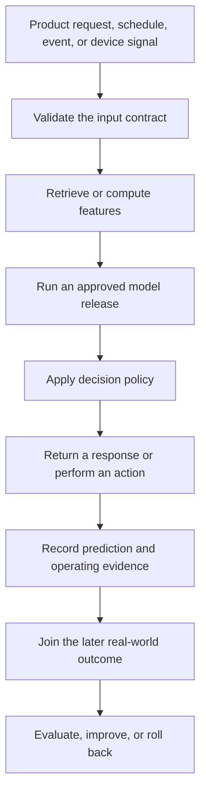
```mermaid
flowchart TD
    A["Product request, schedule, event, or device signal"] --> B["Validate the input contract"]
    B --> C["Retrieve or compute features"]
    C --> D["Run an approved model release"]
    D --> E["Apply decision policy"]
    E --> F["Return a response or perform an action"]
    F --> G["Record prediction and operating evidence"]
    G --> H["Join the later real-world outcome"]
    H --> I["Evaluate, improve, or roll back"]
```

A model usually produces a technical value: a probability, ranking score, forecast, class, or embedding. The product needs something more concrete. A payment flow may need `approve`, `verify`, or `send_to_review`. A warehouse may need tomorrow's quantity for every item. A safety controller may need a local stop signal. Prediction delivery owns the path between those two levels.

This path also explains a common source of production surprises. A service can return `200 OK` while using stale features. A batch job can finish successfully while publishing half its expected rows. An edge model can run quickly while the fleet contains several incompatible model versions. Operational success and decision correctness are separate questions, so the architecture must preserve evidence for both.

## One Delivery Path, Eight Contracts
<!-- section-summary: Eight boundary promises describe how a prediction moves through production and how the system proves what it delivered. -->

A **contract** is a clear promise at a boundary between two parts of the system. It describes what enters, what leaves, which timing rule applies, and how failure is represented. Contracts allow a data team, platform team, and product team to change their internal implementations while preserving the meaning of the prediction.

Eight contracts form the delivery path:

1. The **trigger contract** says what starts prediction and how quickly the result is needed.
2. The **input contract** defines request fields, entity keys, data types, units, timestamps, and validation rules.
3. The **feature contract** defines how production features are computed or retrieved, along with freshness and fallback rules.
4. The **release contract** identifies the evaluated model, preprocessing, dependencies, schemas, and integrity digests that move together.
5. The **decision-policy contract** maps a score to an action through thresholds, business rules, abstention, and human review.
6. The **handoff contract** defines how the product receives a complete result and what happens during delay or failure.
7. The **evidence contract** defines the identifiers, logs, metrics, and traces recorded for each execution.
8. The **outcome contract** defines how delayed ground truth joins back to the prediction and when that outcome is mature enough to evaluate.

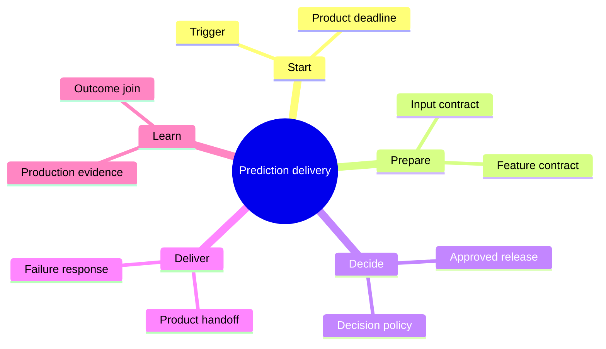
```mermaid
mindmap
  root((Prediction delivery))
    Start
      Trigger
      Product deadline
    Prepare
      Input contract
      Feature contract
    Decide
      Approved release
      Decision policy
    Deliver
      Product handoff
      Failure response
    Learn
      Production evidence
      Outcome join
```

The framework stays stable across architectures. Batch inference expresses the handoff as a governed table or file. Online inference expresses it as a low-latency response. Streaming inference expresses it as a continuously processed event. Edge inference expresses it as a local action and delayed cloud evidence. Each pattern implements the same underlying promises.

## The Trigger Sets The Product Clock
<!-- section-summary: The trigger identifies why prediction starts, while the decision deadline determines which delivery pattern can satisfy the product. -->

The trigger is the event that asks the system to make predictions. More importantly, it reveals the **decision deadline**: the latest moment at which the result still has value.

A nightly inventory forecast begins after sales and stock snapshots close. The result may arrive several hours later and still support morning planning. A card payment needs a risk decision before checkout continues, so the budget may be a fraction of a second. A vibration sensor can emit readings continuously, while an equipment alert may need to appear within seconds. A camera inside a safety system may require a local answer even during a network outage.

These scenarios produce four common triggers:

- A **schedule or data-ready event** starts a finite batch.
- A **live request** starts one online prediction or a small group of predictions.
- A **business or sensor event** enters a continuous stream.
- A **local device event** starts inference on a phone, gateway, vehicle, or embedded controller.

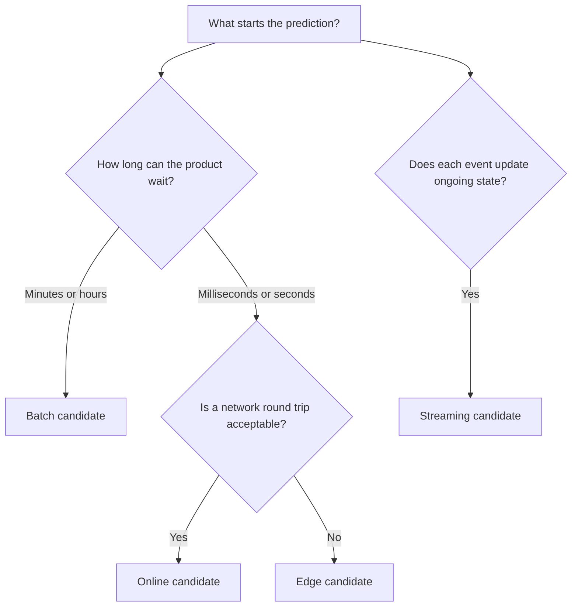
```mermaid
flowchart TD
    A["What starts the prediction?"] --> B{"How long can the product wait?"}
    B -->|"Minutes or hours"| C["Batch candidate"]
    B -->|"Milliseconds or seconds"| D{"Is a network round trip acceptable?"}
    D -->|"Yes"| E["Online candidate"]
    D -->|"No"| F["Edge candidate"]
    A --> G{"Does each event update ongoing state?"}
    G -->|"Yes"| H["Streaming candidate"]
```

The trigger narrows the platform choices, while scale and ownership complete the decision. A daily job with billions of rows needs distributed compute. A low-volume internal tool may use an ordinary API. The useful design question is: **what must be true before the product can safely use the answer?** That question exposes deadlines, data readiness, capacity, and fallback requirements before the team selects technology.

## Inputs And Features Recreate Production Reality
<!-- section-summary: Input and feature contracts preserve the entities, meaning, timing, freshness, and fallback behavior that the evaluated model expects. -->

An input contract describes the values supplied directly by the caller or source. A feature contract describes the derived values supplied to the model. In essence, these two contracts recreate the production situation that the model learned to handle.

Suppose an online fraud service receives an amount, merchant category, account identifier, and transaction time. The model may also need account age, recent transaction count, and typical spending range. The request carries the first group. A feature service or application-owned data store supplies the second. The model receives one combined feature vector.

The contract needs more than field names. It should state:

- the entity key, such as `account_id`;
- data types and units, such as an amount in minor currency units;
- event time and prediction time;
- accepted ranges and categories;
- maximum feature age;
- missing-value behavior;
- the source owner and schema version;
- the fallback used during partial data loss.

```yaml
input_schema: fraud_request_v3
entity_key: account_id
event_time: transaction_time
fields:
  amount_minor_units:
    type: integer
    minimum: 0
  merchant_category:
    type: string
features:
  recent_transaction_count:
    maximum_age: 5m
    on_missing: route_to_review
  account_age_days:
    maximum_age: 24h
    on_missing: reject_request
```

The `maximum_age` rule gives “fresh” a measurable meaning. The fallback gives missing data an explicit product effect. A quiet zero-fill could make an account with unavailable history look like an account with no recent transactions, so the contract sends that case to review instead.

Time deserves special attention. Training data contains facts collected after an event has finished. Production has access only to facts available before the decision. Batch pipelines often solve this with point-in-time joins against versioned warehouse or lakehouse data. Online paths often combine request data with a low-latency store. Feast, Databricks Feature Engineering, and managed cloud feature services can coordinate offline and online feature definitions where reuse and consistency justify the added platform. A normal database or application cache is often sufficient for a small feature set owned by one service.

## The Runtime Executes An Approved Release
<!-- section-summary: The runtime loads one immutable release unit and provides the compute, dependency environment, and serving interface needed to execute it. -->

The **model runtime** is the process that loads a release and calls its prediction function. It may live inside a scheduled job, managed endpoint, Kubernetes service, stream processor, mobile application, or edge gateway.

A production release contains more than learned weights. It usually includes preprocessing, postprocessing, a model signature, label mappings, dependency versions, and integrity information. An MLflow model signature can declare inputs, outputs, and inference parameters. An OCI image can pin the operating environment. A registry or governed catalog can bind those pieces to an immutable model version or logged-model identity.

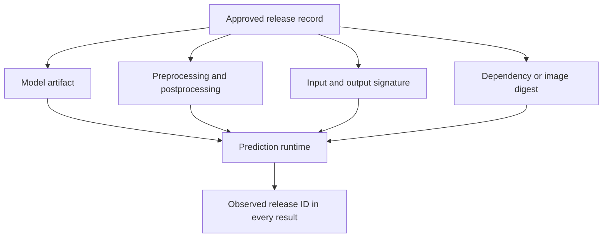
```mermaid
flowchart TD
    A["Approved release record"] --> B["Model artifact"]
    A --> C["Preprocessing and postprocessing"]
    A --> D["Input and output signature"]
    A --> E["Dependency or image digest"]
    B --> F["Prediction runtime"]
    C --> F
    D --> F
    E --> F
    F --> G["Observed release ID in every result"]
```

Imagine evaluation used a categorical encoder that maps unseen values to a reserved bucket. Production reimplements that transformation and throws an error for the same value. Both systems may load identical weights, yet they execute different prediction functions. Packaging the transformation with the release, or sharing one tested implementation, keeps evaluation and production aligned.

For most teams, a managed job or managed endpoint is the practical default because the platform handles compute provisioning, health checks, autoscaling, and access control. Amazon SageMaker AI, Vertex AI, Azure Machine Learning, and Databricks Model Serving all provide managed inference paths. An ordinary Python or JVM service can be a sensible choice for a small CPU model inside an existing application. KServe fits teams that already operate Kubernetes and need standardized model-serving resources and traffic control. Triton Inference Server fits accelerator-heavy workloads that need features such as dynamic batching or concurrent model execution. Ray Serve fits Python-native inference applications that compose several model or processing stages on Ray.

The release ID should appear in runtime health data and every prediction record. During an incident, this one field lets the team separate a bad model release from a platform-wide failure.

## Decision Policy Turns A Score Into An Action
<!-- section-summary: Decision policy combines the model output with thresholds, business constraints, safety rules, and fallback behavior to choose a product action. -->

A model output and a product decision are different things. A fraud model may return `0.82`; the checkout system needs a concrete action. A forecast may return `37.4`; the ordering system needs a permitted order quantity. A classifier may return a label; a safety process may require human confirmation before acting.

The **decision policy** is the layer that performs this translation. You can think of it as the operating rulebook around the model. It may include thresholds, legal or safety rules, account limits, confidence checks, abstention, human review, or a deterministic fallback.

```python
def choose_payment_action(score: float, feature_status: str) -> str:
    if feature_status != "fresh":
        return "send_to_review"
    if score >= 0.90:
        return "block"
    if score >= 0.65:
        return "request_verification"
    return "approve"
```

The ordering of the checks is part of the policy. Feature status comes before the score because a precise number built from stale evidence gives false confidence. Two thresholds create a middle path for uncertainty. The function returns product actions instead of model probabilities.

Policy should have its own version. A team may keep the same model and tighten a fraud threshold during a high-risk period. It may update an inventory constraint without retraining the forecast. Recording both `model_release_id` and `policy_version` preserves that distinction and makes outcome analysis meaningful.

High-impact systems also need an **abstain path**: a safe response for cases the automated decision should avoid. Examples include sending an unfamiliar application to a reviewer, asking a user for another identity check, or continuing with the last approved control setting. Abstention is part of the designed product behavior, not an unhandled exception.

## The Product Handoff Delivers A Complete Result
<!-- section-summary: The handoff contract defines the response, table, event, or local action that the consuming product can safely use. -->

The handoff is the boundary between the prediction system and the product that uses its answer. Its shape depends on the delivery pattern, yet every handoff needs a usable result, provenance, freshness, and a visible failure state.

An online API may return:

```json
{
  "prediction_id": "pred_7f3a",
  "decision": "request_verification",
  "score": 0.82,
  "model_release_id": "fraud-model@sha256:8fd2b7",
  "policy_version": "payment-risk-v6",
  "degraded": false
}
```

The product uses `decision`. The score supports explanation or review. The release and policy fields support investigation. `degraded` prevents a fallback result from looking identical to a fully informed result.

Batch delivery usually writes a staging table or object set first. Validation checks row count, expected partitions, schema, uniqueness, and freshness. A catalog pointer or view then switches atomically to the complete output. Consumers keep the previous trusted version if validation fails.

Streaming delivery publishes a prediction event with a stable event or prediction ID. Downstream consumers use that ID to deduplicate replays. Edge delivery may apply an action locally and upload evidence later, so local storage must hold the prediction until connectivity returns.

Timeouts and fallbacks belong in the handoff contract. A recommendation page may show popular items after an inference timeout. A payment flow may send the transaction to review. A safety controller may retain the last safe setting. The correct fallback comes from the product's risk model; the inference platform cannot invent it.

## Production Evidence Records What Happened
<!-- section-summary: Production evidence connects a delivered result to its trigger, data, release, policy, runtime, and failure path. -->

Production evidence answers a basic incident question: **what exactly produced this decision?** The evidence is split across purpose-specific records: traces follow one request, metrics summarize many executions, operational logs record searchable events, and governed prediction records preserve decision details.

An online request can carry an OpenTelemetry trace context through the product API, feature lookup, inference call, and policy step. Each span records the duration and result of one operation. Metrics then summarize traffic, errors, latency, saturation, fallbacks, and feature freshness across many requests.

A batch or streaming pipeline can emit lineage events. OpenLineage represents datasets, jobs, and runs with standard identities, which allows a team to connect an output table to its input snapshot and producing job. Prediction records add model-specific fields such as release ID, policy version, prediction ID, and feature status.

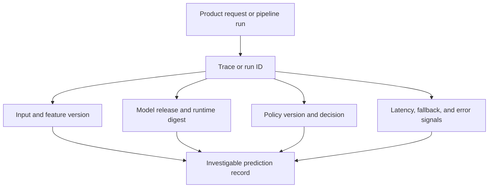
```mermaid
flowchart TD
    A["Product request or pipeline run"] --> B["Trace or run ID"]
    B --> C["Input and feature version"]
    B --> D["Model release and runtime digest"]
    B --> E["Policy version and decision"]
    B --> F["Latency, fallback, and error signals"]
    C --> G["Investigable prediction record"]
    D --> G
    E --> G
    F --> G
```

Evidence design also needs restraint. Raw customer inputs may contain personal or regulated data. High-cardinality identifiers can overwhelm a metrics system. A common design stores aggregate measurements in Prometheus-compatible or cloud-native metrics, request timing in traces, searchable operational events in logs, and restricted prediction details in a governed table. Access controls, retention, redaction, and regional rules apply to that governed record.

The goal is reproducible explanation. A team should be able to select one prediction, identify its data and release, see whether fallback occurred, and locate the relevant operating signals without copying every sensitive input into every telemetry system.

## Outcomes Close The Learning Loop
<!-- section-summary: Outcome joins connect production predictions to later ground truth so teams can measure quality, coverage, and product effect by release and policy. -->

Many predictions can be judged only after time passes. A loan application may mature into repayment history. A demand forecast can be compared with later sales. A maintenance alert can be compared with inspection findings. The **outcome contract** defines that return path.

Three details make the join trustworthy:

- A stable **join key** connects the prediction to the later outcome.
- A **maturity rule** says how long to wait before treating the outcome as final enough for evaluation.
- A **coverage measure** shows what proportion of predictions received usable outcomes.

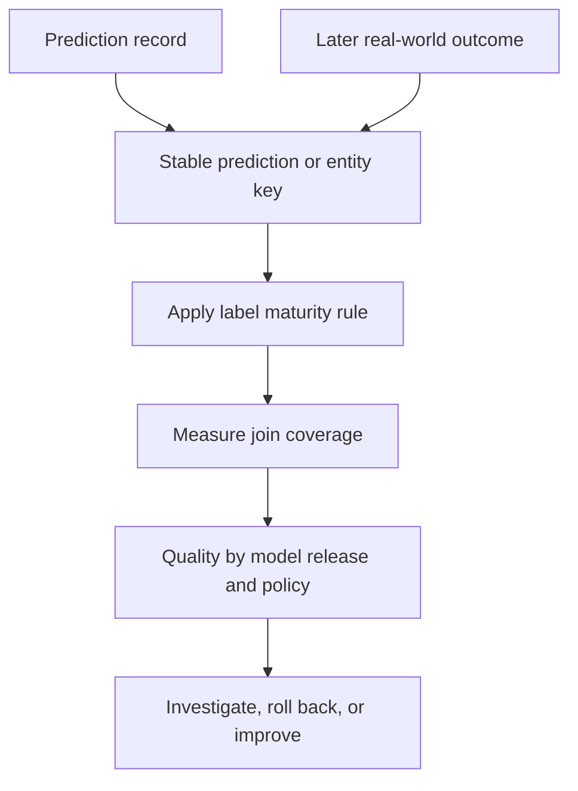
```mermaid
flowchart TD
    A["Prediction record"] --> B["Stable prediction or entity key"]
    C["Later real-world outcome"] --> B
    B --> D["Apply label maturity rule"]
    D --> E["Measure join coverage"]
    E --> F["Quality by model release and policy"]
    F --> G["Investigate, roll back, or improve"]
```

A focused quality query starts from every prediction whose outcome is due. The governed view keeps those predictions after a left join, leaving `outcome_value` empty where a usable outcome has not arrived.

```sql
SELECT
  model_release_id,
  policy_version,
  COUNT(*) AS eligible_predictions,
  COUNT(outcome_value) AS usable_outcomes,
  COUNT(outcome_value) * 1.0 / NULLIF(COUNT(*), 0) AS outcome_coverage,
  AVG(ABS(predicted_value - outcome_value))
    FILTER (WHERE outcome_value IS NOT NULL) AS mean_absolute_error
FROM governed_prediction_outcomes
WHERE label_due_at <= CURRENT_TIMESTAMP
GROUP BY model_release_id, policy_version;
```

The denominator now includes every prediction eligible for evaluation, including rows whose outcome is still missing. Coverage appears beside error because a metric calculated from a small, selective group can look healthy while missing hard cases. Teams also break results down by relevant segments such as region, device type, customer group, forecast horizon, or model route.

Outcome data has its own failure modes. Join keys can be missing, labels can arrive late, users can override an automated recommendation, and product changes can alter which cases receive labels. Monitoring should expose those conditions directly. An `insufficient_feedback` state communicates more truth than an empty quality chart.

## Batch Delivery
<!-- section-summary: Batch delivery scores a bounded dataset and publishes a complete, versioned output after data and output gates pass. -->

Batch delivery fits decisions that can wait for a scheduled or data-ready run. It is commonly used for demand forecasts, churn-risk lists, overnight document classification, portfolio scoring, and bulk data enrichment.

The input is a bounded snapshot. The job validates that snapshot, performs a point-in-time feature join, loads one approved release, scores the rows, applies policy, and writes a new output version. The product receives the output only after completeness and quality gates pass.

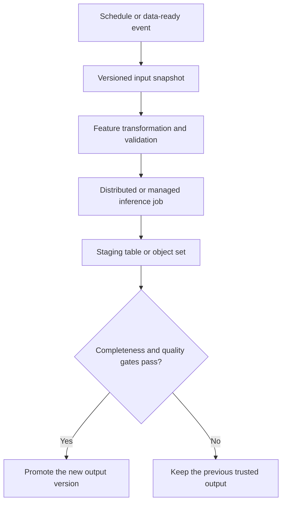
```mermaid
flowchart TD
    A["Schedule or data-ready event"] --> B["Versioned input snapshot"]
    B --> C["Feature transformation and validation"]
    C --> D["Distributed or managed inference job"]
    D --> E["Staging table or object set"]
    E --> F{"Completeness and quality gates pass?"}
    F -->|"Yes"| G["Promote the new output version"]
    F -->|"No"| H["Keep the previous trusted output"]
```

For example, an inventory system can score every product-location pair after daily sales closes. If one region's partition is missing, the promotion gate blocks the new table and planners continue using the previous complete forecast. That recovery rule protects the product from a technically successful yet incomplete run.

The industrial default is to run inference near the data. Warehouses, Spark, Databricks Jobs, SageMaker Batch Transform, Vertex AI batch prediction, and Azure Machine Learning batch endpoints all support this style. Object storage, Delta or Iceberg tables, and warehouse tables are common handoffs. Teams usually gain more from versioned inputs, idempotent writes, and atomic publication than from maintaining a permanent model server for this workload.

## Online Delivery
<!-- section-summary: Online delivery produces a decision during a live product request and therefore requires strict latency, availability, and fallback contracts. -->

Online delivery fits interactive decisions such as fraud checks, search ranking, personalization, eligibility decisions, and live anomaly scoring. A caller sends a request and waits for a response, so inference sits directly inside the user's request path.

The request passes through four distinct responsibilities. The product validates fields and identifies the entity. A feature path adds recent facts that the caller cannot supply. The runtime computes a score with an approved release. A policy step chooses the action the product should take. Separate timing and status evidence for each responsibility reveals where latency accumulated or a fallback started.

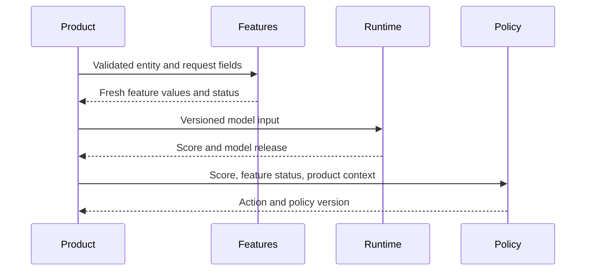
```mermaid
sequenceDiagram
    participant Product
    participant Features
    participant Runtime
    participant Policy
    Product->>Features: Validated entity and request fields
    Features-->>Product: Fresh feature values and status
    Product->>Runtime: Versioned model input
    Runtime-->>Product: Score and model release
    Product->>Policy: Score, feature status, product context
    Policy-->>Product: Action and policy version
```

Latency is a budget shared across every step. If the whole product request has 300 milliseconds, the model cannot consume all 300. Input validation, feature retrieval, network hops, policy, serialization, and response delivery need room as well. Teams track percentiles such as p95 and p99 because a fast average can hide slow experiences.

A persistent managed endpoint is a common default for predictable traffic and strict latency. Serverless inference fits intermittent traffic that can tolerate cold starts. An ordinary service can host a small model close to existing application code. SageMaker AI, Vertex AI, Azure Machine Learning, and Databricks provide managed online serving; KServe and similar platforms fit organizations that already operate Kubernetes as a product platform.

The online design needs a timeout, capacity limits, a rollout method, and a product-owned fallback. Common rollouts send a small share of traffic to the new release, compare service and decision signals, then expand or roll back. The response should always reveal which release and policy produced the action.

## Streaming Delivery
<!-- section-summary: Streaming delivery evaluates a continuous event flow while preserving event time, state, recovery progress, and duplicate-safe outputs. -->

Streaming delivery fits decisions driven by an ongoing flow of events: equipment telemetry, click streams, transaction events, network activity, or rapidly changing features. Its defining idea is continuous state. The current prediction may depend on recent events for the same entity.

A machine-monitoring stream, for example, may combine the latest vibration reading with a five-minute rolling average and the time since the previous alert. These values belong to keyed state for that machine. **Event time** records when the reading occurred at the source. **Processing time** records when the platform handled it. Watermarks provide a rule for closing windows while allowing a defined amount of late data.

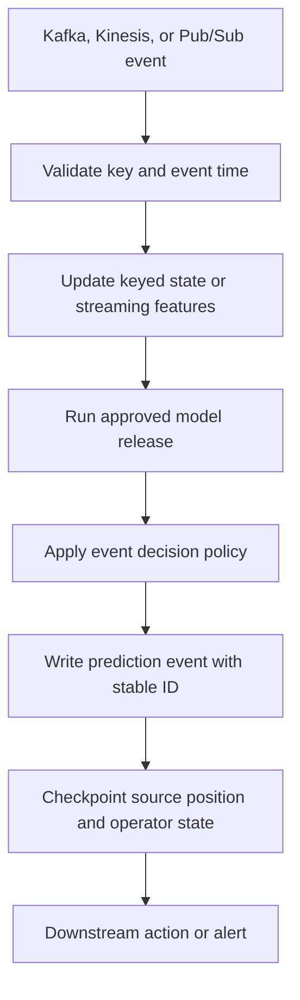
```mermaid
flowchart TD
    A["Kafka, Kinesis, or Pub/Sub event"] --> B["Validate key and event time"]
    B --> C["Update keyed state or streaming features"]
    C --> D["Run approved model release"]
    D --> E["Apply event decision policy"]
    E --> F["Write prediction event with stable ID"]
    F --> G["Checkpoint source position and operator state"]
    G --> H["Downstream action or alert"]
```

Apache Flink and Spark Structured Streaming are established processing choices. Flink checkpoints combine source positions with operator state so a failed job can restore and replay. The guarantee across the complete path still depends on the source and sink: a replayable source plus a transactional or idempotent sink is required for end-to-end exactly-once effects. Otherwise, downstream systems must tolerate duplicates through a stable event or prediction ID.

Kafka, Amazon Kinesis, and Google Cloud Pub/Sub are common durable event transports. Flink often fits lower-latency, stateful event applications. Spark Structured Streaming fits teams already using the Spark data platform and a micro-batch model. The design should state checkpoint storage, late-event policy, replay procedure, state compatibility during upgrades, and output deduplication.

## Edge Delivery
<!-- section-summary: Edge delivery runs prediction on or near the device and adds model compatibility, fleet rollout, local safety, and delayed evidence to the delivery contract. -->

Edge delivery runs inference close to where data is created. Phones, cameras, vehicles, industrial gateways, and embedded controllers use this pattern for low latency, privacy, limited connectivity, or reduced cloud bandwidth.

Consider a camera that detects a dangerous obstruction near a machine. Sending every frame to the cloud adds network delay and creates an outage dependency. A local runtime can classify the frame and trigger a safe response immediately. The cloud path can later receive sampled evidence, device health, model identity, and confirmed outcomes.

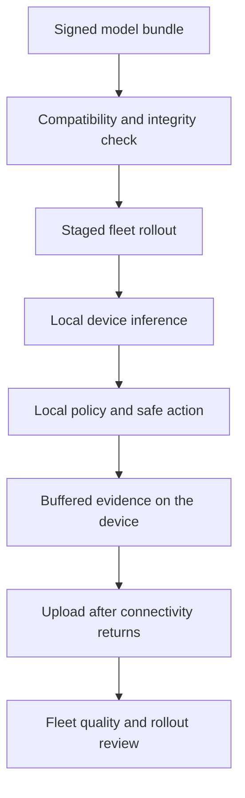
```mermaid
flowchart TD
    A["Signed model bundle"] --> B["Compatibility and integrity check"]
    B --> C["Staged fleet rollout"]
    C --> D["Local device inference"]
    D --> E["Local policy and safe action"]
    E --> F["Buffered evidence on the device"]
    F --> G["Upload after connectivity returns"]
    G --> H["Fleet quality and rollout review"]
```

The release contract expands at the edge. It includes model size, supported operators, device architecture, memory and power limits, runtime version, signature verification, and a previous compatible model. Fleet rollout replaces one centralized deployment: teams begin with test devices or a small cohort, watch crash and quality signals, then expand gradually.

LiteRT supports on-device inference across Android, iOS, and embedded environments. ONNX Runtime Mobile runs ONNX models on Android and iOS. Core ML is the native production path for Apple platforms and can use Apple CPU, GPU, and Neural Engine resources. The best choice follows the device ecosystem and model conversion results. Quantization and operator compatibility must be evaluated against quality, latency, memory, and power requirements before release.

## Choose The Pattern From The Decision
<!-- section-summary: Pattern selection starts with the product deadline, data location, state needs, failure consequence, connectivity, and operating ownership. -->

Describe the product decision in plain language before comparing platforms. Timing, data location, state, risk, connectivity, and ownership determine the first viable architecture. Six questions reveal that starting point:

1. How long can the product wait for the answer?
2. Where does the required data live, and how fresh must it be?
3. Does each prediction stand alone, or depend on recent state?
4. What should the product do during delay, missing data, or runtime failure?
5. Can the path depend on continuous network connectivity?
6. Which team will operate the runtime, evidence, and rollback path?

Use those answers to select an initial pattern, then test that pattern against capacity, security, cost, and recovery requirements.

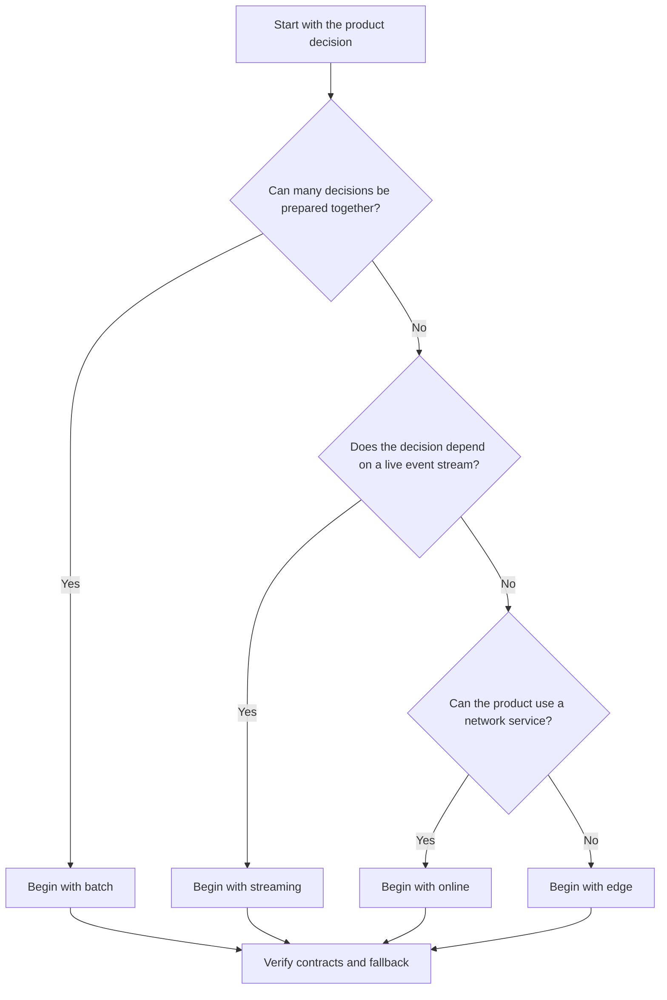
```mermaid
flowchart TD
    A["Start with the product decision"] --> B{"Can many decisions be prepared together?"}
    B -->|"Yes"| C["Begin with batch"]
    B -->|"No"| D{"Does the decision depend on a live event stream?"}
    D -->|"Yes"| E["Begin with streaming"]
    D -->|"No"| F{"Can the product use a network service?"}
    F -->|"Yes"| G["Begin with online"]
    F -->|"No"| H["Begin with edge"]
    C --> I["Verify contracts and fallback"]
    E --> I
    G --> I
    H --> I
```

Real systems often combine patterns. A recommendation system may calculate candidate items in batch and rank a small set online. A fraud platform may maintain recent behavior in a stream and call an online model during payment. An edge device may act locally and send cloud batches for monitoring. The shared contracts keep these paths understandable.

Avoid choosing streaming because the source produces events, Kubernetes because the organization owns a cluster, or a feature store because features exist. Each platform adds operational responsibilities. Start with the smallest architecture that satisfies the decision deadline, data meaning, failure policy, and evidence requirements.

## A Practical Industrial Baseline
<!-- section-summary: A current production baseline favors managed execution, governed data and releases, explicit policy, standard telemetry, and more specialized platforms only after a concrete requirement appears. -->

A practical production baseline starts with governed data in object storage containing Delta or Iceberg tables, a warehouse, or a lakehouse platform. Batch transformations commonly use SQL, dbt, Spark, or Polars according to scale. Online features can live in an application database or cache; a platform such as Feast or a managed feature service earns its operating cost after multiple models need shared, time-consistent features.

Model releases commonly use MLflow or a managed cloud registry, with model signatures and immutable artifact or image digests. Managed training jobs and managed inference endpoints reduce the first operating burden. Databricks Model Serving, SageMaker AI, Vertex AI, and Azure Machine Learning cover managed delivery paths. A Kubernetes serving layer such as KServe belongs in organizations with platform engineering capacity and a concrete need for that control.

Batch jobs should publish versioned outputs through validation and atomic promotion. Online endpoints should expose release identity, health, latency percentiles, capacity, and fallback rate. Streaming systems should use durable event transports, checkpointed state, event-time policies, and duplicate-safe sinks. Edge systems should use signed bundles, compatibility tests, staged fleet rollout, local fallback, and delayed evidence upload.

OpenTelemetry is the common foundation for traces, metrics, and logs across request paths. OpenLineage provides interoperable job, run, and dataset identities for data-oriented paths. Cloud-native monitoring or Prometheus-compatible metrics can operate the service. A governed prediction table can preserve model, policy, feature, and outcome evidence under appropriate access and retention controls.

These choices are defaults, not a shopping list. A small batch model may need a scheduled container, a versioned table, MLflow, and cloud monitoring. Each extra platform should solve a named scale, reuse, governance, latency, or ownership problem.

## The Main Idea
<!-- section-summary: Reliable prediction delivery preserves one understandable chain from trigger and data to release, policy, action, evidence, and outcome. -->

Prediction delivery turns a model into a dependable product capability. The trigger sets the decision clock. Input and feature contracts recreate the information available at that moment. The runtime executes an approved release. Decision policy converts the model output into an action. The handoff gives the product a complete result and a safe failure path. Evidence and outcomes show what the system delivered and whether it worked.

Batch, online, streaming, and edge are different implementations of this same chain. A sound architecture can follow one prediction through every boundary and answer seven practical questions: what started it, which data it used, which release ran, which policy acted, what the product received, what happened during execution, and which real-world outcome followed.

## References

- [MLflow: Model signatures and input examples](https://mlflow.org/docs/latest/ml/model/signatures/) - Defines model input, output, and parameter signatures.
- [Feast: Architecture overview](https://docs.feast.dev/getting-started/architecture/overview) - Describes offline and online feature paths.
- [Amazon SageMaker AI: Inference options](https://docs.aws.amazon.com/sagemaker/latest/dg/deploy-model-options.html) - Compares real-time, serverless, asynchronous, and batch inference.
- [Databricks: Model Serving](https://docs.databricks.com/aws/en/machine-learning/model-serving) - Documents managed real-time and batch inference paths.
- [Vertex AI: Online predictions](https://docs.cloud.google.com/vertex-ai/docs/predictions/get-online-predictions) - Documents managed online prediction requests and endpoints.
- [KServe: Predictive inference frameworks](https://kserve.github.io/website/docs/model-serving/predictive-inference/frameworks/overview) - Describes Kubernetes-native runtimes and serving capabilities.
- [OpenTelemetry: Context propagation](https://opentelemetry.io/docs/concepts/context-propagation/) - Defines trace-context propagation across service boundaries.
- [OpenLineage: Core model](https://openlineage.io/docs/) - Defines interoperable dataset, job, and run identities.
- [Apache Flink: Stateful stream processing](https://nightlies.apache.org/flink/flink-docs-stable/docs/concepts/stateful-stream-processing/) - Explains state, replay, checkpoints, and recovery semantics.
- [Apache Flink: Timely stream processing](https://nightlies.apache.org/flink/flink-docs-stable/docs/concepts/time/) - Explains event time, watermarks, windows, and late events.
- [Apache Spark: Structured Streaming](https://spark.apache.org/docs/latest/streaming/index.html) - Documents the current DataFrame-based streaming engine.
- [Google AI Edge: LiteRT](https://developers.google.com/edge/litert) - Documents the current Google runtime and deployment paths for on-device inference.
- [ONNX Runtime: Mobile](https://onnxruntime.ai/docs/get-started/with-mobile.html) - Documents mobile inference on Android and iOS.
- [Apple: Core ML](https://developer.apple.com/documentation/CoreML) - Documents on-device model integration and device compute support.
