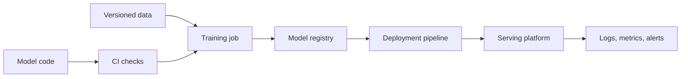

## Table of Contents

1. [The Team Around One Model](#the-team-around-one-model)
2. [Product And Domain Owners](#product-and-domain-owners)
3. [Data Owners](#data-owners)
4. [Data Scientists And ML Engineers](#data-scientists-and-ml-engineers)
5. [Platform And Infrastructure Owners](#platform-and-infrastructure-owners)
6. [Risk, Security, And Operations](#risk-security-and-operations)
7. [Handoffs That Need Written Evidence](#handoffs-that-need-written-evidence)
8. [Putting It All Together](#putting-it-all-together)
9. [What's Next](#whats-next)

## The Team Around One Model
<!-- section-summary: MLOps roles make production model work visible by naming who owns the product decision, data, training, release, infrastructure, monitoring, and incident response. -->

The previous article walked through the MLOps lifecycle. A model starts with a product decision, moves through data, training, evaluation, registration, release, monitoring, and feedback. That loop sounds tidy on a diagram, but real production work has people at every step. If nobody owns a step, the system still runs for a while, then the first serious incident exposes the gap.

Let's use **CareBridge Health** and its patient readmission outreach model. Every morning, the care coordination team receives a list of recently discharged patients who may need follow-up. The model helps prioritize nurse calls, pharmacy checks, and appointment reminders. The model affects patients, clinical teams, operations, privacy, and resource planning, so several roles need to work together.

**MLOps roles** are the recurring responsibilities around production machine learning. The same person can hold more than one role in a small company. A large company may split one role across several teams. The important part is ownership. The team should know who defines the decision, who owns the data, who trains the candidate, who approves release, who runs the platform, and who responds when production signals look wrong.

Here is the short map for the readmission outreach model.

| Responsibility | Main question | Common owner |
|---|---|---|
| Product decision | What should the care workflow do with the score? | Product owner, clinical domain owner |
| Data quality | Can the training and serving data be trusted? | Data engineer, data owner |
| Model development | Does the candidate model improve the decision? | Data scientist, ML engineer |
| Production path | Can the model run safely and repeatably? | ML engineer, platform engineer |
| Release approval | Does the evidence justify rollout? | Product, risk, ML, operations |
| Monitoring | What signals show service health and model health? | ML, platform, operations |
| Incident response | Who can stop, roll back, or change the model? | On-call owner, release owner |

This article follows those owners through one model. The useful part is the handoff map: who defines the business question, who trains, who reviews, who ships, who watches production, and who can approve a risky change.


*The ownership map shows how product, data, ML, platform, risk, and operations responsibilities all connect to one production model.*

## Product And Domain Owners
<!-- section-summary: Product and domain owners define the decision the model supports, the cost of mistakes, and the rules for acceptable product behavior. -->

The first role is the **product owner** or **domain owner**. This person or team defines what the model is for. For the CareBridge readmission model, the product decision is clear: which discharged patients should receive extra outreach today. The model score only matters because the care coordination workflow uses it to prioritize limited staff time.

A domain owner knows the real-world consequences. A clinical operations lead can explain why early follow-up matters, why too many false alerts overwhelm nurses, why some discharge types need special review, and why patient contact preferences matter. Without that context, a model team can optimize a metric that looks strong in a notebook and still hurt the workflow.

The product owner should write the release brief with the ML team. A short brief can define the target, primary metric, guardrails, and rollout limits. For example, CareBridge may say the model should improve recall for patients who need follow-up while keeping the daily outreach list inside the staffing budget and requiring clinical review before changing patient-facing actions.

```yaml
model_name: readmission-outreach-priority
product_decision: prioritize recently discharged patients for follow-up outreach
primary_metric: recall_at_200_daily_outreach_slots
guardrails:
  nurse_review_volume: maximum 200 patients per day
  missed_high_risk_segment_rate: no increase for major discharge groups
  p95_batch_completion_time: available by 06:30 local time
release_owner: care-coordination-product
```

This small record gives everyone a shared target. The data scientist knows what to optimize. The ML engineer knows the run deadline. The platform engineer knows this model needs a reliable morning batch path. The risk owner knows which patient-safety and operations limits should block release.

## Data Owners
<!-- section-summary: Data owners make sure training examples, labels, features, and serving inputs have clear definitions, freshness, quality checks, and lineage. -->

After the product decision comes data. A **data owner** owns the meaning and reliability of the data a model uses. This role often sits with a data engineering team, analytics engineering team, feature platform team, or the product team that creates the source events.

For CareBridge, the model needs discharge events, appointment history, medication changes, prior visits, diagnosis groups, care-team notes converted into approved structured fields, outreach attempts, and readmission outcomes. Each field has a definition. A field like `readmitted_at` has a special timing problem because it arrives after the original outreach decision. If the training pipeline uses it as an input, the model can look excellent in evaluation and fail in production.

The data owner helps answer practical questions. Which table is the source of truth for discharges? Which timestamp represents the outreach decision time? How late do readmission labels arrive? Which clinics have incomplete outreach notes? Which upstream team can change a field without warning?

A useful data contract can look like this.

```yaml
dataset: discharge_outreach_examples
owner: clinical-data-platform
freshness_sla: available by 03:00 UTC daily
decision_time_column: discharge_completed_at
label_column: readmitted_within_30_days
required_checks:
  - schema_columns
  - null_limits
  - allowed_facility_codes
  - label_delay_report
  - no_post_decision_features
```

The data owner does not need to build the whole model. Their job is to make the model's input world understandable and reliable. When the readmission model starts flagging too many patients from one facility, the data owner can help check whether a field changed, a pipeline fell behind, or a label source shifted.

## Data Scientists And ML Engineers
<!-- section-summary: Data scientists and ML engineers turn product goals and data into candidate models, evaluation reports, reproducible runs, and production-ready artifacts. -->

The **data scientist** usually explores the problem, tests features, trains candidate models, studies metrics, and explains model behavior. The **ML engineer** often turns that work into repeatable training jobs, evaluation pipelines, model packaging, and serving code. In many teams, one person does both. The split matters less than the outcome: the model should move from exploration into a repeatable production path.

For CareBridge, a data scientist may discover that previous admissions, medication changes, missed appointments, discharge timing, and follow-up history improve outreach prioritization. The data scientist compares candidate models, checks precision and recall at the daily outreach limit, studies segment results, and explains where the candidate gains or loses compared with production.

The ML engineer then makes the work repeatable. The notebook logic moves into version-controlled code. The feature list moves into config. The training run records its data snapshot, container image, package versions, model artifact, and metrics. The evaluation report uses the same approved test windows each time.

```yaml
run_id: readmission-outreach-2026-07-04-0915
code_commit: 7d83a14
data_snapshot: s3://carebridge-ml-data/readmission/2026-06-30/
training_image: ghcr.io/carebridge/readmission-training:2026-07-04
artifact_uri: s3://carebridge-ml-models/readmission-outreach/v18/model.pkl
evaluation_report: s3://carebridge-ml-reports/readmission-outreach/v18.yml
```

This record gives the next person enough information to reproduce the run, review the candidate, or debug a production issue. It also separates two important ideas: a candidate model can be interesting, and a production model needs evidence.

## Platform And Infrastructure Owners
<!-- section-summary: Platform and infrastructure owners provide the shared systems for jobs, registries, CI/CD, serving, secrets, monitoring, and runtime reliability. -->

Once a model has a repeatable path, the team needs infrastructure. The **platform engineer** or **ML platform owner** provides the shared pieces that let models train, register, deploy, and run without each project building everything from scratch.

For the readmission model, platform work may include a workflow runner for training and batch scoring jobs, object storage for datasets and artifacts, a model registry, CI/CD pipelines, a container registry, a managed batch compute environment, secrets management, logs, metrics, and alert routing. The model depends on these systems every day.

Platform owners help define standard paths. A team should know where model artifacts live, how a model version receives approval, how deployment picks a version, how rollbacks work, and where prediction logs go. This keeps each model team from inventing a private release process.



The platform owner also protects shared reliability. A morning batch model with a strict handoff time needs runtime limits, retry rules, fallback behavior, and clear alerts. A training job that uses larger compute needs quota controls and cost visibility. A registry needs access controls because model versions can affect production decisions.

## Risk, Security, And Operations
<!-- section-summary: Risk, security, and operations owners review model behavior, data access, release risk, and incident response before and after deployment. -->

Some models need review beyond the ML team. Fraud, credit, hiring, healthcare, security, and safety systems often touch policy, compliance, customer trust, or legal requirements. CareBridge's outreach model can change how staff spend time with patients, so clinical risk, privacy, security, and operations teams need a voice in release decisions.

The **risk owner** helps define acceptable model behavior. They may ask for segment checks, manual review limits, audit trails, approval records, and a clear reason for each production threshold. The **security owner** checks data access, secrets, artifact permissions, dependency risk, and environment separation. The **operations owner** cares about runbooks, alerts, rollback steps, and customer support impact.

A release gate can bring these owners into one review.

```yaml
release_gate: readmission-outreach-v18-shadow
required_approvals:
  - readmission-ml-owner
  - care-coordination-product
  - clinical-operations-reviewer
  - ml-platform-oncall
  - security-reviewer
evidence:
  - evaluation_report
  - segment_report
  - model_card
  - rollback_plan
  - monitoring_dashboard
```

Review depth should match release risk. A low-risk internal recommendation model may need a lighter path than a patient outreach model that can change clinical workload. The practical rule is direct: the review should match the harm a bad model can cause and the difficulty of detecting that harm after release. NIST's AI Risk Management Framework and model-card practices both point in this direction: record intended use, risk, evaluation evidence, limitations, and accountable owners.

## Handoffs That Need Written Evidence
<!-- section-summary: The most important MLOps handoffs need written evidence so teams can review, deploy, debug, and roll back a model without relying on memory. -->

MLOps work fails most often at handoffs. A data scientist hands a model file to an engineer. A data engineer changes a feature table. A platform team deploys a container without knowing the model's input contract. A risk reviewer approves a model without seeing segment results. An on-call engineer receives an alert without a rollback plan.

Written evidence keeps those handoffs clear. The evidence does not need to be fancy. It needs to answer the question the next role will ask.

| Handoff | Evidence that helps |
|---|---|
| Product to ML | Release brief, target definition, metric and guardrail list |
| Data to ML | Dataset contract, label definition, freshness report, lineage |
| ML to platform | Model artifact, runtime dependencies, input schema, latency budget |
| ML to risk | Evaluation report, segment checks, known limitations |
| Platform to operations | Deployment plan, dashboards, alerts, rollback command |
| Operations to ML | Incident timeline, prediction samples, drift and label evidence |

For CareBridge, the strongest team habit is simple: every model version should have a release packet. The packet should connect the product decision, data version, training run, evaluation report, approval, deployment state, monitoring links, and rollback target. The packet gives each role a shared place to work from.


*The release packet visual gathers the evidence each role needs before the model moves from review into operation.*

## Putting It All Together
<!-- section-summary: A production model works best when each role knows its ownership, its handoff, and the evidence it must leave for the next team. -->

The readmission outreach model shows why MLOps roles matter. Product and clinical owners define the workflow and guardrails. Data owners protect the examples and labels. Data scientists and ML engineers create candidate models and evidence. Platform owners provide the systems that run training, release, serving, and monitoring. Risk, security, privacy, and operations owners make sure the release path matches the model's impact.

The same company can organize these responsibilities in many ways. A startup may have one ML engineer covering data, model, and deployment. A bank may have separate teams for data, modeling, validation, platform, risk, and operations. The structure can change, but the responsibilities still exist.

Use one question to check role clarity: if model version `v18` hurts production tomorrow, who can explain the decision, inspect the data, compare the model, roll back the serving path, and write the follow-up work? When the team can answer that without guessing, the MLOps workflow has a much stronger foundation.


*The incident summary turns role clarity into concrete actions: explain the decision, inspect data, compare the model, roll back, and record the follow-up.*

## What's Next
<!-- section-summary: The next article follows one notebook model through the practical steps that turn it into a production release. -->

Now that the roles are clear, the next article follows the workflow from notebook to production. We will take one model from exploratory code into reviewed training code, packaged artifacts, validation, release, monitoring, and feedback.

## References

- [Google Cloud: MLOps continuous delivery and automation pipelines in machine learning](https://docs.cloud.google.com/architecture/mlops-continuous-delivery-and-automation-pipelines-in-machine-learning) - Describes ML pipeline responsibilities across data validation, model validation, deployment, and monitoring.
- [Microsoft Learn: MLOps maturity model](https://learn.microsoft.com/en-us/azure/architecture/ai-ml/guide/mlops-maturity-model) - Shows how teams progress from manual work toward repeatable pipelines, traceability, monitoring, and governance.
- [AWS SageMaker AI: MLOps project management](https://docs.aws.amazon.com/sagemaker/latest/dg/sagemaker-projects.html) - Explains how SageMaker Projects connect templates, CI/CD, and model development workflows.
- [NIST AI Risk Management Framework](https://www.nist.gov/itl/ai-risk-management-framework) - Provides a governance-oriented reference for managing AI risks across roles and lifecycle stages.
- [AWS SageMaker AI: Model Cards](https://docs.aws.amazon.com/sagemaker/latest/dg/model-cards.html) - Documents model cards for intended use, risk ratings, training details, evaluation results, and audit support.
