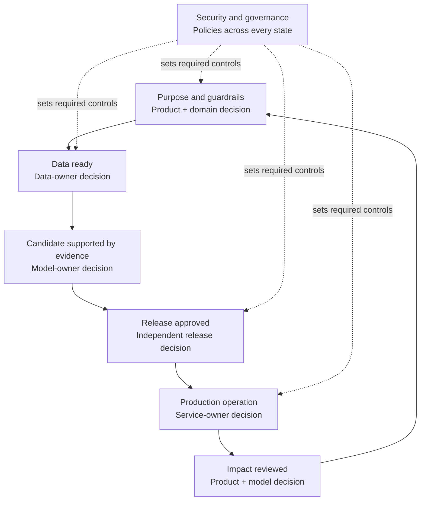
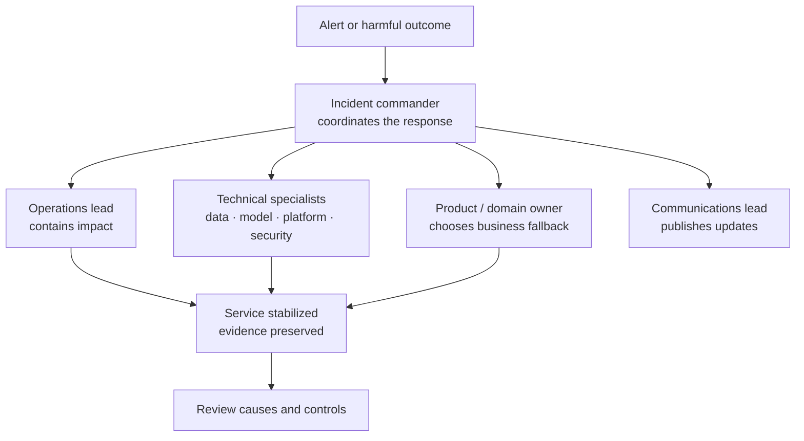

## Table of Contents

1. [Why One Model Needs Several Kinds of Ownership](#why-one-model-needs-several-kinds-of-ownership)
2. [Assign An Owner To Each ML Decision](#assign-an-owner-to-each-ml-decision)
3. [Understand The Four Main Areas Of ML Ownership](#understand-the-four-main-areas-of-ml-ownership)
4. [Assign Review And Approval Rights For Sensitive Changes](#assign-review-and-approval-rights-for-sensitive-changes)
5. [Pass The Information The Next Team Needs](#pass-the-information-the-next-team-needs)
6. [Assign One Person To Coordinate An Incident](#assign-one-person-to-coordinate-an-incident)
7. [Combine Roles in a Small Team](#combine-roles-in-a-small-team)
8. [Separate Roles in a Large Organization](#separate-roles-in-a-large-organization)
9. [Enforce Ownership Through Repositories, Identities, And Release Controls](#enforce-ownership-through-repositories-identities-and-release-controls)
10. [How The Ownership Model Fits Together](#how-the-ownership-model-fits-together)
11. [References](#references)

## Why One Model Needs Several Kinds of Ownership
<!-- section-summary: Production ML needs several kinds of ownership because the model changes a real decision, depends on changing data, runs as software, and can create risks beyond model accuracy. -->

Imagine that a payment-risk model starts sending fewer payments to manual review. The API is healthy, latency is normal, and the latest deployment completed successfully. The product team sees lower review costs. The model team sees a stable accuracy estimate. A domain specialist then discovers that one customer group has almost disappeared from the manual-review queue.

Who can decide whether the system should keep running? The engineer who deployed it can change traffic, although they may lack the authority to accept the product risk. The data scientist can explain the evaluation, although they may not know whether the new review rate is operationally acceptable. The domain specialist understands the consequence, although they may not know how to restore the previous model.

This is why production ML needs explicit roles. A **role** is a bundle of responsibilities and decision rights. A **decision right** states who can make a particular call. That call might accept a dataset, nominate a model candidate, approve a release, or switch production to a fallback. Job titles are only one way to assign those roles. One person may wear several hats in a small team, while a large organization may split one responsibility across several teams.

Four facts create the need for this structure:

- the model supports a product or operational decision that has a real-world consequence;
- its behavior depends on data produced by other systems and people;
- its training and serving paths require production engineering;
- its use may introduce security, privacy, safety, fairness, or compliance risk.

The MLOps team therefore owns more than a model file. It owns a chain of decisions supported by evidence. Three questions reveal the real structure: “Who can make each decision?”, “What evidence do they need?”, and “Who acts if the result is harmful?”

## Assign An Owner To Each ML Decision
<!-- section-summary: A decision-rights map connects each lifecycle transition to an accountable role, the evidence that role reviews, and the action that role can authorize. -->

Every major ML decision needs a named owner. The lifecycle starts with defining
the model's purpose and preparing its data. Training then produces candidates
for evaluation. Release owners approve production use. Operations owners run
the active version and handle repair or retirement. Each transition accepts a
different kind of risk, so its owner needs authority to approve, block, or
reverse the change.

You can think of a decision-rights map as the human control plane around that lifecycle. The technical pipeline may train and test a model automatically. The control plane says which evidence counts, who may approve the next state, and which actions remain available after release.


```mermaid

flowchart TB
    Purpose["Purpose and guardrails<br/>Product + domain decision"]
    Data["Data ready<br/>Data-owner decision"]
    Candidate["Candidate supported by evidence<br/>Model-owner decision"]
    Release["Release approved<br/>Independent release decision"]
    Active["Production operation<br/>Service-owner decision"]
    Feedback["Impact reviewed<br/>Product + model decision"]
    Govern["Security and governance<br/>Policies across every state"]

    Purpose --> Data --> Candidate --> Release --> Active --> Feedback --> Purpose
    Govern -. "sets required controls" .-> Purpose & Data
    Govern -. "sets required controls" .-> Release & Active

    class Purpose,Data,Candidate,Release,Active,Feedback lifecycle
    class Govern control
```

Responsibility moves with the model while the teams continue collaborating. The data owner remains relevant after training because a production issue may originate in the input pipeline. The model owner remains relevant after deployment because service telemetry alone cannot explain a quality change. Product and domain owners remain relevant because only they can judge whether the decision still helps the people and process it was designed for.

Three fields make a decision right concrete:

```yaml
decision: approve a candidate for limited production traffic
accountable_role: release approver
required_evidence:
  - evaluation against the current baseline
  - important segment results
  - security and data-policy checks
  - rollout limits and rollback target
permitted_action: start the approved canary stage
```

The accountable role owns the call. Contributors prepare evidence, reviewers challenge it, and operators execute the approved action. Writing these distinctions down prevents a common failure: everybody participates, yet nobody knows who has final authority.

## Understand The Four Main Areas Of ML Ownership
<!-- section-summary: Product, data, model, and production responsibilities create different evidence because each one answers a different question about the same ML system. -->

ML delivery usually divides ownership across four areas: product, data, model development, and production operation. An organization can assign each area to one person or distribute it across several teams. The same person may cover two or three areas, while each decision still needs a visible owner.

### Product And Domain Owners Decide What The Model Should Do

Product and domain owners decide which outcome the model should improve and how its output may be used. The domain owner brings knowledge of the real process: which mistakes matter, which groups need separate attention, and which fallback is acceptable. Sometimes one person holds both roles. In safety-sensitive work, a domain expert may have authority that the product team cannot replace.

Suppose a risk score originally helps an analyst order a review queue. A later proposal would automatically block every case above a threshold. The model may be unchanged, but the product decision has changed sharply. Product and domain owners must redefine the intended use, acceptable errors, human oversight, and appeal path before the team treats the existing evaluation as release evidence.

Their main artifact is a short decision contract. It names the user, the action influenced by the output, the success measure, the guardrails, and the human fallback. The contract protects the team from optimizing an attractive metric that diverges from the real decision.

### Data Owners Decide Whether The Data Is Ready

Data owners decide whether a dataset is suitable for a specific model use. They are accountable for its meaning, origin, quality, access, and expected delivery. A data engineer may implement pipelines and tests, while a source-system owner may control the event that creates a field. Both can contribute, but the decision right must still say who can certify the dataset.

Consider an identifier migration that lowers the join rate between predictions and later outcomes from 96% to 61%. A training job could still finish and produce a model. The data owner should hold the dataset because the missing outcomes may be concentrated in one channel or region. The repair includes restoring the join, measuring coverage by segment, and producing a fresh snapshot. Retraining before those checks would turn a data problem into misleading model evidence.

Data ownership also extends to **lineage**, the recorded path from a source through transformations to a dataset or feature. A catalog such as Unity Catalog, a warehouse catalog, or an OpenLineage-compatible system can record that path. The catalog helps locate dependencies. Accountable people still decide whether the data is suitable for the product decision.

### Data Scientists And ML Engineers Build And Evaluate Models

Data scientists and ML engineers usually share responsibility for building and evaluating models. Data scientists explore the problem, design evaluations, compare candidates, examine important segments, and explain limitations. ML engineers turn that reasoning into reviewed training code, repeatable jobs, tested feature logic, versioned artifacts, and deployable interfaces. Many teams combine these skills in one role.

The model owner may nominate a candidate because it improves the agreed objective and stays inside the guardrails. Nomination is different from release approval. The person who built the candidate is well placed to explain it, yet that closeness can make independent challenge valuable for high-impact systems.

A realistic evaluation includes more than one summary score. If a fraud candidate improves average recall but doubles false positives for a small-business segment, the model owner should surface that result and explain the threshold tradeoff. The product owner assesses customer impact, the domain owner checks whether the segment behavior makes sense, and the release authority decides whether the evidence supports deployment.

### Service And Platform Owners Keep The System Running

Service and platform owners keep the training and prediction paths running. Their responsibilities include training infrastructure, model packaging, deployment automation, serving, observability, capacity, rollback, and on-call response. Depending on the organization, ML engineers, platform engineers, site reliability engineers (SREs), or application teams may share this work.

The platform team should provide a **paved road**: a supported route for routine model delivery. It combines standard job templates and registries with identity controls, deployment stages, telemetry, and rollback actions. Teams can leave that route for a valid reason, but they then own the additional operational burden.

Suppose an online model needs a new GPU runtime. The platform owner verifies that its images come from an approved source and that enough capacity is available. Load tests then reveal its scaling behavior and fallback compatibility. The model owner compares predictions from the old and new runtimes. Both responsibilities matter because a numerically valid model can still fail through memory pressure, queueing, dependency mismatch, or an incompatible request schema.

## Assign Review And Approval Rights For Sensitive Changes
<!-- section-summary: Security and governance set cross-cutting boundaries, while release approval makes an explicit decision about the evidence and residual risk for one change. -->

Sensitive ML changes need explicit review and approval rights. Security and
governance roles review these changes and can approve, block, or investigate
them. Security controls access to sensitive data and training code. It also
controls model registration, deployment, and production traffic. Governance
checks the system's purpose,
limitations, oversight, supporting records, and risk-based review path.
Together, these roles set the boundaries for model and platform teams.

In plain terms, these roles define the boundaries inside which the other teams work. **Least privilege** gives each person or workload only the access needed for its job. **Separation of duties** prevents one sensitive action from being created, approved, and executed by the same unchecked identity.

Those principles should appear in the delivery system. A repository can route review through `CODEOWNERS`, branch rules can require passing checks and owner approval, and a protected deployment environment can require another person to approve the production job. Identity and access management (IAM) or role-based access control (RBAC) should separate development, validation, and production permissions.

```text
# .github/CODEOWNERS
/data-contracts/  @data-platform
/training/        @model-team
/deployment/      @ml-platform @security-engineering
/policies/        @ai-governance
```

This file routes technical review to people with the relevant context. It is only effective if repository rules require the review and restrict bypasses. Production approval should also check the model evidence, because a code owner can confirm the deployment code and still lack authority to accept a model's product risk.

The **release approver** owns that final release decision. For a low-impact internal model, this may be the product owner plus the service owner. A high-impact or regulated system may add an independent model-validation group and a risk committee. Privacy or legal specialists may also review the change. A named business executive may hold the final risk authority. NIST's AI Risk Management Framework recommends documented accountability and multidisciplinary perspectives, with executive responsibility for AI risk decisions.

Review depth should follow the possible harm and the difficulty of detecting it. A reversible ranking experiment with strong monitoring can use a lighter path. An automated eligibility decision deserves stronger validation, human oversight, access control, and appeal planning. Each review path should match the decision and its residual risk.

## Pass The Information The Next Team Needs
<!-- section-summary: A handoff succeeds when the next role receives the context, evidence, authority, and fallback needed to make its decision without reconstructing the work from memory. -->

When responsibility moves to another person or team, the recipient needs the artifact, its context, and the decision being requested. This transfer is a **handoff**. A strong handoff uses a small decision packet so the recipient does not have to reconstruct the surrounding reasoning.

You can think of the packet as the receipt for one proposed change. It connects the product purpose to the exact data, code, model, evaluation, approval, rollout, and fallback under review. Links are usually better than copied reports because the source systems remain authoritative.

```yaml
release_candidate: churn-model-v42
decision:
  intended_use: prioritize retention offers for human review
  owner: retention-product
evidence:
  training_run: mlflow-run-8f31
  data_snapshot: customer-features@approved-snapshot-1842
  evaluation_report: reports/churn-v42
  known_limitation: sparse history for newly launched regions
review:
  data_owner: approved
  model_validator: approved_with_canary_limit
  security_checks: passed
rollout:
  first_stage: 5_percent_traffic
  stop_rule: complaint_rate_above_reviewed_limit
  fallback: churn-model-v41
operations:
  service_owner: decision-platform
  dashboard: dashboards/churn-production
  runbook: runbooks/churn-model
```

The product-to-model handoff contributes intended use and guardrails. The data-to-model handoff contributes a versioned snapshot, quality results, label timing, and lineage. The model-to-review handoff contributes the candidate, baseline comparison, segment results, limitations, and reproducibility record. The review-to-operations handoff contributes approval, rollout limits, monitoring links, and fallback.

This packet also improves failure analysis. If production behavior changes, the incident team can identify the active model, the data behind it, the policy version that approved it, and the last safe fallback. Without those links, responders spend the first part of an incident rebuilding history.

Industrial platforms can hold different pieces of the packet. MLflow records the training run, metrics, artifact, and model version. Its tags and aliases add review or routing information. A data catalog records ownership and lineage, while Git and CI/CD record reviewed code and deployments. An incident system records alerts and response. A stable release identifier connects those systems.

## Assign One Person To Coordinate An Incident
<!-- section-summary: Incident response needs one coordinator, clear mitigation authority, technical specialists, communication ownership, and a product or domain owner who can judge business impact. -->

An incident needs one person to coordinate the response while technical teams investigate in parallel. This incident coordinator organizes containment, diagnosis, communication, and recovery under time pressure. Normal build owners continue to provide the technical expertise for their systems.

An **incident commander** directs the response. They set priorities and assign work on a shared timeline. They also decide which questions need immediate answers.

An operations lead coordinates technical mitigation, while a communications lead keeps users and stakeholders informed. Specialists divide the investigation across data behavior, model behavior, platform health, security, and domain impact.

Google’s SRE guidance uses this command structure because a response can lose control if coordination, communication, and operational work compete for one person’s attention. Each lead can concentrate on one responsibility while the commander keeps the work aligned.


```mermaid

flowchart TB
    Alert["Alert or harmful outcome"]
    IC["Incident commander<br/>coordinates the response"]
    Ops["Operations lead<br/>contains impact"]
    Experts["Technical specialists<br/>data · model · platform · security"]
    Domain["Product / domain owner<br/>chooses business fallback"]
    Comms["Communications lead<br/>publishes updates"]
    Stable["Service stabilized<br/>evidence preserved"]
    Learn["Review causes and controls"]

    Alert --> IC
    IC --> Ops & Experts & Domain & Comms
    Ops & Experts & Domain --> Stable --> Learn

    class IC,Comms command
    class Alert,Ops,Experts,Stable,Learn action
    class Domain business
```

Consider an endpoint that still returns `200 OK`, while the approval rate for one region falls by half. The service owner confirms that latency and errors are normal. The data owner finds that a source update mapped an important category to `unknown`. The model owner shows that scores dropped for rows with that value. The product owner switches the affected region to manual review, and operations rolls traffic back to the last compatible feature and model release.

The incident commander keeps these actions in one response. Strong coordination matters more in this role than deep expertise in every data and model detail. Their responsibility is to keep containment ahead of curiosity, ensure that somebody owns each investigation, and confirm that the fallback restored the user-facing outcome.

A **runbook** is the short operational guide responders follow. For an ML service, it should identify the active release, recent data changes, feature freshness, model and policy versions, service telemetry, prediction distribution, delayed outcome health, business fallback, rollback action, and escalation owners. A post-incident review should then improve the control that failed: a data contract, release check, monitor, permission boundary, or runbook step.

## Combine Roles in a Small Team
<!-- section-summary: A small team can combine several roles in one person, provided that decision rights, evidence, access, and independent review remain visible. -->

Small teams rarely have a separate employee for every responsibility. One engineer may prepare data, train the model, package the service, and carry the on-call phone. The same person can carry several responsibility domains as long as each decision remains explicit.

The team still needs to distinguish the hats. The person building a candidate records the evaluation as the model owner. The same person may execute the deployment as service owner. A product or domain owner accepts the product change. For a higher-risk release, another qualified person reviews the evidence and production deployment.

A three-person team might assign responsibilities like this:

- a product and domain lead owns intended use, guardrails, user impact, and the business fallback;
- an ML engineer owns data checks, training, evaluation, packaging, and model diagnosis;
- a platform-minded engineer owns CI/CD, runtime reliability, access, observability, and incident coordination.

External security or privacy specialists can review material changes, even if they are shared across several teams. Protected deployment environments can prevent self-approval. Managed training, registry, and serving services can reduce the amount of infrastructure this team must operate.

The practical test is continuity. Another person should be able to identify the current release, inspect its evidence, trigger the fallback, and contact the correct decision owner. If all of that knowledge exists only in one engineer’s memory, the roles have been combined too tightly.

## Separate Roles in a Large Organization
<!-- section-summary: Larger organizations separate responsibilities to gain specialization, independent challenge, reusable platforms, and clearer risk control without turning every handoff into a ticket queue. -->

Larger organizations usually split the same responsibility map across domain teams and shared teams. A domain-aligned ML team may own one product decision from data requirements through model monitoring. A data platform team provides governed tables and lineage. An ML platform team provides training, registry, deployment, and observability paths. Security and governance teams define policy, while independent validation reviews higher-risk models.

Separation adds useful challenge. The team that built a model explains the evidence, and a validator tests whether the evaluation really supports the claim. The platform team can improve reliability across many models. Security can enforce consistent identity boundaries. Senior business leaders remain accountable for accepting AI risk, even if technical work is delegated.

The danger is organizational latency. If every dataset, model, and deployment crosses an unrelated ticket queue, teams lose context and wait for approvals that add little scrutiny. Mature organizations encode routine policy in self-service paths. Standard data checks, signed artifacts, required reviews, approved infrastructure modules, and deployment protections run automatically. People then spend their review time on intended use, unexpected segment behavior, exceptions, and residual risk.

The interface between teams should therefore resemble a product interface. A platform team publishes supported templates, service-level objectives, escalation paths, and versioned contracts. A domain team provides evidence in the expected format. Exceptions name an owner and an expiry. This arrangement preserves local product understanding while giving the organization consistent controls.

## Enforce Ownership Through Repositories, Identities, And Release Controls
<!-- section-summary: Current MLOps practice encodes ownership into repositories, identities, registries, deployment controls, catalogs, telemetry, and on-call systems so the expected review path happens repeatedly. -->

Written ownership needs matching technical controls. Repository rules route code changes to the right reviewers. Cloud identities restrict who can read data or change model records. Release controls preserve approval before production deployment. These controls keep sensitive actions traceable and prevent users from bypassing the documented path.

Start with source control. `CODEOWNERS` routes changes to responsible teams. Protected branches or repository rulesets require reviews and automated checks. Changes to data contracts, training code, deployment definitions, and policy files can reach different reviewers without creating four manual email chains.

Next, connect identity to the lifecycle. Development jobs may read approved training data and write candidate artifacts. Validation identities can read candidates and attach review evidence. Production deployment identities can promote only approved versions. Human administrators should use audited, time-limited elevation for exceptional actions. This turns a responsibility map into enforceable access.

Model registries should connect each model version to its identity and evidence. Current MLflow workflows use immutable model versions plus tags and aliases; fixed registry stages are deprecated. A validation process can attach a `validation_status` tag, while the deployment system moves an environment alias only after the release gate passes.

```python
from mlflow import MlflowClient

client = MlflowClient()
client.set_model_version_tag(
    name="churn-model",
    version="42",
    key="validation_status",
    value="passed",
)
client.set_registered_model_alias(
    name="churn-model",
    alias="candidate",
    version="42",
)
```

These two operations record validation status and create a named candidate reference. Human product-risk review remains a separate approval. The CI/CD system should require the documented approvers before it changes the production route.

Data catalogs and lineage systems should name owners for critical datasets and reveal which models depend on them. OpenTelemetry and cloud monitoring should attach a release identifier to service telemetry. Prediction and outcome records should carry the model and policy versions needed for quality investigation. On-call schedules and escalation policies should name the responder who can declare an incident and reach the domain decision owner.

The stack can vary across GitHub or GitLab, MLflow or a managed registry, Airflow or a managed pipeline service, Kubernetes or managed endpoints, and cloud-specific IAM systems. The responsibility pattern stays stable: evidence has an owner, sensitive transitions have enforceable approval, production has a fallback, and incidents have a command path.

## How The Ownership Model Fits Together
<!-- section-summary: A healthy MLOps organization connects each important decision to an accountable role, review evidence, production authority, and a recovery path. -->

The ownership model connects every lifecycle decision to an accountable person, supporting record, and recovery path. Someone accepts the evidence and authorizes each action, while the delivery system preserves who approved it and who can respond after deployment.

Product and domain owners define the purpose and judge the real-world consequence. Data owners certify the evidence entering the system. Data scientists and ML engineers create reproducible candidates and explain their behavior. Platform and SRE teams provide a reliable production path. Security and governance set access and risk boundaries. Release approvers decide whether one change has enough evidence. During incidents, a commander coordinates mitigation while specialists investigate and a domain owner chooses the business fallback.

The organization chart can change without breaking this model. A small team combines hats and keeps independent review where the risk requires it. A large organization separates specialist work and encodes routine controls in a paved road. Both need the same basic proof: every important transition names the person or team that can decide, the evidence they review, the action they may authorize, and the fallback available if the decision goes wrong.

That is the practical purpose of MLOps roles. They keep technical capability, product authority, and operational response connected throughout the model’s life.

## References

- [NIST AI Risk Management Framework Core](https://airc.nist.gov/airmf-resources/airmf/5-sec-core/) - Defines continuous governance, documented roles, multidisciplinary perspectives, human oversight, and executive accountability for AI risk.
- [Microsoft Azure Well-Architected Framework: Workload team personas for AI workloads](https://learn.microsoft.com/en-us/azure/well-architected/ai/personas) - Explains how organizations can map AI responsibilities, processes, access, and team interactions.
- [Google Cloud: MLOps continuous delivery and automation pipelines in machine learning](https://docs.cloud.google.com/architecture/mlops-continuous-delivery-and-automation-pipelines-in-machine-learning) - Describes the integrated data, training, validation, delivery, and monitoring work around production ML.
- [Google SRE Workbook: Incident response](https://sre.google/workbook/incident-response/) - Defines incident commander, operations lead, and communications lead responsibilities.
- [GitHub Docs: About code owners](https://docs.github.com/en/repositories/managing-your-repositorys-settings-and-features/customizing-your-repository/about-code-owners) - Documents ownership-based review routing.
- [GitHub Docs: About protected branches](https://docs.github.com/en/repositories/configuring-branches-and-merges/managing-protected-branches/about-protected-branches) - Documents required reviews, status checks, and code-owner approval.
- [GitHub Docs: Deployments and environments](https://docs.github.com/en/actions/reference/workflows-and-actions/deployments-and-environments) - Documents required deployment reviewers and prevention of self-review.
- [MLflow: Model Registry workflows](https://mlflow.org/docs/latest/ml/model-registry/workflow/) - Documents model versions, tags, aliases, and the move away from fixed model stages.
