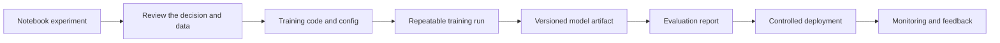

## Table of Contents

1. [The Notebook Is The First Draft](#the-notebook-is-the-first-draft)
2. [Freeze The Product Question](#freeze-the-product-question)
3. [Move Training Into Reviewed Code](#move-training-into-reviewed-code)
4. [Package The Model And Runtime Together](#package-the-model-and-runtime-together)
5. [Validate Before Release](#validate-before-release)
6. [Deploy With A Controlled Path](#deploy-with-a-controlled-path)
7. [Monitor The Model After Release](#monitor-the-model-after-release)
8. [Putting It All Together](#putting-it-all-together)
9. [What's Next](#whats-next)

## The Notebook Is The First Draft
<!-- section-summary: A notebook is useful for exploration, but production needs the model idea to move into repeatable code, versioned data, tracked artifacts, and monitored runtime. -->

A notebook is often where a machine learning idea first turns into a working experiment. A data scientist loads data, tries features, trains a model, plots metrics, and learns whether the idea deserves more time. That exploratory work matters because production teams should wait for product evidence before building heavy pipelines.

The trouble starts when the notebook is the only place where the model can be understood. A notebook can hide manual steps, temporary data files, package versions, copied cells, private credentials, and decisions that never reach review. A model trained that way may work once and then stay hard to repeat.

Let's follow **Aster Vision**, a manufacturer that inspects phone-screen glass before shipping. The quality team has a notebook that trains a computer-vision model to detect scratches and edge chips from camera images. It reads labeled inspection images, trains a PyTorch model, and finds more defects than the old threshold-based image rule. The first result is promising. Now the team needs to turn the notebook into a production release.

**Notebook to production** is the workflow that turns exploratory model work into a reliable system. The workflow usually moves through the same steps: define the product question, move logic into reviewed code, create a repeatable training job, package the model artifact and runtime, validate the candidate, release it safely, monitor behavior, and feed production evidence back into the next version.



The rest of this article walks through those steps with one model so the handoffs stay concrete.


*The path visual shows the production route from notebook exploration into a monitored model release.*

## Freeze The Product Question
<!-- section-summary: Before production work starts, the team should freeze the decision, target, metrics, guardrails, and release owner for the model. -->

The first production step is to freeze the product question. A notebook can explore many angles, but a production model needs a clear decision. Aster Vision wants to decide whether a glass panel should pass inspection, go to a human reviewer, or leave the production line for rework. The defect score exists to support that decision.

The team should write a short model brief before refactoring code. This brief protects the workflow from drifting. If the data scientist optimizes defect recall, the quality owner worries about false rejects, and the platform engineer optimizes camera-line latency, the model brief puts those goals in one place.

```yaml
model_name: glass-defect-detector
product_decision: pass, human-review, or rework a glass panel
target_label: confirmed_surface_defect
primary_metric: recall_at_5_percent_human_review_rate
guardrails:
  false_reject_rate: maximum increase of 0.3 percent
  p95_inference_latency_ms: maximum 60
  human_review_rate: maximum 5 percent
owner:
  product: factory-quality
  ml: vision-ml-team
  platform: ml-platform
```

This brief also makes review easier. The reviewer can check whether the notebook used the right target label, whether the metric matches the product goal, and whether the latency budget matches the serving path.

## Move Training Into Reviewed Code
<!-- section-summary: The notebook logic should move into version-controlled training code with clear data inputs, configuration, tests, and a repeatable run command. -->

Once the product question is clear, the team moves the notebook logic into reviewed code. The notebook keeps its value as exploration evidence, while the training path gains a repeatable script that another person or pipeline can run.

For Aster Vision, the image preprocessing, augmentation settings, training loop, evaluation code, and artifact writing should live in a repository. The notebook can remain as an exploration record, but production training should run from a command with explicit inputs.

A simple project layout can start like this.

```bash
glass-defect-detector/
  configs/
    train.yml
  src/
    dataset.py
    train.py
    evaluate.py
    save_artifact.py
  tests/
    test_image_preprocessing.py
    test_input_schema.py
```

The config file carries the values that changed inside notebook cells. The team can review the data snapshot, feature list, split dates, model settings, and output locations before a run starts.

```yaml
data:
  image_manifest_uri: s3://aster-ml-data/glass-defects/manifests/2026-06-30.csv
  train_batches:
    - line_a_2026_05
    - line_b_2026_05
  validation_batches:
    - line_a_2026_06_week_1
    - line_b_2026_06_week_1
labels:
  defect_classes:
    - scratch
    - edge_chip
    - contamination
training:
  seed: 20260704
  architecture: resnet50
  image_size: 384
  learning_rate: 0.0003
  epochs: 18
```

Reviewed code gives the team a place for tests. Image preprocessing tests can check color channel order, resize behavior, normalization values, label parsing, and corrupted image handling. These tests catch the kinds of mistakes that make later evaluation misleading, especially when training and inspection-line serving use different image libraries.

## Package The Model And Runtime Together
<!-- section-summary: A production model release needs both the model artifact and the runtime details needed to load, validate, and serve it. -->

The training run produces a **model artifact**. The artifact is the saved model output, such as a serialized scikit-learn pipeline, a LightGBM model file, a PyTorch checkpoint, or a TensorFlow SavedModel directory. The artifact alone is rarely enough for production. The serving path also needs code, dependencies, input schema, feature logic, thresholds, secrets, and environment details.

Aster Vision should store the artifact with metadata. A model registry or artifact store can record which code, data, config, and environment created the artifact. If the team logs the model with MLflow, an input example and model signature help the next system understand that the model expects a batch of normalized images with a specific shape.

```yaml
model_version: glass-defect-detector:v18
artifact_uri: s3://aster-ml-models/glass-defect-detector/v18/model.pt
training_commit: 7d83a14
data_snapshot: s3://aster-ml-data/glass-defects/manifests/2026-06-30.csv
training_image: ghcr.io/aster/glass-defect-training:2026-07-04
input_signature:
  tensor: float32
  shape: [batch, 3, 384, 384]
output_signature:
  classes: [scratch, edge_chip, contamination, clean]
```

The runtime package should prove that the model can load in the same environment that will serve it. Many teams catch painful issues here: the notebook had a local package version, the training image used one Python version, the serving image used another, or the model expected a field the API never sends.

A lightweight load test can be part of the package step.

```bash
python -m glass_defect.check_load \
  --artifact s3://aster-ml-models/glass-defect-detector/v18/model.pt \
  --signature schemas/glass_image_signature.json \
  --sample fixtures/glass_panel_sample.jpg
```

The output should show that the artifact loads, the input schema matches, and the prediction path returns a score inside the expected range. This step turns "the notebook trained a model" into "the production runtime can actually use this model."

## Validate Before Release
<!-- section-summary: Validation checks model quality, segment behavior, serving compatibility, latency, and rollback readiness before production traffic depends on the candidate. -->

After packaging, the candidate needs validation. Validation combines offline model checks with production readiness checks. The exact checklist changes by product risk, but the defect detector needs more than one accuracy number.

Aster Vision should compare the candidate with the current production model. The report should include primary metrics, guardrails, important segments, input signature checks, model load checks, latency, and a release recommendation.

```yaml
candidate_model: glass-defect-detector:v18
baseline_model: glass-defect-detector:v17
offline_metrics:
  scratch_recall:
    baseline: 0.88
    candidate: 0.92
  edge_chip_recall:
    baseline: 0.84
    candidate: 0.89
  false_reject_rate:
    baseline: 0.031
    candidate: 0.034
serving_checks:
  model_load: passed
  input_contract: passed
  p95_latency_ms: 41
segments:
  line_a_camera_3: needs_review
  night_shift_images: passed
  high_glare_panels: passed
recommendation: approve_for_shadow
```

Notice the `needs_review` segment. This is normal in production ML. A candidate can look useful overall and still need extra review for one camera, line, shift, or lighting condition. The validation stage gives the team a place to discuss that risk before production decisions change.

The team should also validate rollback readiness. The deployment path should know the current production model version, the candidate version, the owner approving release, and the command or pipeline action that returns traffic to the previous version.


*The release gate visual shows how metrics, segment checks, load tests, latency, and rollback readiness support shadow and canary rollout decisions.*

## Deploy With A Controlled Path
<!-- section-summary: Controlled deployment moves the model from no-impact testing to limited traffic, then broader rollout only when evidence supports the next step. -->

Deployment connects the approved candidate to production traffic. For an inspection-line model, the safest route usually starts with **shadow mode**. Shadow mode sends real production images to the candidate model and logs its predictions, while the factory still uses the current production model for decisions.

Shadow mode helps the team answer questions that offline validation cannot fully answer. Can the candidate handle live request shapes? Does latency stay inside the budget? Do score distributions look strange? Does the candidate disagree with production in expected places?

After shadow mode, the team may move to a canary release. A **canary** sends a small share of real decisions to the candidate, such as one inspection line or 5 percent of panels from a low-risk product run. The team watches service health, model output, false reject proxies, manual review volume, and quality audit signals before increasing traffic.

```yaml
release_plan:
  model: glass-defect-detector:v18
  stages:
    - name: shadow
      decision_impact: none
      duration: 24h
    - name: canary
      inspection_line: line_b
      duration: 12h
    - name: expanded_canary
      inspection_lines: [line_b, line_c]
      duration: 24h
rollback:
  target_model: glass-defect-detector:v17
  owner: ml-platform-oncall
```

Controlled deployment gives the team time to learn from production. It also gives operations a clear stop rule. If latency rises, defect score distribution shifts wildly, or false reject proxies cross a limit, the rollout stops and the model returns to the previous version.

## Monitor The Model After Release
<!-- section-summary: After release, monitoring should cover service health, input data, model outputs, delayed labels, business impact, and feedback for the next training cycle. -->

The workflow continues after the model reaches production. A model can pass validation and still degrade later. Camera focus changes, lighting changes, upstream image compression changes, glass suppliers change, and human review labels arrive late. Production monitoring is how the team keeps the release honest.

Aster Vision needs normal service signals and model-specific signals. Service signals include request rate, latency, errors, CPU or memory, and dependency failures. Model signals include input image quality, output distribution, camera-specific defect rates, prediction quality when human-review labels arrive, and business guardrails.

| Signal | Example question |
|---|---|
| Latency | Is the score returned before the inspection line needs the next action? |
| Input quality | Did camera blur or glare rise for one line? |
| Score distribution | Did the share of high-defect scores jump suddenly? |
| Delayed labels | Are human-review labels arriving on the expected timeline? |
| Business guardrail | Did false rejects or manual review volume rise too much? |

Monitoring should feed the next training cycle. If production labels show that the model misses a new scratch pattern from a supplier, the team can add examples, adjust preprocessing, retrain, and evaluate a new candidate. If monitoring shows a bad release, the team can roll back first and investigate after production impact is under control.


*The feedback loop visual connects live images, predictions, labels, drift signals, retraining, and the next model version.*

## Putting It All Together
<!-- section-summary: Notebook-to-production workflow gives a promising model a repeatable route through code review, packaging, validation, release, monitoring, and feedback. -->

The notebook is a valuable first draft. It helps the team test whether the model idea can help the product. Production needs the next steps: a frozen product question, reviewed training code, versioned data and config, model artifact metadata, runtime packaging, validation, controlled deployment, monitoring, and feedback.

For Aster Vision, this workflow turns a promising defect model into a release that a team can explain. A reviewer can see what images trained the model. A platform engineer can see how it loads. A quality owner can see the guardrails. An on-call engineer can find the rollback target. A future data scientist can inspect the evidence behind version `v18`.

That is the practical meaning of moving from notebook to production. The team keeps the creative speed of exploration, then adds the production evidence needed to run the model safely.

## What's Next
<!-- section-summary: The next article names the common failure modes this workflow is designed to prevent. -->

The next article looks at common MLOps failure modes. These are the problems that show up when data, code, model artifacts, release gates, monitoring, or ownership are missing from the workflow.

## References

- [Google Cloud: MLOps continuous delivery and automation pipelines in machine learning](https://docs.cloud.google.com/architecture/mlops-continuous-delivery-and-automation-pipelines-in-machine-learning) - Describes the path from experimentation into automated training, validation, deployment, and monitoring.
- [Microsoft Learn: MLOps model management with Azure Machine Learning](https://learn.microsoft.com/en-us/azure/machine-learning/concept-model-management-and-deployment?view=azureml-api-2) - Covers model lifecycle management, reproducible pipelines, registration, deployment, and monitoring.
- [AWS SageMaker AI: Model Registry](https://docs.aws.amazon.com/sagemaker/latest/dg/model-registry.html) - Documents model groups, model versions, approval status, and model package metadata.
- [MLflow Docs: Tracking](https://mlflow.org/docs/latest/ml/tracking/) - Documents experiment runs, parameters, metrics, artifacts, and model tracking concepts.
- [MLflow Docs: Model Signatures and Input Examples](https://mlflow.org/docs/latest/ml/model/signatures/) - Documents input examples and signatures that describe model input and output contracts.
- [KServe Docs: Welcome to KServe](https://kserve.github.io/website/docs/intro) - Documents Kubernetes-native model serving concepts such as predictors, canary deployment, autoscaling, and monitoring.
