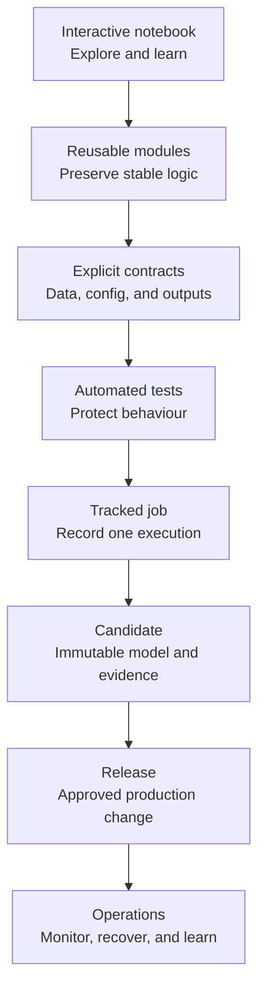
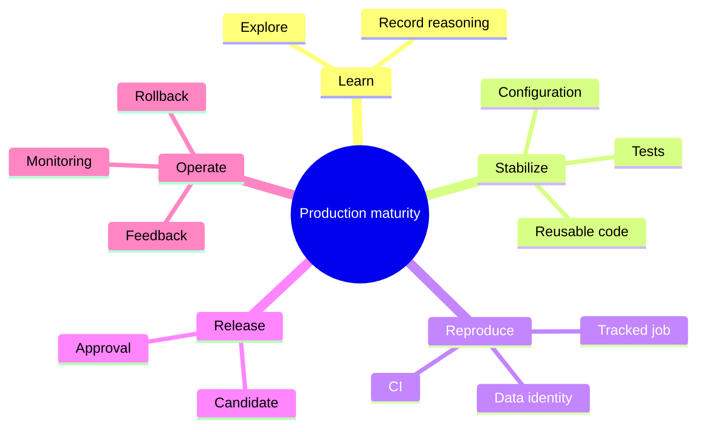
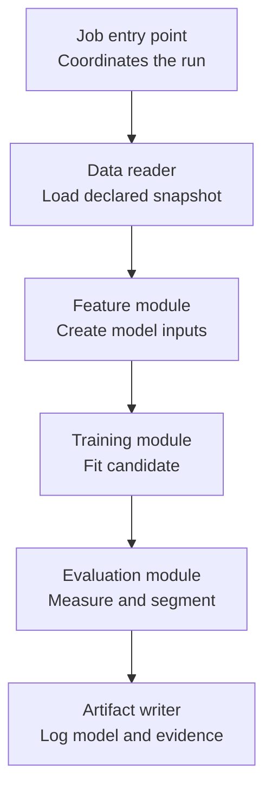
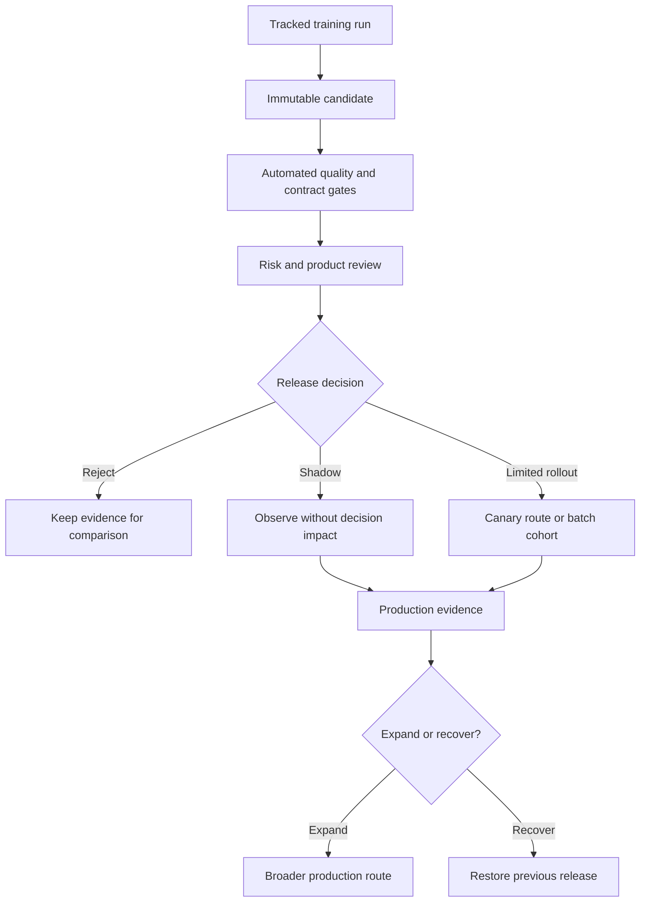
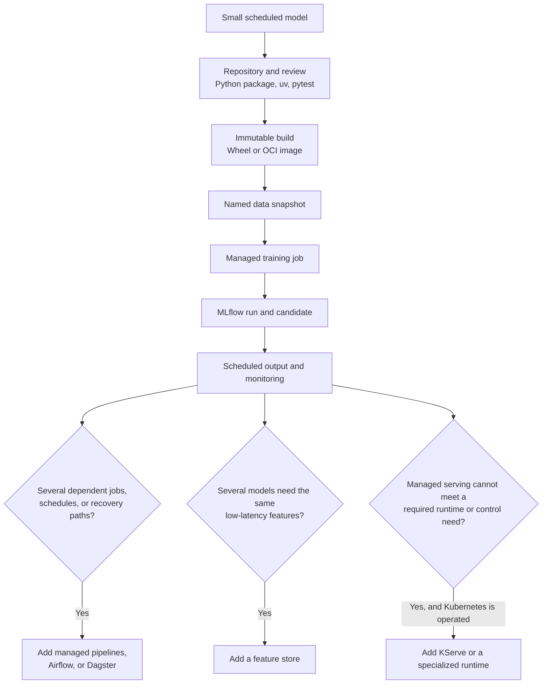

## Table of Contents

1. [What Notebook To Production Means](#what-notebook-to-production-means)
2. [The Production Maturity Path](#the-production-maturity-path)
3. [Keep The Notebook As An Exploration Workspace](#keep-the-notebook-as-an-exploration-workspace)
4. [Define The Product And Data Contracts](#define-the-product-and-data-contracts)
5. [Move Stable Logic Into Reusable Modules](#move-stable-logic-into-reusable-modules)
6. [Separate Code, Configuration, Dependencies, And Secrets](#separate-code-configuration-dependencies-and-secrets)
7. [Test The Boundaries That Change Model Behaviour](#test-the-boundaries-that-change-model-behaviour)
8. [Give Every Dataset And Split A Stable Identity](#give-every-dataset-and-split-a-stable-identity)
9. [Run Training As A Tracked Job](#run-training-as-a-tracked-job)
10. [Use CI To Build A Trusted Candidate](#use-ci-to-build-a-trusted-candidate)
11. [Separate A Candidate From A Production Release](#separate-a-candidate-from-a-production-release)
12. [Operate The Release And Return Evidence](#operate-the-release-and-return-evidence)
13. [A Practical Industrial Baseline](#a-practical-industrial-baseline)
14. [The Main Idea](#the-main-idea)
15. [References](#references)

## What Notebook To Production Means
<!-- section-summary: Notebook-to-production work preserves the speed of interactive exploration while giving approved model logic a repeatable, testable, and operable execution path. -->

At a high level, a notebook is a laboratory. It lets a data scientist inspect a dataset, try a transformation, draw a chart, train several models, and write down what the results might mean. That tight loop between code, output, and explanation is one of the most useful tools in machine learning.

Production has a different job. It must run the approved work again next week, on a new data snapshot, without relying on the original author's memory. Another person or automated system must be able to supply the inputs, execute the same logic, find the outputs, understand a failure, and identify the exact model candidate that was produced.

You can think of **notebook to production** as a change in operating contract. The research question starts inside an interactive document. Stable knowledge gradually moves into version-controlled modules, configuration, tests, and a tracked job. The notebook remains useful for investigation and explanation, while automation receives a clean entry point.


```mermaid
flowchart TD
    A["Interactive notebook<br/>Explore and learn"] --> B["Reusable modules<br/>Preserve stable logic"]
    B --> C["Explicit contracts<br/>Data, config, and outputs"]
    C --> D["Automated tests<br/>Protect behaviour"]
    D --> E["Tracked job<br/>Record one execution"]
    E --> F["Candidate<br/>Immutable model and evidence"]
    F --> G["Release<br/>Approved production change"]
    G --> H["Operations<br/>Monitor, recover, and learn"]
```

The main risk is hidden state. A notebook kernel remembers variables created several cells earlier. A local machine may contain an undeclared package. A person may manually edit a file before training. Credentials may live in an environment that nobody documented. Production work makes each of those dependencies visible.


## The Production Maturity Path
<!-- section-summary: Ten connected boundaries move an explored model idea toward a production release without forcing research and operations into the same interface. -->

The path has ten boundaries. They form a framework for deciding what to extract from the notebook and what evidence each production step should create.

**Exploration** finds a useful signal and records the reasoning behind it. **Reusable code** gives stable transformations and training logic normal function boundaries. **Configuration** supplies values that change across runs or environments. **Tests** protect data meaning and expected behaviour. **Data identity** names the exact training, validation, and test populations.

A **tracked job** executes the workflow on managed or controlled compute and records its inputs and outputs. **Continuous integration** checks each proposed code change in a clean environment. A **candidate** binds one model artifact to its code, data, configuration, metrics, and runtime. A **release decision** approves a specific candidate for a specific production route. **Operations** then monitor the release, preserve rollback, and return outcomes to future work.


```mermaid
mindmap
  root((Production maturity))
    Learn
      Explore
      Record reasoning
    Stabilize
      Reusable code
      Configuration
      Tests
    Reproduce
      Data identity
      Tracked job
      CI
    Release
      Candidate
      Approval
    Operate
      Monitoring
      Rollback
      Feedback
```

Teams can adopt these boundaries incrementally. A small batch model may use one Python package, one scheduled job, MLflow, and a versioned table. A regulated real-time model may add separate build and deployment pipelines, approval records, signed images, shadow traffic, and formal outcome review. The framework stays the same while the implementation grows with risk and scale.

## Keep The Notebook As An Exploration Workspace
<!-- section-summary: Notebooks remain valuable for investigation, visualization, and explanation while stable production behaviour moves into importable code. -->

A notebook is strongest during work with uncertainty. The team may still be deciding which population to model, whether a label is trustworthy, which feature carries signal, or why one segment performs poorly. Interactive cells and inline plots support that investigation well.

A useful exploration notebook records the question, data source, assumptions, observations, and rejected ideas alongside the code. It should restart and run from top to bottom, avoid embedded credentials, and clearly mark any manual sample or temporary shortcut. These habits make the research understandable without pretending the notebook is already a production job.

The extraction point arrives after logic has acquired a stable meaning. A transformation used in several experiments belongs in an importable function. A feature schema shared with serving belongs in a versioned contract. Training and evaluation belong behind callable entry points. The notebook can then import those functions and remain a convenient place to study their results.

For example, a delivery-delay experiment may reveal that recent order count and average dispatch lag are useful features. The notebook can keep the charts and interpretation. The time-window calculation should move into a tested module so training, backfills, and future investigations use the same definition.

This separation preserves two healthy interfaces: an interactive workspace for human inquiry and a deterministic entry point for automation.

## Define The Product And Data Contracts
<!-- section-summary: Product, input, output, and evaluation contracts state what the model supports before the team invests in production automation. -->

Before extracting a large amount of code, name the decision the model is supposed to support. A promising validation score says little unless the team agrees on the population, prediction time, target, action, quality measure, and unacceptable outcomes.

A compact model brief can hold that agreement:

```yaml
decision: flag an order for delivery-risk review
prediction_time: after payment confirmation
population: accepted orders with a supported delivery service
target: missed_promised_window
primary_measure: recall_at_review_capacity
guardrails:
  minimum_precision: 0.35
  maximum_review_rate: 0.08
output:
  score: probability
  actions: [standard_flow, manual_review]
owner: fulfilment-operations
```

The prediction time determines which facts are legal inputs. A dispatch timestamp created later in the fulfilment process would leak the outcome into training. The population rule excludes cases that the production workflow cannot handle. `recall_at_review_capacity` connects evaluation to a team that can review only a limited share of orders.

The input contract then names fields, types, units, allowed values, missing-data rules, entity keys, and time semantics. The output contract names the score or prediction, schema, valid range, and product action. Evaluation guardrails express the trade-offs that could block a candidate even after the primary measure improves.

Schema tools can help enforce these boundaries. Pydantic fits Python application inputs. Pandera can validate DataFrame schemas. dbt tests, Great Expectations, Soda, or platform-native expectations fit governed data pipelines. One authoritative contract should govern development checks, automated jobs, and production inputs so the field meaning stays consistent across environments.

## Move Stable Logic Into Reusable Modules
<!-- section-summary: Production code gives stable transformations, training, evaluation, and artifact creation explicit interfaces that notebooks and automated jobs can share. -->

Reusable code has named inputs, named outputs, and predictable side effects. It can be imported by a notebook, called from tests, and invoked by a job runner. That structure removes dependence on cell order and kernel memory.

A small Python project may separate four responsibilities:


```mermaid
flowchart TD
    A["Data reader<br/>Load declared snapshot"] --> B["Feature module<br/>Create model inputs"]
    B --> C["Training module<br/>Fit candidate"]
    C --> D["Evaluation module<br/>Measure and segment"]
    D --> E["Artifact writer<br/>Log model and evidence"]
    F["Job entry point<br/>Coordinates the run"] --> A
```

The entry point coordinates these functions. Business logic remains in modules that can be called directly. Storage clients and tracking clients are passed through a narrow boundary or created in the entry point, which keeps transformation tests independent from cloud services.

The delivery-delay feature can be expressed as a focused function:

```python
def recent_order_features(orders, prediction_time):
    eligible = orders.loc[orders["event_time"] < prediction_time]
    return (
        eligible.groupby("customer_id")
        .agg(
            order_count=("order_id", "count"),
            mean_dispatch_lag=("dispatch_lag_hours", "mean"),
        )
        .reset_index()
    )
```

The strict time filter expresses a model assumption as code: future events cannot influence the current prediction. A notebook can call this function for analysis. The training job can call it for a full snapshot. A test can prove its time behaviour with a tiny fixture.

Avoid turning every notebook cell into its own pipeline component. A component boundary should represent a meaningful unit with a clear input, output, retry behaviour, and ownership. Small pure functions belong inside a package; expensive or independently recoverable work may deserve its own job step.

## Separate Code, Configuration, Dependencies, And Secrets
<!-- section-summary: Production runs separate stable program logic from run parameters, locked dependencies, environment packaging, and externally managed credentials. -->

A training run is assembled from several kinds of information. The program defines the work, run settings choose one experiment, installed packages make that program executable, and credentials allow it to reach protected data or services. A notebook can hold all four inside one interactive session. Automation needs to know where each one comes from.

Separating them makes changes visible and deliberate. A reviewer can see that a pull request changed feature logic. A run record can show that one candidate used a different depth limit. A lock-file diff can reveal a library upgrade. A security team can rotate a credential without editing training code.

These four inputs also change at different speeds.

**Code** defines behaviour and moves through review. **Configuration** supplies values such as a data reference, random seed, model family, compute size, or evaluation threshold. **Dependencies** define the libraries and runtime needed to execute the code. **Secrets** grant access to protected systems.

Mixing these concerns creates hidden releases. Editing a threshold inside Python changes policy. Installing a newer library on one machine changes the runtime. Pasting a token into a notebook creates a security and recovery problem.

A Python project commonly uses `pyproject.toml` for project metadata and dependency constraints. `uv.lock` or a Poetry lock file records resolved versions and belongs in version control. CI can run `uv run --frozen ...` so an outdated lock file fails instead of silently changing. A Docker image is appropriate where system libraries, native dependencies, or a controlled serving environment need a portable runtime. The image should use an immutable digest at release time.

Run configuration can stay small:

```yaml
data_manifest: manifests/training-approved.yml
random_seed: 42
model:
  family: histogram_gradient_boosting
  max_depth: 8
evaluation:
  minimum_precision: 0.35
  maximum_review_rate: 0.08
```

The tracked run should store the resolved configuration, including defaults. Command-line overrides should appear in the same record. Secret values stay in GitHub Actions environments, GitLab CI variables, a cloud secret manager, or workload identity. The configuration contains only the secret reference.

## Test The Boundaries That Change Model Behaviour
<!-- section-summary: Production tests protect data meaning, transformations, training integration, artifact loading, and evaluation gates at the smallest useful scope. -->

Model code has several kinds of correctness. A function can execute without producing the intended features. A training job can finish while reading the wrong split. An artifact can be valid while the serving runtime cannot load it. Tests should follow these distinct failure boundaries.

**Unit tests** protect deterministic transformations, label logic, and policy calculations. **Contract tests** protect schemas, required fields, ranges, and category rules. **Integration tests** run connected steps against a small fixture dataset. **Smoke tests** prove that the built artifact loads and returns an output with the declared shape. **Evaluation tests** apply explicit thresholds to candidate evidence.

The time boundary in the earlier feature function deserves a direct test:

```python
def test_recent_features_exclude_future_orders(sample_orders):
    cutoff = sample_orders["event_time"].iloc[1]

    features = recent_order_features(sample_orders, cutoff)

    assert features["order_count"].sum() == 1
```

This test protects model meaning instead of a library implementation detail. A future refactor may switch from pandas to Polars or Spark; the temporal rule still has to hold.

Tests need controlled fixtures. They should include missing values, unknown categories, boundary timestamps, empty populations, and a representative model input. Large production datasets belong in data-quality jobs and evaluation runs. Pull-request tests should stay fast enough to run for every change.

For risky workflows, add a small end-to-end rehearsal on managed compute. It can read a tiny governed dataset, train a small candidate, log evidence, and load the artifact. This catches permission, dependency, storage, and environment failures that local unit tests cannot see.

## Give Every Dataset And Split A Stable Identity
<!-- section-summary: Reproducible training names the exact source snapshot, population rules, split membership, schema, and transformation code used by one run. -->

“The customer table” is a location, not a reproducible dataset. The rows at that location may change between runs. Production evidence needs a stable identity for the source and for the train, validation, and test populations derived from it.

The identity depends on the storage system. Object data can use immutable object versions, paths, manifests, and checksums. Delta and Iceberg tables can use snapshot or version identifiers. A warehouse extraction can record the source tables, snapshot semantics, query version, and materialized output identity. Restricted datasets can be represented by metadata and a digest without copying sensitive rows into the tracking platform.

```yaml
dataset_name: order_delivery_training
source:
  table: governed.fulfilment.order_events
  snapshot_id: snapshot_8f31c
schema_version: order-events-v4
population_query_commit: 3b9e7a1
splits:
  train_manifest: manifests/train_29bc.parquet
  validation_manifest: manifests/validation_a041.parquet
  test_manifest: manifests/test_7fe2.parquet
```

Split identity matters because random splitting can move the same customer, device, patient, or nearby time period across training and evaluation. Group-aware and time-aware splits often reflect production more honestly. The manifest can store stable entity or row identifiers for each split, along with the split method and seed.

MLflow dataset tracking can record a dataset name, source, digest, schema, and profile beside a run. It provides experiment lineage, while the underlying warehouse, lakehouse, object store, or catalog remains responsible for durable data storage and access control.

## Run Training As A Tracked Job
<!-- section-summary: A tracked training job executes one declared workflow on controlled compute and records enough evidence to understand and reproduce its outputs. -->

A production training job represents one governed execution of the model workflow. Its record connects the immutable code revision, resolved configuration, data identities, runtime environment, compute identity, start and end state, metrics, artifacts, and logs.

The job runner may be a managed ML job, a Databricks Lakeflow Job, a Kubernetes Job, or a task launched by Airflow, Dagster, or Prefect. Managed training jobs are a practical default because they provide isolated compute, logs, status, permissions, and artifact paths without requiring a team to operate its own cluster control plane.

MLflow Tracking is a common evidence layer. The following focused run loads numeric feature tables from immutable split paths, defines the full parameter map, records the training dataset, evaluates one candidate, and logs the model. Supplying `input_example` lets current MLflow infer and store the model signature.

```python
import mlflow
import mlflow.sklearn
import pandas as pd
from sklearn.ensemble import HistGradientBoostingClassifier
from sklearn.metrics import precision_score

target = "missed_promised_window"
train_uri = "s3://ml-data/order-delay/splits/train_29bc.parquet"
validation_uri = "s3://ml-data/order-delay/splits/validation_a041.parquet"
train_frame = pd.read_parquet(train_uri)
validation_frame = pd.read_parquet(validation_uri)
X_train, y_train = train_frame.drop(columns=[target]), train_frame[target]
X_valid, y_valid = validation_frame.drop(columns=[target]), validation_frame[target]
params = {"max_depth": 8, "random_state": 42}
training_dataset = mlflow.data.from_pandas(
    train_frame, source=train_uri, name="order-delivery-train", targets=target
)

with mlflow.start_run():
    mlflow.log_params(params)
    mlflow.log_input(training_dataset, context="training")
    model = HistGradientBoostingClassifier(**params).fit(X_train, y_train)
    predictions = model.predict(X_valid)
    mlflow.log_metric("validation_precision", precision_score(y_valid, predictions))
    mlflow.sklearn.log_model(
        model, name="delivery-risk-model", input_example=X_train.head(3)
    )
```

One run now groups concrete parameter values, an immutable dataset source, an evaluation metric, an inferred input contract, and the logged model. A production version should also log the validation dataset, Git commit, runtime image digest, feature schema version, and job execution ID. Evaluation tables, segment metrics, and plots belong in the same evidence record where reviewers can inspect them.

Tracking and orchestration solve different problems. MLflow records what a run used and produced. An orchestrator schedules tasks, manages dependencies and retries, and exposes workflow state. Some managed platforms provide both capabilities, yet the conceptual split remains useful during incident review.

## Use CI To Build A Trusted Candidate
<!-- section-summary: Continuous integration reruns fast, deterministic checks in a clean environment and builds immutable artifacts from reviewed source. -->

Continuous integration checks every proposed change outside the author's workstation. A pull request can run formatting and linting, type checks, unit and contract tests, a package build, dependency or image scanning, and a small artifact smoke test.

Full model training rarely belongs in every pull request. It may be expensive, slow, or dependent on restricted data. CI proves that the workflow definition is internally sound. A separate controlled pipeline trains and evaluates the candidate after merge or after an approved trigger.

A compact GitHub Actions job can use the same locked commands as local development:

```yaml
steps:
  - uses: actions/checkout@v7
  - uses: astral-sh/setup-uv@v8
    with:
      enable-cache: true
  - run: uv run --frozen ruff check .
  - run: uv run --frozen pytest
  - run: uv build
```

Production workflows should pin third-party actions according to the organization's supply-chain policy; immutable commit references provide the strongest protection. GitLab CI, Jenkins, and other CI systems can enforce the same contract.

After CI passes, the build publishes an immutable Python wheel or OCI image. Training consumes that artifact instead of reinstalling an editable copy from a developer directory. The build identity follows the training run and later candidate, which connects code review to the resulting model.

## Separate A Candidate From A Production Release
<!-- section-summary: A candidate is an immutable model plus evidence, while a release is an approved decision to use that candidate through a named production route. -->

A successful training run produces a **candidate**. The candidate binds the model artifact to its source revision, data identities, resolved configuration, runtime, model signature, evaluation report, and integrity digest.

A **release** adds a decision. It states which candidate may affect which environment or product route, under which policy, with which rollout and rollback plan. The same candidate may be rejected, approved for shadow traffic, approved for one region, or promoted more widely after further evidence.


```mermaid
flowchart TD
    A["Tracked training run"] --> B["Immutable candidate"]
    B --> C["Automated quality and contract gates"]
    C --> D["Risk and product review"]
    D --> E{"Release decision"}
    E -->|"Reject"| F["Keep evidence for comparison"]
    E -->|"Shadow"| G["Observe without decision impact"]
    E -->|"Limited rollout"| H["Canary route or batch cohort"]
    G --> I["Production evidence"]
    H --> I
    I --> J{"Expand or recover?"}
    J -->|"Expand"| K["Broader production route"]
    J -->|"Recover"| L["Restore previous release"]
```

A model registry or governed catalog can store candidate versions, descriptions, tags, signatures, and links to source runs. Current MLflow registry workflows use version tags for status and aliases for named references such as `champion`; legacy model stages are deprecated. An alias is a movable reference, so a release record should also preserve the immutable model version or logged-model ID it selected.

The release pipeline should carry deployment configuration and permissions through source control or a governed automation system. Databricks Declarative Automation Bundles can define jobs, pipelines, experiments, models, and serving resources as source files. Terraform, cloud-native templates, Helm, and GitOps tools serve similar roles in other environments.

## Operate The Release And Return Evidence
<!-- section-summary: Production ownership covers service and model monitoring, incidents, rollback, delayed outcomes, and the evidence that starts the next improvement cycle. -->

The workflow continues after deployment. Operations must show whether the system can deliver predictions, whether the input remains valid, whether outputs are changing, and whether later outcomes confirm that the model still supports the product.

An online service first needs to show whether callers receive results within the product deadline. Traffic describes demand, latency shows the user-visible delay, errors expose failed work, and saturation reveals shrinking capacity. Feature-freshness and fallback signals then show whether a fast response used the intended data and model route.

A batch system tells a different operational story. Input readiness confirms that the declared snapshot arrived. Job state and row coverage show whether every expected partition completed. Output freshness and atomic publication confirm that consumers received one complete result. Both delivery paths record model and policy identity in prediction evidence.

Prediction quality often arrives later. The team needs a governed join between predictions and mature outcomes, along with label delay and join coverage. Business guardrails such as review volume, false rejection, stockout, or escalation rate show whether the model's product effect remains acceptable.


Recovery is part of the release design. The system should preserve the previous model or batch output, the routing or promotion action needed to restore it, and the owner authorized to act. A rollback restores a trusted state quickly; investigation and retraining can continue after impact is contained.

Production evidence then returns to exploration. A notebook may investigate a failing segment, visualize new drift, or test a new label rule. Stable conclusions move through the same maturity path again.

## A Practical Industrial Baseline
<!-- section-summary: A current baseline combines notebook exploration with a normal software project, locked environments, layered tests, immutable data references, tracked managed jobs, CI, a registry, and monitored release automation. -->

Consider a small delivery-risk model retrained every week by one team. Its first production path can stay compact. Exploration happens in Jupyter or the notebook environment already attached to governed data. Stable code moves into a Python package. GitHub or GitLab reviews that package, while uv locks its dependencies and pytest protects its contracts.

CI builds an immutable wheel or OCI image. A managed Databricks, SageMaker AI, Vertex AI, or Azure Machine Learning job reads a named snapshot from object storage, a warehouse, or a lakehouse. MLflow records the run, dataset, metrics, model, and candidate identity. Cloud monitoring watches the scheduled job and its published output.


```mermaid
flowchart TD
    A["Small scheduled model"] --> B["Repository and review<br/>Python package, uv, pytest"]
    B --> C["Immutable build<br/>Wheel or OCI image"]
    C --> D["Named data snapshot"]
    D --> E["Managed training job"]
    E --> F["MLflow run and candidate"]
    F --> G["Scheduled output and monitoring"]
    G --> H{"Several dependent jobs,<br/>schedules, or recovery paths?"}
    H -->|"Yes"| I["Add managed pipelines,<br/>Airflow, or Dagster"]
    G --> J{"Several models need the same<br/>low-latency features?"}
    J -->|"Yes"| K["Add a feature store"]
    G --> L{"Managed serving cannot meet a<br/>required runtime or control need?"}
    L -->|"Yes, and Kubernetes is operated"| M["Add KServe or a specialized runtime"]
```

Orchestration earns its place after the weekly run expands into dependent preparation, training, evaluation, registration, and deployment steps with separate retries or schedules. Airflow fits many established enterprise data platforms. Dagster is a strong greenfield choice where asset-aware development and local testability match the team's working model. Managed cloud pipelines reduce platform ownership for teams already committed to one provider.

A feature store addresses shared feature definitions, point-in-time training retrieval, and low-latency online lookup across several models. A single scheduled model reading one governed snapshot gains little from that extra serving and synchronization layer.

Kubernetes serving addresses a different pressure. An organization that already operates Kubernetes may use KServe to give many model teams the same deployment resource, autoscaling behaviour, and traffic controls. A GPU-heavy workload may place Triton behind that layer to combine requests through dynamic batching or run several models concurrently. These choices transfer runtime upgrades, cluster capacity, serving security, and on-call response to the platform team, so the required control must justify that ownership.

Workload identity should grant the managed job short-lived cloud access. A cloud secret manager covers external systems that still require secret values. Multi-environment promotion and formal approval gates belong in the path after product risk or governance requires separate authority over candidate training and production release.

## The Main Idea
<!-- section-summary: Notebook-to-production work protects the creative exploration loop while moving approved behaviour into a repeatable and operable system. -->

A notebook and a production job serve different users. The notebook helps a person ask questions and understand results. The production workflow helps a team or automated system repeat approved work, verify its inputs, and recover from failure. Moving a model into production means preserving both strengths through a clear boundary between exploration and operation.

Reusable modules remove dependence on cell order. Configuration makes run choices visible. Locked dependencies define the environment. Tests protect data and model behaviour. Dataset identities make comparison reproducible. A tracked job records one execution. CI connects reviewed source to immutable build artifacts. Candidate evidence supports a release decision. Operations preserve health, rollback, and feedback.

The result is more than a notebook that runs on a server. It is a model workflow that another person can inspect, repeat, release, recover, and improve.

## References

- [MLflow: Experiment tracking](https://mlflow.org/docs/latest/tracking) - Defines runs, parameters, metrics, code versions, models, and artifacts.
- [MLflow: Dataset tracking](https://mlflow.org/docs/latest/dataset/) - Documents dataset sources, digests, schemas, profiles, and run inputs.
- [MLflow: Model signatures](https://mlflow.org/docs/latest/ml/model/signatures/) - Documents model input, output, and parameter contracts.
- [MLflow: Model Registry workflows](https://mlflow.org/docs/latest/ml/model-registry/workflow/) - Documents current model tags and aliases and the deprecation of legacy stages.
- [uv: Locking and syncing](https://docs.astral.sh/uv/concepts/projects/sync/) - Explains locked and frozen Python project environments.
- [pytest: Assertions](https://docs.pytest.org/en/stable/how-to/assert.html) - Documents focused behavioural assertions and failure reporting.
- [GitHub Actions: Continuous integration](https://docs.github.com/en/actions/get-started/continuous-integration) - Describes clean, automated build and test workflows.
- [Databricks: Declarative Automation Bundles](https://docs.databricks.com/aws/en/dev-tools/bundles/) - Documents source-controlled definitions for data and AI jobs and resources.
- [Amazon SageMaker AI: Pipelines overview](https://docs.aws.amazon.com/sagemaker/latest/dg/pipelines-overview.html) - Describes managed preprocessing, training, evaluation, registration, and inference steps.
- [Vertex AI: Pipelines introduction](https://cloud.google.com/vertex-ai/docs/pipelines/introduction) - Describes managed execution of Kubeflow Pipelines and TFX workflows.
- [Azure Machine Learning: Component pipelines](https://learn.microsoft.com/en-us/azure/machine-learning/how-to-create-component-pipeline-python?view=azureml-api-2) - Documents reusable managed pipeline components with the current SDK.
