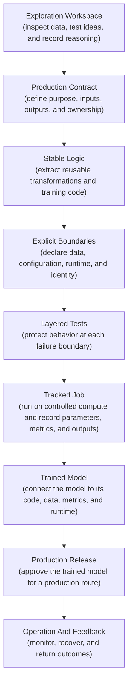
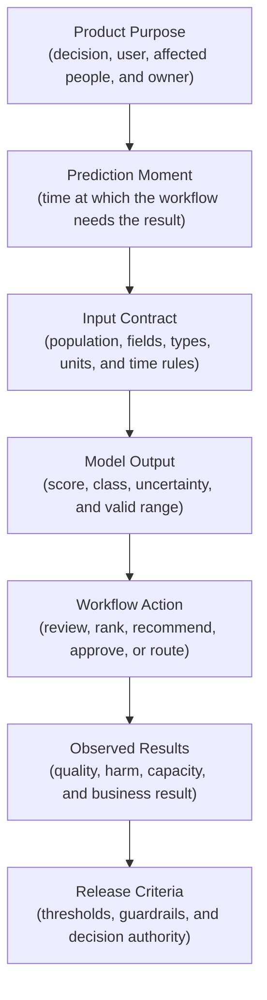
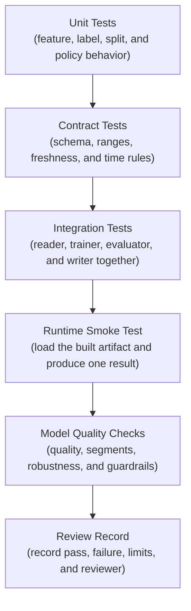
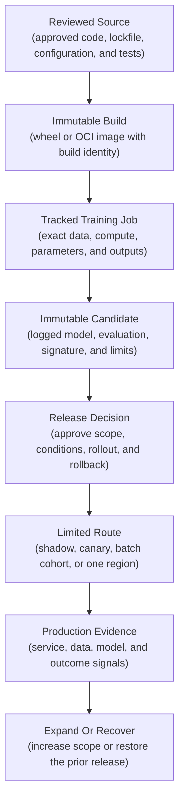
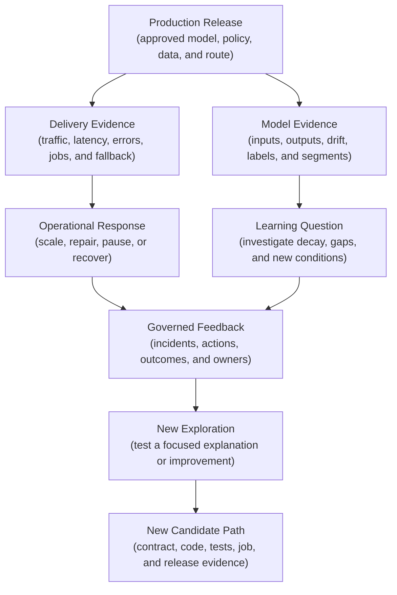
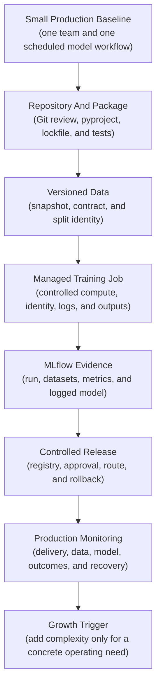

## Table of Contents

1. [What Notebook To Production Means](#what-notebook-to-production-means)
2. [The Steps From A Notebook To Production](#the-steps-from-a-notebook-to-production)
3. [Decide What The Model Will Do](#decide-what-the-model-will-do)
4. [Turn Notebook Code Into A Reusable Training Program](#turn-notebook-code-into-a-reusable-training-program)
5. [Test The Training Workflow](#test-the-training-workflow)
6. [Run And Track A Reproducible Training Job](#run-and-track-a-reproducible-training-job)
7. [Decide Whether The Model Is Ready For Production](#decide-whether-the-model-is-ready-for-production)
8. [Monitor The Model And Use Production Feedback](#monitor-the-model-and-use-production-feedback)
9. [A Practical Starter Stack](#a-practical-starter-stack)
10. [The Main Idea](#the-main-idea)
11. [References](#references)

## What Notebook To Production Means

<!-- section-summary: Notebook-to-production work preserves interactive exploration while giving stable model behavior a repeatable, testable, and operable execution path. -->

At a high level, a notebook is a laboratory. It lets a data scientist inspect a
dataset, try a transformation, draw a chart, train several models, and explain
what the results might mean. The short loop between code, output, and reasoning
is one of the strengths of machine-learning work.

Production has a different responsibility. It must run approved work again on a
declared data snapshot without relying on the original author’s memory. Another
person or an automated system needs to supply the inputs, execute the same
logic, find the outputs, investigate failures, and identify the exact trained
model that the run produced.

**Notebook to production** is a change in operating contract. Exploration starts
inside an interactive document. Stable knowledge then moves into a Python
package, configuration, tests, and a tracked job. The notebook remains available
for investigation and explanation, while automation receives a deterministic
entry point.

Teams create a **release candidate** by connecting one trained model to the
code, data, configuration, runtime, metrics, and test results that produced it.
The candidate awaits production approval and gives reviewers one complete item
to evaluate before making a release decision.

Consider a notebook that explores whether message length, account history, and
recent contact volume help prioritize support requests. The charts and rejected
ideas belong in the notebook. The approved feature definitions, training logic,
evaluation thresholds, and model output contract need stable interfaces that a
scheduled job can run.


```mermaid
flowchart TD
    A["Exploration Workspace<br/>(inspect data, test ideas, and record reasoning)"] --> B["Production Contract<br/>(define purpose, inputs, outputs, and ownership)"]
    B --> C["Stable Logic<br/>(extract reusable transformations and training code)"]
    C --> D["Explicit Boundaries<br/>(declare data, configuration, runtime, and identity)"]
    D --> E["Layered Tests<br/>(protect behavior at each failure boundary)"]
    E --> F["Tracked Job<br/>(run on controlled compute and record parameters, metrics, and outputs)"]
    F --> G["Trained Model<br/>(connect the model to its code, data, metrics, and runtime)"]
    G --> H["Production Release<br/>(approve the trained model for a production route)"]
    H --> I["Operation And Feedback<br/>(monitor, recover, and return outcomes)"]

    class A learn;
    class B,C,D,E prove;
    class F,G operate;
    class H,I release;
```

The main production risk is hidden state. A notebook kernel remembers variables
created several cells earlier. A workstation may contain an undeclared package.
A person may edit a file before training or hold a credential that nobody else
can use. Production work gives each dependency an explicit source and owner.


## The Steps From A Notebook To Production

<!-- section-summary: A reliable transition moves stable notebook work through reusable code, reproducible training, controlled release, and production operation. -->

Moving every notebook cell into a long script preserves the cell order while
leaving most production problems unsolved. The team still needs to know which
inputs are valid, where configuration comes from, which dependencies were
installed, what evidence identifies the candidate, and who can release it.

The transition follows four practical steps. Each step adds information that
another person or an automated system can verify.

### Explore Ideas In The Notebook

Exploration searches for a signal and tests assumptions. The notebook records
the question, data source, observations, and rejected ideas. It should restart
and run from top to bottom so later readers can distinguish deliberate analysis
from leftover kernel state.

The extraction point arrives when a piece of logic has a stable meaning. A
feature used across experiments deserves an importable function. A population
rule that decides which rows count belongs in a contract. A chart created only
to investigate one anomaly can remain in the notebook.

### Move Stable Logic Into Reusable Code

The team defines product and data contracts, extracts stable logic, declares
configuration and dependencies, and adds tests. This stage gives the workflow a
callable entry point with named inputs and outputs. It also separates human
analysis from the repeatable path that creates candidates.

### Reproduce The Full Training Run

A production run names its exact code, data, configuration, runtime, and
identity. Managed compute executes the job. Tracking records parameters,
datasets, metrics, logs, and model outputs. Another engineer can then explain
what ran without reconstructing a workstation.

### Release And Operate The Model

A completed training run produces evidence. A candidate packages that evidence
around one model artifact. A release decision authorizes the candidate for a
named production route. Monitoring, recovery, and delayed outcomes show whether
the approved behavior still serves the product.

Teams can adopt these boundaries incrementally. A small weekly model may need
one package, one managed job, one MLflow experiment, and one versioned table. A
high-impact online model may add independent evaluation, separate deployment
authority, canary traffic, signed images, and formal outcome review. The same
steps remain recognizable as the implementation grows.

## Decide What The Model Will Do

<!-- section-summary: A production contract defines the decision, prediction time, population, target, data, output, evaluation, ownership, and failure behavior before automation expands. -->

A promising metric is only one fact about a model. Production also needs to know
which decision the model supports, who uses it, which people experience the
result, and what the workflow should do with the output. These facts form the
**production contract**.

The contract is a connected set of agreements. The product contract defines the
purpose and action. The data contract defines permitted inputs and time
semantics. The output contract defines what the model returns. The evaluation
contract defines evidence that can approve or block a candidate.


```mermaid
flowchart TD
    A["Product Purpose<br/>(decision, user, affected people, and owner)"] --> B["Prediction Moment<br/>(time at which the workflow needs the result)"]
    B --> C["Input Contract<br/>(population, fields, types, units, and time rules)"]
    C --> D["Model Output<br/>(score, class, uncertainty, and valid range)"]
    D --> E["Workflow Action<br/>(review, rank, recommend, approve, or route)"]
    E --> F["Observed Results<br/>(quality, harm, capacity, and business result)"]
    F --> G["Release Criteria<br/>(thresholds, guardrails, and decision authority)"]

    class A,B purpose;
    class C,D,E,F contract;
    class G decision;
```

### Decide How The Prediction Will Be Used

Suppose a support team wants help prioritizing new requests. The permitted use
is to rank requests for trained agents at the time a message arrives. The model
cannot close a request or deny support. An agent sees the priority and retains
authority to change it.

That short description determines the target and evaluation. A historical label
might record whether a request needed escalation. The main measure can examine
how many escalations appear within the queue capacity available to agents.
Guardrails can limit ordinary requests sent to urgent review and compare delay
across supported languages.

The product owner confirms the decision and capacity. The model owner maintains
the training and evaluation path. Operations owns the queue and fallback. The
release authority decides whether the evidence supports production use.

### Define The Data The Model Can Use

An input contract names fields, types, units, allowed values, missing-data rules,
entity keys, and time semantics. The prediction moment matters because every
feature must exist at that point. A resolution code recorded after an agent
finishes the case would leak the future into training.

Schema tools can enforce parts of the contract. Pydantic fits request objects.
Pandera can validate pandas or Polars frames. dbt tests, Great Expectations,
Soda, and platform-native expectations fit governed data pipelines. The tool
checks structure; the contract still needs human explanation of what each field
means and which use is allowed.

The output contract names the prediction schema, range, units, and failure
behavior. A probability should define its positive class. A ranking needs a tie
and missing-score rule. An online service needs a timeout and fallback policy.
A batch job needs atomic publication so consumers never read half a result.

## Turn Notebook Code Into A Reusable Training Program

<!-- section-summary: Stable transformations and training logic move into a Python package, while data, configuration, dependencies, identity, secrets, and outputs receive explicit sources. -->

The first code change is to move stable notebook logic into functions and a
normal Python package. Each function has named inputs, named outputs, and
controlled side effects. A notebook, test, and managed job can then call the
same logic without depending on cell order or local file edits.

### Move Stable Logic Into Functions

A component boundary should represent work with a stable responsibility. Pure
feature transformations belong in a package. Training and evaluation need
callable entry points. Expensive preparation with independent retry or ownership
may deserve a separate job step.

The following function captures one temporal rule without carrying storage,
tracking, or cloud setup into the calculation:

```python
def activity_before(events, prediction_time):
    observed = events.loc[events["event_time"] < prediction_time]
    return (
        observed.groupby("account_id")
        .agg(recent_events=("event_id", "count"))
        .reset_index()
    )
```

The strict filter expresses the rule that future events cannot affect the
current prediction. A notebook can call the function for analysis. A training
job can call it for a full snapshot. A tiny test can prove its behavior at the
boundary timestamp.

Avoid creating one pipeline task for every function. Task boundaries add retry,
serialization, scheduling, and operational overhead. Use them for independently
recoverable or separately owned work. Keep small deterministic functions inside
the package.

### Package Code And Lock Dependencies

Modern Python projects declare package metadata and dependency constraints in
`pyproject.toml`. A project tool resolves those constraints into a lockfile.
For a uv project, `uv.lock` records exact resolved packages across supported
Python environments and belongs in version control.

CI should reject a stale lockfile and run tests from the locked environment:

```bash
uv lock --check
uv run --locked pytest
uv build
```

The `--locked` option asks uv to fail if project metadata and `uv.lock` disagree.
The `--frozen` option skips that freshness check, so it serves a different use.
A wheel is sufficient for many managed Python jobs. An OCI image adds system
libraries and a complete runtime boundary where the platform expects a
container.

### Make Every Training Input Explicit

**Configuration** contains run choices such as the data reference, random seed,
model family, compute request, and evaluation thresholds. Store defaults in
version control and log the resolved values. Command-line or workflow overrides
should appear in the same run record.

**Data identity** names the exact source snapshot and split membership.
**Dependency identity** names the lockfile and built wheel or image. **Workload
identity** gives the job short-lived, scoped access to data, artifacts, and
tracking. External services that still require secret values should use a cloud
secret manager; configuration stores the secret reference.

**Output identity** tells downstream systems where the candidate and evidence
were written. A job should publish to a run-specific location and promote only
through a separate release action. Retries must avoid silently overwriting an
approved artifact.

## Test The Training Workflow

<!-- section-summary: Layered tests protect deterministic logic, data meaning, connected execution, artifact loading, and candidate quality at the smallest appropriate scope. -->

Model code has several kinds of correctness. A function can execute while
creating the wrong feature. A job can finish after reading the wrong data split.
A saved model can pass evaluation while failing to load in the serving runtime.
One test style cannot cover all these boundaries.

### Test Data And Feature Logic

Unit tests cover transformations, label rules, split logic, and policy
calculations. They use tiny fixtures and state the intended behavior directly.
For the temporal function above, a fixture can include one event before the
prediction time and one at the same timestamp. The expected count is one.

Data contract tests cover fields, types, ranges, category rules, uniqueness,
freshness, and join coverage. CI can run schema tests on a small fixture. Data
quality jobs test full governed snapshots where volume, privacy, and compute
make pull-request execution impractical.

### Test The Complete Training Path

Integration tests connect the reader, feature logic, trainer, evaluator, and
artifact writer using a small controlled dataset. A smoke test loads the built
artifact and requests one prediction with the declared input schema. These tests
catch path, packaging, permission, and serialization failures that pure unit
tests cannot see.

A higher-risk workflow should run a small rehearsal on the same managed platform
used for training. It reads a governed fixture, uses the workload identity,
creates a small candidate, logs evidence, and reloads the result. This checks the
real runtime boundary without paying for full training on every pull request.

### Check Model Quality Before Release

Evaluation tests apply product and model guardrails to a candidate. They examine
overall performance, important segments, calibration, capacity, robustness, and
any safety or fairness requirements. The test data remains separate from model
selection.


```mermaid
flowchart TD
    A["Unit Tests<br/>(feature, label, split, and policy behavior)"] --> B["Contract Tests<br/>(schema, ranges, freshness, and time rules)"]
    B --> C["Integration Tests<br/>(reader, trainer, evaluator, and writer together)"]
    C --> D["Runtime Smoke Test<br/>(load the built artifact and produce one result)"]
    D --> E["Model Quality Checks<br/>(quality, segments, robustness, and guardrails)"]
    E --> F["Review Record<br/>(record pass, failure, limits, and reviewer)"]

    class A,B fast;
    class C,D connected;
    class E,F decision;
```

Failures route to the owner of the boundary. A schema failure returns to the data
producer or contract owner. A runtime load failure returns to packaging. A
segment guardrail failure returns to model and product review. This routing turns
test output into an operational action.

## Run And Track A Reproducible Training Job

<!-- section-summary: A managed training job executes a declared package with exact data, configuration, runtime, and identity while tracking the evidence and candidate it produces. -->

A production training job is one governed execution of the model workflow. It
receives declared inputs, runs on controlled compute, and writes outputs to
known locations. Its record connects the work to an exact source revision,
runtime, data population, and workload identity.

### Record The Exact Training Data And Splits

A table name identifies a location whose rows may change. Reproducible training
needs a snapshot. Delta Lake table versions and Apache Iceberg snapshot IDs can
identify lakehouse state. Object datasets can use immutable object versions plus
a manifest of files and digests. A warehouse workflow can materialize a governed
training table and record the query revision that produced it.

Training, validation, and test splits also need identities. Group-aware splits
keep the same customer, device, or patient from appearing on both sides. Time-
aware splits protect future observations from leaking into earlier training.
Store the split method, seed, and stable membership or manifest.

The snapshot remains reproducible only while the underlying history is retained.
Retention policy must therefore cover the investigation and model lifecycle.
MLflow can record dataset metadata and lineage; the lakehouse, warehouse, or
object store remains responsible for durable data and access control.

### Run Training As A Managed Job

Managed training jobs are a practical default for many teams. Databricks
Lakeflow Jobs, Amazon SageMaker AI training jobs, Azure Machine Learning command
jobs, and equivalent services run a package or image with declared compute,
identity, network, input, output, logs, and status. The provider manages the job
control plane and temporary compute lifecycle.

A Kubernetes Job is appropriate where a platform team already operates the
cluster and needs runtime control that managed training cannot provide. That
choice also transfers image maintenance, scheduling, quotas, security, upgrades,
and on-call ownership to the platform team.

### Track What The Training Job Used And Produced

MLflow Tracking organizes executions as runs. A run can record parameters,
metrics, datasets, tags, logs, and artifacts. MLflow 3 also gives each logged
model its own model ID, which supports several checkpoints or model outputs
inside one run.

The focused example below records a governed training source and the key model
evidence without reproducing the full training program:

```python
dataset = mlflow.data.from_pandas(
    train_frame, source=training_snapshot, name="training", targets="label"
)

with mlflow.start_run():
    mlflow.log_input(dataset, context="training")
    mlflow.log_params(params)
    model.fit(X_train, y_train)
    mlflow.log_metric("validation_f1", validation_f1)
    mlflow.sklearn.log_model(model, name="candidate", input_example=X_train.head(3))
```

The tracking server should also receive the Git revision, wheel or image digest,
resolved configuration, validation dataset, feature contract version, managed
job ID, and evaluation report. Restricted rows remain in governed storage;
tracking can hold the source, schema, profile, and digest.

Tracking and orchestration answer different questions. Tracking explains what
one execution used and produced. The managed job or orchestrator controls where
and when tasks run, their dependencies, retries, and status.

## Decide Whether The Model Is Ready For Production

<!-- section-summary: CI builds trusted training inputs, a candidate binds model evidence, and a release authorizes one immutable candidate for a named production route. -->

Training success and production approval are separate events. The separation
lets technical automation build and evaluate candidates while an accountable
release process controls which model can affect people or downstream systems.

### Use CI To Test And Package Training Code

GitHub Actions, GitLab CI, Jenkins, and similar systems run checks outside the
author’s workstation. A pull request can verify the lockfile, run linting and
tests, build the wheel or OCI image, scan dependencies, and smoke-test the
artifact.

Full training often runs in a separate controlled workflow because it is slower,
costlier, and dependent on restricted data. CI publishes the immutable package
or image. The training job consumes that build. This path connects reviewed
source to the candidate without installing an editable copy from a developer
directory.

### Understand The Difference Between A Trained Model And A Production Release

A **candidate** binds one logged model to code, data, configuration, runtime,
metrics, evaluation, and integrity evidence. A **release** authorizes that
candidate for a specific environment, route, region, batch consumer, or traffic
share. The release also defines monitoring, rollback, and any operating
conditions.


```mermaid
flowchart TD
    A["Reviewed Source<br/>(approved code, lockfile, configuration, and tests)"] --> B["Immutable Build<br/>(wheel or OCI image with build identity)"]
    B --> C["Tracked Training Job<br/>(exact data, compute, parameters, and outputs)"]
    C --> D["Immutable Candidate<br/>(logged model, evaluation, signature, and limits)"]
    D --> E["Release Decision<br/>(approve scope, conditions, rollout, and rollback)"]
    E --> F["Limited Route<br/>(shadow, canary, batch cohort, or one region)"]
    F --> G["Production Evidence<br/>(service, data, model, and outcome signals)"]
    G --> H["Expand Or Recover<br/>(increase scope or restore the prior release)"]

    class A,B build;
    class C,D evidence;
    class E decision;
    class F,G,H operate;
```

MLflow Model Registry and managed cloud registries can organize registered model
versions and approval metadata. MLflow registry aliases provide movable names
such as `champion`; legacy model stages are deprecated. A release record should
preserve the immutable logged-model ID or registered version selected by the
alias.

Deployment definitions belong in source control or a governed automation
system. Declarative Automation Bundles serve this role on Databricks. Terraform,
cloud-native templates, Helm, and GitOps tools provide similar boundaries in
other environments.

### Plan How To Roll Back A Bad Release

The release needs a previous trusted version, a concrete routing or promotion
action, an authorized owner, and a verification query. Online releases may use
shadow or canary traffic. Batch releases can publish to a new versioned output
and switch consumers only after validation.

Rollback restores the earlier release quickly. Investigation and retraining can
continue with the impact contained. If the failure came from data or policy, the
team must restore those connected inputs as well as the model artifact.

## Monitor The Model And Use Production Feedback

<!-- section-summary: Operations combine delivery health, data and model evidence, delayed outcomes, incidents, rollback, and the next exploration cycle. -->

The production workflow continues after release. Operations needs to show that
the system can deliver predictions, that inputs follow the contract, and that
later outcomes still support the model’s purpose. Each signal has a different
owner and response.

### Monitor Whether Predictions Are Delivered Reliably

An online service records traffic, latency, errors, saturation, dependency
health, model route, and fallback use. OpenTelemetry can emit traces, metrics,
and logs into a cloud or vendor backend. Prometheus and Grafana remain common for
Kubernetes and self-managed platforms. Cloud-native monitoring is often the
smallest operational choice for managed jobs and endpoints.

A batch workflow records input readiness, job status, expected partitions, row
coverage, output freshness, and atomic publication. Both paths attach model,
policy, feature, and release identities to prediction evidence.

### Monitor Data And Prediction Quality

Input validation checks schema, ranges, categories, freshness, and missing data.
Drift signals show where production inputs or outputs differ from the approved
reference. These signals can start an investigation while labels are delayed;
they cannot prove that prediction quality changed.

Prediction quality needs a governed join between predictions and mature
outcomes. Track label delay and join coverage beside accuracy, calibration, or
ranking metrics. Segment evidence can reveal a problem hidden by the overall
average. Product guardrails show whether review load, escalation, delay, or
another real action remains acceptable.

### Use Production Results To Improve The Next Model

Incidents, appeals, weak segments, drift, and new business conditions return to
exploration. A notebook is still a strong place to visualize the evidence and
test explanations. Stable conclusions move through the same contract, package,
test, job, candidate, and release path.


```mermaid
flowchart TD
    A["Production Release<br/>(approved model, policy, data, and route)"] --> B["Delivery Evidence<br/>(traffic, latency, errors, jobs, and fallback)"]
    A --> C["Model Evidence<br/>(inputs, outputs, drift, labels, and segments)"]
    B --> D["Operational Response<br/>(scale, repair, pause, or recover)"]
    C --> E["Learning Question<br/>(investigate decay, gaps, and new conditions)"]
    D --> F["Governed Feedback<br/>(incidents, actions, outcomes, and owners)"]
    E --> F
    F --> G["New Exploration<br/>(test a focused explanation or improvement)"]
    G --> H["New Candidate Path<br/>(contract, code, tests, job, and release evidence)"]

    class A release;
    class B,C evidence;
    class D,E,F action;
    class G,H learn;
```


## A Practical Starter Stack

<!-- section-summary: A small production baseline uses a normal Python project, locked dependencies, layered tests, versioned data, managed jobs, MLflow, CI, a registry, and production monitoring. -->

A first production path should expose the important boundaries with the least
platform ownership the team can sustain. For a small scheduled model, a normal
software repository and one managed training job can cover most needs.

Use GitHub or GitLab for source review and CI. Package Python through
`pyproject.toml`, use uv or Poetry for dependency locking, and build a wheel or
OCI image. pytest protects code behavior. Pandera, dbt tests, Great Expectations,
Soda, or platform expectations protect the governed data boundary where needed.

Store data in object storage, a warehouse, or a lakehouse with immutable
manifests or table snapshots. Use MLflow or managed experiment tracking for run,
dataset, metric, and model evidence. Run training through a managed job first.
Use a managed registry or MLflow Model Registry for candidate identity and
release metadata.

Production monitoring combines OpenTelemetry or platform telemetry with cloud
monitoring, Prometheus, Grafana, and model-quality jobs as the environment
requires. Workload identity grants short-lived cloud access. A secret manager
covers external systems that still require secret values.


```mermaid
flowchart TD
    A["Small Production Baseline<br/>(one team and one scheduled model workflow)"] --> B["Repository And Package<br/>(Git review, pyproject, lockfile, and tests)"]
    B --> C["Versioned Data<br/>(snapshot, contract, and split identity)"]
    C --> D["Managed Training Job<br/>(controlled compute, identity, logs, and outputs)"]
    D --> E["MLflow Evidence<br/>(run, datasets, metrics, and logged model)"]
    E --> F["Controlled Release<br/>(registry, approval, route, and rollback)"]
    F --> G["Production Monitoring<br/>(delivery, data, model, outcomes, and recovery)"]
    G --> H["Growth Trigger<br/>(add complexity only for a concrete operating need)"]

    class A base;
    class B,C,D,E workflow;
    class F,G,H release;
```

Add orchestration after the single job grows into preparation, training,
evaluation, registration, and deployment tasks with separate schedules,
dependencies, or recovery paths. Managed pipelines reduce platform ownership.
Airflow remains common in established data platforms, while Dagster fits teams
that want asset-aware development and local testability.

Add a feature store after several models need shared point-in-time retrieval and
low-latency online values. Add Kubernetes serving after managed endpoints fail a
specific runtime, portability, or control requirement and a platform team can
own the cluster. Each additional layer needs a concrete responsibility and an
operational owner.

## The Main Idea

<!-- section-summary: Notebook-to-production work keeps exploration interactive while moving stable behavior through explicit contracts, reproducible execution, controlled release, and production feedback. -->

A notebook helps a person ask questions and understand evidence. A production
workflow helps a team repeat approved work, verify its inputs, release one
candidate, and recover from failure. The transition protects both forms of work
through a deliberate maturity path.

The product contract defines the decision. Reusable modules preserve stable
logic. Explicit data, configuration, dependencies, identity, secrets, and
outputs remove hidden state. Layered tests protect distinct failure boundaries.
A managed, tracked job records one reproducible execution.

The candidate binds a model to its evidence. The release authorizes that
candidate for a production route. Monitoring, rollback, and delayed outcomes
then return real evidence to exploration. The result is a workflow that another
person can inspect, repeat, release, recover, and improve.

## References

- [Python Packaging User Guide: Writing `pyproject.toml`](https://packaging.python.org/en/latest/guides/writing-pyproject-toml/)
- [uv: Locking and syncing](https://docs.astral.sh/uv/concepts/projects/sync/)
- [pytest: Assertions](https://docs.pytest.org/en/stable/how-to/assert.html)
- [MLflow Tracking](https://mlflow.org/docs/latest/tracking)
- [MLflow Dataset Tracking](https://mlflow.org/docs/latest/dataset/)
- [MLflow Model Registry workflows](https://mlflow.org/docs/latest/ml/model-registry/workflow/)
- [Amazon SageMaker AI model training](https://docs.aws.amazon.com/sagemaker/latest/dg/train-model.html)
- [Azure Machine Learning model training](https://learn.microsoft.com/en-us/azure/machine-learning/how-to-train-model?view=azureml-api-2)
- [Databricks Lakeflow Jobs](https://docs.databricks.com/aws/en/jobs/)
- [Databricks Declarative Automation Bundles](https://docs.databricks.com/aws/en/dev-tools/bundles/)
- [Apache Iceberg snapshot specification](https://iceberg.apache.org/spec/#snapshots)
- [OpenTelemetry concepts](https://opentelemetry.io/docs/concepts/)
