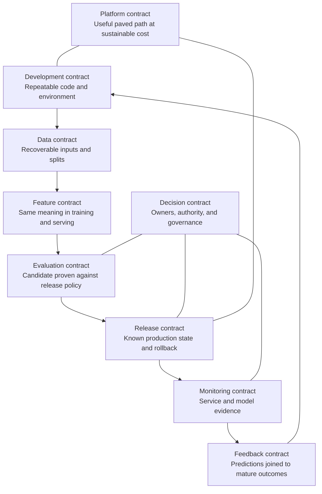
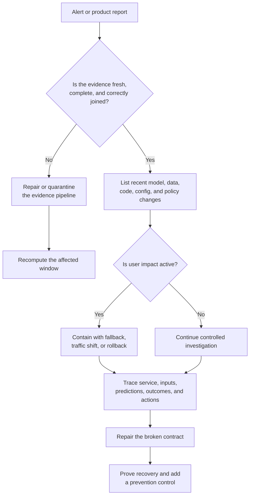
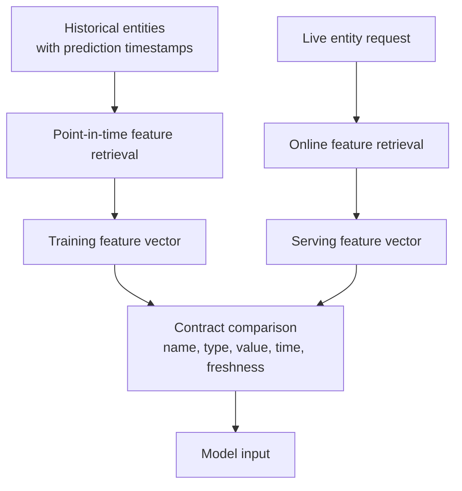
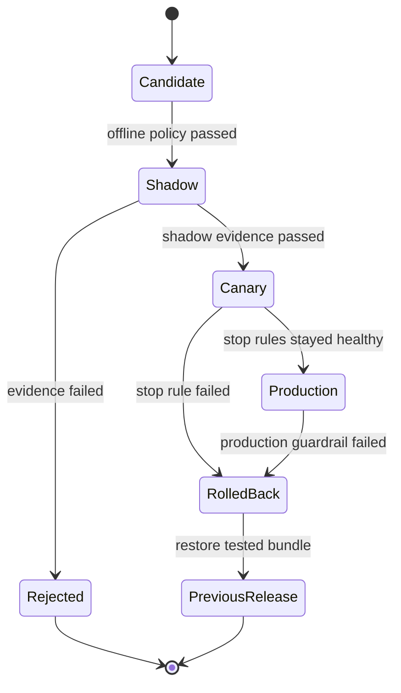
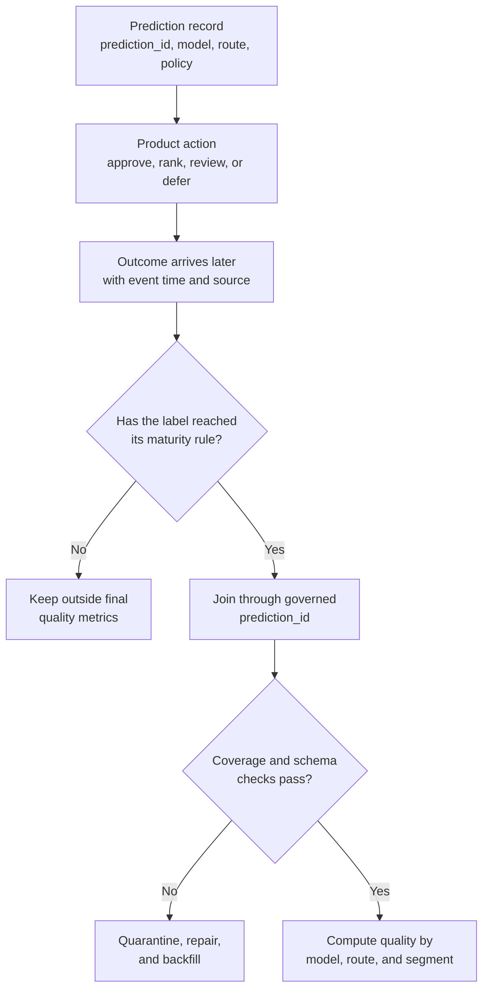
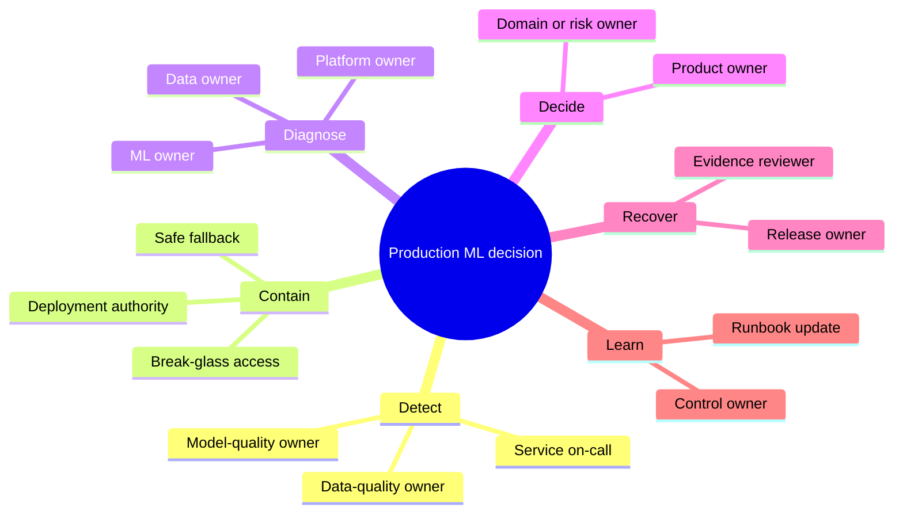
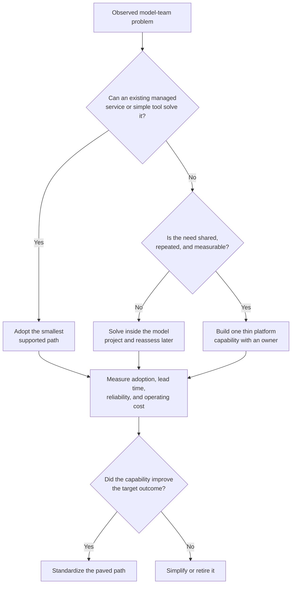

## Table of Contents

1. [Why ML Systems Fail Between Workflow Stages](#why-ml-systems-fail-between-workflow-stages)
2. [How To Investigate A Suspected Model Failure](#how-to-investigate-a-suspected-model-failure)
3. [What Can Fail During Development And Data Preparation](#what-can-fail-during-development-and-data-preparation)
4. [What Can Fail During Evaluation And Release](#what-can-fail-during-evaluation-and-release)
5. [What Can Fail In Monitoring And Feedback](#what-can-fail-in-monitoring-and-feedback)
6. [What Can Fail In Ownership And Platform Design](#what-can-fail-in-ownership-and-platform-design)
7. [Test Failure And Recovery Before Release](#test-failure-and-recovery-before-release)
8. [The Main Idea](#the-main-idea)
9. [References](#references)

## Why ML Systems Fail Between Workflow Stages
<!-- section-summary: Recurring MLOps failures usually appear where one lifecycle stage hands code, data, evidence, a release, or a decision to another stage. -->

Many ML failures appear where work moves from one lifecycle stage or team to another. An **MLOps failure mode** is a recurring way for the machine-learning system around a model to break. Some failures are loud: a training job crashes, an endpoint returns errors, or a feature table stops updating. Others are quiet: the service returns a valid score on every request while the score slowly loses contact with the real world.

The quiet failures make production ML unusual. A normal API health check can prove that a process is running and still say nothing about the quality of its decisions. A model may load successfully while reading stale features. An evaluation report may look excellent because the labels accidentally leaked future information. A monitoring chart may report a sudden quality drop because the outcome join broke, even though the model itself stayed stable.

These problems rarely belong to the model file alone. They appear at the boundaries between people and systems:

- exploration hands code to automation;
- data pipelines hand a dataset to training;
- training hands feature expectations to serving;
- evaluation hands evidence to a release decision;
- a registry hands an approved candidate to deployment;
- production hands predictions to monitoring;
- the real world hands delayed outcomes back to the team;
- an alert hands a decision to an owner;
- a platform hands capabilities to model teams.

Each handoff needs a **contract**. In plain language, a contract states what is being passed, how the receiving stage can verify it, who owns the decision, and what happens if the evidence fails.



This contract view changes the investigation. “The model is bad” is too broad to guide an incident. “The online feature vector no longer matches the training feature contract” points to evidence, an owner, a containment action, and a repair.

The same view also prevents tool shopping from taking over. MLflow can preserve run and model evidence. Delta Lake or Apache Iceberg can give data a recoverable version. Feast can support point-in-time feature retrieval. OpenTelemetry can carry service telemetry. The team names the contract first, then selects the tool that can enforce it.


*Recurring failures often reveal a missing contract at a lifecycle handoff. Identity, evidence, ownership, and a return path make the handoff operable.*

## How To Investigate A Suspected Model Failure
<!-- section-summary: A reliable investigation validates the evidence first, identifies recent changes, separates service health from prediction quality, and contains user impact before making a model decision. -->

A production alert creates pressure to act quickly. Retraining or rolling back immediately can make the incident worse if the alert itself came from a stale monitoring job, a broken label feed, or a failed prediction-to-outcome join.

The first pass checks **evidence integrity**. Confirm that monitoring jobs ran on time, expected fields still exist, prediction and label volumes are plausible, outcome joins cover the mature population, and the dashboard uses the current metric and policy versions. A quality chart built from five percent of yesterday's outcomes cannot support a release decision.

The second pass checks the **change window**. Look for a new model version, serving image, feature pipeline, data source, threshold, routing rule, product policy, or dependency. Many apparent model incidents are system changes that happened near the same time.

The third pass separates the layers of the live system:

1. **Service health** asks whether requests or batch records enter, run, and finish on time.
2. **Input health** asks whether schemas, units, categories, freshness, and feature availability still meet the contract.
3. **Prediction health** asks whether score distributions, confidence, abstention, and action rates changed.
4. **Outcome quality** compares predictions with mature labels for the overall population and important segments.
5. **Product impact** checks the action produced by the model, including overrides, review capacity, complaints, losses, and safety guardrails.

Only the last two layers can directly confirm a loss of prediction quality. The earlier layers often explain why that loss occurred.



Containment protects users while the team investigates. An online decision service may route traffic back to a proven model, disable a risky automated action, or use a conservative rules-based fallback. A batch pipeline may stop publication and preserve the previous complete output. The safest action depends on the product, which is why fallback behaviour needs approval before an incident.

Recovery also needs evidence. A green deployment status proves that a change finished. It does not prove that the original failure disappeared. The team should rerun the failed contract check, compare the repaired window with a known-good baseline, confirm the user-facing signal, and watch the system through an agreed observation period.


*The investigation validates evidence and recent changes before assigning blame. Containment runs in parallel so user impact does not wait for a complete root-cause analysis.*

## What Can Fail During Development And Data Preparation
<!-- section-summary: Notebook-only work, unreproducible datasets, and training-serving skew arise before release because executable code, data identity, or feature meaning was never made explicit. -->

Development and data preparation fail when a training result depends on knowledge held only in a person's session, a mutable data location, or one implementation of a feature. The model may look valid, yet another system cannot recreate the conditions that produced it.

### 1. Notebook-Only Work Leaves Production Without A Reproducible Program

A notebook is a productive place to explore data, draw charts, test features, and compare models. Production lacks a reproducible program if the interactive session itself is used as the execution interface.

**What the team sees.** A scheduled notebook succeeds only on its author's workspace. Restarting the kernel changes the result. Cells have to run in a remembered order. A local package or manually edited CSV is missing from the automated job. An incident investigator finds the final model artifact but cannot identify the exact command that created it.

**Why the system behaves this way.** A notebook can carry hidden state in memory and local files. Installed packages, credentials, and manual steps add more hidden dependencies. Automation needs every dependency to arrive through a declared interface. The development contract is broken because code and configuration were mixed together, the runtime was undeclared, and input or output locations lived only in the author's session.

**Find the break in a clean environment.** Start from a fresh clone and an empty runtime. Run the notebook from top to bottom, then execute the intended production entry point. Record the Git revision, dependency lock, resolved configuration, data reference, secret references, and produced artifact. Any step that depends on memory or a person's workstation will surface during this rehearsal.

**Repair the execution path.** Keep the notebook for investigation and explanation. Move stable transformations and training into importable Python modules. Give evaluation and artifact logging their own callable boundaries. Put run parameters in reviewed configuration. Lock Python dependencies with `uv.lock` or a Poetry lock file. Add a container only if system libraries or deployment portability require one.

A managed training job is a good default for isolated compute and durable logs. Workflows with several recoverable tasks need an orchestrator. Airflow is common in established enterprises, Dagster is a strong greenfield choice, and Prefect offers another Python-oriented path. A managed ML pipeline may be the better fit for a team already committed to one cloud ML platform.

A clean CI job can exercise the same entry point used by production:

```bash
uv sync --frozen
uv run pytest -q
uv run python -m risk_model.train --config configs/ci-smoke.yml
uv run python -m risk_model.verify_artifact build/model
```

The smoke configuration should use a tiny governed dataset and a cheap model. Its purpose is to prove imports, contracts, artifact creation, and artifact loading. Full training remains in managed compute.

**Keep it fixed.** Require every candidate to point to its code revision and lockfile or image digest. Preserve the resolved configuration and data identity beside it. The run ID connects that evidence to the produced artifact URI.

MLflow Tracking is a common evidence layer. Parameters and metrics explain how one execution behaved. Dataset references and code versions identify its inputs, while artifacts preserve its outputs. The CI system should reject a lockfile mismatch, a failing contract test, or an artifact that the target runtime cannot load.

### 2. Mutable Training Data Produces Unrepeatable Runs

Mutable training data can produce different models from the same code. For example, the rows underneath `training.customer_features` may change between executions. A table name identifies a location, while a reproducible run needs one historical state.

**What the team sees.** An old model cannot be investigated against its original examples. A rerun uses more recent corrections and produces different metrics. Train and test membership changes after a random split. An old Delta or Iceberg snapshot number exists in the run record, yet retention has already removed the required files.

**Why the system behaves this way.** The run recorded a mutable path without its snapshot, extraction boundary, transformation revision, or split membership. Late-arriving events and corrected labels quietly changed the population. The training-input contract therefore lost the exact evidence that the model learned from.

**Investigate from storage toward training.** Check whether the source snapshot still exists and can be read. Then verify the extraction query or transformation revision, event-time cutoff, label-maturity rule, schema version, and stable entity membership for every split. Lineage can identify upstream jobs and datasets, although lineage alone cannot recover deleted data.

**Repair the data identity.** The storage system should provide a durable address:

- Delta Lake or Apache Iceberg can identify a table version or snapshot.
- Object storage can use immutable object versions, partition manifests, and checksums.
- A warehouse can materialize an approved training population or provide supported snapshot semantics.
- Restricted data can keep a governed reference and digest instead of copying sensitive rows into experiment storage.

A compact manifest binds those parts:

```yaml
dataset: payment_risk_training
source:
  table: governed.risk.payment_events
  snapshot_id: "iceberg-638491772"
population:
  query_commit: "8a41c9e"
  event_time_cutoff: "${TRAINING_CUTOFF}"
  label_maturity_days: 30
splits:
  method: grouped_time_split
  train_manifest: "s3://ml-manifests/payment/train-7bc2.parquet"
  validation_manifest: "s3://ml-manifests/payment/validation-5e18.parquet"
```

The run resolves `TRAINING_CUTOFF` to one timestamp and stores that resolved value with the manifest. A later execution therefore cannot slide the historical boundary forward without creating a new dataset identity.

MLflow dataset tracking can store the source, digest, schema, and profile beside the run. OpenLineage provides a standard model for jobs, runs, input datasets, and output datasets across orchestration and processing systems. The underlying lakehouse, warehouse, or object store still owns retention and access control.

**Keep it fixed.** Retention must cover the organisation's investigation, rollback, and audit window. Automated checks should prove that every production candidate references an accessible snapshot and stable split manifests. A missing snapshot should block promotion because the team would have no reliable way to investigate that model later.

### 3. Training And Production Compute Different Feature Values

Training and production can compute different values for what appears to be the same feature. This failure is called **training-serving skew**. The input may still have the expected name and data type, which lets the problem stay quiet.

A fraud model might learn `transactions_last_24h` from event timestamps during training. The online service may calculate the same feature from processing time, exclude late events, or return zero after an online-store timeout. The column name matches. The model sees a different world.

Four common forms help locate the problem:

- **Transformation skew** uses different code, category mapping, units, or feature order.
- **Temporal skew** lets training see information that was unavailable at the historical prediction time.
- **Freshness skew** serves a value older than the maximum age assumed during training.
- **Fallback skew** replaces missing online values with defaults that the training population rarely contained.



**What the team sees.** Offline evaluation remains stable while production errors rise. The gap concentrates around unknown categories, cold entities, one serving route, or periods of high feature-store latency. Retraining on recent data produces little improvement because the production feature path still carries the defect.

**Find the break one prediction at a time.** Select a production `prediction_id` and reconstruct the exact feature vector used online. Recreate the vector through the historical training path at the same event time. Compare feature names, order, types, units, values, source timestamps, freshness, and defaults. Repeat this for a normal case, a failed case, a cold entity, and an unknown category.

**Repair the feature path.** Share deterministic transformation code between training and serving where the latency model allows it. Batch feature definitions often live in SQL and dbt, Spark for distributed processing, or Polars for efficient single-machine work.

Feast or a managed feature platform earns its place after several models need reusable features and point-in-time training retrieval. Low-latency online values provide another strong reason. Feast's point-in-time joins select the historical feature state relative to each entity timestamp, which protects training from future information.

High-risk online features also need explicit fallback policy. A missing fraud velocity feature might route the transaction to review. Quietly replacing it with zero could make a risky transaction appear safe.

**Keep it fixed.** Store a model signature, feature-schema version, and feature source with the candidate. Run golden fixtures through offline and online transformation paths and compare results within an agreed tolerance. Shadow traffic can calculate both old and new feature paths before a release, giving the team real production comparisons without changing user decisions.

## What Can Fail During Evaluation And Release
<!-- section-summary: Weak evaluation approves the wrong candidate, while release and rollback gaps leave the team unable to identify or safely change the model state serving users. -->

Evaluation can approve the wrong model, and release automation can deploy an incomplete production package. Training creates a candidate, evaluation decides whether it is suitable for a product route, and release changes that route. Treating those three actions as one step allows an impressive experiment score to bypass product guardrails and operational proof.

### 4. Weak Evaluation Hides Important Model Failures

Weak evaluation can hide a serious failure behind one strong average metric. A production evaluation asks a decision question: **is this specific candidate safe and useful enough to replace the current production behaviour for its intended population?**

**What the team sees.** Overall accuracy improves while a high-risk region gets worse. A ranking model raises click-through rate but reduces completed purchases. A medical outreach model looks strong because its test set includes immature labels. An accurate model takes longer than the product latency budget. A threshold chosen by the data scientist overwhelms the human review queue.

**Why the system behaves this way.** The evaluation population, baseline, segments, metric definitions, thresholds, and guardrails were never combined into a release policy. The team optimized a statistical summary and left the operational decision implicit.

**Check evaluation integrity before reading the score.** Confirm the dataset snapshot and split logic first. Then verify label maturity, leakage controls, and sample size. Compare the candidate and current model on the same exact rows.

Inspect important segments and threshold behaviour next. Calibration checks whether predicted probabilities match observed frequencies. Latency and resource use test the serving budget. Product constraints test review capacity, safety limits, or other consequences of the action. A tiny segment needs uncertainty intervals or accumulated evidence; a single unstable percentage can mislead the review.

**Repair the decision policy.** Store a versioned evaluation policy beside the pipeline:

```yaml
policy_id: payment-risk-release-v7
population: card_present_transactions
baseline: deployed_model
primary:
  metric: recall_at_review_capacity
  minimum_improvement: 0.015
guardrails:
  - metric: precision
    minimum: 0.40
  - metric: p95_inference_ms
    maximum: 80
segments:
  - new_accounts
  - cross_border
  - high_value
online_proof:
  mode: shadow_then_canary
```

MLflow can attach metrics to a logged model and a named dataset, which lets reviewers compare candidates on matching evidence. Managed registries or MLflow Model Registry can hold approval tags and immutable versions. The pipeline should evaluate the policy automatically and preserve the full report, including failed guardrails.

Offline proof remains limited because production contains live traffic, dependency behaviour, and product responses. Shadow evaluation compares outputs without changing decisions. A canary sends a small, controlled share of real traffic to the candidate and applies pre-agreed stop rules.

**Keep it fixed.** Version metric code and policy together. Require a baseline comparison and segment checks for every candidate. Runtime and product guardrails protect the live decision path. A policy exception needs an owner and reason, plus an expiry and compensating control. After release, compare online results with the assumptions written into the evaluation report.

### 5. Incomplete Release Records Make Rollback Unsafe

Rollback is unsafe if the release record identifies only the model version. A registry can contain an approved model while production still serves an older artifact. A deployment can use the intended model and the wrong feature schema. A rollback can restore yesterday's model inside today's incompatible serving image.

**What the team sees.** During an incident, three dashboards report three versions. Nobody knows which registry alias the endpoint resolved. The previous model exists, but its image was deleted or its feature contract is no longer supported. Traffic returns to the old model and continues using the new decision threshold, so the original behaviour is never restored.

**Why the system behaves this way.** The model, image, feature contract, preprocessing code, policy configuration, and traffic route changed independently. The release lacked one immutable record that bound them together.

**Trace desired state to observed state.** Start with the user-facing route. Resolve its current traffic weights and endpoint revision. From there, identify the container digest, immutable model version, feature-schema version, policy version, and infrastructure revision. Compare that observed state with the approved release record and audit every change inside the incident window.



**Repair the release path.** Build an immutable release bundle that records:

- model registry identity and exact version;
- artifact checksum and serving image digest;
- feature and request-schema versions;
- decision-policy configuration;
- evaluation report and approval;
- infrastructure revision and traffic route;
- tested rollback release.

Registry aliases such as MLflow's `champion` are useful human-facing pointers. The deployment record should resolve the alias to an immutable model version so an alias change cannot silently alter a running release.

Managed endpoints are a practical default because they support versioned deployments, logs, health checks, and traffic splitting without a team operating its own serving control plane. KServe, Kubernetes, and Argo Rollouts fit organisations that already run and support a Kubernetes platform. The release mechanism should promote in stages, enforce stop rules, and retain the previous healthy bundle.

**Keep it fixed.** Rehearse rollback before full promotion. The test should change traffic, load the previous bundle, send representative requests, confirm feature compatibility, and verify recovery through user-facing signals. Preserve artifacts and images for the full rollback window. A written rollback target that cannot load is only a label.

## What Can Fail In Monitoring And Feedback
<!-- section-summary: Silent model failure and defective feedback occur because the production system returns valid responses while telemetry, input health, outcomes, or joins stop representing reality. -->

Monitoring and feedback can fail even while the prediction service remains online. Production introduces facts that offline evaluation cannot supply: real request paths, live feature availability, user behaviour, interventions, and delayed outcomes. Monitoring has to connect those facts without confusing a broken evidence pipeline with a broken model.

### 6. A Healthy Endpoint Can Still Return Poor Predictions

A healthy endpoint can continue returning well-formed outputs while its predictions lose quality or usefulness. This condition is called **silent model failure**. The endpoint may return `200 OK`, stay under its latency target, and pass schema validation throughout the decline.

A demand forecast offers a simple example. A new promotion changes buying behaviour. The service still receives valid product IDs and returns numeric forecasts. Warehouse teams discover the problem through stockouts several days later. Service health remained green because the prediction process worked exactly as implemented.

**What the team sees.** Score distributions move, action rates change, confidence rises unexpectedly, one segment loses quality, or business outcomes deteriorate. Sometimes no alert fires because the monitoring job is stale or the production service never logged the model and feature identities needed for analysis.

**Find the failing layer.** Verify telemetry and monitoring-job freshness first. Check traffic, latency, errors, saturation, and dependency traces next. Then inspect schema, feature freshness, missing values, unknown categories, input distributions, score distributions, and action rates. Mature labels and product outcomes come last because they often arrive later.

OpenTelemetry is the common instrumentation standard for traces, metrics, and logs. A **trace** follows one request through its work. A **span** records one timed operation inside that trace, such as a feature lookup or model call. OpenTelemetry generates, collects, and exports the telemetry. Prometheus and Grafana, a cloud monitoring service, or another observability backend stores and presents it.

A focused span can preserve the production identities needed during investigation:

```python
with tracer.start_as_current_span("model.predict") as span:
    span.set_attribute("ml.model.name", model_name)
    span.set_attribute("ml.model.version", model_version)
    span.set_attribute("ml.feature.schema", feature_schema)
    prediction = model.predict(features)
```

Avoid raw feature values, personal data, and unbounded identifiers in telemetry attributes. A `prediction_id` belongs in a governed prediction record and may appear in sampled logs or traces under the organisation's privacy and cardinality rules.

**Repair monitoring as a layered system.** Service telemetry covers request and batch execution. Data-quality jobs cover schema, freshness, missingness, and important distributions. Prediction monitoring covers score, confidence, abstention, and action rates by model route and segment. Outcome monitoring joins mature labels to predictions and calculates approved quality metrics. Product monitoring measures the consequence of the final action.

An alert needs an owner and a response. High endpoint error rate may trigger traffic failover. A missing critical feature may invoke a safe product fallback. A stable service with degraded mature-label quality may pause promotion, roll back, or open a controlled investigation. Retraining only helps after evidence points to a model that no longer fits valid current data.

**Keep it fixed.** Monitor the monitors: job completion, evidence freshness, row counts, schema versions, join coverage, and alert delivery. Record model, feature, policy, and route identities with each prediction. Review dashboards against real incidents so the team can remove noisy signals and fill genuine blind spots.

### 7. Broken Outcome Data Produces Misleading Quality Metrics

Broken or immature outcome data can make model-quality metrics look better or worse than reality. Outcomes may arrive days or months later, change after review, or never arrive for some decisions. A label pipeline can therefore create a convincing false alarm or hide a real regression.

Consider a loan-default model. A prediction made today cannot receive a mature default outcome tomorrow. Early rows are right-censored: the observation window has not finished. A marketing model has a different problem because the product action influences the outcome. A customer who receives an offer cannot reveal what would have happened without the offer.

**What the team sees.** Measured quality suddenly falls at the newest edge of the dashboard. Join coverage drops after an identifier format change. One model route appears much better because its labels arrive sooner. Human reviewers revise labels, but the quality table keeps the original value. A retraining job learns from interventions created by the previous model and treats them as ordinary ground truth.

**Investigate the outcome evidence in a fixed order.** Check monitoring-job freshness, label schema, label volume, maturity rules, prediction-to-outcome join coverage, and policy versions. After those pass, compare segments, model routes, feature health, action rates, and recent releases. This order protects the team from rolling back a healthy model because its outcome feed broke.



A small coverage query often catches the defect before a metric calculation:

```sql
SELECT
  p.model_version,
  p.model_route,
  COUNT(DISTINCT p.prediction_id) AS mature_predictions,
  COUNT(DISTINCT o.prediction_id) AS joined_outcomes
FROM prediction_records p
LEFT JOIN mature_outcomes o
  ON p.prediction_id = o.prediction_id
WHERE p.prediction_time < :maturity_cutoff
GROUP BY p.model_version, p.model_route;
```

The governed `mature_outcomes` table should contain one approved current outcome per prediction. Distinct counts keep accidental duplicates from inflating coverage, while grouping by model version and route exposes a broken serving path.

**Repair the outcome path.** Write a governed prediction record at decision time with `prediction_id`, model and route identity, prediction timestamp, feature timestamp, policy version, output, and action. Keep sensitive source data in access-controlled systems and join through reviewed identifiers. Define label provenance, maturity, revision rules, and exclusion policy. Quarantine defective windows, repair the source or join, backfill the affected records, and recompute quality before changing the model.

Intervention bias needs product and statistical review. Randomized holdouts, shadow predictions, causal methods, or carefully designed observational comparisons may be needed to estimate the effect of a model-driven action. A feedback table alone cannot recover a counterfactual outcome.

**Keep it fixed.** Alert on label freshness, revision rate, maturity volume, join coverage, segment coverage, and unknown policy versions. Version label logic and quality metric code. Keep raw outcome events and derived labels separate so corrected policy can rebuild the evidence.

## What Can Fail In Ownership And Platform Design
<!-- section-summary: Governance gaps leave incidents without decision authority, while platform overbuilding spends operational capacity on components that model teams do not yet need. -->

Ownership and platform-design failures produce direct technical consequences. An alert without an empowered owner stays open. A rollback permission that nobody holds extends user impact. A custom platform with too many components creates more handoffs than the team can operate.

### 8. Missing Decision Owners Delay Incident Response

Incident response slows down when nobody owns the decision to contain, repair, or restore the system. Production ML crosses several technical teams: data owners protect source meaning, ML owners protect model evidence, software owners protect the application path, and platform owners protect the runtime.

Product, security, and domain-risk teams own other parts of the decision. Shared work needs shared evidence, but each decision still needs one accountable owner.

**What the team sees.** The platform team owns endpoint uptime, the ML team owns model metrics, and the product team owns the action. An alert touches all three and sits unclaimed. The on-call engineer identifies a harmful release but lacks permission to move traffic. A regulated model has evaluation evidence, yet nobody can confirm who approved the intended use or exception.

**Why the system behaves this way.** Asset ownership, operational response, and decision authority were treated as the same role or left implicit. Governance existed as a document review instead of an executable path through identity, approval, deployment, monitoring, and incident response.



**Find the ownership break.** Start from the affected route or model in the catalog. Identify the named owner, pager destination, deployment authority, data owner, product decision owner, and risk approver. Compare the runbook with real IAM permissions. A team name in a model card has little value if nobody on call can perform the documented containment action.

**Repair governance through the workflow.** Give every production model and critical dataset an accountable owner. Route alerts to a staffed rotation. Define who may pause automation, shift traffic, approve risk, repair data, and declare recovery. Use workload identity and least-privilege roles for normal automation. Keep a time-limited, audited break-glass path for urgent recovery.

A model card or registry record should preserve intended use, excluded use, owners, training and evaluation evidence, known limits, risk tier, and approval state. A data catalog should preserve ownership, access policy, lineage, and classification. CI/CD gates should check required evidence before promotion. These controls turn governance into the normal release path.

**Keep it fixed.** Run incident game days with the real pager, permissions, dashboards, fallback, and rollback target. Track time to detect, time to contain, and missing authority. Ownership reviews should follow organisational changes so retired teams and stale groups do not remain attached to critical assets.

### 9. An Oversized ML Platform Slows Delivery

An oversized ML platform can make model delivery slower and harder to operate. A platform should shorten the path from reviewed code and governed data to a safe production release, while keeping its own integration and on-call burden within the team's capacity.

**What the team sees.** A platform group builds custom Kubernetes operators, a feature store, registry, workflow engine, metadata service, and monitoring portal before one model has completed the full lifecycle. Several teams adopt different overlapping tools. Upgrades consume the platform roadmap, while users still copy model files manually or wait weeks for a deployment.

**Why the system behaves this way.** The architecture was designed around imagined scale instead of observed constraints. Platform components were selected individually, without counting the integration work, on-call load, upgrade burden, security surface, and cognitive cost created by the full stack.

**Investigate actual demand.** Start with the models in production and the way each one serves predictions. Record how often they train and how quickly they must answer. Data size and accelerator demand reveal the real compute pressure.

Add compliance boundaries and the skills already available inside the team. Then trace one model from commit to recovery. Waiting time reveals bottlenecks, manual handoffs reveal missing automation, and failure rate reveals fragile boundaries. A component deserves investment after this evidence identifies a shared constraint.



**Repair with a thin industrial path.** A practical starting point uses Git and CI for reviewed changes, plus Python with `uv` for a locked application environment. Add a container where packaging needs one. Keep training data in governed object or table storage and use a managed training job. MLflow or managed tracking preserves run evidence; a managed registry preserves candidate identity. Managed batch or online serving reduces control-plane work. OpenTelemetry with cloud monitoring covers service telemetry, while Terraform gives infrastructure a reviewable definition.

Add an orchestrator after the workflow needs coordination across real tasks and owners. Airflow is a common enterprise baseline, Dagster is a strong greenfield choice, and Prefect provides another Python-oriented option.

A feature store earns its cost after several models need shared definitions and point-in-time history. Reliable online retrieval provides another reason to add one.

Kubernetes and KServe fit a team that already owns a Kubernetes platform. Ray Serve supports distributed Python inference. Triton targets optimized multi-framework serving, while vLLM targets high-throughput language-model inference. Those systems belong after a specific need for scale, hardware control, model type, or portability exceeds the managed path.

Every platform addition needs an owner, service objective, upgrade plan, and security model. Cost limits and exit criteria give the team a way to simplify a capability that fails to earn its operating burden.

**Keep it fixed.** Measure model-team lead time, deployment frequency, recovery time, platform reliability, adoption, and operating cost. Retire overlapping paths. Provide one documented paved road with supported escape hatches. Platform scope should follow repeated production evidence.

## Test Failure And Recovery Before Release
<!-- section-summary: Failure drills prove that evidence, authority, fallback, rollback, and recovery work together under realistic production conditions. -->

Before release, the team should test whether it can detect, contain, repair, and verify a known failure. A **failure drill** is a controlled exercise for that purpose. Real users stay outside the exercise, while the team uses the actual monitoring path, release mechanism, permissions, fallback, and recovery evidence.

Change one contract per drill. Introduce a stale feature timestamp into a staging route and confirm that the feature check stops the decision or invokes the approved fallback. Break an outcome join and confirm that join-coverage monitoring blocks the quality report. Point a canary at an incompatible feature schema and confirm that contract tests prevent promotion. Remove access to a rollback artifact and confirm that the readiness check catches the missing dependency before release.

The drill record can stay compact:

```yaml
drill: rollback-after-feature-contract-failure
scope: staging-traffic-route
injection: candidate expects feature-schema-v9; route provides v8
expected:
  detect_within_minutes: 5
  user_action: keep baseline route
  promotion: blocked
  evidence: contract-test and route telemetry
owners:
  contain: serving-oncall
  repair: feature-platform
  decide: risk-product-owner
proof:
  - baseline responses remain valid
  - candidate receives no production traffic
  - corrected candidate passes the same contract check
```

Record the time to detect, contain, diagnose, recover, and prove recovery. Capture missing data, noisy alerts, stale documentation, inaccessible artifacts, and permission gaps. Assign each gap to a named owner and rerun the failed part after the repair.

Drills should also test ordinary operational failures. A batch job can receive an empty partition, duplicated input, or partial publication. An online service can lose its feature dependency or exhaust GPU memory. A feedback pipeline can receive delayed and revised labels. These exercises give the team safe evidence about which controls work before users depend on them.

## The Main Idea
<!-- section-summary: Reliable MLOps comes from explicit lifecycle contracts that preserve evidence, support containment, guide repair, and prove recovery. -->

Production ML failures feel confusing if every alert is reduced to “the model is wrong.” The lifecycle-contract framework gives each recurring failure a clearer shape.

Notebook-only work breaks the execution contract. Mutable datasets break reproducibility. Training-serving skew breaks feature meaning. Weak evaluation breaks candidate approval. Release gaps break production-state control. Silent failure breaks monitoring. Label defects break feedback. Ownership gaps break decision authority. Platform overbuilding breaks delivery.

Every strong response follows the same discipline: validate the evidence, locate the broken handoff, contain user impact, repair the system through a supported industrial path, prove recovery at the user-facing boundary, and add a control that catches the same failure earlier.


*Repair changes the system. Recovery proof shows that the original failure is gone and the user-facing behavior is healthy through the agreed observation window.*

## References

- [Google Cloud: MLOps continuous delivery and automation pipelines in machine learning](https://docs.cloud.google.com/architecture/mlops-continuous-delivery-and-automation-pipelines-in-machine-learning) - Covers data and model validation, pipeline automation, metadata, continuous delivery, online validation, and production monitoring.
- [Google for Developers: Rules of Machine Learning](https://developers.google.com/machine-learning/guides/rules-of-ml/) - Gives production guidance on testing infrastructure, training-serving consistency, feature behaviour, and monitoring.
- [MLflow: Tracking](https://mlflow.org/docs/latest/tracking) - Documents runs, experiments, logged models, metrics, parameters, artifacts, and dataset-aware model evidence.
- [MLflow: Dataset Tracking](https://mlflow.org/docs/latest/dataset/) - Documents dataset source, digest, schema, profile, and lineage metadata attached to ML work.
- [MLflow: Model Registry Workflows](https://mlflow.org/docs/latest/ml/model-registry/workflow/) - Documents registered model versions, aliases, tags, and model retrieval.
- [Feast: Point-in-time joins](https://docs.feast.dev/getting-started/concepts/point-in-time-joins) - Explains historical feature retrieval relative to each entity timestamp.
- [OpenTelemetry: What is OpenTelemetry?](https://opentelemetry.io/docs/what-is-opentelemetry/) - Defines the vendor-neutral framework for generating, collecting, and exporting traces, metrics, and logs.
- [OpenLineage: Object Model](https://openlineage.io/docs/spec/object-model) - Defines standard dataset, job, run, and lineage-event concepts for data pipelines.
