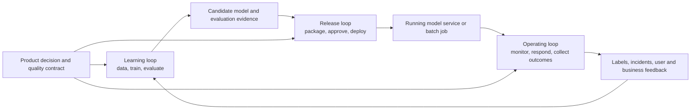
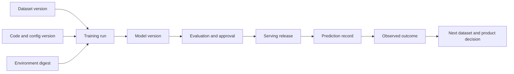

## MLOps Connects Model Development to Production
<!-- section-summary: MLOps is the engineering and operating practice that makes model development, release, production use, and improvement repeatable and accountable. -->

**MLOps**, short for **machine learning operations**, is the engineering and operating practice that gives a machine-learning system a repeatable path from a product question to a production outcome. It connects data, training, evaluation, release, serving, monitoring, feedback, and ownership around one model-powered decision.

Imagine **CityEats**, a meal-delivery product that predicts how many minutes a restaurant will need to prepare an order. A data scientist can train a useful model in a notebook. The product still needs a reliable answer to many connected questions. Which historical orders trained this version? Which feature definitions produced the inputs? Which evaluation allowed the model to ship? Which service loads it? How does the team detect a change in restaurant behaviour? Who can pause the release and restore the previous version?

MLOps gives the team an operating system for those questions. That system includes software and infrastructure, along with review rules, versioned evidence, ownership, and incident response. MLflow, Kubeflow, SageMaker AI, Vertex AI, Azure Machine Learning, Databricks, and other platforms can supply useful parts. The team still defines the product decision, quality bar, responsibilities, and acceptable risk.

This scope is wider than deploying a model file. A production ML system includes the data and code that create the model, the runtime that uses it, the surrounding product logic, and the feedback that eventually tells the team whether its predictions helped. MLOps coordinates that full lifecycle.

## The Big Picture: Three Connected Loops
<!-- section-summary: The MLOps lifecycle has a learning loop, a release loop, and an operating loop connected by versioned assets and evidence. -->

A useful framework has three connected loops. Each loop answers a different question, produces different evidence, and has a different rhythm.

The **learning loop** asks whether the available data can support a useful model for a product decision. Teams define examples and labels, build features, train candidates, compare metrics, inspect failure cases, and record experiments. Its output is a candidate model with evidence about where it works and where it struggles.

The **release loop** asks whether one exact candidate can enter production safely. Teams package the runtime, register the model, verify input and output contracts, review risk, test in a production-like environment, expose a small amount of traffic, and preserve a rollback target. Its output is a traceable release rather than a loose model file.

The **operating loop** asks whether the running system remains healthy and useful. Teams monitor service reliability, feature health, prediction behaviour, delayed labels, user impact, and incidents. Its output includes alerts, incident decisions, production evidence, and the reason for the next model or product change.



CityEats uses the learning loop to train preparation-time models from completed orders. It uses the release loop to replay one candidate against recent traffic, run it in shadow mode, and expose a small city canary. It uses the operating loop to watch endpoint latency, missing menu features, courier wait time, support reports, and prediction error after actual preparation times arrive.

All three loops share a **product contract**: what the model predicts, when it predicts it, who or what uses the result, and what good performance means. CityEats predicts preparation minutes when a restaurant accepts an order. That statement fixes the prediction time, the label, the information allowed at that time, the serving latency, and the product action. Moving the prediction to checkout would change the available information and require a new data and evaluation review.

This framework keeps tools in their proper place. An experiment tracker supports the learning loop. A registry connects a candidate to release evidence. Kubernetes or a managed endpoint can run the serving path. Prometheus, OpenTelemetry, warehouse checks, and model-monitoring systems support operations. Each tool owns a part of the lifecycle; the responsibility remains understandable even when a team changes vendors.

## Why Machine Learning Needs More Than Normal CI/CD
<!-- section-summary: ML keeps normal software-delivery needs and adds changing data, learned behaviour, delayed outcomes, and feedback effects. -->

Machine-learning systems still need normal software engineering. Teams use version control, tests, build artifacts, deployment automation, observability, security controls, and incident response. The ML lifecycle adds uncertainty through data and learned behaviour.

First, a trained model depends on **code, data, configuration, and runtime together**. The same Git commit can produce a different model after a dataset rebuild, dependency upgrade, seed change, or hardware change. A reproducible run therefore records every material input, including the dataset identity and environment.

Second, many model outputs have no single expected answer that a unit test can assert. A preparation-time prediction of 18 minutes and one of 19 minutes may both be reasonable. Teams combine software tests with data contracts, training smoke tests, baseline comparisons, segment metrics, calibration checks, robustness tests, and product guardrails. Evaluation needs to reflect the cost of errors in the product.

Third, the real outcome often arrives later. CityEats produces an estimate when an order is accepted, while the actual preparation time appears after the kitchen finishes. During that delay, the team can inspect feature availability, score distributions, service errors, and fallbacks. Label-based quality arrives later and must join back to the original prediction.

Fourth, a prediction can influence the data the team later observes. CityEats may send a courier later after a high preparation-time estimate. The resulting courier wait reflects both restaurant behaviour and the product's response to the model. Production records need the model decision and intervention so future training data has an honest interpretation.

Fifth, model quality can vary sharply across groups that an overall average hides. A candidate can improve average error while getting worse for new restaurants or late-night orders. Release and monitoring evidence needs segments that match product risk, not only one headline score.

MLOps extends CI/CD with these ML-specific controls. **Continuous integration** still tests changes to code and pipeline components. **Continuous delivery** still moves reviewed artifacts through environments. Many ML systems also use **continuous training**, which runs a versioned training pipeline when approved data, code, or schedules trigger it. Continuous training creates a candidate; release gates still decide whether that candidate should serve users.

## The Lifecycle Runs on Versioned Assets
<!-- section-summary: Data, features, code, environments, runs, models, releases, predictions, and outcomes need stable identities so the lifecycle can be traced and repeated. -->

An ML system works with more assets than a conventional application release. The list usually includes source data, labels, dataset snapshots, feature definitions, training code, configuration, dependency environments, training runs, model artifacts, evaluation reports, serving images, deployment records, prediction logs, and later outcomes.

These assets need stable identities. A file called `model.pkl` says almost nothing about how it was produced or where it is running. A model version linked to a training run, dataset manifest, code commit, environment digest, and evaluation report gives the team a reviewable unit.



This chain is often called **lineage**. Lineage records how one asset derives from another. It lets an incident responder move from a bad prediction to the serving release, model version, training run, code, data, and evaluation that produced it. It also lets a reviewer move forward from a vulnerable package or bad data partition to every affected model and release.

A compact release record can connect the important identities:

```yaml
product_contract: prep-time-at-order-acceptance-v3
dataset_version: restaurant-prep-examples:2026-06-30-r2
training_run: prep-xgb-2026-07-04-0915
code_commit: 7d83a14
training_image: ghcr.io/cityeats/prep-train@sha256:32421559c392d95d
model_version: restaurant-prep-time:42
evaluation_report: s3://cityeats-ml/reviews/prep-time/42/report.json
serving_release: prep-api-2026-07-05.2
rollback_target: restaurant-prep-time:41
```

The syntax matters less than the links. A warehouse table, registry, metadata catalog, or managed ML platform can hold the record. The team should be able to query it automatically and verify that every release points to approved evidence and a recoverable previous version.

Large artifacts usually live in object storage or a lakehouse. Metadata systems store their identifiers, locations, checksums, schemas, and relationships. Registries add lifecycle controls around model versions. Experiment trackers capture run parameters, metrics, and artifacts. Data catalogs and lineage platforms cover broader data relationships. A team can start with a manifest and a few controlled tables, then adopt specialized systems as scale and governance needs grow.

## Repeatability Means Rebuilding the Process, Not Chasing Identical Bits
<!-- section-summary: A repeatable ML workflow records material inputs, runs the same stages, and explains expected sources of variation. -->

**Repeatability** means that a team can run the same defined process with known inputs and understand the result. For many ML workloads, exact byte-for-byte reproduction across hardware and library versions is unrealistic. Randomness, parallel execution, GPU kernels, and floating-point behaviour can create small differences.

The practical goal is a replay packet. It records the dataset snapshot, code commit, configuration, container or lockfile, random seeds, hardware class, framework versions, and commands or pipeline version. The team also records expected tolerances, such as an acceptable metric range or prediction agreement rate.

This evidence separates an explained variation from a broken process. If a replay on the same approved environment produces a large metric drop, the team has a reproducibility incident. If a newer GPU kernel changes the final decimal place while protected segments stay inside tolerance, the release evidence can record that difference.

Orchestration helps by turning notebook steps into named pipeline stages. Data validation, feature building, training, evaluation, registration, and packaging receive versioned inputs and produce versioned outputs. A failure can restart from an appropriate stage, and the trace shows which stage created each artifact.

## Evaluation and Gates Turn Metrics Into Release Decisions
<!-- section-summary: Evaluation measures model behaviour, while gates compare versioned evidence with product rules and decide whether a candidate may move forward. -->

An evaluation report describes how a candidate behaves. A **gate** applies explicit rules to that report and decides whether the candidate can cross a lifecycle boundary. The distinction keeps measurement separate from authority.

CityEats may compare candidate version 42 with production version 41. The candidate improves overall mean absolute error from 5.1 to 4.8 minutes, yet error for new restaurants rises from 7.6 to 8.9 minutes. The evaluation reports both results. A release gate blocks the candidate because the product contract protects new restaurants with an 8-minute maximum.

The gate needs a version, an owner, and a response. A data-quality gate can stop a bad dataset before training. A model-quality gate can block registration or promotion. A canary gate can freeze traffic expansion and restore the previous release. Each boundary protects a different asset and therefore needs a different recovery action.

Human review belongs where judgement or authority matters. A reviewer can inspect unusual segment tradeoffs, privacy evidence, or a high-impact use case. Automation should prepare a compact evidence packet rather than asking the reviewer to search across dashboards. The resulting decision records the subject, evidence versions, policy version, reviewer, time, reason, and expiry where appropriate.

Automated retraining follows the same rule. A schedule or drift signal can launch the learning loop. The resulting candidate still passes the current data, evaluation, security, and release gates. Retraining frequency and release frequency serve different purposes.

## Production Operation Covers Service, Data, Model, and Product Health
<!-- section-summary: Operating an ML system requires several layers of signals because a healthy endpoint can still produce harmful or stale predictions. -->

A model endpoint can return HTTP 200 while its predictions quietly lose value. MLOps operations therefore watch several layers of the system.

**Service health** covers latency, errors, saturation, queue depth, resource use, and dependency failures. **Data health** covers schema, missing values, freshness, ranges, category changes, and feature availability. **Prediction health** covers score distributions, confidence, fallback use, and protected slices. **Model quality** compares predictions with mature labels. **Product health** measures the user or business outcome the model was intended to improve.

The layers help teams locate a failure. A spike in missing menu features points toward the data path. Stable features with worsening error after a restaurant policy change point toward concept drift, where the relationship between inputs and outcomes has changed. Healthy model error with rising courier wait may point toward product routing or capacity rather than the model itself.

Every alert needs an owner, a threshold or detection rule, and a response. Some alerts trigger investigation. A few justify an automatic fallback or traffic rollback. Automatic retraining is rarely the first response to an unexplained quality change because a pipeline can learn from corrupted labels, broken features, or a temporary event.

Feedback closes the lifecycle. Prediction records join to later outcomes through stable IDs and timestamps. Human corrections, support reports, overrides, and incident labels can also contribute. Data and ML teams review how the product action influenced those outcomes before turning the records into new training examples.

## Ownership Connects the Technical Loops
<!-- section-summary: Clear decision rights keep data, models, platforms, products, security, and incidents from falling between teams. -->

MLOps crosses several disciplines. Data engineers may own source reliability and dataset construction. Data scientists may own problem formulation, features, training, and analysis. ML engineers may own repeatable pipelines, evaluation systems, packaging, and serving integration. Platform engineers may own shared compute, deployment, observability, and developer workflows.

Product owners define the decision, acceptable tradeoffs, and user outcome. Security, privacy, legal, risk, or domain specialists join according to the use case. Operations teams may supply labels and investigate real-world exceptions. Job titles vary, while the need for explicit decision rights stays constant.

Every important asset and transition should have one accountable owner. Someone owns the dataset contract, evaluation gate, registry policy, production alert, rollback action, and retirement decision. Several teams can contribute, yet an incident still needs a known group with authority to act.

Ownership also shapes access. A training job can read approved data and write artifacts. A release pipeline can deploy an approved version. An analyst can inspect evaluation evidence. A production service can read the active model. Least-privilege identities and audit records make these boundaries enforceable.

## A Small Team Can Start With a Complete Thin Path
<!-- section-summary: A useful first MLOps system covers the full lifecycle for one important model with simple tools and explicit evidence. -->

A small team needs complete responsibilities more than a large product catalog. The first useful target is one thin path from data to a running model and back to measured outcomes.

| Responsibility | Small-team implementation | Growth path |
|---|---|---|
| Version code and config | Git with reviewed configuration | Policy checks and protected branches |
| Identify datasets | Snapshot table or manifest with checksum | DVC, lakeFS, lakehouse versions, catalog and lineage |
| Run training | Containerized script on a scheduled job | Airflow, Dagster, Prefect, Kubeflow, Argo, or managed pipelines |
| Track experiments | MLflow or W&B with code, data, config, metrics, artifacts | Shared tracking service and automated evidence checks |
| Evaluate candidates | Versioned report compared with the production baseline | Segment gates, robustness suites, approval workflow |
| Record model versions | Registry or controlled catalog table | Managed registry with aliases, permissions, audit, and lineage |
| Release safely | Staging, shadow or small canary, known rollback | Progressive delivery and policy-controlled promotion |
| Operate | Logs, service metrics, data checks, predictions, label joins | Unified observability, on-call runbooks, feedback pipelines |

CityEats could start with GitHub Actions, warehouse snapshots, a Docker training job, MLflow, object storage, a FastAPI service, and Prometheus. A larger organization may use managed feature stores, pipeline platforms, governed registries, Kubernetes serving, OpenTelemetry, and a data catalog. Both setups should answer the same lifecycle, evidence, and ownership questions.

The first maturity step is a repeatable and recoverable path for one important model. A broad platform offers little value when a team can still train from an unknown dataset, skip segment evaluation, or discover during an incident that the previous model can no longer load.

## How the Pieces Work Together
<!-- section-summary: MLOps connects learning, release, and operations around one product contract, a versioned asset chain, explicit gates, and clear ownership. -->

MLOps gives a model-powered product three connected loops. The learning loop creates and evaluates candidates. The release loop moves one exact candidate through controlled checks and environments. The operating loop watches the running system, responds to failures, and returns outcomes to future work.

Versioned assets connect the loops. A team can trace a prediction to its serving release, model version, training run, dataset, code, environment, evaluation, and owner. Automation repeats defined work. Gates turn evidence into lifecycle decisions. Monitoring and feedback show how the model and product behave after release.

The rest of this roadmap studies each responsibility in detail. Data validation, experiment tracking, training pipelines, registries, serving, monitoring, governance, and LLM operations all fit inside this lifecycle. Their value comes from the production question they answer and the failure they help the team control.

## What's Next
<!-- section-summary: The next article follows one model version through the lifecycle and identifies the artifact and decision at each handoff. -->

The next article follows one model version through the full lifecycle. It shows which artifact enters and leaves each stage, which gate controls the handoff, and how production feedback creates the next reviewed change.

## References

- [Google Cloud: MLOps continuous delivery and automation pipelines in machine learning](https://docs.cloud.google.com/architecture/mlops-continuous-delivery-and-automation-pipelines-in-machine-learning)
- [Google: Rules of Machine Learning](https://developers.google.com/machine-learning/guides/rules-of-ml)
- [Google Research: Hidden Technical Debt in Machine Learning Systems](https://research.google/pubs/hidden-technical-debt-in-machine-learning-systems/)
- [Microsoft Azure Architecture Center: Machine learning operations](https://learn.microsoft.com/en-us/azure/architecture/ai-ml/guide/machine-learning-operations-v2)
- [AWS SageMaker AI: Implement MLOps](https://docs.aws.amazon.com/sagemaker/latest/dg/mlops.html)
