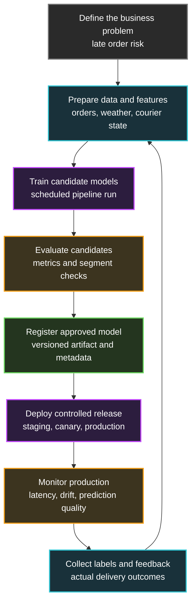
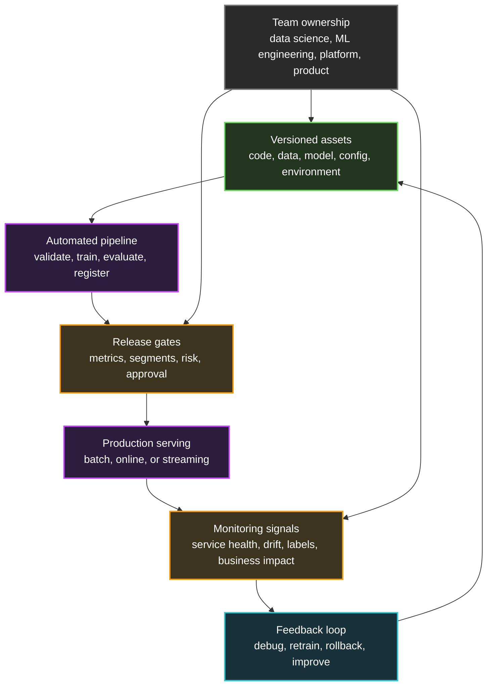

## Table of Contents

1. [The Problem Starts After The Notebook](#the-problem-starts-after-the-notebook)
2. [MLOps In Plain Language](#mlops-in-plain-language)
3. [Why Models Need Their Own Operating Loop](#why-models-need-their-own-operating-loop)
4. [The Assets MLOps Tracks](#the-assets-mlops-tracks)
5. [The MLOps Lifecycle](#the-mlops-lifecycle)
6. [Automation And Release Gates](#automation-and-release-gates)
7. [Monitoring And Feedback](#monitoring-and-feedback)
8. [Who Does The Work](#who-does-the-work)
9. [What Good MLOps Changes](#what-good-mlops-changes)
10. [Putting It All Together](#putting-it-all-together)
11. [What's Next](#whats-next)

## The Problem Starts After The Notebook
<!-- section-summary: A model that works in a notebook still needs a repeatable path into a real product, with data, code, infrastructure, and people moving together. -->

A food delivery company called CityEats gives us a concrete scenario. The data science team builds a model that predicts whether an order will arrive late. If the model sees a high risk, the product can warn the customer, offer a small credit, or ask operations to move a courier sooner.

Inside a notebook, the first version looks great. The data scientist loads three months of order history, trains a model, checks accuracy, and shares a chart with the team. Everyone feels good because the model seems useful and the business problem feels real.

Then the product team asks the production question: how does this model run every day without breaking the app? That question pulls in much more than the model file. Someone has to refresh training data, run the training code again, store the model artifact, test the model, deploy it behind an API, watch prediction quality, and roll back if the model hurts the customer experience.

That whole path is where **MLOps** lives. In this article, we will connect the main ideas in this order: **the model**, **the data**, **the model artifact**, **the release path**, **monitoring**, and **team ownership**. Each piece matters because production machine learning depends on all of them at the same time.

## MLOps In Plain Language
<!-- section-summary: MLOps is the practice of running machine learning systems through repeatable workflows for training, release, monitoring, and improvement. -->

**MLOps**, short for **machine learning operations**, is the set of practices, processes, and platform pieces that help teams build, deploy, monitor, and improve machine learning systems in production. It borrows many ideas from DevOps, especially automation, testing, versioning, and release discipline. It also adds the parts that normal software delivery does not usually handle deeply: changing datasets, trained model artifacts, experiment results, feature definitions, model evaluation, and production feedback.

A **machine learning model** is software that learned patterns from data. For the CityEats late-order model, the training data might include restaurant preparation time, distance, courier availability, weather, order size, and the final delivery outcome. The model learns from those examples and later produces a prediction for a new order.

MLOps gives that model a production workflow. A team can answer practical questions like: which data trained the model, which code produced it, which metrics approved it, which environment serves it, who reviewed it, and what production signals show that it still behaves well. Those questions sound simple during exploration. They turn into operational work once the model affects real customers.

The plain version is worth saying directly: **MLOps is how a team turns machine learning from a one-time experiment into a reliable production system.** For CityEats, that means the model can move through training, approval, release, monitoring, and improvement without depending on one person's notebook.

In the CityEats example, the team wants more than a good model in a notebook. They want a repeatable way to create model version `late-order-risk-v12`, compare it with `v11`, deploy it to 5 percent of traffic, watch late-order alerts, and switch back if the customer experience gets worse.


_The loop shows why MLOps keeps data, model versions, release control, monitoring, and feedback connected instead of treating the model as one isolated file._

The loop matters because a model keeps meeting new data after release. Restaurants change menus, weather patterns shift, courier supply changes, and promotions create unusual traffic. MLOps gives the team a way to keep learning from that world without treating every model update like a fresh emergency.

## Why Models Need Their Own Operating Loop
<!-- section-summary: Production ML needs extra controls because model behavior depends on data, training choices, runtime inputs, and feedback from the real product. -->

A normal web service usually ships code. The team changes code, tests code, builds code, deploys code, and watches the service. The service can still fail in many ways, but the main artifact came from the source repository.

A machine learning system ships code plus a trained model, and that model came from data. The model also depends on training configuration, library versions, feature definitions, evaluation rules, and the environment used to run inference. **Inference** means using a trained model to make a prediction on new input.

For CityEats, the application code might call an endpoint named `/predict-late-order`. That endpoint returns a score like `0.82`, which means the model sees an 82 percent risk of lateness. The product logic then decides whether to notify a customer, offer a credit, or do nothing.

The model can create a production issue even if the API stays healthy. The endpoint can return fast responses with `200 OK`, while the predictions slowly lose value because restaurant behavior changed. That is why MLOps tracks **system health** and **model health** together.

Here are four production questions that MLOps keeps visible. They are practical questions that come up during releases, incidents, audits, and model improvement work.

| Question | Why it matters in production |
|---|---|
| **Can we reproduce this model?** | The team needs the code, data snapshot, configuration, and environment that created a model version. |
| **Can we compare model versions fairly?** | A new model should beat the current production model on agreed metrics and important customer segments. |
| **Can we release with control?** | A model should move through review, staging, canary traffic, and rollback paths like other production changes. |
| **Can we notice bad behavior?** | A model can fail through data drift, poor predictions, missing labels, latency, or product-side side effects. **Data drift** means production inputs start looking different from the data the model learned from. |

This is the first big idea in MLOps: the model lives inside a system. The system includes data pipelines, training jobs, registries, deployment infrastructure, monitoring dashboards, people, and decisions. A good notebook proves that a model idea might work. MLOps creates the path for the idea to survive production.

## The Assets MLOps Tracks
<!-- section-summary: MLOps makes code, data, models, configuration, environments, and evaluation results traceable so teams can explain and repeat releases. -->

Once the CityEats team has a useful late-order model, the next problem is traceability. Traceability means the team can connect an output back to the inputs and decisions that produced it. If model version `v12` starts warning too many customers, the team needs more than the file name `model.pkl`.

MLOps treats several things as first-class production assets. Each asset needs a name, version, owner, and place in the release story, because the model can change when any one of them changes.


_The evidence view shows the release packet reviewers need before a candidate model reaches customers._

**Code** includes feature-building code, training code, evaluation code, serving code, and pipeline code. A small change in how the team calculates `courier_distance_minutes` can change model behavior, even if the model algorithm stays the same.

**Data** includes raw training data, cleaned datasets, labels, feature tables, validation datasets, and test datasets. A model trained on orders from January might behave differently from a model trained on orders from a holiday week, so the training data version matters.

**Model artifacts** are the files produced by training. A model artifact might contain learned weights, a serialized scikit-learn pipeline, a TensorFlow SavedModel directory, a PyTorch checkpoint, or another framework-specific output. The artifact needs a version, a storage location, and metadata that explains how the team created it.

**Configuration** includes training parameters like learning rate, feature lists, date ranges, model type, threshold values, and evaluation settings. Two runs with the same code and data can produce different models if the configuration changes.

**Environment** means the runtime ingredients: Python version, package versions, operating system image, container image, hardware type, and sometimes GPU driver versions. A model can train successfully in one environment and fail in another because one dependency changed.

**Evaluation results** record how the model performed before release. The CityEats team might track precision, recall, calibration, latency, and performance by city, restaurant type, and order size. Segment-level checks matter because a model can look strong overall while doing poorly for one important group.

A practical release record can pull those assets into one place. The format can change by team, but the record should make a future incident review much less confusing.

```yaml
model:
  name: late-order-risk
  version: v12
  artifact_uri: s3://cityeats-ml-models/late-order-risk/v12/model.pkl
code:
  training_commit: 8f41c2a
  serving_commit: 91b6d20
data:
  training_snapshot: s3://cityeats-ml-data/orders/2026-05-01-to-2026-05-31/
  label_definition: delivered_more_than_10_minutes_late
environment:
  image: ghcr.io/cityeats/ml-training:2026-06-08
evaluation:
  validation_auc: 0.89
  high_risk_precision: 0.74
  p95_inference_latency_ms: 42
approval:
  reviewer: ml-platform-review
  status: approved-for-canary
```

This small record changes the conversation during an incident. The team can see exactly which code, data, environment, and metrics created `v12`. They can compare it with `v11`, find the difference, and choose whether to retrain, change a threshold, or roll back.

Traceability connects naturally to the next topic. Once the team can track the assets, they need a repeatable path that moves those assets through the lifecycle.

## The MLOps Lifecycle
<!-- section-summary: The MLOps lifecycle connects data preparation, training, evaluation, registration, deployment, monitoring, and feedback into one repeatable loop. -->

The **MLOps lifecycle** is the repeating path a model follows from idea to production and back into improvement. Different teams draw the lifecycle in different ways, but the main shape stays familiar: collect data, train, evaluate, register, deploy, monitor, and learn from feedback.

For CityEats, the lifecycle might look like this. The diagram keeps the same late-order model in the center so each step feels connected to a real product workflow.



**Problem definition** gives the model a purpose. CityEats wants fewer surprise late deliveries and fewer unnecessary credits. The team needs a clear target label, such as "order delivered more than 10 minutes later than promised," because vague goals create vague models.

**Data preparation** turns production records into training examples. The pipeline joins order history, courier availability, restaurant preparation times, traffic or weather data, and final delivery outcomes. The team also checks missing values, broken schemas, impossible timestamps, and label quality before training starts.

**Training** creates one or more candidate models. A training job reads a specific data snapshot, uses a specific configuration, produces metrics, and writes an artifact. In a mature workflow, the training job runs in a controlled environment instead of one person's laptop.

**Evaluation** decides whether the candidate deserves a release. The team compares the candidate to the current production model, checks important segments, and reviews business impact. For the late-order model, a candidate that improves the average score but sends too many warnings in one city needs more review.

**Registration** stores the approved model artifact with metadata. A model registry gives the team a catalog of model versions, evaluation results, owners, and deployment status. The registry helps separate "someone trained a model" from "the team approved this model for production."

**Deployment** puts the model into a serving path. The team might run batch predictions every hour, expose an online API, or stream predictions through an event pipeline. The deployment method depends on the product need, latency budget, cost, and operational risk.

**Monitoring** watches the model after release. The team tracks API latency and errors, plus model-specific signals like input drift, output distribution, prediction quality, and label delay. A model can pass all pre-release checks and still need attention after real users interact with it.

**Feedback** closes the loop. Once CityEats learns which orders actually arrived late, those outcomes feed future training and evaluation. Feedback lets the team improve the model with real production evidence instead of guessing from an old dataset.

This lifecycle needs automation because many steps repeat. Manual notebooks and hand-written release notes can work for a tiny prototype, but production teams need pipelines that run the same way each time.

## Automation And Release Gates
<!-- section-summary: Automation makes model changes repeatable, while release gates make sure teams review metrics, risk, and production readiness before rollout. -->

**Automation** means a pipeline performs repeatable work with the same steps each time. In MLOps, automation often covers data validation, training, evaluation, artifact storage, deployment, and monitoring setup. The goal is consistency, because a model release has too many moving pieces for memory-based operations.

CityEats might create a training pipeline that runs every Monday morning. The pipeline reads the latest approved data snapshot, validates the schema, trains a candidate model, evaluates it against `v11`, saves the artifact, and opens a review record. The team still makes the release decision, but the evidence arrives in a standard shape.

A simplified pipeline can look like this. The names here are generic, but the sequence shows the kind of repeatable path a production model needs.

```yaml
name: late-order-risk-training
trigger:
  schedule: weekly
steps:
  - validate_data:
      dataset: orders_last_30_days
      checks:
        - required_columns
        - missing_value_limits
        - timestamp_order
  - train_model:
      config: configs/late_order_risk.yml
      output: artifacts/model.pkl
  - evaluate_model:
      baseline: production
      checks:
        - overall_metrics
        - city_segments
        - restaurant_type_segments
        - latency_budget
  - register_candidate:
      registry: late-order-risk
      require_approval: true
```

This pipeline gives the team a repeatable route from data to candidate model. It also creates a natural place for **release gates**. A release gate is a check that a model must pass before it moves to the next environment or receives more traffic.

Some gates are technical. The model artifact must load successfully, the serving image must build, the API contract must stay compatible, and latency must stay inside the product budget. For CityEats, the model has to return a prediction fast enough that the checkout flow does not feel slow.

Some gates are model-specific. The model must beat the current production model on agreed metrics, avoid large regressions for important segments, and keep calibration within an acceptable range. Calibration means a score like `0.80` should roughly match an 80 percent chance across similar examples, because product decisions often depend on thresholds.

Some gates are business and risk checks. A human reviewer might approve the model because it changes customer messaging or refund behavior. A high-stakes model might require privacy review, fairness checks, compliance review, or a documented rollback plan.

Deployment also needs control. CityEats can release `v12` to staging first, then send 5 percent of production traffic to it, then increase traffic after the dashboards look healthy. This style of gradual rollout gives the team time to see real behavior before the model affects everyone.

Automation connects naturally to monitoring. A pipeline can prove that a model looked good before release, but production decides whether it keeps working.

## Monitoring And Feedback
<!-- section-summary: MLOps monitoring watches both the serving system and the model behavior, then uses production feedback to guide fixes and retraining. -->

**Monitoring** means collecting signals that show how a system behaves after release. For an ML system, monitoring has two layers. The first layer watches the service like any other production service. The second layer watches the model's inputs, outputs, and real-world results.

CityEats still needs normal service signals: request rate, error rate, latency, CPU, memory, and deployment health. If the prediction endpoint times out, the product can fail even if the model itself is accurate.

The team also needs model signals. They can track input distributions, such as delivery distance, restaurant preparation time, order size, and courier availability. If those distributions shift far from the training data, the model may see examples it learned poorly.

They can track output distributions too. If the model suddenly marks 70 percent of orders as high risk after a city-wide promotion, the product team needs to know. That shift might reflect a real operational problem, a broken feature pipeline, or a model threshold that no longer fits the business.

The strongest signal comes from labels. For CityEats, labels arrive after the delivery finishes, because only then does the team know whether the order was actually late. Label delay is common in ML systems. A fraud model might wait for chargebacks, a churn model might wait weeks for subscription behavior, and a medical workflow might wait for human review.

A useful prediction log keeps enough context for later monitoring and debugging. The exact fields vary by system, but the log should connect a prediction to the model version, the inputs, the score, and the product decision.

```json
{
  "request_id": "ord_732884",
  "model_name": "late-order-risk",
  "model_version": "v12",
  "prediction_timestamp": "2026-06-13T18:24:10Z",
  "features": {
    "restaurant_prep_minutes": 18,
    "courier_distance_minutes": 9,
    "order_items": 6,
    "rain_level": "moderate"
  },
  "score": 0.82,
  "decision": "warn_customer"
}
```

Later, the team can join this prediction log with the actual delivery outcome. That join powers prediction-quality dashboards, retraining datasets, and incident reviews. It also helps answer a customer-support question like, "Why did this order receive a late warning?"

Monitoring should lead to clear actions. A latency alert can roll traffic back to the previous serving image. A broken feature alert can pause the model decision and use a safer product fallback. A quality regression can trigger retraining or send the candidate back to evaluation. A strong MLOps setup connects each alert to an owner and a response path.

The next question is who owns those paths. MLOps works across roles, so the team design matters as much as the tools.

## Who Does The Work
<!-- section-summary: MLOps spreads ownership across data science, engineering, platform, product, and operations so model releases have clear responsibilities. -->

MLOps usually needs several roles working together. One person can wear multiple hats in a small company, but the responsibilities still exist. The important part is that the team names the handoffs before something breaks.

**Data scientists** or **ML scientists** usually explore the problem, train candidate models, choose features, review metrics, and explain model behavior. For CityEats, they decide whether the late-order model should optimize precision, recall, calibration, cost savings, or customer trust.

**ML engineers** turn model ideas into repeatable training and serving workflows. They package the model, write pipeline code, handle feature logic, test model loading, and make sure the prediction path can run outside a notebook. In many teams, ML engineers bridge data science and software engineering.

**Data engineers** keep the data pipelines reliable. They build the tables, streams, validation checks, and lineage that feed training and monitoring. If the `restaurant_prep_minutes` field changes meaning, the data engineering workflow should catch it before training silently changes.

**Platform engineers** provide shared infrastructure. They manage CI/CD systems, container platforms, model registries, secrets, compute, observability, and environment templates. Their work lets model teams ship without rebuilding the same plumbing each time.

**Product owners and business reviewers** define acceptable behavior. They decide what the prediction should trigger in the product, how much risk the business accepts, and which customer outcomes matter. For CityEats, product owns the decision to warn a customer or offer a credit; the model only supplies evidence.

**Operations, risk, security, and compliance teams** add guardrails where the model touches sensitive data or important decisions. They care about access control, audit trails, privacy, approval records, incident response, and rollback plans. A model that affects refunds, fraud, hiring, lending, healthcare, or safety needs especially clear review.

A simple ownership table can prevent confusion. CityEats can keep the table small at first, then expand it as the model affects more teams and environments.

| Workflow area | Primary owner | Shared reviewers |
|---|---|---|
| Training data quality | Data engineering | Data science, ML engineering |
| Candidate model metrics | Data science | Product, ML engineering |
| Training pipeline reliability | ML engineering | Platform engineering |
| Serving infrastructure | Platform engineering | ML engineering |
| Release approval | Product or risk owner | Data science, engineering |
| Production monitoring | ML engineering | Operations, product |

The exact titles can change from company to company. The useful pattern stays the same: every model release needs owners for data, code, artifacts, infrastructure, metrics, monitoring, and business decisions.

Now the pieces are in place. We can talk about what improves once a team practices MLOps well.

## What Good MLOps Changes
<!-- section-summary: Good MLOps shortens the path from experiment to production while improving traceability, release safety, monitoring, and team accountability. -->

Good MLOps changes the daily work around machine learning. The team spends less time asking where a model came from and more time deciding whether it should ship. That matters because ML projects often fail from messy handoffs rather than weak algorithms.

For CityEats, the first model release might take extra time because the team builds the pipeline, registry entries, dashboards, and review flow. The second release follows a known path. The team can reuse the same steps, compare metrics with the previous version, and roll out with a tested playbook.

Here are the main changes a team should feel. Each row connects a common early-stage habit with the production habit that replaces it.

| Before MLOps | With MLOps |
|---|---|
| A model lives as a notebook output on one laptop. | A model version lives in a registry with artifact, metadata, metrics, and owner. |
| Training depends on manual steps and memory. | A pipeline runs data checks, training, evaluation, and registration repeatably. |
| Release decisions happen through screenshots and chat messages. | Release gates compare candidates against agreed metrics and review rules. |
| Production issues start with confusion about which model is running. | Logs and deployment records show model version, code version, data snapshot, and serving image. |
| Monitoring only shows API health. | Dashboards show API health, input drift, output drift, label-based quality, and business effects. |
| Rollback depends on finding the previous file. | The deployment system can route traffic back to the previous approved model version. |

MLOps also changes how teams choose tools. A small team can begin with Git, scheduled jobs, object storage, a simple model registry, CI/CD, structured logs, and dashboards. A larger team may use managed platforms such as Azure Machine Learning, Amazon SageMaker, Google Vertex AI, Kubeflow, MLflow, or internal platform services.

The tool choice matters less than the workflow quality. The team needs versioned assets, repeatable pipelines, clear release gates, monitoring, feedback, and ownership. A shiny platform cannot rescue a workflow where nobody knows which data trained the model or who approves a risky deployment.

## Putting It All Together
<!-- section-summary: MLOps connects people, process, and platform so a model can move through production with evidence, control, monitoring, and feedback. -->

Now we can return to CityEats with the full picture. The same late-order model gives us a compact view of the system around production machine learning.

The data science team has a late-order model that predicts delivery risk. MLOps turns that model into a production system by giving the team a lifecycle. Data pipelines prepare examples, training jobs create candidates, evaluation checks compare them with production, the registry stores approved versions, deployment releases them gradually, monitoring watches real behavior, and feedback feeds the next training cycle.



MLOps connects the model, data, release process, monitoring, and owners into one operating loop. The team treats machine learning as a production system around a changing model, changing data, and changing product behavior. Every model version gets evidence. Every release has a path. Every production signal has an owner. Every serious issue can lead to rollback, retraining, or a product change.


_The final visual shows the practical shift from a local notebook to a monitored service with repeatable release and rollback paths._

A beginner can feel pressure to start with a platform logo. A more useful starting point is practical: can the team reproduce the model, evaluate it fairly, release it safely, monitor it honestly, and improve it from feedback? Use those answers to choose tools, instead of starting with a platform logo.

## What's Next
<!-- section-summary: The next article turns the broad MLOps picture into a concrete lifecycle that later modules expand in detail. -->

You now have the broad shape of MLOps: repeatable model lifecycle, versioned assets, automation, release gates, monitoring, feedback, and shared ownership. The next article walks through the lifecycle in more detail, from the first business question to production monitoring and the next training cycle.

That lifecycle gives the rest of the roadmap a map. Data modules, training modules, evaluation modules, serving modules, monitoring modules, and governance modules all fit into different parts of the same operating loop.

## References

- [Google Cloud: MLOps continuous delivery and automation pipelines in machine learning](https://docs.cloud.google.com/architecture/mlops-continuous-delivery-and-automation-pipelines-in-machine-learning) - Explains CI, CD, and continuous training for ML systems, including why ML pipelines need automation beyond normal software delivery.
- [AWS SageMaker AI: Why should you use MLOps?](https://docs.aws.amazon.com/sagemaker/latest/dg/sagemaker-projects-why.html) - Describes MLOps as applying DevOps practices to ML workloads and highlights project management, CI/CD, and quality assurance concerns.
- [AWS SageMaker AI: Implement MLOps](https://docs.aws.amazon.com/sagemaker/latest/dg/mlops.html) - Shows common MLOps infrastructure topics such as workflow automation, deployment, and model monitoring in a managed ML platform.
- [Microsoft Learn: MLOps model management with Azure Machine Learning](https://learn.microsoft.com/en-us/azure/machine-learning/concept-model-management-and-deployment?view=azureml-api-2) - Covers model lifecycle management, deployment, and quality and consistency improvements from MLOps practices.
- [Microsoft Azure Architecture Center: Machine learning operations](https://learn.microsoft.com/en-us/azure/architecture/ai-ml/guide/machine-learning-operations-v2) - Describes architectures that combine CI/CD pipelines with retraining pipelines for ML applications.
- [Google Cloud: Practitioners Guide to Machine Learning Operations](https://cloud.google.com/resources/mlops-whitepaper) - Provides an overview of the MLOps lifecycle, continuous training, deployment, and monitoring of predictive performance.
