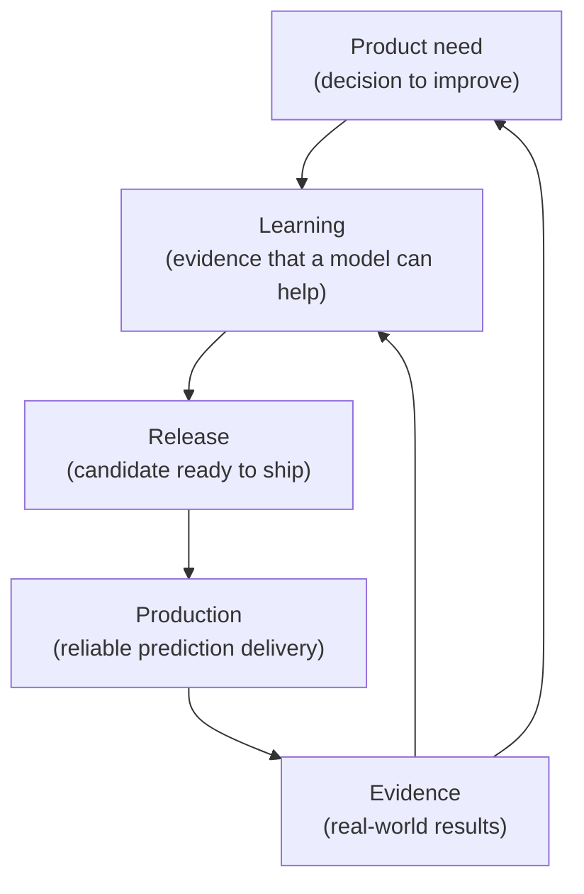
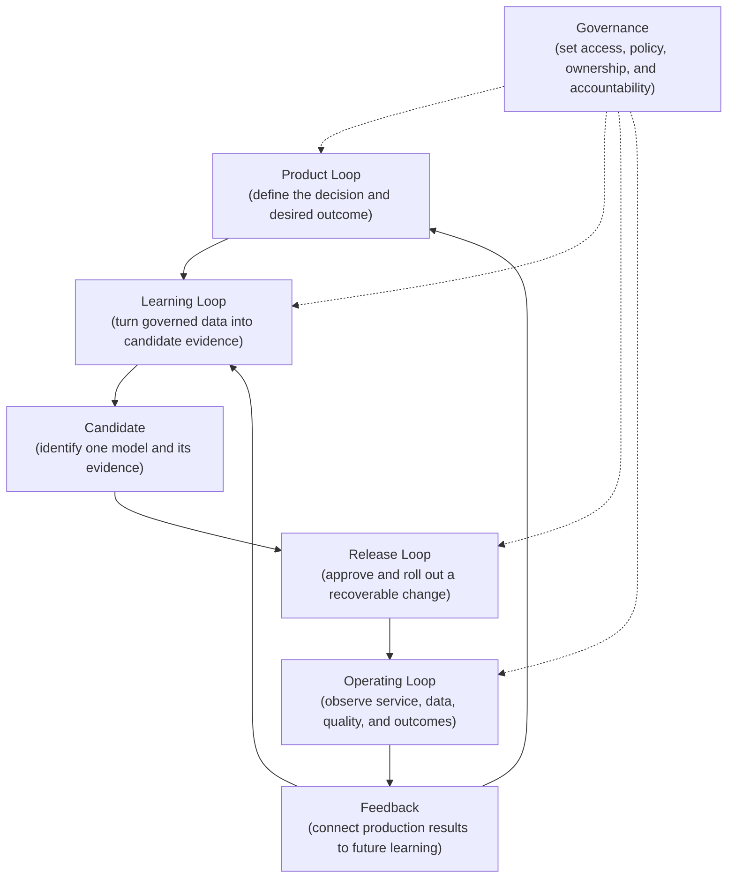
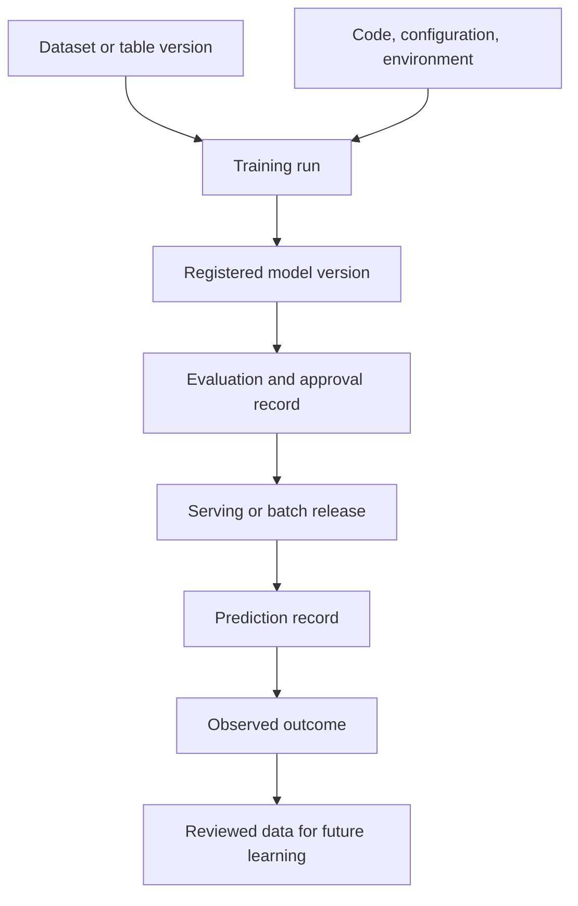
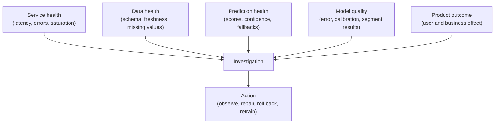

## Table of Contents

1. [A Good Model Is Only the Starting Point](#a-good-model-is-only-the-starting-point)
2. [The Four Parts Of MLOps](#the-four-parts-of-mlops)
3. [How Machine Learning Changes DevOps](#how-machine-learning-changes-devops)
4. [Decide The Model's Purpose And Boundaries](#decide-the-models-purpose-and-boundaries)
5. [Record The Exact Inputs And Outputs Of Every Training Run](#record-the-exact-inputs-and-outputs-of-every-training-run)
6. [Train And Evaluate A Model For Production](#train-and-evaluate-a-model-for-production)
7. [Release The Model Safely](#release-the-model-safely)
8. [Monitor Service Health And Model Quality](#monitor-service-health-and-model-quality)
9. [Use Production Outcomes To Improve The Next Model](#use-production-outcomes-to-improve-the-next-model)
10. [Assign Owners And Controls Across The Lifecycle](#assign-owners-and-controls-across-the-lifecycle)
11. [Choose Tools For Each MLOps Responsibility](#choose-tools-for-each-mlops-responsibility)
12. [Build One Complete Model Workflow First](#build-one-complete-model-workflow-first)
13. [What Common MLOps Failures Reveal](#what-common-mlops-failures-reveal)
14. [Test The Complete Workflow And Its Recovery Path](#test-the-complete-workflow-and-its-recovery-path)
15. [Main Idea](#main-idea)
16. [References](#references)

## A Good Model Is Only the Starting Point
<!-- section-summary: MLOps closes the gap between a promising model experiment and a dependable production system. -->

At a high level, **MLOps**, short for **machine learning operations**, is the engineering and operating practice used to build, release, run, and improve machine-learning systems in a controlled way.

A model can score well in a notebook and still fail as a product. The production service may receive a feature with a different meaning. A daily data job may stop updating one input. A new model may use a library that is missing from the serving image. An endpoint may stay online while its predictions slowly lose accuracy. Several weeks later, the team may discover that it cannot identify which model produced a disputed decision.

These are system failures. Improving the algorithm alone will not resolve them.

MLOps gives the surrounding system a repeatable shape. The team can trace where data came from, recreate a training run, compare a candidate with the current production model, release it gradually, observe its behaviour, restore a safe version, and learn from later outcomes. Automation supports these tasks, while evidence and ownership make the automation trustworthy.

Consider a fraud model that approves or reviews card payments. Its offline precision may look excellent. Production still needs answers to practical questions:

- Can the online service calculate the same features used during training?
- How much latency can the payment flow tolerate?
- What happens during a feature-store outage?
- Which customer and transaction groups carry the greatest cost of error?
- How does an investigator connect a later chargeback to the original prediction?
- Who can stop the rollout or return traffic to the previous model?

MLOps organizes those questions into one operating system for the ML product. In essence, it connects the model-development work with the data platform, software-delivery process, production service, monitoring, feedback, security, and human decisions around it.


```mermaid
flowchart TD
    A["Product need<br/>(decision to improve)"] --> B["Learning<br/>(evidence that a model can help)"]
    B --> C["Release<br/>(candidate ready to ship)"]
    C --> D["Production<br/>(reliable prediction delivery)"]
    D --> E["Evidence<br/>(real-world results)"]
    E --> A
    E --> B
```

Production is part of the learning process. The work continues after a model is deployed because real traffic supplies the strongest evidence about reliability and value.

## The Four Parts Of MLOps
<!-- section-summary: Product, learning, release, and operating loops divide the lifecycle into clear questions and outputs. -->

MLOps work spans four connected parts: deciding the model's purpose, training and evaluating it, releasing it, and operating it in production. Teams often describe these repeating parts as the product, learning, release, and operating loops.

### Decide What The Model Should Do

The **product loop** decides what the model should predict and how that prediction will be used. The team identifies the person or system that receives it, the time at which it must be available, the cost of different errors, and the outcome that represents success.

Consider a grocery replenishment system that forecasts next-day demand for each perishable product. At the daily 4 p.m. ordering cutoff, the ordering system turns that forecast into the number of units to buy for the following morning. Underprediction leaves shelves empty and loses sales. Overprediction leaves unsold stock that spoils and creates waste. The team measures success through product availability, lost sales, spoilage volume, and inventory cost alongside forecast error. This product contract connects the model's prediction to the decision and consequences that the business actually cares about.

### Train And Evaluate A Model

The **learning loop** prepares data, trains models, and evaluates their behavior. A trained model under consideration for release is called a **candidate**. Its record includes the data preparation, feature engineering, experiment tracking, evaluation, and error analysis needed for comparison.

A candidate is more than a serialized model file. It needs a link to the code, data, environment, parameters, and evaluation that produced it. This lets another engineer understand why the candidate exists and repeat the process.

### Decide Whether The Model Is Ready For Production

The **release loop** decides whether one exact candidate is ready for production. It checks packaging, input and output contracts, security, model quality, infrastructure compatibility, rollout behaviour, and rollback readiness.

For an online recommendation service, the release may first receive shadow traffic. Shadow traffic sends real requests to the new model without using its answers in the product. Engineers can then compare latency, errors, and predictions with the current model before exposing users to the change.

### Keep The Production System Healthy

The **operating loop** keeps the production service and its model behavior healthy. It watches the service, data, predictions, and later outcomes, then supplies alerts, incident records, rollback decisions, and new learning data.

A credit-risk endpoint can return successful HTTP responses while approval quality deteriorates in one region. Service metrics alone would miss that failure. The operating loop joins technical health with model and product health.


```mermaid
flowchart TD
    P["Product Loop<br/>(define the decision and desired outcome)"] --> L["Learning Loop<br/>(turn governed data into candidate evidence)"]
    L --> C["Candidate<br/>(identify one model and its evidence)"]
    C --> R["Release Loop<br/>(approve and roll out a recoverable change)"]
    R --> O["Operating Loop<br/>(observe service, data, quality, and outcomes)"]
    O --> F["Feedback<br/>(connect production results to future learning)"]
    F --> P
    F --> L
    G["Governance<br/>(set access, policy, ownership, and accountability)"] -.-> P
    G -.-> L
    G -.-> R
    G -.-> O
```

Governance crosses all four loops. It determines who can read data, run training, approve a candidate, change production traffic, inspect sensitive records, and retire an old model. It also preserves the evidence needed to review those actions.

This framework remains useful across tools and cloud providers. A managed platform may combine several responsibilities in one product. An open-source stack may distribute them across multiple services. The loops still describe the work the system must perform.

## How Machine Learning Changes DevOps
<!-- section-summary: MLOps keeps normal software-delivery practices and adds controls for data, learned behaviour, delayed outcomes, and feedback. -->

Machine learning changes DevOps because production behavior depends on data and statistical learning as well as code and infrastructure. Teams still keep source changes reviewable, test the application, package a known runtime, control releases, observe production, secure access, and respond to incidents.

MLOps extends that foundation because part of the system's behaviour is learned from data. Data, evaluation evidence, and delayed real-world outcomes join code and infrastructure as production concerns.

### Training Data Can Change Model Behavior

Training data can change model behavior even if the source code remains the same. A late data partition, revised label, new category, or altered upstream definition may affect the resulting model.

That makes data identity and validation part of the build process. A training run should point to a reproducible snapshot or table version. The pipeline should check schemas, freshness, ranges, null rates, and other domain rules before spending money on training.

For example, suppose a churn pipeline expects one row per active subscription. An upstream join starts creating duplicate rows. The training code still runs and the final metric may even look plausible. A row-count and uniqueness contract at the data boundary can stop the run before the duplicated customers distort the model.

### Model Quality Needs Statistical Evaluation

Model quality needs statistical evaluation because most predictions have no single exact expected answer. A unit test can assert that a tax function returns an exact amount, while an ML team must evaluate error patterns across a representative dataset.

The evaluation may compare a candidate with the current production model, inspect important data segments, measure calibration, test robustness, and apply product-specific limits. A fraud candidate may improve average recall while producing too many false positives for small international purchases. The segment result matters because each false positive can block a legitimate customer.

### The Correct Outcome May Arrive Much Later

The correct outcome used to judge a prediction may arrive long after the prediction. This outcome is called **ground truth**. Some labels arrive within seconds; others take days or months. A delivery estimate can be checked after the delivery, while loan default takes far longer.

Before mature labels arrive, teams use earlier signals such as service errors, missing features, out-of-range inputs, prediction distributions, and fallback rates. These signals reveal risk, although they cannot prove that prediction quality has changed. Label-based evaluation provides the stronger answer after enough outcomes have matured.

### Model Decisions Can Change Future Training Data

Model decisions can change the data collected for future training. A recommender controls which products a user sees. A fraud model sends selected transactions to manual review. A demand forecast changes inventory.

This creates a **feedback effect**. The recorded outcome reflects the original situation and the action taken because of the prediction. Production logs should capture both. Otherwise, the next training set may treat an intervention as if it were a natural outcome.

### How Automated Checks, Releases, And Retraining Fit Together

Automated checks, releases, and retraining cover different parts of the ML lifecycle. **Continuous integration**, or **CI**, validates changes before they join the shared codebase. In ML, CI commonly tests code, pipeline components, data contracts, model interfaces, and a small training run.

**Continuous delivery**, or **CD**, prepares a reviewed change for safe release. The deployable change may include feature logic, a training pipeline, an inference image, monitoring rules, and infrastructure alongside the model.

**Continuous training**, or **CT**, runs a versioned training pipeline after an approved trigger such as new labels, a schedule, code changes, or a quality investigation. CT produces a candidate. Evaluation and release controls still decide whether that candidate receives production traffic.

## Decide The Model's Purpose And Boundaries
<!-- section-summary: A product contract states the prediction, timing, action, quality bar, and fallback that give model metrics their meaning. -->

Before training, the team must decide the model's purpose, allowed use, users, timing, and fallback. These decisions form the **product contract**, which describes the agreement between the model and the product around it.

The contract should answer several connected questions in ordinary language:

- What does the model predict?
- At what moment is the prediction made?
- Which data is legitimately available at that moment?
- Which action uses the prediction?
- Which mistakes carry the greatest cost?
- How quickly must an answer arrive?
- How fresh must the data be?
- Which groups or situations need separate evaluation?
- What safe behaviour should the product use during uncertainty or failure?
- Which later outcome reveals whether the decision helped?

Timing is especially important. A hospital readmission model evaluated at discharge can use information recorded during the stay. The same model used at admission has access to much less information. Reusing the discharge-time training set for an admission-time prediction would leak knowledge from the future.

The fallback also belongs in the product contract. An online pricing system might use a reviewed rules-based price if the model or feature service is unavailable. A batch demand forecast might retain the previous approved forecast for one cycle. A high-risk decision may route to a human reviewer.

The contract guides the rest of MLOps. Data engineers know which source fields and timestamps matter. Data scientists know which metrics and slices to evaluate. Platform engineers know the latency and availability targets. Product owners know which business outcome to monitor. Incident responders know which fallback is safe.

## Record The Exact Inputs And Outputs Of Every Training Run
<!-- section-summary: Stable identities connect data, code, runs, models, releases, predictions, and outcomes into a traceable chain. -->

A reproducible training run records the exact versions of its code, data, configuration, runtime, and outputs. Versioning gives each asset a stable identity, while lineage connects those identities from training through production outcomes.

Production teams use that chain for two directions of investigation:

1. Starting from a prediction, which release, model, training run, code, and data produced it?
2. Starting from a faulty dataset or vulnerable dependency, which models and releases are affected?

The links that answer these questions are called **lineage**. In another term, lineage is the family tree of ML assets.


```mermaid
flowchart TD
    D["Dataset or table version"] --> T["Training run"]
    C["Code, configuration, environment"] --> T
    T --> M["Registered model version"]
    M --> E["Evaluation and approval record"]
    E --> R["Serving or batch release"]
    R --> P["Prediction record"]
    P --> O["Observed outcome"]
    O --> N["Reviewed data for future learning"]
```

Each important asset needs a stable identity:

- Source code has a commit.
- Python dependencies have a lockfile, and containers have immutable image digests.
- Data has a snapshot, table version, partition manifest, or equivalent reference.
- A training run records parameters, metrics, artifacts, and its execution environment.
- A registered model version links back to that run.
- A release record identifies the exact model and serving configuration.
- A prediction record identifies the release that produced it.
- An outcome record joins back to the prediction through a governed identifier.

This evidence supports reproducibility without promising impossible byte-for-byte equality. Parallel execution, GPU kernels, random sampling, and floating-point behaviour can introduce small differences. A practical replay records all material inputs, fixes random seeds where useful, pins the environment, and defines acceptable tolerances.

MLflow Tracking and Weights & Biases are common choices for experiment and run metadata. MLflow Model Registry, managed cloud registries, and Models in Databricks Unity Catalog add versioning and lifecycle controls around model artifacts. Delta Lake, Apache Iceberg, and managed warehouse snapshots can provide data versions. OpenLineage-compatible systems and native catalogs can extend lineage across data and orchestration jobs.

The goal is a queryable chain, independent of product choice. During an incident, the team should retrieve the chain automatically. Notebook names and chat messages cannot provide dependable lineage under pressure.

## Train And Evaluate A Model For Production
<!-- section-summary: The learning loop turns governed data and repeatable code into a candidate with enough evidence for a release decision. -->

Training a model for production includes preparing data, engineering features, tracking experiments, evaluating behavior, and analyzing errors. Together, these activities test whether the available data can support the product contract.

Exploration can remain flexible. A notebook is useful for inspecting data, plotting distributions, and trying an idea. Transformations and training steps that contribute to a candidate belong in reviewed, testable code. An orchestrator such as Airflow, Dagster, Prefect, a Databricks job, or a managed ML pipeline can run those stages with explicit inputs and outputs.

### Check Data And Features Before Training

Before training, the pipeline checks that the data and features represent the intended prediction problem. It verifies schema and domain rules, label definitions, join coverage, time boundaries, duplicate entities, and training-serving consistency.

**Point-in-time correctness** means that each training example contains only information available at the historical prediction time. Imagine training a loan model with a table that stores each customer's latest income. Joining that current value onto applications from several years ago would give old examples information the model could never have known then. A time-aware feature join reconstructs the value that was available for each application.

Feature stores such as Feast and managed platform feature systems can help share feature definitions and serve current values online. They add operational cost, so teams usually introduce them after repeated features, low-latency lookups, or training-serving consistency create a clear need.

### Record Experiments So Runs Can Be Compared

Comparable experiments record the parameters, metrics, artifacts, code references, and data references for each run. An experiment tracker turns “the third notebook run looked best” into a comparison another engineer can inspect.

For example, a training job can log overall recall, recall for high-value transactions, calibration plots, feature importance, and the model artifact to MLflow. The useful part is the shared record. A managed cloud tracker or Weights & Biases can serve the same responsibility.

### Evaluate The Model Against Product Risk

Model evaluation should reflect the product risk created by different mistakes. It compares the candidate with a relevant baseline, such as the current production model, a rules-based system, or a simple statistical model.

Overall metrics are only the opening view. Teams inspect important slices, error costs, calibration, stability, robustness, and operational constraints. A forecasting model may reduce average error while missing every holiday peak. A diagnostic model may preserve average sensitivity while losing sensitivity for one age group. Those failures call for investigation before release.

The learning loop finishes with a candidate and a versioned evaluation report. It does not finish with a production deployment.

## Release The Model Safely
<!-- section-summary: The release loop validates one exact candidate, exposes it gradually, and preserves a tested route back to safety. -->

A safe release moves one exact model, runtime, and configuration into production through a controlled change. The release process checks whether that complete package can serve the product contract and be recovered if something fails.

### Register The Trained Model And Its Records

Registration gives each trained model a durable identity and connects it to its source run, signature, artifacts, tags, and approvals. A **model signature** describes expected inputs and outputs. It can catch an endpoint that sends a string where the model expects a number or omits a required feature.

Current MLflow practice uses model aliases and tags for deployment workflows. Fixed registry stages are deprecated. A team may assign an alias such as `challenger` to a validated candidate and `champion` to the version selected for production use. The alias is a readable pointer; the immutable model version remains the evidence.

```python
from mlflow import MlflowClient

client = MlflowClient()
candidate_version = "17"
client.set_registered_model_alias("fraud-risk", "challenger", candidate_version)

challenger = client.get_model_version_by_alias(
    "fraud-risk",
    "challenger",
)
```

This small example illustrates the handoff. A release pipeline can resolve the alias, verify the exact version and its approval evidence, then deploy that immutable artifact.

### Use Release Checks To Approve Or Block A Model

A release check reads versioned results and allows, blocks, or pauses a model's move toward production. MLOps platforms often call this rule a **gate**.

A release pipeline might require:

- successful unit and integration tests;
- an approved dataset and model signature;
- performance above the current baseline;
- acceptable results for protected or high-risk slices;
- dependency and container security checks;
- a successful load test;
- a documented fallback and rollback target;
- human approval for a regulated or high-impact use case.

The gate records the policy version and the result. A model that failed last month's threshold should not appear approved after the policy changes unless it is evaluated again.

### Limit Initial Production Exposure

Initial production exposure should stay small enough for the team to contain a bad release. An online model can run in shadow mode, receive a small canary share, or participate in an A/B test. A batch model can write to a comparison table before replacing the official output.

Suppose a recommendation candidate passes offline evaluation but its feature lookups add 150 milliseconds at peak load. A canary exposes the latency problem to a small traffic share. The release system freezes expansion and directs traffic back to the previous version while engineers investigate.

A rollback is useful only after the team tests it. The previous model, runtime, features, and configuration must still be available and compatible. For some failures, a rules-based fallback is safer than an older model.

Managed endpoints cover much of this operational work and are a practical default for many teams. Amazon SageMaker AI provides real-time inference endpoints, while Gemini Enterprise Agent Platform (formerly Vertex AI) provides online inference endpoints. Azure Machine Learning offers managed online endpoints, and Databricks provides Model Serving endpoints.

Teams with stronger portability or customization needs may use KServe, NVIDIA Triton Inference Server, Ray Serve, or an ordinary application API. The release responsibilities stay the same across those choices.

## Monitor Service Health And Model Quality
<!-- section-summary: Production monitoring joins service, data, prediction, model, and product evidence because each layer reveals a different failure. -->

Production monitoring must cover service health and model quality. An ML service can look healthy to ordinary infrastructure monitoring and still make poor decisions, so the operating view combines several layers with different diagnostic roles.

Service signals show whether requests can reach the model on time. Data and prediction signals expose broken or unfamiliar inputs before labels arrive. Model-quality and product signals later show whether the returned answers remained useful. Reading the layers together helps the team choose a response instead of treating every alert as a retraining request.


```mermaid
flowchart TD
    S["Service health<br/>(latency, errors, saturation)"] --> I["Investigation"]
    D["Data health<br/>(schema, freshness, missing values)"] --> I
    P["Prediction health<br/>(scores, confidence, fallbacks)"] --> I
    M["Model quality<br/>(error, calibration, segment results)"] --> I
    B["Product outcome<br/>(user and business effect)"] --> I
    I --> A["Action<br/>(observe, repair, roll back, retrain)"]
```

**Service health** covers latency, error rate, queue depth, saturation, resource use, and dependency failures. OpenTelemetry can collect traces, metrics, and logs; Prometheus and Grafana or cloud-native monitoring systems commonly support dashboards and alerts.

**Data health** covers schema, missing values, freshness, range violations, category changes, and feature availability. dbt tests can protect warehouse transformations. Great Expectations, Soda, Deequ, platform-native checks, or pipeline assertions can add richer validation where the risk justifies it.

**Prediction health** covers the shape of model outputs before labels arrive. A sudden rise in fallback decisions or a collapse in score diversity can expose a broken feature path. These signals support diagnosis; they do not directly measure correctness.

**Model quality** compares predictions with mature ground truth. Teams track task-specific metrics, calibration, and important slices. Platform-native monitors, Evidently, Arize, WhyLabs, Fiddler, or custom warehouse jobs can perform this analysis.

**Product health** measures the outcome the system was meant to improve. A ranking model may keep offline relevance metrics stable while conversion falls because the page layout changed. Model and product evidence together help the team locate the real problem.

An alert should point to a useful response. Missing features may route to the data-platform owner and activate a fallback. Rising endpoint latency may trigger traffic reduction or capacity changes. Confirmed quality regression may pause the model, restore a previous release, or start a new investigation. Automatic retraining is a poor first response to unexplained evidence because the new model may learn from corrupted data.

## Use Production Outcomes To Improve The Next Model
<!-- section-summary: Feedback records predictions, actions, and later outcomes so production evidence can improve the next model safely. -->

Production outcomes show where the next model needs improvement. The feedback record identifies the prediction, model version, and relevant feature references. It also records the product action, policy version, and join key used to attach the later outcome.

Consider a payment model that sends selected transactions to manual review. A later fraud label reflects both the transaction and the review process. If investigators prevent fraud after seeing the model alert, the final loss differs from what would have happened without intervention. Training data that ignores the review action can misread this result.

Teams therefore define the feedback path alongside the prediction path. They decide:

- which event represents the outcome;
- how long an outcome needs to mature;
- which identifier joins it to the original prediction;
- which actions or interventions must be recorded;
- how missing or revised labels are handled;
- which records can legally and ethically enter future training data.

Retraining triggers can be scheduled, data-driven, code-driven, or prompted by a quality investigation. The trigger starts a new learning run. The resulting model still enters evaluation and release as a candidate.

This separation protects the product from blind automation. A drift alert may come from a seasonal event, a tracking bug, a new customer segment, or a genuine change in behaviour. The correct response could involve repairing data, changing a threshold, updating the product flow, gathering labels, or retraining the model. The evidence decides.

## Assign Owners And Controls Across The Lifecycle
<!-- section-summary: Governance sets decision rights, access boundaries, review evidence, and accountability across the whole lifecycle. -->

Every lifecycle stage needs owners who can approve work, enforce controls, and
respond to failure. Data engineers and data scientists protect the training
path. Application, platform, and operations teams protect delivery and
production operation. Product, security, privacy, risk, and domain specialists
define the allowed use and required oversight.

Someone must own each critical asset and transition:

- the source and label contract;
- feature definitions and freshness;
- training and evaluation code;
- the release policy;
- serving reliability;
- production quality alerts;
- rollback authority;
- model retirement and record retention.

Ownership should include authority. An on-call engineer cannot protect the product if the runbook says to roll back but the engineer lacks permission to change the endpoint. A reviewer cannot assess a candidate if evaluation artifacts are scattered across private notebooks.

Technical controls make governance enforceable. Workload identities give pipelines narrowly scoped access. Separate development, staging, and production environments limit accidental changes. Catalog permissions protect sensitive data and models. Approval records preserve the evidence behind high-impact decisions. Model cards or equivalent records explain intended use, limitations, evaluation, and ownership. Lineage connects those records to the deployed artifact.

Managed catalogs such as Databricks Unity Catalog and cloud-native data and model registries can centralize access, lineage, and audit. OpenLineage-compatible systems can connect jobs across tools. Infrastructure as code through Terraform, Pulumi, Bicep, or cloud-native templates makes environments reviewable and repeatable.

Governance also covers retirement. Old endpoints, aliases, datasets, credentials, and monitoring jobs should leave service through a controlled process. Retained evidence must follow privacy, legal, and operational requirements.

## Choose Tools For Each MLOps Responsibility
<!-- section-summary: Modern MLOps stacks combine source control, governed data, orchestration, tracking, registries, managed compute, observability, and infrastructure automation. -->

Choose tools by the lifecycle responsibility they must support and the operating burden the team can sustain. A practical stack covers those responsibilities with a small number of well-integrated systems.

Source code usually lives in GitHub or GitLab, with GitHub Actions, GitLab CI, Jenkins, or a cloud CI service running tests and release workflows. Python projects commonly use `uv` or Poetry for dependency management and Docker for portable runtime images stored in an OCI registry.

Data often lives in S3, Google Cloud Storage, Azure Data Lake Storage, a warehouse, or a lakehouse. Delta Lake and Apache Iceberg provide table history through versioned snapshots. Access control, governance, and cross-system lineage come from catalogs and platform controls around those tables. dbt remains common for SQL transformations, while Spark and Polars support larger or code-oriented processing workloads.

Airflow is widespread in established data platforms. Dagster offers an asset-oriented approach that many greenfield teams find useful. Prefect and managed ML pipelines are also reasonable choices. The important property is explicit, observable stages with versioned inputs and outputs.

MLflow is a common default for experiment tracking and model registry responsibilities. Weights & Biases offers a managed experiment workflow. Managed platforms integrate the same responsibilities in their own ecosystems. Amazon SageMaker AI provides training jobs and SageMaker Model Registry. Gemini Enterprise Agent Platform provides serverless training and Gemini Enterprise Agent Platform Model Registry. Their ecosystems also connect experiment tracking, deployment services, and monitoring. Azure Machine Learning and Databricks cover the same broad workflow through their own platform services. Managed training jobs are usually the practical first choice because the provider handles scheduling, isolation, logs, and infrastructure lifecycle.

For serving, a managed endpoint often provides a direct route to production. The platform handles routine concerns such as autoscaling, workload identity, request logs, and controlled version updates.

Self-managed serving fits teams that need portability, specialized hardware control, or a custom request path. KServe integrates model serving with an existing Kubernetes platform. Triton focuses on optimized inference across supported model frameworks and hardware. Ray Serve supports Python-native distributed applications. An ordinary API can remain the clearest choice for a modest workload.

Large language models add a distinct serving choice. A managed model API reduces infrastructure work, while vLLM can support justified self-hosting requirements around control, throughput, or model selection.

OpenTelemetry plus cloud monitoring gives a strong service-observability foundation. Prometheus and Grafana remain common in Kubernetes environments. Model-quality monitoring may use platform-native capabilities, warehouse jobs, Evidently, or a specialist platform such as Arize, WhyLabs, or Fiddler.

Terraform is a common infrastructure default. Teams running Kubernetes often add Helm and a GitOps controller such as Argo CD or Flux. Native catalogs, identity and access management, lineage, model cards, and approval gates provide the governance layer.

This stack description is a map, not a shopping list. A feature store earns its place after shared feature definitions or online lookups create a real requirement. Kubernetes earns its place after workload or platform needs outweigh the operational burden. A managed platform can cover several responsibilities with fewer integration points.

## Build One Complete Model Workflow First
<!-- section-summary: A small team gains more from one complete and recoverable model path than from a broad collection of disconnected tools. -->

An early MLOps implementation should operate one complete model workflow before expanding the platform. This **thin path** is a small route through data, training, evaluation, release, monitoring, feedback, and recovery.

The best first milestone is one important model that travels through that path with visible evidence. It gives the team a working foundation and reveals which capability deserves the next investment.

A small team could use GitHub Actions for CI, Python with `uv`, Docker, versioned warehouse tables or object-storage manifests, a managed training job, MLflow for runs and model versions, a managed endpoint, OpenTelemetry with cloud monitoring, and Terraform for infrastructure. Another team may use Databricks Workflows, Delta tables, MLflow, Models in Unity Catalog, and Model Serving. Both implementations can support the same operating contract.

The thin path should prove that the team can:

1. rebuild the training dataset from an identified source;
2. run training from reviewed code in a pinned environment;
3. compare the candidate with a meaningful baseline and important slices;
4. register the model with its lineage and evaluation;
5. test the serving or batch contract;
6. release gradually or to a controlled destination;
7. observe service, data, prediction, and product signals;
8. join mature outcomes to the original predictions;
9. restore a tested fallback;
10. identify the owners of each response.

Suppose the first production model is a nightly demand forecast. The team can avoid a real-time feature store and online serving because the product consumes a daily table. The release writes candidate forecasts to a comparison table, checks historical error and business constraints, then promotes an approved table version. This is still MLOps. The architecture follows the decision and its risks.

Completing this path exposes the next useful investment. Slow experiments may justify better orchestration. Repeated feature definitions may justify a feature platform. Many regulated models may justify richer approval workflows. Platform growth then follows observed needs.

## What Common MLOps Failures Reveal
<!-- section-summary: Familiar production failures show which lifecycle responsibility is absent or too weak. -->

Common production failures reveal which lifecycle control is missing or ineffective. Each example below connects a familiar symptom to the engineering responsibility that prevents or contains it.

The purpose is practical diagnosis. A team can use the symptom to find the weak boundary, then strengthen that boundary without replacing the whole platform.

### The Notebook Cannot Be Reproduced

The production runtime cannot reproduce the notebook because code, dependencies, configuration, or feature logic were never packaged. Reviewed modules, locked dependencies, containerized jobs, and integration tests close this gap.

### The Training Dataset Is Unknown

The model artifact has no dataset reference or lineage. Versioned tables or manifests, run tracking, and registry links give the artifact a history.

### Average Quality Hides A Segment Regression

The headline metric improved while an important segment regressed. Baseline comparisons, slice evaluation, product-specific thresholds, and an explicit gate make the tradeoff visible before release.

### A Healthy Endpoint Can Serve Poor Predictions

Latency and error rate look normal while feature freshness or prediction quality deteriorates. Layered monitoring joins service, data, prediction, model, and product evidence.

### Retraining Can Repeat The Same Failure

The pipeline retrains automatically on corrupted labels or a temporary event. Investigation, data validation, mature labels, and release gates keep continuous training from becoming continuous risk.

### The Previous Release Cannot Be Restored

The previous model exists, yet its container, features, or configuration no longer work. Tested rollback and fallback paths make recovery real.

### The Team Builds The Platform Before The Workflow

The team spends months integrating tools while the product contract remains unclear. One complete thin path clarifies which platform capabilities are genuinely needed.

## Test The Complete Workflow And Its Recovery Path
<!-- section-summary: End-to-end tests and operational exercises prove that lifecycle evidence and recovery paths work outside a design document. -->

The team should test the complete workflow from source change through recovery. End-to-end verification follows real artifacts through the lifecycle and deliberately exercises the controls that should stop or contain a bad change.

MLOps maturity is visible in what the team can demonstrate with real artifacts, test releases, and operational exercises. The checks should cover both directions of lineage and every important control boundary.

Take one production prediction and trace it to the serving release, immutable model version, approval, evaluation report, training run, code commit, environment, and data snapshot. Then travel forward again to the product action and mature outcome.

Introduce a safe schema violation into a test dataset. The data contract should fail before training. Run a small candidate that loses performance on a protected slice. The release gate should block it and preserve the evidence. Deploy a canary that breaches its latency limit. Traffic expansion should stop and the recovery path should work.

Test the delayed feedback join with missing, duplicated, and revised outcomes. Verify that interventions are recorded. Confirm that monitoring alerts reach an owner with enough context to choose between data repair, infrastructure action, rollback, product fallback, or a new learning run.

Finally, retire a test model. Remove active traffic and aliases, revoke unused access, stop obsolete jobs, and retain only the evidence required by policy.

These exercises reveal gaps that architecture diagrams often hide. A platform counts as operational only after the team can trace, decide, recover, and learn through the full path.

## Main Idea
<!-- section-summary: MLOps is the production discipline that connects a model-powered decision to repeatable learning, safe release, reliable operation, and accountable feedback. -->

MLOps gives machine learning a dependable route from an idea to a production outcome. It treats the model as one component inside a larger product and operating system.

The product loop defines the decision and acceptable risk. The learning loop creates a candidate with evidence. The release loop validates and introduces one exact change. The operating loop watches the live system and returns outcomes to future work. Versioning, lineage, governance, and ownership connect them.

Tools implement parts of this system. The framework explains why those parts exist and how they work together. A strong MLOps practice can identify what is running, explain how it was created, show why it was released, detect a loss of value, recover safely, and use production evidence to guide the next change.

## References

- [Google Cloud Architecture Center: MLOps continuous delivery and automation pipelines in machine learning](https://docs.cloud.google.com/architecture/mlops-continuous-delivery-and-automation-pipelines-in-machine-learning)
- [Google Cloud: Gemini Enterprise Agent Platform name changes](https://docs.cloud.google.com/gemini-enterprise-agent-platform/vertex-ai-name-changes)
- [Microsoft Azure Architecture Center: Machine learning operations](https://learn.microsoft.com/en-us/azure/architecture/ai-ml/guide/machine-learning-operations-v2)
- [Amazon SageMaker AI: Implement MLOps](https://docs.aws.amazon.com/sagemaker/latest/dg/mlops.html)
- [Databricks: MLOps workflows](https://docs.databricks.com/aws/en/machine-learning/mlops/mlops-workflow)
- [MLflow: Model Registry workflows](https://mlflow.org/docs/latest/ml/model-registry/workflow/)
- [Google: Rules of Machine Learning](https://developers.google.com/machine-learning/guides/rules-of-ml)
- [Google Research: Hidden Technical Debt in Machine Learning Systems](https://research.google/pubs/hidden-technical-debt-in-machine-learning-systems/)
- [OpenTelemetry: What is OpenTelemetry?](https://opentelemetry.io/docs/what-is-opentelemetry/)
- [OpenLineage: Documentation](https://openlineage.io/docs/)
