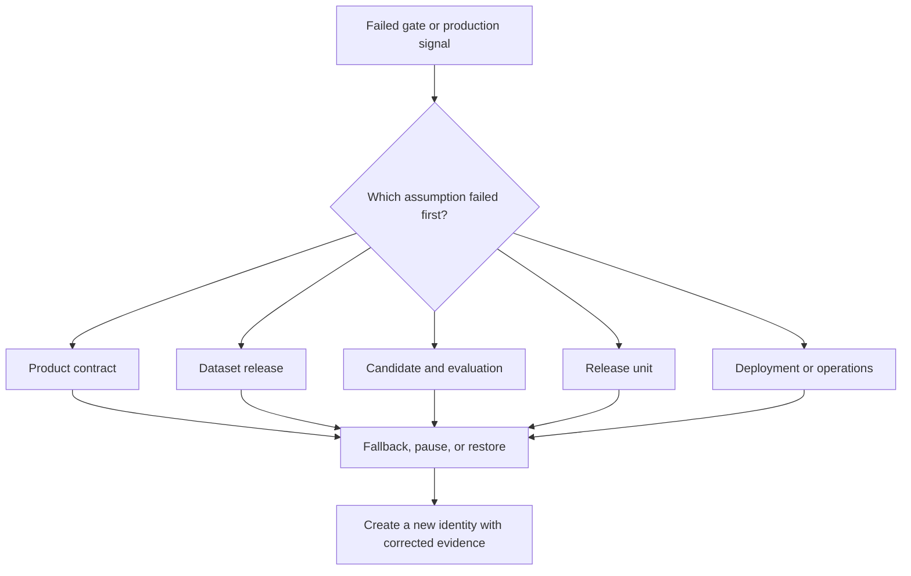
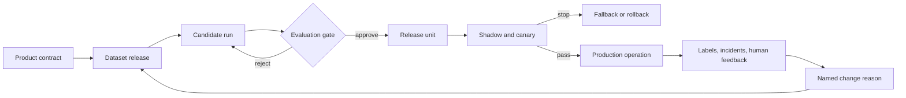

## A Lifecycle Is A Controlled State Flow
<!-- section-summary: The ML lifecycle moves one model version through states whose inputs, outputs, owners, gates, and recovery actions are explicit. -->

An **ML system lifecycle** is the controlled path that one model-powered decision follows from definition to production evidence. Each state accepts an input, produces an artifact or decision, and has a named owner. A gate decides whether the work moves forward, stays for investigation, or returns to an earlier state.

The previous article introduced learning, release, and operating loops. A supporting example follows one version through those loops. We will use **FreshBasket**, a grocery chain that predicts how many strawberry crates each store should order for the next day. The prediction runs at 03:30, planners review it before 05:00, and supplier orders leave at 05:30.

Here is the lifecycle before any tool names enter the picture:

| State | Required input | Evidence produced | Main owner | Stop or recovery rule |
|---|---|---|---|---|
| Product contract | Decision, user, timing, action | Target, metrics, guardrails, fallback | Product and domain | Return when action or label lacks a clear definition |
| Dataset release | Source events and label policy | Version, manifest, validation report | Data | Block on immature labels, leakage, or failed quality checks |
| Candidate run | Dataset, code, config, runtime | Model artifact, run record, evaluation report | ML | Reject when baseline, slice, or runtime gates fail |
| Release unit | Approved candidate and serving contract | Registry version, image digest, rollout and rollback plan | ML and platform | Block when identity, signature, approval, or rollback evidence is missing |
| Production | Controlled traffic | Service, data, prediction, label, and product signals | Operations and product | Pause, fall back, or roll back when stop rules fire |
| Feedback | Mature outcomes and incident evidence | Change request, corrected data, new hypothesis | Product, data, and ML | Retrain only after the team identifies the change it wants to make |

This table is the lifecycle spine. A pipeline engine can automate transitions, and it should preserve the evidence and stop rules rather than turning the path into an unreviewed sequence of jobs.

## Define The Product Decision
<!-- section-summary: The product contract fixes who receives the prediction, when it runs, what action follows, which label measures it, and which fallback protects operations. -->

FreshBasket starts with one operational decision: how many strawberry crates should store `044` order for tomorrow? The model predicts demand by store and product. A planner can accept or override the recommendation, and the ordering system needs a fallback when the batch misses its deadline.

The product contract records the parts that later stages must preserve:

```yaml
decision: next-day fresh-produce order quantity
prediction_time: "03:30 store local time"
entity_key: [store_id, sku_id, forecast_date]
target: units_sold_before_close_adjusted_for_stockout
primary_metric: weighted_absolute_percentage_error
guardrails:
  top_volume_store_underforecast_rate: "<= 0.12"
  planner_override_rate: "<= 0.15"
  batch_ready_by: "04:30 local time"
fallback: previous_approved_forecast_with_planner_warning
owners:
  product: fresh-produce-planning
  model: demand-forecasting
  data: retail-data-platform
```

The target needs special care. Raw units sold can understate demand when a store runs out of strawberries at 16:00, so FreshBasket records stockout evidence and reviews the label rule. The prediction time also limits features. Tomorrow's final weather and tomorrow's realised footfall cannot enter a forecast created at 03:30.

This state ends when product, domain, data, and ML owners agree on the decision, timing, label, metrics, guardrails, and fallback. A training run cannot repair an unclear product contract.

## Build A Versioned Dataset
<!-- section-summary: The dataset state turns source events into eligible examples with a fixed time boundary, mature labels, validation evidence, and a durable identity. -->

The data pipeline builds one row per `(store_id, sku_id, forecast_date)`. It joins sales, inventory, promotions, store closures, weather observations available by prediction time, supplier changes, and later outcomes. It waits until labels mature, then writes an immutable dataset release.

The release manifest gives training a stable input:

```yaml
dataset: strawberry-demand-examples
version: 2026-06-30-r2
prediction_window: 2026-01-01..2026-06-30
label_as_of: 2026-07-07T00:00:00Z
source_versions:
  sales: iceberg_snapshot_881204
  inventory: iceberg_snapshot_881260
  promotions: git_7a421bc
pipeline_commit: 4c91e20
checks:
  duplicate_entity_dates: 0
  immature_labels: 0
  missing_inventory_rate: 0.0018
  promotion_join_rate: 0.9987
manifest_sha256: 72f2b6c9a8f1d31e
```

The validation gate covers schema, keys, freshness, ranges, label maturity, leakage, joins, and distribution changes. A failed check has a response. Missing supplier records can stop publication, while a real increase in summer promotions can open a review and update the baseline after an owner confirms the event.

The output of this state is a dataset identity plus its validation report. Training should read the versioned output, rather than a mutable table called `latest`.

## Create And Evaluate A Candidate
<!-- section-summary: A candidate run binds code, data, config, runtime, model artifact, metrics, slices, and failure examples under one run identity. -->

FreshBasket launches a training job with the approved dataset release. The job records its Git commit, resolved config, container digest, package lock, seed policy, hardware, logs, metrics, and artifacts under one run ID.

Evaluation compares the candidate with the current production model on the same protected data. The primary forecast metric supports ranking, while guardrails protect important operations. FreshBasket checks top-volume stores, new stores, promotion weeks, different regions, under-forecasting, planner overrides, runtime, and model package size.

| Evidence | Champion `v17` | Candidate `v18` | Gate |
|---|---:|---:|---|
| Weighted absolute percentage error | 0.184 | 0.171 | improve |
| Top-volume under-forecast rate | 0.109 | 0.113 | at most 0.120 |
| Promotion-week error | 0.241 | 0.206 | no regression |
| Batch runtime | 31 minutes | 34 minutes | ready before 04:30 |
| Planner replay overrides | 13.2% | 12.4% | at most 15% |

The candidate passes these example gates. That result creates an approval recommendation, and it does not send the model directly to all stores. The evaluation report still records uncertainty, weak slices, known limitations, and the exact artifact that reviewers examined.

## Register The Release Unit
<!-- section-summary: The release unit joins the model artifact, serving runtime, schemas, rules, approvals, rollout plan, and rollback target under one identity. -->

A model file alone cannot describe a production release. FreshBasket's **release unit** contains the registered model version, scoring code or image, input and output schemas, feature or preprocessing bundle, threshold and business-rule config, evaluation report, approval, rollout plan, and rollback target.

```yaml
release_id: strawberry-demand-2026-07-08.1
model_version: strawberry-demand-forecast:18
model_digest: sha256:ab8910c2
scoring_image: ghcr.io/freshbasket/demand-score@sha256:de1739a4
input_schema: strawberry-demand-features-v6
rules_config: produce-order-rules-v9
evaluation_report: s3://freshbasket-ml/reviews/strawberry-demand/18/report.json
approval_status: approved_for_shadow
rollback:
  model_version: strawberry-demand-forecast:17
  scoring_image: ghcr.io/freshbasket/demand-score@sha256:c204f5a1
```

The registry or catalog records the model version and its lineage. Deployment configuration records where that version runs and which traffic or stores use it. Keeping these ideas separate prevents a registry label from silently changing production traffic without a deployment event.

Before release, a packaging test loads the model inside the scoring image, validates a known input, checks the output schema, and confirms version metadata. The gate blocks when the model loads in training and fails in the real runtime.

## Release Through Controlled Traffic
<!-- section-summary: Shadow, canary, and expanded rollout stages gather production evidence while limiting the impact of a weak candidate. -->

FreshBasket starts with **shadow scoring**. Version `18` receives real production inputs and writes comparison output, while planners continue to use version `17`. The team checks data compatibility, batch completion, forecast distributions, and store-level differences without changing an order.

The next stage is a ten-store canary. Those planners see version `18` recommendations and can override them. The rollout then expands to one region before all stores. Each stage has a duration, pass rules, stop rules, an owner, and the same rollback target.

```yaml
stages:
  - name: shadow
    duration: 48h
    pass: [batch_on_time, feature_errors_clear, score_diff_reviewed]
  - name: canary_10_stores
    duration: 24h
    pass: [override_rate_clear, underforecast_proxy_clear, support_queue_normal]
  - name: regional_canary
    duration: 48h
    pass: [planner_approval, stockout_proxy_clear, batch_on_time]
stop_actions:
  active_customer_or_store_harm: restore_v17
  invalid_feature_publish: use_fallback_and_pause_rollout
```

Rollback restores the full release unit when the issue may involve model, preprocessing, or rules. A model-only rollback can leave a broken feature or changed threshold in place. The release runbook names which components move together and how the team verifies recovery.

## Operate With Production Evidence
<!-- section-summary: Operations combines system health, data health, prediction behaviour, mature quality, business outcomes, and human feedback with named actions. -->

After full rollout, FreshBasket watches several signal layers. System signals show whether the batch starts, finishes, reads dependencies, and publishes output. Data signals show freshness, missingness, categories, and joins. Prediction signals show forecast distributions and fallback use. Quality signals compare forecasts with mature sales and stockout-adjusted labels. Product signals show planner overrides, waste, stockouts, and support reports.

| Signal | Example response |
|---|---|
| Batch misses 04:30 | Publish the previous approved forecast with a visible warning |
| Inventory features stale | Pause affected stores and route them to manual planning |
| Forecast distribution doubles in one region | Check promotions, units, supplier packs, and recent releases |
| Label join delayed | Mark quality dashboard stale and fix the label pipeline before retraining |
| Stockouts rise after rollout | Restore `v17`, preserve incident evidence, and inspect affected slices |

Prediction records connect these layers. Each row carries the model version, release ID, entity keys, prediction time, input references or permitted feature values, output, fallback state, and later label link. Privacy and retention rules control sensitive records.

An alert only helps when it points to an owner, dashboard, runbook, and decision. The operations state should produce evidence that the team can use, rather than a collection of thresholds with no response path.

## Failure Moves Work Backward Deliberately
<!-- section-summary: Lifecycle failures return work to the state that owns the broken assumption while preserving the evidence that triggered the move. -->

A lifecycle needs backward transitions because different failures belong to different owners. A stale source belongs to dataset preparation. A weak regional result belongs to candidate evaluation. An incompatible input schema belongs to packaging and integration. A latency regression may belong to the runtime or capacity design. A harmful product outcome may require changes to the model, business rule, or original product contract.

Sending every failure to “retrain the model” hides these distinctions. Retraining on the same broken source reproduces the data problem. Rebuilding the same model package does not repair an unclear product action. The incident or failed gate should identify the earliest invalid assumption and return work to that state.

| Failure evidence | Owning state | Immediate protection | Durable correction |
| --- | --- | --- | --- |
| Late or incomplete inventory events | Dataset release | quarantine dataset and use prior snapshot | repair ingestion and rebuild under a new identity |
| Candidate misses promotion-week guardrail | Candidate evaluation | reject candidate | change data, features, objective, or hypothesis |
| Runtime cannot load preprocessing bundle | Release unit | block deployment | fix packaging and rerun integration checks |
| Canary raises planner override rate | Controlled release | stop expansion and restore prior release | inspect affected slices and workflow impact |
| Target definition no longer matches ordering policy | Product contract | use fallback and pause retraining | redefine decision, label, and evaluation gates |

Every backward move should preserve the failed dataset, run, report, release request, or incident record. These artifacts explain why the next version exists. They also prevent a corrected build from quietly replacing the evidence attached to an earlier identity.



This failure map also clarifies ownership during incidents. Operations can activate the safe fallback immediately, while product, data, ML, or platform owners investigate the state they control.

## Turn Feedback Into The Next Change
<!-- section-summary: Feedback creates a specific change request from mature labels, incidents, human review, and product evidence before another candidate runs. -->

FreshBasket joins each forecast with later sales, stockouts, waste, planner overrides, and notes. The team reviews errors by store, product, promotion type, region, and weather. An incident may reveal a supplier pack-size change. A steady quality decline may reflect a new store mix. Planner notes may show that a business rule needs adjustment while the model remains useful.

The feedback state produces a **change reason**. Examples include a scheduled data refresh, corrected promotion labels, a new-store segment regression, a feature outage fix, or a product contract change. The reason enters the next experiment and run record.

Retraining is one possible response. A broken source needs repair and dataset rebuilding. A changed supplier pack may need a feature or rule update. An unclear planner action may need product design work. Naming the reason keeps the lifecycle from turning every alert into automatic retraining.

## Putting It All Together
<!-- section-summary: The lifecycle gives every model version a state, evidence packet, owner, gate, and recovery path from product definition through feedback. -->

FreshBasket's lifecycle starts with a product contract and ends with a specific reason for the next change. A versioned dataset enters a candidate run. Evaluation produces a decision packet. The release unit joins the model with its runtime and rules. Shadow and canary stages limit risk. Production signals drive fallbacks, rollback, investigation, and improvement.



Each arrow represents a controlled handoff. The handoff carries identities and evidence, and the receiving state checks them. This structure gives automation useful boundaries and gives people a clear place to stop when the evidence fails.

## References

- [Google Cloud: MLOps continuous delivery and automation pipelines in machine learning](https://docs.cloud.google.com/architecture/mlops-continuous-delivery-and-automation-pipelines-in-machine-learning)
- [TensorFlow: Understanding TFX Pipelines](https://www.tensorflow.org/tfx/guide/understanding_tfx_pipelines)
- [Microsoft Learn: MLOps model management with Azure Machine Learning](https://learn.microsoft.com/en-us/azure/machine-learning/concept-model-management-and-deployment?view=azureml-api-2)
- [AWS SageMaker AI: Model Registry](https://docs.aws.amazon.com/sagemaker/latest/dg/model-registry.html)
- [MLflow: Model Registry workflows](https://mlflow.org/docs/latest/ml/model-registry/workflow/)
- [Google Research: The ML Test Score](https://research.google/pubs/the-ml-test-score-a-rubric-for-ml-production-readiness-and-technical-debt-reduction/)
