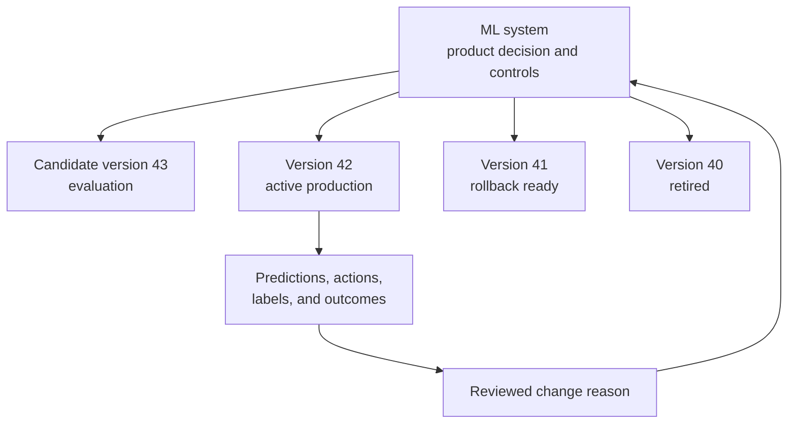
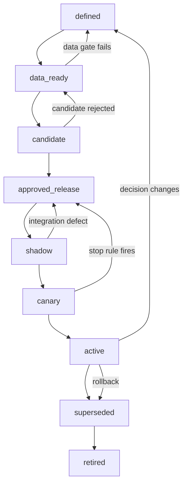
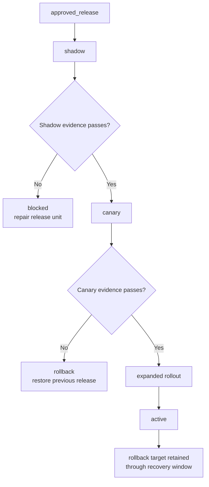
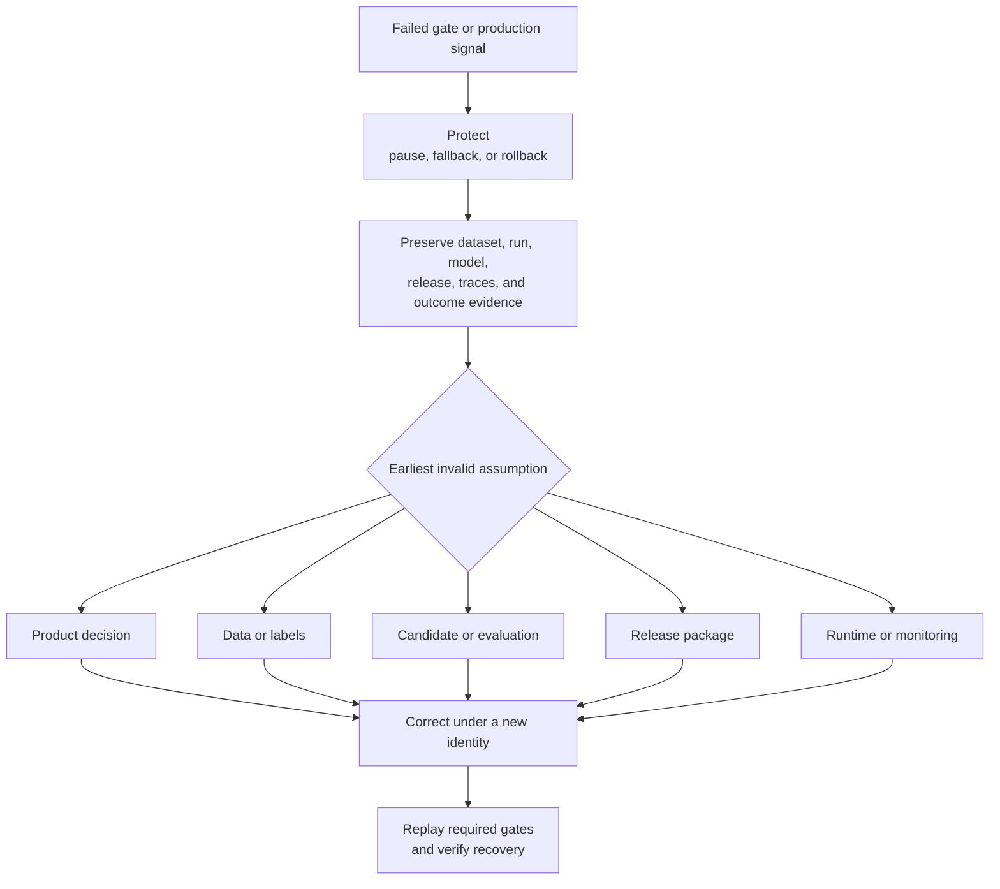

## Table of Contents

1. [Why An ML System Needs A Lifecycle](#why-an-ml-system-needs-a-lifecycle)
2. [The Stages An ML System Moves Through](#the-stages-an-ml-system-moves-through)
3. [Define What Must Be True Before Work Moves To The Next Stage](#define-what-must-be-true-before-work-moves-to-the-next-stage)
4. [Prepare Data For The Model's Intended Use](#prepare-data-for-the-models-intended-use)
5. [Train A Reproducible Model](#train-a-reproducible-model)
6. [Evaluate And Approve The Complete Production Package](#evaluate-and-approve-the-complete-production-package)
7. [Introduce The Approved Model To Production](#introduce-the-approved-model-to-production)
8. [Use Production Results To Choose The Right Fix](#use-production-results-to-choose-the-right-fix)
9. [Return To The Earliest Stage That Contains The Failure](#return-to-the-earliest-stage-that-contains-the-failure)
10. [Retire Models And Their Dependencies Safely](#retire-models-and-their-dependencies-safely)
11. [Record The Lifecycle With Current Industrial Tools](#record-the-lifecycle-with-current-industrial-tools)
12. [The Full ML System Lifecycle](#the-full-ml-system-lifecycle)
13. [References](#references)

At a high level, the **ML system lifecycle** is the controlled path that carries a model-powered decision from definition to production, then carries production evidence back into improvement or retirement.

Learning, release, and operating loops describe the work that repeats over time. The lifecycle view describes the approved states within that work, the evidence that allowed entry, and the decisions that move the system elsewhere.

Imagine a delivery-time model that has served the same artifact for several weeks. Its endpoint stays healthy. During those weeks, restaurant workflows change, feature data arrives later, a dependency receives an update, and labels continue to mature. The artifact stayed fixed while the system around it moved.

A lifecycle gives those changes a place to go. A new dataset cannot quietly replace the one used for an approved model. A successful training job cannot place its output into production by itself. A failing canary has a recorded return path. A retired endpoint cannot leave active credentials and scheduled jobs behind.

In essence, the lifecycle turns continuous change into explicit states, evidence, decisions, and recovery.

## Why An ML System Needs A Lifecycle
<!-- section-summary: The lifecycle controls changes in product meaning, data, labels, code, infrastructure, models, and real-world outcomes. -->

Traditional release records usually center on code and infrastructure. ML systems need those records too, along with several other identities.

The same training code can produce a different model after the input data changes. The same model can produce different behaviour after a feature service starts returning defaults. The same score can create greater risk after the product changes its action from “recommend review” to “reject automatically.”

Labels add another source of motion. A fraud decision happens immediately, while a confirmed chargeback may arrive weeks later. Service evidence appears first. Trustworthy model-quality evidence appears after enough outcomes mature and join back to the original predictions.

The product can also influence the data it later observes. A recommendation changes what users see. A demand forecast changes inventory. A risk model changes which cases receive human review. Future data contains part of the system's earlier behaviour.

A **model candidate** is a trained model version being evaluated for possible approval and production use.

These relationships create two connected lifecycles:

- The **ML system lifecycle** covers the product capability across many model versions.
- The **model-version lifecycle** covers one candidate from creation through approval, production use, replacement, and retirement.

The system lifecycle may last for years. Several model versions can move through it at once: one in experimentation, one in canary, one active, and one preserved for rollback.


```mermaid
flowchart TD
    A["ML system<br/>product decision and controls"] --> B["Candidate version 43<br/>evaluation"]
    A --> C["Version 42<br/>active production"]
    A --> D["Version 41<br/>rollback ready"]
    A --> E["Version 40<br/>retired"]
    C --> F["Predictions, actions,<br/>labels, and outcomes"]
    F --> G["Reviewed change reason"]
    G --> A

    class A system;
    class B candidate;
    class C,F,G active;
    class D,E history;
```

This distinction prevents a common mistake. Replacing a model version is one possible response to production evidence. A label-pipeline repair, feature change, threshold update, product-policy change, capacity adjustment, or full system retirement may fit the evidence better.

## The Stages An ML System Moves Through
<!-- section-summary: A state describes the approved condition of an ML asset, while a transition records the decision and evidence that changes that condition. -->

An ML system moves through defined stages. Teams prepare data, train a model,
approve a release, operate it, repair failures, and retire old versions. A
**state** records the current approved condition of the full ML capability, a
dataset release, a model candidate, or a production release.

A **transition** is the recorded decision that changes that condition. For example, a model candidate moves to `approved_for_canary` after its evaluation and integration evidence passes the release policy.

The difference matters because work can run without changing state. A training job may fail and retry while the latest approved dataset remains `data_ready`. A shadow deployment may collect evidence while the current production release remains active. State changes only after the authority for that transition accepts the required evidence.

### Pipeline Steps And Lifecycle Stages Answer Different Questions

A pipeline step describes work to execute, while a lifecycle stage describes what has been approved. A step says, “run this command after that command.” A stage says, “this subject has satisfied these conditions and may now be used in these ways.”

Suppose an orchestrator finishes a training task with exit code zero. That result proves that the process completed. It leaves several questions open:

- Did the job read the approved dataset?
- Is the produced artifact loadable?
- Did important segments pass?
- Did security and integration checks pass?
- Who approved production exposure?

The lifecycle keeps the model in `candidate` until the relevant decisions exist. Automation can prepare and evaluate the evidence. Policy and accountable owners control the state change.

### Include Rework, Recovery, And Retirement Paths

The lifecycle needs paths for rework, recovery, and retirement as well as normal forward progress. A failed data check returns work to dataset preparation. A canary defect returns the release to packaging or model development. A harmful product outcome can reopen the original decision.


```mermaid
flowchart TD
    P["defined"] --> D["data_ready"]
    D --> C["candidate"]
    C --> A["approved_release"]
    A --> S["shadow"]
    S --> K["canary"]
    K --> R["active"]
    R --> U["superseded"]
    U --> X["retired"]

    D -->|data gate fails| P
    C -->|candidate rejected| D
    S -->|integration defect| A
    K -->|stop rule fires| A
    R -->|rollback| U
    R -->|decision changes| P

    class P,D define;
    class C,A build;
    class S,K release;
    class R active;
    class U,X stop;
```

The state names can differ across organizations. Their contracts should remain precise enough for people and automation to agree on the current condition and allowed next actions.

## Define What Must Be True Before Work Moves To The Next Stage
<!-- section-summary: Each transition names the subject, entry evidence, decision policy, accountable owner, exit evidence, and return path. -->

Before work moves to the next lifecycle stage, both sides need the same definition of readiness. A data scientist may consider a candidate ready because its metrics look good. The release owner may still lack a load test or rollback target. A **handoff contract** records the required inputs and checks, names the decision authority, and defines the resulting state.

Every lifecycle transition answers six questions:

1. **Subject:** Which exact dataset, model, image, release, or ML capability may change state?
2. **Entry evidence:** Which identities and reports must already exist?
3. **Decision rule:** Which versioned policy determines pass, reject, review, or expiry?
4. **Authority:** Which service or person can make the decision?
5. **Exit evidence:** Which durable record proves the new state?
6. **Return path:** What protects users and where does work go after rejection or failure?

These questions form the lifecycle's common framework. Data publication, model approval, canary expansion, rollback, and retirement can all use it.

A candidate-to-release handoff might use this record:

```yaml
transition: candidate_to_approved_release
subject:
  model_id: customer-risk@42
  dataset_id: risk-examples@snapshot-8842
  code_commit: 7d83a14
  training_image: registry.example/ml/train@sha256:32421559c392d95d4b0f25a7b9a388f50eafeb73c592fb38ac6c3bb31fc4a8d6
entry_evidence:
  evaluation_report: evaluations/customer-risk-42.json
  integration_test: passed
decision:
  status: approved_for_canary
  policy_version: model-release-v7
  owner: risk-ml-platform
exit_evidence:
  release_id: customer-risk-release-42.1
return_path:
  rollback_target: customer-risk@41
```

The format can live in a registry, metadata database, catalog, or managed ML platform. The relationships must be queryable. An operator should be able to start from `release_id` and recover the approved model, dataset, code, runtime, evidence, policy, and owner.

### Keep Historical Results And Recheck Expired Approvals

Historical evaluation results should retain what they measured, even if an approval later expires. A new policy can make another decision from that report or require fresh evaluation. Overwriting the earlier result would erase why the original approval occurred.

Approvals may expire after a model, dataset, dependency, regulation, or product action changes. The lifecycle record keeps the historical decision and creates a new transition request. This gives audits and incidents an honest timeline.

### The Next Stage Checks The Required Inputs

The next lifecycle stage checks the identifiers, signatures, policy version, permissions, and results it requires. This prevents the producing stage from declaring its own work ready without the receiver's validation.

For example, a release controller may reject an approved model because the referenced image digest is missing or the rollback target can no longer load. The evaluation decision remains valid for the model's measured behaviour. The release transition stays blocked until its own contract passes.

## Prepare Data For The Model's Intended Use
<!-- section-summary: The data-ready transition proves that one versioned dataset follows the product decision, time boundary, label rule, quality policy, and access controls. -->

Data preparation starts from the model's intended use: its prediction moment, action, target, success measures, guardrails, fallback, and owners. The lifecycle records these facts in the `defined` state, then checks whether historical data can represent that decision honestly.

Its main output is a **dataset release**. This is a stable identity for eligible examples, feature logic, label policy, split rules, source versions, and validation evidence.

Consider an observation created at 10:00. A customer-status feature was written at 11:30 after an investigation completed. A join using only the customer ID would leak future information into training. A **point-in-time join** selects the latest eligible feature value at or before 10:00.

Labels also have a time boundary. A customer without a churn event after seven days may still churn inside the agreed 30-day window. The dataset release waits for the label to mature or marks the example unresolved.

### Check What Enters And Leaves The Data Stage

The data stage starts with the product contract, source definitions, feature logic, label policy, and access rules. It should finish with the following reviewed outputs:

- an immutable table snapshot, warehouse snapshot, or file manifest;
- a schema and entity-key definition;
- prediction-time and label-maturity cutoffs;
- training, validation, and protected-test split identities;
- validation results for freshness, keys, joins, missingness, ranges, and leakage;
- data classification, owner, access, and retention records.

The data gate rejects the transition if a hard rule fails. A real distribution shift may open a review instead. The reviewer decides whether the change reflects valid new behaviour, a source defect, or an outdated baseline.

Suppose an identifier migration reduces feature-join coverage from 99.8% to 82% in one region. The gate quarantines the new release and preserves the previous approved snapshot. The data owner repairs the mapping, rebuilds under a new identity, reruns the checks, and compares affected keys before requesting another transition.

### Record Dataset Versions And Data Quality Checks

Industrial data platforms record exact dataset versions and the checks applied to them. Delta Lake and Apache Iceberg give object-storage tables versioned states, while warehouses can use snapshots or immutable release tables. dbt constraints and tests often cover structural checks; Great Expectations, Soda, or Deequ can add rules that span systems or distributions.

OpenLineage can record compatible dataset, job, and run relationships across processing tools. It supplies lineage metadata. The dataset owner still defines the quality policy and decides whether a release is fit for training.

## Train A Reproducible Model
<!-- section-summary: The candidate transition binds one training output to the approved dataset, code, configuration, environment, compute, run, and basic artifact checks. -->

A reproducible model links one training result to the exact data, code, configuration, and runtime that produced it. The `data_ready` state authorizes a particular dataset release, then a tracked training job uses those inputs to create a model candidate.

The important transition result is traceability. The candidate record connects:

- dataset release and feature definitions;
- Git commit and resolved training configuration;
- dependency lock or container digest;
- framework version, seed policy, and hardware class;
- run identity, logs, metrics, and artifacts;
- model signature and a basic load test.

Experiment tracking systems hold these relationships. MLflow 3 uses runs for executions and Logged Models for model identities. Metrics can link directly to a Logged Model and the dataset that produced them. Weights & Biases and provider-native trackers can fill the same role.

The orchestrator has a separate job. Airflow, Dagster, or a managed ML pipeline starts the training task with the approved inputs, records its status, and preserves failure details. The tracker records what the execution produced. Neither system approves production use.

### A Successful Training Job Can Still Produce An Unusable Model

A successful job status proves that the process finished; it does not prove that the trained model can be used. The output may have a missing dependency, incompatible signature, corrupt serialization, or incomplete metadata.

The candidate transition therefore loads the artifact in a clean environment and scores a known input. It checks the output schema and verifies that the recorded model identity matches the artifact. A failure blocks candidate publication and points back to training or packaging.

A transient compute interruption can retry under the declared run policy. A code correction, data change, or configuration change creates a new run identity. Partial artifacts remain marked unusable unless a later process explicitly validates them.

For a small team, a containerized training script on a managed job covers execution well. MLflow can hold the run and model relationships.

Managed jobs remain the practical default until the workload needs greater control over distributed execution or specialized scheduling. A team may then accept the operating cost of Kubernetes or Ray.

## Evaluate And Approve The Complete Production Package
<!-- section-summary: The approval transition combines model and system evaluation with the complete runtime package that production will execute. -->

Production approval covers the model and everything required to run it safely: runtime, feature contract, policy, infrastructure, and rollback target. The evaluation checks model behavior and the complete package, then records whether that exact combination may enter controlled production exposure.

Evaluation compares the candidate with a meaningful baseline and the current production model. It measures the primary task, important groups, realistic input conditions, latency, resource use, and integration behaviour.

Suppose overall recall improves from 0.81 to 0.85, while the false-positive rate for one protected segment rises from 0.04 to 0.11. The aggregate improvement cannot approve the candidate because the segment guardrail failed.

Scores may also need **calibration**. If only 45 of 100 cases scored near `0.8` later show the predicted outcome, the score overstates risk for that group. Calibration analysis makes that mismatch visible. A decision threshold then translates the score into a product action, so threshold evaluation must use the real cost of false positives and false negatives.

Robustness tests show behaviour under expected stress. A new category, missing optional field, image corruption, or moderate data shift can reveal a failure that average validation data hides. Unfamiliar inputs may need an uncertainty or human-review path.

### Record The Approval Before Deployment

Approval records the decision to permit a specific production use before any deployment changes traffic. The evaluation report preserves measurements, weak segments, representative failures, runtime results, and known limitations. A versioned gate compares those results with policy.

The approved subject is a **release unit**, which joins:

- the model artifact and model signature;
- preprocessing or feature retrieval rules;
- scoring code and dependency environment;
- input and output schemas;
- thresholds and product policy;
- serving image or managed serving specification;
- evaluation and approval records;
- rollout stages, stop rules, and rollback target.

Packaging tests load this exact unit in a production-like environment. They send known inputs through preprocessing, inference, post-processing, and telemetry. A model that works in the training process and fails in the serving image stays out of production.

### Record The Model Before Deploying It

Before deployment, model registration records the version, origin, permissions, and approval details. Deployment is a separate action that places one approved release into an endpoint, batch job, application, or device.

MLflow fixed model stages are deprecated. Current workflows use immutable versions, tags, and aliases. Amazon SageMaker Model Registry and Gemini Enterprise Agent Platform Model Registry (formerly Vertex AI Model Registry) provide managed registry implementations. Azure Machine Learning registries and Databricks Unity Catalog can represent the same model-version responsibility.

An alias such as `champion` can point to an approved model version. The deployment record still states where that version runs, which complete release unit surrounds it, and which traffic receives it.

## Introduce The Approved Model To Production
<!-- section-summary: Shadow, canary, and progressive rollout transitions gather production evidence while preserving explicit stop and rollback paths. -->

An approved model enters production through controlled exposure rather than receiving full traffic immediately. The `approved_release` state records that offline and integration checks passed, while production evidence still needs to confirm the release under live conditions.

A **shadow** transition sends production inputs through the candidate without using its output for the live action. This exposes schema errors, missing features, latency, capacity, and prediction differences. Real data still brings privacy and cost obligations.

A **canary** transition gives the candidate a small, stable cohort. Online systems may use eligible traffic or account groups. Batch systems may use one partition, location, or time window. The canary records its duration, entry cohort, quality proxies, service limits, stop rules, and owner.


```mermaid
flowchart TD
    A["approved_release"] --> B["shadow"]
    B --> C{"Shadow evidence passes?"}
    C -->|No| X["blocked<br/>repair release unit"]
    C -->|Yes| D["canary"]
    D --> E{"Canary evidence passes?"}
    E -->|No| F["rollback<br/>restore previous release"]
    E -->|Yes| G["expanded rollout"]
    G --> H["active"]
    H --> I["rollback target retained<br/>through recovery window"]

    class A,B,D,G ready;
    class C,E decide;
    class X,F stop;
    class H,I active;
```

Suppose the canary accepts valid requests, yet a recently added category produces an empty feature vector. The stop rule removes the release from traffic and restores the previous complete unit. The incident preserves affected prediction references. The owner repairs the feature or schema path, adds a regression case, and creates a new release identity.

Rollback is itself a lifecycle transition. It identifies the release leaving traffic, the restored target, the trigger evidence, the decision owner, and the verification window. Restoring only the model can leave changed preprocessing or policy in place.

Managed endpoints provide much of the traffic mechanism for teams using a cloud ML platform. Kubernetes platforms may use KServe with compatible traffic management. A standard API service behind a load balancer can support a small workload. Each implementation still needs the same state evidence and recovery record.

## Use Production Results To Choose The Right Fix
<!-- section-summary: The feedback transition verifies operational and outcome evidence, identifies the changed assumption, and creates one owned change request. -->

Production results should point the team toward a specific fix instead of triggering automatic retraining for every alert. Immediate results cover service execution, feature availability, schema failures, prediction behavior, fallbacks, and release identity. Delayed results arrive after labels and product outcomes mature.

A prediction record connects the two clocks. It identifies the release, model, event time, governed entity references, output, product action, and fallback. The later label or outcome uses the same join key or an approved mapping.

Feedback creates a lifecycle transition only after the evidence is trustworthy. The first review checks monitoring freshness, schema versions, label volume, join coverage, and policy versions. The next review compares segments, features, actions, releases, and representative records.

Suppose label-based quality drops sharply while outcome join coverage falls from 96% to 51%. The correct change request is “repair and backfill the outcome join.” Retraining from the partial labels would hide the evidence failure and create a questionable dataset.

### One Symptom Can Require Different Repairs

The same symptom can require different repairs depending on the failing assumption. A verified finding can return to:

- product definition after the action or risk boundary changes;
- dataset preparation after a source, feature, or label defect;
- candidate development after genuine model decay;
- release packaging after a dependency or schema mismatch;
- operations after a capacity, telemetry, or routing issue;
- retirement after the capability loses value or safe support.

The transition record names the evidence, affected scope, immediate protection, responsible stage, owner, and verification plan. This is more useful than an alert whose only action says “retrain.”

A schedule or drift signal may launch training after the evidence supports that choice. The resulting candidate still passes the current data, evaluation, approval, and rollout transitions. Continuous training and automatic production release remain separate authorities.

### Account For How Model Decisions Change Later Data

Model decisions can change the data collected later. A recommendation changes which items receive exposure. A risk model changes which cases reach human review. A forecast changes inventory and therefore observed sales.

Production records should retain the model output and the action that followed. Reviewers can then distinguish an environmental change from a feedback effect created by the product itself. Human corrections, overrides, appeals, and support reports add evidence that aggregate metrics may miss.

## Return To The Earliest Stage That Contains The Failure
<!-- section-summary: Lifecycle incidents protect users, preserve the failed state, locate the earliest invalid assumption, create a corrected identity, and replay the required gates. -->

A durable repair returns to the earliest lifecycle stage that contains an
invalid assumption. A production symptom alone may not identify that stage.
Stale predictions can come from delayed data, old features, a broken cache, or
a model that no longer matches current behavior.

The investigation follows a fixed order. Protect the current user or operation. Preserve the failed versions and evidence. Locate the earliest assumption that stopped being true. Repair that stage under a new identity, then replay its downstream gates.


```mermaid
flowchart TD
    A["Failed gate or production signal"] --> B["Protect<br/>pause, fallback, or rollback"]
    B --> C["Preserve dataset, run, model,<br/>release, traces, and outcome evidence"]
    C --> D{"Earliest invalid assumption"}
    D --> P["Product decision"]
    D --> DA["Data or labels"]
    D --> M["Candidate or evaluation"]
    D --> R["Release package"]
    D --> O["Runtime or monitoring"]
    P --> N["Correct under a new identity"]
    DA --> N
    M --> N
    R --> N
    O --> N
    N --> V["Replay required gates<br/>and verify recovery"]

    class A signal;
    class B,C protect;
    class D,P,DA,M,R,O decide;
    class N,V repair;
```

### Contain The Current Impact

Containment limits the current impact while investigation continues. An online service may use a safe rule or previous release. A batch system may publish the previous approved result with a visible stale-data warning. A high-impact workflow may pause automation and open human review.

Containment should be defined before an incident. The owner, command or control, expected user effect, and recovery check belong in the runbook and release record.

### Repair The Earliest Invalid Assumption

The repair belongs at the earliest invalid assumption. A late source returns to data ingestion and the dataset release. A protected-segment failure returns to candidate development and evaluation. A model-loading error returns to packaging. A canary latency regression may return to feature lookup, capacity, or serving code.

Retraining on broken labels reproduces the defect. Repackaging the same artifact cannot repair a changed decision rule. The transition map keeps those responsibilities separate.

### Run The Same Checks After A Repair

Every repair should pass through the checks that originally protected its lifecycle stage. The correction receives a new version and regression case. A data repair rebuilds and compares affected rows. A candidate repair reruns evaluation and protected slices. A release repair repeats integration, shadow, and canary checks.

Recovery evidence shows that the original symptom cleared and neighboring guardrails remained healthy. Traffic returns gradually through an approved transition.

## Retire Models And Their Dependencies Safely
<!-- section-summary: Retirement stops new use, closes active dependencies and permissions, preserves required evidence, and deletes assets after policy obligations expire. -->

Safe retirement stops new use while preserving records and fallback
dependencies required for recovery, audit, or retention. A model version may
leave active traffic after a replacement succeeds. The wider ML capability may
retire after its product decision disappears or a required data source closes.

Retirement starts with dependency discovery. Registry, deployment, and lineage records should reveal endpoints, batch schedules, applications, shadow jobs, dashboards, alerts, feature tables, credentials, and downstream consumers.

The retirement transition then:

1. blocks new deployment of the retiring subject;
2. moves traffic and scheduled work to an approved replacement or fallback;
3. observes the replacement through its recovery window;
4. stops obsolete jobs and endpoints;
5. revokes dedicated identities and permissions;
6. marks registry and catalog records as retired;
7. preserves required evaluation, decision, incident, and prediction evidence;
8. deletes artifacts and data after retention, audit, and rollback obligations expire.

Suppose an upstream provider will remove a required feature source. Lineage identifies the datasets and models that depend on it. A replacement feature passes through a new dataset and model transition. Production traffic moves gradually, while the previous source remains available through the agreed recovery window. Jobs and credentials close after the new path proves stable.

Retirement records prevent unsupported artifacts from appearing production-ready. They also close cost, privacy, security, and operational obligations that survive after traffic stops.

## Record The Lifecycle With Current Industrial Tools
<!-- section-summary: Current tools implement execution, identity, evidence, release, and observability responsibilities while lifecycle policy remains explicit. -->

Industrial tools should record the inputs, execution, model results, release decision, production behavior, and later outcomes for each lifecycle stage. These responsibilities can live inside an integrated platform or across several compatible systems.

**Versioned source and data** identify the inputs. Git records code and configuration. OCI image digests identify runtimes. A warehouse snapshot, immutable manifest, Delta Lake version, or Iceberg snapshot identifies training data.

**Execution and metadata** record what happened. Airflow or Dagster can orchestrate a composable stack. Amazon SageMaker AI Pipelines, Gemini Enterprise Agent Platform Pipelines, Azure Machine Learning jobs, or Databricks Jobs reduce platform work inside a chosen cloud. MLflow 3, Weights & Biases, or provider tracking connects runs, models, datasets, metrics, and artifacts.

**Registry and release control** record what may run and where it runs. MLflow Model Registry and managed cloud registries govern model versions. A managed endpoint, application deployment system, or Kubernetes serving platform owns production placement and traffic. The release record connects the deployed unit back to approval evidence.

**Production evidence** records what the running system did. OpenTelemetry supplies portable service traces, metrics, and logs. Prometheus or cloud monitoring handles operational measurements. A model-monitoring platform and governed outcome join supply data, prediction, and delayed-quality evidence.

OpenLineage can connect dataset, job, and run metadata across compatible tools. IAM, catalogs, approval policies, retention, and audit records apply across every state. NIST AI RMF offers a broader framework for continuous governance, context, measurement, and risk treatment.

A small production path can keep code in Git and identify training data through an immutable warehouse snapshot. A containerized managed job performs training, while MLflow records runs and model evidence. A registry table plus one managed endpoint controls release. OpenTelemetry and a governed outcome join connect production operation to feedback.

This path covers each lifecycle contract with limited platform surface. Additional systems earn their place after scale, latency, reuse, portability, or governance creates a clear need.

## The Full ML System Lifecycle
<!-- section-summary: The lifecycle connects system and model states through versioned subjects, evidence, decisions, owners, return paths, and retirement. -->

The full ML system lifecycle keeps continuous change reviewable from product
definition through retirement. The system capability carries its product
decision and controls across many model versions. Each candidate links to
governed data, code, runtime, evaluation, and release records.

Transitions provide the control points. Entry evidence shows what already passed. A versioned policy and accountable owner decide whether the subject may move. Exit evidence proves the new state. The return path protects users and sends failed work to the stage that owns the broken assumption.

Production feedback creates a specific change request after evidence integrity is confirmed. The request may affect data, code, model behaviour, release infrastructure, product policy, or the whole capability. Retirement closes the path after active use, access, retention, and rollback obligations end.

This framework gives automation firm boundaries and gives people an honest history. A production prediction can lead backward to every decision that enabled it and forward to the outcome that justifies the next controlled transition.

## References

- [Google Cloud: MLOps continuous delivery and automation pipelines](https://docs.cloud.google.com/architecture/mlops-continuous-delivery-and-automation-pipelines-in-machine-learning)
- [Google Cloud: Gemini Enterprise Agent Platform name changes](https://docs.cloud.google.com/gemini-enterprise-agent-platform/vertex-ai-name-changes)
- [Google: Rules of Machine Learning](https://developers.google.com/machine-learning/guides/rules-of-ml)
- [Microsoft Azure Architecture Center: Machine learning operations](https://learn.microsoft.com/en-us/azure/architecture/ai-ml/guide/machine-learning-operations-v2)
- [Amazon SageMaker AI: Implement MLOps](https://docs.aws.amazon.com/sagemaker/latest/dg/mlops.html)
- [NIST AI Risk Management Framework Core](https://airc.nist.gov/airmf-resources/airmf/5-sec-core/)
- [MLflow Tracking](https://mlflow.org/docs/latest/tracking/)
- [MLflow Model Registry workflows](https://mlflow.org/docs/latest/ml/model-registry/workflow/)
- [Databricks: Machine learning lifecycle](https://docs.databricks.com/aws/en/machine-learning/concepts/ml-lifecycle)
- [Databricks: Track and compare models with MLflow Logged Models](https://docs.databricks.com/aws/en/mlflow/logged-model)
- [OpenLineage documentation](https://openlineage.io/docs/)
- [OpenTelemetry documentation](https://opentelemetry.io/docs/)
- [Delta Lake documentation](https://docs.delta.io/)
- [Apache Iceberg documentation](https://iceberg.apache.org/docs/latest/)
