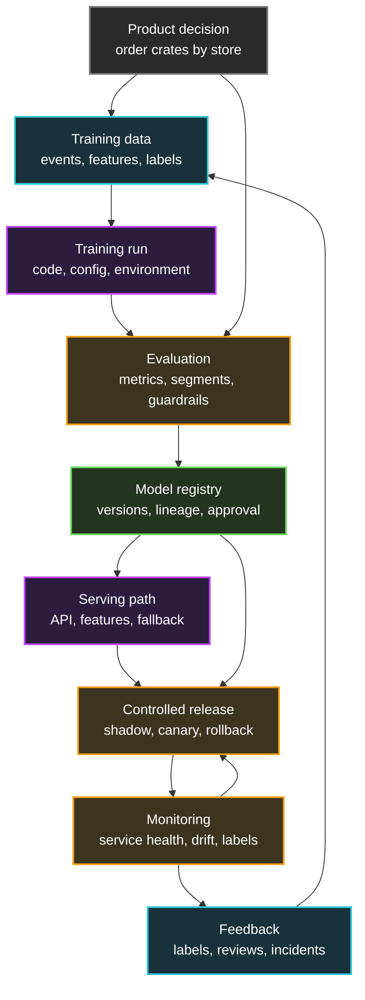

## Table of Contents

1. [Start With The Product Decision](#start-with-the-product-decision)
2. [Turn Production Events Into Training Data](#turn-production-events-into-training-data)
3. [Create A Repeatable Training Run](#create-a-repeatable-training-run)
4. [Evaluate The Candidate Model](#evaluate-the-candidate-model)
5. [Register The Model Version](#register-the-model-version)
6. [Package The Serving Path](#package-the-serving-path)
7. [Release With Gates And Rollback](#release-with-gates-and-rollback)
8. [Monitor The System And The Model](#monitor-the-system-and-the-model)
9. [Feed Production Evidence Back Into The Loop](#feed-production-evidence-back-into-the-loop)
10. [Putting It All Together](#putting-it-all-together)

## Start With The Product Decision
<!-- section-summary: The lifecycle starts by naming the product decision, the prediction target, and the cost of each kind of mistake. -->

A production ML lifecycle starts with a **decision the product needs to make**. The model exists to support that decision. A model that predicts something interesting but never changes a product action stays an experiment, while a production model shapes a real workflow.

Let's use **FreshBasket Grocers**, a regional grocery chain that wants better demand forecasts for fresh strawberries. Every evening, the store planning tool has a decision to make: how many crates should each store order for tomorrow morning. Order too many and berries spoil. Order too few and customers see empty shelves before dinner.

The ML model helps with that decision by producing a **demand forecast**. A forecast of `42` means the store expects to sell about 42 crates tomorrow. The planning tool still needs rules around the forecast. For example, FreshBasket may cap orders when supplier inventory is tight, add a safety buffer before a holiday weekend, or require a planner review when the forecast jumps far above recent history.

A **target label** is the real-world outcome the model learns to predict. For the grocery model, the label could be `units_sold_next_day`. That label might come from point-of-sale transactions adjusted for refunds, stockouts, and store closures. The label definition matters because the model learns exactly what the team calls demand. If a store sold only 10 crates because it ran out at noon, the raw sales number hides true demand and can teach the model to under-order again.

Before anyone opens a notebook, the team should write down a small release brief. This brief gives the lifecycle a clear start and prevents model work from drifting into vague experimentation.

```yaml
model_name: strawberry-demand-forecast
product_decision: order strawberry crates for each store tomorrow
prediction_target: crates sold next business day after stockout adjustment
primary_metric: weighted_absolute_percentage_error
guardrail_metrics:
  under_forecast_rate: must not increase in top-volume stores
  waste_rate: must stay below 4 percent of ordered crates
  batch_completion_time: forecast table ready by 04:30 local time
business_owner: fresh-produce-planning
ml_owner: demand-forecasting-team
serving_path: nightly batch job writes forecast table
```

The primary metric says what the model tries to improve. The guardrail metrics say what the model must protect while improving. **Weighted absolute percentage error** measures forecast error while giving higher-volume stores more weight. **Under-forecast rate** tracks how often the forecast is too low, which matters for empty shelves. **Waste rate** tracks how often the model encourages too much ordering. In fresh grocery work, both under-ordering and over-ordering hurt the business in different ways.

Now we have a decision, a target, and the cost of mistakes. The next question is practical: what data can show the model examples of that decision?


*This visual turns the lifecycle into one operating loop, so the product decision, model work, monitoring, and feedback stay connected.*

## Turn Production Events Into Training Data
<!-- section-summary: Training data turns messy product history into examples with features, labels, timestamps, and quality checks. -->

**Training data** is the set of past examples the model learns from. For FreshBasket, each example might represent one store, one product, and one forecast date. The example contains facts known before the ordering decision, such as recent sales, inventory, promotions, weather forecast, weekday, holiday calendar, store type, and supplier constraints.

The model should learn from information that existed before the ordering decision. This timing detail matters. If a feature uses tomorrow's final sales or tomorrow's out-of-stock flag, the model gets an unfair advantage during training and then fails in production. This problem is called **data leakage**. A forecast model that uses `tomorrow_units_sold` as an input is learning from the answer.

A practical training row needs a few categories of data. These fields help the team check whether each example uses the right time boundary, joins to the right outcome, and can be traced during debugging.

| Field type | What it means | Grocery example |
|---|---|---|
| **Entity keys** | IDs used to join events safely | `store_id`, `sku_id`, `forecast_date` |
| **Event time** | The time the product made the decision | `order_cutoff_at` |
| **Features** | Inputs available before the decision | recent sales, inventory, promotions, weather |
| **Label** | The outcome the model learns | stockout-adjusted crates sold next day |
| **Label time** | The time the outcome is known | after store close and inventory reconciliation |
| **Split marker** | Which dataset split owns the row | train, validation, or test |

The team also needs **data validation**. Data validation checks whether incoming data has the shape and meaning the pipeline expects. A simple schema check might require `units_sold` to exist, be numeric, and stay above zero. A statistical check might notice that the share of stores with missing inventory jumped from 2 percent to 35 percent in one day. That jump could be a real point-of-sale outage, a warehouse delay, or a broken upstream field.

Here is a small validation contract for the demand training table. The exact field limits would come from production history and planner review, but the shape shows how a team turns data expectations into checks.

```yaml
dataset: strawberry_daily_demand_examples
required_columns:
  - store_id
  - sku_id
  - forecast_date
  - order_cutoff_at
  - units_sold
  - on_hand_inventory
  - promotion_flag
  - weather_temperature_c
  - stockout_adjusted_units
checks:
  units_sold:
    min: 0
  on_hand_inventory:
    min: 0
  promotion_flag:
    allowed_values: [true, false]
  stockout_adjusted_units:
    min: 0
```

The exact tool can change. Some teams use Great Expectations, TensorFlow Data Validation, Deequ, custom SQL checks, dbt tests, or warehouse-native constraints. The important part is the habit: data has to pass checks before it trains a model, because a broken dataset can create a broken model without throwing a normal software error.

Once the team has trusted examples, the lifecycle moves from data preparation into training. Training should produce more than a model file. It should produce a record the team can repeat and inspect.

## Create A Repeatable Training Run
<!-- section-summary: A training run should record code, data, configuration, environment, metrics, and artifacts so the model can be reproduced later. -->

A **training run** is one execution of the code that creates a candidate model. It reads a data version, uses a configuration, runs in an environment, and writes outputs. The output includes the model artifact, metrics, logs, and metadata.

In the first experiment, a data scientist may train the forecast model from a notebook. That is a normal starting point. The lifecycle is stronger when the team turns the working notebook into a repeatable job. The job should run from version-controlled code, read a named dataset, use a checked-in config file, and write outputs to a predictable location.

For FreshBasket, the training job might use this config. The values make each run easier to compare because the data snapshot, feature list, training settings, and output locations are written down before the job starts.

```yaml
model:
  name: strawberry-demand-forecast
  algorithm: lightgbm_regressor
data:
  training_snapshot: s3://freshbasket-ml-data/demand/strawberries/2026-05-01/
  time_window:
    train_start: "2024-11-01"
    train_end: "2026-04-30"
    validation_start: "2026-05-01"
    validation_end: "2026-05-31"
features:
  - store_id
  - weekday
  - recent_units_sold_7d
  - on_hand_inventory
  - promotion_flag
  - weather_temperature_c
  - holiday_distance_days
training:
  seed: 20260704
  max_depth: 6
  learning_rate: 0.05
  num_boost_round: 400
outputs:
  artifact_uri: s3://freshbasket-ml-models/strawberry-demand/candidates/
  metrics_uri: s3://freshbasket-ml-runs/strawberry-demand/
```

This file makes the run easier to review. A teammate can see which data snapshot, date ranges, feature list, and training settings created the candidate. If the candidate behaves strangely, the team can inspect the config instead of guessing what happened inside a notebook.

The training job should save a run record. A run record is metadata about the execution. Azure Machine Learning, SageMaker, Vertex AI, MLflow, Weights & Biases, and many internal platforms store this kind of metadata. The names differ, but the production need stays the same.

```json
{
  "run_id": "strawberry-demand-2026-06-13-1842",
  "model_name": "strawberry-demand-forecast",
  "training_commit": "9c7a31f",
  "data_snapshot": "s3://freshbasket-ml-data/demand/strawberries/2026-05-01/",
  "container_image": "ghcr.io/freshbasket/demand-training:2026-06-13",
  "config_file": "configs/strawberry_demand.yml",
  "artifact_uri": "s3://freshbasket-ml-models/strawberry-demand/candidates/strawberry-demand-2026-06-13-1842/model.pkl",
  "started_by": "scheduled-training-pipeline",
  "status": "completed"
}
```

This is where **reproducibility** enters the lifecycle. Reproducibility means the team can explain and recreate the model well enough for debugging, comparison, audit, or rollback. Perfect bit-for-bit reproduction can be difficult with distributed training and specialized hardware, but the team should still preserve the ingredients: code, data, config, environment, seed, and artifact.

Now the team has a candidate model. A candidate is only a model that training produced. Evaluation decides whether the candidate deserves to move forward.

## Evaluate The Candidate Model
<!-- section-summary: Evaluation compares the candidate with the current production model using metrics, segments, thresholds, and business guardrails. -->

**Evaluation** asks whether a candidate model is good enough for the next stage. In a production lifecycle, evaluation compares the candidate against a baseline, usually the current production model. The question is practical: does this candidate improve the decision without breaking the guardrails?

For the demand model, the data science team might start with offline metrics. **Mean absolute error** measures the average size of the forecast miss. **Weighted absolute percentage error** gives higher-volume stores more influence. **Bias** shows whether the model usually over-forecasts or under-forecasts. Segment checks show whether the model handles holidays, promotions, small stores, and top-volume stores with enough care.

Offline metrics need segment checks. A model can look good overall while causing trouble in one region, one store format, one promotion type, or one holiday week. Segment evaluation helps the team find these hidden regressions before release.

| Check | Release question | Example pass rule |
|---|---|---|
| Overall WAPE | Does the model forecast closer to actual demand? | WAPE improves by at least 4 percent |
| Under-forecast rate | Does the model create more empty shelves? | Under-forecast rate does not increase for top stores |
| Waste rate | Does the model order too much produce? | Waste estimate stays below 4 percent |
| Store segments | Does one store type regress badly? | No top segment loses more than 3 percent WAPE |
| Batch runtime | Can forecasts finish before planners arrive? | Forecast table ready by 04:30 local time |
| Stability | Does forecast volume jump wildly? | Forecast totals stay within reviewed ranges |

Evaluation should also test the serving code around the model. The model artifact may load in the training environment and fail in the serving container because a package version changed. The input schema may match the training table and fail against the API payload. A lifecycle that stops at offline metrics misses those production problems.

A simple evaluation report gives reviewers a standard packet. Everyone can look at the same baseline, candidate metrics, serving checks, segment results, and release recommendation.

```yaml
candidate_model: strawberry-demand-forecast:v18
baseline_model: strawberry-demand-forecast:v17
offline_metrics:
  wape:
    baseline: 0.184
    candidate: 0.171
  under_forecast_rate_top_stores:
    baseline: 0.122
    candidate: 0.118
  estimated_waste_rate:
    baseline: 0.039
    candidate: 0.038
serving_checks:
  model_load: passed
  batch_contract: passed
  forecast_table_ready_at: "04:12 local"
segment_results:
  urban_high_volume: passed
  coastal_stores: passed
  holiday_weekends: needs_review
recommendation: approve_for_planner_shadow
```

Notice the `holiday_weekends` segment. A careful lifecycle gives the team room to hold the candidate for review when one important segment needs more evidence before planners use it. The candidate can move into a shadow test, where it produces forecasts beside the current production model without changing store orders.


*This visual shows why release decisions need several kinds of proof, not only one good offline metric.*

Once evaluation produces enough evidence, the team needs to store the approved candidate as a versioned production asset. That is the registry stage.

## Register The Model Version
<!-- section-summary: The model registry stores approved model versions with metadata so teams can find, compare, promote, and roll back models. -->

A **model registry** is a catalog for trained models. It stores model versions, metadata, approval status, evaluation results, lineage, and deployment state. The registry gives the team a shared place to answer, "Which version is approved, what created it, and where is it running?"

Without a registry, model files often spread across object storage, laptops, chat links, and deployment repositories. A file named `candidate.pkl` tells almost nothing about the data, code, environment, review, or rollout. A registry turns the model into a managed production asset.

For FreshBasket, the registry entry for version `v18` might look like this. The entry connects the model file to the run, data snapshot, evaluation report, and owners who approved the next step.

```yaml
registered_model: strawberry-demand-forecast
version: 18
stage: candidate
approval_status: pending_manual_approval
artifact_uri: s3://freshbasket-ml-models/strawberry-demand/candidates/strawberry-demand-2026-06-13-1842/model.pkl
lineage:
  run_id: strawberry-demand-2026-06-13-1842
  training_commit: 9c7a31f
  data_snapshot: s3://freshbasket-ml-data/demand/strawberries/2026-05-01/
evaluation:
  report_uri: s3://freshbasket-ml-runs/strawberry-demand/strawberry-demand-2026-06-13-1842/evaluation.yml
  recommendation: approve_for_planner_shadow
owners:
  technical_owner: demand-forecasting-team
  business_owner: fresh-produce-planning
```

The registry supports **promotion**. Promotion means moving a model version through states such as candidate, staging, shadow, canary, production, and archived. Different tools use different names. The important part is that each state has a meaning and an approval path.

A registry also supports rollback. If `v18` creates problems during rollout, the deployment system needs to know the last approved production version, maybe `v17`. The rollback should point traffic back to a known good version with a known artifact and serving image.

The registry does not serve predictions by itself in many systems. It stores the version and metadata. The next lifecycle step packages that version into a serving path the product can call.

## Package The Serving Path
<!-- section-summary: Serving turns the model artifact into a reliable prediction path with input validation, feature retrieval, dependencies, and an API or batch contract. -->

**Serving** means using the trained model to make predictions for new inputs. Serving can happen through an online API, a batch job, a streaming consumer, an edge device, or a database scoring process. FreshBasket needs batch serving because planners need a forecast table before stores place morning orders.

The serving path contains more than the model file. It needs code that reads the forecast date, validates feature tables, loads the model, creates predictions, applies planner rules, writes an output table, and records the run result. It also needs runtime dependencies, secrets, resource limits, logging, and monitoring hooks.

Here is a small batch contract for the demand model. The contract gives product engineers, platform engineers, data engineers, and ML engineers the same expectation for inputs, outputs, timing, and fallback behavior.

```yaml
batch_job: strawberry-demand-score
schedule: daily at 03:30 local time
inputs:
  forecast_date: date
  feature_table: warehouse.ml.strawberry_store_features
  model_version: strawberry-demand-forecast:v18
outputs:
  forecast_table: warehouse.planning.strawberry_order_recommendations
  columns:
    - store_id
    - sku_id
    - forecast_date
    - predicted_crates
    - recommended_order_crates
    - model_version
completion_sla:
  ready_by: 04:30 local time
fallback:
  on_batch_failure: reuse_previous_forecast_with_planner_warning
  on_feature_error: route_store_to_manual_planning
```

The fallback section matters. A production system needs a behavior for missing features, invalid inputs, model load failures, and a batch job that misses its deadline. The fallback should be boring and explicit. For FreshBasket, a failed batch can reuse the previous forecast with a planner warning, while stores with bad feature rows move to manual planning.

The serving package also needs an environment. A common pattern is a container image that contains the scoring code, dependency versions, and model-loading logic. Some platforms package the model and code together. Other platforms keep the model artifact in the registry and fetch it at startup. Either way, the release should identify the exact artifact and runtime.

```yaml
serving_image: ghcr.io/freshbasket/demand-serving:2026-06-13
model_version: strawberry-demand-forecast:v18
python_version: "3.11"
dependencies:
  lightgbm: "4.5.0"
  pandas: "2.2.3"
  pyarrow: "18.1.0"
runtime:
  cpu: "2"
  memory: "4Gi"
  max_parallel_store_partitions: 32
```

The serving path should validate inputs before scoring. If `on_hand_inventory` arrives as `"unknown"` or `promotion_flag` arrives empty, the job should reject or route the affected store to a safe fallback. Input validation protects the model from data shapes it never learned from and gives engineers clear logs when upstream systems change.

Now the model has a serving path. The next lifecycle step is release, where the team decides how the new version gets traffic and how it can be removed quickly.

## Release With Gates And Rollback
<!-- section-summary: Controlled release gates move a model through staging, shadow, canary, and production while preserving a fast rollback path. -->

A **release gate** is a check that must pass before a model version moves forward. Gates turn the lifecycle from a hopeful handoff into an evidence-based release. For FreshBasket, a gate might require approved offline metrics, successful planner shadow testing, batch completion inside the deadline, product owner approval, and a documented rollback plan.

The release can move through several stages. Each stage gives the team more production evidence while limiting how many customers feel the new model behavior.

| Stage | What happens | What the team learns |
|---|---|---|
| **Staging** | Test the service with synthetic and replayed requests | The model loads, the API contract works, and dependencies fit the runtime |
| **Shadow** | Send production inputs to the model without using its decision | The team sees real score distributions and latency with no customer impact |
| **Canary** | Send a small share of real decisions to the model | The team measures early business and system impact |
| **Production** | Increase coverage after gates pass | The model is the normal forecast source |

Shadow testing is especially useful for ML systems. The candidate model sees real production inputs, and the team can compare its scores with the current production model. Since the candidate does not affect the customer yet, the team can inspect surprises before canary traffic begins.

A canary release starts small. FreshBasket might show `v18` recommendations to planners in 10 pilot stores, then one region, then every store. Each step checks dashboards before coverage increases. The dashboards should include normal batch health and model-specific signals.

```yaml
release_plan:
  model_version: strawberry-demand-forecast:v18
  stages:
    - name: shadow
      duration: 48h
      pass:
        batch_ready_before: "04:30 local"
        feature_error_rate_below: 0.1
        forecast_distribution_reviewed: true
    - name: planner_canary_10_stores
      duration: 24h
      pass:
        under_forecast_rate_not_worse: true
        planner_override_rate_below: 15.0
        stockout_alerts_clear: true
    - name: regional_canary
      duration: 24h
      pass:
        waste_rate_reviewed: true
        store_support_spike: false
rollback:
  target_model_version: strawberry-demand-forecast:v17
  max_time_to_restore_minutes: 10
  owner: demand-forecasting-oncall
```

Rollback means returning the production decision path to a previous safe version or fallback behavior. In ML systems, rollback should include the model version, the serving image, the threshold config, and sometimes the feature pipeline. If the issue comes from a broken feature, rolling back only the model may leave the same bad inputs flowing into the old model.

Once the model reaches production, the lifecycle changes from release work to operating work. The team needs to watch how the system behaves with real stores, real promotions, real suppliers, and real weather swings.

## Monitor The System And The Model
<!-- section-summary: Production monitoring watches service health, data quality, drift, prediction behavior, labels, and business outcomes together. -->

**Monitoring** collects signals that show how the production system behaves. An ML system needs normal software monitoring and model monitoring at the same time.

The software side watches job start time, job completion time, error rate, CPU, memory, dependency failures, deployment health, and queue depth. If the forecast job misses the planner deadline, FreshBasket has a production incident even if the model quality remains strong.

The model side watches inputs, outputs, labels, and business effects. **Data drift** means production inputs start looking different from the data used in training or evaluation. **Prediction drift** means model scores or decision bands shift in unexpected ways. **Model quality monitoring** compares predictions with later labels when those labels arrive.

For FreshBasket, the model team might monitor these signals. The table mixes system health, model behavior, label health, and business impact because all of them can explain a production issue.

| Signal | Example alert | Why it matters |
|---|---|---|
| Feature missing rate | `on_hand_inventory` missing above 2 percent | Missing features can push stores through manual planning |
| Input distribution | promotion share jumps sharply | The model may be seeing a real campaign or an upstream data issue |
| Forecast distribution | recommended crates double in one region | The model may be reacting to weather, promotion, or broken features |
| Planner override rate | planners override more than 15 percent of forecasts | The forecast may conflict with domain judgment |
| Batch completion | forecast table lands after 04:30 | Store orders may miss the supplier cutoff |
| Delayed labels | sales and spoilage join fails for two days | Quality dashboards may silently go stale |
| Business outcome | stockout reports rise for strawberries | The model may hurt customers even while technical metrics look normal |

Prediction logs make this possible. The log should connect the request, model version, features or feature references, score, decision, and later label. Sensitive values need privacy controls, access limits, and retention rules, especially in payment systems.

```json
{
  "run_id": "strawberry-demand-score-2026-06-13",
  "model_name": "strawberry-demand-forecast",
  "model_version": "v18",
  "prediction_timestamp": "2026-06-13T03:48:15-05:00",
  "features": {
    "store_id": "store_044",
    "sku_id": "strawberries_1lb",
    "promotion_flag": true,
    "recent_units_sold_7d": 311,
    "on_hand_inventory": 24
  },
  "predicted_crates": 46,
  "recommended_order_crates": 50,
  "batch_runtime_seconds": 1180,
  "fallback_used": false
}
```

Monitoring should lead to named actions. A batch outage can reuse the previous forecast with a planner warning. A feature freshness alert can route affected stores to manual planning. A forecast distribution alert can ask produce operations to inspect a promotion, weather event, or supplier change. A quality regression can open a retraining task or roll back to `v17`.

These actions connect monitoring to the final lifecycle step. Production evidence should flow back into the next version because grocery demand, promotions, weather, and supplier availability keep changing.

## Feed Production Evidence Back Into The Loop
<!-- section-summary: Feedback turns production predictions, labels, incidents, and human reviews into the next training dataset and release decision. -->

**Feedback** means the lifecycle learns from production after the model ships. Feedback can include labels, human review decisions, customer support signals, incident notes, product metrics, and feature-quality reports. The team uses this evidence to debug, retrain, adjust thresholds, or change the product workflow.

For grocery demand, labels arrive after the sales day closes and the inventory system reconciles stockouts, spoilage, and transfers. A forecast can look reasonable in the morning and prove too low after evening shoppers empty the shelf. This delay shapes the lifecycle. The team cannot know the full quality of today's predictions immediately, so it needs proxy signals in the short term and label-based evaluation later.

FreshBasket can build a feedback table that joins predictions with later outcomes. This table turns scattered store events into training evidence, monitoring evidence, and release-review evidence.

| store_id | model_version | predicted_crates | ordered_crates | actual_sold_crates | stockout | planner_note |
|---|---|---:|---|---|---|---|
| store_044 | v18 | 46 | 50 | 49 | false | promotion matched forecast |
| store_118 | v18 | 21 | 24 | 24 | true | evening stockout |
| store_027 | v18 | 38 | 42 | 30 | false | rain reduced traffic |

This table helps the team answer concrete questions. Did `v18` reduce forecast error compared with `v17`? Did under-forecasting increase in top-volume stores? Did waste rise in rainy regions? Did the model perform worse after a supplier packaging change?

Feedback can lead to several fixes. Sometimes the right fix is a planner rule change, a feature pipeline bug fix, a product workflow change, a better fallback, or a new dashboard for store operations. Retraining helps when the model needs to learn from newer patterns. A broken feature needs engineering work before retraining, because a new model trained on bad data repeats the problem.

A mature lifecycle names retraining triggers. The triggers can be scheduled, event-based, quality-based, or manual, and each trigger should lead to a clear response instead of a vague improvement request.

| Trigger | Example | Response |
|---|---|---|
| Schedule | Train every Monday after sales and inventory labels close | Create a fresh candidate and evaluate against production |
| New data | A large promotion season finishes | Run training after validation passes |
| Drift | promotion mix changes beyond threshold | Investigate upstream data, then retrain if the change is real |
| Quality regression | WAPE rises above the release target | Open incident review and create a candidate fix |
| Product change | New supplier pack size launches | Add features or segments before the next release |

Feedback closes the loop, and it also creates accountability. Every new candidate should carry the evidence that caused it to exist. The reason might be "weekly refresh," "promotion season ended," "stockouts rose in top stores," or "inventory feature fixed after incident." That reason helps reviewers understand why a model version moved through the lifecycle.


*This visual highlights the production evidence that turns monitoring from a dashboard into the next model improvement cycle.*

Now all the parts are visible. The lifecycle can be drawn as one loop that keeps the product decision, data, training, release, monitoring, and feedback connected.

## Putting It All Together
<!-- section-summary: The ML system lifecycle is a repeating operating loop that keeps product decisions, data, models, serving, monitoring, and feedback connected. -->

The ML system lifecycle is the path from a product decision to production evidence and back again. FreshBasket starts with one decision: how many strawberry crates each store should order tomorrow. That decision defines the target label, the metrics, the guardrails, and the serving pattern.

From there, the team builds training data from production events, validates the data, runs a repeatable training job, evaluates a candidate model, registers an approved version, packages the serving path, releases with gates, monitors real behavior, and feeds labels and incidents into the next cycle. Each stage leaves evidence for the next stage, so the team can explain why a model moved forward or why it stopped.



Each later MLOps topic fits somewhere in this loop. Data validation protects the data stage. Experiment tracking and reproducibility protect training. Evaluation metrics and segment checks protect release decisions. Registries protect version management. Serving architecture protects the prediction path. Deployment strategies protect rollout. Monitoring and feedback protect the model after it meets the real world. Governance protects the decisions, approvals, and evidence around the whole system.

The lifecycle also shows why MLOps is a team practice. Data engineers keep the input pipelines healthy. Data scientists and ML engineers train and evaluate candidates. Platform engineers provide CI/CD, registries, infrastructure, secrets, and monitoring. Product and risk owners define acceptable behavior. Operations teams respond when production signals cross a line.

A production ML system is manageable when every model version has a path through this loop. The team knows why the model exists, which data trained it, which metrics approved it, where it runs, what it is doing now, and what evidence should shape the next version.

## References

- [Google Cloud: MLOps continuous delivery and automation pipelines in machine learning](https://docs.cloud.google.com/architecture/mlops-continuous-delivery-and-automation-pipelines-in-machine-learning) - Describes CI, CD, continuous training, data validation, model validation, metadata management, and monitoring for production ML systems.
- [Microsoft Learn: MLOps model management with Azure Machine Learning](https://learn.microsoft.com/en-us/azure/machine-learning/concept-model-management-and-deployment?view=azureml-api-2) - Covers reproducible pipelines, reusable environments, model registration, deployment, lineage, lifecycle events, and monitoring.
- [AWS SageMaker AI: Model Registry](https://docs.aws.amazon.com/sagemaker/latest/dg/model-registry.html) - Explains model groups, registered model versions, and model registry workflows.
- [AWS SageMaker AI: Update the approval status of a model](https://docs.aws.amazon.com/sagemaker/latest/dg/model-registry-approve.html) - Shows how model version approval can connect evaluation results to CI/CD deployment.
- [AWS SageMaker AI: Data and model quality monitoring](https://docs.aws.amazon.com/sagemaker/latest/dg/model-monitor.html) - Documents monitoring for data quality, model quality, bias drift, and feature attribution drift in production.
- [Microsoft Learn: MLOps maturity model](https://learn.microsoft.com/en-us/azure/architecture/ai-ml/guide/mlops-maturity-model) - Describes progressive MLOps capability levels, including traceability, automated training, automated deployment, and production feedback.
