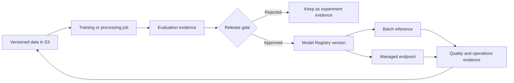
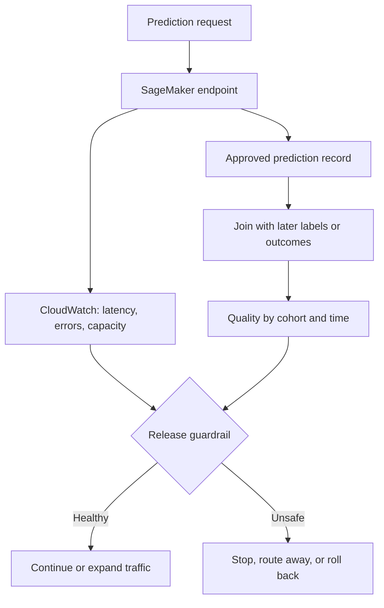

**Amazon SageMaker AI** is AWS's managed platform for training, registering, deploying, and monitoring machine-learning models. It supplies AWS resources for the ML lifecycle so a team does not have to build every job runner, registry service, and inference control plane itself.

That description can sound like “one service that does MLOps.” The useful view is more precise. SageMaker AI is a collection of managed resources. A training job, pipeline, model package, endpoint, and monitoring job each have a different lifecycle. Amazon operates the underlying control plane. Your team still decides what data is valid, what model is good enough, who may approve it, how traffic moves, and what customer outcome proves the release is healthy.

AWS renamed the former Amazon SageMaker service to **Amazon SageMaker AI** in December 2024. The broader Amazon SageMaker product name now covers a wider data, analytics, and AI platform. Existing service APIs and the AWS CLI namespace continue to use `sagemaker`. This article focuses on SageMaker AI resources used for predictive-ML training and deployment.

## Start With The Lifecycle, Not The Console
<!-- section-summary: SageMaker AI is easier to understand as a chain of managed resources that carry a model from versioned data to an operated prediction workload. -->

A production model moves through several distinct states. Data is prepared, code runs in a controlled environment, evaluation evidence is produced, a candidate receives a stable identity, an approved candidate is released, and production behaviour is monitored. SageMaker AI has resources for most of those transitions.



The arrows matter as much as the boxes. A pipeline moves references and evidence between resources; it does not magically make those references trustworthy. A registry approval is useful only when the package points to an immutable model artifact, a known inference image, and the evaluation report used for the decision. An endpoint is safe only when the release workflow knows which model version it loaded and how to restore the previous one.

This lifecycle also shows why adopting SageMaker AI does not require adopting every SageMaker feature. A team may use managed training jobs and Model Registry while serving on EKS. Another may train on an existing Kubernetes platform and use SageMaker endpoints for online inference. The architecture should follow the responsibilities the platform improves.

## Understand The Two Ownership Planes
<!-- section-summary: AWS runs the managed control plane, while the customer owns model meaning, access boundaries, release policy, and product outcomes. -->

Managed ML platforms divide work between a **provider plane** and a **team plane**.

The provider plane creates compute, starts containers, records resource state, replaces unhealthy endpoint instances, exposes APIs, and integrates with services such as IAM, S3, ECR, CloudWatch, KMS, and EventBridge. This removes a large amount of undifferentiated infrastructure work.

The team plane supplies the decisions that AWS cannot infer:

| Responsibility | What SageMaker AI can manage | What the team must define |
| --- | --- | --- |
| Training | Isolated jobs, instance lifecycle, logs, output upload | Code, data contract, image, resources, retry safety |
| Evaluation | Pipeline steps and stored metrics | Cohorts, metrics, thresholds, uncertainty, reviewer |
| Registration | Versioned model packages and approval status | Package completeness and approval policy |
| Serving | Endpoint resources, variants, scaling, health metrics | Request contract, traffic policy, capacity target, fallback |
| Monitoring | Data capture and scheduled monitoring jobs | Baseline, label join, business guardrails, response playbook |
| Security | IAM integration, encryption and network controls | Least-privilege roles, data classification, trust boundaries |

This boundary prevents a common mistake: treating a green AWS resource status as proof that the model is good. An endpoint can be `InService` while the model produces harmful predictions. A training job can complete successfully after reading the wrong dataset. Resource health and model quality are separate kinds of evidence.

## Map The Main Resources To Their Jobs
<!-- section-summary: Training jobs, Pipelines, Model Registry, and inference resources solve different lifecycle problems and should have explicit handoff contracts. -->

### Training and processing jobs

A **training job** asks SageMaker AI to run a training container with declared data channels, compute, storage, and an IAM execution role. SageMaker provisions the compute, runs the container, streams logs, uploads output artifacts, and tears the compute down. A **processing job** provides a similar boundary for data preparation, evaluation, or other batch processing.

The durable unit is the job specification plus its inputs and outputs. For reproduction, record the container image digest, source commit, dataset snapshot, configuration, instance type, and random controls. A job name alone cannot reproduce a run.

The execution role is part of the experiment boundary. A training role usually needs read access to approved input prefixes and write access to a run-specific output prefix. It should not also have permission to change production endpoints. Separating training and deployment roles limits what compromised code can do.

### SageMaker Pipelines

**SageMaker Pipelines** represents an ML workflow as steps and dependencies. Typical steps prepare data, train, evaluate, apply a condition, and register an accepted candidate. Pipelines can cache eligible steps and retry some failures, but the author still has to decide whether an operation is safe to repeat.

A pipeline is most valuable when its step contracts are explicit. The training step should emit a model artifact URI and run identity. The evaluation step should consume that exact artifact and emit a versioned report. The registration step should receive both. Passing “latest model” between steps creates a race that orchestration cannot repair.

### Model Registry

**SageMaker Model Registry** groups model versions into a model package group. A model package can carry artifact and inference-image references, supported content types, metrics, metadata, and an approval status. It is the handoff between model creation and release.

Treat the registry as a release boundary. The useful question is not “Was a file uploaded?” It is “Does this version contain enough evidence for a deployment workflow to make a safe decision?” At minimum, a release candidate needs immutable artifact and image references, a model signature or request contract, evaluation results, data and code lineage, ownership, and a rollback target.

Approval status should reflect a real authority decision. Automation may verify thresholds and assemble evidence. A policy owner may still need to approve high-impact models. For lower-risk models, a policy engine can approve automatically when every required check is machine-verifiable.

### Inference resources

SageMaker AI supports several inference patterns. **Real-time endpoints** serve interactive requests. **Asynchronous inference** accepts requests that can wait and may have larger payloads or longer processing times. **Batch Transform** processes bounded datasets without keeping an endpoint running. Serverless and multi-model options fit narrower traffic and cost shapes.

Choose from workload requirements first: response deadline, arrival pattern, payload size, model-loading time, isolation needs, accelerator use, scale-to-zero tolerance, and cost. “Use a real-time endpoint because it is the default tutorial” is weak architecture.

For real-time endpoints, a model resource combines a model artifact with an inference container. An endpoint configuration declares production variants and capacity. The endpoint points to that configuration. This indirection supports controlled updates and a clear previous configuration for rollback.

## Follow One Candidate Through The Boundary
<!-- section-summary: A small release manifest shows how identities connect across data, training, evaluation, registry, and serving without turning the example into the article structure. -->

Consider a demand-forecast model. The release workflow does not need a huge script to explain its core contract. It needs a manifest that connects the evidence:

```yaml
model_family: demand-forecast
candidate_id: demand-2026-07-15-a1b2c3d
training_job: demand-train-2026-07-15-a1b2c3d
code_commit: a1b2c3d
training_image: 123456789012.dkr.ecr.eu-west-2.amazonaws.com/demand-trainer@sha256:7c8d...
dataset_uri: s3://ml-prod/demand/snapshots/2026-07-14/
model_artifact_uri: s3://ml-prod/demand/runs/demand-2026-07-15-a1b2c3d/model.tar.gz
evaluation_uri: s3://ml-prod/demand/runs/demand-2026-07-15-a1b2c3d/evaluation.json
registry_group: demand-forecast
approval_status: PendingManualApproval
rollback_package_version: "41"
```

Every field answers an operational question. Which code and data created the candidate? Which exact image ran? Where is the model? Which report supports approval? Which model family owns the version? What can production restore?

After registration, a reviewer or policy service checks the evaluation report, segment results, cost, limitations, and evidence completeness. Approval changes the candidate's release eligibility; it does not deploy it by itself. A separate deployment workflow resolves the approved package version, creates a new endpoint configuration, sends a small traffic share to it, and watches release guardrails.

This separation is deliberate. Training code cannot quietly approve and deploy itself. Registry state captures the decision. Deployment state captures the traffic change. The audit trail can then answer who made each transition.

## Design Monitoring As Two Joined Views
<!-- section-summary: Endpoint health and prediction quality use different signals, different clocks, and often different owners. -->

CloudWatch exposes service signals such as invocation errors, latency, instance health, and resource utilization. SageMaker Model Monitor can run checks against captured inference data and configured baselines. These mechanisms cover different questions.

**Service monitoring** asks whether the endpoint can respond within its reliability target. **ML monitoring** asks whether inputs, outputs, and later outcomes still support the model's purpose. The second view may wait hours or weeks for labels. It also needs cohort analysis; an overall average can hide failure for one region or customer group.



Monitoring design should name the join key, label delay, baseline window, minimum sample size, and owner for each alert. Model Monitor cannot invent a meaningful business outcome from unlabeled requests. It can identify changes worth investigating; the product-quality loop still has to connect predictions with what happened later.

## Security And Recovery Are Architecture, Not Setup Tasks
<!-- section-summary: IAM, immutable references, network paths, and rollback state determine what a SageMaker workflow can safely do. -->

Use separate roles for training, registration, and deployment. CI systems should obtain short-lived AWS credentials through workload identity such as GitHub Actions OIDC, with trust policies scoped to the repository and environment. Encrypt data and artifacts, keep secrets in an approved secrets service, and use private network paths where the data classification requires them.

Pin container images by digest and give datasets immutable identities. Mutable tags and moving S3 prefixes weaken both audit and rollback. Tag resources with model family, candidate or release ID, source commit, dataset identity, owner, environment, and cost centre so operational evidence can be joined later.

Recovery needs more than “deploy the old model.” Record the previous model-package version, inference image, endpoint configuration, request schema, feature contract, and traffic state. If a service loads a registry reference only at startup, moving an alias or approval status will not change already-running containers. The runbook must match the actual loading path.

## Decide Whether SageMaker AI Is The Right Platform Weight
<!-- section-summary: SageMaker AI is justified when its managed lifecycle resources remove recurring work without hiding ownership or creating disproportionate coupling. -->

SageMaker AI is a strong fit when workloads and governed data already live on AWS, many teams need repeatable training and release paths, IAM and private networking are important, or the platform team wants managed job, registry, and endpoint control planes.

A lighter stack may fit a small number of scheduled models, teams that already operate a capable batch and container platform, or workloads whose serving architecture does not align with SageMaker hosting. AWS Batch, ECS, EKS, Step Functions, MLflow, and S3 can form a valid MLOps stack. The trade-off is that the team owns more integration and operational behaviour.

Evaluate the platform with one real path. Measure how it handles data identity, job isolation, evaluation evidence, promotion, endpoint performance, rollback, private access, observability, quota, cost attribution, and operator effort. The result should show which responsibilities SageMaker AI improves and which responsibilities remain elsewhere.

## The Durable Picture
<!-- section-summary: SageMaker AI is a managed resource layer inside a wider MLOps system whose evidence and decisions remain team-owned. -->

S3, training jobs, Pipelines, Model Registry, endpoints, and monitoring resources can form a coherent AWS-native lifecycle. The coherence comes from the identities and policies that connect them: an immutable dataset, a pinned image, a specific training run, a complete evaluation packet, an approved model package, a measured traffic change, and a known recovery state.

That is the beginner's big picture. SageMaker AI operates useful infrastructure around the model. The team operates the meaning of the system.

## References

- [What is Amazon SageMaker AI?](https://docs.aws.amazon.com/sagemaker/latest/dg/whatis.html)
- [Train a model with Amazon SageMaker AI](https://docs.aws.amazon.com/sagemaker/latest/dg/train-model.html)
- [Amazon SageMaker Pipelines](https://docs.aws.amazon.com/sagemaker/latest/dg/pipelines.html)
- [Amazon SageMaker Model Registry](https://docs.aws.amazon.com/sagemaker/latest/dg/model-registry.html)
- [Real-time inference](https://docs.aws.amazon.com/sagemaker/latest/dg/realtime-endpoints.html)
- [Inference options in Amazon SageMaker AI](https://docs.aws.amazon.com/sagemaker/latest/dg/deploy-model-options.html)
- [Test models with production variants](https://docs.aws.amazon.com/sagemaker/latest/dg/model-ab-testing.html)
- [Amazon SageMaker Model Monitor](https://docs.aws.amazon.com/sagemaker/latest/dg/model-monitor.html)
- [SageMaker events in Amazon EventBridge](https://docs.aws.amazon.com/sagemaker/latest/dg/automating-sagemaker-with-eventbridge.html)
- [GitHub Actions OIDC for AWS](https://docs.github.com/en/actions/how-tos/secure-your-work/security-harden-deployments/oidc-in-aws)
