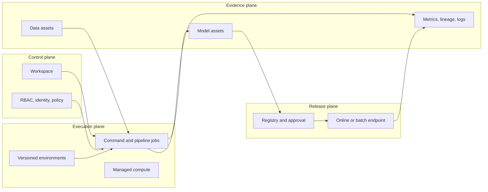
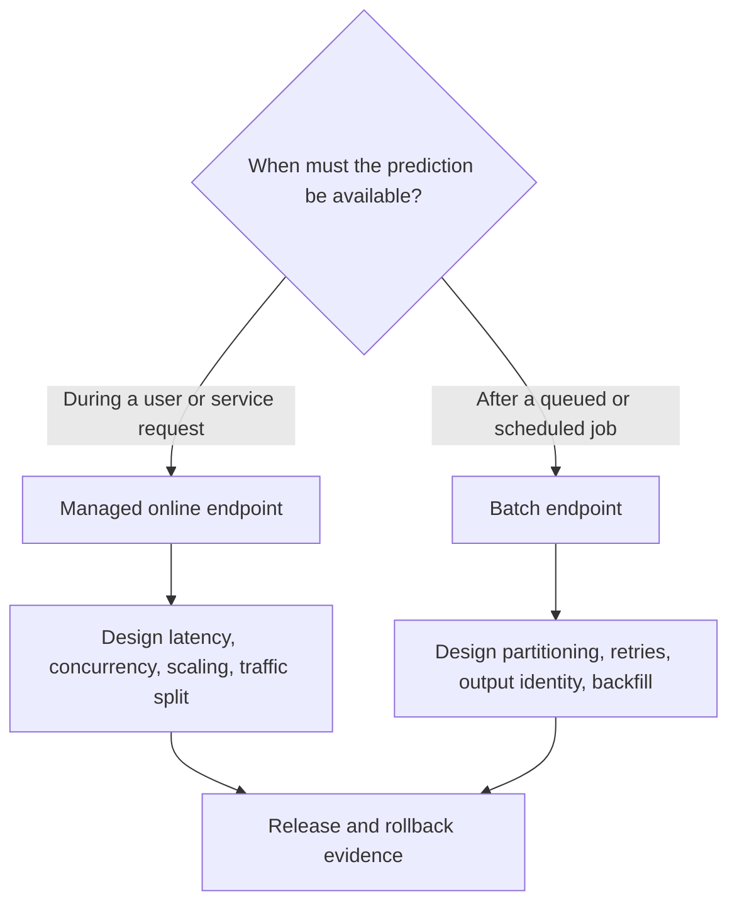
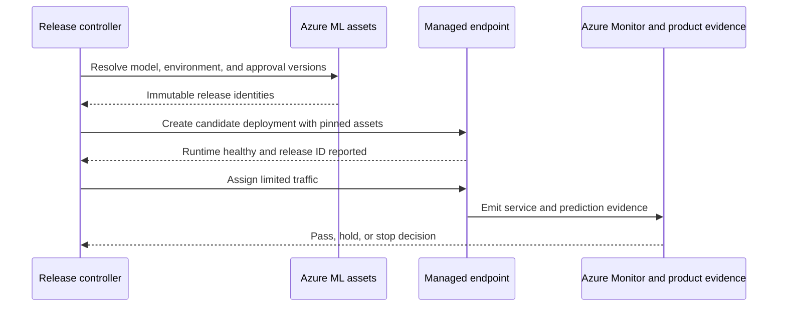

**Azure Machine Learning** is Microsoft's managed platform for building, training, registering, deploying, and operating machine-learning models on Azure. It provides a control plane around model development: workspaces, versioned assets, managed jobs, pipeline components, registries, endpoints, identities, and monitoring integrations.

The shortest product tour lists those resources. A useful beginner explanation shows why they exist and how they connect. Azure ML should make a production run easier to identify, repeat, review, release, and recover. It cannot decide whether the data represents the business problem, whether the metric protects the right groups, or whether the product should act on the prediction.

This article covers Azure ML CLI and SDK **v2**, the current interface family. The earlier v1 CLI has already reached end of support, and SDK v1 support ends on June 30, 2026. For generative-AI application and agent development, Microsoft currently directs teams toward Microsoft Foundry; Azure Machine Learning remains a comprehensive platform for traditional predictive ML, custom training, and end-to-end MLOps.

## See The Platform As Four Connected Planes
<!-- section-summary: Azure ML combines control, execution, evidence, and release planes, each with a different responsibility and failure mode. -->

Group Azure ML resources by purpose so their relationships stay clear.



The **control plane** says where the work belongs and who may change it. The **execution plane** says where code runs and with which dependencies. The **evidence plane** identifies inputs, outputs, and observed results. The **release plane** governs the transition from a reviewed candidate to a prediction workload.

These planes can fail independently. A training job may run successfully with a moving data path. A model asset may exist with no useful evaluation evidence. An endpoint may be technically healthy while the product receives poor predictions. Separating the planes helps an operator ask the right question.

## The Workspace Defines A Collaboration Boundary
<!-- section-summary: A workspace groups Azure ML resources for a product or team, while Azure subscriptions, resource groups, regions, and policies define the wider platform boundary. -->

An Azure ML **workspace** is the main container for jobs, experiments, compute, environments, data assets, models, endpoints, and connections. It gives these resources a shared discovery and access boundary.

A workspace should follow ownership and environment boundaries. Many organizations use separate development, staging, and production workspaces because production endpoints, secrets, data access, and approvals need tighter controls. A single workspace for an entire enterprise makes permissions and cost attribution difficult. A workspace per individual experiment creates needless fragmentation. Product area plus environment is a common starting point.

The workspace does not contain all underlying bytes. A data asset may reference Azure Blob Storage or Azure Data Lake Storage. A model asset may reference managed storage. Compute resources run outside the workspace's logical metadata boundary. Azure role-based access control, managed identities, private endpoints, DNS, storage rules, and Key Vault connections determine whether those resources can interact.

That distinction is important for incident work. “I can see the model in Azure ML” does not prove the serving identity can read its storage path. “The job is in the workspace” does not prove its identity has only the minimum permissions.

## Assets Give Moving Data And Code Stable Identities
<!-- section-summary: Versioned data, environment, component, and model assets let jobs refer to reviewed inputs instead of mutable paths and local setup. -->

Azure ML uses **assets** to make important ML inputs and outputs discoverable and versioned.

A **data asset** identifies data used by jobs. Depending on its type, it may point to files, folders, or tabular data. The asset version should resolve to a stable snapshot. Versioning a pointer to a mutable folder does not freeze the underlying data, so the storage and publishing process still matter.

An **environment** identifies the runtime: base image, Python or Conda dependencies, and other execution requirements. Reproduction is strongest when the base image and packages resolve immutably. A friendly environment label such as `sklearn-prod:8` aids discovery; a lockfile and image digest provide stronger replay evidence.

A **component** packages one reusable pipeline step with its command, inputs, outputs, code, and environment. Components make a pipeline modular because each step exposes a contract. They do not automatically make the step deterministic. A component that reads “latest” data or writes to a shared output path remains difficult to reproduce.

A **model asset** identifies a trained artifact and associated metadata. Registration should connect the model to its training job, data version, code commit, environment, signature, evaluation report, owner, and intended use. Without that chain, the registry is only a file catalogue.

## Jobs And Pipelines Create Repeatable Executions
<!-- section-summary: Command jobs run one declared unit of work, while pipeline jobs coordinate component contracts and preserve the run graph. -->

A **command job** runs a command in a declared environment on selected compute with named inputs and outputs. It is the fundamental execution boundary for custom training. The job record captures status and metadata while Azure manages compute allocation and logs.

A **pipeline job** connects component jobs through their inputs and outputs. The graph should express data and artifact dependencies directly. If evaluation consumes the model emitted by training, the pipeline can show and record that relationship. If two steps communicate through a shared hard-coded storage path, the important dependency stays hidden.

The framework has three levels:

1. **Component contract:** what one step consumes, produces, and guarantees.
2. **Run graph:** which component output feeds which later input.
3. **Release policy:** which outputs and evidence allow a model to move forward.

Retries and reuse require care. A training step that writes to a run-specific location can usually retry safely. A registration or deployment step changes shared state and should use a stable candidate identity, check current state, and reconcile partial completion before repeating.

One compact job definition shows the boundary more clearly than a long CLI walkthrough:

```yaml
$schema: https://azuremlschemas.azureedge.net/latest/commandJob.schema.json
command: >-
  python train.py
  --data ${{inputs.training_data}}
  --model-output ${{outputs.model_dir}}
code: ../../src
environment: azureml:forecast-training@latest
compute: azureml:cpu-training
inputs:
  training_data:
    path: azureml:forecast-snapshot:2026-07-14
    type: uri_folder
outputs:
  model_dir:
    type: uri_folder
```

This fragment declares code, environment, compute, a versioned data input, and a named output. A production version should replace mutable environment labels with a controlled version or immutable build identity and attach source and policy metadata to the submitted job.

## Registry And Environments Separate Creation From Release
<!-- section-summary: Workspace model assets support local lifecycle work, while registries support controlled reuse and promotion across workspaces. -->

Azure ML **registries** provide a shared store for model, component, and environment assets across workspaces. They are useful when several teams or environments need governed reuse. A development workspace can produce and validate a candidate; a production deployment process can consume a version copied or shared through a controlled registry boundary.

Promotion should move the same reviewed asset identity. Rebuilding the container, retraining the model, or resolving a new dependency during production deployment creates a different candidate. The release packet should therefore identify the model asset version, environment or inference image, signature, evaluation evidence, source run, and approval.

Environment separation also applies to configuration and identity. Development jobs may read sampled data and allow rapid iteration. Production training may use governed data and a managed identity. Production deployment should require a distinct authority. Reusing code is desirable; reusing broad permissions is not.

## Choose The Prediction Boundary From The Workload
<!-- section-summary: Managed online endpoints serve interactive requests, while batch endpoints suit asynchronous jobs over bounded inputs. -->

Azure ML **managed online endpoints** host low-latency request-response inference. An endpoint provides a stable invocation boundary, and one or more deployments behind it hold model and environment combinations. Traffic allocation between deployments supports canary or blue-green release patterns.

**Batch endpoints** trigger asynchronous jobs over stored input and suit large or scheduled prediction workloads. They avoid keeping interactive serving capacity running. The right choice follows the product deadline, input location, volume pattern, payload size, model-loading cost, and recovery expectations.



For an online release, keep the previous deployment available while a candidate receives a small traffic share. Watch technical signals and product guardrails. A rollback changes traffic back to the known deployment, then reconciles the declared configuration. Deleting the previous deployment immediately removes the fastest recovery path.

## Identity, Networking, And Observability Complete The System
<!-- section-summary: Managed identities and Azure controls establish access paths, while Azure Monitor and prediction evidence show whether the workload and model remain healthy. -->

Use **managed identities** for jobs and endpoints so workloads can access Azure resources without long-lived credentials in code. Training, serving, and deployment workflows usually deserve different identities because their powers differ. The training identity reads approved data and writes run outputs. The endpoint identity reads approved model or reference data. The release identity may update endpoint traffic.

Private networking changes the full path: workspace dependencies, storage, container registry, Key Vault, compute, endpoint, DNS, and callers. Draw that path before implementation. A private endpoint on one resource does not make every dependency private.

Azure Monitor and workspace logs can expose job and endpoint operations, latency, failures, and resource health. Prediction-quality monitoring needs additional application evidence: model version, request schema version, safe input summaries, output, later label or outcome, and cohort. Service health and model usefulness should appear together in a release dashboard, with owners and response actions named.

## Trace One Release Across The Planes
<!-- section-summary: A release trace verifies that workspace assets, approval, endpoint configuration, and runtime evidence refer to the same candidate. -->

The four-plane framework controls a release. The evidence plane supplies a concrete model version, environment version, source job, evaluation report, and input signature. The control plane verifies that the release identity has permission to change the production endpoint. The release plane creates a candidate deployment and assigns a small traffic share. The execution plane starts containers and reports health.

The release controller should compare desired and actual identities before expanding traffic:

| Evidence point | Required proof |
| --- | --- |
| Candidate record | model, environment, schema, evaluation, and approval versions agree |
| Endpoint configuration | deployment references the reviewed model and environment |
| Runtime startup | logs or health metadata report the expected release identity |
| Canary traffic | requests reach the expected deployment share |
| Recovery state | previous deployment remains healthy and can receive traffic |

Partial failure can occur between any two points. The deployment resource may exist while its identity cannot read the model. Containers may start while the scoring script rejects the production request shape. A traffic update may succeed while the product dashboard still groups results under the old release. The controller should hold the canary, retain the previous deployment, and preserve each resource ID for investigation.



Rollback changes traffic to the retained deployment, then verifies request success and reported model identity. Deleting the failed deployment and evidence comes later, after the incident record links the resource IDs and the team understands the failure.

## Decide Whether Azure ML Fits The Organisation
<!-- section-summary: Azure ML earns its platform weight when Azure-native managed lifecycle resources solve recurring collaboration, governance, and operations problems. -->

Azure ML is a strong fit when data and applications already use Azure, teams need managed custom training and prediction endpoints, Entra identity and Azure Policy are important, or shared assets and registries reduce repeated integration work.

A lighter stack can be enough for a few scheduled models. Existing Azure Batch, AKS, Databricks, MLflow, storage, and CI/CD systems may already cover the needed responsibilities. Platform adoption should solve a visible constraint such as reproducible compute, asset handoff, regulated access, endpoint operations, or multi-team governance.

Evaluate one real lifecycle. Can the team identify the data, code, environment, job, model, approval, deployment, loaded version, monitoring evidence, and rollback target? Measure setup, operator effort, latency, quota, network complexity, cost attribution, and recovery. The answer should make the ownership boundary clearer.

## The Durable Picture
<!-- section-summary: Azure ML supplies managed lifecycle resources; production quality comes from the identities, contracts, policies, and evidence that connect them. -->

The workspace groups the work. Assets identify inputs and outputs. Jobs and pipelines execute declared contracts. Registries carry reviewed versions across boundaries. Endpoints operate prediction workloads. Managed identities and Azure controls restrict access. Monitoring connects resource health with later model outcomes.

Azure ML forms a coherent system when those resources share one traceable chain. A managed platform reduces infrastructure work. The team remains responsible for what the chain means and when it is safe to advance.

## References

- [Azure Machine Learning CLI and SDK v2 concepts](https://learn.microsoft.com/en-us/azure/machine-learning/concept-v2?view=azureml-api-2)
- [How Azure Machine Learning works](https://learn.microsoft.com/en-us/azure/machine-learning/concept-azure-machine-learning-v2?view=azureml-api-2)
- [Azure Machine Learning jobs](https://learn.microsoft.com/en-us/azure/machine-learning/concept-train-machine-learning-model?view=azureml-api-2)
- [Machine learning pipelines](https://learn.microsoft.com/en-us/azure/machine-learning/concept-ml-pipelines?view=azureml-api-2)
- [Azure Machine Learning registries](https://learn.microsoft.com/en-us/azure/machine-learning/concept-machine-learning-registries-mlops?view=azureml-api-2)
- [Managed online endpoints](https://learn.microsoft.com/en-us/azure/machine-learning/concept-endpoints-online?view=azureml-api-2)
- [Batch endpoints](https://learn.microsoft.com/en-us/azure/machine-learning/concept-endpoints-batch?view=azureml-api-2)
- [Access Azure resources from online endpoints with managed identities](https://learn.microsoft.com/en-us/azure/machine-learning/how-to-access-resources-from-endpoints-managed-identities?view=azureml-api-2)
- [Architecture best practices for Azure Machine Learning](https://learn.microsoft.com/en-us/azure/well-architected/service-guides/azure-machine-learning)
- [MLOps v2 architecture](https://learn.microsoft.com/en-us/azure/architecture/ai-ml/guide/machine-learning-operations-v2)
