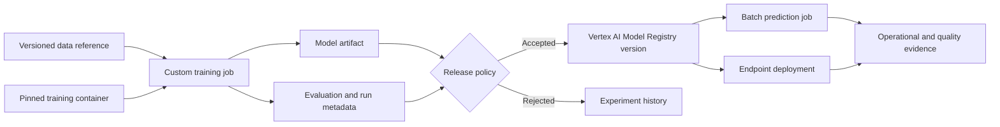
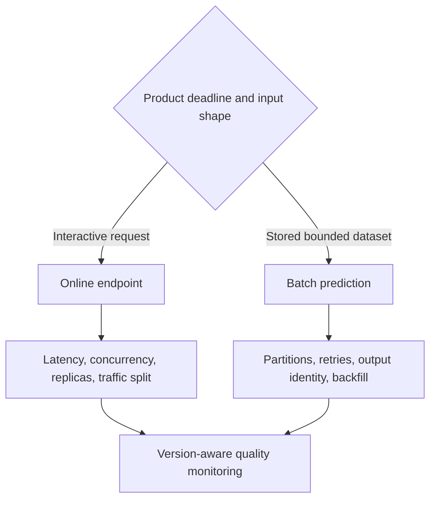
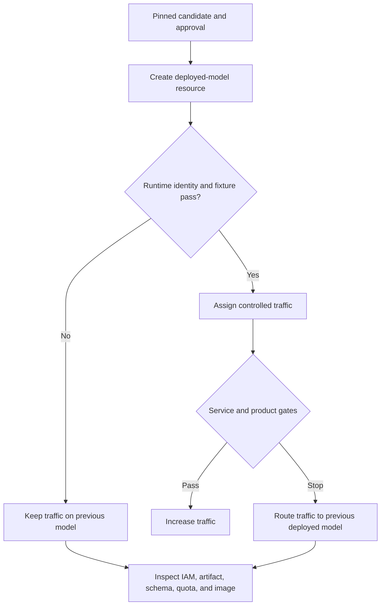

**Vertex AI** is Google Cloud's managed platform for training and deploying ML models and AI applications. For predictive ML, its main production resources include custom training jobs, pipeline jobs, experiment and metadata records, Model Registry versions, batch prediction jobs, and online endpoints.

The product surface is large because it covers several kinds of work. A beginner does not need to memorize every service. The first task is to see the boundary: Vertex AI coordinates managed ML resources inside a wider Google Cloud system. Data may live in Cloud Storage or BigQuery. Containers may live in Artifact Registry. Identities come from IAM. Logs and metrics flow into Cloud Logging and Cloud Monitoring. Product outcomes usually live in application databases or analytics systems.

Vertex AI manages infrastructure and resource state. The team defines data meaning, evaluation policy, access, release authority, request contracts, outcome monitoring, and recovery.

## Follow The Evidence Chain
<!-- section-summary: Vertex AI resources form a chain from a stable data reference through managed execution and review to an operated prediction workload. -->

The central MLOps question is: can the team connect the prediction in production to the exact evidence that allowed it to ship?



Each transition needs a contract. Training consumes identified data and code. Evaluation consumes the candidate produced by that run. Registration preserves the same artifact identity and its evidence. Deployment resolves an approved model version. Monitoring records which version produced each prediction.

Vertex AI can store and connect much of this metadata. It cannot repair an architecture that passes mutable names such as `latest.csv`, `main`, or `model:latest` between stages. Stable identities are a team design choice.

## Separate Managed Resources From Team Decisions
<!-- section-summary: Google operates the Vertex AI control plane, while the customer owns the model's purpose, contracts, release rules, and response to harm. -->

| Lifecycle area | Managed Vertex AI capability | Team-owned decision |
| --- | --- | --- |
| Development | Workbench and experiment integrations | Research method, code review, data access |
| Training | Custom jobs, managed compute, hyperparameter tuning | Dataset snapshot, image, resources, stopping rule |
| Orchestration | Vertex AI Pipelines and task state | Component contracts, retry safety, gates |
| Registration | Model Registry versions and aliases | Evidence completeness, approval authority |
| Prediction | Batch jobs and managed endpoints | Serving pattern, schema, capacity, traffic policy |
| Monitoring | Logs, metrics, Model Monitoring capabilities | Baseline, cohorts, label join, action threshold |
| Security | IAM, service accounts, encryption and network integration | Least privilege, trust boundaries, data classification |

The ownership split is operationally useful. If a custom job fails to start, inspect resource, quota, image, and identity evidence. If it completes with a weak model, inspect data and evaluation. If an endpoint reports healthy instances while users receive bad decisions, inspect the model-quality and product-outcome loop.

## Custom Training Creates A Managed Run Boundary
<!-- section-summary: A custom training job combines code, container, data references, compute, identity, outputs, and status into one managed execution. -->

A **custom training job** runs user-supplied training code on managed compute. The code can use a prebuilt training container or a custom container from Artifact Registry. The job specification selects machine and accelerator types, worker topology, region, service account, and output locations.

For repeatability, capture more than the successful job ID. Record:

- the source commit and training entry point;
- the container image digest and dependency lock;
- immutable training and validation data references;
- job configuration, random controls, and hardware shape;
- output artifact URI and evaluation report;
- the service account and relevant data boundary.

The service account is part of the run's capability boundary. A training job that reads curated features should not also have permission to deploy endpoints or overwrite governed source data. Separate training and release identities make the lifecycle easier to review.

Distributed training adds another layer. The job spec declares several worker pools or replicas, while the training framework coordinates them. Vertex AI can allocate the workers; the team still owns checkpointing, collective behaviour, failure recovery, and whether the selected topology is efficient for the model.

## Pipelines Coordinate Contracts, Not Arbitrary Scripts
<!-- section-summary: Vertex AI Pipelines records a component graph and run state, while the author defines deterministic inputs, outputs, cache behaviour, and side-effect safety. -->

**Vertex AI Pipelines** runs ML workflows described using Kubeflow Pipelines or TensorFlow Extended-compatible pipeline definitions. A pipeline compiles component contracts into a graph that Vertex AI executes and records.

The useful abstraction is a component with named inputs and outputs. A preparation component emits a dataset reference. Training emits a model artifact. Evaluation emits a report and decision inputs. Registration consumes the exact artifact and report. The graph exposes the handoff instead of relying on hidden shared paths.

Caching can reduce repeated work when a component's output is a pure function of its declared inputs and implementation. It is unsafe when a step reads current time, a mutable table, or an undeclared external system. Disable or carefully key caching for those steps.

Retries deserve the same reasoning. Recomputing an evaluation file in a run-specific path is usually safe. Re-registering, redeploying, or sending a notification changes shared state. Side-effecting components need stable operation IDs and current-state checks so a retry converges instead of duplicating an action.

Pipeline schedules and event triggers should reflect data readiness. A daily timer does not prove the latest partition is complete. A production trigger should identify the input snapshot and validate its completeness before expensive training starts.

## Model Registry Is The Release Handoff
<!-- section-summary: Model Registry gives candidates durable versions and aliases, while release policy decides which version may receive traffic. -->

**Vertex AI Model Registry** stores model resources and versions, including custom-trained models and supported models from other Google Cloud workflows. A registered version can later be deployed to an endpoint or used for batch prediction.

A good registry entry answers:

- Which model family and intended use does this version belong to?
- Which training run, code, image, and data created it?
- Which interface and feature schema does it expect?
- Which metrics, cohorts, and robustness checks passed?
- Who or what approved the candidate?
- Which previous version is the recovery target?

Aliases such as a default or production label make consumers easier to configure, yet the audit record must retain the concrete version. Alias movement should be an explicit release event. A service that loads a model only during deployment will not change merely because a registry alias changes; the release design has to match the runtime loading mechanism.

One release record can connect the important identities without a full SDK walkthrough:

```yaml
release_id: fraud-graph-2026-07-15-a1b2c3d
project: payments-ml-prod
region: europe-west4
training_job: fraud-graph-train-20260715
training_image: europe-west4-docker.pkg.dev/payments-ml/train/fraud@sha256:81e7...
dataset_snapshot: bq://payments_ml.features_fraud@1752537600000
model_artifact: gs://payments-ml-prod/models/fraud-graph/2026-07-15/model/
evaluation_report: gs://payments-ml-prod/evals/fraud-graph/2026-07-15.json
registry_model: fraud-graph
registry_version: "27"
previous_serving_version: "26"
approval: approved
```

The names are illustrative. The structure is the lesson: a release ties execution, evidence, registry state, and recovery together.

## Batch And Online Prediction Solve Different Problems
<!-- section-summary: Batch prediction processes bounded stored inputs, while endpoints keep model servers ready for interactive calls. -->

A **batch prediction job** reads input from supported storage, runs predictions asynchronously, and writes outputs. It fits scheduled scoring, large backfills, and workloads whose consumers can wait. Design it around partition identity, safe retries, output locations, partial failure, and backfill cost.

An **endpoint** hosts one or more deployed models for online prediction. Deployments choose compute, replica bounds, accelerator, container, and traffic share. Endpoint design includes the request and response contract, authentication, latency budget, concurrency, autoscaling signal, model-loading behaviour, and overload response.



For an endpoint release, deploy the candidate beside the current model and send it a controlled traffic share where the product and model semantics permit. Watch latency, errors, saturation, score distribution, guardrail outcomes, and later labels. Keep the previous deployed model available until the rollback window closes.

## Monitoring Must Join Cloud Signals With Product Outcomes
<!-- section-summary: Cloud Monitoring shows resource and request health, while prediction records and later outcomes show whether the model remains useful. -->

Cloud Logging and Cloud Monitoring capture job, endpoint, and infrastructure evidence. Vertex AI Model Monitoring can help detect supported forms of feature skew and drift. Those signals reveal changes; they do not by themselves establish business harm or model correctness.

A prediction record should carry a request or entity key, timestamp, concrete model version, feature or schema version, safe input summaries, output, and latency. Later, a controlled pipeline joins it to labels or product outcomes. Quality is then calculated by cohort and time window with enough sample size to support a decision.

The release dashboard should show both clocks. Service errors and latency arrive immediately. Fraud confirmation, returns, churn, or demand accuracy may arrive later. An alert needs an owner and action: hold traffic, route to the previous model, disable an automated action, investigate data, or schedule retraining.

## Design Recovery Across Managed Resource Boundaries
<!-- section-summary: Recovery follows the concrete data, job, model, endpoint, and identity resources because each managed boundary can fail independently. -->

Managed resources remove infrastructure work, yet they can still disagree about lifecycle state. A pipeline may finish after registration fails. A model version may exist while its artifact path is unreadable by the endpoint service account. An endpoint operation may report success while traffic still reaches the previous deployed model. A monitoring job may run against the wrong baseline.

The recovery design should record a concrete identity at every handoff:

| Boundary | Identity to retain | Recovery action |
| --- | --- | --- |
| Data to training | snapshot or table version and manifest digest | rerun against the same data or quarantine the snapshot |
| Training to evaluation | custom-job ID and model artifact digest | resume from a known checkpoint or start a linked replacement run |
| Evaluation to registry | report identity and registry version | retry registration idempotently or reject incomplete version |
| Registry to endpoint | model version, image, schema, and deployment ID | hold traffic until runtime identity agrees |
| Endpoint to monitoring | endpoint, deployed-model, release, and baseline IDs | repair attribution before making a quality decision |



Rollback should reference the previous deployed model and its complete release unit. The controller changes traffic, confirms the endpoint reports the expected version, runs known request fixtures, and records the incident against the candidate. Registry aliases can update after the runtime transition has been verified; an alias change alone cannot restore a running endpoint.

Quota and regional capacity also belong in recovery planning. A candidate may request unavailable accelerator capacity, or a regional control-plane issue may block updates. Teams that require a strict recovery time need tested capacity, a safe previous deployment, and a regional strategy that matches their availability goal.

## Decide Whether Vertex AI Is The Right Weight
<!-- section-summary: Vertex AI fits teams that benefit from Google Cloud-native managed execution and lifecycle integration more than they pay in coupling and platform complexity. -->

Vertex AI is a strong fit when governed data already lives in BigQuery or Cloud Storage, teams need managed custom training and endpoints, IAM and regional controls are central, or several models need a shared pipeline and registry path.

Existing systems may already cover the need. GKE, Cloud Run, Batch, Composer, MLflow, and data-platform tooling can form a capable MLOps architecture. Vertex AI should remove recurring work or improve governance; adopting it only to follow a reference diagram creates extra concepts without solving a real constraint.

Test one representative lifecycle. Follow data identity, training isolation, metadata, evaluation, registration, prediction, monitoring, rollback, permissions, quota, and cost. The platform is justified when that path is clearer and easier to operate.

## The Durable Picture
<!-- section-summary: Vertex AI is the managed ML resource layer; stable identities and explicit policies turn those resources into an MLOps system. -->

Custom jobs execute declared training work. Pipelines connect component contracts. Metadata and experiments preserve run evidence. Model Registry carries reviewed versions. Batch jobs and endpoints deliver predictions. IAM, logging, monitoring, and product data complete the production boundary.

The architecture works when one traceable chain connects those resources. The platform operates the managed machinery. The team owns the decision system built with it.

## References

- [Introduction to Vertex AI](https://cloud.google.com/vertex-ai/docs/start/introduction-unified-platform)
- [Vertex AI custom training overview](https://cloud.google.com/vertex-ai/docs/training/overview)
- [Introduction to Vertex AI Pipelines](https://cloud.google.com/vertex-ai/docs/pipelines/introduction)
- [Vertex ML Metadata](https://cloud.google.com/vertex-ai/docs/ml-metadata/introduction)
- [Vertex AI Model Registry introduction](https://cloud.google.com/vertex-ai/docs/model-registry/introduction)
- [Deploy a model to an endpoint](https://cloud.google.com/vertex-ai/docs/predictions/deploy-model-api)
- [Get batch predictions](https://cloud.google.com/vertex-ai/docs/predictions/get-batch-predictions)
- [Vertex AI Model Monitoring overview](https://cloud.google.com/vertex-ai/docs/model-monitoring/overview)
- [Use custom service accounts for custom training](https://cloud.google.com/vertex-ai/docs/training/custom-service-account)
- [Google Cloud MLOps: continuous delivery and automation pipelines](https://cloud.google.com/architecture/mlops-continuous-delivery-and-automation-pipelines-in-machine-learning)
